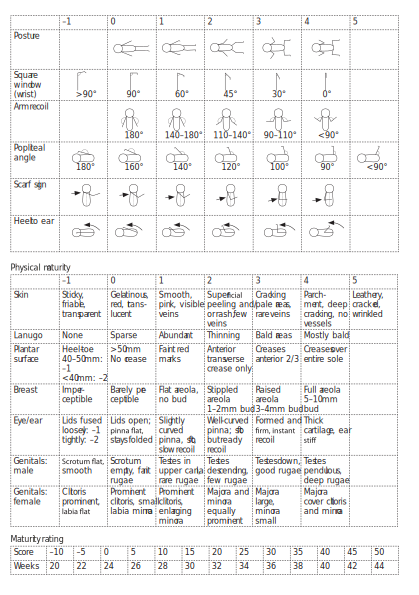
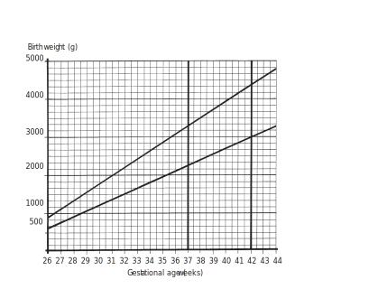

# Bettercare

This repo and [its GitHub Pages](http://electricbookworks.github.io/bettercare/) site is for Bettercare content-development only. Do not use this content for medical purposes. Please visit http://bettercare.co.za for up-to-date and complete versions of our books.

## The workflow

To make Bettercare books, we use the [EBW Book Framework](http://github.com/electricbookworks/book-framework). It's relatively easy for non-technical people to edit, includes great version control, produces books fast (no weeks laying out pages in InDesign), and instantly spits out HTML we can use for the web, ebooks, our apps, and print. By print, we mean high-end books you buy in a store, not just 'save as PDF'.

Essentially:

*	we store our master files as markdown;
*	we create HTML from that, as needed, using Jekyll.

This workflow is powerful enough to produce neat HTML we can use flexibly, and markdown is simple enough that non-technical people can create and edit it.

We keep our master content files in markdown, structured for Jekyll, on GitHub. Bettercare is here:

[https://github.com/electricbookworks/bettercare](https://github.com/electricbookworks/bettercare)

We use the [kramdown syntax](http://kramdown.gettalong.org/) for our markdown, because it's what GitHub uses. (Among other things, kramdown supports classes, so we can get almost everything we need for neat HTML. For complex tables and for figures, we use HTML inside the markdown docs.) 

Then we let GitHub Pages publish the static HTML output, which it does automatically using Jekyll. Bettercare content then appears here:

[http://electricbookworks.github.io/bettercare/](http://electricbookworks.github.io/bettercare/)

Publishing with GitHub Pages works for Bettercare because its content is open-licensed (CC-BY-NC-ND). (In future, we'll make this GitHub Pages site prettier and we may use it instead of or in addition to Scribd for online reading ([which we do currently](http://bettercare.co.za/books/newborn-care/)).)

If you click through to a book chapter on our GitHub Pages view, you'll see the HTML we get from kramdown is very simple. For example:

[http://electricbookworks.github.io/bettercare/nc/nc-1.html](http://electricbookworks.github.io/bettercare/nc/nc-1.html)

The key to simple HTML is mapping our books' features to HTML elements, so that we need very few classes. This way we can very easily use the same HTML with simple stylesheets for the web, our app, epub, and output to print PDF using PrinceXML. And our HTML content will remain readable in readers and low-bandwidth browsers that don't support publisher CSS.

## Converting a Bettercare chapter to Markdown

This is for Bettercare team members, but may contain useful tips to others working on similar material.

### Before you start

* Read the instructions for [EBW Book Framework](http://github.com/electricbookworks/book-framework).
* Read through all these notes, including the tips at the end. You may not understand it all at first, but you need to plant all these seeds in your brain for when you need them.
* Have the [Markdown syntax reference](http://daringfireball.net/projects/markdown/syntax) to hand.
* For more advanced syntax (including for tables), see the [kramdown syntax](http://kramdown.gettalong.org/syntax.html) and kramdown [quick reference](http://kramdown.gettalong.org/quickref.html).
* Use a good text editor like Notepad++.
* Set your default character encoding for your documents to 'UTF without BOM'. (We use GitHub Pages with Jekyll to create our HTML, and Jekyll can break if we don't.)
* Refer to earlier chapters already done to see how things were handled there.
* To check how small bits of markdown will convert to HTML, use the [online pandoc tryout](http://johnmacfarlane.net/pandoc/try). If you know how to set up a local Jekyll site or quick pandoc conversion to HTML, do that to see what your Markdown does in HTML as you work. Note: GitHub Pages, and possibly your Jekyll install, use kramdown, which parses markdown slightly differently to pandoc's default. So you might get different results in each, especially with tables. Jekyll with kramdown matters most.

### Process

Always remember how important your work is here: these books literally save lives. And mistakes in them could have real consequences, even if they only mean a nurse doesn't learn something important when she should have. So be meticulous. If you're converting or updating a book, this is also an opportunity to look out for errors and glitches in the previous edition.

1.	Open the InDesign file and copy all the text
1.	Paste the text with formatting into your text editor. (Note: the suggested S&Rs here were tested in Notepad++, and may work differently in other editors.)
1.	Search and replace (S&R) all line breaks with double line breaks:
	* Tick 'Regular expression' (because you're using the regex \n to mean 'line break', not actually searching for the characters 'slash' and 'lowercase en').
	* Find `\n`
	* Replace with `\n\n`
1.	Format the Notes as markdown 'definitions'. (They'll become dl/dt/dd HTML elements after conversion.) To do this, tick 'Match case' and S&R double line-break–note–space, and replace with double-line-break–Note–line-break–colon–tab. As with all S&Rs, it's best not to use 'Replace all' unless you're 100 per cent sure your search won't match things you don't intend it to. Always run an S&R manually through whole documents a few times before using 'Replace all'. This has worked well for me before:
	*	Find `\n\nnote\s`
	*	Replace with `\n\nNote\n:\t`
	*	**But** remember this won't catch Notes that have two or more paragraphs, ir include items like tables or lists. Do a quick search through the InDesign file to look for those and mark them down manually.
1.	Comparing to a laid-out, up-to-date version of the book, mark all headings with hashes (#) according to their heading level. Using S&R, start with the h3 (article) heads, so that you can then navigate the doc easily by those numbers.
	*	chapter title is h1 = `#`
	*	subunit head is h2 = `##`
	*	article head (question) is h3 = `###`. To S&R here, luckily all article heads start with the chapter number and a hyphen. So if you're working on chapter 3, find `\n\n3-` and replace with `\n\n### 3-`. Don't use 'Replace all' in case there is a paragraph that starts with, say, '3-5 times a day…' or '2-hourly…' (these are real examples, it does happen!)
1.	At the same time, you may want to:
	*	manually create Markdown lists using * for bullets and 1. , 2. , 3. etc. for numbered lists.
	*	manually marking key concepts as blockquotes by adding > and a space (not a tab) at the start of each line
	*	Note that list indents can get complicated, so check previous chapters and test your markdown-to-HTML conversion when you hit a tricky one (e.g. a note inside a bullet list nested inside a numbered list).
1.	Look out for italic and bold, and manually mark these in markdown with asterisks: *italic* and **bold**. It's best to search the InDesign document for these instances so you don't miss any. (in the InDesign Find dialog, click on the box below 'Find Format'. That brings up the 'Find Format Settings' dialog. In the 'Basic Character Formats' menu, select the formatting you're searching for. E.g. bold or italic, or superscript and subscript at the 'Position' dropdown. Click OK. Now the search will find any instances of superscript text.)
1.	Look out for special characters, especially degree symbols (°), superscripts and subscripts. Searching for special characters is tricky because you have to guess what to search for. In this case, you can search for things you spotted an instance of while doing markdown, and think might appear in other places. The likely candidates are things created with special fonts like Wingdings. In InDesign, go to Type > Find Font... and see what fonts are listed. Any icon fonts (Wingdings, Dingbats, etc.) suggest that they've been used to create special characters. Click on the font there, then 'Find First' to jump to each instance. Then you can check whether the special character has come through okay in your markdown, or needs to replaced with a Unicode equivalent. In text-only markdown, you must use the [unicode character for each superscript or subscript character](http://en.wikipedia.org/wiki/Unicode_subscripts_and_superscripts). E.g. when typing the symbol for oxygen, O₂, the subscript 2 is ₂, unicode character U+2082. Other examples are check mark ✓ and ballot box ☐. To type these characters, [search online](https://www.google.co.za/?#q=unicode+check+mark) and copy-paste from [an online reference](http://www.fileformat.info/info/unicode/char/2713/browsertest.htm).
1.	Make URLs into (clickable) links. To make text into a link, surround it with square brackets, followed immediately (i.e. no space) by the full URL in round brackets: `[This will be clickable text](http://the.full.url.here)`.
1.	At tables, add `{:.table-caption}` in the line immediately after the table caption, which should *always* immediately precede the table. Kramdown uses this to apply the class `table-caption` to the paragraph. In our print output, this helps us avoid page breaks between the caption and the table. Tables can be created in markdown, but if you need any cell merging or other fine formatting control, you must create an HTML table (using `<table>` etc. tags). To easily create tables with markdown (for Kramdown processing):
	*	use [Senseful's online tool](http://www.sensefulsolutions.com/2010/10/format-text-as-table.html). To do this:
	*	Click and drag over some cells in the InDesign table (not the header row). Then Ctrl+A to select the whole table.
	*	Ctrl+C to copy, then paste into a blank spreadsheet.
	*	Select all the relevant cells in your spreadsheet, and copy. The table text is now on your clipboard, with the cells separated by tabs.
	*	Paste into the online Format Text as Table Input field.
	*	Click 'Create Table'. (The default settings are usually fine. Play with them only if you need to.)
	*	Copy the Output and paste it into your markdown file.
	*	The Senseful tool starts some table borders with + where kramdown needs a |. Manually change the starting + in any row with a |.
1.	Add markdown/code for the images, and make sure the image files are in the book's `images` folder. See the images section below for detail on this.

### YAML headers

[YAML](http://en.wikipedia.org/wiki/YAML) headers are the information at the top of a markdown file between the `---` s. Jekyll uses those to get important info about each file. You will need to change the YAML headers for each file.

Here is YAML for the contents page of *Maternal Care*:

~~~
---
book: Maternal Care
title: Contents
layout: toc
---
~~~

And for a chapter in *Newborn Care*:

~~~
---
book: Newborn Care
title: 3. The routine care of normal infants
layout: chapter
---
~~~

And here is YAML for a test in *Ebola Prevention and Control*:

~~~
---
book: Ebola Prevention and Control
title: Test 5. Communication and Community engagement 
layout: test
---
~~~

Do not use a colon `:` in your YAML values. (See how in the example above we've used `Test 5.` not `Test 5:`.) Colons break Jekyll, because it can't tell if you're trying to map a second value to the YAML key.

For the `layout` header, you have these options for Bettercare books:

*	`frontmatter` (first few informational pages in a book, such as the title page; the printed version won't have page numbers on these pages)
*	`toc` (only for the table of contents)
*	`chapter` (the most common, used for all chapters and appendices)
*	`test` (for the multiple-choice questions)
*	`answers` (for the test answers)
*	`cover` (only for the book's `cover.md` file)
*	`index` (only for a book's `index.md` file)
*	`default` (almost never used, it's just a fallback for Jekyll)

### Images

#### Images in markdown

We use markdown to embed images. (We don't use the HTML `<figure>` element any more, because it doesn't validate in EPUB2.)

Use this markdown for each image:

```


Figure 2-A: The Ballard scoring method
{:.figure-caption}
```

The first line is the image reference. It consists of:

*	an exclamation mark telling markdown that we're placing an image
*	the `alt` attribute in square brackets
*	the path to the image file.

The second line is the figure caption, followed by the kramdown notation `{:.figure-caption}`, which lets our stylesheets format that paragraph as a figure caption, and prevent a page break between the image and the caption in print.

#### Image placement

You may need to control how an image is placed on the page, depending on its size and nearby images or other elements. You do this by applying a class to the figure, and you have these options:

*	`full-width` sets the image to be as wide as possible, filling the horizontal text area
*	`full-page` sets the max image size to 15cm high, to fill a page
*	`half-page` sets the max image size to 8cm, about half a page including caption
*	`quarter-page` sets the max image size to 3cm, about a quarter of the page including caption.

You apply these by adding the class immediately after the image reference, like this, where we're adding the 'half-page' class to an image:

```

{:.half-page}
```

#### Creating images

Wherever possible, Bettercare images should be created with the same sizes, styles and settings. To create images, you must have a working knowledge of the difference between vector and raster images. We always favour vector, except where raster is absolutely necessary.

These constraints make our designs consistent, make layout easier (for print, ebook and web on large and small screens), and keep file sizes down for mobile devices.

Sizes:

*	Default width: 115mm (this is just under the 118mm-wide text area in our A5 print format)
*	Alternative width: 55mm (this is a half-page-width image)
*	Aspect ratios: 4:3 (portrait or landscape), a closer ratio, or square. Images at wider ratios (e.g. 16:9) than 4:3 make layout more difficult.

**Note in image sizes**: Different SVG editors treat image size differently. For instance, a 2-inch-wide image in Illustrator will appear 1.6 inches wide in Prince and Inkscape. Why? Because when creating the SVG's XML, Illustrator includes its dimensions in pixels, and *assumes a 72dpi resolution*, where Prince and Inkscape follow the W3C SVG spec and assume 90dpi. As a result, images coming out of Illustrator always appear 80% of their intended size. So, **if you're creating images in Illustrator**, ideally set your image sizes to 125% of what you intend to appear in the book (115mm × 125% = 143.75mm). We try to compensate for inconsistency in our CSS just in case (see 'image placement' below).

Resolution:

*	For SVG images, the editor you use will determine underlying resolution. Illustrator uses 72dpi, and Inkscape 90dpi. We favour and assume 90dpi, but can rescale SVG images with  our stylesheets just in case.
*	For JPGs, our default resolution should be 200dpi and image quality of 80 ('very high' in Adobe presets). This allows for reasonable print quality while keeping file sizes sensible for web delivery.

Styles:

*	Default style: Black and white line art, with average 1mm line thickness.
*	Use shades of grey only where needed, and as few shades as possible.
*	Font: Source Sans Pro
*	Font sizes: 10pt
*	Fit artboards to artwork bounds; there must be no white space around the art in an image. (We control space with styling.) Since you're creating images to a specific size, you need to **expand artwork to fit the artboard**, *not* fit artboards to artwork bounds, which would make your whole image smaller.

If you use live trace to create art from a raster source, you must clean up the file to remove unnecessary fills that add to file size but do little for clarity.

Settings:

*	Default file format: SVG
*	Convert type to outlines (the alternative to embed and subset fonts doesn't work reliably in print output currently)
*	Raster elements embedded, not linked
*	Transparent background

Where images *must* be raster (e.g. x-rays, photos of patient conditions), they should follow the sizing constraints above and be saved as jpg (since Amazon Kindle only uses JPG or GIF, we shouldn't use PNG or other formats). 

Where labels are added to a raster image, the image should be saved as SVG with an embedded raster image. Labels and other text must *not* be rasterised.

If you're creating images from InDesign originals using Illustrator, a suggested workflow:

*	If the image was created in InDesign (e.g. a flowchart made of InDesign frames): open in InDesign, group the frames that make up the image, copy, and paste into a new Illustrator file. Adjust Illustrator file artboards as necessary, then save as SVG.
*	If the image was created in Photoshop or other raster format: open the original, copy into Illustrator. Live trace the image. I mostly used the 'Detailed Illustration' preset. Save as SVG.
*	For filenaming, use the convention 1-2.svg, as in chapter-figure.svg. For skills workshops images, that might be 1E-B.svg for workshop 1E, figure B. All the images go in an images folder inside the folder with the markdown files.
*	If you save SVG from Adobe Illustrator (and possibly other creators, too), choose to convert type to outlines. Currently, PrinceXML does not support fonts in type in SVG reliably.

#### Cover images

Add the front-cover image to the book's `images` folder named cover.jpg. It should be 960px high (using A5 height:width ratio 210:148). In keeping with epub best practice these are just under 1000px on their longest side. Ensure colour settings are RGB and the DPI is set to 72.

## General tips

* You may get different results between a local Jekyll install and GitHub Pages, even if both are using kramdown. Always check (at least spot check) both places.
* In lists, Kramdown lets you use a space or a tab between the list marker (e.g. `*` or `1.` etc.) and the list test. *Use a tab,* if only to solve the following issue: When nesting blockquotes in lists: use a tab between the list marker and the start of the list text, and the same tab at the start of the blockquote line. That is, the indentation (the tab) must be exactly the same for the blockquote to nest correctly in the list. (My local Jekyll correctly parses nested lists even if I use a space after the list marker and a tab before the blockquote `>`. But GitHub Pages is much stricter and requires exactly the same indentation.) E.g. see Newborn Care 12-5.
* To keep file naming perfectly alphabetical, chapter file names are in the form `1.md`, `2.md`, and so on, and skills workshops are then `1A.md`, `1B.md`, etc. No other words, e.g. titles, in the file names, because those would mess up alphabetisation. We need alphabetical order mainly to keep PrinceXML PDF-making simple for ourselves.

## Live online tests

We use [Qurio](http://qurio.co) and [Jotform](http://www.jotform.com) for live online quizzes.

### Creating tests with Qurio

To turn our tests markup into [Qurio-importable quiz text](https://github.com/edgecampus/qurio-text-format), you just need to run a few search-and-replaces. Don't try to keep a copy of Qurio-importable text; that will create version-control issues. Just run these search-and-replaces quickly on the master markdown each time you revise a test on Qurio. You need to use regular expressions, so use a text editor that can do that (like Notepad++ or most code editors).

1.	Remove the YAML header at the top (the part starting and ending with three hyphens), and the heading.
2.	Change the list markers: search for tab-1-dot-tab and replace with tab-hyphen-space. Using regex: search for `\t1.\t` and replace with `\t-" "`
3.	Remove the question numbers, by using a regex to find number-dot-tab and replace with nothing. The search regex is `^[0-9]{1,2}.\t`
4.	Replace `\`correct\`{:.correct-answer}` with `[correct]`

When you create a quiz on Qurio:

*	For what we call 'pre tests' and 'post tests', use a Qurio 'quiz' (marks, results shown immediately). Distribution settings: anyone can answer, but they must be registered. Randomise answer order but not question order.
*	For what we call an 'exam', use a Qurio 'test' (marks, send results manually). Distribution settings: anyone can answer, must be registered, randomise both questions and answers order, and set a time limit of one hour.

### Creating tests with Jotform

*	Sign in as Bettercare.
*	In our Bettercare account on Jotform, clone the quiz's form template.
*	Paste the questions and answers in.
*	Check that the Thank You page points to [http://ls.bettercare.co.za/testing/results.php](http://ls.bettercare.co.za/testing/results.php)
*	Open [http://quizform.jotform.io](http://quizform.jotform.io)
	*	Authorise the app
	*	Select the relevant form
	*	In 'Options': 
		*	Select send results, and set them to go to learningstation@bettercare.co.za
		*	Select 'include correct answer'
		*	Do *not* tick 'Show Results', since that will simply overwrite the results page URL in Jotform ([http://ls.bettercare.co.za/testing/results.php](http://ls.bettercare.co.za/testing/results.php)) incorrectly with the QuizForm default, and you'll have to resave [http://ls.bettercare.co.za/testing/results.php](http://ls.bettercare.co.za/testing/results.php) there.
	*	Select the correct answers. Be *very careful* to get this right. It will be almost impossible to spot mistakes later.
	*	The Quizform app will tick each MCQ as questions for scoring. In the unlikely event that you add or change questions in the Jotform form later, you may have to tick these new questions manually.

To add the test to the book get the Jotform form ID from its URL (e.g. 43496817304561) and add to the chapter. Use this, changing form ID between the Jotform Liquid (curly braces) tags:

```
Take the chapter test before and after you read this chapter.

43496817304561
```

## Epub output

We assemble our epubs in [Sigil](https://github.com/user-none/Sigil/). If we're not tweaking, it takes five minutes. (For general guidance on creating epubs with Sigil, check out [our training material](http://electricbookworks.github.io/ebw-training/) and/or the [Sigil manual online](http://web.sigil.googlecode.com/git/files/OEBPS/Text/introduction.html).)

### Add the files

*	Open a blank epub in Sigil.
*	Add the HTML files (except index.html) from the book's `_site` folder to your `Text` folder.
*	Add `epub.css` to your `Styles` folder.
*	Add JPG versions of all images to the `Images` folder. Sigil should have automatically detected (from the links in the HTML) and added the book's images to the `Images` folder. Remove all SVG images (many of them will break strict EPUB2 validation because of inconsistencies in SVG editors' implementations).

### Update paths

*	Replace the paths to `screen.css` to a path to `epub.css` in all `<head>` elements (`/css/screen.css` becomes `../Styles/epub.css`) using search-and-replace.

### Search-and-replace

*	Remove paths to `screen.css` and `anchor.css` in all `<head>` elements. (You only want a `<link>` to `epub.css` there.)
*	Remove the favicon links and meta from the `<head>` element. (From `<!--Links and meta for favicons` to `End favicon links and meta-->`.)
*	Remove all scripts from the `<head>` and from just before the `</body>` closing tag. We don't need them and Javascript isn't allowed in EPUB2.
*	Remove the `nav-bar` div. To search for the nav-bar div in all HTML files, use this DotAll Regex (tick DotAll and select Regex mode): 

	`(?s).<div class="non-printing" id="nav-bar">(.*)<!--#nav-bar-->`
	
*	Remove the `footer` div. DotAll Regex:

	`(?s).<div class="non-printing" id="footer">(.*)</div><!--#footer-->`
	
*	Remove the `live-test` divs. DotAll Regex: 

	`(?s).<div class="live-test non-printing" id="live-test">(.*)</div><!--#live-test .live test .non-printing-->`
	
*	Replace the button that once opened the `live-test` with a link to the online Learning Station. That is, using a *normal* search-and-replace, replace 

	`<p><a class="button non-printing" href="#live-test" id="live-test-show" onclick="showHide('live-test');">Open chapter test</a></p>`
	
	with 
	
	`<p><a class="button non-printing" href="http://ls.bettercare.co.za">Online tests</a></p>`

### Add metadata, semantics and TOC
	
*	Add basic metadata to your epub using Sigil's Metadata Editor. Include at least title with subtitle, author, date, and publisher.
*	Add semantics to key HTML files and the cover image (right click the file name in Sigil for the semantics context menu).
*	Generate the epub's table of contents (Tools > Table Of Contents…).

### Validate

Validate the epub in Sigil and fix any validation errors. Sigil won't catch everything though, so also validate with the [IDPF's online version of EpubCheck](http://validator.idpf.org/).
