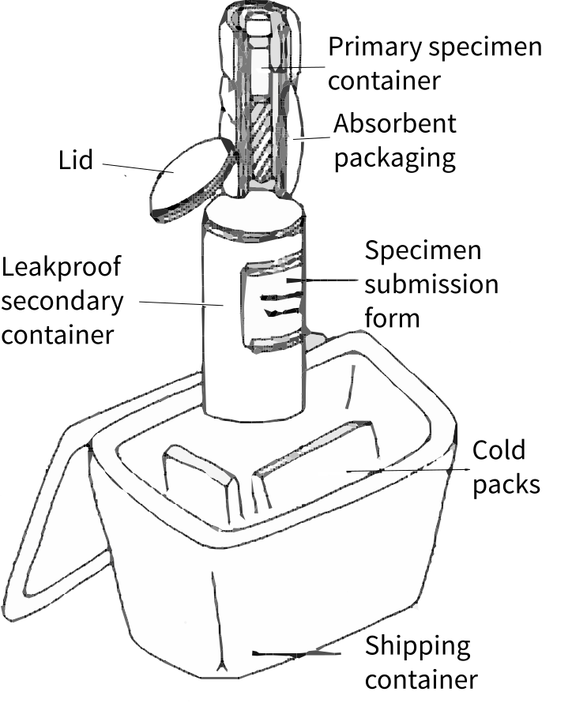

---
book: Ebola Prevention and Control
title: 1. Virology and epidemiology
layout: chapter
---

1
{:.chapter-number}

# Virology and epidemiology

Before you begin this unit, please take the corresponding test to assess your knowledge of the subject matter. You should redo the test after you’ve worked through the unit, to evaluate what you have learned.

## Objectives 

When you have completed this unit you should be able to:

*	Understand the structure and function of viruses
*	Be able to name different types of haemorrhagic fever viruses, including Ebola virus
*	Understand how Ebola is transmitted
*	Be able to describe the epidemiology of haemorrhagic fever viruses
*	Know how to manage laboratory sampling, handling and transport of specimens 
*	Be familiar with outbreak investigation and contact tracing.

## Structure and function of viruses

### 1-1 What is Ebola?

Ebola is the common name used for Ebola virus disease (EVD).  Ebola is a severe clinical illness caused by the Ebola virus.

> Ebola is the common name for Ebola virus disease.

### 1-2 What are viruses?

Viruses (a type of micro-organism) are very small and not visible to the naked eye; they are so small that they are even invisible through a light microscope. Viruses can only survive within the cells of another living organism such as a human, animal or plant (the host). Once a virus has entered the host they attach to and enter certain cell types. They then “force” the host cell to make more copies of the virus while remaining protected from the host’s defence mechanisms (the immune response). The intracellular location of viruses and the fact that they “hijack” many cellular functions, makes it difficult for drugs to kill the virus without also causing damage to the host cell. Viruses that are harmful to humans are known as viral pathogens. To cause disease, these pathogenic viruses must first be passed on (transmitted) to a person and then overcome the body’s defence systems. 

> Pathogenic viruses are micro-organisms that live inside human cells and are able to cause disease in humans.

### 1-3 Can viruses be classified into different types?

Viruses are much smaller than other micro-organisms such as bacteria (one hundredth of the size of a bacterium). They can only be seen using a specialised electron microscope, which enlarges the image up to 10 million times. Viruses are grouped by their genetic make-up and their shape.
<figure>
	
	<figcaption>Figure 1-1: Diagram of a generic virus</figcaption>
</figure>

Note
:	Viruses are classified by their genetic make-up (single- or double-stranded, RNA or DNA) and their shape (icosahedral, helical or complex). Virus particles (known as virions) have at least two parts: the nucleic acid (genetic material/genome) and the protein capsid (outer shell). Some viruses have a third component, called the virus envelope (or outer membrane). The virus envelope is composed of viral lipids and proteins and is easily damaged by heat, disinfectants and detergents. Other viruses are “naked” or non-enveloped, making them more difficult to destroy or remove by disinfection.

### 1-4 What do viruses need to survive and multiply?

Viruses use the host cells to provide everything they need for survival, replication (multiplication) and spreading. Once inside the host cell, viruses force the cell to make many copies of themselves, then cause the cell to release these viruses to infect neighbouring cells or to be shed (e.g. in the saliva or respiratory tract) to infect other individuals.

## Viral haemorrhagic fevers

### 1-5 What are viral haemorrhagic fevers?

Viral haemorrhagic fevers (VHFs) are a group of diseases affecting both animals and humans. The typical clinical features of VHFs are fever, shock (with or without bleeding) and a high death rate. There are a number of different types of virus which cause VHFs, including:

*	Ebola virus disease (Ebola)
*	Marburg virus (Marburg fever)
*	Lassa virus (Lassa fever)
*	Crimean-Congo haemorrhagic fever virus (Congo fever)
*	Rift valley fever virus (Rift valley fever)
*	Yellow fever virus (Yellow fever)
*	Dengue fever virus (Dengue fever)

Each virus has preferred animal hosts such as non-human primates e.g. apes and bats (Ebola and Marburg virus), rats (Lassa virus) and many wild or domestic animals (Congo virus). Some viruses are spread by arthropods (an insect or tick vector), e.g. yellow fever and dengue viruses: mosquitoes; Crimean-Congo haemorrhagic fever virus: ticks. Each virus occurs in a particular part of the world where their natural host and/or insect vector occurs.

Note
:	Five different families of enveloped RNA viruses cause VHF: Arenaviridae, Filoviridae, Bunyaviridae, Flaviviridae, and Rhabdoviridae. Within each family, there are different species (subtypes) of viruses e.g. Filoviridae include both Ebola and Marburg virus. Each VHF virus circulates naturally within a preferred animal host. In some cases (known as arthropod-borne viruses), transmission to humans occurs after the bite of an infected insect (vector). (See the table at the end of the chapter)

> Viral haemorrhagic fevers are a group of diseases which cause fever, shock and a high death rate (with or without bleeding).

### 1-6 How do humans become infected with viral haemorrhagic fevers?

VHF can be transmitted from animals or arthropods (insects and ticks) to humans and cause disease through:

*	Hunting, killing or eating infected wild animals for “bushmeat” (Ebola and Marburg fever)
*	Being in contact with infected rodents’ urine, faeces or saliva (Lassa fever)
*	Being bitten by an infected mosquito (Yellow fever and Dengue fever)
*	Being bitten by an infected tick or when crushing infected ticks (Congo fever)
*	Slaughtering infected livestock or eating raw meat (Rift Valley Fever).

VHF can be transmitted from human to human when:

*	In contact with a VHF diseased or deceased person’s blood or body fluids
*	During traditional burial rites involving washing and touching of an infected corpse by family and community members
*	In healthcare settings, through indirect contact with virus-contaminated objects, sur-faces or medical equipment (especially Ebola, Congo fever, Lassa fever).
> Person-to-person spread of Ebola virus occurs through direct or indirect contact with blood and body fluids. It is NOT transmitted through the air.

### 1-7 What is the incubation period for viral haemorrhagic fevers?

The incubation period of an infectious disease is the typical time interval between becoming infected and developing the first symptoms or signs of the disease. Each virus has a different incubation period:

*	Ebola virus disease 2 to 21 days (on average about one week)
*	Marburg fever 3 to 9 days
*	Lassa fever 6 to 21 days
*	Congo fever 1 to 12 days

Unlike other viruses (e.g. influenza), people infected with VHF viruses are not infectious during the incubation period. Knowing the maximum length of a particular virus’ incubation period is helpful in deciding if an exposed person is still at risk of developing disease (i.e. a potential case).

> People infected with viral haemorrhagic fevers such as Ebola are not infectious during the incubation period which can last up to 21 days.

### 1-8 Which body fluids are infectious in Ebola?

All bodily fluids of a person who is ill with Ebola can potentially transmit infection including blood, urine, vomitus, faeces, saliva, breast milk and semen. To transmit infection, these infected fluids must come into contact with another person’s mucous membranes (eyes, mouth), non-intact skin (open sore) or through an accidental cut or a needle stick injury. Contact may be direct contact with body fluid or indirect via a contaminated object.

It is important to note that although other body fluids are not infectious after an Ebola patient has recovered, semen may remain infectious for up to 7 weeks. For this reason, Ebola survivors should be advised to use condoms for the duration of this period.

> All bodily fluids of a person ill with Ebola can potentially transmit infection to others.

## Epidemiology of Ebola

### 1-9 Where have Ebola outbreaks occurred historically?

Ebola was first documented in 1976 and was named after a river close to the rural village where the index (original) case was described in the Democratic Republic of Congo.

Note
:	Ebola was first identified in Yambuku, a village in the northern Democratic Republic of Congo (then Zaire). Simultaneously an outbreak of Ebola occurred in Nzara, southern Sudan. These two outbreaks consisted of 284 cases with an 88% fatality in Zaire and 318 cases with a 53% fatality in Sudan. Sub-sequent to these large outbreaks this “new” Filovirus (Ebola virus) was described and further intermit-tent but “small” outbreaks (usually less than 100 cases) were documented mostly in Central and West Africa (Sudan, Gabon, Democratic Republic of Congo, Uganda and Congo). To date five strains of Ebola virus have been described including: Sudan, Zaire, Tai Forest, Reston and Bundibugyo ebola virus. The current outbreak is caused by the Zaire strain.

### 1-10 When and where did the current Ebola outbreak start?

The current Ebola outbreak began in Guinea in west Africa in late 2013.

Note
:	The outbreak began in Guéckédou, Guinea, in December 2013 but was only officially confirmed in March 2014 when the World Health Organization (WHO) and the Ministry of Health of Guinea reported 86 suspected cases and 59 deaths from four districts. At the same time suspected cases were being reported from the neighbouring countries of Liberia and Sierra Leone. The Zaire Ebola virus strain was confirmed as the causative agent. In the following months Ebola was confirmed in all three countries, with rapid, wide-scale and ongoing transmission of disease. The outbreak was officially declared as a “Public Health Emergency of International Concern” by the WHO in August 2014.

### 1-11 Which countries have been affected by the current Ebola outbreak?

Almost all cases of Ebola have occurred in three west African countries - Guinea, Liberia and Sierra Leone.  However a few cases have occurred in neighbouring countries such as Nigeria, Mali and Senegal or in distant countries where sufferers have come into contact with infected people from west Africa (such as the USA and in Europe).

By November 2014 more than 15000 cases and 5000 Ebola deaths had been recorded. However many experts believe these figures are underestimates because many Ebola victims die and are buried without confirmation of the diagnosis.

> Most cases of Ebola have occurred in Guinea, Sierra Leone and Liberia in west Africa.

Note
:	
West Africans continue to suffer the greatest burden of Ebola infections and deaths, however many other countries have experienced smaller-scale outbreaks or have hospitalised Ebola patients that were medically-evacuated from outbreak areas. In many cases, secondary transmission (“imported” outbreaks) of Ebola occurred, with transmission particularly to healthcare workers. Countries affected by the current West African outbreak and the number of recorded cases and deaths to date (9 November 2014) are listed below. An unrelated outbreak of EVD, first reported in August 2014 in the Democratic Republic of Congo, has ended.

Recorded cases of Ebola as on 9 November 2014
{:.table-caption}

|----------------------+-------+--------+---------------------------------------------------------------------------|
|       Africa         | Cases | Deaths |                              Outbreak status                              |
|----------------------+-------+--------+---------------------------------------------------------------------------|
| Liberia              | 6822  | 2836   | Widespread transmission                                                   |
| Guinea               | 1878  | 1142   | Widespread transmission                                                   |
| Sierre Leone         | 5368  | 1169   | Widespread transmission                                                   |
| Senegal              | 1     | 0      | Travel-associated case                                                    |
| Nigeria              | 20    | 8      | Travel-associated case(s) and local transmission                          |
| Mali                 | 4     | 4      | Travel-associated case(s) and local transmission                          |
|-------------------------------------------------------------------------------------------------------------------|

|----------------------+-------+--------+---------------------------------------------------------------------------|
| Rest of the world    | Cases | Deaths | Outbreak status                                                           |
|----------------------+-------+--------+---------------------------------------------------------------------------|
| USA                  | 4     | 1      | Travel-associated case(s) and local transmission                          |
| Spain                | 1     | 0      | Travel-associated case(s) and local transmission                          |
|----------------------+-------+--------+---------------------------------------------------------------------------|

### 1-12 What is different about the current Ebola outbreak?

The current Ebola outbreak is the largest in history. It is also different as it started in West Africa whereas Ebola historically affected countries in Central Africa. Infections in this outbreak spread rapidly in part due to the location of the index cases in highly populated, urban areas, whereas historically Ebola outbreaks have occurred in remote, sparsely-populated regions. In addition, the three main affected countries have very limited healthcare infrastructure and human resources (partly due to civil war), which has aggravated the ability of local ministries of health to appropriately respond to the outbreak.

### 1-13 What are the characteristics of people affected by the current outbreak?
A recently published WHO Ebola epidemiology report (with data from the three worst affect-ed countries and Nigeria), suggests that the disease has affected equal numbers of men and women. People between the ages of 15 and 45 are most affected, with relatively fewer cases among young children and adults over 60. The overall case-fatality rate was 70.8% which is higher than the average mortality reported in previous Ebola outbreaks.

Note
:	
The number of new infections for each Ebola case (the reproductive-number estimates) is around 2, suggesting that the case numbers and deaths will continue to rise without more efforts to prevent on-going transmission. Some experts (using mathematical models) have estimated that numbers of Ebola cases could double every 20 days, if transmission continues at current levels.

### 1-14 Are healthcare workers at risk of being infected by Ebola during patient care?

Healthcare workers are at particularly high risk of acquiring Ebola during patient care, especially if the diagnosis of Ebola has not been considered and standard infection control precautions are not being followed. The WHO estimates that by November 2014, around 600 healthcare workers had been infected of whom 320 died from Ebola. The risk of acquiring Ebola as a healthcare worker in the West African outbreak is thought to be over 100 times higher than that of the general population in the affected areas.

> Healthcare workers are at very high risk of acquiring Ebola if they do not consider the possibility of this diagnosis and do not follow standard precautions.

## Laboratory management 

### 1-15 What is needed for laboratory confirmation of viral haemorrhagic fevers?
It can be difficult to distinguish the clinical symptoms and signs of VHFs from each other and from other diseases, so laboratory confirmation of the diagnosis is very important. How-ever, many African countries lack specialist virology laboratories, so diagnostic specimens may have to be transported to the nearest regional reference laboratory. It is important to re-member that even in the presence of an Ebola virus infection, laboratory tests performed soon after infection may be falsely negative. If infection is strongly suspected, laboratory tests for VHF should be repeated.

Transporting and processing these specimens poses a serious biohazard risk and for this reason all specimen testing should take place by trained technicians under maximum bio-logical containment conditions (so-called bio-safety level 4 laboratories). In the current Ebola outbreak, several “field” laboratories have been set up in the three worst affected countries to avoid the need to transport specimens internationally and to reduce the diagnostic delay.

Note
:	
Diagnostic tests may vary depending on the specific VHF virus concerned, but may include: RT-PCR (reverse transcriptase polymerase chain reaction assay); ELISA (antibody-capture enzyme-linked immunosorbent assay); antigen-capture detection tests; serum neutralization test; electron microscopy; occasionally, virus isolation by cell culture.

> Laboratory confirmation of viral haemorrhagic fevers is needed because they can be difficult to distinguish clinically from each other and from other diseases such as malaria.

### 1-16 Which other laboratory specimens should be obtained?

The aim of laboratory investigations in cases of VHF should be to provide the best patient care, while at the same time minimizing the risk of health care worker exposure. The number of additional investigations done will depend on the patient’s condition and the level of care and resources available in any particular setting. The overriding principle should be to perform only those invasive procedures and laboratory or special investigations that are absolutely essential. In settings with very limited resources, a baseline VHF diagnostic test (such as PCR or ELISA) and a malaria rapid diagnostic test (RDT) would be required. 

Note
:	
In settings with better resources the following tests would be among those indicated: a VHF confirmatory test; malaria rapid diagnostic test (RDT) and smear; full blood count; liver function test; serum electrolytes; urea and creatinine; clotting profile and blood culture. Laboratory findings that increase the chances of a VHF include: leucopenia (low white cell count), thrombocytopenia (low platelet count), anaemia, abnormal blood clotting tests and raised liver enymes (transaminases). However many diseases may result in similar findings, and so specific laboratory confirmation of VHF is always needed.

> Only perform invasive procedures and investigations that are absolutely essential.

### 1-17 How should laboratory specimens be transported?

The following instructions should be adhered to when preparing specimens for transport to an off-site laboratory:

*	In general, the blood specimen should be packed in 3 “layers” of containers (see picture below): the primary container is the test tube that contains the blood specimen; the secondary container could be a screw cap metal or plastic container, or if not available, sealed in multiple plastic ziplock bags to render it leak proof; and the tertiary container (the main shipping container) should be a strong, leak-proof box (polystyrene or plastic) with a handle. 
*	Each specimen tube must be packed separately in a sealed plastic envelope ziplock bag (so that samples can be distributed to different sections of the laboratory without needing to touch the tubes)
*	The specimen container tube must have the patient’s identifying details written on it
*	Sufficient absorbent material should be wrapped around the specimens (to absorb the entire contents in case of leakage)
*	The specimen request form must be submitted in a separate bag with careful handling to avoid contaminating the request form (with blood or bodily fluid transfer from gloves).
*	The shipping box should be labelled as bio-hazardous, with a warning that it must not be opened except in the specified laboratory by the specified person. If the transport time to the laboratory is expected to be more than one hour, the specimens must be placed in a cold box with cold packs
*	When preparing the containers for shipping the following disinfection steps must be applied: the outside of the primary container (test tube) must be profusely sprayed with disinfectant, placed into a secondary container which is then profusely sprayed with disinfectant, and then placed in the main transport/shipping box.

<figure>
	
	<figcaption>Figure 1-2: Improvised container for VHF laboratory samples</figcaption>
</figure>

*Source: Reproduced by kind permission of the South African Department of Health, National guidelines for recognition and management of viral haemorrhagic fevers, 2014.*

1-18 How can laboratory specimens be processed safely?

In all three of the worst-affected countries, specialised laboratories (with international virolo-gy teams) have been established to ensure blood specimens can be rapidly tested for Ebola. Specific recommendations for laboratory processing of potential VHF specimens is beyond the scope of this book, but basic principles would include:

•	Using only experienced and VHF trained virology personnel
•	Processing of all samples with extreme caution (inside specialised safety cabinets)
•	Wearing of full personal protective equipment (PPE) with caution when removing PPE to avoid contact between contaminated items and the skin/mucous membranes
•	Safe discarding of all used disposable PPE immediately and immediate disinfection of re-usable items
•	Meticulous attention to hand hygiene 
•	Thorough disinfection of the external surfaces of specimen containers and work sur-faces (with an effective disinfectant e.g. 70% alcohol or solutions containing chlorine at 5000 parts per million (0.5% solution). 

## Outbreak investigation and field epidemiology

### 1-19	Why should outbreaks be investigated?

Usually more than three cases of an infectious disease occurring within a short period of time or with evidence of exposure to a common source, is considered an outbreak. In the case of Ebola or other viral haemorrhagic fever, even one case (where none were known before) would be considered an outbreak. The presence of an outbreak has to be established using surveillance. Remember that patients in the Ebola countries may also have malaria (20% co-infected), hepatitis or other viral haemorrhagic fever, therefore a cluster of Ebola from similar strains is needed to confirm the outbreak. The number of cases, their contacts and the potential for Ebola to spread further has to be evaluated and documented. Finally surveillance will determine whether control measures are working or not.

## 1-20	What are the objectives of outbreak investigation?

The objectives are:

*	Active case finding in the community
*	Coordination of transportation of live and dead persons
*	Education and provision of information to affected communities
*	Epidemiological analysis and mapping to guide direction of resources
*	Provision of information from the outbreak areas
*	To support healthcare workers
*	To establish when the epidemic can be declared over using post-outbreak surveillance (42 days after the last case).

### 1-21 What is field epidemiology?

Field epidemiology is an investigation which is carried out by mobile surveillance teams. With the assistance of the community, these teams conduct active case finding, contact tracing and follow-up. Some practices in remote areas are not identified by ordinary surveillance because the right questions are not asked. This requires trust and involvement of the community networks, which will be actively involved in field surveillance and alerting health authorities. The mobile teams have to be quite large and therefore it is worthwhile training and working with local community leaders and the youth to be part of the mobilisation team. This also builds capacity.

### 1-22 What is a line list?

A line list is usually a single page which has all the relevant information about the demographics, risk factors and contacts. It can either be loaded onto a tablet or used as a hard copy to collect relevant information. It also helps with carrying out a rapid analysis of the situation and allows early intervention and modification of practice (see appendix A).

Note
:	Because there is a lot of information to collect during an outbreak, it is best to collect a minimum dataset containing unique case identifiers. This information can be entered in an electronic database using Excel or Access which is simple and easy. Further analysis can be done at a later stage.

> A line list is a single page containing all the important information about the outbreak.

### 1-23 Which technologies can assist with outbreak investigation and contact tracing?

An interesting concept from Medecins san Frontieres (MSF) has been to set up a “rumour registry” and to follow up information given by word of mouth from the community. Electronic tablets can be used by the data collectors and can be easily downloaded onto the database, either locally or remotely. Another important service to establish (but dependant on the cooperation of service providers) is text messaging systems to a single phone number or hotline which can be followed up quickly and efficiently. The information required here has to be concise such as the exact name and location of the person. The information can be passed onto the contact tracing team. 

Appendix A: Form for case recording and contact tracing
{:.table-caption}

|---------------------+------+------+--------+--------------+---------------+---------------------------+---------------+-------------------+----------------+-------------------------------|
| Case/Contact number | Name | Age  | Gender | Full address | Place of work | Clinical symptoms present | Date of onset | Social gatherings | Travel history | Family and friends with Ebola |
|---------------------+------+------+--------+--------------+---------------+---------------------------+---------------+-------------------+----------------+-------------------------------|
|                   1 |      |      |        |              |               |                           |               |                   |                |                               |
|                   2 |      |      |        |              |               |                           |               |                   |                |                               |
|                   3 |      |      |        |              |               |                           |               |                   |                |                               |
|                   4 |      |      |        |              |               |                           |               |                   |                |                               |
|---------------------+------+------+--------+--------------+---------------+---------------------------+---------------+-------------------+----------------+-------------------------------|

Classification of Viral Haemorrhagic Fevers
{:.table-caption}

|------------------------------------------------------------+-------------+----------------------------------+-------------------------+---------------------+---------------------------+-------------------------------------+--+--+--+--|
|                           Family                           |    Genus    |              Virus               |      Human disease      |       Vectors       |     Vertebrate hosts      |            Distribution             |  |  |  |  |
|------------------------------------------------------------+-------------+----------------------------------+-------------------------+---------------------+---------------------------+-------------------------------------+--+--+--+--|
| Rodent-associated viruses                                  |             |                                  |                         |                     |                           |                                     |  |  |  |  |
| Arenaviridaee                                              | Arenavirus  | Lassa                            | Lassa fever             |                     | Rodents                   | W Africa                            |  |  |  |  |
|                                                            |             | LuJo                             | Lassa-like              |                     | Rodents?                  | Southern Africa?                    |  |  |  |  |
|                                                            |             | Several other arenaviruses       | S. American VHFs        |                     | Rodents                   | S America                           |  |  |  |  |
| Bunyaviridae                                               | Hantavirus  | Several Asian & European viruses | HFRS                    |                     | Rodents                   | Asia & Europe                       |  |  |  |  |
|                                                            |             | Several N & S American viruses   | HPS                     |                     | Rodents                   | N & S America                       |  |  |  |  |
| Arthropod-borne viruses                                    |             |                                  |                         |                     |                           |                                     |  |  |  |  |
| Bunyaviridae                                               | Phlebovirus | Rift Valley fever                | Rift Valley fever       | Mosquitoes          | Ruminants                 | Africa, Yemen, Madagascar, S Arabia |  |  |  |  |
|                                                            | Nairovirus  | Crimean-Congo HF                 | CCHF                    | Ixodid ticks        | Ruminants & small mammals | E Europe, Asia, Africa              |  |  |  |  |
| Alphaviridae                                               | Alphavirus  | Chikungunya                      | Chikungunya             | Mosquitoes          | Monkeys                   | Africa, Asia                        |  |  |  |  |
| Flaviviridae                                               | Flavivirus  | Yellow fever                     | Yellow fever            | Mosquitoes          | Humans & monkeys          | S America, W & E Africa             |  |  |  |  |
|                                                            |             | Dengue I, II, III, IV            | Dengue fever            | Mosquitoes          | Humans & monkeys          | Caribbean, Asia, W & E Africa       |  |  |  |  |
|                                                            |             | Omsk HF                          | Omsk HF                 | Ixodid ticks        | Rodents                   | Siberia, Romania?                   |  |  |  |  |
|                                                            |             | Kyasanur Forest disease          | Kyasanur Forest disease | Ixodid ticks        | Unknown                   | India, Pakistan                     |  |  |  |  |
|                                                            |             | Alkhurma                         | Alkhurma                | Argasid ticks ticks | Camels, sheep             | Saudi Arabia (Near East?)           |  |  |  |  |
| Viruses believed to be associated with bat reservoir hosts |             |                                  |                         |                     |                           |                                     |  |  |  |  |
| Filoviridae                                                | Filovirus   | Marburg                          | Marburg disease         |                     | Bats                      | Africa                              |  |  |  |  |
|                                                            |             | Ebola-Zaire                      | Ebola HF                |                     | Bats?                     | Africa                              |  |  |  |  |
|                                                            |             | Ebola-Sudan                      | Ebola HF                |                     | Bats?                     | Africa                              |  |  |  |  |
|                                                            |             | Ebola-Ivory Coast                | Ebola HF                |                     | Bats?                     | Africa                              |  |  |  |  |
|                                                            |             |                                  |                         |                     |                           |                                     |  |  |  |  |
|------------------------------------------------------------+-------------+----------------------------------+-------------------------+---------------------+---------------------------+-------------------------------------+--+--+--+--|

*Source: Reproduced by kind permission of the South African Department of Health, National guidelines for recognition and management of viral haemorrhagic fevers, 2014.*

## Case study

A 35-year old man from an Ebola-affected region in Sierra Leone travels to visit family members in Cote d’Ivoire. Three days ago he attended the funeral of his cousin (who had confirmed Ebola), where he participated in the traditional burial practice of washing the deceased person’s body. At the airport he completes a travel history questionnaire, reporting that he is currently well.

### 1.	Does this man pose a threat for Ebola transmission in Cote d’Ivoire?

Yes, he comes from a country with widespread Ebola transmission and has had direct contact with an Ebola-infected corpse.

### 2.	What is the incubation period for Ebola?

The incubation period can be anywhere from 2 to 21 days, but on average is about one week.

### 3.	If this man has been infected with Ebola virus, is he infectious to others at present?

No, even if he has been infected and is in the incubation period, he does not have any symptoms yet and is therefore not infectious to others.

### 4.	The border control decides to quarantine this man and test him for Ebola. What specimens should they take, if any?

Even in the presence of an Ebola infection, laboratory tests performed during the incubation period (i.e. before signs and symptoms begin) may be negative. In this particular case, it may be best for the border control to restrict this man’s travel and to monitor him closely for fever and other symptoms of Ebola. If he remains well for 21 days after his last contact with an Ebola-infected person, he could be declared Ebola-free. If he develops signs and symptoms compatible with Ebola he should be tested. If the first test is Ebola negative but symptoms persist, he should be re-tested in a few days and regarded as potentially infectious until proven negative.