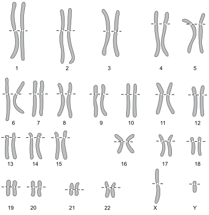
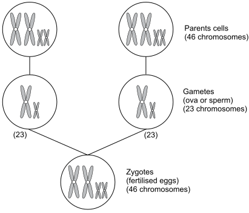
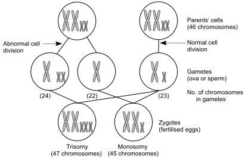
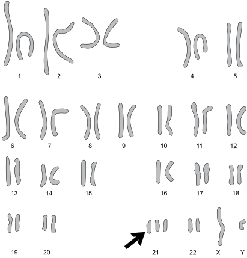

1
{:.chapter-number}

# Introduction to birth defects

Take the chapter test before and after you read this chapter.

50622355363552

## Objectives

When you have completed this unit you should be able to:

*	Define a birth defect.
*	Understand the birth prevalence and population prevalence of birth defects.
*	List the causes of birth defects.
*	Understand chromosomal inheritance.
*	Understand the inheritance of single genes.
*	Define a multifactorial birth defect.
*	Define a teratogen and know their dangers.

## Birth defects

### 1-1 What is a birth defect?

A birth defect is an abnormality of structure or function in a person, which is present from birth. The birth defect may be clinically obvious at birth, or may only be diagnosed sometime later in life. For example, a neural tube defect is a structural defect which is obvious at birth while haemophilia, which is also present at birth, is a functional defect that may only become obvious and be diagnosed when the child is older. Birth defects often present as an abnormal appearance or failure to grow and develop normally.

> A birth defect is a structural or functional abnormality which is present from birth.

Congenital disorder is another term that has the same meaning and definition as birth defect. Congenital means ‘present at birth’.

Malformations are the commonest form of birth defect. Congenital malformations develop during the first trimester and are caused by failure of the embryo to develop normally. This results in a birth defect of one or more organs (e.g. heart, eye, brain).

> Congenital malformations occur early in pregnancy when the embryo is still forming.

Note
:	An individual with an abnormal appearance is said to be ‘dysmorphic’. It is important to differentiate dysmorphic features from the normal range of features found in a family or community.

### 1-2 Are all birth defects serious?

No. Birth defects may be mild or serious. A mild defect causes no disability. However, a person with a serious birth defect may die soon after birth, or survive with a disability due to the direct effect of the birth defect (e.g. neural tube defect) or due to a secondary effect (e.g. joint damage resulting from bleeding in haemophilia). Some serious birth defects can be treated and this may be life-saving or prevent or reduce serious disability.

Birth defects can cause a wide range of disability, e.g. physical disability, intellectual disability, blindness, deafness and epilepsy.

> Serious birth defects can cause death or disability.

### 1-3 How is the frequency of birth defects measured?

The frequency of birth defects (i.e. how common are individuals with a birth defect) is expressed as population prevalence and birth prevalence:

1.	The **population prevalence** is defined as the number of affected individuals per 1000 or 10 000 or 100 000 people, depending on how common or rare the disorder is, in a given population at a certain time, e.g. the population prevalence of Down syndrome in rural Limpopo was 7.5/10 000 children between 1994 and 1997. Therefore the population prevalence is a measure of how common a birth defect is in the general population.
2.	The **birth prevalence** is defined as the number of affected infants per 1000 live births, e.g. the birth prevalence of Down syndrome in rural Limpopo is 2.1/1000 live births. It is therefore a measure of how common a defect is among newborn infants.

### 1-4 How common are birth defects?

At birth two to three percent of live newborn infants can be recognised as having a birth defect, i.e. the recognisable birth prevalence for all defects is 20–30/1000 live births in the first month of life.

However, not all birth defects are diagnosed at or around birth, and by five years of age between four and eight percent of children in different countries are considered to have suffered the effects of a serious birth defect, i.e. a birth prevalence of 40–80/1000 live births.

The birth prevalence of serious birth defects varies from 40/1000 live births in industrialised countries to as high as 80/1000 in some developing countries.

> The birth prevalence of serious birth defects is lower in industrial countries than in developing countries.

Note
:	Research done in rural Limpopo province, South Africa, by genetic trained nursing staff examining newborn infants on day one of life recorded a birth prevalence of serious defects of 15/1000 live births (1.5% of live births). Birth defects can be diagnosed at any age from the newborn period (birth to 28 days) through to adulthood. Examples of birth defects that can present for the first time in adulthood include inherited cancers, Huntington disease and adult onset polycystic kidney disease.

### 1-5 If birth defects are so common why are they not seen more frequently at clinics?

1.	Infants and children with serious birth defects are very likely to die when they are young, especially if there are inadequate medical services available for their care. Therefore many infants do not live long enough to be seen at clinics.
2.	Many birth defects are not recognised and diagnosed.
3.	It is often not realised that many of the conditions seen in clinics and hospital have a congenital origin, e.g. many forms of intellectual disability, cerebral palsy, deafness and blindness. Up to 50% of these disorders may be due to birth defects.

Therefore both the birth prevalence and population prevalence of birth defects in developing countries may seem to be much lower than it really is.

Note
:	Another reason why infants and children with birth defects are not seen is that their parents do not take them to hospital or clinic because they feel that they will not receive adequate attention or care, and the visit will be an unjustified burden on their limited family resources. Experience from Limpopo showed that when genetic clinics were established, the population soon got to know and parents brought their children with birth defects.

### 1-6 How many children die from birth defects?

In South Africa about 1 million infants are born annually. Based on the available evidence, about 72 000 infants are born each year with a severe birth defect. Of these infants, about 25% will die in the first five years of life.

It is estimated that 9 million children are born in the world each year with a serious birth defect. Of these children, at least 8.4 million (93%) are born in developing countries. A minimum of 3.3 million children with a serious birth defect are estimated to die annually.

Note
:	It is quoted as a general rule that in industrialised countries 30% of children with serious birth defects will die in infancy (the first year of life), 30% will live with disability even if treatment is available, and 40% can largely be cured (mainly by surgery). Similar figures for developing countries are not available, but the number that die or are successfully treated will depend on the level of available health care. Currently at least 3.3 million children with a serious birth defect die annually.

> Birth defects are an important cause of infant and childhood death.

## Causes of birth defects

### 1-7 What are the causes of birth defects?

Birth defects are caused by:

1.	Problems that are present before conception (about 40% of birth defects):
	*	Chromosome abnormalities.
	*	Single gene defects.
	*	Multifactorial disorders.

	These are also known as genetic causes of birth defects.

2.	Problems occurring after conception (about 10% of birth defects):
	*	Teratogens.
	*	Constraint.

	These are non-genetic causes of birth defects. Note that all birth defects are not due to genetic causes.

3.	Cause not yet known (about 50% of birth defects).

Note
:	The percentages given above are for industrialised countries. Figures for developing countries are not available.

> The cause of about 50% of birth defects is not yet known.

## Chromosomal inheritance

### 1-8 What are chromosomes?

Chromosomes are packages of DNA (deoxyribonucleic acid), the genetic material found in all cells. A person’s genetic plan of all their inherited characteristics is stored in their chromosomes.

Human cells have 46 chromosomes that are contained in the nucleus of the cell. The chromosomes are paired (23 pairs), with 22 pairs called autosomes and one pair of sex chromosomes. Each pair of autosomes looks the same. The pair of sex chromosomes do not look the same because the X chromosome is longer than the Y chromosome.

Females have two X chromosomes (i.e. XX) while males have one X and one Y chromosome (i.e. XY). Like the 22 autosomes, the pair of X chromosomes in females look alike.

A picture of the 46 chromosomes is called a karyotype. The normal female karyotype can be written as 46,XX and the normal male karyotype as 46,XY. Each pair of autosomes is given a number (1 to 22).

> Humans have 46 chromosomes in each cell, 22 pairs of autosomes and one pair of sex chromosomes.

Note
:	In some textbooks, 46,XY is still written as 46 XY. 46,XY is preferable.

> 
> 
> Figure 1-1: Normal karyotype of a male (46,XY) with 23 pairs of chromosomes (22 pairs of matching autosomes and one pair of unlike sex chromosomes, X and Y)
{:.figure}

### 1-9 How are chromosomes inherited?

One chromosome of each pair of chromosomes is inherited from the mother and the other chromosome from the father. Therefore, both the mother and father give one chromosome to each pair of chromosomes found in the child. Half of the inheritance plan of each individual is inherited from the mother and the other half from the father. This is called sexual reproduction. An infant’s genetic plan is, therefore, inherited from both parents. This is why the inherited characteristics of the parents are shared in the child, and the child has features of both parents.

When the ova (female eggs) are produced in the mother’s ovaries, and the sperms (male eggs) in the father’s testicles, the 46 chromosomes in the parent’s stem cells divide with only one copy of each chromosome pair still remaining in each ovum or sperm. The ova and sperms (also called gametes or sex cells), therefore, only have 23 chromosomes each.

With fertilisation, a sperm and an ovum unite and combine their chromosomes to form the zygote (the first cell which will eventually develop into the fetus). The zygote therefore has 46 chromosomes, half (23) from the mother and half (23) from the father. The zygote divides, multiplies and grows to become an embryo (with cells developing into different organs). The embryo develops into the fetus (with formed organs). After delivery the fetus is called the newborn infant.

> Each parent gives 23 chromosomes which combine at fertilisation to give a total of 46 chromosomes in the zygote.

Note
:	All living organisms, plants and animals, have chromosomes. In humans the 46 chromosomes are known as the diploid number of chromosomes and the 23 chromosomes in the gametes as the haploid number. The process of cell division in which the gametes are formed and the number of chromosomes is halved (from 46 to 23) is called meiosis. After meiosis the ovum contains 22 autosomes and an X chromosome, and each sperm has 22 autosomes plus either an X or a Y chromosome.

	Cell division in which the chromosome number stays the same can also occur (asexual reproduction) and this is called mitosis. This is the type of cell reproduction that occurs to make more cells so that the zygote can multiply and develop into an embryo and fetus, and the body can grow or replace cells that die off during life.

> 
> 
> Figure 1-2: The normal chromosome contribution of each parent
{:.figure}

### 1-10 What are chromosome abnormalities?

The process of reproduction (when the ova and sperms are made, fertilised and divide after conception) is not always perfect. Abnormalities can occur in the chromosomes and they may result in a child with a birth defect. These chromosome abnormalities are mostly sporadic, i.e. due to chance.

Chromosome abnormalities include:

1.	An abnormal number of chromosomes in the cells:
	*	Trisomy.
	*	Monosomy.
	*	Mosaicism.
2.	An abnormal structure of chromosomes in the cells:
	*	Translocation.
	*	Deletion.

If a whole chromosome or part of a chromosome is gained or lost in the process of reproduction, then the zygote that results will be abnormal as its genetic plan will have more or less genetic information than it should have. The abnormal embryo may abort spontaneously or result in an infant with a birth defect. Chromosomal disorders usually present with multiple abnormalities, including an abnormal appearance (dysmorphic features), developmental and growth delay and malformations. As most chromosomal abnormalities are not inherited, the risk of more than one child being affected (recurrence) is low.

> The risk of the same chromosome disorder occurring more than once in a family is low.

### 1-11 What are trisomy and monosomy?

This occurs during the formation of the gametes (ova or sperms) when a pair of the parent’s chromosome does not split normally. Instead of one chromosome of a pair going to each gamete, one gamete gets both the paired chromosomes, and therefore has 24 chromosomes, while the other gamete does not get a copy of that chromosome and, therefore, only has 22 chromosomes. This abnormal process of cell division, which results in two abnormal gametes, is known as non-disjunction.

When either of these two abnormal gametes fertilise with a normal gamete (containing 23 chromosomes) the resulting zygote will have either of the following:

1.	An extra chromosome (trisomy) with 47 (i.e. 24 +23) chromosomes in the cell.
2.	One chromosome less (monosomy) with 45 (i.e. 22+23) chromosomes in the cell.

From an abnormal zygote with 47 chromosomes (trisomy) the fetus that develops will have cells with 47 chromosomes. Similarly, for a zygote with 45 chromosomes (monosomy), the fetus will have cells with 45 chromosomes.

> Trisomy and monosomy are caused by non-disjunction.

> 
> 
> Figure 1-3: Non-disjunction
{:.figure}

### 1-12 What birth defects are caused by trisomy and monosomy?

Many of the common chromosomal disorders (chromosomal birth defects) are caused by non-disjunction and the resulting trisomy or monosomy of different chromosomes. Most fetuses with trisomy and monosomy are not capable of living and result in early spontaneous abortion.

The chromosomes which can result in an infant being born alive and surviving with trisomy are 13, 18, 21, X and Y. The common trisomies are:

1.	Trisomy 21 or Down syndrome (i.e. 47,XY+ 21 or 47,XX+21).
1.	Trisomy 18 or Edward syndrome (i.e. 47,XY +18 or 47,XX+18).
1.	Trisomy 13 or Patau syndrome (i.e. 47,XY+ 13 or 46,XX+13).
1.	XXY in a male or Klinefelter syndrome (i.e. 47,XXY).
1.	Trisomy X in a female (i.e. 47,XXX).
1.	XYY in a male (i.e. 47,XYY).

Down syndrome, with trisomy of chromosome 21, is the commonest form of chromosomal birth defect.

The only chromosome that can be lost and result in a live born infant with monosomy is a sex chromosome X or Y. Therefore, the only monosomy seen is Turner syndrome (i.e. 45,X).

> Down syndrome, with trisomy of chromosome 21, is the commonest form of chromosomal birth defect.

> 
> 
> Figure 1-4: The karyotype of Down syndrome in a male with an extra chromosome 21 (trisomy 21)
{:.figure}

### 1-13 What is mosaicism?

In the normal zygote there are 46 chromo­somes. The zygote then begins dividing by mitosis to form the embryo which contains many cells. This division of the one-celled zygote results in a doubling of cells to 2, 4, 8, 16, 32 cells and so on, with all the cells having 46 chromosomes. However, in mosaicism, an error occurs in the zygote. Early on in this dividing process one of the cells is involved in non-disjunction resulting in one cell having 47 chromosomes (trisomy) and the other cell only 45 chromosomes (monosomy). The monosomy cell usually dies but the trisomy cell may survive and divide. All future cells that come from it will be trisomy cells. Therefore, the embryo, fetus and infant that result will have some cells which are normal with 46 chromosomes and other cells which are abnormal with 47 chromosomes. This is called mosaicism (the presence of 2 different cell lines of the same genetic origin in a person).

As an example, if the non-disjunction was with chromosome 21 in a female then the newborn infant would have some cells of 46,XX and others of 47,XX +21 resulting in mosaic Down syndrome (46,XX/47,XX +21). Mosaicism causes 1 to 2% of the infants born with Down syndrome. People with Turner syndrome can also be mosaic (46,XX/45,X0).

Note
:	Rarely, people are found with an extra piece of chromosome material that is called a marker chromosome. How this affects the person depends on what piece of chromosome is involved. Some people with marker chromosomes are normal, while others can have a chromosome disorder.

	In the formation of gametes (ova or sperms, if none of the chromosome pairs separate, then 46 chromosomes will go to one gamete and none to the other gamete. If the gamete with 46 chromosomes becomes fertilised with a normal gamete with 23 chromosomes, the resulting zygote will have an extra set of chromosomes, i.e. 69 chromosomes (69,XXX or 69,XXY). This is called triploidy. It is also possible to have more than one extra set of chromosomes (polyploidy). Embryos with polyploidy usually abort spontaneously early in pregnancy. On the rare occasion when a triploidy (three sets of chromosomes) infant is born, it is very abnormal and either dies before delivery or very early in the neonatal period.

### 1-14 What is a chromosome translocation?

Translocation occurs when a piece of one chromosome breaks off and joins (translocates) onto another chromosome. If in this process no genetic material is lost or gained, this is called a ‘balanced’ translocation and the person is clinically normal. However, if chromosome material is lost or gained then this is an ‘unbalanced translocation’ and the person will be abnormal because their genetic plan has lost or gained genetic material.

Persons with balanced translocations are at risk of passing on the abnormal chromosomes to their offspring, resulting in abnormal embryos with unbalanced translocations. This can be the cause of recurrent spontaneous abortions. If the embryo survives, the resulting infant will be abnormal. This risk varies according to the type of translocation.

### 1-15 What is a chromosome deletion?

This occurs when a piece of a chromosome, big or small, is missing. There are several recognised syndromes in which a known piece of chromosome is missing. These include:

1.	Prader Willi syndrome with deletion of a specific piece of chromosome 15.
2.	Deletion 22 syndrome with deletion of a specific piece of chromosome 22.
3.	Cri du chat (cry of a cat) syndrome with loss of a piece of the small arm of chromosome 5.

Note
:	Sometimes a piece of chromosome copies itself and therefore the chromosome has two identical pieces of the chromosome and the genetic plan has extra chromosome material. This is called chromosomal duplication. There are recognised chromosome duplication syndromes, e.g. Cat Eye syndrome in which a piece of chromosome 22 is duplicated.

	A piece of one end of a chromosome may come off (deleted) making it sticky. This end then sticks to the other end making a ‘ring’ chromosome. Because genetic material is lost from the one end of the chromosome in the process, the person usually has a chromosome disorder, often associated with growth failure and intellectual disability.

## Inheritance of single gene defects

### 1-16 What is a gene?

The genetic material on chromosomes is divided up into smaller packages of DNA called genes. Like chromosomes, genes occur in pairs, one gene from each parent. Together, each pair of genes usually determines a single inherited function by giving a set of instructions to the cell, such as a physical feature (e.g. hair colour) or a single biochemical product (e.g. production of a protein or an enzyme).

Genes make up the smallest parts of the genetic code. Children look like their parents because their genes are a mixture that is inherited from both mother and father. As this combination varies with each child, siblings look alike and yet have their differences. The only individuals with identical genes are identical twins.

> A gene is a small section of a chromosome and controls a cell function. Genes occur in pairs, one being inherited from each parent.

### 1-17 What is a single gene defect?

On the chromosomes, a person’s genetic plan is coded (‘written’) in thousands of genes. Genes on the 22 autosomes and two X chromosomes always occur in pairs (alleles). One gene in each matching pair is inherited from the mother and the other gene in that pair is inherited from the father. Each pair of genes together codes for an inherited biochemical product (e.g. blood clotting factor) or physical feature (e.g. eye colour) and gives the cell an instruction to carry out a particular activity. If the structure of the gene is abnormal, the instruction will also be abnormal and this may be harmful to the individual. A birth defect that results from an abnormality in a gene is called a single gene defect.

> A birth defect caused by an abnormality in a gene is called a single gene defect.

Note
:	It is estimated that humans have about 20 000 pairs of genes. Over 6000 single gene defects have been described.

### 1-18 How do genes become abnormal?

Almost all genes are normal and give the cell correct instructions. However, a gene can become abnormal by mutation. With a mutation, the DNA structure of a gene changes.

> A mutation is a change in gene structure that can cause abnormal gene fuction and a birth defect.

Mutations are rare and may occur sponta­neously or be caused by environmental factors, including radiation (solar radiation from the sun, nuclear radiation or excessive X-rays). These abnormal genes can be passed onto the next generation in the same way as normal genes are inherited. As a result, single gene defects are usually inherited (unlike chromosomal defects).

> Single gene defects are usually inherited.

Note
:	In a mutation, the gene gives instructions for an incorrect sequence of amino acids and, therefore, an abnormal protein or enzyme is formed. A mutated gene may cause a clinical problem (e.g. haemophilia), a mild variant (e.g. red hair) or rarely a survival advantage (e.g. resistance against malaria).

### 1-19 What type of genes occur?

A gene may be either a dominant or a recessive gene. Both dominant and recessive genes may be normal or abnormal.

> Genes can be either dominant or recessive.

## Dominant inheritance

### 1-20 What is a dominant gene?

In a pair of genes (alleles), the individual genes may be of different strengths, with the one being ‘stronger’ and the other being ‘weaker’. The ‘stronger’ gene dominates (overpowers) the ‘weaker’ gene. Therefore, the ‘stronger’ gene is called a dominant gene. The dominant gene controls the function of that gene pair (alleles).

> A dominant gene controls the function of that gene pair.

If the dominant gene is abnormal, then the instructions sent from that gene pair will also be abnormal. As a result the cell may not function normally, causing a birth defect.

If the dominant gene is on one of the 22 autosomes, it is called an autosomal dominant gene. A clinical disorder caused by a mutation in an autosomal dominant gene is called an autosomal dominant disorder. These conditions may be mild or severe but usually are not lethal (otherwise they probably would not be passed on to the next generation). Males and females are equally affected by autosomal dominant disorders.

### 1-21 How are autosomal dominant genes inherited?

If either the father or mother has an autosomal dominant gene, there is a 50% chance of passing that gene on to each of their children. Both sons and daughter have an equal chance of inheriting an autosomal dominant gene.

> There is a 50% chance of inheriting a dominant gene from a parent.

If the autosomal dominant gene causes an abnormality of structure or function, the genetic abnormality will be present in the parent with that gene, and also in each child that inherits that abnormal gene. Autosomal dominant disorders are, therefore, passed from one generation to the next. The clinical effect of the abnormal gene will usually be present in both parent and child.

While most autosomal dominant genes are inherited, an autosomal dominant gene may also appear in a person for the first time in a family as a result of a new mutation. That gene will not be present in either parent. Therefore, the parents will be normal but the child will have the disorder. However, the new mutated gene can be passed onto future generations in the same way as other autosomal dominant genes are inherited.

Note
:	In a single family, some members will show all the clinical features caused by the dominant gene while others who inherit the gene may only show (express) some features. This is known as variable expression (e.g. neurofibromatosis). Some family members with a dominant gene may not show any features of that gene at all. This is called variable penetrance (e.g. polydactyly).

Note
:	If both parents have the same dominant gene, there is a 75% chance (3 out of 4) that each child will inherit that gene. There is also a 25% chance (1 in 4) of the child inheriting both dominant genes, which is usually fatal if the dominant genes are abnormal. Therefore, all children will inherit either one or both dominant genes.

> 
> 
> Figure 1-5: The pattern of autosomal dominant inheritance. There is a 50% chance that the autosomal dominant gene (e.g. D) will be passed from the affected parent to each child no matter whether a boy or girl.
{:.figure}

## Recessive inheritance

### 1-22 What is a recessive gene?

If a dominant gene overpowers (suppresses) a ‘weaker’ gene, the weaker gene is called a recessive gene. The dominant gene will control the function of that pair of genes. As a result, the instructions sent to the cell will be that of the dominant gene only. Therefore, the recessive gene will have no control over the cell and its effect will be ‘hidden’ or suppressed.

A person is called a carrier if she/he carries a ‘hidden’ recessive gene. In a carrier the effect of an abnormal recessive gene is not seen and the individual appears normal.

A person who has both a dominant and a recessive gene (a carrier), is said to be heterozygous for that pair of genes. If both genes are the same (both genes are dominant or both recessive), the person is said to be homozygous for that pair of genes. Only if both genes are recessive will the recessive genes together control that function of the cells. They are able to do this as there is no dominant gene. Recessive genes may be normal (e.g. carry instructions for blue eyes) or abnormal (e.g. carry instructions for oculocutaneous albinism). If both recessive genes are abnormal, that function of the cell will also be abnormal. A clinically normal carrier has both a normal (dominant) and an abnormal (recessive) gene for that feature.

A recessive gene on an autosome is called an autosomal recessive gene.

Note
:	We all carry five to 10 abnormal recessive genes. As we are heterozygous for that gene (single copy), it generally has no effect on our health. Only if we are homozygous (double dose) for the same gene will we be clinically affected.

### 1-23 How are autosomal recessive genes inherited?

If both parents are carriers (i.e. they are heterozygous) for the same recessive gene, their children will have a 25% chance of inheriting the recessive gene from both mother and father (i.e. the child will be homozygous). Their children will also have a 50% chance of inheriting a recessive gene from only one parent to become a carrier (i.e. heterozygous). Getting the same recessive gene from both parents is commoner if the parents are closely related, e.g. siblings, cousins or an uncle and a niece (intermarriage or a consanguineous relationship), as they may inherit the same recessive gene from a common ancestor (e.g. grandparent).

With autosomal recessive inheritance, the parents and grandparents are usually normal and do not show the effect of the recessive gene. If a child inherits two abnormal autosomal recessive genes (i.e. one from each parent), they will have an autosomal recessive disorder. The risk of an autosomal recessive disorder is much higher if the parents are closely related (consanguineous).

The majority of single gene defects are autosomal recessive. Males and females are equally at risk of an autosomal recessive disorder.

If only one parent is heterozygous (a carrier), the children cannot be affected but they have a 50% risk of inheriting the recessive gene and, therefore, also being a carrier.

> If both parents are carriers of a recessive gene, there is a 25% chance (1 in 4) that their child will inherit both recessive genes.

> 
> 
> Figure 1-6: The pattern of autosomal recessive inheritance. If both parents are heterozygous for a recessive gene (e.g. r), there is a 25% chance that a child will be homozygous and a 50% chance that a child will also be heterozygous for that gene.
{:.figure}

### 1-24 What is X-linked recessive inheritance?

If a recessive gene is on an X chromosome, it is called an X-linked recessive gene (X-linked dominant genes and Y-linked genes are very rare).

X-linked recessive genes are inherited by girls in the same way as autosomal recessive genes. Girls have two X chromosomes and all the X-linked genes are in pairs. However, as the X and Y chromosomes are not identical (the Y chromosome is very short) the X-linked recessive genes in a male are not matched to a gene on the Y chromosome. Therefore, the X-linked gene, whether dominant or recessive, alone controls that cell function in males. As with autosomal recessive inheritance, a mother have a 50% chance (1 in 2) of passing her X-linked recessive gene to both her sons and daughters. However, it will only influence the function of the cell in her sons. It has no effect in her daughters as the gene is matched by a gene on the other X chromosome, inherited from the father.

Therefore, disorders caused by X-linked recessive genes are carried by females and affect males. Males have unaffected sons as they give them their Y and not their X chromosomes. However, there is a 100% chance that each daughter of an affected male will be a carrier.

Disorders caused by an X-linked recessive gene are called X-linked recessive disorders, e.g. colour blindness and haemophilia.

> X-linked recessive disorders affect males and not females.

Note
:	In males, an X-linked recessive gene acts as if it were a dominant gene as it is unopposed by the function of a matching gene. Females may have X-linked recessive disorders (e.g. colour blindness) if they inherit the abnormal recessive gene from both parents, i.e. both their X chromosomes carry the abnormal gene. Their father will be affected by the disorder while their mother will be a carrier. Rarely, females who carry an X-linked gene may show mild signs of the disorder, e.g. haemophilia.

> X-linked recessive genes are carried by mothers and affect 50% of their sons.

> 
> 
> Figure 1-7: The pattern of X-linked recessive inheritance. There is a 50% chance that the recessive gene from the mother will be inherited by both sons and daughters. Only sons will be clinically affected as the X-linked recessive gene in daughters will be paired by a normal matching gene from the father.
{:.figure}

## Single gene disorders

### 1-25 What are the common single gene disorders?

The most common autosomal dominant disorders are:

1.	Polydactyly (extra digits).
1.	Achondroplasia (short-limbed dwarfism).
1.	Neurofibromatosis.

The most common autosomal recessive disorders are:

1.	Sickle cell anaemia.
1.	Thalassaemia.
1.	Oculocutaneous albinism.

Cystic fibrosis (the one autosomal recessive disorder that is common in people of European descent).

The most common X-linked recessive conditions are:

1.	Red–green colour blindness.
1.	Haemophilia.
1.	Glucose-6-phosphate dehydrogenase deficiency (G6PD).

Some single gene disorders are more common in particular populations or regions, e.g. sickle cell anaemia in West Africa, cystic fibrosis in Europe, thalassaemia in Mediterranean countries, polydactyly in black South Africans. Most autosomal recessive conditions are found in, or come from, tropical countries. Cystic fibrosis is the one autosomal recessive disorder that is common in people of European descent.

Some conditions, such as polycystic kidneys, osteogenesis imperfecta, retinitis pigmentosa and mental retardation, may be inherited by more than one mode of inheritance, e.g. in some families as a dominant while in other families as a recessive disorder.

Table  1-1: Examples of single gene disorders and their mode of inheritance
{:.table-caption}

<table>
<thead>
  <tr>
    <td>
Autosomal dominant
</td>
    <td>
Autosomal recessive
</td>
    <td>
X-linked recessive
</td>
  </tr>
</thead>
<tbody>
  <tr>
    <td>
Achondroplasia
</td>
    <td>
Adrenogenital syndrome
</td>
    <td>
Duchene muscular dystrophy
</td>
  </tr>
  <tr>
    <td>
Apert syndrome
</td>
    <td>
Congenital hypothyroidism
</td>
    <td>
Fragile X syndrome
</td>
  </tr>
  <tr>
    <td>
Crouzon syndrome
</td>
    <td>
Cystic fibrosis
</td>
    <td>
Glucose 6 phosphate dehydrogenase deficiency
</td>
  </tr>
  <tr>
    <td>
Hypercholesterolaemia
</td>
    <td>
Fanconi anaemia
</td>
    <td>
Haemophilia
</td>
  </tr>
  <tr>
    <td>
Huntington disease
</td>
    <td>
Galactosaemia
</td>
    <td>
Hunter syndrome
</td>
  </tr>
  <tr>
    <td>
Marfan syndrome
</td>
    <td>
Oculocutaneous albinism
</td>
    <td>
Incontinentia pigmenti
</td>
  </tr>
  <tr>
    <td>
Neurofibromatosis
</td>
    <td>
Phenylketonuria
</td>
    <td>
Vitamin D resistant rickets
</td>
  </tr>
  <tr>
    <td>
Polydactyly
</td>
    <td>
Sickle cell anaemia
</td>
    <td>
 
    
</td>
  </tr>
  <tr>
    <td>
Treacher Collins syndrome
</td>
    <td>
Spinal muscular atrophy
</td>
    <td>
 
    
</td>
  </tr>
  <tr>
    <td>
Tuberous sclerosis
</td>
    <td>
Tay Sachs disease
</td>
    <td>
 
    
</td>
  </tr>
  <tr>
    <td>
Waardenburg syndrome
</td>
    <td>
Thalassaemia
</td>
    <td>
 
    
</td>
  </tr>
  </tbody>
</table>

## Multifactorial birth defects

### 1-26 What are multifactorial birth defects?

These are birth defects that have a combined genetic and environmental cause. The environmental factor (or factors) is often not known. The person affected with a multifactorial birth defect inherits a combination of genes from their parents that places them at an increased risk for a birth defect. If that individual then experiences certain environmental factors, the result will be a multifactorial birth defect. Multifactorial birth defects, therefore, require both genetic and environmental factors before they present. Neither the genetic factor nor the environmental factor alone will cause the birth defect. The risk that another child of the same parents will be affected by a multifactorial birth defect is small (about 5%). The risk of recurrence increases if more than one family member is affected.

Multifactorial birth defects are the commonest form of birth defect and usually affect a single limb, organ or system. They often present in infancy or childhood as congenital malformations such as:

1.	Neural tube defects.
1.	Isolated hydrocephalus.
1.	Clubfoot.
1.	Cleft lip and/or palate.
1.	Congenital heart defects.

> Multifactoral birth defects are common but usually involve a single limb, organ or system and have a low risk of recurrence.

## Teratogens

### 1-27 What is a teratogen?

A teratogen is a fetal environmental factor that can cause a birth defect. This is different from multifactorial birth defects as teratogens cause birth defects without an obvious genetic factor. Therefore the chromosomes and genes are normal in children with birth defects caused by a teratogen.

A teratogen can be a chemical substance like alcohol, an infection like the rubella virus (German measles) or a physical agent like X-rays. Teratogens interfere with normal development of the embryo usually early in pregnancy, but some can also damage the fetus later in pregnancy. If exposure to the teratogen is removed, there is little risk of a similar birth defect in a further child in that family.

### 1-28 When does a teratogen do the most damage?

The development of an infant from conception to birth is divided into three phases. The effect of teratogens is different in each of these phases:

1.	**The pre-implantation phase**: (1–17 days post conception or two to four weeks after the start of the last menstrual period).

	During this phase the fertilised egg (zygote) develops from one cell to a ball of many cells (the conceptus). The conceptus floats in a layer of fluid which carries it from the fallopian tube into the uterus. At about 17 days post conception (four weeks after the start of the last menstrual period) the conceptus begins to burrow into the lining of the uterus. Implantation and the development of the placenta and umbilical cord now begin.

	Before implantation it is very difficult for a teratogen to get to the developing conceptus and damage it. In the unlikely event that a teratogen does damage the conceptus, it is so small and fragile that it would die. Implantation would not happen and the women would not even know she had conceived. Therefore, teratogens do NOT cause birth defects in the pre-implantation phase (1–17 days post conception or two to four weeks after the last menstrual period).

	> Teratogens do not cause birth defects during the pre-implantation phase of development.

2.	**The embryonic phase**: (17–6 days post conception or 4–10 weeks after the start of the last menstrual period).

	With implantation and the development of the placenta, the developing infants is now called an embryo. The embryo and mother are in very close contact and a teratogen can now move easily from the mother through the placenta to the embryo. During this phase the organs of the body are developing. They are very sensitive and are easily damaged by teratogens. Teratogens do the most damage in the embryonic phase. Structural birth defects that occur during the embryonic phase are called malformations, e.g. a cleft lip.

	> Teratogens cause the most damage in the embryonic phase of development from four to 10 weeks after the start of the last menstrual period.

3.	**The fetal phase**: (six days after conception to birth or from 10 weeks after the start of the last menstrual period to delivery).

	By six days after conception the embryo has turned into a fetus with fully formed organs. The fetus still needs to grow and mature before being born. Teratogens generally do little damage to the fetus in this phase of development, but there are some exceptions. For example, the fetal brain, which can be damaged more easily than other organs, can still be affected in this phase by some teratogens, particularly drugs like alcohol.

### 1-29 What are examples of teratogens?

1.	Maternal infections:
	*	Rubella virus.
	*	Cytomegalovirus (CMV).
	*	Toxoplasmosis.
	*	Herpes simplex virus.
	*	Varicella virus (chicken pox and herpes zoster).

	Note
	:	Toxoplasmosis, Rubella, Cytomegalovirus and Herpes are known as the TORCH organisms.

2.	Maternal illnesses:
	*	Diabetes mellitus.
	*	Epilepsy.
3.	Radiation in very large doses:
	*	Excessive amounts of X-ray.
	*	Nuclear radiation (e.g. Chernobyl).
4.	Drugs:
	*	Alcohol.
	*	Retinoic acid (for severe acne).
	*	Some antibiotics (e.g. tetracycline, streptomycin).
	*	Anti-cancer drugs (e.g. methotrexate, thalidomide).
	*	Warfarin (an anticoagulant).
	*	Some anti-convulsants (e.g. phenytoin, valproic acid).
	*	Lithium (an antidepressant).
5.	Environmental pollutants:
	*	Methyl mercury.
	*	There are probably many more which have not yet been identified.

## Constraint

### 1-30 What is constraint?

External forces can result in birth defects after the fetus is normally formed (i.e. it is not a malformation). The cause of this type of birth defects is called constraint. There are two types of birth defects due to constraint:

1.	Occasionally a normally formed fetus is pushed out of shape by mechanical force in the uterus (e.g. in multiple pregnancies, where there is little space in the uterus, or with oligohydramnios or large uterine fibroids). The head or chest may have an abnormal shape or the limbs may be bent. This type of birth defect is called a deformity. Deformities usually correct themselves after delivery once the pressure has been removed.
2.	Sometimes an amniotic band may damage a limb or other part of the body. A finger, toe or part of a limb may be amputated or have a constriction ring. The amniotic band results from a tear in the amnion early in pregnancy. This uncommon form of birth defect is called a disruption.

> Constraint is the type of birth defect caused by local mechanical pressure in the uterus deforming or disrupting part of the fetus.

Birth defects may, therefore be divided into:

1.	Malformations. Congenital malformations develop during the first trimester and are caused by failure of the embryo to develop normally.
2.	Deformations.
3.	Disruptions.

Placing a birth defect into one of these three categories helps to identify the probable cause and timing of the defect.

## Case study 1

A newborn infant at a district hospital is recognised as having a birth defect. The midwife comments that she very rarely sees birth defects. The doctor does not know the cause of the birth defect.

### 1. What is a birth defect?

It is an abnormality of function or structure in a person which is present from birth.

### 2. Why are birth defects rarely seen?

Because many birth defects are not recognised. A child may even die of a birth defect without the correct diagnosis being made. As a result, birth defects are commoner than they seem to be.

### 3. What is birth prevalence?

The birth prevalence of a birth defect is the number of infants born with that birth defect per 1000 liveborn infants. In contrast, the prevalence of a birth defect is the number of individuals with that defect per 1000 people in that population.

### 4. What are the main known causes of a birth defect?

Birth defects may be caused by:

*	Problems at conception, such as chromosomal disorders, single gene defects or multifactorial disorders (genetic causes).
*	Problems after conception, such as teratogens or constraint (fetal environmental causes).

### 5. How often is a cause for a birth defect not found?

About 50%.

### 6. Are all birth defects due to genetic causes?

No. Birth defects due to teratogens and constraint are not due to genetic causes. Therefore, they usually do not recur in the same family.

## Case study 2

An infant is brought to hospital with multiple abnormalities which were present at birth. The doctor thinks that the birth defects are due to a chromosomal abnormality. A blood sample is sent to a genetic laboratory. The report states that the infant has a trisomy.

### 1. What is a chromosome?

Chromosomes are packages of DNA (a collection of genes) which makes up the genetic plan for the structure and functions of the body.

### 2. Are multiple birth defects often due to chromosomal defects?

Yes. Chromosomal defects usually cause multiple abnormalities including dysmorphic features, growth and developmental delay and malformations.

### 3. What is a trisomy?

With a trisomy the cells have three instead of two copies of a particular chromosome. For example, in Down syndrome due to trisomy, there are three instead of the normal two chromosomes 21.

### 4. What is the cause of trisomy?

Non-disjunction. During the formation of the gametes (egg or sperm), one gamete receives two chromosomes in error while the other gamete does not receive a chromosome (from that pair of chromosomes).

### 5. Is trisomy the only way to get extra genetic material?

No. With translocation a piece of one chromo­some may be moved onto another chromosome. If the gamete gets the chromo­some with the extra piece but not the chromo­some that has lost a piece, that gamete will have extra genetic material.

## Case study 3

Parents with brown eyes have a son with blue eyes. The father asks the genetic nurse how brown-eyed parents can have a blue-eyed child.

### 1. What determines the colour of a person’s eyes?

A single pair of genes. The gene for brown eyes is a dominant gene while the gene for blue eyes in a recessive gene.

### 2. Is the colour of a person’s eyes inherited?

Yes. The colour of your eyes depends on the genes for eye colour carried by your parents.

### 3. How can two brown-eyed parents have a child with blue eyes?

Because both parents are heterozygous, i.e. they each have one gene for brown eyes (dominant) and another for blue eyes (recessive). If they both give their recessive gene (for blue eyes) to their child, that child will be homozygous for the blue-eyed gene and, therefore, have blue eyes.

### 4. What is the chance of their future children also having blue eyes?

25%. This is the chance of being homozygous (having both genes recessive) if your parents are heterozygous. If one or both parents have two dominant genes for brown eyes, all their children will have brown eyes.

### 5. Are recessive genes always abnormal?

No. Many recessive genes (such as eye colour) are normal. However, recessive genes may be abnormal and, therefore, cause a clinical disorder when the child is homozygous.

## Case study 4

A young couple wants to get married. However, the man has a serious birth defect which has been diagnosed as an autosomal dominant disorder. They ask their general practitioner what the chances are that their children will inherit the problem. They mention that they are cousins.

### 1. What is an autosomal dominant disorder?

It is a clinical problem caused by having an abnormal dominant gene on an autosome.

### 2. What is an autosome?

One of the 22 pairs of non-sex chromosomes. The X and Y chromosomes are not autosomes.

### 3. What is a dominant disorder?

It is a clinical condition caused by an abnormal dominant gene. A dominant gene is a ‘strong’ gene that will overpower a recessive gene with which it is paired. The dominant gene will determine the effect that pair of genes has on the cell.

### 4. What is the risk that their children will inherit their father’s abnormal autosomal dominant gene?

50%. Therefore, the risk of having the same birth defect (disorder) is also 50%.

### 5. Does it matter that they are cousins?

This will not affect the risk of the children inheriting the autosomal dominant disorder. It would, however, increase the risk of both parents being carriers (heterozygous) for an abnormal recessive gene.

## Case study 5

Healthy parents of six children plan to have one last child. They have three normal daughters and one normal son. However, their other two sons both have a similar birth defect. The mother’s sister also has a son with the same birth defect. They want to know what the risk is of the planned child having the birth defect that is common in the family.

### 1. What type of gene defect affects a number of children born to normal parents?

The pattern of inheritance suggests a recessive gene (either autosomal or X-linked).

### 2. Why are some of the boys and none of the girls affected?

This may be due to chance. However, it strongly suggests an abnormal X-linked recessive gene defect. The fact that the mother’s sister also has an affected son indicates an abnormal gene carried by the females and affecting the males in the family.

### 3. Which parent is probably a carrier of the abnormal gene?

The mother.

### 4. What is the risk of a further son being affected?

50%.

### 5. What is the risk of a further daughter being affected?

Nil. However, she has a 50% chance of being a carrier.
