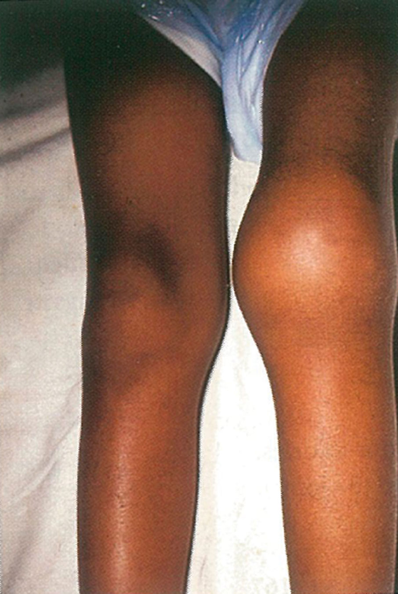
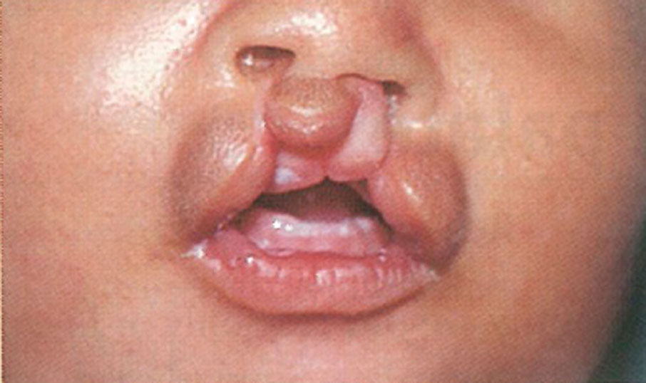

# Photographs

Heterochromia: Different-coloured eyes or blue eyes in dark skinned child
{:.figure-caption}

Waardenburg syndrome: An infant with a white tuft of hair and wide spaced eyes
{:.figure-caption}

Haemophilia: A swollen knee due to bleeding into the joint
{:.figure-caption}

Viteligo: decreased skin pigmentation
{:.figure-caption}

Oculocutaneous albinism
{:.figure-caption}

Down syndrome: The eyes slant upwards, the bridge of the nose is flat, and the tongue may protrude
{:.figure-caption}

Amputated fingers in amniotic band syndrome
{:.figure-caption}

Single transverse palmar crease
{:.figure-caption}

Bilateral cleft lip and palate
{:.figure-caption}

Isolated cleft palate
{:.figure-caption}

Club-foot
{:.figure-caption}

Infant with fetal alcohol syndrome: long smooth upper lip
{:.figure-caption}

A fetus with anencephaly exposing the brain
{:.figure-caption}

Severe lumbosacral meningomyelocoele with neural tissue exposed
{:.figure-caption}

Severe meningomyelocoele with a thin membrane covering the defect
{:.figure-caption}
