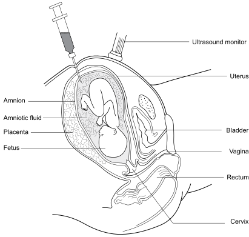

2
{:.chapter-number}

# Care, prevention and counselling

Take the chapter test before and after you read this chapter.

50622624466555

## Objectives

When you have completed this unit you should be able to:

*	Understand the care of people with birth defects.
*	Explain the principles of preventing birth defects.
*	Describe medical genetic screening.
*	Define genetic counselling.
*	Describe the purpose, principles and process of genetic counselling.
*	Be an active listener.
*	Describe the normal reaction to loss.

## Management of birth defects in a community

### 2-1 How is the problem of birth defects managed?

Managing the problem of birth defects requires the establishment of basic medical genetic services. The World Health Organisation (WHO) has defined the aim of medical genetic services as helping people with a genetic disadvantage (i.e. those affected and those at risk of having a child with a birth defect) to live and reproduce as normally as possible.

Medical genetic services require management programmes for birth defects. These consist of a comprehensive plan to:

1.	Provide the best possible care for people with birth defects, and for their families.
2.	Prevent birth defects by community education, periconception care, genetic counselling, medical genetic screening, and prenatal diagnosis and care.

> Medical genetic services combine the best possible patient care with the prevention of birth defects.

## Caring for people with birth defects

### 2-2 What care is needed for people with birth defects?

Caring for people with a birth defect involves three steps:

1.	**Recognising birth defects**
	{:.keep-with-next}

	A birth defect must be identified as early as possible to ensure the best response from treatment and genetic counselling. In low resource nations, primary health-care providers should learn to recognise birth defects and diagnose their country’s common and important birth defects. In South Africa these would include:

	*	Down syndrome.
	*	Oculocutaneous albinism.
	*	Waardenburg syndrome.
	*	Haemophilia.
	*	Fetal alcohol syndrome.
	*	Neural tube defects.
	*	Club foot.

	A definite diagnosis cannot always be made. However, it remains important to know that the person has a birth defect and to recognise the disabilities that may be associated with the birth defect.

2.	**Provide appropriate treatment**
	{:.keep-with-next}
	
	Having recognised a birth defect, the primary health-care provider has the responsibility for offering and providing appropriate treatment. This may be available in the local clinic or hospital or may require the patient to be transferred to a regional centre. Whenever possible, treatment should be provided in the primary health-care facility which is closest to the patient and the family’s home.

3.	**Offer genetic counselling and psychosocial support**
	{:.keep-with-next}

	With treatment the affected person and family, especially parents, should be offered genetic counselling and psychosocial support. As far as possible, for common disorders, this should occur at a primary health-care clinic or hospital. Counselling will help them understand and deal with the issues resulting from the birth defect.

### 2-3 Can all people with birth defects be offered the best possible care?

Yes. The World Health Organisation, in its discussions on the development of medical genetic services, realised that levels of health care are different between countries, and even within different regions of a country. Therefore, what can be offered to patients in different circumstances varies, but in any situation ‘the best possible patient care’ available should be offered.

In no circumstance should care not be offered.

### 2-4 How can you recognise a birth defect and make a genetic diagnosis?

A birth defect is identified and, where possible, a genetic diagnosis is made in the same way as all medical diagnoses by:

1.	Taking a full history: This includes a presenting history, birth history, past history, social history and a family history. The family history must be recorded as a three generation family tree. A positive family history of a disorder increases the risk of an inherited birth defect.
1.	Doing a physical examination: A full examination must be done. Many of the abnormal clinical signs (dysmorphic features) of birth defects are external and visible. These signs can be used to suggest a possible diagnosis. If a patient has three or more recognisable dysmorphic features or an obvious congenital malformation (e.g. cleft lip or spina bifida), this indicates a birth defect.
1.	Performing investigations: Investigations relevant to each case can be ordered and the results obtained.
1.	Making a final diagnosis: If possible a doctor should confirm the diagnosis before treatment and genetic counselling are offered. If a final diagnosis cannot be reached, and this is holding back the ongoing treatment and counselling of the patient, referral to an appropriate centre must be considered.

> People with three or more dysmorphic features should be assessed for a birth defect.

### 2-5 What is a three-generation family tree?

This is a drawing of family members over at least three generations (a pedigree). It helps to make a genetic diagnosis and identify the method of inheritance of inherited birth defects. The three-generation family tree is drawn after taking a careful family history. Normal individuals, people with birth defects, probable carriers (autosomal recessive or X-linked recessive) and pregnancy losses are all plotted on the family tree. One line is used for each generation.

The following symbols are used in a three-generation family tree:

*	Males are indicated with a square.
*	Females are indicated with a circle.
*	A clear square or circle is used for normal individuals.
*	A completely filled in square or circle is used for affected individuals.
*	A half filled in square or circle indicates carriers of an autosomal recessive disorder (heterozygotes).
*	A circle with a dot in the centre represents a female carrier of an X-linked recessive disorder
*	A diagonal line through a square or circle indicates that the person has died.

Parents are linked to each other with a horizontal line (marriage or partnership line), while parents and children are linked with a vertical line (descent line). Two parallel lines link parents who are related (consanguineous).

> 
> 
> Figure 2-1: A family tree of a female child with a birth defect, whose carrier parents are unaffected but consanguineous. The affected child’s grandparents and great grandfather are also carriers of the abnormal autosomal recessive gene that caused her disorder.
{:.figure}

### 2-6 What is a genetic diagnosis?

A genetic diagnosis (or genetic medical diagnosis) is the diagnosis of a disorder which is caused by an abnormal chromosome or gene (a chromosomal or genetic abnormality). Sometimes a genetic diagnosis can be made clinically by recognising a pattern of abnormal clinical signs (a syndrome).

### 2-7 Can a genetic diagnosis always be made?

No. In about 40% of people with birth defects a definitive genetic diagnosis cannot be made (e.g. the person has dysmorphic features that do not fit into a recognisable syndrome). They may present with a variety of problems including intellectual, physical, auditory (hearing) and visual (sight) disability and epilepsy. Early recognition of these disabilities is important for treatment and genetic counselling. Care must be given even if a final diagnosis cannot be made.

> People with birth defects frequently present with disabilities which can usually be treated and counselled for.

### 2-8 What treatment is available for people with birth defects?

Four means of treatment for people with a birth defect are available. Many treatments cannot cure the problem, but they can improve the quality of life. Unfortunately, many of the latest treatment methods are expensive and not available in low resource countries, including South Africa.

1.	Medical treatment: People with birth defects often have problems that can be treated with medication. Because of limited resources in developing countries, primary health-care providers often have to give and monitor these medications, if necessary, in co-operation with specialists in secondary or tertiary care centres. Examples of medical treatment that can be undertaken in primary health-care centres include antibiotics for recurrent infections, sunscreen for oculocutaneous albinism, cardiac failure treatment, blood transfusion for anaemia, factor VIII or IX for haemophilia and anti-convulsant medicines for epilepsy.
2.	Surgical treatment: Surgery, especially paediatric surgery, often saves lives or offers significant improvement for many serious birth defects. At the primary health-care level, people with conditions that can benefit from surgery need to be recognised early and transferred to the appropriate surgical unit.

	Examples include surgery for meningomyelocoele, omphalocoele and heart defects, orthopaedic manipulation and surgery for club foot, removal of congenital cataracts, and surgery for cleft lip and palate. The transfer of the patients with a birth defect, such as an omphalocoele, needs to be carefully managed to ensure that the patient arrives in the best clinical condition possible.

3.	Neurodevelopmental therapy (NDT) and rehabilitation: This should include the availability of occupational, speech and physiotherapy, and other therapies needed for rehabilitation, e.g. stoma therapy for individuals with repaired meningomyelocoele who are incontinent. They assist people with birth defects to overcome their disabilities and to integrate into society to the greatest extent possible. In some developing countries, such as South Africa, where therapists are not always available, community-based rehabilitation programmes can be developed to undertake this task and help people with disability live and function in their community.
4.	Genetic counselling and psychosocial support: Genetic counselling and psychosocial support are a major part of caring for people with birth defects and their families.

## Prevention of birth defects

### 2-9 How can birth defects be prevented?

There are two practical approaches for the prevention of birth defects:

1.	Basic reproductive health approaches to prevent birth defects.
1.	Medical genetic (population) screening, prenatal diagnosis and genetic counselling.

### 2-10 What are basic reproductive health approaches?

These are methods of preventing birth defects by ensuring normal infants are conceived and the embryo and fetus is not damaged by teratogens or constraint during pregnancy (the first eight weeks after conception). These methods need to be in place before conception and are dependent on community education, especially the education of women. These methods are also referred to as ‘primary prevention of birth defects’ and are the preferred method for the prevention of birth defects. All countries should develop their medical services to include these methods of prevention of birth defects, which are mainly carried out in primary health-care centres. They include:

1.	Family planning.
1.	Periconception care.

> Basic reproductive health approaches are methods aimed at the primary prevention of birth defects.

### 2-11 How can family planning prevent birth defects?

A functional, accessible family planning service that is well used by people is essential for the prevention of birth defects. If this service is available:

1.	Women have the option of limiting their family size. As a result, fewer infants are planned for and born. Therefore, fewer infants with birth defects are born.
1.	Women of advanced maternal age (35 years or older) can reduce their risk of having an infant with a chromosomal abnormality, particularly Down syndrome. This risk increases as they get older. Family planning allows these women the option of completing their families before 35 years of age.
1.	Women who have had a child with a birth defect that is inherited are at risk in following pregnancies of having further affected children. With family planning they have the option of not having more children.

### 2-12 What is periconception care?

Periconception care is the care of women’s health before conception (i.e. before falling pregnant) and in early pregnancy (the first eight weeks) to prevent birth defects. Periconception care tries to ensure the best possible health care for women to help them conceive a normal infant and to reduce the risks of damage to the embryo in early pregnancy. It should also include fathers in pregnancy preparation and care, and promote responsible fatherhood. The whole community should also be educated about the importance of good periconception care.

> Good periconception care can prevent some birth defects.

### 2-13 What periconception care can help to prevent birth defects?

1.	**Improve women’s diet**
	{:.keep-with-next}

	Birth defects can be caused by deficiencies of certain essential dietary nutrients (e.g. vitamins and minerals). Increasing the quantity of these nutrients in the diet can prevent certain birth defects. The best known example of a birth defect due to inadequate maternal nutrients is fetal brain damage due to the mother’s diet being deficient in iodine. This can be prevented by adding iodine into the populations’ salt supply (fortification). In South Africa table salt is fortified with iodine.

	Note
	:	Every year about 28 million infants worldwide are born at risk of mild intellectual disability, and 60 000 infants develop severe congenital hypothyroidism (cretinism), due to inadequate amounts of iodine in the mother’s diet.

	Folic acid is another example. Fortifying a staple food with folic acid, or giving folic acid as a pill (supplementation), for three months before and after conception significantly reduces the birth prevalence of neural tube defects. In South Africa, bread and maize meal are fortified with folic acid. Since starting maize meal fortification with folic acid there has been a 30% reduction in the birth prevalence of neural tube defects.

	Diet can also be improved by removing substances that can damage the embryo and fetus (teratogens). The best example is alcohol. Community education to warn women of reproductive age of the dangers of alcohol to the embryo and fetus is necessary.

	> Improving the diet of women reduces the risk of birth defects.

2.	**Avoid and treat maternal infections**
	{:.keep-with-next}

	All children, especially girls, should be immunised against rubella (German measles) as rubella during early pregnancy causes serious birth defects (congenital rubella syndrome).

3.	**Detect and treat maternal health problems**
	{:.keep-with-next}

	Diabetes mellitus and epilepsy are maternal illnesses that can be detected before pregnancy and correctly treated, reducing the risk of birth defects. Avoid drugs which may damage the embryo or fetus (teratogens) such as warfarin, lithium and some anticonvulsants.

> All girls should be immunised against rubella before reaching puberty.

## Medical genetic screening

### 2-14 What is medical genetic screening?

Medical genetic (population) screening uses tests or questions in a population to:

1.	Find people at increased risk of having a particular birth defect.
1.	Find women at increased risk of having a fetus with a birth defect.

Screening tests are not necessarily diagnostic tests.

When identified by a screening test of being at increased risk, individuals can then be offered further tests, if necessary, to confirm the diagnosis, or treatment to prevent or treat the condition. People being screened, including pregnant mothers, will not have presented with complaints or signs of the disorder for which they are screened.

Medical genetic screening can identify pregnant women at an increased risk of having an infant with a specific birth defect, e.g. Down syndrome or neural tube defect. Couples may be screened for being carriers of a common autosomal recessive disorder and therefore of being at increased risk of conceiving a child with the disorder, e.g. sickle cell anaemia and thalassaemia. For other people it detects an increased risk for themselves being affected by a particular birth defect, e.g. congenital hypothyroidism in infants.

> Medical genetic screening is a process undertaken in populations to identify people at increased risk of being affected by, or having a child with, a birth defect.

### 2-15 When can medical genetic screening tests for birth defects be done?

1.	Preconception screening: This is the ideal form of screening and prevention as it allows the parents at risk the greatest range of reproductive choices.
1.	Prenatal (antenatal) screening: This is done once pregnancy is confirmed, late in the first trimester or early in the second trimester. If medical genetic screening during pregnancy for a particular disorder is positive, then further testing may be needed to confirm or exclude the diagnosis. The mother or couple should receive genetic counselling before they consider prenatal diagnosis and again once the result of the prenatal diagnosis is available, especially if the result confirms an abnormality.
1.	Postnatal screening: This is done after birth. Medical genetic screening is done in newborn infants, older children and adults. In the newborn period the most cost-efficient means of screening is for every infant to be physically examined by a trained observer before discharge from hospital or clinic. For example, this will identify most infants with Down syndrome. Blood screening tests can also be done to screen for certain conditions, e.g. congenital hypothyroidism.

Note
:	Preconception screening is used for primary prevention as it prevents a child with a high risk of a birth defect from being conceived. Prenatal screening is used for secondary prevention as the management of a fetus with a birth defect can be planned. Once an infant with a birth defect is born, tertiary prevention consists of early recognition and diagnosis, treatment and genetic counselling to prevent, to the greatest extent possible, deterioration, complications, disability and dependency of the infant with the birth defect.

### 2-16 What medical genetic screening tests for birth defects are available?

All medical genetic screening should be carried out with the full knowledge and understanding of the person being screened. There should be pretest and post-test counselling.

1.	Preconception screening:
	*	Taking a family history.
	*	This is screening by asking questions. Taking and interpreting a three generation family history from women of reproductive age is an inexpensive way of identifying persons with an increased risk of having a child with a birth defect. This could be done in family planning clinics.
	*	Carrier (DNA) screening.
	*	Screening for carriers of common recessive single gene defects is carried out in countries with a high prevalence of these birth defects. The birth defects screened by blood tests include sickle cell anaemia, thalassaemia and cystic fibrosis. This is expensive and is only done in a few countries.
2.	Prenatal screening:
	*	Advanced maternal age screening to identify pregnant women 35 years of age and older. This is done by simply asking all pregnant women their age, and responding appropriately to those women 35 years and older.
	*	Ultrasound screening. Ultrasound screening for Down syndrome can be offered from 11 to 14 weeks gestation and a scan for other congenital abnormalities (such as neural tube and heart defects) between 18 and 23 weeks. Unfortunately, this is not generally available in South Africa due to the lack of necessary equipment and trained staff.
	*	Maternal serum screening. Maternal serum can be tested for different chemicals late in the first trimester (PAPP A and hCG) and early in the second trimester (Triple test) to calculate a risk for a fetus with Down syndrome. Maternal serum can also be used to screen for neural tube defects (alpha fetoprotein). This form of screening is not generally available in South Africa as accurate gestational ageing of the pregnancy with early ultrasound is necessary for the tests to be done.
	*	Rhesus (Rh) blood group screening to identify Rh negative women who may have an infant with neonatal jaundice and anaemia due to blood group incompatibility with her partner.
	*	DNA carrier screening. This can also be carried out on parents during pregnancy, but it is preferable to do this before conception.
3.	Postnatal screening:
	*	Clinical examination of the newborn infant by a trained examiner before discharge from the clinic or hospital. This is unfortunately not done routinely in South Africa.
	*	Newborn screening on cord blood or heel prick blood, e.g. for congenital hypothyroidism. This is only available in a few centres in South Africa.
{:.allow-break}
	
Note
:	Several birth defects can be screened for using neonate’s blood, from a heel prick, put on Guthrie cards (blotting paper). Birth defects that can be screened for in this manner include sickle cell anaemia, glucose-6-phosphate dehydrogenase deficiency, congenital hypothyroidism and inborn errors of metabolism. This is only offered in private practice in South Africa.

### 2-17 Why is medical genetic screening for birth defects not available to everyone in South Africa?

Medical genetic screening can be expensive and requires functioning health systems and infrastructure to be done correctly. Each country must decide on its priorities before establishing these screening services. In South Africa the only antepartum medical genetic screening that is offered to most of the population is for Rhesus blood grouping and syphilis. Advanced maternal age screening could and should be offered. Examination of all newborn infants by a trained examiner before discharge from the clinic or hospital should also be easily done.

### 2-18 What choices does a pregnant woman have if she has an increased screening risk for a birth defect?

If a pregnant woman is shown by genetic screening to be at increased risk for having a fetus with a birth defect, she and her partner should receive careful genetic counselling regarding their specific situation and the options available to them.

This counselling will offer them two choices:

1.	To have prenatal diagnosis: Prenatal pregnancy diagnosis can confirm whether the fetus does or does not have a particular birth defect. This may require invasive procedures such as amniocentesis to obtain fetal cells or amniotic fluid for testing. Amniocentesis involves inserting a thin needle under ultrasound guidance through the abdominal wall into the uterus. There is a small risk that the procedure will cause complications, including a miscarriage. This risk is about 1% with an experienced operator (sonographer). Woman should be informed of this risk so they can include this information in their decision on whether or not to have an amniocentesis.

	Ultrasound examination can also be used to make a prenatal diagnosis. An ultrasound examination is a non-invasive procedure that can be very helpful in identifying structural abnormalities.

	Note
	:	In specific circumstances fetal cells can also be obtained by chorionic villus (placental) biopsy or cordocentesis (drawing blood from the umbilical cord). Both have higher complication risks than amniocentesis and are only offered at a few tertiary centres and in private practice in South Africa.

2.	To continue the pregnancy without prenatal diagnosis: A pregnant woman may decide to take this choice, knowing and understanding the risks of having an infant with a birth defect.

> 
> 
> Figure 2-2: Amniocentesis to obtain a sample of amniotic fluid.
{:.figure}

## Parents’ choices with prenatal diagnosis

### 2-19 What choices does a woman have with a confirmed prenatal diagnosis of a birth defect?

Once a pregnant woman, preferably together with her partner, has received careful genetic counselling regarding her specific situation, she should consider the options available to her. It is particularly important that she is given detailed information about the severity of the disability and the mortality risk associated with the specific birth defect. The health-care facilities available to manage an infant born with that particular birth defect must also be known. Only then, can she make a choice of whether to continue with the pregnancy.

Note
:	Any discussion with the parents must be within the limits of the legal terms of reference of the country (Choice on Termination of Pregnancy Act 92, 1966 in South Africa). The counselling must be non-directive, not coercive and respect the religious, moral and personal beliefs of the parents. The parents’ decisions are paramount and must be accepted and respected.

## Genetic counselling

### 2-20 What is counselling?

Counselling is a process of education, communication and support by which a counsellor helps a person or people to cope with difficult situations in their lives so that they are able to make important decisions and find realistic ways to solve their problems. Counselling, therefore, helps people to make their own informed decisions and supports their choices, rather than simply telling them what to do.

### 2-21 What is a counsellor?

A counsellor is someone who is trained to educate, assist and give psychosocial support to people with problems. They offer relevant information and discuss options for people to manage their problems and better cope with their lives. This empowers peoples to make their own decisions and take the best course of action according to their personal circumstances, customs, and religious and moral beliefs.

> Counselling is about empowering people to make their own informed decisions and to cope with or solve their own problems.

### 2-22 What important skills are needed to counsel?

Two essential skills are needed for counselling:

1.	A good knowledge of the topic or situation being discussed.
2.	The ability to communicate effectively. Effective communication is the basis of counselling.

### 2-23 What is effective communication?

Communication in counselling is a two-way process in which information, knowledge, thoughts and ideas are passed between the people being counselled and the counsellor. The spoken word is the most important means of communication.

However, the counsellor must be aware that people may also pass important messages by showing their emotions and in their body language (how they act). The counsellor must learn to pick up these signs as it helps in gathering information and giving appropriate understanding (empathy) and emotional support.

Effective communication requires the skill of active listening.

> Effective communication is a combination of active listening and using words with care and consideration.

### 2-24 What is active listening?

Active listening is the process of hearing not only the words people say, but also noting their body language and emotional reactions, and trying to understand the meaning behind their words and actions. In order to understand what a person is saying and to respond appropriately, the counsellor must become skilled in actively listening to people.

### 2-25 What is needed for active listening?

A good listener should:

1.	Put the person being counselled at ease so that they can feel free to talk.
1.	Remove distractions and concentrate on what is being said. Close the door. Do not take phone calls, fiddle with notes or tap your pencil.
1.	Not talk too much. You cannot listen if you keep talking. Be silent when silence is needed. Do not interrupt unnecessarily or finish people’s sentences.
1.	Show interest and empathy.
1.	Try to put yourself in the place of the person being counselled so that you can see and understand the problem from their point of view.
1.	Be patient, and allow and answer questions.

> Active listening is the key to effective counselling.

### 2-26 What else can help effective communication?

1.	Choose your words carefully. Ensure that what you say is what the person being counselled will understand.
1.	Say what you mean and give simple messages.
1.	Remember that as you can receive messages from the person being counselled from their body language, emotional reactions and tone of voice, so can you pass messages to them in the same way. Make sure you pass the ‘right’ message.
1.	Repeat important information and make sure it is understood.

> ‘Words are like medication, they have the ability to heal but their side effects can be harmful.’

### 2-27 What can block effective communication?

1.	Talking more than listening.
1.	Interrupting and arguing.
1.	Being judgemental, critical, threatening or, manipulative.
1.	Being uninterested.
1.	Trying to control the discussion. Communication is a two-way process.
1.	Concentrating only on facts, not feelings.

> ‘If you do not listen to the person being counselled, do not expect them to listen to you.’

### 2-28 What is genetic counselling?

Genetic counselling is an educational process which helps people with a birth defect, or a risk of giving birth to a child with a birth defect, and their families to understand:

1.	The diagnosis (what is the problem).
1.	The cause of the birth defect, including the method of inheritance.
1.	The clinical effects, prognosis and available treatment for the birth defect.
1.	The risks of recurrence of the birth defect in future pregnancies or other family members.
1.	The options for reducing these risks or preventing the birth defect in future pregnancies.

### 2-29 Who can be helped by genetic counselling?

Genetic counselling helps people and their families who are:

1.	Affected by a birth defect.
1.	At risk of inheriting a birth defect.
1.	At risk of passing on a birth defect to their children.
1.	Carrying a fetus with a birth defect.

Genetic counselling assists these people to make their own informed decisions and choices. It also helps them take charge and accept responsibility for coping with and solving situations in their lives that occur because of a birth defect.

> Genetic counselling helps individuals or families who have a birth defect, or are at risk of giving birth to a child with a birth defect, to understand, manage and come to terms with the situation.

### 2-30 How is genetic counselling done?

The main steps in genetic counselling can be remembered by using the word DIAS (i.e. an anagram). DIAS stands for:

1.	**D**efine the problem:
	{:.keep-with-next}

	Confirm a diagnosis, if possible, and identify those issues, related to the diagnosis, concerning the counselled person or persons. Find out from the person or people being counselled what they expect and need from the genetic counselling.

2.	**I**nform:
	{:.keep-with-next}

	Inform fully (educate) the person or the people being counselled about the diagnosis, the cause, the clinical features and the prognosis, the available treatment, genetic risks (risk assessment) and the options for risk reduction or prevention in future pregnancies and family members.

3.	**A**llow people to make their own decisions:
	{:.keep-with-next}

	With the information available to them, the individuals or family should be encouraged to make their own decisions regarding their situation based on to their personal circumstances, customs, religious and moral beliefs (autonomous decision making). These decisions must be accepted and respected by the genetic counsellor, nursing staff and medical team involved in their care.

4.	**S**upport:
	{:.keep-with-next}

	During the genetic counselling process, and thereafter, individuals and family should receive the understanding (empathy), psychological (emotional) and social support they may need or request to enable them to make the necessary decisions and to adjust to their particular circumstances. This may require referring them to other professionals and social agencies.

Note that there are enormous differences between genetic counselling and simply providing information and advice.

A number of different social grants are available for individuals with birth defects in South Africa (as listed in [Addendum B](8.html)).

### 2-31 What are the principles of genetic counselling?

1.	Non-directive education. Therefore the genetic counsellor must:
	*	Have the appropriate information to do the counselling. If not, the counsellor should acquire this information or have the confidence to refer the person or people being counselled to someone with the knowledge.
	*	Make sure the person or people being counselled are fully informed. The counsellor must pass on all the knowledge he or she has on the topic under discussion, including the good and the bad aspects.
	*	Give the necessary information in a language, and at a level of understanding, that the person or people being counselled fully understand.
	*	Give the information to the person or people being counselled in a non-directive manner. This means the information is given in a way that must not influence their future decisions in the direction the counsellor would choose.
2.	Enabling people to decide for themselves. Therefore the genetic counsellor must:
	*	Ensure that each person being counselled must be allowed to make their own decisions. Their choices may be very different from that of the counsellor.
	*	Empower the persons being counselled to make their own decisions.
	*	Respect and accept these decisions, even if they would not be the option chosen by the counsellor, i.e. be non-judgemental. Reassure them that the medical team working with them will also respect and accept their decisions and make sure they continue to get proper care.
3.	Providing support. Therefore the genetic counsellor must:
	*	Encourage people being counselled to express their feelings and needs freely.
	*	Provide non-judgemental communication and support for the individual and family choices and encourage the medical and genetics management team do the same.
	*	Maintain confidentiality within the management team.

### 2-32 What must be known to be able to give genetic counselling?

1.	Who should receive genetic counselling?
2.	The clinical details and natural history of the common birth defects, especially the birth defect on which the patient or parents are being counselled. This includes diagnoses where available, cause, clinical features, prognosis, and available treatment and options for reduction of recurrent risk or prevention.
3.	How to obtain a detailed family history and construct a three-generation family tree.
4.	How to use the family tree to decide on the mode of inheritance for the disorder in the family tree.
5.	How to estimate simple genetic recurrence risks from a family tree.
6.	The details of genetic tests (e.g. chromosomal analysis) and procedures (e.g. amniocentesis) for prenatal and postnatal screening and diagnosis of common birth defects.
7.	Basic counselling skills.
8.	The local, provincial and national resources available for care of individuals with birth defects.
8.	The parent support group facilities available locally, provincially and nationally.

### 2-33 What are the characteristics of a good genetic counsellor?

A good genetic counsellor should:

1.	Be knowledgeable regarding the situation or disorder that is under discussion.
1.	If not knowledgeable, they should be able to get the appropriate information, or have the confidence to refer those being counselled to someone who does have the information.
1.	Be honest.
1.	Have the courage to be able to say ‘I don’t know’. It is not possible to know everything you may need in a given situation. You can always find answers later or refer them to someone who will know.
1.	Be a good listener and good communicator. This helps to build a relationship of trust and acceptance so that feelings can be expressed, even negative or bad ones.
1.	Be respectful of the other person’s feelings and point of view, understanding that every person is an individual who will experience their problem in their own unique way.
1.	Be non-judgemental (do not judge what is right and wrong or place blame).
1.	Be relaxed and calm, i.e. controlled. A counsellor should not become emotionally involved with people receiving counselling.
1.	Be non-directive. This means to give the people being counselled the necessary information they need, and the options they have, in a manner that does not influence, one way or the other, the decisions they have to make.
1.	Be trustworthy and respectful of confidentiality.
1.	Be able to ‘break bad news’.
1.	Be able to support people through their problems, including the normal mourning (grieving) process associated with death or serious problems.
1.	Be patient, caring and understanding.

### 2-34 What are the physical requirements for genetic counselling?

1.	A place with privacy and relative comfort to consult with the people being counselled. There should be as few interruptions as possible (telephones, cellphones, bleepers, noise and people coming in and out).
1.	People being counselled and the counsellor should be able to sit reasonably close so that they can hear and interact with each other but not feel cramped or uncomfortable. Big desks form a barrier between the people involved and prevent easy interaction. Ideally counselling is a ‘round table conference’.
1.	Enough time must be available for the counselling to fully cover the problems being discussed.

### 2-35 Who should provide genetic counselling?

A doctor, genetic-trained nurse or genetic counsellor, provided they are competent and have received appropriate training.

Nursing staff, with appropriate training, have been found to be competent at providing genetic counselling in under-served areas in South Africa. Unfortunately, due to the lack of trained and experienced staff, people needing genetic counselling are often counselled by untrained or poorly trained people.

### 2-36 Who needs genetic counselling?

Any person who is affected by a birth defect, or at risk of inheriting a birth defect, or at risk of passing on a birth defect to their children.

These include:

1.	People with a birth defect.
1.	Parents of a fetus, infant or child with a birth defect.
1.	Parents of an unexplained intrauterine, neonatal or infant death, if this was considered to be due to a birth defect.
1.	People with a family history of a birth defect, who are considering having children.
1.	Couples who are married to a relative, such as a cousin (consanguinity).
1.	People diagnosed as carriers or at risk of being a carrier of a recessive genetic disorder, e.g. haemophilia or oculocutaneous albinism.
1.	Couples diagnosed with an abnormal fetus on ultrasound examination.
1.	Women who have had recurrent pregnancy losses (more than two miscarriages).
1.	Pregnant women, or women who wish to have an infant, where the fetus is at risk of a birth defect because of fetal infection (e.g. rubella), maternal disorders (e.g. diabetes) or teratogens (e.g. alcohol).
1.	Couples identified by prenatal screening who have an increased risk of a birth defect (e.g. advanced maternal age, abnormal ultrasound or a positive maternal serum screening test).

> Any person who is affected by a birth defect, at risk of inheriting a birth defect, or at risk of giving birth to a child with a birth defect should be offered genetic counselling.

## Breaking bad news

### 2-37 Why is breaking bad news about birth defects difficult?

When a woman is pregnant her wish and expectation are for the birth of a normal child. Giving a woman and her partner news about a birth defect causes them great distress. They will have to face loss, including loss of life, health or the possibility of not having a normal child.

People who are faced with loss tend to respond in a manner which can be predicted. Counsellors breaking bad news should be aware of this so that they can assist people through the process.

### 2-38 How do people respond to loss?

People who suffer loss may go through a typical series of reactions. These are:

1.	Denial:
	{:.keep-with-next}
	
	When faced with bad news involving loss, many people first refuse to believe what they have been told. This is their way of giving themselves time to begin to deal with and understand the terrible news that causes them to feel hopeless and helpless.

2.	Anger:
	{:.keep-with-next}

	Once they realise the news is true; the next reaction may be anger, rage or resentment. This is often directed at other people including family members (e.g. wife or husband, father or mother), friends, medical or nursing staff and even God. It is a defence that people use to protect themselves against despair, and a genetic counsellor must understand this and support the person being counselled through this stage.

3.	Bargaining:
	{:.keep-with-next}

	In this stage, which is usually short, people may try to enter into some sort of bargain with God, to try and reverse or put off feeling the loss.

4.	Depression:
	{:.keep-with-next}

	Eventually, after a person has denied, raged and bargained they begin to realise the great loss they have suffered and this may result in depression. They need to receive acceptance, understanding and empathy, and be given space to freely express their feelings to help them through this period.

5.	Acceptance:
	{:.keep-with-next}

	Eventually the loss is accepted and the person begins to adjust to the changes the loss has brought to their life. At first there is a feeling of numbness which becomes a very sad period. Although this sadness will be overcome and the person will continue with their life, at times in the future they will be reminded of their loss, resulting in sadness or anger once again.

Before reaching acceptance, some people may move forward and backward through the above stages while others may only go through some of the stages.

> The normal response to loss is a sequence of denial, anger, bargaining, depression and acceptance.

### 2-39 Can reactions to loss be abnormal?

Yes. Some people have an abnormal grieving (mourning) reaction. They may take too long or not be able to pass from one stage to another, or have an abnormally strong reaction in a particular stage. Thus a person may become stuck in denial and be unable to come to terms with the bad news, have excessive anger, which can damage their relationships with family and friends, or cause them to blame caregivers, or become pathologically depressed.

The genetic counsellor needs to be aware that abnormal grieving reactions can develop, be able to recognise them as early as possible, and refer the person for expert management.

### 2-40 How does a genetic counsellor break bad news?

Genetic counsellors have to use their ability in effective communication to break bad news. Preparing for and breaking bad news is very important because the way this is done may greatly affect the response of the person receiving the news. The counsellor should therefore follow guidelines to try and ensure that this is done in the best possible manner. This should include:

1.	Find a suitable environment for the counselling session.
1.	Decide who should be in the counselling session and ensure everyone is politely introduced.
1.	Establish from the person being counselled their knowledge and understanding of the situation under discussion. Also assess their general level of understanding and awareness so that your discussions will be at a level that is understandable.
1.	If appropriate, assess through careful questioning how much the person wants to know.
1.	Inform the person being counselled of the bad news. Do this carefully and gently, offering small amounts of information at any one time. When people receive bad news they often cannot take in too much information at a time.
1.	Use simple language, leaving out medical terms they will not understand (e.g. trisomy 21 or tetralogy of Fallot) and use teaching aids (e.g. pictures) if necessary.
1.	Every now and then check to see if they understand what is being told to them.
1.	Be prepared and willing to repeat information one or more times.
1.	Answer questions to the best of your ability, and never be afraid to say that you do not know. Answers can be found later or you can refer them to someone who will know.
1.	Write down the main points or give them prepared written information about the birth defect so that they can read and think about the information later.

End the counselling session with an open invitation to those being counselled to contact the genetic counsellor with any further queries, need for psychosocial support or for further genetic counselling they require. Provide them with contact particulars.

## Case study 1

A woman who is one month pregnant, and has a three-year-old child with a birth defect, visits her family doctor and asks if anything can be done to find out whether her fetus has the same birth defect. After taking a careful family history, the doctor draws a three-generation family tree.

### 1. How can birth defects be screened for during pregnancy?

*	Older women (35 years or older) are at an increased risk of having a fetus with birth defects, especially Down syndrome. All pregnant women should be asked their age when pregnancy is confirmed. If 35 years or older they should be counselled and offered genetic screening and prenatal diagnosis (amniocentesis) when indicated.
*	Ultrasound scanning late in the first trimester and then again between 18–23 weeks gestation can screen many birth defects.
*	Maternal serum tests can be used to screen for Down syndrome (late first trimester) and neural tube defects (early second trimester).
*	All pregnant women should be screened for their Rhesus blood group so that haemolytic disease of the newborn can be avoided.

### 2. What can be done before pregnancy to reduce the risk of child with birth defects?

The risk of having a child with birth defects can sometimes be reduced with basic reproductive health approaches, such as family planning (deciding not to conceive) and periconception care.

### 3. What is periconception care?

This is the care of women before conception and during the first eight weeks of pregnancy, which may reduce the risk of birth defects. It aims for optimal health care for women before conception and in early pregnancy to increase the chance of a normal infant.

### 4. Give examples of how periconception care can prevent birth defects?

*	Improve the woman’s diet by food supplementation or fortification. In South Africa iodine fortification of table salt can prevent fetal brain damage due to iodine deficiency while folic acid fortification of maize meal has reduced neural tube defects by 30%.
*	Avoid dangerous substances in the diet such as alcohol.
*	Make sure that all women are immunised against rubella before they reach childbearing age.
*	Detect and correctly treat maternal illnesses such as diabetes and epilepsy.
*	Make sure that any medication taken is safe for the fetus.

### 5. What are supplementation and fortification?

Essential substances, such as folic acid and iodine, can be added to food in the diet (fortification) or can be taken separately as a pill, tablet or capsule (supplementation). Folic acid and iodine are often provided as either fortification or supplementation.

### 6. What is a three-generation family tree?

This is a drawing (a pedigree) of three generations of that family showing normal individuals and those who have a birth defect or are carriers of a birth defect.

### 7. What is the value of a three-generation family tree?

It helps to identify patterns of inheritance of a birth defect, e.g. autosomal dominant, autosomal recessive or X-linked recessive. This makes it easier to predict whether a birth defect is likely to occur in a given pregnancy.

## Case study 2

Parents who plan a family are concerned about the possibility of having a child with birth defects. They speak to friends and say they have heard about medical genetic screening for birth defects but do not know what the term means.

### 1. What is medical genetic screening?

MedicaI genetic screening, or population screening, is a system that uses questions or tests in a community to identify individuals at increased risk of having a birth defect or a woman having a child with a birth defect.

### 2. What is the importance of identifying people at increased risk?

They can be offered further tests to confirm whether or not they, or their fetus, have the birth defect or are likely to pass the problem on to their children.

### 3. Do these people not already have signs of the clinical condition?

No. This is why they need to be identified by a screening method.

### 4. What is the importance of being identified as having a birth defect or possibly passing a genetic defect on to one’s children?

Prevention or treatment can be offered to these people. For example, they may decide not to have children if there is a high chance that their children may be affected by a serious genetic defect, such as cystic fibrosis. On the other hand, the infant could be offered treatment for a condition, such as haemophilia, before it presents with serious complications.

### 5. When can screening be done to prevent birth defects?

*	Before conception (preconception screening).
*	During pregnancy (prenatal screening).
*	After delivery (postnatal screening).

### 6. Can you give an example of each?

*	Before conception – DNA carrier screening for common single gene defects, e.g. cystic fibrosis.
*	During pregnancy – Early ultrasound scanning or maternal serum screening for Down syndrome.
*	After delivery – blood screening for congenital hypothyroidism.

## Case study 3

A nurse wants to train as a genetic counsellor. She speaks to the tutor of a genetic counselling course to find out more about counselling. She also reads a book about caring for parents of children with birth defects.

### 1. What is genetic counselling?

It is a process of education, communication and support which helps people with a birth defect or who are at risk of giving birth to a child with a birth defect. It enables them to understand the diagnosis, cause, method of inheritance, clinical effects, prognosis and treatment and risk of recurrence of the birth defect.

### 2. How is genetic counselling provided?

The main goals of a genetic counsellor are:

*	Defining the problem.
*	Informing and educating.
*	Allowing people to make their own decisions.
*	Supporting them.

Remember ‘DIAS’.

### 3. Why is counselling more than simply giving good advice?

During counselling, people are educated about their problems, receive options for managing the situation and are empowered to try and understand their problem and then make the best informed decision for themselves. They are helped to come to terms with their situation and solve the problems that occur.

### 4. What essential skill does a genetic counsellor need?

They should be able to communicate well with people. Active listening is particularly important.

### 5. What is active listening?

It is the ability to hear not only the words people say but also note and interpret their body language and emotional reactions. This helps to understand the meaning behind their words.

### 6. What are common mistakes, which may prevent active listening?

*	Talking more than listening.
*	Interrupting and arguing.
*	Being judgemental.
*	Concentrating only on facts and not also feelings.

### 7. What are the expected normal responses to loss?

*	Denial.
*	Anger.
*	Bargaining.
*	Depression.
*	Acceptance.
