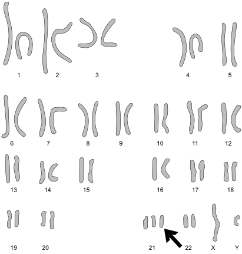
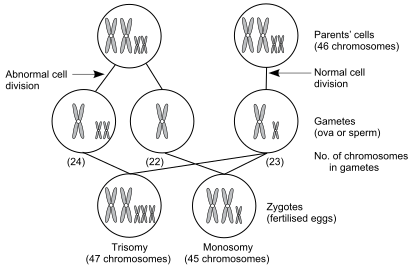

3
{:.chapter-number}

# Down syndrome

Take the chapter test before and after you read this chapter.

50623465650554

## Objectives

When you have completed this unit you should be able to:

*	Define Down syndrome.
*	Understand the causes of Down syndrome.
*	Explain the risk factors for Down syndrome.
*	List the clinical features and complications of Down syndrome.
*	Plan the care of a child with Down syndrome.
*	Understand how the risk of having a child with Down syndrome can be reduced.
*	Recognise an infant or child with Down syndrome.
*	Describe how Down syndrome can be diagnosed antenatally.

## Introduction to Down syndrome

### 3-1 What is Down syndrome?

Down syndrome is the name given to a recognisable pattern of clinical features. Signs of Down syndrome include a typical facial appearance, intellectual disability, hypotonia (floppiness), congenital heart defects and other birth defects. These children can be recognised as they all have a similar physical appearance.

> Individuals with Down syndrome can be recognised clinically.

Down syndrome is the correct term for this condition although it is often called Down’s syndrome. The old terms ‘Mongol’ and mongolism are not acceptable and are no longer used. Down syndrome is a typical example of a chromosomal disorder.

Note
:	The syndrome was first described in 1866 by Dr Langdon Down in London. A genetic syndrome is a collection of clinical features and birth defects that can be recognised as being a consistent pattern.

### 3-2 How common is Down syndrome?

Down syndrome occurs in all communities and ethnic groups. In many developing (low resourced) countries the birth prevalence (number of affected infants/1000 live birth) is 2 to 3 per 1000 live births. In industrialised (high income) countries, the birth prevalence is less than 1.5/1000 live births.

In South Africa the birth prevalence of Down syndrome is 2.1/1000 live births in the Limpopo Province (a poor rural area) and 1.8/1000 in Soweto (a more developed urban area).

The prevalence (number of affected infants and children per 1000 children in the community) falls rapidly in developing countries as many affected children die in infancy or early childhood. For example, in Limpopo Province the prevalence of Down syndrome in children aged two to nine years is only 0.74/1000, indicating that 65% of affected children have already died by two years of age.

> The birth prevalence of Down syndrome in South Africa is about two per 1000 live births.

Table 3-1: The birth prevalence of Down syndrome and all chromosomal abnormalities in women of increasing age
{:.table-caption}

<table>
<thead>
  <tr>
    <td>
Maternal age in years
</td>
    <td>
Birth prevalence of live born infants with Down syndrome
</td>
    <td>
Birth prevalence of all live born infants with any chromosomal abnormality
</td>
  </tr>
  </thead>
  <tbody>
  <tr>
    <td>
15
</td>
    <td>
1/1000
</td>
    <td>
1/450
</td>
  </tr>
  <tr>
    <td>
20
</td>
    <td>
1/1734
</td>
    <td>
1/36
</td>
  </tr>
  <tr>
    <td>
25
</td>
    <td>
1/1250
</td>
    <td>
1/476
</td>
  </tr>
  <tr>
    <td>
30
</td>
    <td>
1/965
</td>
    <td>
1/385
</td>
  </tr>
  <tr>
    <td>
35
</td>
    <td>
1/386
</td>
    <td>
1/192
</td>
  </tr>
  <tr>
    <td>
36
</td>
    <td>
1/300
</td>
    <td>
1/16
</td>
  </tr>
  <tr>
    <td>
37
</td>
    <td>
1/234
</td>
    <td>
1/127
</td>
  </tr>
  <tr>
    <td>
38
</td>
    <td>
1/182
</td>
    <td>
1/102
</td>
  </tr>
  <tr>
    <td>
39
</td>
    <td>
1/141
</td>
    <td>
1/83
</td>
  </tr>
  <tr>
    <td>
40
</td>
    <td>
1/110
</td>
    <td>
1/66
</td>
  </tr>
  <tr>
    <td>
41
</td>
    <td>
1/86
</td>
    <td>
1/3
</td>
  </tr>
  <tr>
    <td>
42
</td>
    <td>
1/66
</td>
    <td>
1/42
</td>
  </tr>
  <tr>
    <td>
43
</td>
    <td>
1/3
</td>
    <td>
1/33
</td>
  </tr>
  <tr>
    <td>
44
</td>
    <td>
1/40
</td>
    <td>
1/26
</td>
  </tr>
  <tr>
    <td>
45
</td>
    <td>
1/31
</td>
    <td>
1/21
</td>
  </tr>
  <tr>
    <td>
46
</td>
    <td>
1/24
</td>
    <td>
1/16
</td>
  </tr>
  <tr>
    <td>
47
</td>
    <td>
1/19
</td>
    <td>
1/13
</td>
  </tr>
  <tr>
    <td>
48
</td>
    <td>
1/15
</td>
    <td>
1/10
</td>
  </tr>
  <tr>
    <td>
49
</td>
    <td>
1/11
</td>
    <td>
1/8
</td>
  </tr>
  </tbody>
</table>

### 3-3 Why is the birth prevalence of Down syndrome higher in developing countries?

The risk of a woman having an infant with Down syndrome increases as she gets older. It is especially high once she reaches 35 years. Advanced maternal age (AMA) is the term used to describe pregnant women of 35 years or older.

In developing countries a higher percentage of pregnant women are of advanced maternal age. They also often do not have access to, or use, family planning (contraception), prenatal screening, prenatal diagnosis, genetic counselling and selective termination of pregnancy. As a result the birth prevalence of Down syndrome is high.

The exception is China. Because of their one child per family policy, women usually choose to have their child between 25 and 27 years of age when the risk of Down syndrome is low. Therefore, the birth prevalence of Down syndrome in China is the lowest in the world at less than 1/1000 live births.

In industrialised countries, women are aware of their increased risk of having a child with Down syndrome. Therefore, most use family planning and choose not to fall pregnant once they reach 35 years of age. This lowers the percentage of pregnant women of advanced maternal age and, therefore, reduces the birth prevalence of Down syndrome in these countries.

Note
:	In industrialised countries the percentage of women of advanced maternal age dropped between 1950 and 1980 with the introduction of oral contraception. With this the birth prevalence of Down syndrome dropped from 2.5 to less than 1.5/1000 live births. In the last 20 years more women are having children at an advanced age as they choose to have their families late for social reasons. Because they have access to, and use, genetic services the birth prevalence of Down syndrome has remained low.

> The risk of having an infant with Down syndrome increases with advanced maternal age.

Note
:	The risk of Down syndrome more than doubles between 30 and 35 years of age from 1/965 (approximately 1/1000) to 1/386 (approximately 2.6/1000.

### 3-4 Are most infants with Down syndrome born to older women?

Yes. In most developing countries where a higher percentage of pregnant women are of advanced maternal age, most infants with Down syndrome are born to older mothers. In addition, services for prenatal screening, prenatal diagnosis, genetic counselling and selective termination of pregnancy are often not available. For example, in South Africa more than half of infants with Down syndrome infants are born to mother aged 35 years or older.

In industrialised countries, where women use contraception and have access to genetic services, a lower percentage of mothers are of advanced maternal age and most infants with Down syndrome (above 60%) are born to mothers under 35 years of age.

### 3-5 Is Down syndrome well known in all communities?

In industrialised countries, Down syndrome is well publicised so that most members of the community know about the condition. In contrast, the condition is not well known in many developing communities, who may not even have a local name for the condition.

The lack of awareness of Down syndrome in many rural communities in South Africa results in many affected children being undiagnosed. This situation is improving with education to inform health-care workers and the community about Down syndrome.

Note
:	In the early 1990s in Gauteng Province only 3% of mothers of infants with Down syndrome were aware of the condition before the birth of their infant. By 1997, due to education of the community and medical and nursing staff, 47% of mothers presenting for advanced maternal age counselling knew of Down syndrome.

### 3-6 What is the cause of Down syndrome?

Down syndrome is the commonest chromosomal disorder in live born infants. It is caused by extra material from chromosome 21 being present in the body’s cells. Individuals with Down syndrome usually have three, instead of the normal two, chromosomes 21 in all body cells. This is called trisomy 21 (‘tri’ means three) … because of the extra chromosome 21, each cell now has a total of 47 chromosomes instead of the normal 46. An extra chromosome 21 (non-disjunction resulting in trisomy 21) is the cause of Down syndrome in more than 95% of affected children. The risk of recurrence is low.

> Down syndrome is caused by the presence of extra chromosome 21 material in the cells of the body.

About 3% of infants with Down syndrome do not have a whole extra chromosome 21 but an extra piece of a chromosome 21 is added (translocated) onto another chromosome. The total number of chromosomes is therefore normal at 46 (but one of the chromosomes looks longer than usual as it has an extra piece of a chromosome 21). This is called translocation Down syndrome. This may occur for the first time (a new mutation) or be inherited from a parent who is a balanced translocation carrier. If inherited then the parents have a high risk in future pregnancies for further children with translocation Down syndrome.

In the other 2% of infants with Down syndrome, only some of their body cells have an extra chromosome 21. This is known as mosaicism. It has the lowest risk for recurrence in future pregnancies.

> Down syndrome is almost always caused by trisomy 21.

The appearance of children with Down syndrome is the same whether the extra chromosome 21 material is due to trisomy, translocation or mosaicism.

> 
> 
> Figure 3-1: The appearance of the chromosomes in trisomy 21 (karyotype). Note that there are three instead of the normal two chromosomes 21.
{:.figure}

### 3-7 How does trisomy 21 occur?

Trisomy 21 (having an extra chromosome 21) is caused by non-disjunction. This is an unequal sharing of the 46 chromosomes when forming the ova (eggs) or sperms (i.e. the gametes) before fertilisation. In this division, each ovum or sperm should get 23 chromosomes. However, in non-disjunction this division is incorrect. The chromosomes 21 pair do not separate, as they should. Instead, one gamete (ovum or sperm) gets two chromosomes 21, while the other gets none. In trisomy 21, usually the ovum, with two copies of chromosome 21 (instead of one), is fertilised by a normal sperm with one copy of chromosome 21. As a result, the zygote (the fertilised cell from which the embryo and fetus will develop) now has three copies of chromosome 21 (instead of two) with a total of 47 chromosomes.

Note
:	Down syndrome usually occurs because of non-disjunction in the ovum of the mother (80%). However, in 20% of people with Down syndrome the non-disjunction takes place in the father, and it is the sperm that has the extra chromosome 21.

> 
> 
> Figure 3-2: Non disjunction to give trisomy 21
{:.figure}

### 3-8 How can one recognise a person with Down syndrome?

Infants, children and adults with Down syndrome, throughout the world, have a similar appearance. They have clinical features which can be recognised. However, the clinical diagnosis of Down syndrome is frequently missed in infants in South Africa. To prevent this, the clinical diagnosis of Down syndrome must be based on a complete history and physical examination, and not just looking for the facial typical appearance. The clinical diagnosis should be confirmed by a blood test.

Note
:	In South Africa, research shows that only 16% of newborn infants with Down syndrome are diagnosed by health-care workers in the hospital or clinic after delivery. Less than 50% of infants with Down syndrome are diagnosed before six months of age, even though they have attended clinics for their immunisations.

### 3-9 What are the main recognisable features of Down syndrome?

The main clinical features of Down syndrome are:

1.	Hypotonia (floppy infant).
1.	A typical facial appearance.
1.	Poor sucking and feeding.
1.	Abnormalities of the hands and feet.
1.	Poor Moro reflex.
1.	Developmental delay (poor head control with head lag, slow to sit when propped up, and unable to bear weight on legs).
1.	Intellectual disability.
1.	Signs of congenital heart defects.
1.	Growth restriction with short stature (stunting).
1.	A small penis.

### 3-10 What are the typical facial appearances of a person with Down syndrome?

There are a number of abnormalities seen in the face, head and neck of a person with Down syndrome.

1.	Face:
	*	A small, round, flat face.
	*	Upward slanting eyes with epicanthic folds (prominent skin folds at the inner corner of the eyelids).
	*	A flat nasal bridge.
	*	Relatively big tongue and small, open mouth. Therefore, the tongue often protrudes (sticks out of the mouth).
2.	Head:
	*	The head is round with a flat occiput (back of the head). This is called brachycephaly.
	*	The head circumference is often smaller than normal.
	*	The ears are small and may be malformed and low set.
3.	Neck:
	*	The neck is short.
	*	Skin over the back of the neck is loose, forming folds.

> Children with Down syndrome all look alike.

### 3-11 What are the typical features of the hands of a person with Down syndrome?

Infants, children and adults with Down syndrome all have hands that look alike and can easily be recognised. The typical hand appearance includes:

1.	Short, broad hands with short stubby fingers (brachydactyly).
1.	Most have a single palmar crease on one or both hands.
1.	They often have short, incurved small fingers (clinodactyly) and may only have a single crease on their little finger.

### 3-12 What are the typical features of the feet of a person with Down syndrome?

Infants, children and adults with Down syndrome also have feet that look alike. The typical features are:

1.	They are short and broad, similar to the hands.
1.	A wide gap between the large and second toe is common (sandal gap).
1.	A crease extending from the sandal gap towards the heel is common. This may not be obvious in children who do not wear shoes.

> People with Down syndrome have short, broad hands and feet.

### 3-13 What are the signs of hypotonia in an infant with Down syndrome?

Infants with Down syndrome are floppy (hypotonic) and have a poor Moro reflex. Obvious floppiness (hypotonia) is most marked during the first months of life. There is head lag and usually an incomplete Moro reflex. Hypotonia is the most consistent sign in Down syndrome. When handled, infants feel like a rag doll. Mothers often complain when their infants reach four months of age and still do not have head or neck control. As children with Down syndrome grow older the hypotonia becomes less obvious.

> All newborn infants with Down syndrome have hypotonia.

### 3-14 Why do infants with Down syndrome feed poorly?

Infants with Down syndrome often have feeding difficulties during the first weeks of life. They feed slowly with a poor suck and have difficulty swallowing due to the relatively big tongue. Feeds may have to be given by tube or cup at first before they can breastfeed adequately. Their hypotonia and frequent blocked nose contribute to the feeding problems. However, over the weeks their feeding improves. Heart failure, caused by congenital heart defects, may also cause poor feeding, and needs to be treated.

> Poor feeding is common in infants with Down syndrome.

### 3-15 Are all people with Down syndrome intellectually disabled?

Down syndrome is the commonest genetic cause of developmental delay and intellectual disability. The milestones of infants and children with Down syndrome are slow, co-ordination is poor, and language and social development are delayed. They are all intellectually disabled to a greater or lesser degree. However, the degree of intellectual disability varies widely. With early and appropriate encouragement and stimulation, the level of intellectual disability can be improved. These children can then be mainstreamed into normal schools, although their progress will be slow and they will need special attention. When children with special needs, such as Down syndrome, are put in normal schools rather than special schools, this is called ‘inclusion’. Whenever possible, this is the educational policy in South Africa.

As adults, people with Down syndrome work well and some may find work in the open labour market or in sheltered employment. South Africa’s new labour laws promote the employment of people with disability.

Unfortunately, the degree of impaired learning disability has been exaggerated in the past when little effort was made to encourage these children to reach their developmental potential. With late or little stimulation, intellectual disability is often severe, further disadvantaging them and hindering their integration into society.

> All people with Down syndrome have some degree of intellectual disability.

Note
:	The term intellectual disability is preferred to mental retardation.

### 3-16 What is the pattern of growth in infants with Down syndrome?

Most South African newborns with Down syndrome are born at term (37 to 42 weeks) and have an average birth weight of 2700 g, which is less than normal, and a sign that their fetal growth is slower than usual. After birth, infants and children with Down syndrome continue to grow slowly and remain shorter than normal (stunted). Weight gain is slow in the first months and years but many children with Down syndrome later become obese. Obesity remains a problem in adolescence and adulthood.

Note
:	Older children with Down syndrome in rural areas tend not to be obese. This is because the supply of food is limited and they get adequate exercise as they have to share the family and household chores.

### 3-17 Who usually makes the clinical diagnosis of Down syndrome?

The diagnosis should be made by the nurses or doctors caring for the infant after delivery. However, the clinical features can be difficult to recognise in the first few days of life. Some mothers are first to notice that their newborn infants do not appear normal or have problems. If the mother is concerned, the infant must be examined carefully.

The way to identify infants and children with Down syndrome is to make sure you know and can recognise their clinical features. Always look for Down syndrome, especially in infants and children of older mothers and infants who are floppy. Take a full history and complete a general examination, being certain to look for hypotonia, a poor Moro reflex, and abnormalities of the hands and feet. Confirm the diagnosis with a blood test.

### 3-18 How is the clinical diagnosis of Down synfrome confirmed?

By taking a sample of venous blood which must be added to a specially prepared test tube. This is then sent to a genetic laboratory where a chromosomal analysis will be performed. It is important that the correct test tube is obtained and the test arranged with the laboratory before the blood sample is taken.

The parents must be fully counselled and their consent obtained before arranging a chromosomal analysis. It is very important to confirm the clinical diagnosis and identify the chromosome pattern (karyotype) to determine whether the Down syndrome is due to non-disjunction, translocation or mosaicism.

> A chromosome analysis on a blood sample is used to confirm the clinical diagnosis of Down syndrome.

### 3-19 When should parents be told the diagnosis of Down syndrome?

It is important to tell the parents the diagnosis as soon as possible. The manner in which they are told and counselled has a major effect on the way they accept the diagnosis. With careful examination, most infants with Down syndrome should be diagnosed at birth or shortly thereafter.

## The complications of Down syndrome

### 3-20 What are the major complications of Down syndrome in children?

1.	Congenital malformations: Almost 50% of infants with Down syndrome have a major congenital malformation. These are a frequent cause of early death.
1.	Recurrent infections: Children with Down syndrome have poor functioning of the immune system. This causes recurrent infection, especially of the upper respiratory tract and lungs (pneumonia). Pneumonia is worsened by a poor ability to cough due to the hypotonia. Pneumonia is a common cause of death in children with Down syndrome, especially in the first few years of life.
1.	Visual problems: Squint, nystagmus (horizontal or vertical jerky movements of the eyes) and short or long sightedness are common. Cataracts are less common. Many children with Down syndrome need to wear glasses.
1.	Hearing problems: This is most often caused by repeated middle ear infections with fluid behind the ear drum (in the middle ear).
1.	Hypothyroidism: This can occur at any age in a person with Down syndrome and is difficult to diagnose. Routine testing at birth, six months of age and then yearly thereafter should be done to screen for hypothyroidism.

> Almost 50% of infants with Down syndrome have a major congenital malformation.

Note
:	Myeloid leukaemia and an unstable cervical joint in the neck are rare but important complications of Down syndrome. They often also have early onset Alzheimer’s disease as young adults (as early as 25 to 30 years).

### 3-21 What congenital malformations are important complications of Down syndrome in the newborn infant?

1.	Congenital heart defects: About 45% of infants with Down syndrome have congenital heart defects. They may present with features of heart failure, recurrent pneumonia, failure to thrive or cyanosis (blue). Some are detected when a heart murmur is heard during routine clinical examination.
1.	Duodenal atresia: These infants have an obstruction in the duodenum (between the outlet of the stomach and the start of the small intestine). They vomit their feeds in the first few days of life and the vomitus is often bile stained. The diagnosis can be confirmed on an abdominal X-ray, by the presence of what is called a ‘double bubble’ (the dilated stomach and upper duodenum). They must be urgently transferred for corrective surgery.

Both duodenal atresia and some congenital heart defects can be diagnosed by antenatal ultrasound examination.

### 3-22 Which are the commonest congenital heart defects in infants with Down syndrome?

The commonest congenital heart defects that occur in infants with Down syndrome include:

1.	Endocardial cushion defect: (a hole between the atria and ventricles of the heart). The commonest congenital heart defects in infants and children with Down syndrome are endocardial cushion defects.
1.	Ventricular septal defect: (VSD – a hole in the wall which separates the two ventricles, the lower two chambers of the heart). This may be small, which causes little or no clinical problems and closes without treatment in the first year of life. However, it may be large, causing severe problems in the first weeks of life, including heart failure, repeated episodes of pneumonia and failure to thrive. In these children, medical and possibly surgical treatment is indicated.
1.	Atrial septal defect: (ASD – a hole in the wall between the atria, the upper two chambers of the heart).
1.	Tetralogy of Fallot: This is a complex heart defect in which the child is cyanosed (blue).

Congenital heart defects are the commonest cause of death in infants and children with Down syndrome. Therefore, all newborn infants with Down syndrome must be carefully examined for signs of congenital heart defects.

> Congenital heart defects are the commonest cause of death in children with Down syndrome.

Note
:	Endocardial cushion, ventricular septal and atrial septal defects result in excessive blood flow through the lungs. These congested, oedematous lungs are very susceptible to infections, which are often the cause of death if not correctly treated.

### 3-23 What is the life expectancy of children with Down syndrome?

The life expectancy varies widely between different countries. In developing countries, most children with Down syndrome die during infancy and early childhood from infections and congenital heart defects. In South Africa 65% of infants and young children with Down syndrome die before the age of two years. In contrast, most children with Down syndrome in industrialised countries can be expected to survive into adulthood, with many living between 50 to 60 years of age. Young women with Down syndrome are usually fertile while males are usually infertile. Contraception for them is very important. They have a 50% chance of having an infant with Down syndrome.

## Caring for children with Down syndrome

### 3-24 What care is available for infants and children with Down syndrome?

Infants and children with Down syndrome, as with all people with congenital disability, should be offered the ‘best possible care’ available for their problems and special needs. This care includes:

1.	**Diagnosis**

	For infants and children with Down syndrome, as with all persons with birth defects, it is important to make and confirm a diagnosis as early as possible. This allows for early genetic counselling to inform parents about the disorder, its cause and available treatment. It also helps families come to terms with the condition, and accept and bond with their child. This will encourage the parents to begin early treatment and stimulation programmes, to enable the child to reach his or her best long-term potential for health, development and intellectual ability.

2.	**Medical treatment**
	*	Infants and children with Down syndrome have many problems that require medical treatment. Some of these treatments can be offered in primary health-care facilities. Heart failure from congenital heart defects can be diagnosed and treated with anti-failure drugs (digoxin, diuretics and potassium chloride). The child may need referral for special investigations to confirm the cardiac diagnosis and to plan surgery if necessary and available.
	*	Recurrent infections should be treated early and vigorously with antibiotics. Iron and multivitamin supplements should also be prescribed.
	*	Infants and children with Down syndrome should be tested for hypothyroidism, and treated if necessary.
	*	Children with Down syndrome who have congenital heart defects need protection against bacterial endocarditis (infection of the heart valves) after dental care or surgery. They must receive prophylactic antibiotics before and after these procedures.
	*	All infants and children with Down syndrome should receive routine immunisations.

3.	**Surgical treatment**
	*	Surgical repair for some congenital heart defects may be available in paediatric cardiac units.
	*	Infants and children with Down syndrome who have visual problems, including squint, nystagmus, cataracts and poor vision, should be referred for an ophthalmological (eye) assessment.
	*	Infants and children with Down syndrome who have other congenital malformations like duodenal atresia will need surgical correction of these problems. Boys with Down syndrome often have undescended testes, which may need surgery if undescended after age two years.
4.	**Neurodevelopmental therapy and community-based rehabilitation**

	This is a very important part of caring for children with Down syndrome.

4.	**Genetic counselling and psychosocial support**

Note
:	The World Health Organisation has recognised that, given the different circumstances of each country, the levels of care available for people with congenital disability may differ. However, they consider that at all times the ‘best possible patient care’ in the circumstances must be offered. The rights of all people with disability are protected in the Constitution of South Africa.

### 3-25 How can infants and children with Down syndrome be helped to reach their full developmental and intellectual potential?

Infants and children with Down syndrome develop slowly and all are intellectually disabled to some degree. It has been proved that infants and children with Down syndrome who receive good early neurodevelopment therapy, love and stimulation from their parents at home, have a better intellectual outcome (IQ) than those put in institutions or neglected. The earlier they receive intervention and stimulation, the better the results.

Every effort must be made to keep the child with Down syndrome in the home with their families so that they can be given the opportunity of fulfilling their emotional, health and educational needs.

Neurodevelopmental therapy includes the following:

1.	Physiotherapy is very useful for infants who are floppy and have slow motor milestones. It helps these infants and young children to achieve their motor milestones faster. For the best result, referral as young as possible is recommended.
1.	Hearing assessment (audiology) and speech therapy are important for infants and children with Down syndrome as they have delayed speech development. This is worsened by recurrent ear infections which may cause hearing loss. If deafness is suspected, a hearing assessment should be done. Speech therapy helps the development of better speech. Again, early referral gives the best results.
1.	Occupational therapy can improve fine motor co-ordination as well as personal and social development. Early assessment and therapy give the best results.

All these forms of neurodevelopmental therapy are available in major centres. However, in both rural and urban areas with fewer resources, hospitals may only have a physiotherapist and/or an occupational therapist. A few may also have a community-based rehabilitation programme.

In South Africa, rehabilitation for infants and children with disabilities, including Down syndrome, can be assisted by the use of a locally produced stimulation programme called START (Strive Towards Achieving Results Together). This was designed to use cheap, locally available materials and can be offered by trained local community members. This programme is of great benefit to infants and children with Down syndrome.

Note
:	Information on START can be obtained from Sunshine Centre, P O Box 41167, Craighall, 2024. Telephone 011 642 2005. Internet: [www.sunshine.org.za](http://www.sunshine.org.za)

## Prevention

### 3-26 Can Down syndrome be prevented?

Yes. There are two approaches for the prevention of Down syndrome:

1.	Primary prevention by trying to stop infants with Down syndrome being conceived. This pre-conception approach is the preferred method of prevention. It is based on the knowledge that the risk of having an infant with Down syndrome is greatest in women of 35 years of age or more. If women are made aware of Down syndrome and have access to family planning and contraception, they have the option of completing their families before the age of 35 years. In South Africa, up to 50% of Down syndrome pregnancies could be prevented in this manner.
2.	Prevention based on genetic screening, prenatal diagnosis of Down syndrome and genetic counselling. All women aged 35 years or more should be offered screening. Ideally screening should be made available for all pregnant women.

> Down syndrome can be prevented before conception by community education and family planning, and in the antenatal period by prenatal screening, diagnosis and genetic counselling.

## Screening for Down syndrome

### 3-27 How can Down syndrome be screened for during pregnancy?

Screening tests can identify the risk a woman has of carrying an infant with Down syndrome but cannot make a confident diagnosis. There are a number of methods which can identify pregnant women at high risk of having an infant with Down syndrome.

1.	By identifying all pregnant women of advanced maternal age:

	This should be done at the first antenatal visit when pregnancy is first confirmed. Women aged 35 years or more, and before 24 weeks gestation, should be offered genetic counselling, regarding their increased risk for an infant with Down syndrome, and the possibility of prenatal diagnosis, early in pregnancy. Identifying women of advanced maternal age is currently the only form of screening test for Down syndrome that can be offered to all women in South Africa. Unfortunately it is still not being done in many parts of the country.

2.	First trimester ultrasound examination of the fetus:

	This is best performed at 12 weeks of gestation (between 11 and 13 weeks). The thickness of the skin over the back of the fetal neck is measured. The skin thickness is usually increased with Down syndrome. As the ultrasonographer needs special training and expensive equipment, ultrasound screening is only available to a limited number of women in South Africa. Ultrasound screening is useful but will not detect all cases of Down syndrome. About 70% of fetuses with Down syndrome can be detected by ultrasound examination. Eleven to 13 weeks is also the best time to accurately determine gestational age by ultrasound examination. Other birth defects associated with Down syndrome may also be detected.

	Note
	:	Increased thickness of the skin over the back of the neck is due to a collection of fluid (oedema) and is called increased nuchal translucency. This is strongly associated with a number of chromosomal abnormalities, especially Down syndrome. It is best to screen for nuchal translucency between 11 and 13 weeks gestation.

3.	Second trimester ultrasound examination of the fetus:

	Fetal ultrasound screening for major congenital malformations is ideally offered at 18 to 20 weeks gestation. It may detect malformations associated with Down syndrome. Second trimester ultrasound is not commonly available in South Africa.

4.	Maternal serum screening during early pregnancy (the triple test):

	This is best done at 16 weeks (between 15 and 18 weeks) and requires that the gestational age is accurately known and confirmed by ultrasound examination. In the triple test, the concentrations of three biochemical compounds are measured in the mother’s blood. The test results, together with the gestational age and the maternal age, are entered into a computer program to generate a risk for the fetus having Down syndrome. The triple test is not generally available in the state sector in South Africa.

	Note
	:	If the fetus has Down syndrome, the concentration of maternal serum alpha-fetoprotein (AFP) and unconjugated oestriol (uE3) tend to be decreased and human chorionic gonadotropin (hCG) increased. An open neural tube defect will also result in a raised AFP.

5.	Maternal serum and ultrasound screening combined in the first trimester:

	This is best done at 12 weeks (11–13 weeks). The concentrations of two biochemical compounds in the mother’s blood (PPAP-A and hCG) and the thickness of the skin over the back of the fetal neck are measured. Together with maternal age, these tests can detect up to 85% of fetuses affected with Down syndrome if entered into a computer program. This is the most accurate form of screening for Down syndrome but only offered in private practice.

Screening tests are very useful in identifying women at high risk of having a fetus with Down syndrome. Unfortunately most of the tests are not available in the state sector in South Africa. There is a great need to make these screening tests widely available to all women.

Note
:	If the fetus has Down syndrome the concentration of pregnancy-associated plasma protein A (PAPP A) is decreased and hCG is increased. The false positive rate with combination screening is about 5%.

> Screening tests are very useful to identify women at high risk of having a fetus with Down syndrome.

### 3-28 What should be done if prenatal screening indicates a high risk of Down syndrome?

If there is an increased risk for Down syndrome on genetic screening (advanced maternal age, ultrasound, maternal serum screening or a combinations of these), then the mother (preferably with her partner) should be counselled and offered prenatal diagnosis with amniocentesis at 16 weeks to confirm or exclude the possible diagnosis of Down syndrome. A risk of above one in 250 is often used to define a high risk for Down syndrome.

Note
:	Fetal cells can also be obtained by chorionic villus (placental) biopsy or cordocentesis (drawing blood from the umbilical cord). Both have higher complication risks than amniocentesis and are only offered at a few tertiary centres and in private practice in South Africa.

### 3-29 What investigations can confirm or exclude the diagnosis of Down syndrome?

When the risk of Down syndrome is increased, the diagnosis of Down syndrome can be confirmed in 48 to 72 hours using FISH (Fluorescent In-situ Hybridisation) or PCR-aneuploidy tests. These tests detect an abnormal number of chromosomes 13, 18, 21, X and Y.

Chromosomal analysis will also confirm or exclude the diagnosis of Down syndrome and can tell the difference between trisomy, translocation or mosaicism

## Genetic counselling for Down syndrome

### 3-30 What genetic counselling is needed by parents who have a child with Down syndrome?

Genetic counselling is a very important part of the care of people with Down syndrome and their family, especially the parents and siblings. The parents need to be educated and informed about:

1.	The diagnosis.
1.	The cause of Down syndrome. They need to know that Down syndrome is a genetic disorder, caused in 95% of cases, by an extra chromosome 21 (trisomy 21). The risk of this happening is greater in women of 35 years or more.
1.	The clinical features, complications and prognosis of Down syndrome. Also what treatment is available.
1.	The increased risk for parents of a child with Down syndrome having another child with Down syndrome in future pregnancies. They need to know their options for reducing this risk by genetic screening and for preventing the birth of another affected child by genetic screening and prenatal diagnosis.

The parents, family and child with Down syndrome need to be offered on-going psychosocial support, as with all individuals who have a congenital disability. They suffer lifelong problems that require lifelong care. The burden of the disorder and the care is experienced not only by the affected person, but also the family, especially parents, brothers and sisters.

### 3-31 Where can parents, who have a child with Down syndrome, get support?

Support, help and reassurance may be obtained from:

1.	Doctors, nurses (especially genetic-trained nursing staff), genetic counsellors and neurodevelopmental therapists.
1.	Teachers in special schools for the intellectually disabled.
1.	Social workers.
1.	The Down Syndrome Association and other support groups play an important role in South Africa in helping persons and their families with Down syndrome. They are involved in educating the public, as well as medical and para-medical professions. They also play a major advocacy role for people with intellectual disability, including Down syndrome.

Note
:	Down Syndrome Association  
	P O Box 163, Bedfordview, 2008.  
	Telephone 011 6159401. Fax: 011 6159406. E mail address: [dssaoffice@icon.co.za](mailto:dssaoffice@icon.co.za)  
	Website: [www.downsyndrome.org.za](http://www.downsyndrome.org.za)

*[Addendum C](9.html) lists the addresses and contact details of the regional offices of the Down Syndrome Association in South Africa.*

### 3-32 What is the risk of a woman, with one child with Down syndrome, having another child with Down syndrome?

This depends on the chromosomal diagnosis of the first child with Down syndrome, i.e. whether the child has trisomy 21, a translocation or mosaicism.

The risk for a woman less than 35 years old with an infant or child with trisomy 21 having an affected infant in future pregnancies is 1 in 100 (1%). If the woman is 35 or more years old, the risk is related to her age and is given as slightly higher than her age-related risk. In future pregnancies she should be offered amniocentesis.

If the child has a translocation involving an extra piece of chromosome 21, then the risk can vary greatly and be very high (100% recurrence risk in some cases), depending on the type of translocation. Therefore, a chromosome analysis for both parents needs to be known to be able to counsel them correctly. A counsellor with proper training and experience should do the counselling.

The risk for recurrence of mosaic Down syndrome is 1%.

### 3-33 What choices does a pregnant woman have if she has an increased risk for an infant with Down syndrome?

If a pregnant woman is at increased risk for having a child with Down syndrome, she and her partner should receive genetic counselling. This counselling should fully inform them of what the risks are and the choices available to them. These include:

1.	To have prenatal diagnosis. This will require an amniocentesis to be done to get fetal cells on which to perform chromosomal analysis, FISH or PCR-aneuploidy. Amniocentesis is offered between 16 and 21 weeks. Because this involves inserting a thin needle through the abdominal wall into the uterus, there is a risk that the procedure can cause complications, including a spontaneous miscarriage, vaginal bleeding or leaking amniotic fluid. This risk is about 1 in 140 (0.7%) with an experienced ultrasonographer. The woman should be informed of this before deciding whether she wants prenatal diagnosis.
2.	She can continue the pregnancy without prenatal diagnosis, but knowing and understanding the risks for having an infant with Down syndrome.

### 3-34 What choices does a woman have when a confirmed prenatal diagnosis of Down syndrome has been made?

If a prenatal diagnosis of Down syndrome is confirmed, the woman, preferably with her partner, should urgently receive genetic counselling regarding the diagnosis and their choices. These include:

1.	Continuing with the pregnancy.
2.	In South Africa they may request legal termination of pregnancy.

If termination of pregnancy is discussed with the parents in the course of prenatal care, this discussion should be within the limits of the legal term of reference of the country. Health-care providers must not give directive or coercive advice, are obliged to respect the religious and moral beliefs of the parents, and should abide by and support their decisions.

The legal terms of reference in South Africa can be found in the Choice of Termination of Pregnancy Act 92 of 1996. Under the Act women may apply for a termination before they are 20 weeks pregnant if the infant will have a severe mental or physical abnormality.

> With genetic screening and prenatal diagnosis people are entitled to genetic counselling and always have the right of choice.

## Case study 1

A 37-year-old mother of two normal children asks whether she would be at increased risk of having an infant with Down syndrome if she planned another child. She wants to know how common Down syndrome is in South Africa and whether most infants with Down syndrome are born to older women.

### 1. Is this woman at an increased risk of Down syndrome?

Yes. Because she is older than 35 years. At 37 years, her calculated risk is 1:234 on the risk table. This is higher than a risk of 1:1250 for a woman who is 25 years old. Therefore, the risk is at least five times greater at 37 than at 25 years.

### 2. What is the birth prevalence of Down syndrome in South Africa?

The birth prevalence of Down syndrome in South Africa is about 2 per 1000 live births.

### 3. Why is the prevalence lower than the birth prevalence of Down syndrome in South Africa?

The prevalence (number of children with Down syndrome per 1000 children in the community) is lower than the birth prevalence because so many infants with Down syndrome die in the first few years of life. In rural areas of South Africa, the prevalence may be one third the birth prevalence, indicating that two thirds of these children die during infancy and early childhood.

### 4. Why is the birth prevalence of Down syndrome lower in industrialised than in developing countries?

In industrialised countries women are better informed and more aware about the risk of Down syndrome in pregnancy with advanced maternal age (AMA). Women, therefore, use family planning and usually have their infants before the age of 35 years. Genetic counselling, genetic screening, prenatal diagnosis and other services are also more available and used in industrialised countries.

### 5. Are most infants with Down syndrome born to older women?

Yes, in developing countries such as South Africa. However, in industrialised countries, such as the USA and Europe, most infants with Down syndrome are born to younger women as the number of infants born to women over 35 years is small.

### 6. Why is Down syndrome often not recognised at birth in South Africa?

Because both the general community and health-care workers are not informed and aware of the condition and the typical clinical features. This is improving through education. It is important that the diagnosis is made and the parents be told the diagnosis and counselled as early as possible after birth.

## Case study 2

A midwife notices that a newborn infant does not appear normal. The mother says the infant does not look like her other five children. The infant has a small, flat face with upward slanting eyes, a flat nasal bridge and keeps sticking her tongue out. She is also very floppy and feeds poorly.

### 1. Does this infant have the typical facial appearances of Down syndrome?

Yes. She may also have a flat occiput, small ears and a lot of loose skin over the back of her neck. Some infants with Down syndrome do not have all the typical features.

### 2. What should the midwife look for if she examines the infant’s hands and feet?

Both hands and feet are short and broad. The hands may have a single palmar crease, and often a short curved little finger with a single finger crease. There is often a wide gap (sandal gap) between the first (big) and second toe.

### 3. Are infants with Down syndrome often floppy with poor feeding?

Yes. They are all hypotonic (floppy) with a poor Moro reflex and head lag. As they grow older the hypotonia improves. Poor feeding in the first weeks of life is common in infants with Down syndrome. This is partly due to the relatively large tongue. Some are unable to breastfeed at first and may need to be fed expressed breast milk by cup.

### 4. What is the pattern of growth in infants with Down syndrome?

Most infants with Down syndrome are born at term but have a lower birth weight, length and head circumference than usual. They continue to grow slowly after birth. As children, adolescents and adults they are short and may become obese.

### 5. What is the life expectancy in children with Down syndrome in an industrialised country?

In industrialised countries many can be expected to survive to between 50 and 60 years. However, in a developing country many die in childhood from infections and congenital heart defects. Therefore, the life expectancy varies widely between different countries.

## Case study 3

A three-month-old infant is brought to a local clinic where the diagnosis of Down syndrome had been made at birth. The mother says that the child gets very short of breath and becomes cyanosed (blue) with feeds. She wants to know whether her child will be able to attend a normal school.

### 1. What is the probable complication in this child with Down syndrome?

It may have a congenital heart defect or pneumonia. Almost 45% of infants with Down syndrome have a congenital heart defect. Severe and recurrent infections, especially chest infections, are common. Congenital heart defects, such as a ventricular septal defect, often result in pneumonia.

### 2. What other congenital malformation may present in the first days of life?

Duodenal atresia. This is an obstruction in the duodenum which presents with repeated vomiting in the first few days of life. The vomitus is often bile stained. They need urgent referral to hospital for confirmation of the diagnosis and surgery.

### 3. Do children with Down syndrome have normal intelligence?

No. They all have developmental delay and some degree of intellectual disability. They often also have visual and hearing problems which may interfere with their speech development.

### 4. Can they attend a normal school?

If possible they should attend a normal school. However, they will need special help. Therefore, with an ‘inclusion’ policy, a child with special needs, such as children with Down syndrome, is put into normal school.

### 5. How can children with Down syndrome be helped to reach their full developmental and intellectual potential?

They should receive love and early stimulation at home. Neurodevelopmental therapy, which is available at most major centres, will help them reach their developmental milestones sooner and have a better intellectual outcome (IQ). Community-based rehabilitation programmes should be available for children with Down syndrome in smaller towns and rural areas. Every effort must be made to meet their emotional, health and educational needs.

## Case study 4

A primigravid woman with a 12-week pregnancy attends her first antenatal clinic. After receiving the routine antenatal care she has an ultrasound examination. She is asked to return the next day for further tests.

### 1. Is an ultrasound examination a reliable method of screening for Down syndrome?

Ultrasound examination in early pregnancy is a very useful method of screening for Down syndrome. Between 11 and 13 weeks of pregnancy, many fetuses with Down syndrome can be detected (about 70%). Other birth defects may also be diagnosed.

### 2. What other tests may be helpful to screen for Down syndrome?

A maternal serum test (triple test), done between 15 and 18 weeks, is very useful. Together with maternal age and an ultrasound examination, these screening tests will identify up to 85% of fetuses with an increased risk of Down syndrome.

### 3. What should be done if the screening tests indicate a high risk for Down syndrome?

After counselling, the woman should be offered an amniocentesis at 16 to 21 weeks gestation to obtain some fetal cells. FISH and PCR-aneuploidy tests can be used to identify trisomy. Chromosomal analysis will also confirm or exclude the diagnosis of Down syndrome.

### 4. What should be done if the tests confirm Down syndrome?

The woman, preferably with her partner, should be urgently referred for further genetic counselling. The diagnosis and implications of Down syndrome will be discussed. The woman will have to consider the choices of further management and decide on her option of termination or continuation of her pregnancy. The final decision rests with the couple, who must be assured that their choice will not influence their future routine care.
