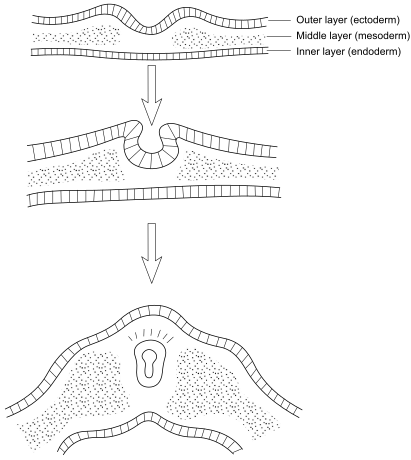
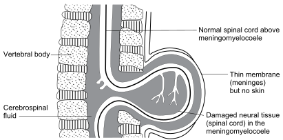

6
{:.chapter-number}

# Neural tube defects

Before you begin this unit, please take the corresponding test to assess your knowledge of the subject matter. You should redo the test after you’ve worked through the unit, to evaluate what you have learned.

## Objectives

When you have completed this unit you should be able to:

*	Define a neural tube defect.
*	List the three types of neural tube defect.
*	Give the birth prevalence of neural tube defects.
*	Explain the causes of neural tube defects.
*	Describe the clinical features of neural tube defects.
*	Understand how to care for children with neural tube defects.
*	Understand the prevention of neural tube defects.

## Introduction to neural tube defects

### 6-1 What are neural tube defects?

Neural tube defects (NTDs) are congenital malformations of the neural tube, caused by failure of the neural tube to close at the end of the fourth week after conception. Neural tube defects include the following three conditions:

1.	Anencephaly.
1.	Encephalocoele.
1.	Spina bifida.

Neural tube defects are typical examples of a **multifactorial congenital malformation**. These birth defects result from an interaction between genetic factors (usually a number of inherited genes) and an environmental factor (probably viral, dietary, toxic or radiation). Multifactorial defects, such as neural tube defects, occur in both males and females.

### 6-2 What is the neural tube?

At 22 days after conception, the embryo is a flat, pear-shaped plate made up of three layers of cells. By a process of folding in the midline, the top layer of cells forms a tube within the middle layer of the plate. This tube, the neural tube, runs from top to bottom of the developing embryo and is formed by 28 days post conception.

> 
> 
> Figure 6-1: The three layers of the embryonic plate showing the folding to form the neural tube
{:.figure}

### 6-3 What develops from the neural tube?

The neural tube is the structure from which the skull, brain, spinal cord and nerves will develop, as well as the spinal column (made up of vertebrae). If the neural tube fails to close at the head end, the defect results in **anencephaly** or an **encephalocoele**. If it fails to close lower down along the spine, the result is **spina bifida**.

> Anencephaly, encephalocoele and spina bifida are the three types of neural tube defect.

### 6-4 What is anencephaly?

Anencephaly (no brain) is the most serious of all neural tube defects and always results in stillbirth or early neonatal death. The top (vault) of the skull is absent, exposing the brain, which is malformed. The cerebral hemispheres do not develop with anencephaly.

Anencephaly is called an open neural tube defect because brain (neural tissue) is exposed.

### 6-5 What is an encephalocoele?

An encephalocoele is a failure of closure in the midline of the skull anywhere from a position between the eyes (frontal area) to the back of the skull (occipital area). With an encepaholcoele the brain coverings (the meninges), with or without brain tissue, protrude through the skull defect into a membranous sac which is covered by skin. The most common site of an encephalocoele is in the occipital area. Frontal encephalocoeles are also seen.

Encephalocoeles are called closed neural tube defects because neural tissue is not exposed as the defect is covered by skin.

### 6-6 What is spina bifida?

Spina bifida (split spine) is an opening in the spinal column due to failure of closure of the bony vertebral arches. Spina bifida may occur anywhere down the spinal column. There are three forms of spina bifida:

1.	Meningomyelocoele. This is the most severe form of spina bifida.
1.	Meningocoele. This is a less severe than meningomyelocoele.
1.	Spina bifida occulta. This is the least severe form as it only involves the bony spine.

Spina bifida may be either open or closed, depending on the type.

Note
:	Meningomyelocoele (or myelomeningocoele) is also referred to as spina bifida cystica while meningocoele is also called spina bifida aperta. Cystica is Latin for cyst and aperta means an opening.

> 
> 
> Figure 6-2: A cross section of the spinal column showing a meningmyelocoele with both the spinal cord and meninges protruding through a defect in the vertebral arches.
{:.figure}

> 
> 
> Figure 6-3: A cross section of the spinal column showing a meningocoele with only the meninges protruding through a defect in the vertebral arches
{:.figure}

> 
> 
> Figure 6-4: A cross section of the spinal column showing spina bifida occulta with neither the spinal cord nor the meninges protruding through a defect in the vertebral arches
{:.figure}

### 6-7 What is a meningomyelocoele?

A meningomyelocoele is an opening anywhere along the spinal column, due to failure of one or more vertebral arches to close. Neural tissue (spinal cord and nerves) and the coverings of the spinal cord (the meninges) bulge through the opening. The skin over this defect does not close, but the defect may be covered by a thin membrane which tears easily. The neural tissue that bulges through the bony defect is usually damaged, resulting in nerve abnormalities below the level of the defect.

Meningomyelocoeles are open neural tube defects because neural tissue (spinal cord and nerves) is exposed and not covered by skin.

### 6-8 What is a meningocoele?

A meningocoele is an opening anywhere along the spinal column, due to failure of closure of one or more vertebral arches. Only the coverings of the spinal cord (the meninges) protrude through the defect, forming a sac which is filled with cerebrospinal fluid (CSF). The spinal cord and nerves are normal and do not bulge through the opening. There is no associated spinal cord or nerve damage. The meningocoele usually is covered on the outside by skin.

A meningocoele is a closed neural tube defect when it is covered by skin.

### 6-9 What is spina bifida occulta?

Spina bifida occulta is a defect of the spinal column, due to failure of one or more vertebral arches to close. This usually occurs in the lumbar and sacral regions of the spine (lower back). Unlike a meningomyelocoele or meningocoele, the spinal cord and meninges are normal and do not protrude through the defect. The defect may be covered by an overlying abnormality such as a midline patch of hair, a lipoma or a dimple. Neurological abnormality is usually not associated with spina bifida occulta although spina bifida occulta may present later in life with back problems. The diagnosis of spina bifida occulta can be confirmed on X-ray which shows the defect in the spinal column.

Spina bifida occulta is a closed neural tube defect.

Note
:	Occulta is a Latin word that means hidden or secret.

### 6-10 How common are neural tube defects?

Neural tube defects occur throughout the world. Their birth prevalence (number of infants with neural tube defects per 1000 live births) varies according to the area (geographic location), the ethnicity and the socio-economic status of the population. In industrialised countries the birth prevalence of neural tube defects has decreased significantly over the last 40 to 50 years, and is now about 1/1000 live births. Of these infants about 50% spina bifida, 40% have anencephaly and 10% encephalocoeles.

In urban areas of South Africa (Cape Town, Johannesburg and Pretoria), the birth prevalence in the Black population is about 1/1000 live births. In contrast, the birth prevalence has been recorded as 6.1/1000 in rural areas of the Eastern Cape Province and 3.6/1000 in rural Limpopo Province. The reason for the difference in birth prevalence between urban and rural populations is not known.

The prevalence (number of infants with neural tube defects per 1000 in a population) of neural tube defects in South Africa is small as most infants born with these defects die young. In rural Limpopo more than 90% of infants born with anencephaly, encephalocoele or meningomyelocoele die before the age of two years.

> In black populations in South Africa, the birth prevalence of neural tube defects in urban areas is about 1/1000 live births while in rural areas it is about 4/1000 live births.

Note
:	The birth prevalence of neural tube defects in industrialised countries has decreased greatly over the last 40 years as the socio-economic situation has improved and prevention strategies have been put in place. As an example, in people of Celtic origin living in Ireland, the birth prevalence of neural tube defects used to be above 6/1000 live births but is now less than 1/1000 live births.

### 6-11 What causes neural tube defects?

The development of the neural tube, including its closure, is under the control of several genes working together with environmental factors. Most neural tube defects are, therefore, caused by **multifactorial** inheritance, i.e. they result from an interaction between genetic and environmental factors.

> Most neural tube defects are due to multifactorial inheritance.

Folic acid is one of the important fetal environmental factors involved in closure of the neural tube.

> Folic acid is an important fetal environmental factor in the cause of neural tube defects.

### 6-12 What are the other causes of neural tube defects?

Neural tube defects can also be caused by chromosomal abnormalities, single gene defects and teratogens including alcohol and sodium valproate (Epilim or Convulex). Sodium valproate is used to treat epilepsy. Some of these drugs may cause neural tube defects by working against the effect of folic acid.

### 6-13 What are the clinical features of neural tube defects?

The clinical presentation of neural tube defects depends on the type of defect, whether it is open or closed, its position and size. The different presentations vary greatly, from no obvious clinical features in spina bifida occulta to a gross abnormality in anencephaly.

### 6-14 What are the clinical features of anencephaly?

Infants with anencephaly are often born preterm and may be stillborn. If they are live born they seldom live longer than 24 hours. The infants are born with the top of their skull missing and brain exposed. The eyes appear to bulge. General examination of the rest of the infant is usually normal but may reveal other abnormalities.

Note
:	At postmortem examination 40% of anencephalics have abnormal internal organs.

### 6-15 What are the clinical features of an encephalocoele?

An encephalocoele develops because of failure of complete closure of the skull. The infant presents at birth with a midline mass anywhere from between the eyes to the back of the skull (occiput). The most common site for an encephalocoele is over the occiput. The clinical presentation will depend on the size and site and whether the encephalocoele contains neural tissue (brain matter) or not. Encephalocoeles that only contain meninges and no neural tissue usually have problems only related to the defect in the skull. However, if the encephalocoele contains brain tissue, this can be damaged or be associated with severe brain abnormalities. The resulting neurological abnormalities will depend on the size and site of the encephalocoele. In severe cases, most of the brain may be in the encephalocoele.

Associated neurological abnormalities include:

1.	Intellectual disability.
1.	Microcephaly.
1.	Cerebral palsy.
1.	Visual disability (blindness).
1.	Epilepsy.

Depending on the size and site of the encephalocoele, early death, even with treatment, is a common outcome in many of these infants.

### 6-16 What are the clinical features of a meningomyelocoele?

A meningomyelocoele presents at birth with a mass anywhere along the spine, but usually in the thoracic, lumbar or sacral regions. The mass may or may not be covered by a thin membrane, but neural tissue (spinal cord and nerves) is usually visible. The associated clinical features depend on the site and size of the defect.

As a meningomyelocoele contains neural tissue which is usually damaged, the body and limbs of the affected infant are paralysed below the level of the defect. The effect is similar to traumatic cutting of the spinal cord. The associated clinical features include:

1.	Flaccid paralysis (floppiness, weakness and absent reflexes) of the legs.
1.	No feeling (touch or pain) below the level of the defect.
1.	Kyphosis. A forward bend in the spine. With large meningomyelocoele this may also be associated with a lateral bend (scoliosis).
1.	Incontinence of bladder.
1.	Incontinence of bowel.
1.	Clubfeet.
1.	Hydrocephalus (80% of cases). Hydrocephalus (excessive cerebrospinal fluid in the ventricles of the brain) often presents in utero but may only present in the first weeks after delivery. Early diagnosis of hydrocephalus is important to obtain the best results from surgery.

Note
:	Hydrocephalus is caused by a malformation at the base of the brain, called an Arnold–Chiari malformation, where the cerebellum bulges through the opening at the base of the skull. This blocks the normal flow of cerebrospinal fluid.

### 6-17 What are the complications of a meningomyelocoele?

Complications of meningomyelocoele may present early or repeatedly. These include:

1.	Meningitis. Infection can easily and rapidly enter the nervous system through the open meningomyelocoele. Therefore, the meningomyelocoele should be carefully and aseptically covered (e.g. sterile gauze) at birth and then closed, as soon as possible, by surgery. Sometime the covering membrane may leak or rupture (tear) during delivery.
1.	Raised intracranial pressure due to hydrocephalus. Early clinical signs of increased intracranial pressure are a bulging anterior fontanelle, irritability, vomiting, and a high-pitched cry.
1.	Intellectual disability. The hydrocephalus, which may develop before or after delivery, can result in intellectual disability. Epilepsy from the hydrocephalus may also result.
1.	Urinary tract infections. The bladder incontinence can result in urinary tract infections in both males and females.
1.	Bed sores. These result from the lack of feeling (sensation) and movement in the body below the meningomyelocoele.

In low resource countries, infant and early childhood death is a common outcome of meningomyelocoeles.

### 6-18 What are the clinical features of a meningocoele?

A meningocoele presents at birth with a skin-covered mass in the midline anywhere along the spine. As the spinal cord and nerves are not involved there usually are no neurological abnormalities in the trunk, limbs, bladder and bowels. However, hydrocephalus is present as a complication in 20% of infants with meningocoeles.

> Hydrocephalus develops in 80% of infants with meningomyelocoele and in 20% of infants with meningocoele.

### 6-19 What are the clinical features of spina bifida occulta?

Most people with a spina bifida occulta do not know that they have a neural tube defect, i.e. it often remains hidden for life, therefore, the use of the word ‘occulta’ (hidden). They usually have no signs or symptoms. Occasionally, spina bifida occulta is diagnosed on an X-ray which is taken for some other reason. In some infants the presence of the bony defect in the vertebral arches is suggested by an overlying midline abnormality, usually a hairy patch.

Note
:	Very occasionally a child may develop neurological complications of spina bifida occulta, especially during periods of rapid growth, presenting with urinary incontinence, neurological signs of nerve damage in a limb or clawing of the toes due to weakness of muscles in the feet.

## Caring for infants and children with neural tube defects

### 6-20 What care is available for infants with neural tube defects?

The care required will depend on the type of neural tube defect, its site and size, and the available health facilities. In all patients the best possible care available must be given. This will include:

1.	*Diagnosis*

	Because of the obvious physical features of most forms of neural tube defect the diagnosis is made at birth or shortly thereafter. The exception is spina bifida occulta which is usually not clinically obvious at birth.

2.	*Treatment*

	Infants with anencephaly do not survive and are given palliative (hospice) care with warmth, feeds if hungry and support for the parents.

	1.	Medical treatment:

		Medical treatment may be needed for the complications of encephalocoele, and meningomyelocoele. These include:
		
		*	Antibiotics for meningitis if it develops in infants with a meningomyelocoele.
		*	Antibiotics for urinary tract infections in meningomyelocoele.
		*	Recurrent catheterisation for urinary incontinence in meningomyelocoele.
		*	Anticonvulsants for epilepsy in encephalocoele.

	2.	Surgical treatment:
		*	Infants with encephalocoele, meningomyelocoele and meningocoele should be referred to a neurosurgical unit for assessment. Meningocoeles should be simply covered with a piece of sterile gauze after delivery to reduce the risk of infection before surgery.
		*	In encephalocoeles, meningo­myelocoeles and meningocoeles, surgery is used to close the defect and remove the mass caused by the protruding brain, spinal cord or meninges. Care is taken not to damage the spinal cord and nerves in the repair of meningocoeles nor cause further damage to the brain in encephalocoeles that contain neural tissue. These infants with neural tube defects need to be referred to a tertiary care hospital for surgical assessment as soon as possible after birth.
		*	In meningomyelocoeles and meningocoeles, surgery to insert a ventriculo-peritoneal (VP) shunt to treat hydrocephalus may be required. A shunt is a tube that drains the fluid from the ventricles of the brain into the abdomen. If the affected infant does not have hydrocephalus at birth, it may develop after the spinal defect is repaired. Therefore, regular careful head circumference measurements must be taken and plotted on a centile chart to help make the diagnosis of hydrocephalus as early as possible (head circumference measurements weekly for the first six weeks and then monthly to one year of age). If ultrasound facilities are available, serial head ultrasound examination can be used to assist in the diagnosis.
	3.	*Neurodevelopmental therapy*
		*	Neurodevelopmental therapy includes physiotherapy, hearing assessment (audiology) and speech therapy, and occupational therapy. One or more of these therapies may be needed. All these forms of neurodevelopmental therapy are available in major centres. However, in both rural and urban areas with fewer resources, hospitals may only have a physiotherapist or an occupational therapist. Some may also have a community-based rehabilitation programme.
		*	In South Africa, rehabilitation for infants and children with disabilities can be assisted by the use of a locally produced stimulation programme called START (Strive Towards Achieving Results Together). This was designed to use affordable, locally available, materials. Information on START can be obtained from: Sunshine Centre, P O Box 41167, Craighall, 2024. Telephone 011 642 2005. Internet: [www.sunshine.org.za](http://www.sunshine.org.za)
3.	*Genetic counselling and psychosocial support*

	This is an important part of the care of people with neural tube defects and their families.

## Genetic counselling for neural tube defects

### 6-21 What genetic counselling is needed by parents who have a child with a neural tube defect?

Genetic counselling is a very important part of the care of people with neural tube defects and their family, especially the parents and siblings. The parents need to be educated and informed about:

1.	The diagnosis.
1.	The cause of neural tube defects. They need to know that neural tube defects are usually the results of multifactorial inheritance, but occasionally have other causes. It is important to rule out these other causes if possible.
1.	The clinical features, complications and prognosis of the particular neural tube defect their child has, and what treatment is available.
1.	The increased risk for parents of a child with a neural tube defect of having another child with a neural tube defect in future pregnancies. They need to know their options for reducing their risk of having another affected child through primary prevention, genetic screening, prenatal diagnosis and genetic counselling.

The parents, family and child with a neural tube defect need to be offered on-going psychosocial support, as do all individuals who have a congenital disability. They have problems that require lifelong care. The burden of the disorder and the care is experienced not only by the affected person, but also the family, especially parents, brothers and sisters.

### 6-22 Where can parents who have a child with a neural tube defect get support?

Support, help and reassurance may be obtained from:

1.	Doctors, nurses (especially nursing staff with genetic training), genetic counsellors and neurodevelopmental therapists.
1.	Social workers.
1.	The Southern African Inherited Disorders Association (SAIDA).
1.	Parent Support Group.

Note
:	The Southern African Inherited Disorders Association (SAIDA) can be contacted at the Division of Human Genetics, National Health Laboratory Service, P O Box 1038, Johannesburg, 2000, South Africa. Telephone and fax 011 4899213.

## Prevention of neural tube defects

### 6-23 Can neural tube defects be prevented?

Yes. There are two approaches for the prevention of neural tube defects. These are:

1.	Primary prevention: This aims to ensure the conception of infants without neural tube defects. The pre-conception approach is the preferred method of prevention. It is based on the knowledge, confirmed in Europe in the early 1990s, that if a woman takes periconceptional folic acid supplements, she can reduce her risk of having an infant with a neural tube defect by 50 percent. It was also confirmed, that if a woman had previously had an infant with a neural tube defect, her increased risk of having another child with a neural tube defect could be decreased by 70 percent.

	Note
	:	Research done recently in China showed that periconceptional folic acid supplementation taken by women in the poorer, more rural, northern region where the birth prevalence of neural tube defects is greater than 6/1000 live births, reduced the birth prevalence by 80 percent. In the southern, wealthier and more urban part of China, where the birth prevalence of neural tube defects is about 1/1000, live births periconceptional folic acid reduced the birth prevalence by 40 percent.

2.	Secondary prevention: This is based on genetic screening, prenatal diagnosis of neural tube defects, and genetic counselling.

> Many neural tube defects can be prevented by periconceptional folic acid, and by genetic screening, prenatal diagnosis and genetic counselling.

### 6-24 What is periconceptional folic acid supplementation?

Folic acid is a group B vitamin. It is very cheap and safe to give as it has few and only minor side effects even in large doses.

If folic acid is given as a medicine in the form of a pill, capsule or tablet, this is called **supplementation**.

With periconceptional supplementation folic acid is given around the period of conception, i.e. for three months before and three months after conception. This is the recommendation. However, even if the folic acid is given for only a month, there is some benefit.

The recommended dose of folic acid to prevent the occurrence of neural tube defects is a minimum of 0.4 mg daily. This can be taken alone or in combination with other vitamins in a multivitamin tablet. One periconceptional multivitamin tablet containing folic acid a day is recommended.

Vitamins A and D, if given to a pregnant mother in high doses, are teratogenic and can damage the fetus. Therefore, more than one multivitamin tablet a day can be dangerous for the fetus and the mother.

### 6-25 Does a mother who previously had an infant with a neural tube defect need more periconceptional folic acid?

Yes. If a mother had a previous child with a neural tube defect she is at greater risk for having another infant with a neural tube defect in future pregnancies. To reduce this increased risk for an infant with a neural tube defect it is recommended that she take 1 mg of folic acid daily for three months before conception and for three months after conception in all future pregnancies.

### 6-26 Is supplementation the only way that folic acid can be given?

No. As many pregnancies are not planned, it is important to put folic acid into a staple food to reduce the risk of neural tube defects. When an essential nutritional factor, such as folic acid, is added to the diet of the general population in this manner, this is called food **fortification**. Research of folic acid fortification of flour and other wheat products (from Canada, the USA, Chile and South Africa) has shown that this reduces the birth prevalence of neural tube defects.

In South Africa maize meal and wheat flour are now fortified by law with folic acid. Since the start of fortification in 2004 there has been a more than 30% decrease in the birth prevalence of neural tube defects.

Although food fortification with folic acid is being done, it is recommended that women still take periconceptional folic acid supplementation as some people may not get sufficient folic acid from fortification.

> Periconceptional supplementation and food fortification with folic acid reduces the birth prevalences of neural tube defects.

### 6-27 What are the risks for a mother who has an infant with a neural tube defect having a further affected child?

Women who have previously had an infant with a neural tube defect of multifactorial origin are at greater risk of having future children affected with the same type of neural tube defect. This is also true for the children of a parent who has a neural tube defect. The risks involved in these situations are:

| Family relationship                                 | Approximate risk | 
|-----------------------------------------------------+------------------|
| One affected sibling (brother or sister)            | 5% (1 in 20)     |
| Two affected siblings                               | 10% (1 in 10)    |
| Three affected siblings                             | 20% (1 in 5)     |
| One affected parent                                 | 5% (1 in 20)     |
| One affected second degree relative (uncle or aunt) | 2% (1 in 50)     |

Note
:	With three or more affected siblings, consideration must be given to the possibility of autosomal recessive inheritance, and if the affected siblings are all male, to X-linked recessive inheritance.

Although most neural tube defects are caused by multifactorial inheritance, care must always be taken to exclude other causes of neural tube defects before genetic counselling, including risk assessment, is given.

## Screening for neural tube defects

### 6-28 How can neural tube defects be screened for during pregnancy?

There are a number of methods which can be used to screen the fetus for neural tube defects. In countries that have well organised screening programmes, all fetuses with anencephaly and 70–80% of fetuses with spina bifida can be detected. The screening includes:

1.	Maternal serum alpha-fetoprotein (AFP) screening.
1.	Fetal ultrasound screening.

### 6-29 What is maternal serum alpha-fetoprotein screening?

Maternal serum alpha-fetoprotein (AFP) levels are significantly raised in ‘open’, but not in ‘closed’, neural tube defects. This is why different types of neural tube defects are classified into ‘open’ or ‘closed’ defects. Maternal serum alpha-fetoprotein screening will not detect ‘closed’ defects.

Maternal serum alpha-fetoprotein screening is best performed at around 16 weeks (between 15 and 18 weeks) gestation on a sample of the mother’s blood. It is important to ensure that the gestational age is correct. Ultrasound dating of the fetus confirms the gestation based on the date of the last menstrual period. A raised serum level of alpha-fetoprotein indicates a high risk for an open fetal neural tube defect.

Note
:	The maternal serum screening for Down syndrome (the Triple Test) measures the concentration of maternal alpha-fetoprotein (AFP), unconjugated oestriol (uE3) and human chorionic gonadotrophin (hCG). The level of alpha-fetoprotein in the Triple Test can be used to screen for neural tube defects.

	Other fetal causes of a raised maternal serum alpha-fetoprotein include incorrect estimation of the gestational age, multiple pregnancy, exomphalos, nephrotic syndrome, fetal death, Turner syndrome, ectodermal dysplasia and Rhesus disease. Maternal causes include diabetes, liver or gut cancer, and hepatitis. Rarely no cause for a raised alpha fetoprotein can be found. The prognosis of these pregnancies is poor.

### 6-30 What is fetal ultrasound screening?

It is recommended that a screening ultrasound scan for fetal abnormalities is done at 18 weeks gestation (18–23 weeks). During this scan signs of neural tube defects should be detected by an experienced ultrasonographer. Fetal ultrasound scanning can detect both open and closed neural tube defects.

Whenever a maternal serum alpha-fetoprotein (AFP) screening test is abnormal, a fetal ultrasound examination must be done to decide whether a neural tube defect or other birth defect is present or not.

Note
:	Occasionally, the level of maternal serum alpha-fetoprotein is raised but a neural tube defect cannot be seen on fetal ultrasound examination. This may be because the neural tube defect is small and cannot be detected by ultrasound scan, or the raised alpha-fetoprotein is due to some other cause. In this situation the mother, preferably with her partner, should receive genetic counselling and be offered an amniocentesis. If the amniocentesis is accepted and performed, the amniotic fluid levels of alpha-fetoprotein and acetyl-cholinesterase are measured. If these are raised, and no other obvious cause for their being raised can be found, then the diagnosis can be considered to be a neural tube defect.

### 6-31 What is the management if the fetus has a neural tube defect?

If a prenatal diagnosis of a neural tube defect is confirmed, the woman, preferably with her partner, should urgently receive genetic counselling regarding the diagnosis and their choices of management. For women at increased risk, or with a prenatal diagnosis of a neural tube defect, the choice of which options to take is theirs alone. Many will choose a termination of pregnancy. Their medical care providers must respect this choice. Parents must also know that no matter what their choice, this will not influence their future routine care.

> With genetic screening and prenatal diagnosis people are entitled to genetic counselling and always have the right of choice.

## Case study 1

A female infant is born at term and a severe abnormality is noticed by the midwife as soon as the infant is delivered. A doctor is called to examine the infant. She notices that the top of the infant’s skull is missing and the brain is visible. The parents are told that their infant has a serious birth defect.

### 1. What is a neural tube defect?

It is an abnormality of the neural tube which does not close correctly towards the end of the first month after conception. The neural tube is a structure in the embryo from which the brain, spinal cord, spinal column and nerves develop.

### 2. What are the forms of neural tube defect that affect the brain?

*	Anencephaly.
*	Encephalocoele.

### 3. Which form of neural tube defect is present in this infant?

Anencephaly. This results from failure of closure of the midline of the skull, exposing the brain. The brain is always very abnormal with most of it (the cerebral hemispheres) missing.

### 4. Will this infant survive?

No. Infants with anencephaly are usually stillborn or die in the first day of life.

### 5. Are all infants with anencephaly females?

No. All forms of neural tube defect, including anencephaly, may occur equally in both male and female infants.

### 6. What are the clinical features of an encephalocoele?

An encephalocoele is less severe than anencephaly. In an encephalocoele, only part of the skull does not close completely in the midline. As a result, the meninges and often part of the brain push through the hole in the skull. Unlike anencephaly, which is an open neural tube defect, encephalocoeles are closed neural tube defects as they are covered with skin. The defect is usually in the occipital region but may also occur in the frontal region.

## Case study 2

After delivery, a newborn infant is noticed to have an abnormality over the lower spine and also has club feet. The infant has a big head and does not move his legs. Otherwise he appears healthy and feeds well at the breast.

### 1. What is the diagnosis?

The infant has spina bifida. This is a defect in the spinal column due to failure of one or more vertebral arches to close normally. The defect is usually in the lower spine (lumbosacral region).

### 2. What are the forms of spina bifida?

*	Meningomyelocoele.
*	Meningocoele.
*	Spina bifida occulta.

This infant must have a meningomyelocoele because the nerves to the legs have been damaged. As a result he has paralysed legs and club feet.

### 3. What are the clinical features of a meningomyelocoele?

A midline mass which is covered by a thin membrane. Neural tissue is visible through the membrane. A meningomyelocoele is not covered with skin.

### 4. Why does this infant have a big head?

About 80% of infants with a meningo­myelocoele develop a hydrocephalus. This may be present at birth but can also develop in early infancy.

### 5. Why is this not a meningocoele?

A meningocoele is a less severe defect as only the meninges bulge through the hole in the vertebral column. As there is no neural tissue in the meningocoele, there usually will be no paralysis of the legs. A meningocoele is covered with skin. Therefore, it is called a ‘closed’ defect and would not be detected with a maternal serum alpha-fetoprotein screen.

### 6. What is a spina bifida occulta?

This is a mild form of spina bifida, which is often not noticed clinically. There is a small defect in the arch of a vertebra but the meninges do not prolapse. There may be a patch of hair or abnormal skin over the defect.

## Case study 3

A young couple, who plan to start a family, visit their general practitioner, as they want to know about neural tube defects. Their neighbour recently delivered an infant with a meningocoele. The defect was successfully corrected by surgery.

### 1. How common are neural tube defects?

In industrialised countries the prevalence of neural tube defects is about 1/1000 live births. In rural populations in South Africa, the birth prevalence is about 4/1000.

### 2. What is the cause of neural tube defects?

The failure of the neural tube to close normally is usually due to multifactorial inheritance. The influence of several genes, acting together with environmental factors, results in the birth defect. Rarely, the neural tube defect may be due to chromosomal or single gene defects, or teratogens.

### 3. What is the most important environmental factor that plays a role in causing neural tube defects?

Folic acid. A relative lack of folic acid in the diet may act together with genetic factors to result in neural tube defects.

### 4. How can the frequency of neural tube defects be lowered in a community?

By fortifying an essential food, such as maize meal or wheat flour, with folic acid. Fortification of maize meal in South Africa started in 2004 and has reduced the birth prevalence of neural tube defect by more than 30%.

### 5. What is the correct management of a child with a meningomyelocoele?

Urgent referral to a neurosurgical unit for assessment. A meningomyelocoele should be covered with sterile gauze after birth.

## Case study 4

A young mother has a child with a meningomyelocoele. She and her partner want another child but are unsure of the risk of further children also having a neural tube defect. They attend a genetic clinic for counselling.

### 1. What is the risk of this woman having another child with a neural tube defect?

There is an increased risk if there is a family history of neural tube defects. If a previous child has a neural tube defect the risk is 5% (1 in 20).

### 2. How can she lower the risk of having another affected child?

She should take 1 mg folic acid daily until she falls pregnant and then continue to take folic acid until three months after conception.

### 3. How effective is periconceptional folic acid supplementation in lowering the risk for another neural tube defect?

It should significantly lower the risk of neural tube defect by up to 70%.

### 4. How can a pregnant woman be screened for a fetus with a neural tube defect?

Either with maternal serum alpha-fetoprotein screen around 16 weeks of pregnancy or by fetal ultrasound scanning at around 18 weeks of pregnancy. Ultrasound examination is also used to confirm gestational age needed for maternal serum alpha-fetoprotein screening.

### 5. Should all women planning a pregnancy take periconceptional supplements?

It is recommended that all women take at least 0.4 mg folic acid daily for three months before and three months after falling pregnant. This is often taken in the form of one multivitamin tablet containing folic acid daily, and could lower the risk of having an infant with a neural tube defect by up to 50%. However, most women falling pregnant in South Africa are provided with extra folic acid through the fortification of maize meal.

### 6. What should parents do if the fetus is found to have a neural tube defect?

They must be referred for genetic counselling.
