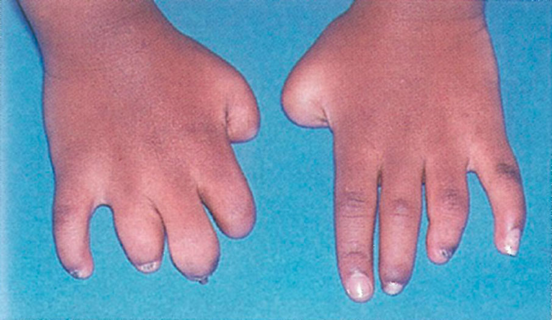
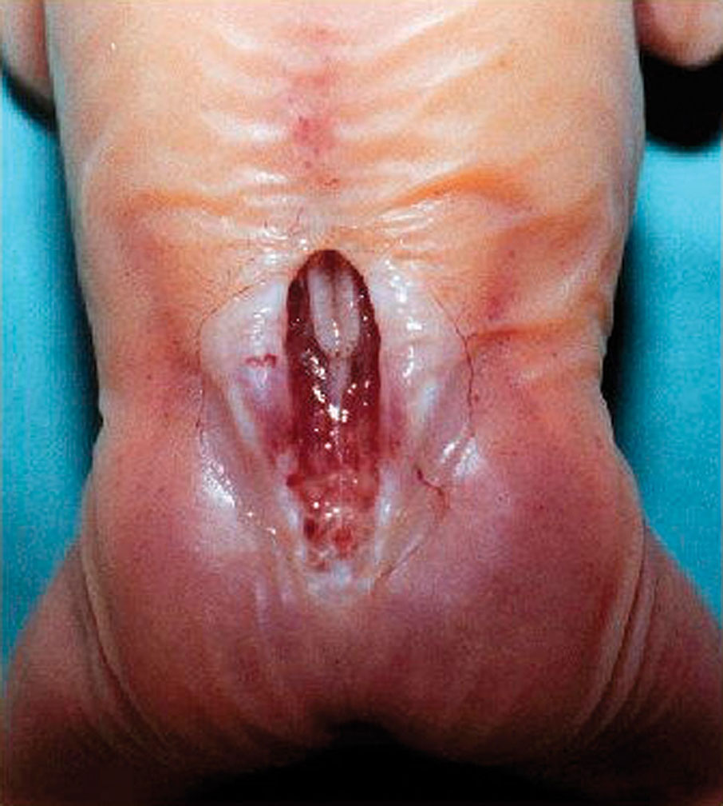

# Photographs

> 
> 
> Heterochromia: Different-coloured eyes or blue eyes in dark skinned child
{:.figure .small .fixed}

> 
> 
> Waardenburg syndrome: An infant with a white tuft of hair and wide spaced eyes
{:.figure .medium .fixed}

> 
> 
> Haemophilia: A swollen knee due to bleeding into the joint
{:.figure .medium .fixed}

> 
> 
> Viteligo: decreased skin pigmentation
{:.figure .medium .fixed}

> 
> 
> Oculocutaneous albinism
{:.figure .medium .fixed}

> 
> 
> Down syndrome: The eyes slant upwards, the bridge of the nose is flat, and the tongue may protrude
{:.figure .medium .fixed}

> 
> 
> Amputated fingers in amniotic band syndrome
{:.figure .small .fixed}

> 
> 
> Single transverse palmar crease
{:.figure .small .fixed}

> 
> 
> Bilateral cleft lip and palate
{:.figure .small .fixed}

> 
> 
> Isolated cleft palate
{:.figure .small .fixed}

> 
> 
> Club-foot
{:.figure .small .fixed}

> 
> 
> Infant with fetal alcohol syndrome: long smooth upper lip
{:.figure .medium .fixed}

> 
> 
> A fetus with anencephaly exposing the brain
{:.figure .medium .fixed}

> 
> 
> Severe lumbosacral meningomyelocoele with neural tissue exposed
{:.figure .medium .fixed}

> 
> 
> Severe meningomyelocoele with a thin membrane covering the defect
{:.figure .medium .fixed}
