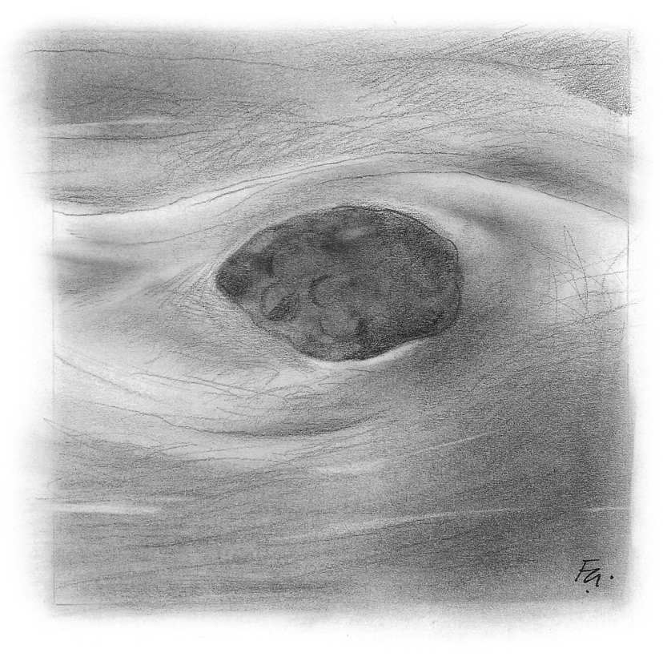

1
{:.chapter-number}

# The normal breast

## Objectives

When you have completed this module you should be able to:

*	Describe the appearance and anatomy of a normal breast.
*	Describe the normal developmental changes that happen to the breast after birth, during puberty and pregnancy and in the elderly.
*	Understand that lumps and changes in the breast may be normal.

## Case study 1

A worried mother brings her 11 year old daughter to a clinic complaining that she has noticed a hard lump behind her one nipple. There is nothing abnormal to be felt on the other side. The mother wants to know whether the child’s breast is normal, as she has had breast cancer.

1.	Should the mother be concerned that her daughter has a lump under one nipple?
2.	Is it normal to get a breast lump on one side only?
3.	Does it mean she will always have one breast bigger than the other?
4.	Would you be more worried if the daughter’s breast lump was painful?

## Case study 2

A woman of 22 years of age complains of painful breasts every month before her period. She has also noticed a number of lumps in both her breasts. She has always had inverted nipples.

1.	Is it common to have painful breasts?
2.	Would you be worried about her inverted nipples?
3.	What is the commonest cause of multiple breast lumps in a young woman?
4.	What is ANDI?
5.	At what age do fibroadenomas usually occur?

## Case study 3

A woman of 25 years presents 3 months after the birth of her baby. She did not breastfeed. Her complaint is that her breasts have become softer and have changed shape.

1.	What normal changes take place in a woman’s breasts early in pregnancy?
2.	What breast changes can be expected after pregnancy and breastfeeding?
3.	Can these changes be prevented if the mother chooses not to breastfeed?
4.	What further breast changes are likely to occur as she becomes older?

## Normal breast appearance

### 1-1 What is a breast?

Breasts are specially modified glands in the skin and are present in all infants at birth. Breast size in the fetus increases as the pregnancy progresses. Therefore the breasts may be very small in preterm infants.

Usually one breast is present on either side of the chest. However, one or more accessory (extra) nipples or breasts may be present along the ‘breast line’ from the armpit down to the groin. Many animals such as dogs have a number of breasts along this line.

Note
:	Breasts or mammary glands are present in all mammals.

> 
> 
> Figure 1-1: The breast line
{:.figure}

### 1-2 What are breasts normally like at birth?

In infants born at term the nipple and areola are well developed and a small lump called a breast bud can be felt under the nipple. The areola is the pink area around the nipple. The breast bud consists of glandular tissue which has grown due to the presence of sex hormones in the fetus. The appearance of the breasts and the presence of breast buds are the same in boys and girls.

> Slightly enlarged breasts in newborn infants are normal

### 1-3 Do the breasts change during the first months of life?

Yes. During the first months after birth one or both breast buds may enlarge further for a few weeks and may even produce small amounts of milk. These normal changes in the breasts are due to sex hormones produced by the infant. After a few months sex hormones are no longer produced and the breast bud disappears.

Do not try to express milk as this may result in infection of the breast.

Note
:	In the normal fetus and newborn infant sex hormones are produced by the ovaries, testes and adrenals.

### 1-4 What happens to breasts during puberty?

At about 10 years of age the female child’s ovaries start to produce the sex hormones estrogen and progesterone. This is called puberty. The sex hormones cause the breast to start developing with enlargement of the nipple and areola. A breast bud develops below the nipple and areola. These normal changes usually occur in both breasts at the same time. It is common for breast buds to be tender.

### 1-5 Is it abnormal if one breast starts to develop faster than the other?

No. One breast bud may start to develop first so that the breasts are of different sizes (they are asymmetrical). This is normal and common. With time both breasts will increase in size normally. There is no need to worry about the breast lump being malignant as breast cancer does not develop in girls during puberty.

> Asymmetrical breasts are common during puberty.

### 1-6 When is breast development at puberty complete?

Usually breasts reach their normal shape by about 18 years of age. Some individuals have larger breasts than others. Breast size usually follows a trend in the family.

### 1-7 Are a woman’s breasts usually both the same size?

More than 50% of women have one breast that appears slightly larger than the other. This mild asymmetry is normal.

### 1-8 What happens to breast appearance in early adulthood?

The breasts may continue to enlarge and start to droop even if the woman is not pregnant. This change in breast size and shape is normal.

> 
> 
> Figure 1-2: The normal stages of breast development
{:.figure}

## Normal breast anatomy

### 1-9 What is the shape of the normal breast?

The breast is shaped like a pear and the tail of breast tissue extends under the arm. Some women have breast tissue that can be felt in the armpit. This may be more noticeable during pregnancy.

> 
> 
> Figure 1-3: The shape of the normal breast
{:.figure}

### 1-10 What is the structure of the normal breast?

The breast consists of:

*	The nipple
*	The areola
*	About 10 or more lobes
*	Supportive and fatty tissue

> 
> 
> Figure 1-4: The normal structures of the adult breast
{:.figure}

### 1-11 What is the appearance of a normal nipple and areola?

The nipple-areola complex (NAC) is made up of the nipple, which usually sticks out, and the surrounding pigmented areola. Under the skin of the areola is a circle of muscle which contracts when the nipple or areola is touched. The areola has sweat glands which can be seen as slightly raised pale dots.

Note
:	Circular muscle fibres surround the nipple. It is normal to have small nodules on the areola which are the openings of Montgomery’s tubercles.

> The nipple-areola complex (NAC) is made up of both the nipple and surrounding areola.

> 
> 
> Figure 1-5: The appearance of the normal nipple-areola complex
{:.figure}

### 1-12 What is the function of the lobes?

The lobes (made up of many lobules) are glandular structures. The major lobes drain into ducts which open onto the nipple. During pregnancy (and in newborn infants) the lobes produce milk.

> 
> 
> Figure 1-6: The lobes draining into ducts opening onto the nipple
{:.figure}

### 1-13 Why is the supportive and fatty tissue in the breast important?

The supportive tissue helps to give the breast its shape while the amount of fatty tissue determines the size of the breast. Both the supportive and fatty tissue (stroma) is found around the lobes. The amount of supportive and fatty tissue varies enormously between individuals.

The basic anatomy of the male breast is the same as that in the female breast but the breasts usually do not enlarge during puberty.

Note
:	Breast enlargement during puberty in males is called gynaecomastia. This can cause embarrassment but usually resolves within a few months without any treatment. It commonly occurs in only one breast.

### 1-14 Why is the lymphatic drainage of the breasts important?

All organs in the body use both the blood and the lymphatic systems to drain fluid from the tissues. In this way the lymphatic system helps to remove unwanted cells and debris (breakdown products). The lymphatics (lymph vessels) drain lymph (tissue fluid) to local lymph nodes which act as sieves and remove abnormal cells which may be either infectious or cancer cells. If a cancer develops in an organ, the next place it will usually spread to is the draining lymph node. The breast generally drains to the lymph nodes in the axilla (armpit) but occasionally may drain to the lymph nodes in the chest. It is therefore important to always feel for axillary lymph nodes when examining a breast.

> All women with a breast complaint should have their armpits examined as well.

### 1-15 How are breasts affected by a woman’s menstrual cycle?

The breasts change with the menstrual cycle as the breasts are influenced by the amount of sex hormones produced. Each month the size of the breast increases until the menstrual period starts. Once the period begins the breasts decrease in size. If a woman has lumpy breasts, the lumps also tend to get bigger before a period. Therefore it is easier to examine a breast after the period has finished and before day 14 of the cycle (i.e. 14 days after the start of the period) when the breasts will again start to enlarge.

### 1-16 How do the breasts change during pregnancy?

During pregnancy the breasts double in size and weight under the influence of large amounts of sex hormones produced by the mother and fetus. The changes start very early in pregnancy and breast enlargement and tenderness may be the first symptom of pregnancy. The size of the lobes increases dramatically. The nipples may stick out more and the areola may get bigger and become more pigmented.

Note
:	The blood flow to the breasts increases and the veins may become more obvious.

> Changes in the breasts with tenderness may be the first symptom of pregnancy.

### 1-17 How do the breasts change during breastfeeding?

Colostrum may be present just before delivery but milk production does not increase until a few days after the infant is born. Milk production continues as long as the infant still breastfeeds. When the infant stops feeding milk production rapidly decreases over a few days.

Note
:	The hormone prolactin results in milk production while the secretion of oxytocin during feeding results in the let down reflex when milk dribbles from both nipples.

### 1-18 What changes are seen after breastfeeding?

The breasts decrease in size and may go back to the size they were before pregnancy but the ducts remain the same. The size depends on how much weight was gained and bigger breasts are due to more fat. The breasts are generally droopier than before pregnancy. The darker nipple and areola will remain.

Small amounts of milk may still be expressed in a woman who is not breastfeeding. 

These changes in breast size and shape are seen after pregnancy even if the woman has not breastfed her infant.

### 1-19 How do the breasts change as a woman becomes older?

After the age of 35 years the breast tissue starts to shrink (involute). The glandular tissue in the lobes starts to become wasted and is initially replaced by fibrous tissue and cysts and later by fat.

Once a woman’s ovaries stop producing sex hormones at about the age of 50 years she goes into menopause. This causes the lobes to decrease in size even more and become replaced by fatty tissue. The breasts tend to become softer and hang down more (drooping or ptotic).

The use of hormone replacement therapy (HRT) slows down this ageing process. Generally the breasts get bigger and softer (due to increased fat) as a woman gets older.

> After menopause the breasts become softer.

## Changes in the breast which may be worrying

### 1-20 What normal breast changes may become a problem?

There are a number of normal changes in the breast which are not malignant (cancerous) but can result in the formation of lumps. These changes are referred to as aberrations of normal development and involution or ANDI. These are important as it may be difficult to decide whether changes in a breast are caused by ANDI or serious disease such as cancer.

Note
:	An aberration is not an abnormality, disease or cancer but a variation of normal which can cause symptoms and signs which may be of clinical concern both to women and healthcarers. ANDI is a term used to include most benign breast conditions.

> Aberrations of normal development and involution (ANDI) are common and may cause clinical concern.

### 1-21 How are these normal breast changes best approached?

It is useful to divide women with breast changes into three age categories:

*	Developmental changes that occur during the early years in young women (15 to 25 years)
*	Changes due to menstrual cycle activity that occur during the mature reproductive years (25 to 45 years)
*	Changes that occur during the stage of breast involution (35 to 55 years or beyond in women who are on hormone replacement therapy)

All the changes in these three age categories are caused by hormonal effects in the breasts. As cyclical hormonal changes continue for a longer time during the mature reproductive years, ANDI are most common in these women.

> The normal changes that take place in a woman’s breast are determined by age.

### 1-22 What changes occur in the early years?

*	Fibroadenomas
*	Large breasts
*	Inverted nipples

### 1-23 What are fibroadenomas?

Fibroadenomas (or fibroadenomata) are painless, benign lumps which form due to excessive lobe development. They are usually seen in young women between the ages of 15 and 25 years but can occur in older women. It is uncommon to get a new fibroadenoma after the age of 35 years. Often they form in young women but may not be detected until the breast becomes softer. Fibroadenomas may only be detected when an ultrasound scan or mammogram is done.

Many women have more than one fibroadenoma. They generally grow to 1-2 cm in size. As they are made of breast tissue they will increase or decrease in size as the size of the breast changes. Therefore they may increase in size during pregnancy. Occasionally a fibroadenoma becomes very big (giant fibroadenoma).

A fibroadenoma generally feels smooth and is very mobile.

It is very important to make a correct diagnosis of fibroadenoma as it may feel the same as a breast cancer.

> The correct diagnosis of a fibroadenoma is important as a breast cancer can feel like a fibroadenoma.

> 
> 
> Figure 1-7: The appearance of a fibroadenoma
{:.figure}

> 
> 
> Figure 1-8: The nodular appearance of a fibroadenoma. Benign lumps (such as fibroadenomas) lie within normal breast tissue.
{:.figure}

### 1-24 When are breasts considered too large?

Breast size depends on the amount of fibrous and fatty tissue. There is a wide variation in adult breast size. What is considered normal also varies between different groups of people. Some breasts continue to grow after puberty and excessive breast size can be a problem and cause dissatisfaction and embarrassment.

### 1-25 What is the appearance of a normal nipple?

There is a wide range of normal nipple shape and size. Shape and colour often change during pregnancy. It is common and can be completely normal to have an inverted (inward turning) nipple. However, it is abnormal if a nipple suddenly becomes inverted as this may be a sign of breast cancer. Eczema of the nipple is also abnormal.

### 1-26 What changes may occur during the mature reproductive years?

The commonest normal change is breast pain (mastalgia) which is usually worse in the days before the period starts.

### 1-27 What changes may occur during the stage of breast involution?

*	Cyst formation
*	Duct ectasia (dilatation of ducts)
*	Nipple inversion

### 1-28 What are breast cysts and when do they occur?

Fluid-filled cysts are common in women between 35 and 55 years old. They usually occur before menopause and are rare after menopause. They may be painful or tender especially before the periods. They feel smooth. Often there is more than one cyst.

> 
> 
> Figure 1-9: Breast with cyst
{:.figure}

### 1-29 What is duct ectasia and when does it occur?

Usually after the menopause. It is caused by dilated ducts below the nipple which may result in a non-bloody nipple discharge or an inverted nipple. The ducts dilate as they approach the nipple. Fluid may leak out of the duct causing scarring behind the nipple and inversion of the nipple. A nipple discharge may be a sign of cancer.

> Both an inverted nipple and nipple discharge may be signs of breast cancer.

## Case study 1

A worried mother brings her 11 year old daughter to a clinic complaining that she has noticed a hard lump behind her one nipple. There is nothing abnormal to be felt on the other side. The mother wants to know whether the child’s breast is normal, as she has had breast cancer.

### 1. Should the mother be concerned that her daughter has a lump under one nipple?

No. A lump under the nipple of a girl aged 11 years is an early sign of puberty.

### 2. Is it normal to get a breast lump on one side only?

Yes. Asymmetrical breast development is very common.

### 3. Does it mean she will always have one breast bigger than the other?

No. Further breast development should be normal. However, many adult women have one breast slightly larger than the other.

### 4. Would you be more worried if the daughter’s breast lump was painful?

No. Normal breast tissue can be painful.

## Case study 2

A woman of 22 years of age complains of painful breasts every month before her period. She has also noticed a number of lumps in both her breasts. She has always had inverted nipples.

### 1. Is it common to have painful breasts?

Painful or tender breasts (mastalgia) is a common complaint in the days before a menstrual period. These symptoms usually disappear once the period begins.

### 2. Would you be worried about her inverted nipples?

No, as they have been present since puberty.

### 3. What is the commonest cause of multiple breast lumps in a young woman?

Fibroadenomas. This condition is an example of ANDI.

### 4. What is ANDI?

Aberrations of normal development and involution. These are common breast changes seen in normal women. They are important as they may cause clinical concern for both the woman and the clinical staff.

### 5. At what age do fibroadenomas usually occur?

Usually between 15 and 25 years of age.

## Case study 3

A woman of 25 years presents 3 months after the birth of her baby. She did not breastfeed. Her complaint is that her breasts have become softer and have changed shape.

### 1. What normal changes take place in a woman’s breasts early in pregnancy?

The breasts enlarge and become tender. These may be the earliest symptoms of pregnancy. Due to high levels of sex hormones the lobes increase in size while the nipple and areola become darker.

### 2. What breast changes can be expected after pregnancy and breastfeeding?

The breasts return to their normal size unless the woman has gained weight. They will become softer and tend to droop.

### 3. Can these changes be prevented if the mother chooses not to breastfeed?

No, as these normal changes will occur even if the woman has not breastfed. 

### 4. What further breast changes are likely to occur as she becomes older?

After the age of 35 years the breast tissue starts to shrink (involute) as the lobes start to become wasted. However, the size of the breasts may increase due to increased fat.
