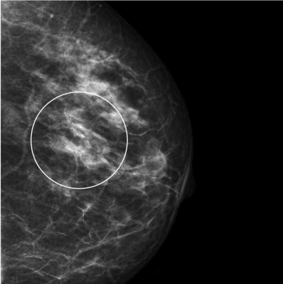
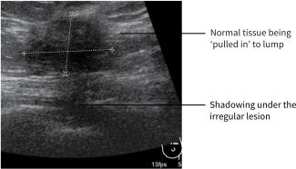
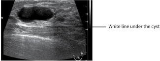
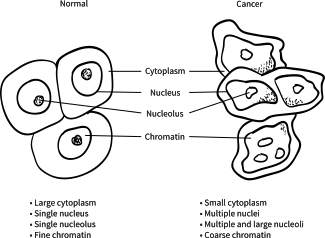

3
{:.chapter-number}

# Special investigations of the breast

## Objectives

When you have completed this chapter you should be able to:

*	Describe the triple test.
*	List the breast imaging options.
*	Describe breast screening.
*	Understand the importance of mammograms and ultrasound scans.
*	Explain the advantages and limitations of cytology and histology.
*	Describe how a sample of breast tissue can be obtained.

## Case study 1

A 45 year old women presents with a lump in her left breast. She has not been screened for breast cancer before. Her sister had breast cancer at the age of 41.

1.	Should she have been screened before?
2.	What is population screening for breast cancer?
3.	What investigations should she have?
4.	What is cytology?

## Case study 2

A 69 year old woman presents with a large ulcerating tumour of the breast. She has lumps in the opposite breast and has palpable nodes in both axillae.

1.	What is the most likely diagnosis?
2.	What investigation should be done?
3.	What is a core biopsy?
4.	What are the advantages of a core biopsy over an excision biopsy?

## Case study 3

A 30 year old woman presents with a small lump in her right breast. A mammogram shows an area of microcalcification.

1.	Should all women who find a lump in their breast be investigated?
2.	What imaging is usually done first in a 30 year old?
3.	What is the significance of microcalcification?
4.	What forms of cancer are difficult to detect on a mammogram?

## Case study 4

A postmenopausal woman of 58 presents with a lump in her breast. She has not been screened for breast cancer and has no family history of cancer. The general practitioner can feel the lump and refers her for scanning and cytology.

1.	Would a mammogram be reliable in this woman?
2.	If the mammogram shows no mass is further investigation indicated?
3.	What are the advantages of a fine needle aspiration rather than a core biopsy or an excision biopsy?
4.	Can a fine needle biopsy give a false negative result?

## Special investigations

### 3-1 Why are special investigations of the breast sometimes needed?

If the history and clinical examination suggests that there might be a cancer in a breast, it is best if the problem can be diagnosed without having to operate. This requires special investigations.

> The aim of special investigations is to make a diagnosis without having to do surgery.

### 3-2 What is the triple test?

The triple test is a combination of 3 different ways of investigating the breast:

*	Clinical assessment (history and examination)
*	Imaging
*	Cytology

All three investigations should agree for the diagnosis to be accepted. An accurate diagnosis can usually be obtained with the triple test but the diagnosis should be confirmed with a histological diagnosis.

> The triple test of clinical examination, imaging and cytology can usually give an accurate diagnosis if all three agree but the diagnosis should be confirmed with histology.

## Breast imaging

### 3-3 What breast imaging options are available?

*	Mammogram
*	Ultrasound scan
*	MRI scan

### 3-4 What is a mammogram?

A mammogram is a radiological investigation (mammography) in which the breast is compressed and then X-rayed. The underlying breast tissue is seen and abnormalities may be detected. A mass is an abnormal area, which may have the appearance of being cancerous (malignant) or non-cancerous (benign). 

> 
> 
> Figure 3-1: Normal breasts shown on a mammogram. Ducts and glandular tissue appear whitish while fat appears black.
{:.figure}

### 3-5 What is an ultrasound scan?

An ultrasound scan (ultrasonography) is a way of imaging tissue using sound waves. Different types of breast tissue absorb and reflect the sound waves in different ways and produce a computerised picture. Cancers usually look different from non-cancerous masses. An ultrasound scan is good at telling the difference between a solid and a cystic mass.

### 3-6 What is an MRI scan?

An MRI scan (magnetic resonance imaging scan) is a special scan using large magnets that produces pictures of the breast. It is not widely used and should only be requested by specialist breast units.

### 3-7 When should any imaging of the breast be done?

*	*Screening*: population and individual screening
*	Investigation of a clinical complaint

## Breast screening

### 3-8 What is breast screening?

Screening (surveillance) is looking for a disease before it is clinically obvious to either the patient or an examining doctor. It is looking for a hidden disease in people who appear to be well. Many diseases are screened for, such as cervical and breast cancer.

Breast cancer is screened for using clinical examination and a mammogram.

> Breast screening uses clinical examination and a mammogram to look for cancer in people who are clinically healthy.

### 3-9 What is population screening for breast cancer?

Population screening means screening all women over a certain age in the general population. The aim is to detect early breast cancers in women who have no breast complaints. Ideally a breast examination and mammogram should be done.

Most developing countries, such as South Africa, do not have a population breast cancer-screening programme in the public sector. Most developed countries have population screening for breast cancer. Population screening for breast cancer is a low priority in the public sector in South Africa and is controversial in developed countries.

> Population mammogram screening for breast cancer includes all women over a certain age.

### 3-10 When should population screening for breast cancer be done?

The frequency of mammogram screening and the age at which it starts depends on the country. Mammogram screening programmes start at 40 years of age in the USA and are done every year. In Europe, it often starts at 50 years of age and mammograms are done every 1 to 3 years.

### 3-11 What is individual screening?

In countries without a public breast screening programme, such as South Africa, some individuals who can afford it may go for regular monitoring. This is known as individual screening or surveillance. The frequency and age when individual screening should start is the same as that for population screening.

If a woman has a family history of breast cancer, she should be offered screening starting at the age of 40 or 10 years before the age of the youngest family member when she presented with breast cancer, whichever comes first. She should be screened every year.

> Screening may start earlier in women who are at an increased risk of breast cancer.

### 3-12 When should women with a breast complaint go for imaging?

*	All women over the age of 40 years with any breast complaint should have a mammogram. They may be referred for an ultrasound scan as well.
*	For patients under 40 years, it depends on the complaint. Any woman over the age of 25 with a breast lump should be referred for breast imaging. This should initially be an ultrasound in younger women although the breast unit may decide to do a mammogram as well.

Both a mammogram and ultrasound scan may be used for individual screening. An ultrasound scan is often done first in younger women as they have firm breasts.

> Any woman with a breast complaint over the age of 40 should have a mammogram.

## Mammograms

### 3-13 What abnormalities may be found on a mammogram?

A mammogram may be normal or may show:

*	*Microcalcifications*: these are specks of calcium, which are due to abnormal cells. These abnormal cells may be benign or malignant.
*	*A mass*: this implies there is a breast lump, which may look benign or malignant on a mammogram.
*	*‘Architectural distortion’* which means that the breast tissue does not have the normal appearance. The change is generally an area of straight lines and may be associated with a lump or area of calcifications. It is most commonly due to either a cancer or previous surgery.

> 15% of breast cancers do not show up on a mammogram.

> 
> 
> Figure 3-2: The cancer appears white and irregular (spiculated) against the black background.
{:.figure}

> 
> 
> Figure 3-3: Typical microcalcifications associated with a cancer
{:.figure}

### 3-14 Is a mammogram painful?

A mammogram should not be very painful, but there is discomfort when the breast is squeezed, especially in young women with firm breasts. An ultrasound scan is not painful.

### 3-15 Can a mammogram cause cancer?

There is no significant risk of getting cancer from a mammogram.

### 3-16 What happens if the mammogram is abnormal?

The abnormal area must be further investigated (tested).

> Any abnormality on a mammogram must be investigated.

### 3-17 How is the abnormal area seen on a mammogram investigated further?

*	If a lump can be felt, the area is investigated with a fine needle aspiration or a core biopsy (see later).
*	If the area cannot be felt (is not palpable), it has to be tested under mammographic or ultrasound guidance. 
*	Hookwire-guided excision biopsy; a special needle is placed in the area of abnormal tissue and hooked into position. In theatre this area is then easy to find and is removed surgically.

### 3-18 What are microcalcifications?

Microcalcifications are specks of calcium seen on a mammogram. They can be caused by a number of conditions, including:

*	Malignant cells. These may be from an invasive carcinoma or ductal carcinoma in situ (DCIS)
*	Microcysts
*	Scar tissue

There are different patterns of micro­calcification seen and these will generally give an idea of whether the calcifications are malignant or benign. Any new microcalcifications in a post­menopausal woman must be biopsied as there is a high risk of malignancy.

### 3-19 How reliable is a mammogram in detecting cancer?

Mammograms are helpful but 15% of cancers do not show up on a mammogram, especially in younger women. The accuracy of the mammogram depends on:

*	*The age of the woman*: A mammogram is more reliable in women over the age of 50, as they usually have less dense (fatty) breasts, which appear dark on a mammogram. The breasts of postmenopausal women are softer with more fat and therefore easier to compress to obtain good views on a mammogram. This makes it easier to see a cancer. Mammograms are therefore better for the population screening of older women.
*	*The breast density*: Women under the age of 40 often have dense (firm) breasts. However, some older women have particularly dense breasts. In women with firm or dense breasts, the breast tissue appears white on the mammogram, which may make a cancer difficult to find.
*	*Menopausal status*: Mammograms are more reliable after menopause when breasts tend to be fatty.
*	*The type of breast cancer*: Lobular cancers may be difficult to see as they do not show up as well on mammograms. Ductal carcinoma in situ (DCIS) may show up on a mammogram.

The reliability of a mammogram depends on how dense the breast is and what type of cancer the woman has.

## Ultrasound scan

### 3-20 Who should have an ultrasound scan?

*	Younger women as they have firm breasts. As mammograms are less reliable in these women they should rather have an ultrasound scan.
*	Some women over 50 with dense breasts may also be advised to have an ultrasound scan.

Ultrasound scans are being used more often as they are getting better at detecting very small cancers. Many women who have a mammogram will also have an ultrasound.

> An ultrasound scan is particularly useful in younger women.

### 3-21 Can an ultrasound scan show the difference between a cancerous and non-cancerous lump?

Yes. A cancerous lump usually has a typical appearance on an ultrasound scan while a benign lump looks quite different.

> It is always better to make a diagnosis without having to do an operation. However, a diagnosis must always be made.

An ultrasound scan is good at showing the difference between a cyst and a solid lump. However, ultrasound cannot be used to look for ductal carcinoma in situ (DCIS).

> An ultrasound scan is good at showing the difference between a cyst and a solid lump.

> 
> 
> Figure 3-4: Typical appearance of an invasive cancer on an ultrasound scan. The outline of the mass is irregular with no clear margins.
{:.figure}

> 
> 
> Figure 3-5: A simple cyst on an ultrasound scan. The cyst has a smooth outline.
{:.figure}

> 
> 
> Figure 3-6: The appearance of a fi broadenoma on an ultrasound scan. It typically has clear margins and compresses the tissue around it. Note nodular appearance.
{:.figure}

### 3-22 How can a lump seen on an ultrasound be investigated?

Under ultrasound guidance, a thin needle can be put into the lump and cells can be removed for cytology (fine needle aspiration). Under ultrasound guidance, a core biopsy can also be taken for histology.

A disadvantage of ultrasound scanning is that, unlike a mammogram, it does not detect carcinoma in situ.

> Unlike a mammogram an ultrasound scan does not detect carcinoma in situ.

## MRI scanning

### 3-23 When is an MRI scan useful?

This is a specialist test and should only be requested by a specialist unit.

## Cytology

### 3-24 What is cytology?

Cytology is the examination of cells obtained from an aspirate (something which is sucked out). The cells are studied under a microscope to see if they look cancerous or not. Cytology is one of three parts of the triple test.

### 3-25 How can one get a sample for cytology?

A fine needle aspiration (FNA) can be performed. This involves using a thin 22G needle and a 10 ml syringe. The needle is passed into the mass (lump or cyst) and cells or fluid are aspirated. Usually the lump is sampled a number of times in slightly different places (multiple passes). The aspirate is placed on a number of glass slides, which are then sprayed with a fixative solution (as with a Pap smear). The slides are sent for examination.

> 
> 
> Figure 3-7: Fine needle aspiration. The needle is inserted into the lump. Suction is used to extract fluid/cells.
{:.figure}

### 3-26 What results can cytology give?

*	*Inadequate*: that means that too few cells have been removed to confidently make a diagnosis.
*	*Benign*: normal looking breast cells or a diagnosis of fibrocystic change, fibroadenoma or fat necrosis.
*	*Atypical*: some cells look abnormal. A core biopsy must always be done if the FNA result is atypical.
*	*Suspicious*: the lump is probably a cancer but the diagnosis cannot be made for certain.
*	*Malignant*: the lump is definitely malignant.

> 
> 
> Figure 3-8: Normal and malignant cells on cytology
{:.figure}

### 3-27 What do breast cells look like? 

Normal breast cells have a well-formed nucleus and cytoplasm. All the cells look the same. The malignant cells look abnormal with large nuclei and abnormal cytoplasm. The cells look very different from one another. 

### 3-28 What are the advantages of cytology?

*	It is a simple procedure that can be performed in a clinic by a doctor or nurse who has been trained in the technique.
*	The results may be obtained the same day.
*	It is relatively painless and local anaesthetic is not needed.
*	If the mass is a cyst, it may be aspirated completely and disappear. It is very unlikely that a cyst will be malignant. If the fluid from a cyst is bloody, the aspirated sample must be sent for cytology.

### 3-29 What are the problems with cytology?

Problems with cytology are:

*	Cytology can give false positive or negative results.
*	The incorrect preparation of the slides can give false results.
*	The interpretation of the slides can be difficult.
*	The cells may be hidden behind a film of blood.
*	A pneumothorax may be caused if the needle is put in too deeply and penetrates the underlying lung. This is more common if the woman is thin and the lump deep or at the edge of the breast. If a pneumothorax develops the patient will suddenly complain of chest pain during the procedure and may become short of breath.

Although cytology seems a simple procedure, the results can be inaccurate due to inaccurate sampling or interpretation.

> Cytology gives very variable results.

### 3-30 How can cytology give a false positive result?

‘False positive’ means the cytology appearance suggests a lump is malignant when it is in fact benign:

*	If the cytology is malignant, it is usually very cellular. That means there are lots of cells on the slides. Some benign lesions, such as fibroadenoma, can give a similar result.
*	Pregnant women will have very cellular aspirates, as their breasts are very active (cells growing fast).

### 3-31 How can cytology give a false negative result?

‘False negative’ means the cytology suggests the lump is benign but it is in fact malignant.

*	The needle may miss the lump. This is particularly common if the fine needle aspirate is done under ultrasound guidance because the lump is so small.
*	The whole lump is not always cancerous and the needle may be inserted into the supportive tissue and not into the malignant area of the lump.
*	On cytology a slow-growing cancer may look like normal breast tissue.
*	Lobular cancers are very difficult to diagnose with cytology as the cells may appear normal.
*	Ductal carcinoma in situ can also be difficult to diagnose with cytology as cells may not be obtained from within the duct.

As a result of false positive and negative results, fine needle aspiration has been replaced by core biopsy in some larger hospitals.

## Histology

### 3-32 What is histology?

Histology means a sample of solid tissue is examined under a microscope. This is a very helpful way of making a diagnosis.

### 3-33 How can a piece of tissue be obtained?

It is obtained by biopsy. A core of tissue can be taken with a core biopsy (Tru-cut) needle under local anaesthetic. A core biopsy needle is a special device that cuts a core of tissue. This can be done by hand (if the lump is palpable) or under ultrasound guidance if the lump is difficult to feel. When it is done in combination with a mammogram it is called a stereotactic biopsy. This requires special equipment.

The large needle is introduced through a small cut made in the skin with a scalpel. A number of ‘bites’ of the lump are taken. The pieces of tissue are placed in formalin and sent for examination.

A radiologist or a breast specialist usually does the core biopsy.

> 
> 
> Figure 3-9: A core biopsy (Tru-cut) needle being introduced into the breast.
{:.figure}

### 3-34 How accurate is histology?

It is very accurate if the correct area is sampled.

### 3-35 What are the disadvantages of a core biopsy?

*	It may give a false negative result.
*	It is unpleasant for the patient.
*	A haematoma (bruise) may be caused by the procedure.
*	It is more expensive than cytology but cheaper than an excision biopsy.

### 3-36 How can a core biopsy give a false negative result?

The lump to be biopsied may be missed or the pieces of tissue obtained may be too small for an accurate assessment. Therefore the result of a core biopsy must be interpreted together with the results from the clinical examination and imaging.

> The results of a core biopsy must always be considered together with the result of the mammogram or ultrasound scan.

## Excision biopsy

### 3-37 What is an excision biopsy?

It is a procedure of removing a piece of tissue or the whole lump by surgery in an operating theatre. If the lump can be felt, it can be taken out without any imaging before the operation. If the lump is only seen on mammogram or ultrasound scan, the patient should have a needle placed into the lump during imaging before the operation. This makes the lump easier to find at surgery. Excision biopsy can be done under local or general anaesthetic.

Although it is ideal to make a diagnosis without having to perform an excision biopsy, it is sometimes necessary to remove a piece of tissue as many facilities do not have the equipment or experience for a core biopsy.

It is still true to say: ‘If in doubt, take it out’ but with more sophisticated investigations, the diagnosis can often be made without surgery.

### 3-38 What are the advantages of an excision biopsy?

*	It will provide a definite diagnosis.
*	It can be done with simple facilities.
*	The surrounding tissue can also be sampled.

### 3-39 What is the disadvantage of an excision biopsy?

*	It involves an operation.
*	It is more expensive.
*	It will leave a scar on the breast, which may show up as an abnormal area on a subsequent mammogram.
*	There may be a haematoma post­operatively.
*	Cosmetically it may leave a hollow and lead to an abnormal appearance of the breast.

## Case study 1

A 45 year old women presents with a lump in her left breast. She has not been screened for breast cancer before. Her sister had breast cancer at the age of 41.

### 1. Should she have been screened before?

Yes, as her sister had breast cancer. With a family history of breast cancer, a woman should be offered screening starting at the age of 40 or 10 years before the age of the youngest family member with breast cancer, whichever comes first. Therefore she should have been screened regularly from the age of 31 years as she is at increased risk of breast cancer.

### 2. What is population screening for breast cancer?

Screening of all women in the population usually starting between 40 and 50 years of age. There is no public population screening for breast cancer in South Africa but many healthy women in the private sector are regularly screened even though they have no symptoms or signs of breast cancer.

### 3. What investigations should she have?

She should have a mammogram and possibly an ultrasound scan also. Then she should have a core biopsy of the lump. If the imaging suggests it is a cyst, she should have a needle aspiration. 

### 4. What is cytology?

Cytology is the examination under a microscope of cells obtained by fine needle aspiration (FNA) of a lump or cyst.

## Case study 2

A 69 year old woman presents with a large ulcerating tumour of the breast. She has lumps in the opposite breast and has palpable nodes in both axillae.

### 1. What is the most likely diagnosis?

The most likely diagnosis is breast cancer.

### 2. What investigation should be done?

She should have a core biopsy of the tumour.

### 3. What is a core biopsy?

The removal of a core of tissue using a core biopsy (Tru-cut) needle. The tissue is sent for histological examination.

### 4. What are the advantages of a core biopsy over an excision biopsy?

It is cheaper than an excision biopsy and does not need an operation. With a large tumour like this a core biopsy will obtain the tissue needed to confirm the clinical diagnosis of cancer. Large tumours are difficult to remove so an excision biopsy with removal of the whole lump is generally not possible.

## Case study 3

A 30 year old woman presents with a small lump in her right breast. A mammogram shows an area of microcalcification.

### 1. Should all women who find a lump in their breast be investigated?

Yes. She should have a triple test of clinical assessment (history and examination), imaging and cytology. The results should be confirmed with a core biopsy.

### 2. What imaging is usually done first in a 30 year old?

Usually an ultrasound scan is done first in a young woman with firm (dense) breasts, as a lump can be difficult to see. If the ultrasound is worrying, a mammogram is done.

### 3. What is the significance of microcalcification?

It may indicate the presence of a cancer.

### 4. What forms of cancer are difficult to detect on a mammogram?

A lobular cancer as it does not show up well on a mammogram.

## Case study 4

A postmenopausal woman of 58 presents with a lump in her breast. She has not been screened for breast cancer and has no family history of cancer. The general practitioner can feel the lump and refers her for scanning and cytology.

### 1. Would a mammogram be reliable in this woman?

Usually. Mammograms are more reliable in postmenopausal women who tend to have fatty breasts.

### 2. If the mammogram shows no mass is further investigation indicated?

Yes. An ultrasound should be done. A fine needle aspiration would obtain cells for cytology. NB: A triple test is only valid if all the results add up. A core biopsy must be taken on any palpable mass in a 58 year old woman.

### 3. What are the advantages of a fine needle aspiration rather than a core biopsy or an excision biopsy?

It is simple, cheap, does not require anaesthesia and the results can be obtained the same day.

### 4. Can a fine needle biopsy give a false negative result?

Yes. The needle may miss the lump or only a non-cancerous part of the lump may be aspirated.
