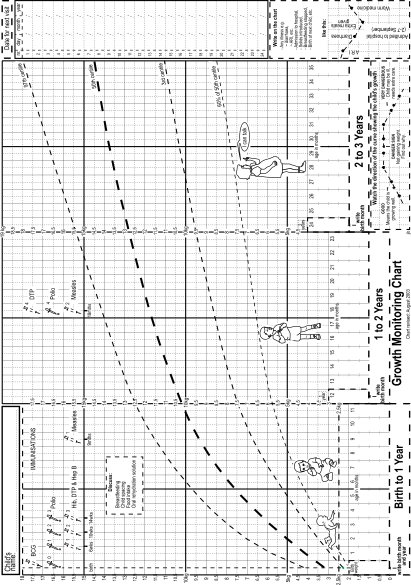

1
{:.chapter-number}

# The history and examination

Take the chapter test before and after you read this chapter.



## Contents
{:.non-printing}

*   [Objectives](#objectives)
*   [Introduction](#introduction)
*   [The first meeting](#the-first-meeting)
*   [The review of any referral information](#the-review-of-any-referral-information)
*   [Basic information](#basic-information)
*   [The history](#the-history)
*   [The physical examination](#the-physical-examination)
*   [Special investigations](#special-investigations)
*   [The assessment](#the-assessment)
*   [A plan of action](#a-plan-of-action)
*   [Writing good clinical notes](#writing-good-clinical-notes)
*   [Case studies](#case-study-1)
{:.chapter-toc}

## Objectives

When you have completed this chapter you should be able to:

*	Introduce yourself to a mother and child.
*	Take a full history.
*	Perform a physical examination.
*	Make a clinical assessment.
*	Draw up a problem list.
*	Decide on a plan of action.
*	Write good clinical notes.

## Introduction

### 1-1 What are the steps in the general examination of a child?

*	The introduction to the child
*	The review of any referral information
*	Recording basic observations
*	Taking a history
*	The physical examination
*	Special investigations
*	Drawing up a problem list and making a diagnosis if possible
*	Planning any intervention that is needed

The letters ‘SOAP’ remind us of the 4 main steps of a general examination:

1.	**S**tory (the history or subjective information)
2.	**O**bservation (what you observe during the physical examination, the objective information)
3.	**A**ssessment (the list of problems and diagnosis)
4.	**P**lan of action (what needs to be done)

> The four main steps in the examination are the story, the observation, the assessment of the problems, and the management plan.

## The first meeting

### 1-2 Why is the introduction important?

The first step of the general examination is to introduce yourself to the child and his or her mother, father or caregiver (guardian). At the start, find out whether the child is a boy or girl. Always make sure that you know the gender of the child. If you get that wrong the parent may not trust you with your medical management. Never refer to a child as ‘it’. Always greet the child and parents with respect. This first meeting establishes the relationship between the caregiver (doctor or nurse) and the child and parents. The rest of the general examination and management of the child depend on a good, trusting relationship. A friendly, caring approach builds trust and confidence. Often in a busy clinic, the introduction is unfortunately bypassed. Always take time to ‘make friends’ with the child first before starting the examination. Avoid strong eye contact with toddlers until you have ‘made friends’.

> It is very important to take time to establish a good relationship with the child and mother at the start of the general examination.

### 1-3 How should you address a child?

Always introduce yourself by name. Find out what the child’s name is and use it throughout the examination. Some children prefer to be addressed by their pet name (‘nickname’) e.g. ‘Bobby’ rather than ‘Robert.’ Never refer to the child as ‘the kid’ or any other term of disrespect. Do not pretend that the child is not present when speaking to the mother.  

### 1-4 Why is it important to listen to mothers?

One of the most dangerous mistakes to make when examining a child is not listening to what the mother (or caregiver) has to say. She usually knows the child best and the opinions and insights of mothers are often right. Always allow the mother time to give her story and ask questions.

> Always pay careful attention to what the mother says about the child.

### 1-5 Why is it important to keep the language simple?

One of the main complaints by patients is that doctors and nurses do not use simple language. Avoid technical terms, complicated words and medical jargon. Make sure that you and the patient understand one another at all times. Sometimes a simple drawing may help to obtain an accurate history or give a clear explanation. Taking a clear history is often difficult when the patient comes from a different cultural or social background.

## The review of any referral information

### 1-6 What is the value of a referral letter?

The child may arrive with a referral letter from a colleague, crèche or school. The referral letter is important because it draws attention to the problem. It is important to read any referral information carefully. Always reply to a referral letter.

### 1-7 What is the value of the Road-to-Health Card?

It is always very important to ask for and review the child’s Road-to-Health Card as it provides much useful information about the child’s past medical history, immunisation record, growth pattern and wellbeing. If the Road-to-Health Card is lost or not available, ask why. A lost or forgotten Card may be due to a family or social problem. The crèche, school, clinic or hospital must not keep this patient-carried card.

> Always look carefully at the Road-to-Health Card before examining a child.

> 
> 
> Figure 1-1: A WHO Road-to-Health Card Growth Monitoring Chart
{:.figure}

## Basic information

### 1-8 What basic information is needed?

Before the history and examination, some basic information is often taken and recorded by the staff that meet the mother and child when they arrive at the clinic or hospital. This basic information usually includes the following:

1.	The age and gender of the child
2.	The child’s size
3.	The child’s temperature

### 1-9 Why are the age and gender important?

Age is needed to plot the infant’s size on the growth chart of the Road-to-Health Card and to assess whether the child’s development is normal. Boys are usually slightly bigger than girls at any given age, while girls tend to be slightly more advanced in their development.

### 1-10 How should the child’s size be recorded?

The infant’s size measurements (weight, head circumference and standing height or lying length) must be accurately measured and noted. The measurements must then be carefully plotted on the growth chart of the Road-to-Health Card.

Weight is a very good measure of the child’s general health and must be measured and recorded at every visit.

The head circumference is important, especially in the first year of life, as it is a measure of brain growth.

If the child can stand, the standing height (stature) should be recorded, as it is the best measure of growth. In younger children, the lying length should be recorded. While weight is a good measure of growth in an infant, height is the best measure of growth in older children.

*Details of the measurement and plotting of an infant’s size are discussed in [chapter 3](3.html).*

> The child’s weight must be measured and plotted on the Road-to-Health Card at every visit.

### 1-11 How should you measure the child’s temperature?

Body temperature is measured with a digital or mercury thermometer. In younger children the axillary temperature must be recorded. In older children the oral temperature can be measured under the tongue. Rectal temperatures should not be taken.

If a mercury thermometer is used, always shake the mercury down before measuring a temperature. Leave the thermometer in the axilla for 1 to 2 minutes, with the arm held against the body, before reading the temperature. The normal axillary body temperature is 36.5 to 37 °C. If the axillary temperature is higher than 37 °C, the child has a fever. The normal oral temperature is slightly higher than the axillary temperature, with a normal range up to 37.5 °C. Always clean the thermometer before taking a child’s temperature.

If no thermometer is available, feel the child with you hand and assess whether they are normal, cold or hot.

Note
:	Due to the small risk of mercury pollution or poisoning, a digital thermometer is preferred.

## The history

### 1-12 How do you start taking a history?

It is best to begin by simply asking the mother (or child) what is worrying them. Make sure that you understand what the complaint is. Ask ‘What is worrying you?’

### 1-13 Why is it important to obtain a good history?

The history (the story) is often the most important part of the general examination. Most problems can be identified and diagnoses can be made on a good history. Every effort must, therefore, be made to obtain a clear and detailed history.

> A carefully taken history will provide the information needed to make the correct diagnosis.

### 1-14 Who should give the history?

It is best if the history can be obtained from the child. However, in small children this is not possible and the history is usually given by the mother or someone else (the caregiver) who knows the child. Sometimes it is helpful to get the history from both the child and mother as each may emphasize different parts of the history. Some patients may need help to describe and explain their symptoms. Adolescents may wish to be seen without a parent present.

The history not only provides information about the present illness but can also give important details about the child’s past health, social and home environment.

### 1-15 What are the main parts of the history?

The main parts are:

1.	The present history and presenting complaints
1.	The past history
1.	Immunisations
1.	The social history (home, family and school)
1.	Special questions

### 1-16 What is important to ask about in the present history?

It is best to start by asking why they have come to see the doctor or nurse. What is worrying them? First let the child or mother tell their story. Give them time to speak without interrupting. In getting an accurate present history make sure that you obtain the following information:

1.	When was the child last completely well?
1.	What are the presenting complaints (symptoms)?
1.	What are the problems which made you bring the child today?
1.	When and how did they start?
1.	Are they getting worse?
1.	Does anything make the complaints better or worse?
1.	Is any treatment being used?
1.	Are there any other symptoms (what the child feels) or signs (what you can see)?
1.	Has the child been in contact with other children with similar problems? Many childhood illnesses are infectious.

It is important to make an assessment about whether you think the information is reliable or trustworthy. Sometimes it can be very difficult to understand what the complaints are. 

Note
:	A symptom is something that a patient complains of. It is usually a feeling like pain, discomfort, nausea or fear. In contrast, a sign is something that can be seen, felt or heard by someone else, such as a rash, lump or heart murmur. Small infants usually only have signs and not symptoms as they cannot speak yet.

### 1-17 What is important in the past history?

It is important to note:

1.	Any problems during the pregnancy, labour and delivery
1.	Gestational age and birth weight (If not known, was the infant small? How long was the hospital stay?)
1.	Any problems during the first few days of life
1.	Diet and feeding
1.	Growth and development
1.	Any previous illness or problems before the start of the present complaints
1.	If the present complaints have ever occurred before
1.	Any previous or present medication
1.	Any operations or hospital admissions
1.	Any allergies

It is most important to determine whether the present complaints can be related to anything in the past history.

### 1-18 What is needed in the immunisation history?

It is important at every visit to review the child’s immunisation record. Children may present with an infectious disease because they have not been fully immunised against that infection. An incomplete immunisation schedule may suggest social problems. All missing immunisations must be given.

### 1-19 Why may the social (home, family, school, economic) history be important?

Children are greatly influenced by their environment and by those around them. Many childhood problems are caused by problems at home (poverty, malnutrition, abuse, neglect, poor housing, unemployment) or at school (discipline, fear, bullying). The presenting complaint may be a warning of deeper social problems. Poverty and poor maternal education are the cause of many childhood problems. Some mothers bring their child to a clinic because they have a problem themselves. This may not always be obvious. Therefore, a social history must always be taken. Suspect abuse if the history does not explain any sign of injury.

Useful questions to ask are:

1.	Who looks after the child?
1.	Who are the other family members and are they healthy? Is there anyone with TB?
1.	Who looks after the child during the day?
1.	What is the family income?
1.	What is the mother’s (or caregiver’s) level of education?
1.	Are there problems in the home which may affect the child’s wellbeing (e.g. alcohol, violence, abuse)?
1.	What type of housing exists? Is there water, sanitation, electricity?
1.	Is the child receiving child support or a care dependency grant?
1.	Are there problems at school or crèche?

### 1-20 What question in the social history should not be forgotten?

It is difficult but important to ask the mother whether she knows her HIV status. HIV infection is the cause of many illnesses in children today. Most of these children are born to HIV-positive mothers and infected by mother-to-child transmission.

### 1-21 What special questions should be asked?

Special questions should be asked about each system e.g. respiratory, gastrointestinal or cardiovascular system. Questions are mainly limited to the body system involved in the present history. For example, if the presenting complaint is abdominal pain it would be important to ask about appetite, vomiting, diarrhoea or constipation, worms, blood in the stool and weight loss. If the right questions are not asked, you will not be able to get the correct answers.

### 1-22 When can an interpreter help in taking a history?

Many mothers and children do not speak the same home language as the doctor or nurse. Even if you are able to understand each other a little, it is very difficult to take a detailed history without a good understanding of each other’s language and traditions. Here a translator is very helpful. Unfortunately, skilled translators are often not available and local nurses or cleaning staff have to help. Always express your concern and willingness to help the child, and make sure you understand what the main problem is.

### 1-23 Why is confidentiality important in history taking?

Often the history has to be taken in a busy clinic or ward with many other people around. Always be aware that the mother and child may be embarrassed or unwilling to discuss the details of their problem in front of others. This is particularly important if the mother is afraid that her child may have AIDS. If at all possible, try to arrange that histories can be taken in a quiet, comfortable, private area.

> Information provided by a patient must always be treated with respect and confidentiality.

### 1-24 What can be learned by observing the mother and child during history taking?

Much can be learned by observing the child and mother. Watch their facial expressions, hand movements and body language. These give clues about anxiety, guilt, embarrassment or lack of interest. Observe what kind of clothes they wear.

## The physical examination

### 1-25 What are the steps in the physical examination?

The steps are:

1.	General and regional inspection
1.	Systematic examination
1.	Special examination

### 1-26 In what order should the steps of the examination be done?

Usually the general and regional inspection are done first and then followed by the systematic (systems) examination. A special examination (e.g. rectal examination) is only done if there is a good indication.

It is important to do the physical examination in a fixed order. Otherwise, parts of the examination may be forgotten. However, the steps are flexible and in younger children parts of the examination that may hurt or frighten the child or require an instrument (e.g. examining the throat) are often left for last. Most mistakes in diagnosis come from incomplete examination.

### 1-27 What are the components of each step of the physical examination?

1.	Inspection (look and see)
1.	Palpation (feel)
1.	Percussion (feel and listen)
1.	Auscultation (listen with a stethoscope)

In a brief examination, percussion is often left out unless particularly indicated. Always inspect (look) before palpating (touching). Palpate before auscultating (listening). In a small child who is likely to cry, it may be better to listen before palpating. Children are less threatened if you start by examining their limbs first, before examining their chest and abdomen. It is important to make the examination as non-threatening and comfortable as possible. With young children it often helps to turn the examination into a game.

> Always observe first.

### 1-28 What is the most important component of the examination?

All components are important. However, it is particularly important to look and see. Inspection is the best means of telling whether a child is well or sick. It also helps to decide whether a child is anxious, frightened or embarrassed. Many diagnoses can be made by careful inspection alone. As children often cannot tell you how they are feeling, you need to obtain this information by observing them.

> Many diagnoses can be made by careful inspection.

### 1-29 Where should the examination be done?

If possible, an infant should always be examined with one or both parents present. Infants under a few months are usually examined on the couch or bed. Examining a small child of 3 to 36 months is often easier if the mother holds the infant sitting on her lap. This is particularly important when examining the throat and ears when the mother may have to sit the child upright on her lap, looking away from her, while she holds the child’s head firmly against her chest.

Older children may not like lying down and can be examined while standing in front of the mother, depending on the child’s wishes. Always be gentle and friendly. Never rush or move suddenly.

### 1-30 Should the child be undressed for the examination?

If possible, all the infant’s clothes should be removed slowly and gently. Toys or sweets may help to distract the child during undressing and examination. Never touch a child with cold hands. Most children do not mind being undressed provided due respect is paid to their feelings. Older children may be sensitive and embarrassed about getting undressed in front of strangers.

If a child is very distressed by being completely undressed, it may be better to undress and examine one part of the body at a time. If a child is shy, it is best to leave the underpants on for most of the examination. However, the genitalia should be inspected. A soft blanket can be used to cover parts of the body while they are not being examined.

The examination room should be warm, quiet and interesting to the child. Always keep the mother close by.

> Always have warm hands when examining a child.

### 1-31 What is the best approach to the general and regional inspection?

1.	First stand back (at the end of the bed) and have a good look at the whole child (general inspection):
	*	Does the child appear well or ill, distressed, toxic or shocked?
	*	Does the child look strange, with an appearance suggesting a syndrome (dysmorphic)?
	*	Is the child fully conscious and co-operative?
	*	Does the child look thin or fat? What is the nutritional status? Is the child wasted?
	*	Is the child afraid, tearful, angry or embarrassed?
	*	Is the child pale, jaundiced or cyanosed?
	*	Does the child have a rash?
	*	Does the child appear well cared for?
	*	Does the child appear dehydrated?
2.	Secondly, inspect each part of the body (region) starting with the head and ending with legs (regional inspection):
	*	Head – size, appearance, hair, fontanelle
	*	Ears – appearance, exudate
	*	Eyes – appearance, conjunctivitis, jaundice, squint
	*	Nose – discharge, flaring
	*	Mouth – appearance, stomatitis, thrush, pallor or cyanosis, cleft palate
	*	Neck – enlarged thyroid or lymph nodes
	*	Arms – lymph nodes, rickets, palmar creases, clubbing, pallor or cyanosis
	*	Chest and abdomen – appearance, dehydration, rash, scars, hernias
	*	Spine – scoliosis
	*	Genitalia – appearance, undescended testes, hernias
	*	Legs – lymph nodes, rickets, oedema, clubbed feet

Usually the general and regional inspection is followed by an examination of the main body systems. The general and regional inspection often indicates what system needs special attention during the systematic examination.

> Always look carefully first before touching the child.

### 1-32 How are the body systems examined?

During the systematic examination, each system is examined separately by inspection (looking), palpation (feeling), percussion (tapping) and auscultation (listening with a stethoscope):

1.	Respiratory system:
	*	Count the respiratory rate.
	*	Listen for cough, wheezing or stridor.
	*	Look for signs of respiratory distress (recession, grunting).
	*	Percuss for dullness over both lungs, front and back.
	*	Auscultate both lungs, front and back.
2.	Cardiovascular system:
	*	Count the pulse and note the nature of the pulse (easy or difficult to feel?)
	*	Take the blood pressure (not always needed in infants).
	*	Look at the shape of chest.
	*	Palpate (feel) for the position of the apex beat.
	*	Auscultate the heart for heart sounds and murmurs.
3.	Gastrointestinal system:
	*	Look for abdominal distension.
	*	Look and feel for hernias.
	*	Feel for abdominal tenderness.
	*	Feel for enlarged organs (liver, spleen, kidneys) or other masses.
	*	Listen for bowel sounds.
4.	Genitourinary system:
	*	Is the child obviously a boy or girl?
	*	If a boy, are the testes descended?
5.	Central nervous system:
	*	Assess whether the child is alert and fully conscious. Any convulsions (fits)?
	*	Determine the developmental milestones.
	*	Can the child see and hear normally?
	*	Can the child smile and close eyes tightly?
	*	Assess for neck stiffness (meningism).
	*	Asses whether the child is able to move all limbs normally.
	*	Observe whether the child walks normally (if old enough).
6.	Muscular skeletal system:
	*	Look whether the back is straight.
7.	Ears, nose and throat:
	*	Examine mouth and throat.
	*	Examine ears.

The order of the examination is flexible. Usually the examination of the mouth, throat and ears is done last as it is unpleasant for a young child. Sometimes the heart is examined first so that the heart sounds can be heard before the child becomes upset and cries.

Note
:	Only the most important aspects of the physical examination are given here. For a more detailed examination see a standard textbook on paediatrics such as Paediatric Primary Health Care by Ireland, Power, Woods and Desai (Oxford University Press, Cape Town 2006).

### 1-33 What are important danger signs?

Danger signs warn that the child may have a serious illness. During the general inspection, it is important to look for danger signs such as:

*	Physical or mental distress. Always look for respiratory distress.
*	Dehydration or continuous vomiting
*	Depressed level of consciousness
*	Convulsion

### 1-34 What are the early signs of dehydration?

A child is dehydrated when:

*	There is decreased skin turgor (the skin is pinched and then released, but does not return to its previous shape immediately).
*	The fontanelle is sunken.
*	The eyes are sunken.

*The signs of dehydration are discussed in [chapter 5](5.html).*

### 1-35 What special examination may be needed?

Sometimes it may be necessary to perform a rectal or vaginal examination, or examine the fundi of the eyes. These may need to be done under general anaesthesia in a small child.

### 1-36 What are the 10 common errors in the general examination of a child?

The 10 common errors are:

1.	Not taking time to introduce yourself to the mother and child
1.	Not listening to what the mother says
1.	Not taking a full history
1.	Not checking the immunisation status
1.	Not weighing the child and plotting the weight correctly on the Road-to-Health Card
1.	Not looking at the child carefully (inadequate general inspection)
1.	Not assessing the developmental milestones
1.	Not recording the blood pressure in older children
1.	Not examining the child’s gait (walk)
1.	Not writing SOAP notes with a problem list, assessment and plan

## Special investigations

### 1-37 What special investigations are usually needed?

The most important special investigations are:

1.	Urinalysis with a urine dipstick to detect urinary tract disease or diabetes. It is particularly important to test the urine in a child with fever.
1.	Haemoglobin concentration.

These are often done routinely in ill children.

Other special investigations, which are often asked for in hospital, are a full blood count (FBC), erythrocyte sedimentation rate (ESR), chest X-ray, urine and stool microscopy and culture, and Mantoux skin test. These tests may not be available in many clinics.

### 1-38 What additional investigations may be needed?

These will be determined by the findings of the history and the physical examination. Any investigations should only be done if they are indicated.

## The assessment

### 1-39 What is the assessment?

Once the history has been taken and the examination completed, it is very important to make an assessment of your findings and write careful notes. You need to note the patient’s main complaints and draw up a list of problems. If possible, make a diagnosis. If this is not possible yet, it is most helpful to complete a detailed problem list.

### 1-40 What is a problem list?

This is a precise list of the patient’s current unsolved problems (i.e. problems which are still active and need to be addressed). The problems may be medical as well as social or economic. A carefully drawn-up problem list is one of the most important parts of the whole examination and makes sure that no problem is forgotten. Do not include problems which have already been resolved. As soon as a problem has been solved it should be removed from the problem list. From the problem list, an attempt should be made to reach one or more diagnoses. A diagnosis may be included as a problem.

The following is a typical problem list:

1.	Poverty, with poor housing
1.	Failing to thrive, with weight below the 3rd centile
1.	Incomplete immunisation
1.	Pneumonia
1.	Dental caries

A problem list is a precise list of the patient’s current unsolved problems.

Note
:	The problem-orientated medical record has been a major advance in improving patient care and is widely accepted as the best method of keeping records.

### 1-41 How do you make a diagnosis?

Many childhood diseases have similar signs and symptoms but only a few of these diseases are common. The steps in making a diagnosis are:

1.	Gather all the abnormal findings found in the history, examination and any special tests.
1.	Compare these finding to those found in common childhood diseases. It is usually quite easy to find one which best fits the findings.
1.	Carefully compare the clinical findings to the signs and symptoms typical of the chosen diagnosis and see if they truly fit.
1.	If they do not fit, reconsider your diagnosis and think of another possible diagnosis.
1.	Watch the child’s response to the treatment for that diagnosis.

If you are unable to make a diagnosis or if you diagnose a serious disease, the child must be referred to hospital or a special clinic for further management.

## A plan of action

### 1-42 What is a plan of action?

This is a careful plan of how each identified problem is going to be investigated and managed. It is of little help to complete a full general examination, make a careful problem list and possible diagnosis, but then fail to take any action. Each item of the problem list must be considered and a plan of action decided upon and documented for that problem. The plan of action must be clearly written in the patient’s record (if in hospital or at a clinic) as well as in the Road-to-Health Card.

When writing out the plan of action, it is useful to list each problem in turn and then note what action is needed for that specific problem. This helps to keep track of the various actions which are needed for the whole problem list. What is not wanted is a long, confused list of actions where it is uncertain which problems are being addressed by each action.

The clinical findings, assessment and plan of action must be simply and clearly explained to the parents. The patient and parents should be allowed to ask questions and discuss the important points. Always be patient, polite and caring. A translator may be needed.

The following is a typical plan of action:

1.	Poverty: Refer to social worker to consider a grant.
1.	Underweight for age: Provide food supplements and monitor weight gain.
1.	Incomplete immunisation: Arrange for missing immunisations to be given.
1.	Pneumonia: Start oral amoxycillin, check oxygen saturation, provide oxygen if needed, refer to hospital.
1.	Dental caries: Book dental appointment and discuss dental hygiene with mother.

## Writing good clinical notes

### 1-43 What is the importance of good clinical notes?

It is extremely important to always write good clinical notes.

*	The patient’s notes are the best way of reminding yourself at the next visit what the problems were, what was found and decided upon, and what investigations and management were planned.
*	Good notes are the best way of communicating this information to other members of the health team who may see this child at future visits.
*	Writing good notes helps one to think and develop a clear idea of the child’s problems and the required management. By looking at other colleagues’ notes it is easy to determine whether they had a clear idea of the problems and course of action needed.
*	The patient’s notes are the official record of the patient’s care. They are the medico-legal record of the interaction between the patient and the health service.
*	Keeping good notes helps to develop and maintain a high level of care and pride in the service.

It is essential that clinical notes can be easily read and understood. It is a waste of time and dangerous practice to make notes which others are unable to read.

> It is extremely important always to write good clinical notes.

### 1-44 How detailed should your notes be?

This depends on whether you are seeing the patient for the first time or at a follow-up clinic. It also depends on the amount of time you have to examine the infant and write notes. Notes must be written at every visit. The aim is to produce the best notes possible under the circumstances.

Usually, detailed notes are written at the first consultation. Thereafter, a brief note should be made about each problem on the problem list at every visit. Do not lose a problem from the list until it has been fully attended to. Always make a note of any problems in the Road-to-Health Card.

### 1-45 How should the notes of the first visit be laid out?

Use the SOAP system to lay out your initial notes.

1.	Start with the *history* (story or what is said):
	*	The reason for referral should be noted together with the child’s age and gender. It is important to begin with the presenting complaints and the detailed history relating to each of them. This will form the present history.
	*	Any important points from the past history should be recorded.
	*	Any outstanding immunisations must be recorded.
	*	Important facts from the social history should be noted.
	*	Each section of the history (present, past, immunisation and social history) is given a separate heading to make it easier to read.
2.	Important positive and negative aspects of the *special questions* are usually written under a separate Special Questions heading. This completes the history section of the notes.
3.	The *physical examination* follows next. This usually is written under the following headings:
	*	Weight (and sometimes head circumference and length or height)
	*	Temperature
	*	The general appearance of the child (including nutritional state and hydration)
	*	Specific general signs (such as pallor, cyanosis, jaundice and oedema)
	*	Important positive or negative signs from each body part (e.g. head) or organ system (e.g. cardiovascular system)
4.	 List special investigations asked for, note the date of the investigation and record any results available.
5.	 Make an assessment by drawing up a problem list with diagnoses where possible.
6.	 Write a plan of action for each problem.

All notes must clearly state the date and your name.

### 1-46 How should progress notes be written?

Every time the patient is examined, a careful progress note must be made in the patient record or on the Road-to-Health Card. Continue using the SOAP system. Each item on the problem list must be considered in turn. The history, clinical findings, any special investigations, and plan of action must be recorded for each problem. Only record what is important. One of the greatest mistakes made in writing continuation (follow-up) notes is that they are too long and detailed. Notes must be kept short and simple. No one will read pages and pages of unnecessary writing.

> Progress notes should be short and simple and address each unresolved problem.

Once a problem on the list is solved, that problem can be dropped and need no longer be included in the problem list. Any new problem should be added to the list.

In this way, each active problem (i.e. still on the list) should be considered at each examination. This provides a simple, clear and systematic record of the patient’s clinical progress. Any other nurse or doctor can quickly understand the patient’s problems and progress by reading good notes.

The following is a typical example of progress notes using a problem list and SOAP method:

~~~
PROBLEMS

1. Scabies:

S: Itching is much better, especially at night.

O: Rash improving. No secondary infection.

A: Scabies has responded to treatment with Ascabiol.

P: Give mother Ascabiol to treat whole family.

2. Iron deficiency anaemia:

S: More energy. Good appetite.

O: No longer pale.

A: Good response.

P: Check Hb.

Continue oral iron for 3 months.
~~~

### 1-47 Should notes always be made in the Road-to-Health Card?

If the child presents at either a clinic or hospital, a note should always be written in the Card. A brief summary of the problems, assessment and plan of action should be made even if fuller notes are made in the patient’s hospital or clinic record. As the child may be seen at a number of different facilities over months or years, the patient-carried Road-to-Health Card is the one place where all the visits should be recorded.

> Always make a note in the Road-to-Health Card.

## Case study 1

A doctor is asked to see an ill 9-year-old child in a hospital outpatient department. He ignores the child and asks her mother what the problem is. She gives him the referral letter, which he does not read. Before she can give her story he has already started to examine the child. The child is not weighed. He tells her that the child has rheumatic fever, and should stay in bed and take the prescribed tablets three times a day. He then rushes out without any further explanation.

### 1. What is the first mistake the doctor makes?

He ignores the patient. A 9-year-old child should be able to tell the doctor about the presenting complaints. He also does not introduce himself to both mother and child. This is not only bad medicine but it is also foolish and rude.

### 2. Is this the correct method of taking a history?

No. He does not pay attention to the mother and starts examining the child before she has had a chance to tell her full story. Never ignore what a mother has to say, as she knows her child best.

### 3. In a hospital, is it important to read referral letters?

Yes. Always read the referral letter as it draws attention to the clinical problem and often provides important information. The doctor should have replied to the letter.

### 4. Is measuring weight part of the general examination?

All children (and adults) should be weighed as part of a general examination. The child’s weight should have been plotted on a weight-for-age chart.

### 5. What do you think of the way he told the mother the diagnosis and prescribed treatment?

He failed to explain what the problem was and what the diagnosis means. She should have had the management explained to her. The mother needs to know when to return for the next appointment. Even if the diagnosis and treatment were correct, the history and examination were inadequate.

## Case study 2

A general practitioner asks about the presenting complaints and takes a present but no other history from a mother and her 10-year-old daughter. The child has a fever and a rash. After a quick general inspection, he lifts the child’s shirt and looks at the rash. After writing a brief note in the hospital folder he tells the mother that the child has measles.

### 1. What mistake has the doctor made in taking a history? 

Only a present history was taken. It is important always to take a past, social and immunisation history as well.

### 2. Why is an immunisation history important?

It is important to know whether this child has been fully immunised, especially against measles and rubella.

### 3. What was wrong with the physical examination?

The doctor only did a general inspection. Each organ system was not examined. The doctor also did not palpate or auscultate. Important clinical signs, such as lymphadenopathy, splenomegaly and signs of measles in the child’s mouth (Koplik’s spots) may have been missed.

### 4. What routine basic information would have been useful?

The child’s temperature and weight. Always record and plot weight to screen for malnutrition.

### 5. Is a ‘brief note’ in the hospital folder adequate?

No. As this is the initial consultation he should have written full notes (basic information, history, special questions, physical examination and any investigations).

## Case study 3

An infant is seen by a nurse at a follow-up appointment at a local clinic. She is unable to read the long and confused notes made at the previous visit and does not ask the mother for the Road-to-Health Card. The mother cannot help her, as she was not told what the problem was. She thinks the child has a heart problem. During the examination the infant cries because the nurse’s hands are cold. As a result she cannot hear the heart sounds and refers the child to hospital.

### 1. Why is she unable to read and make sense of the patient’s notes?

Because they were not written clearly in a logical order. This is a very common finding. With good notes she should be able to quickly find out what the previous problems and management were.

### 2. Why should she have asked for the Road-to Health Card?

There may be a summary of the previous visit in the Card. The Card would also indicate how the child has been growing, whether the immunisation schedule is up to date and what previous health problems have occurred. It is a serious error not to review the Card at each visit.

### 3. Why was the mother not told what the problems were?

There was poor communication between the health professional and the patient. This is a common problem. This can be partially addressed by making a note in the Road-to-Health Card. The parents and the child should always be fully informed after a consultation.

### 4. What mistake did the nurse make with the examination?

She did not warm her hands first. Cold hands and a cold stethoscope are a common mistake. As a result she could not listen to the heart.

### 5. What are the 3 steps in the physical examination?

1.	General and regional inspection
1.	Systematic examination
1.	Special examination

### 6. In what order should each of the most important 3 steps be done?

1.	Inspection
1.	Palpation
1.	Auscultation

## Case study 4

A child from a very poor home presents with scabies at a clinic. His weight is below the 3rd centile. The mother also says that he has coughed for the past month. The nurse takes a full history and completes a physical examination. She writes SOAP notes in the patient folder and also writes a summary in the Road-to-Health Card.

### 1. What are SOAP notes?

This is a system of writing clinical notes, which includes the story (history), observations (physical examination), assessment and plan of action. All initial or follow-up examinations should be recorded this way.

### 2. Is it necessary to write notes in both the clinic folder and Road-to-Health Card?

Yes. The clinic folder should hold the detailed notes while a summary should be written in the Road-to-Health Card.

### 3. What is a problem list?

This is a clear, simple list of the patient’s problems. The problem list is drawn up during the assessment at the end of the complete examination. The problem list is the most important part of summarizing the findings of the history, physical examination and investigations. A problem list must always be made even if the diagnosis is not known.

### 4. What would be the problem list for this child?

1.	Poor social circumstances
1.	Failure to thrive, with a weight below the 3rd centile
1.	Scabies
1.	Chronic cough

An action plan is needed for each of the problems. Some problems, like scabies, needs treatment while others, like the chronic cough, need investigation. It is important that social problems are also recorded and addressed.
