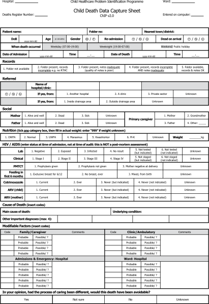

15
{:.chapter-number}

# Childhood mortality

## Objectives

When you have completed this chapter you should be able to:

*	Calculate the under-5 mortality rate.
*	Understand the importance of knowing local mortality rates.
*	Manage a mortality meeting.
*	List common causes of under-5 mortality.
*	Identify important modifiable factors.

## Introduction

### 15-1 How are deaths during childhood counted?

The most common way of recording the number of deaths during childhood is to count the number of children who die before the age of 5 years, therefore children who are born alive but die before their fifth birthday will be counted as under-5 deaths but children who die on or after their fifth birthday will not be included. However, there are limitations to this method as it is important not to forget older children.

> Under-5 deaths are often used as a measure of the number of childhood deaths.

Note
:	The WHO defines a child as a person under the age of 18 years. Ideally all deaths under the age of 18 should be recorded as childhood deaths. However, this is rarely done as teenagers are usually not cared for by paediatric services. Many paediatric services only care for children up to the age of 13 (the common age of puberty).

### 15-2 What is a mortality rate for children?

This is the number of children who die expressed as a proportion of all the children who could possibly die. For example, if there are 1000 liveborn children and 10 die, the mortality rate for these children is 10 per 1000.

It is more useful to know the mortality rate than only the number of children who die. Therefore, it is not good enough to simply know how many children died. Mortality rates allow you to compare deaths between different-sized groups of children.

### 15-3 What is the under-5 mortality rate?

The number of children who die under the age of 5 years is usually expressed as a rate per 1000). Therefore, the under-5 mortality rate is defined as the number of children who die under the age of 5 years per 1000 live born infants. The under-5 mortality rate indicates the probability that a live born child will not survive to the age of 5 years. The under-5 mortality rate is one of the basic health indicators.

> The under-5 mortality rate is the number of children who are born alive but die under the age of 5 years per 1000 liveborn infants.

### 15-4 How can under-5 deaths be grouped?

Under-5 deaths are usually divided into age groups:

**Neonatal mortality** includes all live born infants who die in the first 28 days of life. Often neonatal deaths are further divided into early neonatal deaths (deaths in the first 7 days of life) and late neonatal deaths (deaths between 8 and 28 days of life). The neonatal mortality rate is, therefore, the number of live born infants who die in the first 28 days of life per 1000 live born infants.

> The neonatal mortality rate is the number of infants who are born alive but die in their first 28 days of life per 1000 live born infants.

**Infant mortality** includes all the children who die before the age of 1 year (i.e. before reaching their first birthday). Therefore the infant mortality rate is the number of children who die under 1 year per 1000 infant born that year.

> The infant mortality rate is the number of infants who die before the age of 1 year per 1000 liveborn infants.

Note
:	Sometimes the infant mortality rate is divided into the neonatal mortality rate and the post neonatal mortality rate (the number of infants who die between 1 month and 12 months per 1000 infants born that year). The child mortality rate is the number of children aged 1 to 4 who die per 1000 live births. The 5–18 mortality rate includes all the children dying from 5 up to but not including 18 years.

All the childhood mortality rates are expressed per 1000 liveborn infants.

### 15-5 What is an annual mortality rate?

Usually the infant and under-5 mortality rates are calculated for a calendar year. This is called the annual mortality rate. Sometimes the mortality rate is expressed over a longer period of time, e.g. over 10 years. It is less accurate to calculate mortality rates over periods shorter than one year.

### 15-6 Should the mortality rates be calculated for a special area?

Yes. Mortality rate is usually calculated for a given health district (or region). For example, to determine the under-5 mortality rate for a health district, all under-5 deaths in each part of that service (each clinic and hospital) must be added together. The rate is then expressed per 1000 live births in that district. Sometimes the mortality rate is calculated for a whole province or country by combining the results of many districts.

This is much better than simply calculating the mortality rate of a single hospital. Due to differing patterns of referral, hospital deaths do not necessarily reflect all deaths in the districts which drain to that hospital. For example, deaths at home or at clinics are not included. Therefore, mortality rates are best expressed for a health district in 1 year.

> It is best to calculate the under-5 mortality rate for a health district rather than only for a single hospital.

### 15-7 Are mortality rates the same for all health districts?

No. Mortality rates often differ markedly between health districts. Usually the rates are higher for poor districts than wealthy districts. Similarly, rates are higher in developing (poorly resourced) than in industrialised (well resourced) countries. Therefore, a single mortality rate for the whole nation is only of limited value.

### 15-8 Do mortality rates remain the same?

No. Mortality rates may also differ between different time periods. In most countries mortality rates have fallen over the past years. With the AIDS epidemic in Southern Africa, infants and under-5 mortality rates are rising.

Therefore, mortality rates allow you to compare different groups of children, either in different places (districts, regions, provinces or countries) at the same time or in the same place at different times (months or years).

> Mortality rates in the same place often vary over time.

### 15-9 Why is it important to know the infant and under-5 mortality rates?

Because they are one of the best ways of measuring the wellbeing of children. An improvement in mortality rates for a health district from one year to the next is a good way of showing that the wellbeing of children in that district is improving. An increase in the mortality rates indicates that the wellbeing is deteriorating. A high mortality rate draws attention to that district where there is obviously a problem.

> The under-5 mortality rate is one of the best methods of assessing the wellbeing of children.

Note
:	The 4th Millennium Development Goal set by the United Nations is to reduce the under-5 mortality rate between 2000 and 2015 by a third.

### 15-10 What determines the infant and under-5 mortality rates?

These mortality rates depends on both:

*	The health, nutrition and home environment of children
*	The quality of health care that is available to children

The mortality rate will increase if either the health, nutrition and home environment of children is poor or the health care service are poor. Often both poor socioeconomic conditions and inadequate access to good quality health services occur together. It is, therefore, not surprising that the mortality rates for children vary widely between different districts and countries. The district with a high rate may have a specific health problem (e.g. malaria) or a problem with the health service (e.g. low immunisation rate).

> The under-5 mortality rate reflects both the socioeconomic conditions and quality of health care provided.

### 15-11 What is the under-5 mortality rate in well resourced countries?

In well resourced (wealthy) countries or well resourced communities in poor countries the under-5 mortality rate is usually below 10. This reflects a high standard of child health, nutrition and home conditions as well as a good health care service.

Note
:	The neonatal mortality rate and infant mortality rate in industrialised countries is usually below 5/1000 and 7/1000 respectively.

### 15-12 What is the under-5 mortality rate in under resourced countries?

In under resourced (poor) countries or under resourced communities in wealthy countries the under-5 mortality rate is usually higher than 80. Every effort must be made to reduce the under-5 mortality rate in poor countries so that it approaches the rate in well resourced countries. Note the enormous difference in rates between wealthy and poor countries.

> Every effort must be made to reduce the under-5 mortality rate in poor countries.

Note
:	It is estimated that more than 10 million children die worldwide each year before their fifth birthday! Four million of these children die in their first month of life. The average worldwide under-5 mortality rate is about 80/1000 but some very poor countries have an under-5 mortality rate above 250/1000!

### 15-13 What is the under-5 mortality rate in South Africa?

This is not accurately known because the collection of mortality data is not good in all regions as many childhood deaths are not reported. However, the under-5 mortality rate in South Africa is estimated to be about 70/1000. In other words, for every 1000 infants that are born alive in South Africa, 70 will die before their fifth birthday. The under-5 mortality rate in South Africa is more like that of an under resourced than a wealthy country.

> The under-5 mortality rate in South Africa is estimated at about 70/1000.

The under-5 mortality rate varies between urban (town and city) and rural (country) areas and between different regions of the country. Wealthy communities in urban areas have an under-5 mortality rate similar to well resourced countries while poor, rural areas have a rate similar to under resourced countries.

Note
:	The under-5 mortality rates between provinces in South Africa vary from 40/1000 in the Western Cape to 80/1000 in the Eastern Cape. Similarly the under-5 rate for urban areas is 40/1000 while the rate in rural areas is 70/1000.

### 15-14 What is the infant mortality rate in South Africa?

The infant mortality rate in South Africa is estimated to be about 55 per 1000. Therefore, out of every 1000 infants born alive in South Africa, 55 will die before reaching the age of 12 months. This can be compared to an infant mortality rate of less than 10/1000 in developed countries and 20/1000 or more in developing (under resourced) countries. South Africa therefore has an infant mortality rate similar to that seen in most under resourced countries.

> South Africa has an infant mortality rate typical of a developing country.

The high infant mortality rate in South Africa indicates that there are problems with the health of young children in the country. South Africa has a higher infant mortality rate than other countries with a similar income (e.g. Mexico and Brazil). Therefore, South Africa has the financial resources to lower the infant mortality rate. It is important that a country uses its resources wisely and develops the health service and improves living conditions for all.

Furthermore, about 45 out of every 60 under-5 deaths occur during the first year of life (i.e. 75%). Children under 1 year are, therefore, at greater risk of dying than are older children.

Note
:	The neonatal mortality rate in South Africa is estimated to be about 20 per 1000. Therefore, about a third of all under-5 deaths occur in the first month of life, especially the first week of life when most neonatal deaths occur.

### 15-15 What do under-5 mortality rates tell us?

*	How well a district, region, province or nation is caring for their children
*	Which districts, regions or provinces have the greatest need for better child care
*	It allows for comparison of mortality rates between different areas or countries with a similar income. In other words, how well we are using our income to improve the health of children.
*	It helps identify areas or age groups where the causes of childhood death need urgent investigation.

## Collecting information on under-5 deaths

### 15-16 Should childhood deaths be notified?

Yes. All deaths are notifiable in most countries, including South Africa. The child’s age, gender and cause of death should be stated on the death notification form. Unfortunately the given cause of death is often unknown, incorrect or not helpful. For example, if a child with severe malnutrition due to poverty dies of pneumonia, it is of little help if the cause of death is listed as pneumonia when the real underlying reason was the low socioeconomic status of the family (i.e. poverty). Similarly, deaths due to AIDS are often recorded as gastroenteritis or tuberculosis.

The list of common causes of death on official publications is, therefore, often misleading.

> The cause of death given on many death notices is often incorrect or misleading.

In well resourced countries with accurate records of all births and deaths, it is far easier to determine mortality rates and the important causes of death.

### 15-17 How should the causes of childhood deaths be accurately identified?

The fully history, detailed examination and any special investigations must be recorded and reviewed (discussed) before deciding on the most likely cause of death. Collecting this information is best done as soon as possible after the child’s death while the probable cause of death should be recorded after it has been discussed and reviewed.

> All the infant’s case details must be collected and recorded as soon as possible after the death.

### 15-18 Why is it important to know the common causes of under-5 deaths?

Knowing the under-5 mortality rate is of limited value if you do not know why the children are dying, because the common causes of death during childhood vary greatly from one country to another.

The common causes of death need to be known before interventions can be planned to lower the mortality rate. It is very important that we learn why children die. This is done at a mortality review.

> It is essential to identify the common causes of under-5 mortality in each country, as they are important in planning health care interventions.

## Mortality review

### 15-19 What is a mortality review?

This is an in-depth investigation and discussion about each child death. The mortality review is usually done at special mortality meetings. These are regular meeting of staff where every childhood death in that service is reviewed. This includes all children who die in a hospital ward, outpatient or casualty department, and hospital or peripheral clinics. Ideally all children who die at home within the service region should also be included. Deaths due to both medical and surgical conditions must be discussed. This is the best way of obtaining an accurate assessment of each death.

> The cause of death is best decided after discussion at a mortality meeting.

### 15-20 What are the aims of the mortality review?

The main aims of a mortality review are to:

*	Obtain data on the number of deaths and calculate the mortality rates.
*	Identify the main cause of death as well as contributing causes.
*	Identify any modifiable factors.
*	Decide whether the child received good management.
*	Allow all the staff involved with child care to contribute to the discussion.
*	Discuss ways that both causes can be avoided and modifiable factors corrected.
*	Use the discussion to teach. Getting the staff to identify the clinical and management problems is a very effective way of learning.
*	Providing feedback on changes in the frequency of causes and modifiable factors, i.e. Are we making a difference?

> The main aims of mortality reviews are to identify problems and find answers.

An important part of the mortality review is the mortality meeting. Mortality meetings should be well organised and well managed.

### 15-21 How should a mortality meeting be managed?

1.	A responsible person must be identified to arrange the meeting. This is usually a doctor working in the paediatric service.
1.	Regular meetings are held once or twice a month depending on the number of deaths.
1.	A suitable time and venue is needed. Often lunch times or late afternoons are best.
1.	All staff involved with child care should be invited (nurses, doctors and administrators). Staff must understand that mortality meetings are very important.
1.	A brief summary of each death, giving relevant information, must be prepared before each mortality meeting.
1.	Anything discussed in the meeting must be viewed as confidential. Summary sheets should be destroyed after the meeting.
1.	The meeting should discussed what ‘we’ did incorrectly and how ‘we’ could do better in future. The meeting must never become a ‘witch hunt’. Any disciplinary action must be handled with the person involved privately outside the meeting and never in front of other staff. Without a spirit of mutual support and trust, important details of the child’s management may be withheld. A team approach is needed to solve problems of patient management.
1.	All decisions (causes and modifiable factors) made must be recorded on the mortality sheets (death data capture sheets) at the time of the meeting and not afterwards when important details may be forgotten.
1.	Decisions about actions to be taken must be documented, and progress must be reviewed at the beginning of the next mortality meeting.

> Discussions in a mortality meeting must be confidential and carried out in a constructive and non-threatening manner.

Well organised mortality meetings are one of the best ways of improving the standard of health care of children. Mortality meetings are also a very effective way of teaching. They help staff to identify and solve problems and provide a wonderful learning opportunity. They reduce the number of children who die.

> Mortality meetings reduce the number of children who die.

### 15-22 What information is needed for each child who dies?

1.	Full name, hospital or clinic number, gender (sex), age (date of birth) and date of death.
1.	Full clinical history including past history, record of immunisation, review of the growth chart in the Road-to-Health Card, family history and home conditions.
1.	Results of a full examination together with an assessment of the growth and nutritional status.
1.	Any special investigations (e.g. blood and urine tests, X-rays).

All the information must be summarised *before* the meeting so that a brief summary can be presented. This is often handed out on an information sheet or presented with an overhead projector. It is boring and wastes time if information has to be looked for in the patient’s records during the meeting.

A register of all admissions and deaths must be kept in each service area (e.g. ward) so that no deaths are missed and the number of admissions are known. Basic information in the ward or clinic register must include each patient’s name, folder number, age, sex and weight. All wards should keep a monthly death register which records all deaths in that month. Often each death is given a unique code (number).

> A brief clinical summary must be prepared before the mortality meeting for each child who has died.

### 15-23 How is the cause of death decided?

This is one of the most important parts of the mortality meeting. All the possible causes must be considered before agreement is reached on the main cause of death. This is often only agreed upon after some discussion. If the cause of death is not certain, then the probable cause must be used. The cause of death, therefore, is decided by everyone at the meeting.

> It is important to decide on the most likely cause of death.

### 15-24 How is the cause of death recorded?

For each child, the main cause of death must be identified. This is the most likely factor that lead to the death of the child. Sometimes it is not easy to decide which is the main cause and which are contributing causes. Any other contributing causes should also be recorded. If possible, an ICD 10 code should be allocated to the main as well as other contributing causes.

An example would be measles as the main cause with bacterial pneumonia and malnutrition as contributing causes.

It is important to have a formal document (death data capture sheet) on which all the relevant information as well as the causes and modifiable factors can be entered and coded.

### 15-25 How should you decide whether the management of a child was correct?

If possible, standard national protocols of care should be used. The management which was given can then be compared to the approved management. If a national protocol is not available, the most acceptable method of care should be obtained from a current textbook, journal article or expert on that condition. By asking questions at mortality meetings, better ways of preventing, diagnosing and managing childhood problems are often identified. This is one of the great benefits of these meetings. Modifiable factors must always be looked for and recorded at the mortality meeting.

By identifying errors in management and correcting these errors, the lives of children in future can be saved. This is one of the main aims of mortality meetings.

> Identifying and correcting errors in management can save the lives of other children.

It is very important to praise good manage­ment, even if the child died. A positive attitude and willingness to compliment the staff for good care helps to encourage active participation and lessen the fear of criticism.

### 15-26 What is a modifiable factor?

A modifiable (avoidable) factor is a missed opportunity for good care or an example of substandard care which probably lead to the child’s death. No measles immunisation would be a missed opportunity in a 2-year-old child who died of measles, while failure to give adequate rehydration at a clinic would be substandard care in a child who died of acute diarrhoea.

> Modifiable factors include all missed opportunities for good care and any substandard care which probably resulted in the death.

Identifying modifiable factors is an important step in planning health care strategy and correcting problems which lead to poor care and deaths. It is important to decide whether each death is probably avoidable or not. The identification of modifiable factors enables problem solving.

> It is important to decide whether a death could probably have been avoided.

### 15-27 How can modifiable factors be classified?

Modifiable factors can be divided into:

*	Modifiable factors related to the family or caregiver. Examples include not taking children for immunisation, delay in taking an ill child to clinic, poor nutrition, not recognising that a child was ill, neglect and abuse.
*	Modifiable factors associated with the clinical staff. Examples include poor clinical assessment, giving the incorrect treatment, delay in referral, inadequate notes and not seeing a child when asked to do so.
*	Modifiable factors related to the administration. Examples include lack of facilities, equipment or staff, lack of training, inadequate transport, poor communication, lack of policy or medications, and no laboratory service.

> Modifiable factors may be related to the caregiver, clinical staff or administration.

Note
:	Any event, act or omission contributing to the death or to substandard care should be regarded as a modifiable factors.

A comprehensive (full) list of common modifiable factors should be drawn up and referred to when each death is discussed. It is helpful if each modifiable factor is given a specific code as this makes the analysis of modifiable factors much easier.

## Causes of under 5 deaths

### 15-28 What are the common causes of under-5 deaths in South African hospitals?

*	Lower respiratory tract infection
*	Diarrhoeal disease
*	Septicaemia
*	AIDS
*	Severe malnutrition
*	Tuberculosis

Note
:	This data is from the Child Health Care Problem Identification Programme (Child PIP).

> Infections are the most common cause of under-5 mortality in South Africa.

Note
:	The most common cause of death in the 5–18 year age group in South Africa is trauma (e.g. motor vehicle accidents and violence).

### 15-29 How will the AIDS epidemic affect the common causes of death?

AIDS is becoming a much more common cause of death both in children and adults. Many of these children will eventually die of other infections such as pneumonia, diarrhoea, septicaemia and tuberculosis. Even if a child is not HIV-infected, death of one or both parents will increase their risk of dying under the age of 5 years. Therefore, the AIDS epidemic is expected to increase the under-5 mortality rate, and especially the infant mortality rate, in South Africa and many other developing countries.

> The spread of AIDS will increase the under-5 mortality rate in South Africa.

### 15-30 Why is it important to determine the HIV status of each child that dies?

An assessment of the HIV status of each under-5 deaths should be made. Otherwise children who have died with AIDS may be misclassified. Often the HIV status of children who die is not known. As a result, the role of HIV infection is missed.

Clinical signs of HIV infection must always be looked for and documented. If possible the child’s HIV and immunological status should also be determined.

Children with definite or probable HIV infection can be classified into:

*	Definite HIV infection with both clinical signs of HIV infection and positive HIV status
*	Children with probable HIV infection who have clinical signs of HIV infection but an unknown HIV status (i.e. blood test not done)

> The HIV status of all children who die must be assessed whenever possible.

### 15-31 How important is malnutrition as a cause of death?

Malnutrition is an important main or contributing cause of childhood death in most poor countries. Therefore it is important to determine the growth and nutritional status of all children seen at a clinic, admitted to a hospital, as well as all children who die.

> The nutritional status of all children who die must be recorded.

## The analysis of mortality data

### 15-32 What data are needed to analyse childhood deaths?

Two sets of information are needed to analyse mortality data:

*	**Baseline population data**. For calculating infant and under-5 mortality rates, the number if liveborn infants each year in that service or region is needed. For hospital mortality data, the total number of admission are needed. All deaths must be counted. This hospital data should be recorded in the ward admission books. Without this information, mortality rates cannot be calculated.
*	**The causes of death and modifiable factors**. This information should be recorded on the forms completed at the mortality meetings.

### 15-33 How is the data analysed?

Previously, the information was counted and analysed by hand, using paper information records.

Today most analyses are done by computer. This is faster and more accurate. It is also possible to show the findings as graphs or tables.

All the information recorded onto the mortality data capture forms at the mortality meetings has to be transferred onto a computer-based record. This can be done after each meeting or the information can be entered in batches.

### 15-34 What results are obtained from the analysis?

*	Details of the basic information, e.g. number of infants born alive each year and total hospital admissions. Admissions can be divided into age groups and by nutritional status (e.g. below the 3rd centile for weight).
*	Number of deaths and mortality rates
*	Causes of death and modifiable factors
*	Tables and graphs can be printed giving monthly or annual information on the number of deaths, mortality rates, causes of death and modifiable factors.
*	Children can be grouped by age and site of death.
*	Data from more than one site or region can be combined.

### 15-35 What should be done with the results of the analysis?

It is extremely important that the results of the analysis be made available to all who are interested, especially the staff and administration. The results must be used to improve the care of children.

### 15-36 What is a mortality report?

This is usually an annual report prepared from the monthly results of the mortality meetings. The mortality report gives a summary of the results and also draws conclusions from the results. It is of little value to collect and analyse mortality data throughout the year without interpreting what the results mean. The mortality report should also suggest ways that the results can be used to plan methods of reducing the mortality rate. The feedback loop between collecting mortality data, analysing the data and then using the data to improve care is very important.

> A mortality report must summarise mortality data and suggest ways to reduce mortality.

At a report-back meeting all the staff must be given the findings of the mortality report. An annual mortality report should be prepared for each health district. Theses should be used to produce reports for each province and for the whole nation.

### 15-37 What ongoing assessments are needed?

Regular assessments are needed to measure whether there are improvements in mortality rates and whether causes and modifiable factors are being addressed. Only with ongoing assessments can the impact of mortality reports be judged. It is very important to identify and correct causes of death that are not becoming less frequent and modifiable factors that are not being corrected.

### 15-38 What is the Child Health Care Problem Identification Programme?

The Child Health Care Problem Identification Programme (ChildPIP) is an important and innovative computer-based system to collect, analyse and report on childhood mortality data. It was developed in South Africa and is modelled on the highly successful Perinatal Problem Identification Programme (PPIP).

The aim of ChildPIP is to determine the mortality rates, causes of death and modifiable factors which may prevent childhood deaths. This should improve the quality of care that children receive in the health service.

*Figure 15-1 shows the data collection sheet for childhood deaths from ChildPIP.*

> 
> 
> Figure 15-1: The data collection sheet for childhood deaths from the ChildPIP
{:.figure .large}

## Ways of avoiding the common causes of under 5 deaths

### 15-39 What steps can be taken to reduce the under-5 mortality rate?

*	Improve the general health, nutrition and home environment of children. This can be achieved by reducing poverty.
*	Improve the access and quality of care provided by the health system.

### 15-40 How can under-5 mortality data be used to improve the quality of care in a health system?

By reviewing the data in hospitals and clinics, it is possible to decrease the under-5 mortality and improve the care of children. The problem of a high under-5 mortality rate cannot be addressed until the common causes of death and modifiable factors are fully understood.

> All health facilities should conduct regular mortality reviews as this can reduce the under-5 morality rate.

### 15-41 What should be done to address specific causes of under-5 deaths?

Once the cause of each death has been established, it is important to look actively for any modifiable factors. It is of little value to know the cause of death if nothing is done to prevent similar deaths due to that cause in future.

### 15-42 What should be done once the modifiable factors have been identified within a region?

A meeting of all role-players must be called to report and discuss the findings. It is important to identify the most common and most important modifiable factors, especially those that can be addressed and corrected. Doctors, nurses and administrators should work together to find practical answers. A plan must then be developed to implement changes aimed at lowering the mortality rate. This usually requires an improvement in the quality of health care that children receive.

A regular assessment of both the causes and modifiable factors must be made to determine whether the interventions are in fact reducing the mortality rate by decreasing the frequency of deaths associated with those causes and modifiable factors. Positive results are a very powerful motivating factors for the staff. A failure to show an improvement indicates that the strategy to lower mortality is ineffective. The reasons for this must be found and corrected. In future it is hoped that the deaths of children of 5 years and older will also be recorded and analysed in a similar fashion.

## Case study 1

The under-5 mortality rate is estimated at 95/1000 in a low resourced country. In a study of 8000 infants born alive in a large hospital in one year in that country, approximately 480 had died before their first birthday.

### 1. What is the definition of the under-5 mortality rate?

The number of liveborn infants who die before their 5th birthday per 1000 liveborn infants. Therefore, in this hospital, for every 1000 infants born alive 95 will die before the age of 5.

### 2. What do you think of an under-5 mortality rate of 95/1000?

It is high and typical of many under resourced (poor) countries. The under-5 mortality rate in well resourced countries is usually below 10/1000. In South Africa the estimated under-5 mortality rate is 70/1000.

### 3. Why is it important to know the under-5 mortality rate of a country?

Because it is one of the best indicators of the wellbeing of children in that country.

### 4. What important factors determine the under-5 mortality rate?

The under-5 mortality rate depends both on:

*	The health, nutrition and home environment of children
*	The quality of health care that is available to children

### 5. What is the definition of the infant mortality rate?

The number of liveborn infants who die in the first year of life. About 75% of all under-5 deaths occur in the first year of life.

### 6. What is the infant mortality rate in this hospital?

480/8000 = 60/1000 This is also typical of a developing country. South Africa has an infant mortality rate of 55 compared to rates of less than 7 in well-resourced countries.

### 7. Why is it of only limited value to know the mortality rate in a single hospital?

Because deaths at home and at clinics are not included, hospital deaths do not necessarily reflect all the deaths in the region that drains to that hospital. Therefore, it is better to determine the mortality rate in the whole region rather than just at one hospital.

### 8. Does South Africa have high infant and under-5 mortality rates because it is under resourced?

This is only part of the problem as some other countries with a similar income per person have lower rates. What is important is how a country spends its state funds. Resources must be spent wisely on improving the standard of living (and health) for all.

## Case study 2

The manager of a state hospital decides to start monthly mortality meetings in the children’s ward because the administration has had complaints of poor care. He instructs all doctors to attend and asks the paediatrician to present the findings of each death in order to find out which staff members have been practising substandard care. The doctor reads from the hospital folders which takes a long time. This discourages the junior doctors from asking questions or contributing to the presentation as they want to go home. The doctor criticises one of the doctors who failed to notice that a child with diarrhoea was dehydrated. The story is spread in the ward the next day.

### 1. What are the aims of a mortality meeting?

To improve the care of children by finding out the common causes of death and identifying associated factors which may have contributed to the death. If these problems are successfully addressed, the lives of other children may be saved. Mortality meetings are also an excellent opportunity to learn how to identify and solve problems. They provide a wonderful teaching opportunity.

### 2. What is wrong with the way the hospital manager arranged these meetings?

All staff members should be encouraged to attend these meetings, not just doctors. A team approach to identifying problems in patient management is essential if mortality meetings are to be helpful. These meetings should be a team effort. Everyone attending the meeting should be encouraged to participate.

### 3. Should the paediatrician read the notes from the patients’ folders?

No. The history, examination and special investigations for each child must be summarised before the meeting. It is very useful if the summaries are handed out at the meeting or shown on an overhead projector. This saves a lot of time.

### 4. Are the findings in a mortality meeting confidential?

Yes. All the discussions in the meeting must be confidential and gossip about the findings must not be allowed. Without strict confidentiality, many staff will not attend the meetings. It is a good idea to destroy the handouts at the end of the meeting.

### 5. Should mortality meetings be used to identify staff who have made mistakes?

No. These meetings must never become a ‘witch hunt’. Any disciplinary action must take place privately and never in front of colleagues. The spirit of mortality meetings is to explore how ‘we’ could have managed the child better. It is important to praise good care, even if the child died.

## Case study 3

A 4-year-old undernourished child with severe measles develops pneumonia and dies soon after arrival at hospital. Only when the child had been ill for 5 days did the mother take him to the local clinic. He had never been immunised against measles although this was available at the local clinic. The mother did not bring his Road-to-Health Card. While waiting for transport to hospital the child was cyanosed but no oxygen was available at the clinic. The history of this child is presented at a mortality meeting.

### 1. What was the main cause of death?

Measles

### 2. What were important contributing causes?

Pneumonia, either viral or bacterial. Malnutrition may also have contributed to the death, as measles is often severe in malnourished children.

### 3. Was this death avoidable?

Definitely yes.

### 4. What were the modifiable factors related to the family?

The child had not been taken for immunisation although this was available. The child was also not brought to the clinic until severely ill. As the mother did not have his Road-to-Health Card, it was not known how long he had been underweight. Family factors, related to poverty almost certainly contributed to the lack of routine clinic visits.

### 5. What was the administration-related factor that needs to be addressed?

There was no emergency oxygen available at the clinic.

### 6. When should these details be entered onto the death data capture sheet?

The history and clinical details are best entered at the time of the death when all the documentation is available. The causes and modifiable factors should be entered at the mortality meeting.

## Case study 4

A 2-year-old child with clinical signs of AIDS is brought to hospital from a poor, rural area. She has not eaten for days because of a severe fungal infection of the mouth and oesophagus. On admission the child is pyrexial and has signs of serious bacterial infection. The child dies the following day. The HIV screening test is positive and the CD4 count is very low. The mother says that she did not receive antenatal care as there is no clinic close to their home.

### 1. Should this child be classified as an infant death?

No, as infant deaths are defined as deaths before the age of 1 year. Her death would be classified as an under-5 death.

### 2. What is the main cause of death?

AIDS. The screening test for HIV infection was positive. This diagnosis is supported both the clinical findings (an opportunistic infection) and the immunological results.

### 3. What are contributing causes?

Septicaemia and fungal infection of the mouth and oesophagus, both complications of AIDS.

### 4. What is the important modifiable factor?

The important modifiable factor is related to administration. As there is no local clinic, the woman could not receive antenatal care with counselling and screening for HIV. Prophylactic  antiretroviral drugs may have prevented the child from being infected with HIV.

### 5. How could this modifiable factor be addressed?

The adequacy of the local health service needs to be assessed. The community should also be empowered to ask for improved primary care services.
