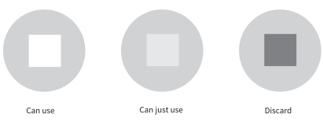

2
{:.chapter-number}

# Immunisation

## Objectives

When you have completed this chapter you should be able to:

*	Define immunisation.
*	Write the immunisation schedule.
*	Understand the advantages of immunisation.
*	List the contraindications and complications of immunisation.
*	Give immunisations safely.
*	Store vaccines safely in a clinic or hospital.

## Introduction

### 2-1 What is immunity?

Children may become infected with many bacteria or viruses, which can cause illness. Some of these organisms may also produce toxins, which can result in serious damage. Following most infections the body develops protection (resistance) against further infections by the same organism or against the toxins which these organisms produce. The body is now said to be immune to (protected against) that specific organism or toxin. This protection is called immunity. The body produces immunoglobulins (antibodies) and white cells to provide immunity (protection). Immunity can follow a natural infection or be induced by immunisation.

> Immunity is the protection which the body develops against further damage by an organism or toxin.

### 2-2 What is immunisation?

Immunisation is a method of artificially stimulating the immune system to provide protection against specific serious infections. This is done by giving a vaccine. A vaccine may be any one of the following:

*	A live, but specially weakened (attenuated), organism such as oral polio vaccine.
*	A dead organism such as intramuscular polio vaccine.
*	An inactivated substance (a toxoid) produced by an organism such as diphtheria vaccine.
*	Part of an organism such as hepatitis B vaccine.

> Immunisation is a method of preventing some serious infectious diseases.

Note
:	It is best not to use the word ‘vaccination’ as it means to immunise with vaccinia (cowpox) to protect against smallpox. However, the word vaccine is still used. Therefore, a vaccine is used to immunise an infant.

### 2-3 What are the advantages of immunisation?

Immunisation is strongly recommended as it can prevent many serious infections. The introduction of immunisation for all children has been one of the most important advances in modern medicine and saves the lives of millions of children throughout the world each year. It is far better to prevent an infectious illness than to treat the illness and its complications. Immunisation is therefore very cost effective. Immunisation has greatly reduced the mortality rate of children in many countries.

> Immunisation of young children is strongly recommended.

### 2-4 What immunisations should be given to young children?

All children should be routinely immunised against the following eight important infections:

1.	Tuberculosis
1.	Polio (poliomyelitis)
1.	Diphtheria
1.	Whooping cough (pertussis)
1.	Tetanus
1.	Hepatitis B
1.	Measles
1.	*Haemophilus influenzae*

In South Africa, children are immunised against these eight infections as part of the State immunisation programme. As a result, many of these infections (polio, diphtheria, tetanus, measles) have become uncommon. In future, additional immunisations are likely to be added.

Some additional immunisations may be given to specific children when indicated, e.g. viral influenza, polyvalent pneumococcal, meningoccal and yellow fever vaccine.

### 2-5 What is the expanded programme on immunisation

The Expanded Programme on Immunisation (EPI) of the World Health Organisation recommends that all children be immunised against these infections. It aims to provide free immunisation for children against the important childhood infections.

Note
:	EPI was started in 1974. It was called ‘expanded’ as measles and polio vaccines were added to BCG and DPT, and the number of children immunised in developing countries was greatly increased. The purpose of EPI is to prevent the childhood diseases for which vaccines exist, to provide high quality vaccines, and surveillance of these diseases.

### 2-6 How are immunisations given?

They may be given as drops by mouth, as with polio immunisation, or by intramuscular injection, as with hepatitis B. BCG immunisation is injected into the skin.

### 2-7 Which vaccines are used in South Africa?

*	BCG is used to immunise against tuberculosis, especially tuberculous meningitis and miliary tuberculosis in children, which are two of the most severe forms of tuberculosis.
*	A live polio virus vaccine is used to protect children against poliomyelitis, which is a viral infection that can cause permanent paralysis.
*	Diphtheria toxoid and tetanus toxoid are used to protect against the effects of diphtheria and tetanus infections. Diphtheria infection can cause airway obstruction and damage to the heart and nerves. Tetanus infection causes convulsions and muscle spasms.
*	Pertussis vaccine protects against the infection which causes whooping cough. It is usually given together with diphtheria and tetanus toxoid (DPT).
*	A live measles vaccine is used to protect children against measles.
*	Hepatitis B vaccine is used to protect against hepatitis B.
*	*Haemophilus influenzae* B vaccine (Hib), which is the latest vaccine to be added to the South African expanded programme on immunisation, protects against serious infections, such as meningitis, caused by *Haemophilus influenzae* type B.

Note
:	Some vaccines are alive (BCG, oral polio, measles) while others are dead (diphtheria, tetanus, pertussis, hepatitis B and Haemophilus influenza B). A toxoid is an inactivated toxin.

In future, MMR (measles, mumps and rubella) vaccine will replace measles immunisation alone, while hepatitis A, pneumococcal and chickenpox (varicella) immunisations should be added to the routine immunisations. Yellow fever immunisation is routinely given in countries where yellow fever occurs. New vaccines, such as the Rota virus vaccine, could be very important, but are expensive.

It is easier to give combined vaccines such as DPT plus Hib as less injections are needed. In future more combination vaccines will be used.

### 2-8 When should immunisations be given?

The recommended schedule for immunisation lists the age at which specific immunisations should be given. Some immunisations need only be given once while others have to be repeated a number of times.

The schedule for the immunisation of children in South Africa (Table 2.1) is as follows:

*	Polio 0 is the dose of polio vaccine at birth
*	DPT 1 is the first dose of DPT
*	Hepatitis B 2 is second dose of hepatitis B vaccine
*	Hib 3 is the third dose of Hib vaccine, etc.

The primary immunisations are given between birth and 9 months. The immunisations given at 18 months and 5 years (polio, measles, diphtheria and tetanus) are often called ‘boosters’ as they help to improve the immune response produced by the initial course of immunisation.

Table 2.1: The schedule for the immunisation of children in South Africa
{:.table-caption}

<table>
<thead>
  <tr>
    <td>
When
</td>
    <td>
Vaccines
</td>
  </tr>
</thead>
  <tr>
    <td>
At birth
</td>
    <td>
BCG

      
Oral polio 0 (OPV 0)
</td>
  </tr>
  <tr>
    <td>
At 6 weeks
</td>
    <td>
Oral polio 1 (OPV 1)

      
DPT 1 (diphtheria, pertussis, tetanus)

      
Hepatitis B 1

      
Hib 1
</td>
  </tr>
  <tr>
    <td>
At 10 weeks
</td>
    <td>
Oral polio 2 (OPV 2)

      
DPT 2

      
Hepatitis B 2

      
Hib 2
</td>
  </tr>
  <tr>
    <td>
At 14 weeks
</td>
    <td>
Oral polio 3 (OPV 3)

      
DPT 3

      
Hepatitis B 3

      
Hib 3
</td>
  </tr>
  <tr>
    <td>
At 9 months
</td>
    <td>
Measles 1
</td>
  </tr>
  <tr>
    <td>
At 18 months
</td>
    <td>
Oral polio 4 (OPV4)

      
DPT 4

      
Measles 2 or MMR (measles, mumps, rubella)
</td>
  </tr>
  <tr>
    <td>
At 5 years
</td>
    <td>
Oral polio 5 (OPV 5)

      
DT 5 (diphtheria, tetanus)
</td>
  </tr>
</table>

### 2-9 Why is it important to give immunisations at the recommended time?

1.	If an immunisation is given too early (e.g. if measles immunisation is given at 3 months), the infant may not develop the expected resistance to the illness due to the immune system still being too immature to respond fully.
1.	If an immunisation is given too late (e.g. not giving measles immunisation at 9 months), the infant may develop that illness before the immunisation can be given.
1.	If immunisations are given too soon after the previous immunisation (e.g. if DPT immunisations are given a week apart), the infant may not develop the expected resistance to the illness.

All the most important immunisations should be given by the time the child reaches 9 months of age.

> It is important to give immunisations at the recommended time according to the immunisation schedule.

### 2-10 What should be done if immunisations are missed or never started?

This depends on how old the child is and what immunisations have been missed.

If the immunisation schedule was not started when it should have been, immunisations can be started immediately with the normal time intervals between immunisations, e.g. the second DPT would follow 4 weeks after the first.

However, some immunisations may not be given as they are no longer needed or they are not safe in an older child:

*	Pertussis vaccine is not given after 18 months.
*	Hib and BCG are not given over 1 year.
*	Measles need not be repeated if it is given after 18 months.

If immunisations were started correctly, but later immunisations were missed, these can be given using the normal time intervals between immunisations. If the immunisation schedule is interrupted it need not be started again from the beginning.

### 2-11 Why are immunisations opportunities often missed?

Many opportunities to immunise children are missed. This is a serious mistake as the child may become ill, or even die, from a preventable disease. Children often visit doctors or attend clinics or hospitals without being immunised because of stock shortages, because the child’s immunisation status is not checked on the Card or because it is too much trouble to give the correct immunisations.

Whenever a child visits a doctor or clinic, the opportunity must be used to detect and give missing immunisations. In addition, a visit to a doctor or nurse often exposes an unimmunised child to other children with preventable infections such as measles. It is important to look at the infants immunisation record in the Road-to-Health Card at every visit to a clinic or hospital and to make sure that all the recommended immunisations have been given. Outstanding immunisations must be given immediately before the child goes home.

Opportunities for immunisation are also lost when health facilities do not offer immunisation services every day. Therefore, this essential service should be made available on a daily basis at all clinics and hospitals where children are managed.

> A child may develop a serious infection as the result of a missed immunisation.

### 2-12 How should immunisations be recorded?

It is very important that all immunisations are carefully recorded on the infant’s Road-to-Health Card. Both the type and the date of the immunisation must be recorded. It is an essential and important part of primary health care to record all immunisations carefully. Even though DPT and Hib are given as a single injection, they must be recorded separately on the card. The Road-to-Health Card is the official immunisation record needed for clinic visits, hospital admission and attendance at crèche and school.

### 2-13 What should be done if the Road-to-Health Card is lost?

All mothers have the right to carry a Road-to-Health Card. If the card is lost or destroyed, the mother should be given a new card, clearly marked as a duplicate. All available information must be entered. The mother should be asked whether the infant has been immunised and which immunisations have been given. If she can give a good account of her child’s immunisations or if they are recorded in the clinic records, these should be entered in the new card and do not need to be repeated. If she is uncertain of the child’s immunisation history, the missing immunisations should be repeated. It is not dangerous to repeat an immunisation, provided that the child is not too old.

### 2-14 Should infants born to HIV-positive women be immunised?

Yes. It is particularly important that these infants are immunised as they are at high risk of infections if they later develop AIDS. The immune system of infants born to HIV-positive women is usually normal in the first few months after delivery. This provides an opportunity for routine immunisations to be given, even to those children who have been exposed or infected with HIV. However, most infants born to HIV-positive women are not infected with HIV. All immunisations can be given according to the normal schedule to HIV-exposed infants provided they have no clinical signs of HIV infection.

### 2-15 Should infants with HIV infection be immunised?

Infants who are known to be infected with HIV but have no clinical signs of HIV infection (and a normal CD4 count) should be immunised. There is no danger giving them most live vaccines such as polio and measles as their immune system is still functioning normally. However, BCG should not be given.

In contrast, infants with clinical signs of HIV infection should not be given any live virus vaccines, such as BCG, oral polio and measles, but should receive the other routine immunisations. Giving BCG to infants with HIV infection may result in a generalised infection with BCG as their immune system is damaged and not able to control the spread of BCG. Children with AIDS on antiretroviral therapy my benefit from waiting until the CD4 count is normal before giving measles and OPV immunisations.

Note
:	 Infants with immunosuppression due to other causes, such as leukaemia or cytotoxic drugs or large doses of steroids should not be given live vaccines (e.g. polio and measles). They must be protected from exposure to these illnesses.

> Infants who are exposed to HIV but are otherwise well should receive routine immunisations.

### 2-16 Should malnourished infants be immunised?

Yes. Malnutrition (undernutrition) is not a contraindication to immunisation. Even children with severe malnutrition (kwashiorkor or marasmus) should be given the routine immunisations. Measles immunisation can be given when these children are admitted for care. The rest of the immunisation schedule must be started before discharge home. It is important to make sure that they will receive all the routine immunisations.

### 2-17 Should small or sick newborn infants be immunised?

Low birth weight (less than 2500 g) or sick newborn infants should be given BCG and polio vaccine when they are well enough to be discharged home from hospital. By this time some preterm infants may already be a few months old. After discharge they can follow the routine immunisation schedule. If a preterm infant is older than 6 weeks when it is discharged home, the routine 6 week immunisations can be given at discharge and then repeated at 4 week intervals. It is rare that preterm infants need immunisation before they are ready for discharge.

### 2-18 Should routine immunisations be given to a sick child?

There are very few general contraindications to immunisation. Infants with a skin rash or minor illness such as a ‘cold,’ cough or mild fever below 38 °C should be immunised. If the infant has diarrhoea when OPV is due, give OPV but ask the mother to bring the child back for an extra dose of polio drops when the infant is again well. Mark on the card that an extra dose of OPV is needed due to diarrhoea. It is important to immunise sick and malnourished children to protect them against these illnesses. If a child is not immunised because of a minor illness, they may not be brought back later and the opportunity to immunise is lost.

> Minor illnesses and malnutrition are not a contraindications to immunisation.

### 2-19 Can immunisations be safely given to an allergic child?

Yes. Allergic reactions to immunisations are rare, even in children with signs of allergy (e.g. eczema).

### 2-20 When are immunisations contraindicated?

There are very few contraindications to immunisations and serious thought must be given before deciding not to give a scheduled immunisation. Mild illness is not a contraindication. Neither is a skin rash or eczema. Antibiotics or allergic illnesses are also not contraindications. If an ill or malnourished child is well enough to go home, he/she can be immunised before going home.

> An infant who is well enough to go home is well enough to be immunised.

Contraindications are:

1.	A seriously ill child who needs hospitalisation can be given measles immunisation on admission. The other immunisations can be postponed and given when the child has recovered, but before discharge from hospital.
1.	Live viruses (polio, measles and BCG) should not be given in infants with clinical signs of HIV infection (or a low CD4 count). However, all scheduled immunisations can be given if the infant is HIV positive without signs of HIV infection (and a normal CD4 count).
1.	Live viruses should not be given to children with immunosuppression such as children with leukaemia or receiving cytotoxic drugs. Kwashiorkor, marasmus and low dose or inhaled steroid treatment are not contraindications.
1.	DPT vaccine should not be given to infants with:
	*	A high temperature (38 °C or above).
	*	Fits or collapse within 3 days of a previous DPT immunisation
	*	A serious progressive neurological abnormality such as repeated fits.

	In these situations DT should be used instead of DPT.

### 2-21 Is immunisation safe?

Yes. Serious complications of immunisation are rare. However, mild fever and irritability are common, especially 6 to 12 hours after DPT immunisation. A mild fever, irritability and slight rash are common about a week after measles and MMR immunisation. These mild side effects can be treated with paracetamol (Panado) 6 hourly for 4 doses if needed (2.5 ml if under 1 year and 5 ml if 1 to 5 years). The benefits of immunisation are far greater than the risks. Therefore, as many infants as possible should be fully immunised.

Note
:	 There is no evidence that immunisation increases the risk of cot death.

## BCG immunisation

### 2-22 What is BCG?

BCG (Bacille Calmette Guerin) is a freeze-dried, live but weakened (attenuated) form of Mycobacteria, the bacteria which causes tuberculosis (TB). BCG reduces the risk of TB meningitis and disseminated (miliary) TB in young children. Unfortunately it is less effective in preventing pulmonary TB, especially in malnourished children. It also gives less protection in adults.

Note
:	In South Africa the Danish strain of BCG is being used.

### 2-23 How should BCG be stored and mixed?

BCG vaccine should be stored in a refrigerator (fridge) between 2 and 8 °C and must not be frozen. Keep it and the diluent on the middle shelf. It must also be kept out of direct sunlight. To prepare the vaccine for administration the vial of diluent should be added to the vial of dried vaccine. Do not use alcohol or ether to clean the top of the vial as it may kill the BCG. After making up the vaccine it will last for 6 hours if kept in a refrigerator or cool box.

### 2-24 When should BCG be given?

BCG should be given to well infants at birth and on the day of discharge from hospital or clinic to infants who have been ill or are low birth weight. If there is any doubt about whether BCG was given after birth, it should be given at 6 weeks with the first polio, DPT and hepatitis B vaccines. BCG is not usually given to children older than 1 year.

### 2-25 How is BCG given?

BCG is given by intradermal injection on the right upper arm as follows:

1.	Inject 1 ml of diluent into the vial (brown) containing BCG. Gently turn the vial upside down at least five times until fully mixed. Do not shake.
1.	The reconstituted BCG vaccine can be stored up to 6 hours in a refrigerator between 2 and 8 °C.
1.	Draw up 0.05 ml of BCG vaccine in a sterile syringe (a special syringe to measure 0.05 ml accurately ). 
1.	Clean an area of skin over the right deltoid muscle (upper arm) with soap and water.
1.	Stretch the skin over the right deltoid muscle with your thumb and forefinger. Slowly insert the needle intradermally (bevel facing up). Insert the needle for less than 2 mm into the skin. The needle can be seen through the skin.
1.	Inject the 0.05 ml of vaccine. A weal (raised lump) indicates that the intradermal injection has been given successfully. The most common error is to inject under the skin when no weal will be seen. With no weal, start again at a different site and inject into the skin.

### 2-26 What are the side effects of BCG immunisation?

In the majority of infants a raised nodule develops at the site of the immunisation after 2 to 4 weeks. A small crust may develop or it may ulcerate. The nodule will heal by itself and no dressing should be applied. After 8 weeks the nodule starts to decrease in size and by 6 months a small flat scar will form. The lymph nodes in the axilla on that side may enlarge slightly, which is normal. BCG immunisation does not always leave a scar in an infant. It is not necessary to repeat the BCG immunisation if no scar is seen.

The most common side effects are local pain and ulceration at the site of the immunisation and enlarged lymph nodes in the axilla and sometimes the neck.

Serious side effects which require referral are very rare. They include:

*	An abscess may form at the site of the immunisation.
*	Axillary lymph nodes may enlarge rapidly to more than 3 cm.

Note
:	BCG lymphadenitis or local abscess must be reported to the local health authorities. Rarely suppurative adenitis may require needle drainage or a sinus may form. Antituberculous treatment is seldom needed (usually in immunocompromised children only).

### 2-27 What are the contraindications to BCG immunisation?

BCG can be given to HIV-exposed infants but not infants with HIV infection, especially if clinical signs of HIV infection are present. It is not used over one year of age.

## Polio immunisation

### 2-28 Which polio vaccine is used?

Both live, oral (Sabin) and killed, intramuscular (Salk) vaccines can be used to protect against polio. In South Africa the trivalent live oral polio vaccine is used. It has been weakened (attenuated) to give immunity (against all 3 strains of polio virus) without causing clinical infection. The killed vaccine is equally effective as the live vaccine. Only the oral vaccine is used in South Africa. It is hoped that universal immunisation will eradicate polio as has happened to smallpox.

Note
:	Live (oral) attenuated polio vaccine was introduced in 1962. It is excreted in the stool and can infect others asymptomatically and thereby boost the immunity of the whole community. It is best used in communities where wild polio virus may still occur. With the elimination of clinical polio, the inactivated (intramuscular) Salk vaccine can be used instead as part of a single combination vaccine (e.g. DPT/ Hib/ inactivated polio). The Salk vaccine avoids the rare cases of oral polio vaccine induced paralysis.

### 2-29 How should polio vaccine be stored?

Live polio vaccine must always be kept cold to avoid heat killing the virus. In a standard clinic or hospital refrigerator it should be stored at 2 to 8 °C. Direct sunlight kills the vaccine. Keep the vial of vaccine cool in a home refrigerator or cool bag while it is being used. It can be safely kept in this way for up to 30 days.

Note
:	Polio vaccine can be stored for years at –20 °C or for one year at –10 °C.

### 2-30 How is live polio vaccine given?

Two drops are given directly into the infant’s mouth from the plastic dropper bottle. If the drops are spat out or vomited the dose should be immediately repeated. It is not necessary to avoid either a bottle or breastfeed before or after giving the vaccine.

Note
:	Usually, the trivalent vaccine, which includes types 1, 2 and 3 polio virus is used. Live Sabin vaccine should not be given to immunosuppressed children, e.g. children with AIDS.

Usually, a single dose of polio vaccine is given at the same time as BCG after delivery and then a further 3 doses are given with DPT vaccine at 6, 10 and 14 weeks. Follow up doses (boosters) are given at 18 months and 5 years.

### 2-31 Should oral polio immunisation be given to a breastfeeding infant?

Breastfeeding is not a contraindication to immunisation. There is no need to avoid a breastfeed before or after giving oral polio immunisation.

> Breastfed infants can be given oral polio immunisations.

### 2-32 What are the contraindications to polio immunisation?

Only the killed (Salk) vaccine can safely be used in children with symptomatic HIV infection. However, the live vaccine is safe in infants who are HIV infected but well.

Polio vaccine can be given to children with diarrhoea and vomiting but an extra dose should later be given as the diarrhoea or vomiting may prevent successful immunisation.

Note
:	Very rarely (1 in 500 000), paralysis can follow use of oral Sabin polio vaccine. This does not occur with the killed Salk vaccine. All cases of acute flaccid paralysis must be notified to determine whether polio has been eradicated.

## Immunisation against diphtheria, pertussis and tetanus (DPT)

### 2-33 What is DPT vaccine?

It is a combined vaccine against diphtheria, pertussis and tetanus. Pertussis is another name for whooping cough. The vaccine contains both diphtheria and tetanus toxoids, as well as killed pertussis (whooping cough) bacteria.

Toxoids are inactivated toxins. Toxins are produced by the diphtheria and tetanus bacteria and cause most of the clinical signs in these infections. Toxoids stimulate the body to produce immunity to these toxins.

### 2-34 How should DPT vaccine be stored?

In a refrigerator or cold box at 2 to 8 °C. Do not freeze DPT vaccine as this damages the vaccine. Avoid direct sunlight as this may also damage the vaccine. It is best to keep DPT on the middle shelf of a fridge.

> Do not freeze DPT as this damages the vaccine.

### 2-35 How is DPT vaccine given?

1.	The 10 ml vial of DPT vaccine is ready to use. Shake the vial well and draw 0.5 ml of the vaccine into a syringe. Use a new 23 gauge needle for each child. Never use the same needle for more than one child.
1.	Clean an area over the skin on the outer  side of the left thigh (upper leg) with an alcohol swab (NOT buttocks).
1.	Inject 0.5 ml of the vaccine intramuscularly.

Three doses of DPT vaccine are given together with polio vaccine at 6, 10 and 14 weeks. A follow up (booster) dose is given with polio vaccine at 18 months.

### 2-36 What are the side effects of DPT immunisation?

*	Mild redness, tenderness and swelling at the site of the injection for a few days.
*	A mild fever and irritability for a few days is common.
*	Rarely serious side effects may occur to the pertussis vaccine.

> Minor side effects to DPT immunisation are common and are not a contraindication to further immunisations.

If infants are not fully immunised with DPT because of minor side effects, they may later develop diphtheria, whooping cough or tetanus which remain very serious illnesses.

The side effects can usually be managed with paracetamol 6 hourly for 2 days.

### 2-37 What are the possible serious reactions to pertussis immunisation?

Very rarely, fever above 40.5 °C, fits, collapse and shock, severe irritability with persistent crying and screaming attacks or drowsiness, confusion and brain damage (encephalopathy) may follow pertussis immunisation. The risk of fever and fits is one in a thousand infants immunised with pertussis vaccine while the risk of encephalopathy is one in a million. If a serious rection occurs, pertussis vaccine must not be given again.

A new, safer, cell-free pertussis vaccine, with fewer local and systemic side effects, is now available. However, parents have to pay for this as it is expensive.

Note
:	Fever above 40.5 °C within 2 days, fits within 3 days or encephalopathy within 7 days of DPT immunisation must be reported to the local health authorities.

### 2-38 When should pertussis vaccine not be given?

Pertussis immunisation should not be given to the following infants:

*	A progressive central nervous system disease such as uncontrolled epilepsy. Children with mental retardation or cerebral palsy can be given routine immunisations including DPT as these are not progressive condition.
*	Infants who have had a severe reaction or clinical signs of encephalopathy within 7 days of a previous DPT immunisation, e.g. persistent screaming, collapse, drowsiness, confusion, fits or a fever over 40.5 °C.
*	Usually, pertussis vaccine is not given to children over the age of 18 months as the risk of severe reactions to pertussis vaccine increases with age. These infants should be given DT vaccine instead.

Mild fever and redness with some pain is common with DPT immunisation and are not contraindications to future immunisations. A family history of convulsions is also not a contraindication. Neither are cerebral palsy and Down Syndrome.

> Pertussis vaccine should not be given if the child had a severe reaction to a previous DPT immunisation.

### 2-39 What is DT vaccine?

DT vaccine contains a reduced dose of tetanus and diphtheria vaccine and no pertussis vaccine. It is given together with polio vaccine at 5 years. The method of storing and giving DT vaccine is the same as that for DPT vaccine. The dose is 0.5 ml intramuscularly. Tetanus immunisation should also be given after an injury, especially if the wound is contaminated with soil. Usually, this is not needed if tetanus immunisation has been given within the past 5 years.

Note
:	It is important that all pregnant women have received tetanus immunisation as this protects newborn infants against neonatal tetanus. If not, they should be immunised during the pregnancy with pure tetanus toxoid (TT), 3 doses given one month apart. In areas where neonatal tetanus still occurs, women who have been previously immunised against tetanus should be given a single booster dose of tetanus vaccine during pregnancy. Tetanus immunisation is safe during pregnancy as it is a toxoid and not a live vaccine.

### 2-40 Why is pertussis vaccine not given after 18 months?

Because whooping cough is a far less serious illness in older children and the risk of side effects increases after 18 months.

## Measles immunisation

### 2-41 What measles vaccine is used?

Measles vaccine is a freeze-dried preparation of a weakened (attenuated) virus. Usually, the Schwartz strain of vaccine is used.

### 2-42 How should measles vaccine be stored?

As with BCG and polio vaccines, the storage of measles vaccine is very important. If incorrectly stored, these live vaccines are ineffective. The vials of measles vaccine and the diluent should be kept in a refrigerator or cool bag at 2 to 8 °C. Place the vaccine on the top shelf just under the freezer compartment. Do not expose to direct sunlight.

### 2-43 How is measles vaccine given?

1.	Add 5 ml of diluent to the 10 ml vial of the vaccine. Do not use alcohol or ether to clean the top of the vial as this may kill the virus. If kept cool and out of direct sunlight, the reconstituted vaccine will last up to 8 hours.
1.	Use a new syringe and new 23 gauge needle for each patient.
1.	Give 0.5 ml of the vaccine by intramuscular injection into outer side (lateral aspect) of the right thigh. Clean the skin with soap and water.
1.	Always discard any remaining vaccine at the end of the day. Do not keep vaccine overnight.

### 2-44 When should measles immunisation be given?

The first dose of measles vaccine is given at 9 months. This is followed by a second (booster) dose at 18 months.

Antibodies from the mother usually protect the infant against measles during the first few months of life. During this time measles vaccine is often ineffective as the vaccine virus may be killed by the maternal antibodies.

Unfortunately, infants often get infected with measles when they come into contact with other children at health clinics, out patient departments or in hospital wards. Any infant of 9 months or more who visits a clinic or hospital and does not have measles immunisation documented on their Road-to-Health Card should immediately be given a dose of measles vaccine.

Note
:	 During an epidemic of measles, if many young infants are contracting the infection, measles immunisation is sometimes given at 6 months and then repeated at 9 months to offer some protection to infants between 6 and 9 months. Measles immunisation is usually ineffective before 6 months.

### 2-45 What are the complications of measles immunisation?

A mild fever about 7 days after the immunisation occurs in up to 25% of children. Less commonly a faint rash may occur.

### 2-46 What are the contraindications to measles immunisation?

It should not be given to children with untreated tuberculosis. These children can receive measles immunisation once the TB treatment has been started. Mild fever, ‘colds’ or influenza, otitis media, bronchitis or diarrhoea are not contraindications to measles immunisation.

Note
:	 A previous anaphylactic reaction to measles or MMR immunisation may be due to egg allergy. This is a contraindication to further immunisation with measles or MMR vaccine.

### 2-47 What is MMR vaccine?

Often vaccines against measles, mumps and rubella are given together (MMR vaccine) at 18 months instead of measles vaccine alone. Although more expensive than measles vaccine, MMR offers important protection against meningitis, which may complicate mumps, and serious congenital abnormalities in the fetus, which may complicate maternal rubella during pregnancy.

Although not yet part of the EPI policy, children who received MMR at 18 months should be given a second dose of MMR  when they start school (however the parents will have to pay). MMR vaccine needs to be kept cold during storage in the same way as measles vaccine. The dose and method of administration is the same as measles vaccine.

Note
:	 Children who are immunised twice with MMR will have lifelong immunity against rubella and, thereby, avoid the risk of congenital rubella in their infants. Likewise, MMR gives protection against mumps, which avoids the risk of orchitis and resultant sterility in boys in later life.

## Immunisation against Hepatitis B 

### 2-48 What is hepatitis B ?

Acute infectious hepatitis (infection of the liver) is caused by a number of different viruses. The hepatitis B virus may cause a severe form of hepatitis, which can result in liver failure. This virus may also cause chronic liver infection resulting in cirrhosis or cancer of the liver years after the person becomes infected. Following hepatitis B the person may remain infectious for many years and spread the infection to their children and other family members (i.e. they are a hepatitis B virus ‘carrier’). Hepatitis B is common in poor countries. Although the vaccine is expensive, immunisation against hepatitis B is, therefore, important in developing countries.

Note
:	Hepatitis B immunisation has already resulted in a falling rate of liver cancer in some countries.

### 2-49 When and how is hepatitis B  vaccine given?

Hepatitis B vaccine (HepB) 0.5 ml is given by intramuscular injection into the right thigh in 3 doses at 6, 10 and 14 weeks at the same time as polio and DPT immunisations. HepB vaccine must be stored in a fridge.

### 2-50 What are the side effects of hepatitis B  vaccine?

These include mild fever, pain and local swelling but are very uncommon.

### 2-51 What is the management of an infant born to a mother who is infected with hepatitis B ?

People with either acute or chronic hepatitis B virus infection have pieces of viral protein, called hepatitis B surface antigen (HbSAg), circulating in their blood stream. These people often excrete the virus and may spread the infection to others. Infants are at high risk of infection during a vaginal delivery if the mother is excreting the virus. Therefore, infants born to women who have hepatitis B during pregnancy or are HbSAg positive (i.e. have a chronic viral infection) need special management at delivery to protect them against infection. These infants should receive 0.5 ml of hyperimmune hepatitis B immunoglobulin by intramuscular injection with 72 hours of delivery. They should also receive a dose of hepatitis B vaccine. This should be followed by the standard schedule of hepatitis B immunisation at 6, 10 and 14 weeks.

## Immunisation against *Haemophilus influenzae*

### 2-52 What is *Haemophilus influenzae*?

*Haemophilus influenzae* B (Hib) is a bacterium which can cause serious and often fatal infections in childhood, especially meningitis, pneumonia and epiglottitis (a severe infection of the throat and epiglottis which often obstructs the upper airway). Children under 2 years are most at risk.

### 2-53 What is Hib vaccine?

An effective vaccine against Haemophilus is now available (the Hib vaccine) and is part of the South African national immunisation schedule. Unfortunately it is expensive and, therefore, has still not been included into the immunisation schedules of some poor countries. In South Africa, DPT and Hib vaccines are available as a combined vaccine. Hib vaccine has few side effects.

### 2-54 How is Hib vaccine stored?

In a refrigerator at 2 to 8 °C. A cold box can be used to move vaccines to a clinic.

### 2-55 When and how is Hib vaccine given?

Hib vaccine 0.5 ml is given by intramuscular injection into the outer part of the left thigh in 3 doses 4 weeks apart. It is most convenient to give it together with polio and DPT vaccines at 6, 10 and 14 weeks. In South Africa it is combined with DPT and given as a single injection.

### 2-56 Which other immunisations are available?

Other immunisations are available but are not given routinely. For example, influenza vaccine should be offered to children with serious chronic lung diseases. Influenza vaccine must not be confused with Hib vaccine.

Note
:	 Pneumococcal, varicella (chicken pox) and hepatitis A vaccines may be included in the immunisation schedule in future. Yellow fever vaccine is needed for international travel while rabies vaccine is given to children exposed to a bite from a rabid animal. To protect children, who have been exposed to serious infections, specific immunoglobulin is sometimes used. For example, hyperimmune immunoglobulin can be offered to children exposed to hepatitis B virus. The use of immunoglobulin is not as effective as immunisation as the protection is short-lived.

### 2-57 Why is a booster dose of vaccine given?

Some vaccines (polio, DPT and measles) are repeated at 18 months as a follow up or booster immunisation. This makes sure that the body develops immunity against these important infections. At 5 years children are given a further booster dose of polio and DT (but not pertussis) before they start school.

### 2-58 Why are some immunisations given on the left and others on the right side of the body?

By convention, BCG is given into the skin over the right deltoid. This helps to find the scar.

DTP and Hib are given into the left thigh or into the left deltoid in older children. The vaccines can be combined and given together as they do not interfere with each others’ action.

Hepatitis B is given into the right thigh as it is best not given at the same site as Hib.

Measles is usually given into right thigh or right deltoid in older children.

New, special vaccines consisting of combi­nations DPT, Hib, HepB and killed polio can be given together. Single vaccines must not be combined in the same syringe (except DPT and Hib).

### 2-59 What equipment is used to give intramuscular immunisations?

Usually, a 1 ml syringe is used with a 23-gauge needle to give immunisations into the deltoid or thigh muscles. Injections are never given into the buttocks of infants. Never re-use syringes or needles.

### 2-60 What is ‘herd immunity’?

If enough children in a community are immunised against an infection, that infection will no longer be passed from one child to another. The few non-immunised children are then partially protected as they are unlikely to be exposed to that infection As a result, the whole community (herd) is protected against that infection (herd immunity). It is, therefore, of benefit to the whole community when a child is immunised. Due to the high immunisation rate, some infections such as smallpox have disappeared. The goal in South Africa is to have 90% of all children fully immunised.

### 2-61 Which infectious diseases in children are notifiable?

In South Africa all the childhood diseases, for which vaccines are routinely given, are notifiable. This helps to monitor the number of cases still occurring and also enables the health authorities to control any outbreaks with mass immunisation. This is particularly important for any case of suspected polio.

Cases of measles, polio, neonatal tetanus and diphtheria are now rare in South Africa while smallpox was eradicated worldwide in 1975.

### 2-62 What are mass immunisation campaigns?

These are arranged separately to the routine immunisations programme, and are once-off events to increase the number of immunised children in a region and, thereby, help to eradicate the disease. They are used in regions or whole countries where the immunisation rates are low and also to control unexpected outbreaks of one of the important infectious diseases. Mass immunisation campaigns have been very effective against measles and polio.

## Handling vaccines

### 2-63 What is important about storing and handling vaccines?

All live vaccines (BCG, polio, measles, MMR vaccines) must be kept correctly stored or they will be damaged. Sunlight, the incorrect temperature and antiseptics damage vaccines. In a clinic, all should be stored in a refrigerator between 2 and 8 °C (not in the freezer compartment) and kept in a cool bag during handling. Only polio vaccine can be safely kept frozen during storage for long periods. Freezing damages other vaccines. Live vaccines, which have been frozen in error, have a granular appearance with a deposit on standing, and must be discarded.

> Vaccines rapidly lose their effectiveness if they are not kept cold.

Avoid direct sunlight and do not use alcohol or ether to clean vials of live vaccines or the skin as this may kill the vaccine. If necessary, the skin can be cleaned with soap and water. Only draw up the vaccine into the syringe when you are ready to give it. The vaccines often come in brown vials to protect them from the light. All vaccines have an expiry date, and must not be used after the expiry date.

Polio vaccine has a heat sensitive spot on each vial. Normally the dot is white but it darkens if the vaccine is not kept cool correctly. If the dot is the colour of the surrounding circle, or darker, it is damaged and must not be used.

> 
> 
> Figure 2-1 Polio vaccine vial monitor
{:.figure}

### 2-64 What is ‘the cold chain’?

Not only do vaccines need to be kept cold during storage but they must also be kept cold during handling. When live vaccines are moved from the central cold store to a clinic or hospital they should be moved in a cool box. They should also be kept in a cool box in the clinic after the vial has been opened. Vaccines must be kept cool continuously at 2–8 °C.  Measles and MMR are commonly inactivated by not being kept cool continuously. From the time the vaccine is produced to the time it is given it must be kept cold. The chain of travel from factory to store to health clinic to patient is called the cold chain. If possible, vaccines should be kept in a separate vaccine fridge at the health facilities. There must be a temperature chart on the vaccine fridge and the fridge temperature should be recorded twice a day. Where gas fridges are used a spare gas tank must be at hand. The expiratory date on vaccines is only valid if they have been kept cool during transport and storage.

> Vaccines must be kept cool at all times.

### 2-65 What is the correct use of a vaccine fridge?

A dedicated fridge (the same type as that used in the home) with a freezer compartment and 3 shelves must be made available at every site where immunisations are given. The main section of the fridge must be kept at 2–8 °C while the freezer compartment will be below 0 °C. This fridge must be used for vaccines only. Medicines, drugs, formula feeds and food must not also be kept in the vaccine fridge as repeated opening and closing of the fridge door raises the fridge temperature and this may damage the vaccines.

The coolest part of the fridge that does not freeze is the top shelf (below the freezer compartment). This is the best place to store polio and measles vaccines. Other vaccines (BCG, Hib, DPT, DT, TT, HepB and diluents) are best stored on the middle shelf. A fridge thermometer must be kept on the middle shelf and the temperature measured and recorded daily. The thermostat of the fridge must be adjusted to keep the temperature between 2 and 8 °C. If the fridge is warmer or freezes, vaccines may be damaged.

Bottles of water should be stored on the bottom shelf as this helps to maintain the correct temperature in the fridge if there is a power failure. The freezer compartment can be used to freeze and store ice packs and ice cubes for use in cool boxes. The door must be kept closed at all times except when removing or replacing vaccines.

### 2-66 What is a cool box?

Keeping vaccines cold in rural regions and during transport is particularly difficult when a fridge is not available. Under these circumstances, a cool box is very useful. Usually, a cool box consists of a closable polystyrene container. Frozen ice packs (they should rattle when shaken) are placed inside the cool box on the bottom and sides as well as under the lid.

Measles and polio vaccines should be placed at the bottom where it is coldest. The other vaccines can then be placed above them. Vaccines must never be allowed to freeze. Keep the top firmly on to protect the vaccines from sunlight.

### 2-67 What is an opened multidose vial policy?

To make sure that vaccines remain effective with as little wastage as possible, a policy of managing opened vials is needed. Opened vials can be used to withdraw a number of doses if they are stored correctly.

Open vials of DPT, DT, TT, HepB and OPV may be stored for up to 1 month provided the expiry date is not past, cold chain conditions have been maintained, and aseptic technique is used to withdraw doses.

Open vials of combined DPT and Hib vaccine can be kept for 7 days if the above conditions are met and the vaccine vial monitor has not reached discard point.

Open vials of measles and BCG must not be kept for more than 6 hours.

All opened vials must be discarded immediately if the asceptic procedures have not been followed or there is any suspicion that the vial is contaminated (a change in the normal appearance of the vaccine).

*See the summary of the scheduled vaccines at the end of this chapter.*

## Case study 1

During a woman’s pregnancy, she and her husband ask the doctor whether it will be necessary for their infant to be immunised. They also want to know which immunisations are given straight after delivery and whether they would still be given if the infant were born prematurely and is breastfed.  The mother mentions that she had hepatitis years ago and is known to be hepatitis B positive.

### 1. Why should the infant receive routine immunisations?

It is very important that all infants be immunised unless there is a medical reason not to do so. Immunisation protects the infant against many dangerous infections. Immunising children also helps to decrease the spread of that infection in the community.

### 2. What immunisations are given after delivery?

It is routine to give BCG and polio drops in the first few days after delivery. These immunisations should be given before an infant is discharged from the hospital or clinic.

### 3. Are immunisations given to preterm infants?

It is very important to give all routine immunisations to preterm infants. Usually, the BCG and first polio immunisations are given when the infant is ready for discharge from hospital. After discharge the routine immunisation schedule is followed.

### 4. Should breastfed infants be given oral polio drops?

Yes. Breast milk does not inactivate the live polio virus in the oral drops.

### 5. Would loose stools be a contraindication to polio immunisation?

No. However, the drops should be given again when the infant is well.

### 6. What should be done, as the mother is hepatitis B-positive?

As there is a high risk that the infant will be infected with the hepatitis B virus at or soon after delivery, the infant must be given 0.5 ml of hyperimmune hepatitis B immunoglobulin by intramuscular injection within 72 hours after birth. In addition, the infant should be given a dose of hepatitis B vaccine after birth to be followed by the routine hepatitis B immunisations starting at 6 weeks.

## Case study 2

A mother who is known to be HIV-positive delivers a clinically well infant at term. The staff tells her that her infant should not be immunised as it may already be infected with HIV. This will make immunisation dangerous.

### 1. Should routine immunisations be given to infants born to HIV-positive mothers?

Yes. It is particularly important that these infants are immunised as they are at high risk of infections if they later develop AIDS. The immune system of infants born to HIV-positive women is usually normal in the first few months after delivery, which gives an opportunity to safely give the routine immunisations. Most infants born to HIV-positive mothers are not HIV infected themselves.

### 2. Should routine immunisations be given to healthy infants with HIV infection?

Yes. These infants without clinical signs of HIV infection still have an intact immune system and should be given routine immunisations except BCG.

### 3. Should infants with clinical signs of HIV infection be given routine immunisations?

As these infants have a damaged immune system, they should not be given live vaccines such as BCG, oral polio and measles.

### 4. What is the danger of giving BCG to an infant with symptomatic HIV infection?

As these infants have a damaged immune system, they may develop a generalised infection with BCG.

## Case study 3

A healthy 6-week-old infant is given her first DPT immunisation. The day after the immunisation the infant has a mild fever and is slightly irritable. She also has some pain and swelling at the site of the injection. The mother gives a history of febrile convulsions when she was a child. She also heard on the radio that DPT immunisation could cause mental retardation. Because of this mild reaction and the mother’s anxiety, the staff advises that no further DPT immunisations should be given.

### 1. What does DPT stand for?

Diphtheria, pertussis (whooping cough) and tetanus.

### 2. At which site should the DPT injection be given?

DPT should be given by intramuscular injection into the left thigh. In older children it can be given into the left deltoid muscle. *Never* give a child an injection into the buttock, because young children have little muscle over the buttock, and important nerves and blood vessels lie close under the skin and may be damaged.

### 3. Are side effects common after DPT immunisation?

Many infants have mild local tenderness and swelling at the site of the immunisation for a few days. Mild fever and some irritability are also common. If necessary the infant can be treated with paracetamol syrup 2.5 ml 6 hourly.

### 4. Can DPT cause dangerous complications?

Very rarely, DPT can cause a high fever (above 40 °C), severe irritability with screaming attacks, drowsiness, convulsions and mental retardation. The risk of severe complications is only 1 per million children.

### 5. Should the second dose of DPT be given if the infant has mild side effects after the first dose?

Yes. The second dose of DPT should be given at 10 weeks. If the infant has had a severe complication to the first dose of DPT, only DT should be given at 10 and 14 weeks and at 18 months.

### 6. Should DPT be given if the mother had febrile convulsions as a child?

It is important that DPT immunisation is still given. A family history of fits is not a contraindication to DPT immunisation.

### 7. Is it recommended that DPT be given routinely at 5 years?

No. At 5 years only DT should be given, as the chance of complications with pertussis vaccine is higher in older children (above 18 months).

## Case study 4

A week after the second routine immunisation with measles at 18 months, an infant develops a mild fever and a fine pink rash, which lasts for 2 days. As the infant had a slight cough at the time of the immunisation, the mother is worried that the fever and rash may be dangerous.

### 1. Is the mild fever and rash dangerous?

About 25% of infants develop a mild fever after measles immunisations. A rash is less common. Both are not dangerous and resolve in a few days.

### 2. What combined immunisation instead of measles alone can be given at 18 months?

Measles, mumps and rubella (MMR vaccine). MMR vaccine should be repeated at 5 years.

### 3. When should measles immunisation not be given?

Measles immunisation should be delayed in children with untreated tuberculosis. Malnourished infants can safely be given measles immunisations. This is particularly important, as measles can be a fatal infection in malnourished children.

### 4. Should the measles immunisation have been given to this infant with a mild cough?

A mild illness, such as loose stools, cold or cough, is not a contraindication to immunisation. Infants who are well enough to go home are well enough to be immunised.

### 5. Why is it important to record measles immunisation on the Road-to-Health Card?

It is very important to note all immunisations on the Road-to-Health Card, as this is the official record of the child’s immunisation status. This is needed when the child is taken to another clinic or hospital and when the child is admitted to a crèche or play school.

## Case study 5

A doctor notices that the fridge, which stores the vaccines in a clinic, is not working and that the vaccines are warm. He therefore cools the vaccines by placing them in the freezer compartment. He also notices that the expiratory date on some of the vaccines has been reached.

### 1. Does it matter if vaccines are not kept cool?

It is very important that all vaccines are kept cool, between 2 and 8 °C. Otherwise they will be damaged and possibly killed. The commonest cause of failure of immunisation to protect an infant is the incorrect storage of vaccine.

### 2. Is it dangerous to freeze vaccines?

With the exception of polio vaccine, freezing damages or kills vaccines. Exposure to sunlight also damages vaccines.

### 3. What should be done with the vaccines, which were allowed to warm and were then frozen?

They must be discarded. Vaccines should also be discarded if the expiratory date has been passed.

### 4. What is meant by the ‘cold chain’?

This is the method that keeps vaccines cold from the time of manufacture until they are given to the patient. The cold chain makes sure that the vaccines are not damaged by becoming warm. A vaccine, especially measles vaccine, may not be effective if the cold chain has been broken.

### 5. What can be done to keep vaccines cool if the clinic cannot afford a fridge?

A cool bag or cool box can be used to keep vaccines cool for a few hours. When used for an immunisation clinic, this is adequate.

## Immunisation references

Table 2-2: Summary of immunisations routinely used
{:.table-caption}

<table>
<thead>
  <tr>
    <td>
Vaccine
</td>
    <td>
Description
</td>
    <td>
Storage
</td>
    <td>
Administration
</td>
    <td>
Comment
</td>
  </tr>
</thead>
  <tr>
    <td>
BCG

      
Bacillus Calmette Guerin 
</td>
    <td>
Live attenuated

      
Mycobacterium
</td>
    <td>
2–8 °C

      
Store on middle shelf

      
Discard open vial after 6 hours
</td>
    <td>
0.05 ml intradermal 

      
Right upper arm
</td>
    <td>
Should not be given in children over 1 year. Do not give if symptomatic HIV. Small ulcer after a few weeks common
</td>
  </tr>
  <tr>
    <td>
DPT

      
Diphtheria Pertussis Tetanus
</td>
    <td>
D – toxoid

      
P – killed bacteria

      
T – toxoid
</td>
    <td>
2–8 °C

      
Store on middle shelf

      
Discard open vial after 30 days
</td>
    <td>
0.5 ml intramuscular

      
Left thigh up until 1 year

      
Left upper arm if over 1 year

      
 
      
</td>
    <td>
Mild fever, pain, local swelling common

      
Not used after 18 months
</td>
  </tr>
  <tr>
    <td>
DT

      
Diphtheria Tetanus
</td>
    <td>
D – toxoid

      
T – toxoid
</td>
    <td>
2–8 °C

      
Store on middle shelf

      
Discard open vial after 30 days
</td>
    <td>
0.5 ml intramuscular

      
Left thigh up till 1 year

      
Left upper arm if over 1 year

      
 
      
</td>
    <td>
Mild fever, pain, local swelling common
</td>
  </tr>
  <tr>
    <td>
HepB

      
Hepatitis B
</td>
    <td>
Part of the virus
</td>
    <td>
2–8 °C

      
Store on middle shelf

      
Discard open vial after 30 days
</td>
    <td>
0.5 ml intramuscular

      
Right thigh up until 1 year

      
Right upper arm if over 1 year

      
 
      
</td>
    <td>
Mild fever, pain and local swelling occasionally
</td>
  </tr>
  <tr>
    <td>
Hib

      
Haemophilus influenza B

      
 
      
</td>
    <td>
Part of the bacteria
</td>
    <td>
2–8 °C

      
Store on middle shelf

      
Discard open vial after 7 days
</td>
    <td>
0.5 ml intramuscular

      
Left thigh – usually as combined DPT Hib Vaccine

      
 
      
</td>
    <td>
Usually, no side effects
</td>
  </tr>
  <tr>
    <td>
Polio (OPV)

      
Oral Polio Vaccine
</td>
    <td>
Live attenuated virus
</td>
    <td>
2–8 °C

      
Store on top shelf

      
Can use if inner square lighter than outer circle

      
Discard open vial after 30 days
</td>
    <td>
Two drops by mouth

      
If vomited or spat out can repeat immediately

      
If diarrhoea repeat dose when diarrhoea settled

      
 
      
</td>
    <td>
Mild flu like illness or mild diarrhoea may occur
</td>
  </tr>
  <tr>
    <td>
Measles

      
Measles vaccine
</td>
    <td>
Live attenuated virus
</td>
    <td>
2–8 °C

      
Store on top shelf

      
Discard open vial after 6 hours
</td>
    <td>
0.5 ml intramuscular

      
Right thigh up until 1 year

      
Right upper arm if over 1 year
</td>
    <td>
Mild fever or transient red rash are not uncommon 6–11 days post immunisation

      
High fever is uncommon

      
Encephalitis is extremely rare
</td>
  </tr>
</table>

> 
> 
> Figure 2-2: Road-to-Health Card immunisation record
{:.figure}
