3
{:.chapter-number}

# Growth and development

Take the chapter test before and after you read this chapter.



## Objectives

When you have completed this chapter you should be able to:

*	Measure the size of a child to assess growth.
*	Know the value of growth monitoring.
*	Use centile charts and growth curves.
*	Understand different growth patterns.
*	Identify obese children.
*	Use the growth chart on the Road-to-Health Card.
*	Assess neurodevelopment.

## Introduction

### 3-1 What is growth?

Growth is the increase in body size over a period of time. In order to assess growth, some measure of body size has to be accurately measured on two or more occasions.

> Growth is the increase of body size over a period of time.

Growth is best assessed by determining the child’s:

*	Size compared to other children of the same age
*	Growth curve
*	Growth pattern

## Measuring body size

### 3-2 How is body size determined in children?

The following 3 measurements of body size are commonly used in children:

1.	Weight: This is the most commonly used measure of body size as it is easy and accurate to weigh a child.
1.	Height or length: This is a very useful measure of size, especially in older children. However, it is more difficult to measure accurately. Height is measured with the child standing. In infants the measurement is taken lying down and is then called length. A child’s length and height are the same.
1.	Head circumference: This is also a useful measure of size but must be measured correctly.

> Weight is the most common way of assessing body size in children.

### 3-3 How is weight measured?

Young children are weighed when lying on a scale. Wait until the child lies still before recording the weight to the nearest 10 g. Always weigh the child undressed or wearing only a vest. Always remove the nappy before weighing.

Older children are weighed standing up. Record the weight to the nearest 100 g (0.1 kg). Remove all the child’s clothes, except the underpants, before weighing.

Before weighing a child, always check that the scale reads zero. Scales should be calibrated weekly.

Note
:	When weighing an infant on a spring scale, or an older child on a bathroom scale, you are measuring weight. A balance scale measures mass. Both are equal and expressed in kilograms.

### 3-4 How are height and length measured?

Height must be measured with the child standing barefoot. Keep both heels on the floor with the child’s back pressed against a wall. The child should stretch as tall as possible with the arms kept at the side while looking straight ahead. Move a square block of wood or a book down against the wall until it touches the top of the child’s head. Then measure the distance from the floor to the block of wood, to the nearest 1 mm, to get the correct height. Ideally, a special measuring device should be used, with a fixed tape or ruler on the wall and a sliding head board.

Under 2 years: It is difficult to measure an infant’s standing height. Therefore, the lying length is measured. If possible, a measuring board should be used. The infant is laid down on his/her back with legs fully extended. One person holds the infant’s head against the top board while another person gently stretches the infant’s legs, keeping the knees flat and pressing the heels of the infant’s feet against the bottom board. Measuring the distance, to the nearest 1 mm, between the boards gives the length of the infant. It is inaccurate to simply measure length with a tape measure.

For convenience, height is used in this chapter. However, whatever is said about the height of older children, applies equally to the length of infants and young children.

### 3-5 How should head circumference be measured?

It can be difficult to the measure head circumference accurately. Use a measuring tape and record to the nearest 1 mm. Measure the largest circumference of the head (occipito-frontal circumference) with the tape across the forehead and then around to the back of the head (occiput).

### 3-6 How often should the size of children be measured?

Weight should be measured and recorded every month for the first year of life, as young children grow fast.

*	Children should be weighed every 6 months between 1 and 5 years.
*	Height should be measured every year.
*	Head circumference is not routinely measured unless there is a good reason.

In addition, a child’s weight should also be measured and recorded every time the child is seen at a clinic, hospital or by a general practitioner.

### 3-7 How is a child’s size used to assess growth?

The best method to assess growth is to measure the child’s size (e.g. weight) and then to repeat the measurements a few months later. The increase in size is due to growth. The greater the increase, the faster the child is growing. If there is no increase, the child is not growing. For this reason it is important to record a child’s size and plot the measurements on a growth chart at every clinic visit.

## The importance of growth monitoring

### 3-8 What is growth monitoring?

Growth monitoring is the regular measurement of a child’s size in order to document growth. The child’s size measurements must then be plotted on a growth chart. This is extremely important as it can detect early changes in a child’s growth. Both growing too slowly or too fast may indicate a nutritional or other health problem. Therefore, growth monitoring is an essential part of primary health care in children. Measuring a child’s size is of very little value unless it is used for growth monitoring.

> Growth monitoring is an essential part of primary health care in children.

### 3-9 What is the value of weight in growth monitoring?

Weight-for-age is usually used to monitor growth. It is particularly useful in small infants who normally gain weight fast. Normal weight gain suggests that the infant is healthy and growing normally. Failure to gain weight normally is often the earliest sign of illness or malnutrition (i.e. undernutrition). Therefore, a child’s weight should be measured at every clinic visit in order to monitor growth.

> Weight should be measured and plotted on a growth chart at every clinic visit.

### 3-10 What is the value of measuring height and head circumference?

These are also important measurements of growth. Height is the best method of measuring linear growth (stature) as height reflects growth over a longer period than does weight. Measuring height is therefore important in older children.

Head circumference can be used to assess brain growth in children under 2 years. During this period brain growth is fast and, therefore, head circumference increases rapidly. A small head (microcephaly) suggests a small brain, while a large head suggests hydrocephaly. Head circumference is less accurate in assessing brain growth over 2 years of age.

Therefore, measuring head circumference is most useful in young children, and height in older children.

If a child’s weight gain is normal, the height and head circumference is usually also normal. However, it is particularly important to measure height and head circumference in children who are not gaining weight normally.

> Height is an important measure of growth, especially in older children.

### 3-11 Can an infant’s growth be determined at a single clinic visit?

No, as the definition of growth is a change in body size over a period of time. Therefore, some other form of assessment of growth is needed when you cannot wait a few weeks or months to decide whether the child is growing normally or not. An assessment of growth can be made if the size of a child is compared to the size of other children of the same age. In order to do this, the normal (i.e. average size) range of children of that age is needed. If the child’s size is the same as most other children of the same age, then the child is probably growing normally. The most commonly used growth charts are centile charts.

> An assessment of growth can be made by comparing a child’s size to that of other children of the same age.

## Centile charts

### 3-12 What is a centile chart?

A centile chart is a size for age chart that is used to decide whether the size of a child falls within the normal (average) range or whether the child is larger or smaller than normal. The size of a healthy child will increase normally with age. Without knowing a child’s age, one cannot decide whether the size is normal or not. Therefore, accurate ages are needed when using a centile chart.

A centile chart is based on the size measurements of thousands of healthy children recorded at different ages. A centile chart is made up of lines called centiles.

> The growth of healthy children usually follows the centile lines.

Note
:	With increasing age, the centiles move further and further apart, as some normal children grow faster and others slower than the average. As a result, the normal range becomes wider. Boys are slightly larger than girls. However, the same charts are often used for both boys and girls when routinely plotting size-for-age.

### 3-13 What are the important centiles on a centile chart?

Most centile charts have 7 centile lines on them, i.e. the 3rd, 10th, 25th, 50th, 75th, 90th and 97th centiles. Ninety seven percent of healthy children will fall below the 97th centile. Similarly 50% of healthy children will fall below the 50th centile and 3% below the 3rd centile. Therefore, each centile indicates what percentage of healthy children should have a size that falls below that line. This method enables one to compare the size of any child with the expected size of children of the same age.

Note
:	If 100 healthy children of the same age were lined up from the tallest to the shortest, the height of the tallest child would be the 100th centile, that of the second tallest the 99th centile, and so on. The height of the child at the centre of the row would be the 50th centile. It is called a centile chart as it reflects the relative size of 100 normal children, and ‘centum’ is the Latin word for a hundred. International centile charts are used in all countries.

### 3-14 What is the normal size for children of a given age?

The size of most children (94%) falls between the 3rd and the 97th centiles. These children are regarded as having a normal (average or appropriate) size for their age and are growing well. Centile charts, therefore, indicate the range of normal growth.

> The range of size between the 97th and 3rd centiles is regarded as normal.

Note
:	The size range for older children is different to that in newborn infants when the 10th and 90th centiles are used to define appropriate size for gestational age.

### 3-15 What size measurements are usually plotted on a centile chart?

Weight, height (or length), head circumference and weight-for-height can all be plotted on a centile chart. Weight is the measurement most commonly plotted on a centile chart.

*International centile charts are shown at the end of this chapter.*

### 3-16 When is a child larger than normal?

When the infant’s size measurement falls above the 97th centile. Children are heavier than normal if their weight is above the 97th centile. Similarly, they are taller (longer) than normal if their height (length) falls above the 97th centile. They have bigger heads than normal if their head circumference falls above the 97th centile.

### 3-17 When is a child smaller than normal?

When the infant’s size measurement falls below the 3rd centile. Children are underweight if their weight is below the 3rd centile. Similarly,children are shorter than normal if their height (length) falls below the 3rd centile. They have smaller heads than normal if their head circumference falls below the 3rd centile.

Note
:	3% of normal children fall above the 97th centile and 3% below the 3rd centile. Therefore, the size of 6% of children falls outside the normal (i.e. average) range, i.e. above the 97th or below the 3rd centiles. Note that ‘normal’ refers to the average range of size for age. Therefore, some perfectly healthy children might fall outside the 3rd and 97th centiles.

Recently Z-scores (standard deviations from the mean) have also been used to assess a child’s size. A Z-score of –2 is equivalent to the 3rd centile.

### 3-18 How should you plot a child’s weight on a centile chart?

1.	Make a mark along the bottom of the chart opposite the age of the child. Now draw an imaginary vertical line up from the mark.
1.	Similarly, make a mark opposite the child’s weight along the left or right hand side of the chart. Now draw an imaginary horizontal line from that mark.
1.	Make a dot at the point on the chart where the two imaginary lines meet. This is called plotting the weight. It will give the child’s weight for its age.

The same method is used to plot the infant’s height (or length) and head circumference on centile charts.

At the first visit it is helpful to fill in the calendar months along the bottom of the centile chart, starting with the month in which the child was born. This is done so that further growth is easily plotted.

> 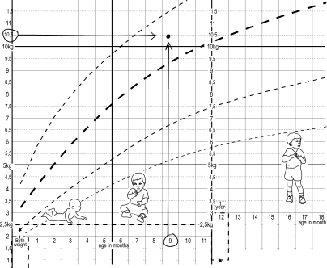
> 
> Figure 3-1: Plotting a child’s weight on a centile chart
{:.figure}

### 3-19 Can length and height both be plotted on the same chart?

Yes. As a child gets older height can be plotted on the chart used before to plot length. For practical purposes, the measurement of length is the same as height.

### 3-20 What is the value of knowing a child’s weight-for-height?

The weight-for-height gives an idea of how fat or thin a child is. Thin children have a low weight for their height while fat children have a high weight-for-height. Often the body mass index (weight in kg divided by height in metres) is used to determine fatness or thinness.

## Growth curves

### 3-21 What is a growth curve?

A growth curve (or growth line) illustrates the way a child is growing over a period of time. A growth curve can be determined when a child’s size measurements have been made on two or more visits and have been plotted as dots on a centile chart. If these dots are now joined together with a line, you will have a growth curve. Therefore, the best way to assess growth is to look at the growth curve over the past few months and compare the growth curve to the centiles.

> A growth curve is a line linking size measurements recorded over time.

> 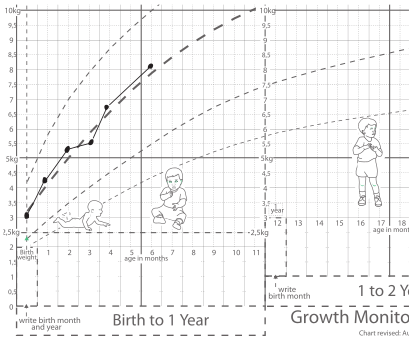
> 
> Figure 3-2: A normal growth curve plotted on a centile chart
{:.figure}

### 3-22 What is the value of a growth curve?

A growth curve shows not only whether the child’s size is normal or not, but also whether the child is growing normally, faster or slower than expected. Therefore, a growth curve is a far better method of assessing growth than using size measurements taken on one occasion only as it reflects the child’s growth rate.

> A growth curve indicates the child’s growth rate.

### 3-23 What is the normal growth rate?

If the child’s growth rate is normal, the growth curve will closely follow along (be parallel to) the centile lines and not cross more than one centile.

A normal growth curve is plotted in Figure 3.2.

> A normal growth curve follows the centile lines.

Note
:	Special growth rate charts can be used to determine accurately whether a child’s growth rate is normal or not. These charts are useful during the growth spurt of puberty.

### 3-24 How fast should most children grow?

Most children double their weight from birth to 6 months and treble (increase by three times) their birth weight by one year. The increase in weight and height is fastest in the first year of life and then slows down until puberty when growth is again fast for a short while. Growth in head size is almost complete by 2 years.

Note
:	Only when a child reaches 4 years is the birth length doubled. Thereafter the normal increase in height during childhood is approximately 4 cm per year.

### 3-25 Is weight or height the better measure of growth?

In younger children, weight is the most sensitive index of growth and poor weight gain is usually the first sign of malnutrition. In older children, height is the better index of growth.

> Height is the best index of growth in older children.

### 3-26 Is it important if a child is heavier than normal?

Some children who are heavier than normal are perfectly healthy. They are simply bigger for their age than most children. Other children are heavier than normal because they are obese (too fat).

### 3-27 Is it important if a child is lighter than normal?

This is a very important observation. Some children who weigh less than normal are healthy and simply smaller for their age than most children. However, in a poor community, most children who weigh less than normal are malnourished (undernourished) or have an illness.

### 3-28 What should you do if a child is heavier or lighter than normal?

Determine the child’s growth pattern.

## Growth patterns

### 3-29 What is a growth pattern?

The position of the child’s weight, height, head circumference on the centile lines, and the growth curves for all these measurements, determines the child’s growth pattern. Therefore, more than one measurement of size (e.g. weight and height) is needed to establish the growth pattern.

Most normal healthy children have a weight, height and head circumference within the normal range and the growth curves for all these measurements are normal. Therefore, all measurements of size fall between the 97th and 3rd centiles and the growth curves have followed and not crossed more than one centile. This is the most common growth pattern.

### 3-30 What other growth patterns are common? 

*	Large-for-age
*	Overweight-for-age
*	Wasted
*	Growth faltering
*	Stunted

These growth patterns indicate that the child may have a medical, nutritional or social problem. It is, therefore, very important that all children who do not have a normal growth pattern are identified as soon as possible in order that they can be carefully examined. Some of these children will be healthy even if their growth pattern differs from the average.

> It is important to identify children who have a growth pattern that differs from the average growth pattern.

### 3-31 How can you recognise a large-for-age child?

These children appear healthy but are symmetrically large. Their weight, height and head circumference are all equally above the 97th centile. Their growth curves run parallel above the 97th centile. Most of these children have tall parents and are genetically large. Some may have been large at birth with a high birth weight. They are normal on general examination and can be managed as normal children. They often have an earlier puberty than most children.

### 3-32 Which children weigh too much?

These children can often be recognised by simple inspection. Their weight falls above the 97th centile (overweight-for-age) while their height and head circumference usually fall in the normal range. Their growth curve for weight often shows a weight gain faster than normal. They are too fat.

A weight above the 97th centile with a height below the 50th centile suggests a hormonal problem, which needs to be investigated.

Note
:	Some children grow faster than normal and their size measurements cross centiles. This growth pattern is seen normally at puberty and in some children after an illness or period of malnutrition (catch up growth). Rapid gain in weight only is also seen with obesity, some endocrine disorders and generalized oedema.

### 3-33 What is a wasted child?

Wasting is a danger sign and suggests malnutrition or illness. These children usually look very thin and have a weight that falls below the 3rd centile while their height and head circumference often fall within the normal range. These children also have a body mass index below the 3rd centile, i.e. they are underweight for their height. Special weight for height charts are available. Their growth curve may show weight faltering.

Note
:	Mid-arm circumference and triceps skin-fold thickness can also be measured and plotted on centiles to identify thin children and fat children. Special arm tapes are used to detect wasted children. Abdominal circumference is another measure that can be used to detect fatness in children.

### 3-34 What is growth faltering?

Infants with growth faltering (failure to thrive or slow growth) have not been gaining weight normally. Their weight may be static (remaining the same) or may even be dropping. Their height and head circumference may also not be increasing normally. This is a very important growth pattern to recognise as most of these children have a medical, nutritional or social problem, which needs to be urgently diagnosed and managed. Faltering weight gain must be detected as soon as possible so that the cause can be corrected. Growth faltering may be the first sign of HIV infection.

> Slow growth or growth faltering are important signs that the child may be ill or not getting enough food.

> 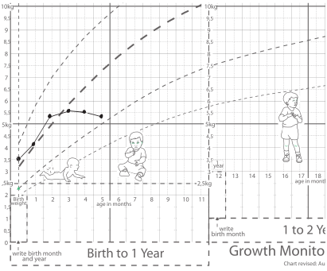
> 
> Figure 3-3: A growth-faltering curve plotted on a centile chart
{:.figure}

### 3-35 How can you recognise stunting?

Stunted children are shorter than normal for their age. As they are often symmetrically small and do not look thin, their stunting is often missed. Usually their growth curves have followed the centiles although their weight, height and head circumference all fall below the 3rd centile. Stunting usually occurs before 3 years of life.

> It is very important to identify all children with a height below the 3rd centile.

Note
:	Children who are symmetrically small (stunted) often have a normal growth rate. They are simply growing parallel to, but below, the 3rd centile.

The most common cause of stunting is chronic malnutrition during the first years of life. However, some healthy short children are genetically small, and look like their parents. Being born very pre-term or growth-restricted can also result in stunting. Some important medical disorders, such as Foetal Alcohol Syndrome, can cause stunting.

> The most common cause of stunting is chronic malnutrition.

### 3-36 What is the long term effect of stunting?

Short children usually become short adults as catch-up growth is difficult to achieve. Severe stunting due to malnutrition before 2 years of age is associated with schooling difficulties later.

### 3-37 What is the common growth pattern in poor communities?

A very common pattern of growth in poor communities throughout the world is normal weight gain for the first 6 months while the infant is being breastfed. Then, between 6 months and a year, there is faltering of both weight and length as the child receives inadequate food. By a year the child is stunted, with a weight and length below the 3rd centile. After a year, the weight may slowly increase to slightly above the 3rd centile but height remains below the 3rd centile. This pattern of low weight and height often continues into adulthood and reflects chronic malnutrition.

### 3-38 When does the puberty growth spurt occur?

Puberty is a time of rapid growth. It occurs earlier in girls than in boys. Puberty also occurs earlier in well-nourished children than in malnourished (undernourished) children. The puberty growth spurt usually lasts 2 years, starting at about 11 years in girls and 13 years in boys.

### 3-39 What is the effect of emotion on growth?

Love and emotional security are needed for normal growth. Stressed and emotionally deprived children grow slower that normal and may become stunted.

Note
:	Growth hormone is not secreted normally in emotionally deprived children. This has been well-documented in some children in orphanages.

## Overweight and obesity

### 3-40 How do you decide whether a child is overweight?

It is better not to use weight alone to decide whether a child is overweight as some children are heavy because they are simply big while others are heavy because they are fat. Usually the body mass index for age (i.e. weight in kg/height in m²) is used to decide whether a child is overweight due to excess fat. Special charts are used to define the normal body mass index for age. A body mass index for age between the 5th and 85th centiles is usually regarded as normal.

Note
:	Even body mass index cannot always differentiate between obesity and a high lean mass.

### 3-41 When is a child overweight?

Children are usually considered overweight if their body mass index is between the 85th and 97th centile. These children also look fat. A child is not considered overweight if the weight for age is above the 97th centile but the body mass index is normal. These children are simply big for their age.

Note
:	The definition of overweight remains very controversial and a number of different definitions are used. Overweight (which refers to the BMI) must not be confused with overweight-for-age.

### 3-42 What is obesity?

There is still no internationally accepted method of defining obesity in childhood. However, the clinical diagnosis can usually be made on simple inspection of the child as these children appear very fat. A body mass index for age above the 97th centile is regarded as obesity in older children and adolescents.

> The diagnosis of obesity can usually be made by simple inspection.

Note
:	A high skin-fold thickness can also be used to define obesity. Waist circumference may also be useful. Short, fat children need investigation for endocrine abnormalities.

Obesity is a common childhood problem in affluent countries and over the past 20 years has reached epidemic proportions in some communities, especially with girls. Obese children have excessive fat stores due to a high energy intake and inadequate exercise. The cause is almost always due to the child’s lifestyle. Fast foods, soft (fizzy) drinks and hours of watching TV each day are associated with obesity, as is rapid weight gain in infancy. Genetic factors are not as important as diet. However, many obese children have obese parents. Obese children have difficulty with sports and often have emotional problems due to a poor body image and lack of self confidence. They are miserable and unhappy with their weight and shape. Obese children, and especially obese adolescents, are at increased risk of growing up to be obese adults with a high risk of chronic illnesses in adulthood (hypertension, type II diabetes and heart disease).

> Childhood obesity is a major problem in wealthy countries.

### 3-43 How do you manage childhood obesity?

This is very difficult and often not successful. Management consists of a low-calorie diet, increased exercise and family therapy. The whole family needs to be educated about healthy eating and lifestyle behaviour. The goal is to lose weight and then maintain a normal weight. A motivated child and parents are essential if the management is to be successful. The help of a dietician is valuable in drawing up a balanced diet that is practical, affordable and not too high in energy. Bad eating habits of the whole community should be addressed. Soft drinks and refined foods should be avoided and time watching TV limited Emotional support and psychological counseling are often needed. Good eating habits for the family should prevent obesity.

## The Road-to-Health Card

### 3-44 What is the Road-to-Health Card?

The patient-held Road-to-Health Card is the child’s formal medical record. It gives the child’s medical history, immunisation record, developmental milestones and growth record. Growth is plotted on a weight-for-age chart (growth chart) which is part of the Road-to-Health Card.

*A blank Road-to-Health Card growth chart is given at the end of this chapter.*

> The Road-to-Health Card is an essential part of good primary care.

### 3-45 What is the importance of the growth chart?

The weight-for-age chart is an essential part of the Road-to-Health Card. The area between the 3rd and 97th centiles is shaded in. It is important that the infant’s weight remains within this shaded area and increases parallel to the centiles. If the infant’s weight keeps within this normal weight-for-age range, it is following the ‘road to health’ along which the child should steadily walk. Normal growth suggests good nutrition.

Monitoring weight gain or loss on the Road-to-Health Card is one of the most important methods of identifying children at risk of malnutrition. This is a major part of primary health care. It is important that each mother understands and takes an interest in her child’s Road-to-Health Card.

> The growth chart is an extremely important method of screening children for malnutrition.

### 3-46 When should the Road-to-Health Card be used?

It is important that the Road-to-Health Card be presented by the mother every time the child attends a clinic or hospital or visits a private doctor. Each child must be weighed at every visit and the weight must be plotted accurately on the card. The pattern of weight gain must always be examined and the growth curve explained to the mother or caregiver. The type of feeding should be recorded on the card. If necessary, counseling or advice on feeding must be given. There is important information about the child on the card and this must be updated at each clinic visit.

### 3-47 What is growth promotion?

Once the child’s growth has been assessed, advice and counseling should be given to the mother to promote normal growth and nutrition. It is of little value to assess growth without taking active steps to promote good growth.

### 3-48 When and where should children with growth problems be referred?

If failure to gain weight adequately does not respond to management at a primary care clinic, the child must be referred for further assessment and management. This is particularly important in children with a weight that falls or crosses centiles.

Usually these children are referred to a special nutritional clinic where the following steps should be followed:

1.	Exclude any chronic illness such as tuberculosis or HIV infection.
1.	A dietician or nutritional counselor should educate the mother or caregiver.
1.	A social worker should interview the mother or caregiver and assist where help is needed.
1.	If the child is still not improving, refer to a paediatrician.

Note
:	Important medical problems such as mal­absorption, hypothyroidism, diabetes, urinary tract infection and chronic heart disease must be excluded.

## Neurodevelopment

### 3-48 What is neurodevelopment?

Neurodevelopment is the progressive, orderly change of behaviour and activities which are seen as a children becomes older. Their physical ability and understanding of the world around them increases and matures with age. A healthy neurological system and a safe, stimulating environment is needed for normal neurodevelopment, as is normal hearing and vision.

### 3-49 How is neurodevelopment monitored?

Developmental milestones are used to monitor neurodevelopment in childhood. These are easily observable developmental achievements such as smiling, sitting and walking. Milestones are assessed by both history and examination. The neurodevelopmental monitoring of milestones must be part of the routine growth and developmental screening of all children.

> Milestones are used to assess neurodevelopment in childhood.

Note
:	The formal assessment of neurodevelopment is often divided into:

	*	Gross motor development (locomotion)
	*	Fine motor development (manipulation of objects)
	*	Language and communication (using sounds and words)
	*	Personal and social development (relating to family and society)

### 3-50 What are normal milestones?

Neurodevelopmental milestones are largely predictable as children get older although there is a range between different normal children. Delayed milestones are warning signs that neurodevelopment may be abnormal. Children with delayed milestones should be referred for formal neurodevelopmental assessment.

The following milestones should be achieved:

1.	Smile at mother: 8 weeks
1.	Good head control: 6 months
1.	Sit unsupported: 9 months
1.	Crawl well: 12 months
1.	Make babbling noises (‘baby sounds’): 12 months
1.	Stand without help: 15 months
1.	Walk without help: 18 months
1.	Understand simple commands: 24 months
1.	Use one or two words: 36 months

Normally developing children should reach these milestones before (often long before) these cut-off ages.

Note
:	A number of formal screening tools are used to monitor neurodevelopment. The Denver Developmental Screening Test is commonly used in children from birth to 6 years of age. Language and cognitive development is often screened at school, e.g. ‘IQ’ testing.

## Sexual development

### 3-51 What is puberty?

Puberty is the time when the physical signs of sexual maturity (secondary sexual characteristics) appear due to the secretion of sex hormones in older children. Puberty is earlier in girls (8 to 13 years) than boys (10 to 15 years). The timing of puberty has become progressively earlier over the past 100 years. A marked growth spurt occurs during puberty. There are also many emotional and social changes.

Puberty may occur too early (precocious puberty) or too late (delayed puberty). Both may be due to endocrine disorders. Therefore, these children must be referred for a specialist opinion. Precocious puberty is more common in girls.

### 3-52 What are the physical changes during puberty?

These can be formally graded into 5 stages (from pre-puberty to full sexual development). Genital development (appearance of penis, testes and scrotum) and pubic hair are scored in boys while breast development and pubic hair are scored in girls. Menstruation in girls starts towards the end of puberty when the growth spurt is almost complete.

Note
:	These are the stages described by Tanner.

## Case study 1

A 12-week-old infant is seen at a routine visit for immunisation. The infant’s weight is measured and found to fall below the 3rd centile. The birth weight was normal (3000 g) at term. The child appears well. The mother has stopped breastfeeding.

### 1. What does this child’s weight at 6 weeks suggest?

This child is not thriving, either due to inadequate feeds or illness. The problem is probably that the mother has stopped breastfeeding. She needs nutritional advice and the infant must be closely followed up.

### 2. What is the value of using a weight-for-age chart to assess a child’s weight?

Plotting weight for age on a Road-to-Health Card is an excellent way of deciding whether an infant’s weight falls within the average range. It is only of limited value knowing the weight if it is not compared to the weight of other healthy children of the same age.

### 3. What does the 3rd centile mean?

It means that only 3% of healthy children of that age will weigh less. The 3rd centile is usually used as the bottom of the normal range.

### 4. What is a growth curve?

A growth curve is obtained by joining measurements plotted on a centile chart (growth chart) over a period of time. Knowing this child’s weight at birth and at 6 weeks allows you to draw a growth curve. His growth curve will be falling rather than following parallel to the centile lines. This indicates that the child is not thriving.

### 5. What other measurement could be recorded?

It would be useful to measure and plot the circumference of the child’s head on a centile chart to see if the head size is still in the normal range.

### 6. When does a child weigh more than normal?

When the weight falls above the 97th centile.

## Case study 2

A 4-year-old child gained weight normally until a few months ago when she had measles. Since then her weight has dropped from the 50th to the 10th centile. The mother is concerned that she has almost dropped off the road to health (i.e. no longer following the centile line).

### 1. Is the mother correct to be worried?

Yes. This pattern of weight loss (growth faltering) suggests that there is a medical problem. The child may have a complication of measles such as diarrhoea or tuberculosis.

### 2. What is the value of monitoring growth?

This child is a very good example of how valuable routine growth monitoring is to identify problems. The cause of her weight loss can now be investigated and corrected before her weight drops below the normal range.

### 3. How often should a child’s weight be routinely measured to monitor growth?

Monthly, until the child is 1-year-old, and then every 6 months until they are 5. Weight should also be monitored at every visit to the clinic, hospital or general practitioner.

### 4. How valuable is height for monitoring growth?

Height is a good measure of growth over a long period of time. Therefore, height should be measured every year from 1 year. Length (usually measured while the child is under 1 year) and head circumference are not routinely measured unless there is a good indication. Weight is the best measure of growth over a short period such as the time between visits to the clinic.

### 5. How can you detect wasting?

A wasted child is very thin. Weight usually falls well below the height on the centiles. The body mass index will also be low. Wasting is an important sign of malnutrition due to starvation or illness. These children usually have lost a lot of weight recently. This needs urgent investigation.

## Case study 3

A 5-year-old child is examined at a preschool. Both her weight and height fall equally below the 3rd centile. She does not appear to be thin and looks generally well. She has attended the local clinic regularly and her size has been well documented as following the centiles on her Road-to-Health Card since birth. At birth she weighed 2000 g at term.

### 1. What is the growth pattern of his child?

This child is stunted. Plotting her weight and height for age shows that she is symmetrically small as both weight and height are equally low on the centiles.

### 2. What is the common cause of this growth pattern?

Usually chronic malnutrition (undernutrition) is the cause of slow growth in poor communities. However the size of this child has followed the centiles from birth. She was underweight for her gestational age at birth. This is the probable cause of her stunting. Always examine the child well as she may have a medical cause of slow growth, such as Foetal Alcohol Syndrome.

### 3. How should she be managed?

Her mother should be given dietary advice and reassured. It would be important to follow this child’s growth. 

### 4. What are the effects of emotion on growth?

Emotional stress and insecurity prevent normal growth. Therefore stunting can also be the result of emotional as well as nutritional deprivation.

### 5. Can poor growth affect the timing of puberty?

Yes. Puberty occurs earlier in well nourished children than children who are growing slowly because of malnutrition.

## Case study 4

A mother is worried that her daughter is overweight. Her weight falls above the 97th centile while her height is on the 75th centile. The mother also looks overweight.

### 1. Can you use weight for age to tell if a child is too fat?

Any child with a weight above the 97th centile weighs more than normal. However, if her height is similarly over the 97th centile, she is probably just a big child for her age. Therefore, a high weight for age alone does necessarily mean the child is too fat.

### 2. Which children are overweight?

The term ‘overweight’ is used to mean that the child is too fat. As this child is very heavy for her age with a normal height, she probably is overweight.

### 3. How can you confirm that this child is overweight?

Her weight and height should be used to calculate the body mass index for age (weight/height²).

The definition of overweight is a body mass index between the 85th and 95th centile, while obese children have a body mass index above the 97th centile.

### 4. Is being overweight an inherited problem?

Overweight children often have overweight parents. While genetic factors are important, most overweight children eat too much and have too little exercise.

### 5. What are the complications of being overweight or obese?

Overweight and obese children often have difficulty with sports and may have emotional problems due to a poor body image. Obese children often grow up to be obese adults with an increased risk of hypertension, diabetes and heart disease.

### 6. How should overweight children be managed?

It is difficult to get an overweight child to lose weight. The whole family has to be educated and involved in a weight loss programme. A dietician may be helpful in drawing up a well-balanced diet that is practical, affordable and not too high in energy. Time spent watching TV must be limited and exercise encouraged.

## International centile charts

> 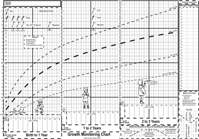
> 
> Figure 3-4: The Growth Monitoring Chart on the Road-to-Health Card
{:.figure}

> 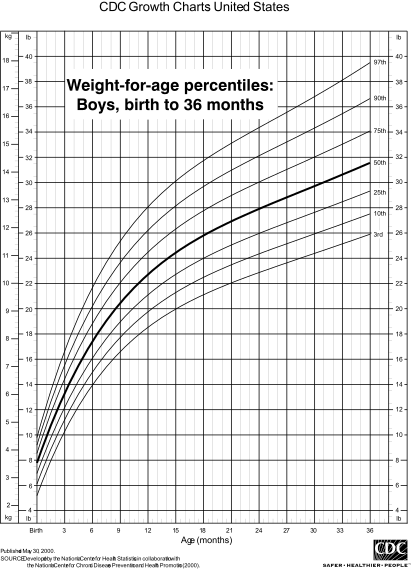
> 
> Figure 3-5: Weight-for-age percentiles: Boys, birth to 36 months
{:.figure .large}

> 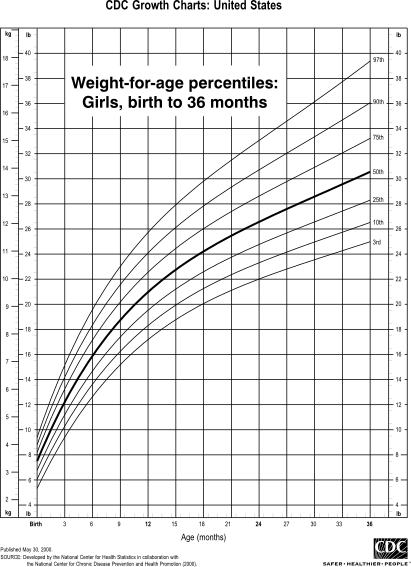
> 
> Figure 3-6: Weight-for-age percentiles: Girls, birth to 36 months
{:.figure .large}

> 
> 
> Figure 3-7: Length-for-age percentiles: Boys, birth to 36 months
{:.figure .large}

> 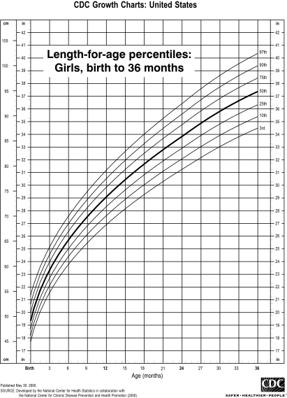
> 
> Figure 3-8: Length-for-age percentiles: Girls, birth to 36 months
{:.figure .large}

> 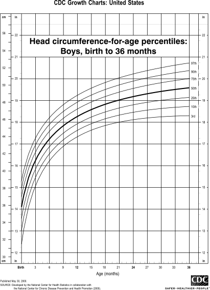
> 
> Figure 3-9: Head circumference-for-age percentiles: Boys, birth to 36 months
{:.figure .large}

> 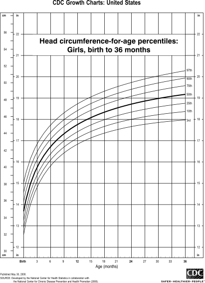
> 
> Figure 3-10: Head circumference-for-age percentiles: Girls, birth to 36 months
{:.figure .large}

> 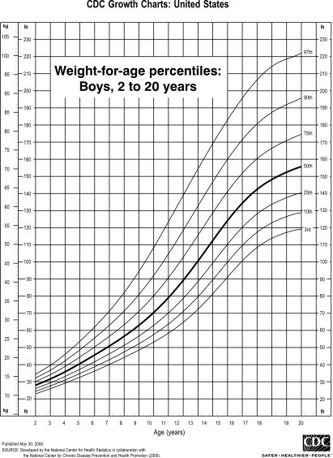
> 
> Figure 3-11: Weight-for-age percentiles: Boys, 2 to 20 years
{:.figure .large}

> 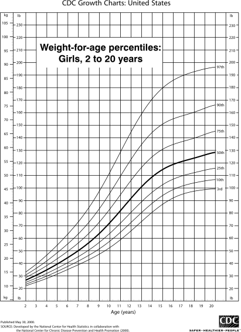
> 
> Figure 3-12: Weight-for-age percentiles: Girls, 2 to 20 years
{:.figure .large}

> 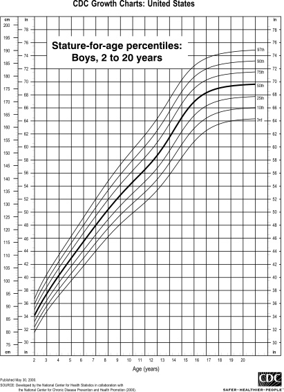
> 
> Figure 3-13: Stature-for-age percentiles: Boys, 2 to 20 years
{:.figure .large}

> 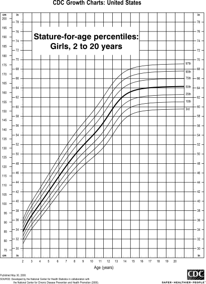
> 
> Figure 3-14: Stature-for-age percentiles: Girls, 2 to 20 years
{:.figure .large}

> 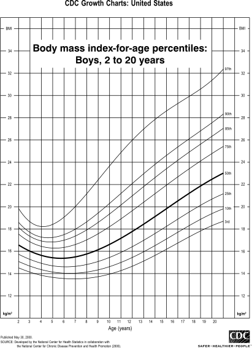
> 
> Figure 3-15: Body mass index-for-age percentiles: Boys, 2 to 20 years
{:.figure .large}

> 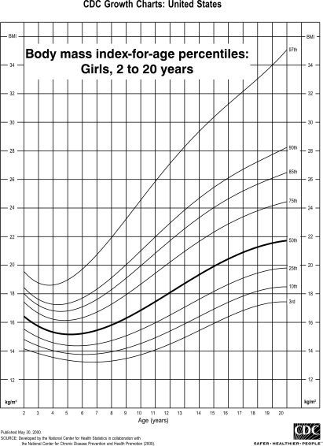
> 
> Figure 3-16: Body mass index-for-age percentiles: Girls, 2 to 20 years
{:.figure .large}
