# Photographs

## Skin conditions

> 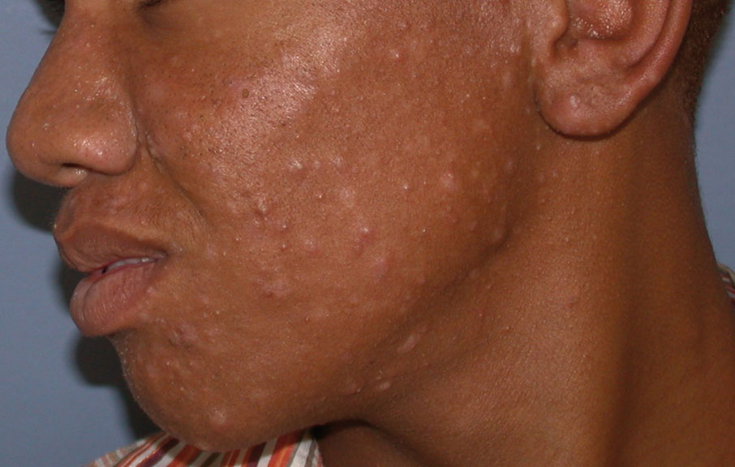
> 
> Acne
{:.figure .small .fixed}

> 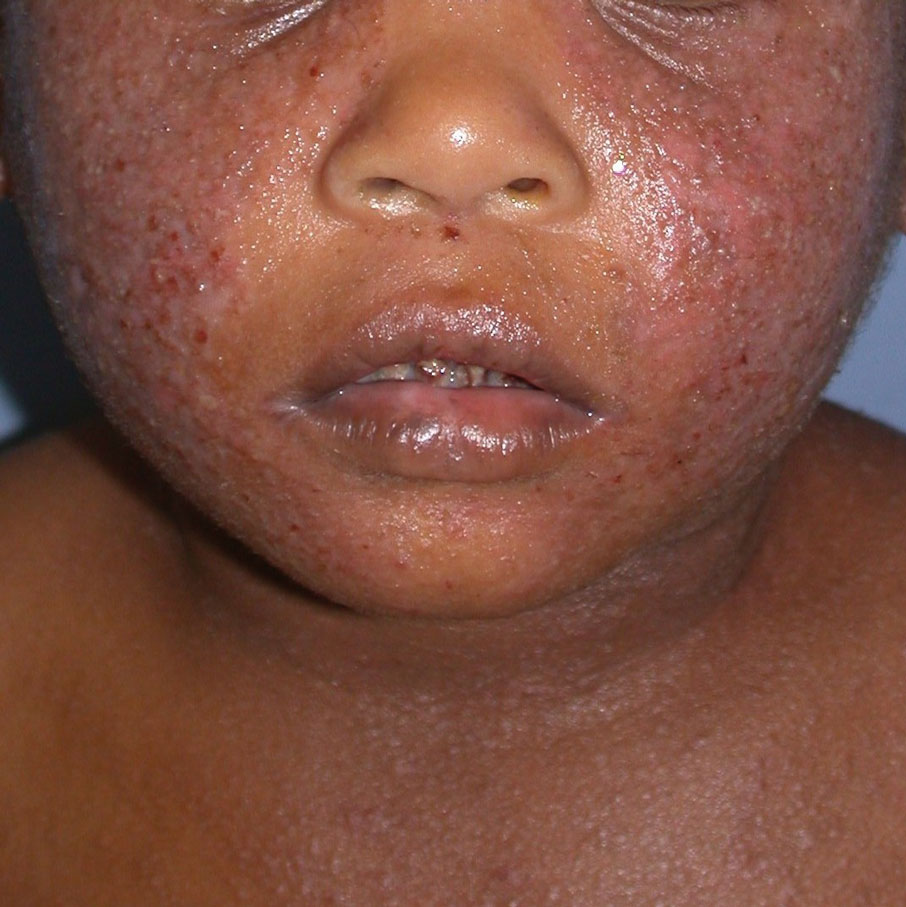
> 
> Acute eczema
{:.figure .medium .fixed}

> 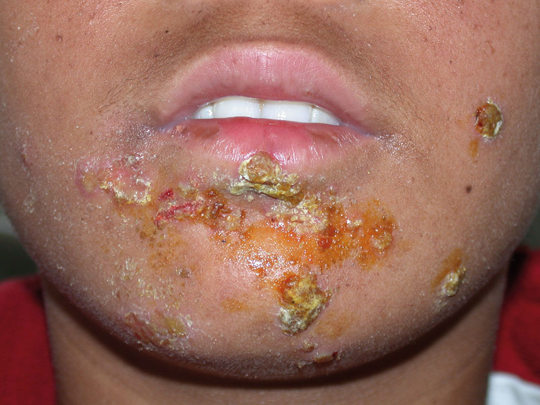
> 
> Impetigo
{:.figure .medium .fixed}

> 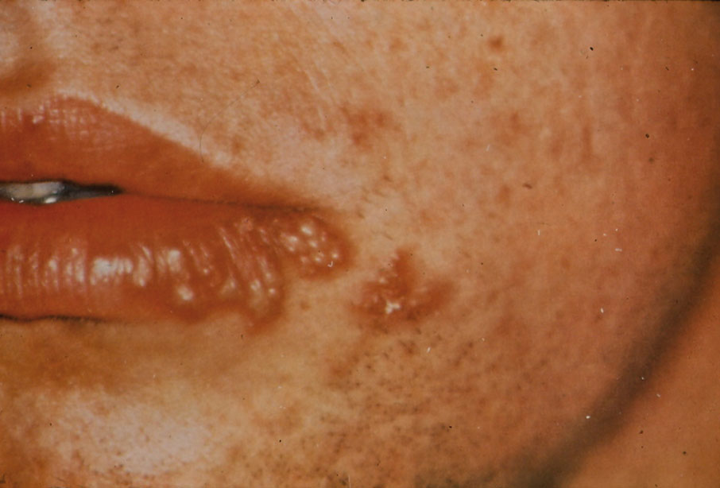
> 
> Herpes simplex
{:.figure .medium .fixed}

> 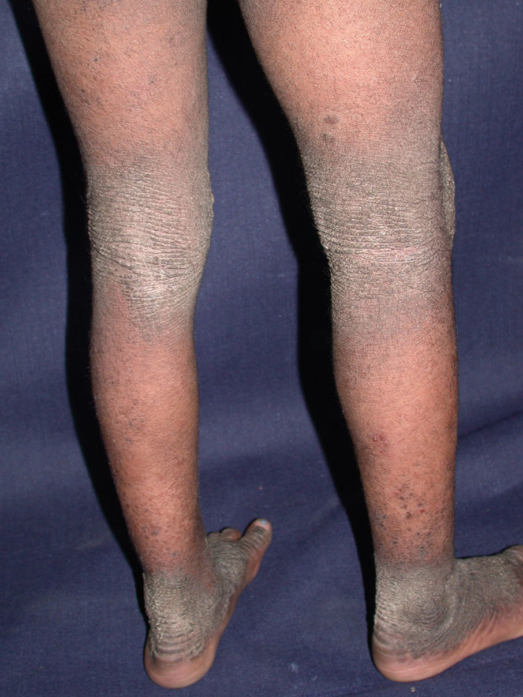
> 
> Chronic eczema
{:.figure .medium .fixed}

> 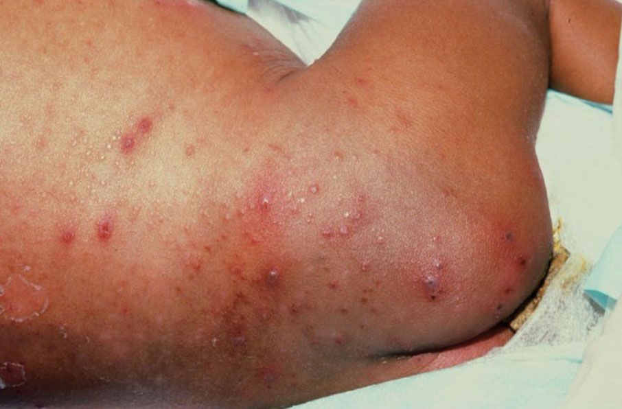
> 
> Chicken pox
{:.figure .medium .fixed}

> 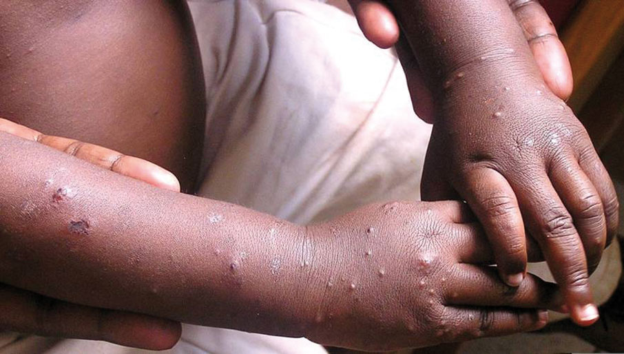
> 
> HIV rash
{:.figure .medium .fixed}

> 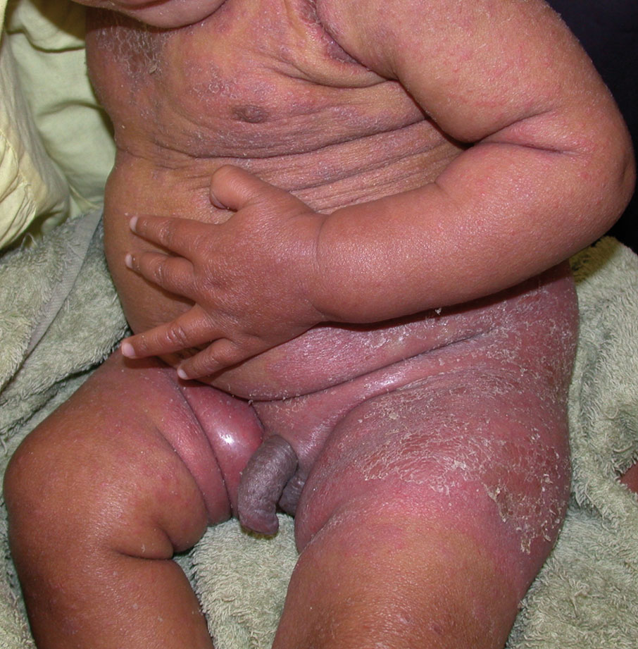
> 
> Seborrhoeic dermatitis
{:.figure .medium .fixed}

> 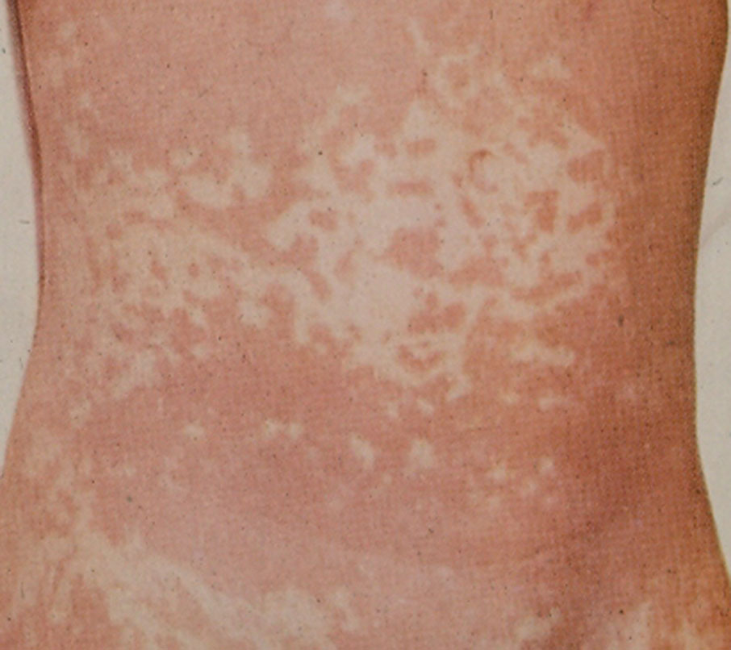
> 
> Measles
{:.figure .medium .fixed}

> 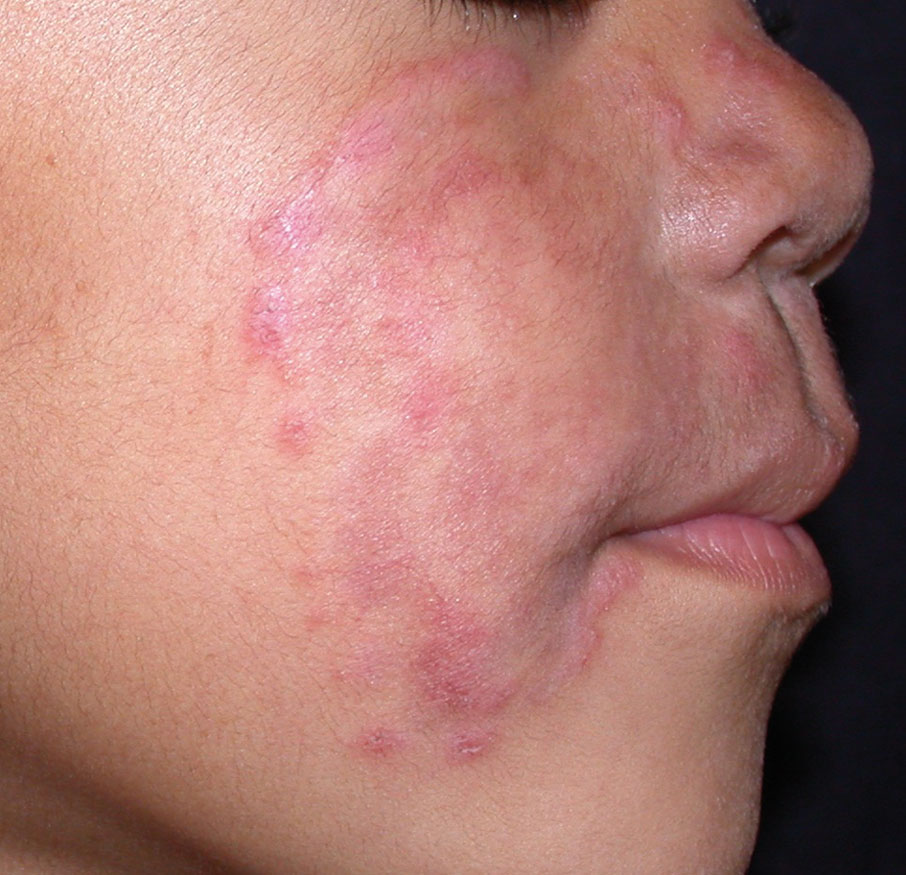
> 
> Ringworm
{:.figure .medium .fixed}

> 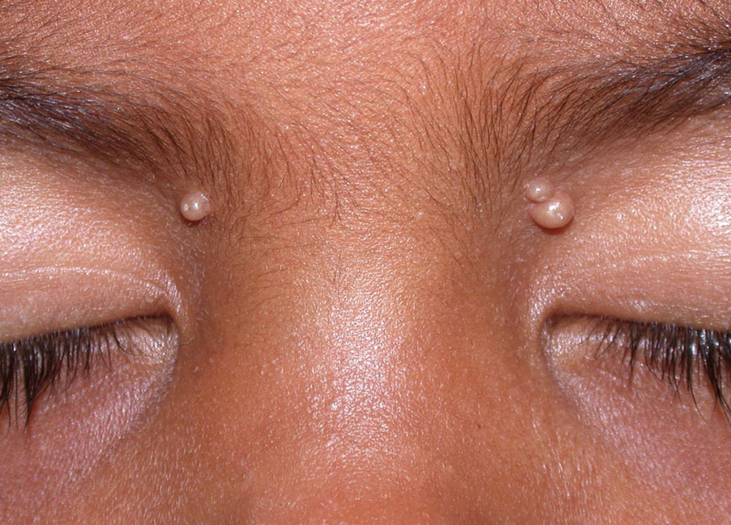
> 
> Molluscum contagiosum
{:.figure .medium .fixed}

> 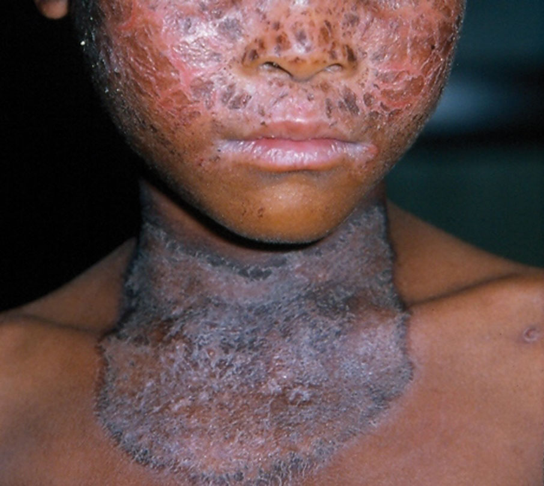
> 
> Pellagra rash
{:.figure .medium .fixed}

> 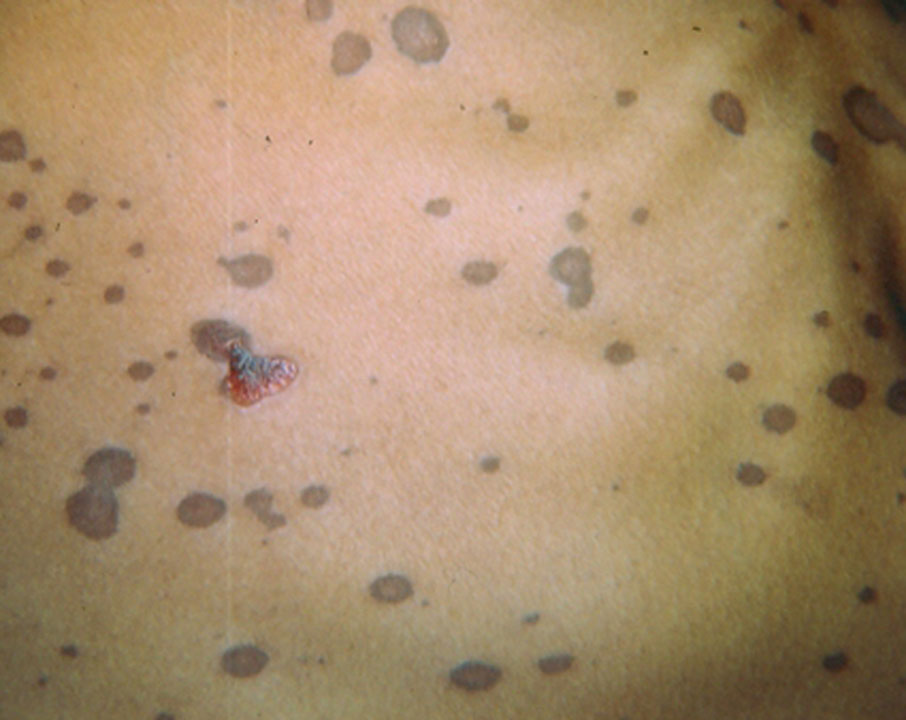
> 
> Meningococcal septicaemia
{:.figure .medium .fixed}

> 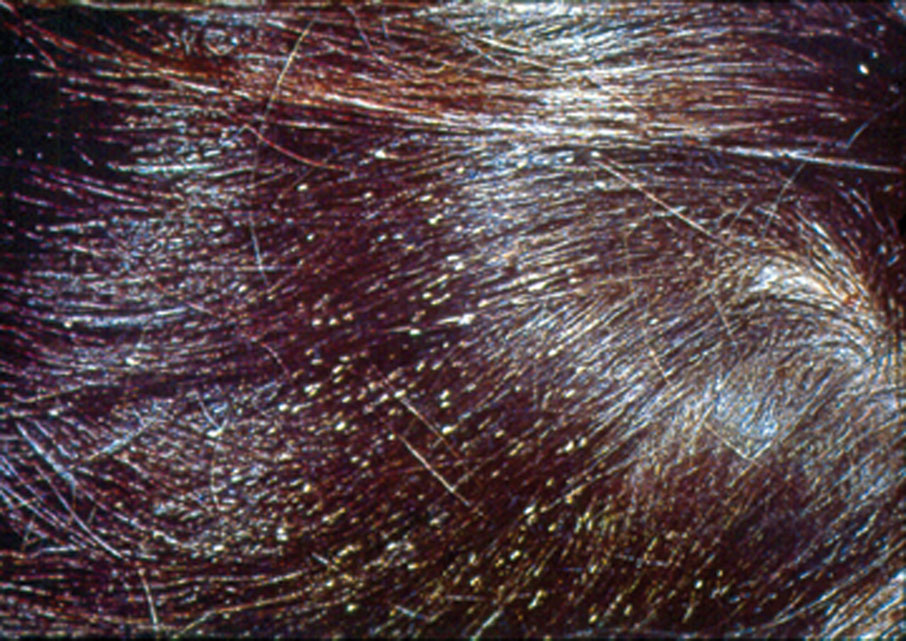
> 
> Lice
{:.figure .medium .fixed}

> 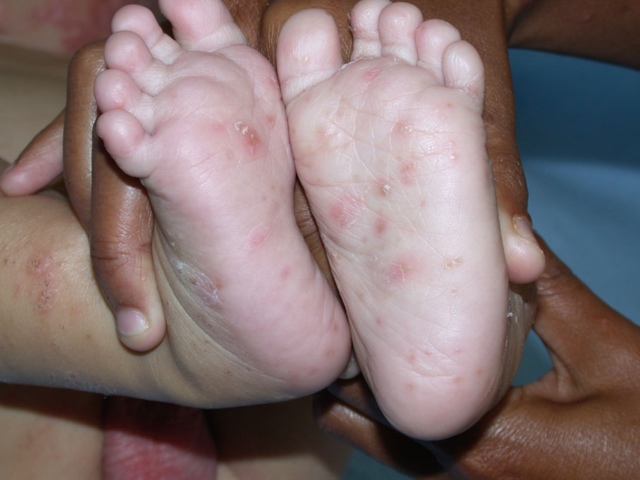
> 
> Scabies
{:.figure .medium .fixed}

> 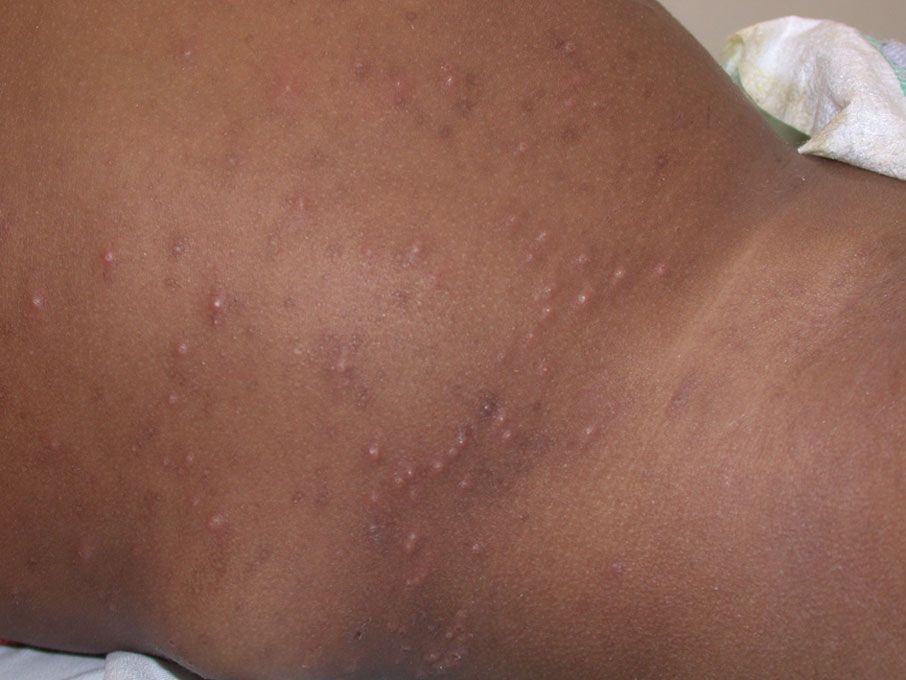
> 
> Papular urticaria
{:.figure .medium .fixed}
