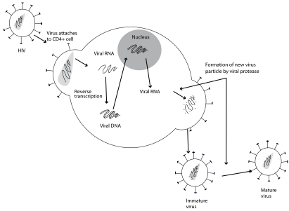

4
{:.chapter-number}

# Antiretroviral drugs

Before you begin this unit, please take the corresponding test to assess your knowledge of the subject matter. You should redo the test after you’ve worked through the unit, to evaluate what you have learned.

## Objectives

When you have completed this unit you should be able to:

*	List the goals of antiretroviral treatment.
*	Give the classes of antiretroviral drugs.
*	Describe the standard regimens of antiretroviral treatment.
*	Describe the use of antiretroviral medication.
*	Recognise important side effects of antiretroviral drugs.

## Introduction to antiretroviral treatment

### 4-1 What is antiretroviral treatment?

Antiretroviral treatment is the use of a combination of drugs (i.e. medicines) to treat people who are clinically ill due to an infection with the human immunodeficiency virus (HIV). This differs from the prophylactic use of antiretroviral drugs to prevent the transmission of HIV from mother to infant.

Antiretroviral treatment is also known as HAART (highly active antiretroviral treatment) or ART (antiretroviral therapy).

Note
:	In 1996 Dr David Ho of New York presented the results of a landmark study showing that multi-drug antiretroviral treatment was successful in stopping viral replication and controlling the immune damage of HIV. Earlier results with single-drug treatment had been disappointing.

### 4-2 How does antiretroviral treatment work?

Antiretroviral drugs prevent HIV from multiplying in CD4 lymphocytes. This reduces the number of viruses in the body and allows the damaged immune system to slowly recover. Therefore, antiretroviral treatment results in an improvement of the clinical disease. Unfortunately, antiretroviral drugs cannot cure HIV infection as the virus is able to ‘hide’ in some cells.

> Antiretroviral treatment stops HIV from multiplying in the body and damaging the immune system.

### 4-3 What are the goals of antiretroviral treatment?

The goals of antiretroviral treatment are to:

1.	Prevent the multiplication (replication) of HIV and thereby suppress the viral load and keep it suppressed. This will stop the progression of the disease.
1.	Protect (preserve or restore) immune function by increasing the CD4 count. This will improve the quality of life and general health.
1.	Promote normal growth and development.
1.	Reduce the occurrence of HIV-associated infections.
1.	Prolong survival and reduce the risk of death due to AIDS.
1.	Minimise side effects to the drugs.

> The main goals of antiretroviral treatment are to improve the quality of life and reduce mortality due to AIDS.

## Classes of antiretroviral drugs

### 4-4 What are the classes of antiretroviral drugs?

There are three main classes of antiretroviral drugs:

1.	**‘Nucs’**: These drugs block an important enzyme (called reverse transcriptase) and this prevents HIV taking control over the CD4 cells.
1.	**‘Non-nucs’**: These drugs also block the same enzyme. However, their method of action is different from that of ‘nucs’.
1.	**‘PIs’**: They prevent the HIV-infected CD4 lymphocytes from building and releasing new mature viruses.

‘Nucs’ is pronounced ‘nukes’.

> There are three main classes of antiretroviral drugs.

Note
:	‘Nucs’ (nucleoside antagonists) are known as nucleoside reverse transcriptase inhibitors (NRTIs) while ‘non-nucs’ (non-nucleoside antagonists) are known as non-nucleoside reverse transcriptase inhibitors (NNRTIs). Nucleotide antagonists such as TDF are included with ‘nucs’. They both act by blocking the formation of viral DNA by the reverse transcriptase enzyme. NRTIs bind directly to the viral DNA while NNRTIs bind to the reverse transcriptase enzyme. ‘PIs’ (protease inhibitors) block the protease enzyme responsible for the release of intact viruses from infected CD4 cells. New drugs include  those that block HIV attachment to CD4 cells, drugs that block the entry of HIV into cells (entry inhibitors) and drugs which block integration of viral information into the DNA of the cell (integrase inhibitors).

See Figure 4-1, which shows the multiplication of HIV.

> 
> 
> Figure 4-1: Sites at which antiretroviral drugs act (reverse transcription and formation of new virus particle)
{:.figure}

### 4-5 What are common examples of ‘nucs’?

1.	ABC (or abacavir)
1.	3TC (or lamivudine)
1.	AZT (or zidovudine)
1.	TDF (or tenofovir)
1.	ddI (or didanosine)
1.	d4T (or stavudine)

These are the generic (common) names of the drugs. For each generic drug there are one or more different trade names for the same drug manufactured by different companies. This makes it difficult to remember all the trade names. Therefore, it is best to remember the generic name and only the commonly used trade names of the frequently used antiretroviral drugs. If possible use the generic names rather than the trade names. However, patients often use the trade names as they are shown on the drug containers.

### 4-6 Can different ‘nucs’ be used together?

‘Nucs’ are generally used in pairs, e.g. ABC and 3TC or 3TC and AZT or AZT and ddI. However, AZT and d4T should not be used together as they compete with each other. The combination of d4T and ddI must also be avoided because this combination is associated with a higher risk for peripheral neuropathy and lactic acidosis. Only rarely are children started on d4T.

Some medication contains a combination of two or three different drugs, e.g. AZT and 3TC can be combined as Combivir. This makes taking medication easier.

> AZT and d4T should not be used together as they compete with one another.

A pair of ‘nucs’ form the basis of most antiretroviral drug combinations.

### 4-7 What are common trade names for the ‘nucs’?

Common ‘nucs’ are:

1.	ABC is sold as Ziagen.
1.	3TC is simply called 3TC.
1.	AZT is sold as Retrovir.
1.	TDF is sold as Viread
1.	ddI is sold as Videx.
1.	d4T is sold as Zerit.

### 4-8 What are examples of ‘non-nucs’?

The two common ‘non-nucs’ are:

1.	Nevirapine
1.	Efavirenz

‘Non-nucs’ are particularly powerful inhibitors of HIV multiplication. However, HIV rapidly becomes resistant to ‘non-nucs’ if they are used alone. Therefore, for antiretroviral treatment they are used in combination with a pair of ‘nucs’.

### 4-9 What are common trade names for the ‘non-nucs’?

1.	Nevirapine is called Viramune.
1.	Efavirenz is called Stocrin.

### 4-10 What are examples of commonly used ‘PIs’?

1.	Ritonavir (Norvir)
1.	Lopinavir

Ritonavir and lopinavir are used together in a single preparation such as Kaletra and Aluvia (a trade name). Using two ‘PIs’ together in a special combination allows a lower dose of both drugs with greater effectiveness and fewer side effects. ‘PIs’, like ‘non-nucs’, are usually used together with a pair of ‘nucs’.

Note
:	There are a large number of other ‘PIs’. They are easy to recognise as their generic names all end in ‘avir’ such as ritonavir. A low dose of ritonavir blocks the breakdown of lopinavir. This increases the serum concentration of lopinavir and enhances its effect.

### 4-11 Can antiretroviral drugs be taken by mouth?

Yes. The common antiretroviral drugs in all three classes are taken by mouth. Antiretroviral drugs can be taken as capsules, tablets or as an oral suspension. It is important that drugs for children be changed from an oral suspension to capsules or tablets as soon as they are big enough as the oral suspension is not always stable, often tastes unpleasant and is more difficult to make up and give. Unfortunately there are only a few ‘child-friendly’ formulations of antiretroviral drugs.

> Change from an oral suspension to tablets or capsules as soon as possible.

### 4-12 Should a number of antiretroviral drugs be used together?

Yes. When giving antiretroviral treatment it is best to use three drugs together. This is called triple combination or multi-drug treatment. It is important to use multi-drug treatment as it is more effective and also reduces the chance of the HIV becoming resistant to the drugs. The same advantages of multi-drug therapy apply to the treatment of TB. If possible, single- or double-drug treatment of HIV infection should never be used except for mother-to-child HIV prophylaxis.

> Triple-drug combinations should be used to treat HIV.

### 4-13 What is HAART?

Highly active antiretroviral treatment (HAART) is another term for antiretroviral treatment (ART) with three drugs. Therefore HAART is the use of multiple drugs to treat HIV infection.

> A combination of three antiretroviral drugs are usually used to provide antiretroviral treatment.

### 4-14 Can antiretroviral treatment cure HIV infection?

Unfortunately it cannot. However, antiretroviral treatment can dramatically improve the symptoms and clinical signs of HIV infection and allow the patient to remain healthy for many years. Adults starting treatment at 20 years of age can expect to survive for 40 more years. Antiretroviral treatment is the most important advance in the management of HIV infection and has changed the outcome of HIV infection from a rapidly fatal disease into a manageable chronic illness. To be effective, antiretroviral treatment must be taken every day for life.

> Antiretroviral treatment is the most important advance in the management of HIV infection and has changed the course from a rapidly fatal disease into a manageable chronic illness.

Note
:	In November 2003 the South African government agreed to the widespread introduction of antiretroviral treatment in the management of patients with HIV infection.

## Standardised treatment regimens

### 4-15 What approaches can be used for treating HIV infection?

The choice of which combination of antiretroviral drugs to use can be based on either an individualised or a standardised approach:

1.	Initially an individualised approach was used where the most appropriate drugs were chosen to meet the needs of each patient.
1.	More recently a standardised approach has been used where all patients are started on the same drug combination, as is done with TB treatment.

### 4-16 What are the advantages of using a standardised regimen?

1.	The standardised approach is safer, easier and simpler, with few serious side effects.
1.	It is also affordable and effective.
1.	Both healthcare workers and patients can learn how to use these drugs correctly and which side effects to be aware of. The education and training of healthcare workers and patients is much easier.
1.	It limits the number of drugs that are used and makes it possible to monitor patterns of drug use and resistance. Monitoring for side effects is also simplified.
1.	It is easier to buy and distribute a limited range of drugs.
1.	Fixed-dose formulations (single tablets containing two or three antiretroviral drugs) may be used in the standardised approach.

> The standardised approach to antiretroviral treatment is preferred.

A standardised regimen consists of a specific combination of antiretroviral drugs where the risk of drug interactions and side effects are low. The drug combination should target at least two sites in the life-cycle of HIV (i.e. important stages in the viral replication).

### 4-17 What are the disadvantages of an individualised approach?

Using different combinations of antiretroviral drugs is very complicated as each combination has its own risk of drug interactions. Some drugs counteract each other (block the function of the other drug). Some drug combinations have a higher risk of serious side effects. Therefore, a wide knowledge and experience of these drugs is essential if the individual approach is to be used. This ability is usually only available at antiretroviral clinics where particularly difficult management problems are referred.

### 4-18 What is a first-line combination?

This is the combination of three antiretroviral drugs which are routinely used when patients first start antiretroviral treatment. In South Africa the starting combination of antiretroviral drugs consists of two ‘nucs’ plus either a ‘non-nuc’ or a ‘PI’.

> The first-line combination is the combination of three antiretroviral drugs which is used to start treatment in most children with HIV infection.

### 4-19 What is a first-line combination commonly used for children in South Africa?

This depends on the child’s age, body weight and whether there was exposure to nevirapine at birth:

1.	For children younger than three years or weighing less than 10 kg in South Africa, the first-line combination is two ‘nucs’ together with a ‘PI’. Therefore the common combination for young children is ABC and 3TC plus lopinavir/ritonavir. Unless contraindicated, all these younger patients should be started on this regimen. This combination is chosen for its effectiveness and availability, few serious side effects and low cost. It also avoids nevirapine which is widely used in antiretroviral prophylaxis at birth.Children on d4T, without side effects, can be continued on d4T. Change to ABC if lipodystrophy is suspected. Few children are started on d4T today.

	> In South Africa antiretroviral treatment for young children is usually started with a combination of ABC and 3TC plus lopinavir/ritonavir.

2.	For children three years and older or weighing more than 10 kg, the first-line combination is two ‘nucs’ together with a ‘non-nuc’. A combination of ABC, 3TC and efavirenz is used.

	> Antiretroviral treatment for older children is usually started with a combination of ABC and 3TC plus efavirenz.

Note
:	It is currently not known how long the nevirapine-resistant HIV remains after prophylaxis at birth. At present there is little information on the use of efavirenz in small children.

### 4-20 What is a second-line combination?

Patients who fail to respond to the first-line combination, despite good adherence, are changed to a second-line combination of antiretroviral drugs.

### 4-21 What common second-line combination is used for children in South Africa?

1.	When treating children with HIV infection in South Africa, the second-line combination for those who have had ABC, 3TC and efavirenz is to change to AZT, 3TC and lopinavir/ritonavir. Previously ddI was used instead of 3TC.
1.	For children under three years old or children on a drug combination including lopinavir/ritonavir, discuss with a treatment expert.

> In South Africa the usual second-line combination for most children is AZT and 3TC plus lopinavir/ritonavir.

Therefore both the first- and second-line combinations include two ‘nucs’. The choice of ‘nucs’ is changed from the first- to the second-line combinations. In addition, the choice of ‘non-nucs’ and ‘PIs’ are swapped around. All three drugs are changed. This ensures that there is the best chance that the child will respond to the new combination.

### 4-22 When are other combinations of antiretroviral drugs used?

Sometimes changes to the first- or second-line combinations are made when there are serious side effects to only one drug in a standardised regimen.

These changes (‘swaps’) should only be made by an experienced doctor at an antiretroviral clinic. Using individualised combinations reduces the future options of treatment.

Patients who have failed to respond to both first- and second-line combinations, despite good adherence, may be offered ‘salvage treatment’ with new drugs. Again, this decision must be made by an experienced doctor at an antiretroviral clinic.

### 4-23 What first-line antiretroviral drugs should be used if nevirapine is given after delivery?

If nevirapine is used alone, or in combination with AZT, for the prevention of mother-to-child transmission of HIV, the infant may be resistant to nevirapine and efavirenz for months after delivery. Therefore, these nevirapine-exposed infants should be given a first-line combination of ABC, 3TC and lopinavir/ritonavir. This is the current practice for all children under three years in South Africa as many HIV-exposed infants would have been given nevirapine after birth.

## Antiretroviral medication

### 4-24 What are the practical implications of taking antiretroviral treatment?

The following questions must be considered:

1.	Which medications are taken?
1.	How much medication is taken at a time?
1.	Is the medication taken as tablets, capsules or an oral suspension?
1.	When and how often is the medication taken?
1.	Should the medication be taken with or without food?
1.	Can all the drugs be taken together at the same time?
1.	Is the drug stable at room temperature?

Table 4-1: Details of antiretroviral drugs
{:.table-caption}

| Drug                | Generic             | Trade name | Frequency     | With meals |
|---------------------+---------------------+------------+---------------+------------|
| ABC                 | abacavir            | Ziagen     | Twice daily   | Yes        |
| 3TC                 | lamivudine          | 3TC        | Twice daily   | Yes        |
| AZT                 | zidovudine          | Retrovir   | Twice daily   | Yes        |
| ddI                 | didanosine          | Videx      | Twice daily   | No         |
| d4T                 | stavudine           | Zerit      | Twice daily   | Yes        |
| Nevirapine          | nevirapine          | Viramune   | Twice daily\* | Yes        |
| TDF                 | tenofovir           | Viread     | Twice daily   | Yes        |
| Efavirenz           | efavirenz           | Stocrin    | Daily         | Yes\*\*    |
| Lopinavir/ritonavir | lopinavir/ritonavir | Aluvia     | Twice daily   | Yes        |

\* Nevirapine should be taken daily for the first 14 days.  
\*\* Efavirenz is best taken on an empty stomach for the first few weeks.

### 4-25 How should antiretroviral drugs be given?

1.	Children prefer to take the medication in a small volume of pleasant-tasting liquid. Otherwise pills which can be crushed or dissolved in water can be given with something sweet, such as jam, to hide any bitter taste. Unfortunately, many antiretroviral drugs are not child-friendly as they have been designed for adults.
1.	The correct dose of each drug must be calculated. The most accurate method is to use body surface area (which is expressed as m²). Unfortunately this requires accurate weight and height measurements and a calculator to determine the dosage. Therefore weight bands are preferred from 3 kg upwards. For children below 3 kg, body weight is used to calculate the dose of most antiretroviral drugs.
1.	The dose of each drug must be increased as the child grows and gains weight (however, the dose per kg or m² will stay the same).

> Weight bands are used to calculate drug doses for children.

### 4-26 How should abacavir be taken?

Abacavir (generic name ABC) is a ‘nuc’ (trade name is Ziagen). ABC can be taken with or without food. The oral solution contains 20 mg/ml. The dose is 8 mg/kg/dose twice daily. Alternately, for children over 10 kg once daily dosing with 16 mg/kg/dose may be used.

### 4-27 What are the weight bands for abacavir?

The dosing schedule for abacavir suspension and tablets are as follows:

| Weight band     | Amount given twice daily | Amount given once daily |
|-----------------+--------------------------+-------------------------|
| 3-4.9 kg        | 2 ml                     |                         |
| 5-6.9 kg        | 3 ml                     |                         |
| 7-9.9 kg        | 4ml                      |                         |
| 10-13.9 kg      | 6 ml                     | 12 ml                   |
| 14-19.9 kg      | 8 ml                     | 15 ml OR 1 tablet       |
| 20-24.9 kg      | 10 ml                    | 20 ml                   |
| 25 kg and above | 1 tablet                 | 2 tablets               |

### 4-28 How should 3TC be taken?

3TC (generic name lamivudine) is also a ‘nuc’. 3TC is well tolerated and has very few side effects. Mild nausea, headache and diarrhoea may occur. 3TC can be taken with or without food. The dose is 4 mg/kg/dose twice a day.  For children above 10 kg once daily dosing of 8 mg/kg dose can be used.

An oral suspension is available for children weighing less than 14 kg. It can also be used in older children who have difficulty swallowing tablets. The concentration of the oral suspension is 10 mg/ml. The oral suspension is usually made up by the clinic and is stable at room temperature. Both 150 mg and 300 mg tablets are available.

> 3TC is well tolerated with few side effects.

### 4-29 How should 3TC be given?

The dosing schedule for 3TC suspension and tablets are as follows:

| Weight band     | Amount given twice daily   | Amount given once daily                          | 
|-----------------+----------------------------+--------------------------------------------------|
| 3-4.9 kg        | 2 ml                       |                                                  | 	
| 5-6.9 kg        | 3 ml                       |                                                  |  	
| 7-9.9 kg        | 4 ml                       |                                                  | 	
| 10-13.9 kg      | 6 ml                       | 12 ml                                            | 
| 14-19.9 kg      | 8 ml OR ½ a 150 mg tablet  | 15 ml OR 1 × 150 mg tablet                       | 
| 20-24.9 kg      | 15 ml OR 1 × 150 mg tablet | 30 ml OR 2 × 150 mg tablets or 1 × 300 mg tablet | 
| 25 kg and above | 1 × 150 mg tablet          | 2 × 150 mg tablets OR 1 × 300 mg tablet          | 

### 4-30 How should AZT be taken?

AZT (generic name zidovudine) is a ‘nuc’ (trade name is Retrovir). AZT has many short-term minor side effects such as fatigue, nausea and vomiting, headache, muscle pains and altered taste. These are common at the start of treatment but become less after a few weeks. The most important side effect of AZT is anaemia.

AZT can be taken with or without food. However, the risk of nausea may be less if taken with food.

> AZT may cause anaemia.

The dose of AZT is 180-240 mg/m2/dose twice daily. However, a recent study has shown that the dose of AZT can be calculated per kg body weight. AZT is available in capsules and tablets.

An oral suspension may be used for children up to 25 kg to help those who have difficulty swallowing capsules and tablets. As an AZT solution is stable, this is usually made by the clinic. 

The concentration of the oral suspension is 10 mg/ml. AZT is also available in 100 mg capsules and 300 mg tablets.

The standard dosing of AZT is as follows:

| Weight band     | Amount administered                                                         |
|-----------------+-----------------------------------------------------------------------------|
| 3–5.9 kg        | 6 ml twice daily                                                            |
| 6–7.9 kg        | 9 ml twice daily                                                            |
| 8–13.9 kg       | 12 ml twice daily OR 1 capsule twice daily                                  |
| 14–19.9 kg      | 2 capsules in the morning and 1 capsule in the evening OR 15 ml twice daily |
| 20–24.9 kg      | 2 capsules OR 20 ml twice daily                                             |
| 25 kg and above | 1 tablet twice daily                                                        |

Note
:	The concentration of AZT suspension is 10 mg/ml. AZT is also available in 100 mg capsules and 300 mg tablets.

### 4-31 How should ddI be taken?

ddI (generic name didanosine) is a ‘nuc’ (trade name is Videx). The correct dose is 180-240 mg/m2/dose once daily but dosage is usually given by weight band. ddI is available as 25 mg, 50 mg and 100 mg tablets (dispersible in water) and 250 mg enteric coated capsules. It is important to take at least two tablets at a time to ensure that there is enough antacid in the tablets to buffer the drug.

Note
:	An antacid or buffering agent is included in the tablets. When administering ddI tablets to children, each dose must be made up of at least two tablets to ensure adequate buffering. 

Unlike other antiretroviral drugs, ddI should not be taken with meals as food reduces the absorption of the drug. ddI should be taken at least 30 minutes before eating or two hours after eating. Therefore, ddI is usually not given at the same time as other antiretrovirals. To ensure good compliance it is important that parents be given a detailed explanation of why ddI needs to be taken on an empty stomach. 

> ddI should not be taken with meals.

ddI should not be given to young children as there is no suitable oral suspension in South Africa.

The standard doses of ddI in children are given in the following table.

| Weight band     | Amount administered once daily                                         | 
|-----------------+------------------------------------------------------------------------|
| Below 5 kg      | Avoid                                                                  | 
| 2-5.9 kg        | 2 x 50 mg tablets                                                      | 
| 6 - 9.9. kg     | 1 x 100 mg plus 1 x 25 mg tablets                                      | 
| 10-13.9 kg      | 1 x 100 mg tablet plus 1 x 50 mg tablets                               | 
| 14-19.9 kg      | 1 x 100 mg plus 1 x 50 mg plus 1 x 25 mg tablets                       | 
| 20-24.9 kg      | 2 x 100 mg tablets                                                     | 
| 25 kg and above | 2 x 100 mg plus 1 x 50 mg tablets OR 1 x 250 mg enteric-coated capsule | 

### 4-32 How should TDF be taken?

TDF or tenofovir (trade name Viread) is a ‘nuc’ which has not been well evaluated in children. It is widely used in adults however and probably has a role in treating older children and adolescence. It is currently not recommended in young children. The standard dose for children of 12 years or more and weighing 35 kg or above is one 300 mg tablet daily. It can be taken with food. Possible side effects include decreased bone density and decreased renal function. TDF 300mg is often combined with FTC (emtricitabine) 200mg (trade name Truvida). FTC is similar.

### 4-33 How should nevirapine be taken?

Nevirapine (trade name Viramune) is a ‘non-nuc’. An introduction dose of nevirapine is given once daily in the evening for 14 days. This may cause a mild erythematous (pink) or measles-like rash. If no rash occurs, a maintenance dose is given twice daily.

Consult an antiretroviral clinic and do not increase the dose to twice daily if a mild rash is present. The drug must be stopped immediately if a severe rash appears as this can be dangerous. A severe rash is usually due to a hypersensitivity reaction and presents with blisters or target lesions on the skin, mouth ulcers, fever or being generally unwell.

### 4-34 How should the maintenance doses of nevirapine be given?

For smaller children an oral suspension is used (10 mg/ml) daily. This is stable and need not be kept in a fridge. For older children tablets are used. The 200 mg tablets can be snapped in half easily.

For children the standard dose is as follows:

| Weight band     | Amount administered                                                       |
|-----------------+---------------------------------------------------------------------------|
| 3–5.9 kg        | 5 ml twice daily                                                          |
| 6–9.9 kg        | 8 ml twice daily                                                          |
| 10–13.9 kg      | 10ml twice daily                                                          |
| 14 to 24.9 kg   | 1 tablet in the morning plus ½ tablet in the evening OR 15 ml twice daily |
| 25 kg and above | 1 tablet twice daily                                                      |

### 4-35 How should efavirenz be taken?

Efavirenz (trade name Stocrin) is also a ‘non-nuc’ and is very similar to nevirapine. Efavirenz, rather than nevirapine, is used in children as it has fewer severe side effects. Efavirenz also has the advantage of only needing a single daily dose, which is taken in the evenings. Like nevirapine, it is not used in children under three years old, especially those that have had nevirapine at birth. Efavirenz is available in 50 mg, 200 mg and 600 mg tablets and 50 mg and 200 mg capsules.

The standard once-daily dose of efavirenz is as follows:

| Weight band     | Amount administered |
|-----------------+---------------------|
| 10–13.9 kg      | 200 mg at night     |
| 14–24.9 kg      | 300 mg at night     |
| 25–39 kg        | 400 mg at night     |
| 40 kg and above | 600 mg at night     |

A rash may occur. However, this side effect is less common and not as severe as with nevirapine. Efavirenz commonly causes mild emotional symptoms (mood changes, abnormal dreams, insomnia and dizziness) for the first few weeks. These are reduced if efavirenz is taken on an empty stomach in the evening, which slows down the absorption. When side effects have cleared, efavirenz should be taken with meals.

> Efavirenz is taken once a day in the evening.

### 4-36 How should ‘PIs’ be taken?

Usually lopinavir and ritonavir are taken in combination as Aluvia (a trade name). Lopinavir/ritonavir is taken twice a day. The oral suspension should be kept in a cool place. The tablet is stable at room temperature. Lopinavir/ritonavir should be taken with food as this reduces the risk of nausea and diarrhoea which are common for the first few weeks. Lopinavir/ritonavir has a very unpleasant taste and is sometimes spat out or vomited by children. It may help to give the medication with fruit juice, milk, chocolate, jam or a banana. Repeat the dose if it is vomited within an hour.

Note
:	 Adult tablets contain 200 mg of lopinavir and 50 mg ritonavir. Paediatric tablets contain 200 mg lopinavir and 25 mg ritonavir. The liquid formulation contains 80 mg of lopinavir and 20 mg ritonavir per 1 ml.

The standard doses of lopinavir/ritonavir twice a day are as follows:

| Weight band     | Amount administered                                                                                            |
|-----------------+----------------------------------------------------------------------------------------------------------------|
| 3–4.9 kg        | 1 ml twice daily                                                                                               |
| 5–9.9 kg        | 1.5 ml twice daily                                                                                             |
| 10–13.9 kg      | 2 ml twice daily                                                                                               |
| 14–19.9 kg      | 2.5 ml twice daily OR 2 x 100/25 mg tablets OR 1 x 200/50 mg tablet twice daily                                |
| 20–24.9 kg      | 3 ml twice daily OR 2 x 100/25 mg tablets twice daily OR 1 x 200/50 mg tablet twice daily                      |
| 25–29.9 kg      | 3.5 ml twice daily OR 3 x 100/25 mg tablets twice daily OR 1 x 200/50 mg plus 1 x 100/25 mg tablet twice daily |
| 30–34.9 kg      | 4 ml twice daily OR 3 x 100/25 mg tablets twice daily OR 1 x 200/50 mg plus 1 x 100/25 mg tablet twice daily   |
| 35 kg and above | 5 ml twice daily OR 2 x 200/50 mg tablets twice daily                                                          |

### 4-37 Which antiretroviral drugs should be taken with meals?

Most antiretroviral drugs should be taken once or twice a day with meals. However, it is important that ddI is taken on an empty stomach, as food decreases the absorption of the drug. Parents need to understand this. The side effects of efavirenz are less if the drug is taken on an empty stomach in the evenings. Therefore it is best if efavirenz is taken without food for the first few weeks.

> ddI should be taken on an empty stomach.

### 4-38 Should drugs be kept cool?

Most drugs can be kept at room temperature.

### 4-39 How should antiretroviral drug doses be calculated for very young children?

Sometimes children with a weight below 3 kg need antiretroviral treatment. These young children should be referred to a paediatric specialist who manages HIV-infected children.

Drug doses must be increased with weight gain and therefore frequently need to be adjusted.

## Side effects of antiretroviral drugs

### 4-40 Do all antiretroviral drugs have side effects?

All antiretroviral drugs may have side effects (adverse effects or toxicity). However, some antiretroviral drugs have a lower risk of side effects than others. 3TC has the least side effects.

Remember that drugs used to treat HIV-associated infections may cause similar side effects, e.g. hepatitis with isoniazid and rash with co-trimoxazole.

Some of the clinical symptoms and signs of HIV infection or HIV-associated infections may also be similar to the side effects to antiretroviral treatment. Other diseases may also mimic side effects, e.g. viral hepatitis may mimic liver toxicity.

> All antiretroviral drugs may have side effects.

Table 4-2: Summary of side effects of antiretroviral drugs
{:.table-caption}

<table>
<thead>
  <tr>
    <td>
Name of drug
</td>
    <td>
Side effects
</td>
  </tr>
</thead>
<tbody>
  <tr class="table-subhead">
    <td colspan="2">
&lsquo;Nucs&rsquo;
</td>
  </tr>
  <tr>
    <td>
3TC 
</td>
    <td>
Few side effects. Uncommonly headache and nausea
</td>
  </tr>
  <tr>
    <td>
AZT
</td>
    <td>
Commonly headache, nausea and vomiting, anaemia and neutropenia

      
Rarely muscle pain and lactic acidosis
</td>
  </tr>
  <tr>
    <td>
ABC
</td>
    <td>
Uncommonly rash, fever, respiratory and abdominal symptoms
</td>
  </tr>
  <tr>
    <td>
ddI
</td>
    <td>
Commonly nausea, vomiting, abdominal pain

      
Uncommonly peripheral neuropathy, pancreatitis and lactic acidosis
</td>
  </tr>
  <tr>
    <td>
d4T
</td>
    <td>
Commonly headache, rash and nausea

      
Rarely peripheral neuropathy, pancreatitis and lactic acidosis
</td>
  </tr>
  <tr>
    <td>
TDF
</td>
    <td>
Commonly nausea, diarrhoea, vomiting

      
Less commonly decreased bone density, decreased renal function, lactic acidosis
</td>
  </tr>
  <tr class="table-subhead">
    <td colspan="2">
&lsquo;Non-nucs&rsquo;
</td>
  </tr>
  <tr>
    <td>
Nevirapine
</td>
    <td>
Commonly mild rash, headache, nausea, vomiting and diarrhoea

      
Uncommonly severe rash and hepatitis
</td>
  </tr>
  <tr>
    <td>
Efavirenz
</td>
    <td>
Commonly mild skin rash, sleep and emotional disturbances or psychiatric symptoms
</td>
  </tr>
  <tr class="table-subhead">
    <td colspan="2">
&lsquo;PIs&rsquo;
</td>
  </tr>
  <tr>
    <td>
Lopinavir/ritonavir
</td>
    <td>
Commonly nausea, vomiting, diarrhoea, hypercholesterolaemia and triglyceridaemia

      
Rarely pancreatitis, hyperglycaemia and lipodystrophy
</td>
  </tr>
  </tbody>
</table>

### 4-41 Do children have more side effects than adults?

No. Side effects are less common in children. Fortunately, most children do not have side effects to antiretroviral treatment.

> Most children have no side effects to antiretroviral treatment.

While most side effects are mild, some may be severe. Side effects are graded into mild, moderate, severe and life threatening.

### 4-42 Should children and their parents be warned about side effects?

It is very important that both children and their families know the common side effects of the antiretroviral drugs that are being taken. It is also important that they know which side effects to look out for, especially the severe side effects. Educating children and parents about side effects is an important part of care. Parents should be able to monitor their children for side effects.

> Children and parents should be educated about side effects.

Monitoring for side effects of antiretroviral drugs depends on the early detection of clinical signs and symptoms rather than routine blood tests.

### 4-43 What are the common mild side effects of antiretroviral drugs?

Tiredness, headaches, nausea and vomiting, abdominal pain and diarrhoea are common and may be caused by all classes of antiretroviral drugs. These side effects are usually mild and settle after the first few days or weeks. Taking antiretroviral treatment with food often helps reduce the common side effects.

However, side effects must always be reported to the staff at the HIV clinic. Usually children can continue with their antiretroviral drugs in spite of mild side effects. Sometimes other medication can be taken to help relieve these symptoms (e.g. paracetamol for headache and antiemetics for nausea and vomiting).

It is very important that patients with mild side effects are supported and understand that the side effects will disappear. Patients must not stop antiretroviral treatment or fail to take their medication correctly because of mild side effects.

Note
:	Severe vomiting or diarrhoea may cause dehydration as well as reduce absorption of medication.

### 4-44 When do most side effects occur?

Most side effects occur in the first six weeks of starting antiretroviral treatment. They usually get better on their own after a few days or weeks. However, some serious side effects may occur at any time that antiretroviral drugs are taken. Side effects that occur for the first time after months on treatment are often serious.

### 4-45 What serious side effects may occur with antiretroviral drugs?

1.	Severe rash
1.	Acute hypersensitivity
1.	Hepatitis
1.	Anaemia
1.	Peripheral neuropathy
1.	Wasting and accumulation of fat (lipodystrophy) often with raised serum lipid and glucose levels
1.	Pancreatitis
1.	Lactic (metabolic) acidosis
1.	Severe vomiting or diarrhoea

Severe side effects should be reported immediately to the clinic.

### 4-46 What rashes occur commonly with antiretroviral drugs?

1.	Mild rashes are common and include a localised or generalised erythematous (pink), maculopapular (measles-like) or urticarial rash with no other symptoms.
1.	Severe rashes include any rash with blistering, peeling or involvement of the mucous membranes of the mouth and conjunctivae. These children are usually ill with a fever. Severe rashes can be fatal and, therefore, must be taken seriously.

Rashes are usually caused by ‘non-nucs’ especially nevirapine. These rashes almost always occur in the first six weeks of treatment. They are due to a hypersensitivity reaction.

> Nevirapine can cause a severe skin rash.

Remember that HIV infection itself and drugs used to treat HIV-associated infections (especially co-trimoxazole) also commonly causes rashes. Therefore the rash may not be due to the antiretroviral drugs.

Note
:	Severe rashes may progress to Stevens-Johnson syndrome and toxic epidermal necrolysis (TEN). Constitutional symptoms such as fever are also present and warn of a dangerous side effect. Always look for hepatitis with severe drug rashes.

### 4-47 How should skin rashes be managed?

Nevirapine is started at a daily dose only for the first 14 days as this reduces the risk of a rash. Continue treatment if the rash is mild. However, do not increase the dose to twice a day until any rash has settled.

All patients with a severe rash must be referred to hospital urgently. Stop all three antiretroviral drugs immediately. Usually nevirapine is swapped for lopinavir/ritonavir if a severe rash develops. These patients must never be given a ‘non-nuc’ again.

> All drugs should be stopped immediately if a severe rash occurs.

Note
:	Steroids and antihistamines do not help most hypersensitivity rashes caused by nevirapine.

### 4-48 What is acute hypersensitivity?

Acute hypersensitivity is a severe reaction to a drug. Features of acute hypersensitivity include fever, muscle pain (myalgia), joint pain (arthralgia), flu-like symptoms, abdominal symptoms and hepatitis with or without a maculopapular rash. Acute hypersensitivity reactions can be fatal and are an indication for immediately stopping all drugs and urgent referral to hospital. Although uncommon, nevirapine and ABC are the main causes of acute hypersensitivity reactions.

### 4-49 Which antiretroviral drugs cause hepatitis?

All classes of antiretroviral drugs can cause hepatitis. However, nevirapine is the drug which is usually associated with severe hepatitis. Like a severe rash, this is due to a hypersensitivity reaction. Efavirenz, the ‘nucs’ and ‘PIs’ rarely cause hepatitis.

Liver function tests (ALT) should be done on all children when nevirapine is started and then repeated if the child develops a rash or jaundice.

> Hepatitis is usually caused by nevirapine.

Note
:	Nevirapine causes asymptomatic hepatitis in 10% and clinical hepatitis in 1% of adults. Nevirapine plus TB treatment increases the risk of severe rash and hepatitis. Co-trimoxazole may rarely cause hepatitis. ‘Nucs’ may cause a fatty liver (steatosis).

### 4-50 What are the clinical signs of hepatitis?

Hepatitis is usually asymptomatic when it is diagnosed by finding raised liver enzymes in the blood without any clinical signs. It may, however, present with typical clinical features of hepatitis (nausea, loss of appetite, jaundice, enlarged tender liver, itching and abdominal pain), usually in the first eight weeks of treatment.

Patients with asymptomatic hepatitis and mildly or moderately raised liver enzymes (up to five times the upper limit of normal) can be followed clinically without stopping the drugs. Their liver functions should be monitored regularly. The hepatitis usually resolves. Using a low dose of nevirapine for the first two weeks lowers the risk of hepatitis (and rash).

Patients with clinical hepatitis or asymptomatic hepatitis with markedly raised liver enzymes should be urgently referred to hospital. Stopping all treatment may be considered.

Pancreatitis (inflammation of the pancreas) may also present with abdominal pain and vomiting. It is a severe complication of d4T and ddI, especially when they are used together. Pancreatitis is less common in children than in adults on antiretroviral treatment.

### 4-51 Is anaemia a common problem with antiretroviral drugs?

Anaemia (Hb below 10 g/dl) is only seen in some children receiving AZT. With severe anaemia, these children may appear pale and feel weak and dizzy. However, anaemia is usually mild and the AZT need not be stopped.

A full blood count should be done when AZT is started and then be repeated at four, eight and 12 weeks and then annually. Patients with a haemoglobin concentration (Hb) below 8 g/dl due to AZT should be referred to an HIV specialist. It is important to monitor the Hb in patients receiving AZT.

> Anaemia is an important side effect of AZT.

Note
:	With severe anaemia (haemoglobin less than 6.5 g/dl) it is important to stop AZT. A blood transfusion may be needed. Patients with a Hb between 6.5 and 8 g/dl should be closely followed. AZT also causes neutropenia but does not lower the platelet count.

### 4-52 What is peripheral neuropathy?

This is a problem which affects the peripheral nerves, especially in the legs. It presents with pain, numbness and abnormal sensation in a ‘glove and stocking’ distribution. Most patients with peripheral neuropathy present with painful feet at night.

Like pancreatitis, peripheral neuropathy is usually caused by ‘nucs’ which have a ‘d’ in their names, e.g. ddI and d4T. These drugs should not be used together as this increases the risk of peripheral neuropathy. Children with signs or symptoms of peripheral neuropathy must be referred to an HIV specialist. Other drugs, such as INH, may also cause peripheral neuropathy.

> d4T and ddI are associated with both pancreatitis and peripheral neuropathy, especially if they are used together.

### 4-53 Which drugs may cause lactic acidosis?

Lactic acidosis is a rare but serious and potentially fatal side effect caused by ‘nucs’, particularly d4T and ddI (again ‘nucs’ with a ‘d’ in their names). Therefore these drugs must never be used together, and d4T is being phased out. It usually only occurs more than six months after antiretroviral treatment has been started. Patients with lactic acidosis present with a gradual onset of weight loss, tiredness, weakness and abdominal complaints (nausea, vomiting, abdominal pain or discomfort). Muscle pain (myalgia), respiratory distress (increased respiratory rate) and liver dysfunction (enlarged liver, liver tenderness and jaundice) may also develop. If lactic acidosis is suspected, the patient must be urgently referred to hospital for blood tests to confirm the diagnosis.

If symptomatic lactic acidosis is confirmed, all antiretroviral drugs should be stopped immediately. Always suspect lactic acidosis if patients who have been well, taking their medications correctly and been gaining weight for months, suddenly start to lose weight.

> Lactic acidosis is a rare but serious side effect of ‘nucs’.

Note
:	Lactic acidosis, peripheral neuropathy and hepatitis are due to mitochondrial damage as ‘nucs’ also interfere with the replication of mitochondrial DNA. Asymptomatic hyperlactataemia (without acidosis) is common in adults on antiretroviral treatment (up to 20%) while symptomatic hyperlactataemia (without acidosis) occurs in 1% and hyperlactataemia with lactic acidosis (a low pH) occurs in 0.1% of adults on ‘nucs’. Hepatic steatosis (fatty deposits) with hepatomegaly is commonly seen with lactic acidosis. Hyperlactaemia is defined as a serum lactate above 2 mmol/l.

### 4-54 What is lipodystrophy?

Lipodystrophy is an abnormal distribution of subcutaneous fat resulting in a change in body shape. Fat is lost (fat atrophy) from the face and limbs and gained (fat accumulation) over the abdomen, back of the neck and breasts. Unfortunately lipodystrophy usually does not recover when the antiretroviral drugs are stopped. Lipodystrophy is usually associated with ‘PIs’ and was also seen with d4T. Patients with lipodystrophy should be referred to an HIV specialist for management.

Note
:	Lipodystrophy may be caused by ‘PIs’ but other antiretrovirals and genetic factors may also contribute. Children between the ages of 10 and 15 years are at a greater risk for lipodystrophy, suggesting that physiological changes during puberty may also contribute.

> Lipodystrophy is a redistribution in body fat and is usually associated with ‘PIs’.

Other metabolic problems such as raised serum lipids (cholesterol and/or triglycerides) and glucose (insulin resistance) may also be seen with ‘PIs’. The combination of fat redistribution and associated metabolic problems is referred to as the lipodystrophy syndrome.

### 4-55 Should antiretroviral drugs be stopped if there are severe side effects?

It may be necessary to stop an antiretroviral drug if severe side effects occur, e.g. severe rash with nevirapine. If this is done all drugs must be stopped together. Stopping just one drug may lead to resistance of the remaining two drugs.

The drug combination must now be carefully examined as the problem drug may have to be swapped for another drug (e.g. swap nevirapine for lopinavir/ritonavir) or a totally different combination may be needed. Changing drugs must always be done by an HIV expert. HIV infection must never be treated with only one or two drugs. A full combination of three drugs is always needed.

> Never stop one drug and only give antiretroviral treatment with two drugs.

## Case study 1

A one-year-old child with stage 3 HIV infection and a very low CD4 percentage is started on first-line antiretroviral treatment with ABC, 3TC and lopinavir/ritonavir. The mother asks how these drugs should be taken and whether they cause side effects.

### 1. What is first-line treatment?

This is a standardised combination of antiretroviral drugs which are used when antiretroviral treatment is first started. It is safer, easier, simpler and cheaper than individualised treatment. Patients and staff can be taught to understand and manage this drug combination.

### 2. What class of drugs are ABC and 3TC?

They are both ‘nucs’. These drugs prevent HIV from taking control of CD4 cells. The generic name for ABC is abacavir while that for 3TC is lamivudine. The trade name for ABC is Ziagen.

### 3. What class of drugs are lopinavir and ritonavir?

These are both ‘PIs’ which act together to prevent the infected CD4 cells from releasing new copies of HIV into the blood.

### 4. How should these three drugs be taken?

They should be taken twice daily (12-hourly) by mouth. It is best if they are taken with food.

### 5. What drug preparations are available?

A suspension for small children and capsules or tablets for older children and adults.

### 6. Are there common mild side effects of antiretroviral drugs?

There is a risk of side effects with all antiretroviral drugs. These are usually mild and settle after a few weeks. Nausea, vomiting, abdominal discomfort and diarrhoea are not uncommon with most drugs. These side effects are less if the medication is taken with food.

## Case study 2

A five-year-old child is started on antiretroviral treatment with ABC, 3TC and nevirapine. After two weeks of treatment she develops a mild erythematous rash but is otherwise well.

### 1. What class of drug is nevirapine?

Nevirapine and efavirenz are both ‘non-nucs’.

### 2. Is a mild skin rash common with nevirapine?

Yes. This is a common side effect. It can often be prevented by giving nevirapine only once a day for the first 14 days. If there is no rash after two weeks of treatment, the dose can be increased to twice daily. Do not increase the dose until any rash has cleared.

### 3. Can nevirapine cause a severe skin rash?

Yes. This is an important and potentially dangerous side effect. A severe rash presents with blistering, peeling or involvement of the mucous membranes. These children are usually ill with a fever and must be urgently referred to hospital. Nevirapine can also cause hepatitis. Both these severe side effects are less common with efavirenz.

### 4. How is the diagnosis of hepatitis made?

The clinical signs and symptoms of hepatitis are nausea, loss of appetite, itching, jaundice and an enlarged tender liver. Hepatitis may be asymptomatic. The diagnosis can be confirmed by finding a raised serum concentration of liver enzymes (e.g. ALT).

### 5. How should children with drug-induced hepatitis be managed?

The antiretroviral treatment can be continued in children with asymptomatic hepatitis and only mildly raised ALT (up to five times the upper limit of normal). They should be followed clinically and the hepatitis usually resolves. Children with symptomatic hepatitis or a markedly raised ALT must be urgently referred to hospital.

## Case study 3

After failing first-line treatment despite good adherence, a young boy is started on second-line treatment with AZT, ddI and lopinavir/ritonavir. The treatment is well tolerated and after a month he is gaining weight.

### 1. What important side effect is seen with AZT?

Anaemia.

### 2. Should ddI be taken with food?

No, as this reduces absorption of the drug. ddI should be taken at least 30 minutes before food or two hours after food.

### 3. Do children have more side effects than adults to antiretroviral drugs?

No. Most children have few or no side effects. However, it is important that parents are aware of the important side effects so that they can be detected as soon as possible.

### 4. When do most side effects occur?

In the first six weeks of treatment. However, some severe side effects can occur much later.

### 5. What is lipodystrophy?

This is an abnormal distribution of fat with change in body shape. Fat is lost from the face and limbs and gained over the abdomen, back and breasts. The ‘PIs’ such as lopinavir/ritonavir contribute to the development of lipodystrophy. Stavudine (d4T) is an important cause of fat loss (lipoatrophy).

## Case study 4

A child of eight years with symptomatic HIV infection is placed on individualised treatment with ABC, ddI and lopinavir/ritonavir in private practice. His weight is 27 kg. Initially he responds well to treatment. However, after four months he starts to lose weight, complains of abdominal pain, nausea and vomiting. The ddI is stopped and the ABC and lopinavir/ritonavir continued.

### 1. What important side effect may present with these symptoms?

Lactic acidosis. This is a rare but serious and potentially fatal side effect.

### 2. Which drugs are usually the cause?

‘Nucs’, especially ddI. Lactic acidosis is most common if ddI and d4T are used together. Therefore this is a combination that must not be used, and d4T is best avoided. An incorrect mix of drugs is one of the risks of using individualised rather than standard combinations of antiretroviral drugs.

### 3. Why has this side effect presented so late?

Lactic acidosis typically appears many months after treatment has started when patients, who have been well and gaining weight, suddenly start to lose weight.

### 4. What mistake has been made in the management of this side effect?

All drugs should have been stopped and the child should have been transferred urgently to hospital. One drug alone should not be stopped as drug resistance can develop to the two remaining drugs. Either the problem drug should be swapped for another drug or the whole combination should be changed. This decision must be made by an HIV expert.

### 5. What dangerous side effects may be due to ‘nucs’?

*	Peripheral neuropathy
*	Pancreatitis
*	Lactic acidosis

### 6. How is the dose of antiretroviral drugs calculated?

The dose depends on the child’s weight. Usually a fixed dose is given for each weight range (weight bands). For example, the dose of 3TC in a child weighing 25 kg or more is one tablet (150 mg) twice a day.
