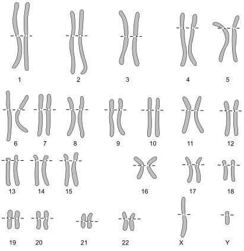
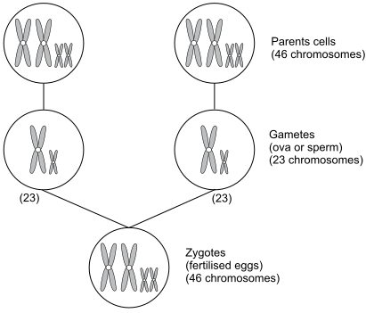
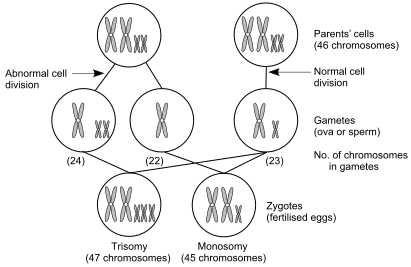
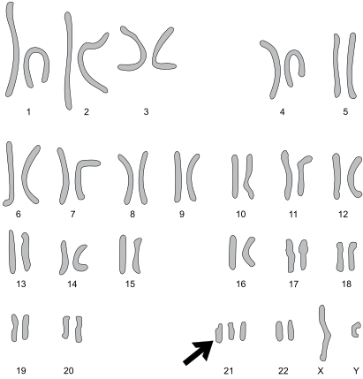

1
{:.chapter-number}

# Introduction to congenital disorders

Take the chapter quiz before and after you read this chapter.



## Contents
{:.non-printing}

*   [Objectives](#objectives)
*   [Congenital disorders](#congenital-disorders)
*   [Causes of congenital disorders](#causes-of-congenital-disorders)
*   [Chromosomal inheritance](#chromosomal-inheritance)
*   [Inheritance of single gene defects](#inheritance-of-single-gene-defects)
*   [Dominant inheritance](#dominant-inheritance)
*   [Recessive inheritance](#recessive-inheritance)
*   [Multifactorial congenital disorders](#multifactorial-congenital-disorders)
*   [Teratogens](#teratogens)
*   [Different types of structural congenital disorders](#different-types-of-structural-congenital-disorders)
*   [Case studies](#case-studies)
{:.chapter-toc}

## Objectives

When you have completed this unit you should be able to:

*	Define a congenital disorder.
*	Understand the birth prevalence and population prevalence of congenital disorders.
*	List the causes of congenital disorders.
*	Understand chromosomal inheritance.
*	Understand the inheritance of single genes.
*	Define a multifactorial congenital disorder.
*	Define a teratogen and know their dangers.
*	List different types of structural congenital disorders.
*	Understand the meaning of dysmorphic features.

## Congenital disorders

### 1-1 What is a congenital disorder?

A congenital disorder is an abnormality of structure or function in a person, which is present from birth. The birth defect may be clinically obvious at birth, or may only be diagnosed sometime later in life. For example, a neural tube defect is a structural defect which is obvious at birth while haemophilia, which is also present at birth, is a functional defect that may only become obvious and be diagnosed when the child is older. Congenital disorders often present as an abnormal appearance or failure to grow and develop normally.

> A congenital disorder is a structural or functional abnormality which is present from birth.

Previously congenital disorders were often called birth defects.

### 1-2 Are all congenital disorders serious?

No. Congenital disorders may be mild or serious. A mild defect causes no disability. However, a person with a serious congenital disorder may die soon after birth, or survive with a disability due to the direct effect of the congenital disorder (e.g. neural tube defect) or due to a secondary effect (e.g. joint damage resulting from bleeding in haemophilia). Some serious congenital disorders can be treated and this may be life-saving or prevent or reduce serious disability.

Congenital disorders can cause a wide range of disability, e.g. physical disability, intellectual disability, blindness, deafness and epilepsy.

> Serious congenital disorders can cause death or disability.

### 1-3 How is the frequency of congenital disorders measured?

The frequency of congenital disorders (i.e. how common are individuals with a congenital disorder) is expressed as population prevalence and birth prevalence:

1.	The **population prevalence** is defined as the number of affected individuals per 1000 or 10 000 or 100 000 people, depending on how common or rare the disorder is, in a given population at a certain time, e.g. the population prevalence of Down syndrome in rural Limpopo was 7.5/10 000 children between 1994 and 1997. Therefore the population prevalence is a measure of how common a congenital disorder is in the general population.
2.	The **birth prevalence** is defined as the number of affected infants per 1000 in a community or population at a given time, e.g. the current birth prevalence of Down syndrome in rural Limpopo is 2.1/1000 live births. It is therefore a measure of how common a defect is among newborn infants.

Note
:	Incidence is the number of new cases that occur in a given period of time. For example 25 cases of Down syndrome in a year.

### 1-4 How common are congenital disorder?

At birth 2-3 percent of live newborn infants can be recognised as having a congenital disorder, i.e. the recognisable birth prevalence for all defects is 20–30/1000 live births in the first month of life.

However, not all congenital disorders are diagnosed at or around birth, and by five years of age between 4 and 8 percent of children in different countries are considered to have suffered the effects of a serious birth defect, i.e. a birth prevalence of 40–80/1000 live births.

The birth prevalence of serious congenital disorders varies from 40/1000 live births in industrialised countries to as high as 80/1000 in some developing countries.

> The birth prevalence of serious congenital disorders is lower in industrial countries than in developing countries.

Note
:	Research done in rural Limpopo province, South Africa, by genetic trained nursing staff examining newborn infants on day one of life recorded a birth prevalence of serious structural disorders of 15/1000 live births (1.5% of live births). Congenital disorders can be diagnosed at any age from the newborn period (birth to 28 days) through to adulthood. Examples of congenital disorders that can present for the first time in adulthood include inherited cancers, Huntington disease and adult onset polycystic kidney disease.

### 1-5 If congenital disorders are so common why are they not seen more frequently at clinics?

1.	Infants and children with serious congenital disorders are very likely to die when they are young, especially if there are inadequate medical services available for their care. Therefore many infants with congenital disorders do not live long enough to be seen at clinics.
2.	Many congenital disorders are not recognised and diagnosed.
3.	It is often not realised that many of the conditions seen in clinics and hospitals have a congenital origin, e.g. many forms of intellectual disability, cerebral palsy, deafness and blindness. Up to 50% of these disorders may be due to congenital disorders.

Therefore both the birth prevalence and population prevalence of congenital disorders in developing countries may seem to be much lower than they really are as the diagnosis is missed.

Note
:	Another reason why infants and children with congenital disorders are not seen is that their parents do not take them to hospital or clinic because they feel that they will not receive adequate attention or care, and the visit will be an unjustified burden on their limited family resources. Experience from Limpopo showed that when genetic clinics were established, the population soon got to know and parents brought their children with congenital disorders.

### 1-6 How many children die from congenital disorders?

In South Africa about 1 million infants are born annually. Based on the available evidence, about 72 000 infants are born each year with a severe congenital disorder. Of these infants, about 25% will die in the first five years of life which contributes to the under 5 mortality rate.

It is estimated that 9 million children are born in the world each year with a serious congenital disorder. Of these children, at least 8.4 million (93%) are born in developing countries. A minimum of 3.3 million children with a serious congenital disorder are estimated to die annually.

Note
:	It is quoted as a general rule that in industrialised countries 30% of children with serious congenital disorders will die in infancy (the first year of life), 30% will live with disability even if treatment is available, and 40% can largely be cured (mainly by surgery). Similar figures for developing countries are not available, but the number that die or are successfully treated will depend on the level of available health care. Currently at least 3.3 million children with a serious birth defect die annually.

> Congenital disorders are an important cause of infant and childhood death.

## Causes of congenital disorders

### 1-7 What are the causes of congenital disorders?

Congenital disorders are caused by:

1.	Problems that are present before conception, i.e. falling pregnant (about 40% of congenital disorders):
	*	Chromosome abnormalities.
	*	Single gene defects.
	*	Multifactorial disorders.

	These are also known as genetic causes of congenital disorders.

2.	Problems occurring after conception, i.e. after falling pregnant (about 10% of congenital disorders):
	*	Teratogens.
	*	Constraint.

	These are non-genetic causes of congenital disorders. Note that all congenital disorders are not due to genetic causes.

3.	Cause not yet known (about 50% of congenital disorders).

Note
:	The percentages given above are for industrialised countries. Figures for developing countries are not available.

> The cause of about 50% of congenital disorders is not yet known.

## Chromosomal inheritance

### 1-8 What are chromosomes?

Chromosomes are packages of DNA (deoxyribonucleic acid), the genetic material found in all cells. A person’s genetic plan of all their inherited characteristics is stored in their chromosomes.

Human cells have 46 chromosomes that are contained in the nucleus of the cell. The chromosomes are paired (23 pairs), with 22 pairs called autosomes and one pair of sex chromosomes. Each pair of autosomes looks the same as they are the same length.

Females have two X chromosomes (i.e. XX) while males have one X and one Y chromosome (i.e. XY). Like the 22 autosomes, the pair of X chromosomes in females look alike. The pair of sex chromosomes in males does not look the same because the X chromosome is longer than the Y chromosome.

A picture of the 46 chromosomes is called a karyotype. The normal female karyotype can be written as 46,XX and the normal male karyotype as 46,XY. Each pair of autosomes is given a number (1 to 22) from the longest to the shortest.

> Humans have 46 chromosomes in each cell, 22 pairs of autosomes and one pair of sex chromosomes.

Note
:	In some textbooks, 46,XY is still written as 46 XY. 46,XY is preferable.

> 
> 
> Figure 1-1: Normal karyotype of a male (46,XY) with 23 pairs of chromosomes (22 pairs of matching autosomes and one pair of unlike sex chromosomes, X and Y)
{:.figure}

### 1-9 How are chromosomes inherited?

One chromosome of each pair of chromosomes is inherited from the mother and the other chromosome from the father. Therefore, both the mother and father give one chromosome to each pair of chromosomes found in the child. Half of the inheritance plan of each individual is inherited from the mother and the other half from the father. This is called sexual reproduction. An infant’s genetic plan is, therefore, inherited from both parents. This is why the inherited characteristics of the parents are shared in the child, and the child has features of both parents.

When the ova (female eggs) are produced in the mother’s ovaries, and the sperms (male eggs) in the father’s testicles, the 46 chromosomes in the parent’s stem cells divide with only one copy of each chromosome pair still remaining in each ovum or sperm. The ova and sperms (also called gametes or sex cells), therefore, only have 23 chromosomes each.

With fertilisation, a sperm and an ovum unite and combine their chromosomes to form the zygote (the first cell which will eventually multiply and develop into the fetus). The zygote therefore has 46 chromosomes, half (23) from the mother and half (23) from the father. The zygote divides, multiplies and grows to become an embryo (with cells developing into different organs). The embryo develops into the fetus (which has formed organs). After delivery the fetus is called the newborn infant.

> Each parent gives 23 chromosomes which combine at fertilisation to give a total of 46 chromosomes in the zygote.

Note
:	All living organisms, plants and animals, have chromosomes. In humans the 46 chromosomes are known as the diploid number of chromosomes and the 23 chromosomes in the gametes as the haploid number. The process of cell division in which the gametes are formed and the number of chromosomes is halved (from 46 to 23) is called meiosis. After meiosis the ovum contains 22 autosomes and an X chromosome, and each sperm has 22 autosomes plus either an X or a Y chromosome.

	Cell division in which the chromosome number stays the same can also occur (asexual reproduction) and this is called mitosis. This is the type of cell reproduction that occurs to make more cells so that the zygote can grow and develop into an embryo and fetus, and the body can grow or replace cells that die off during life.

> 
> 
> Figure 1-2: The normal chromosome contribution of each parent
{:.figure}

## Inheritance of single gene defects

### 1-10 What is a gene?

The genetic material of chromosomes is divided up into smaller packages of DNA called genes. Like chromosomes, genes occur in pairs, one copy of the gene is inherited from each parent. Together, each pair of genes usually determines a single inherited function by giving a set of instructions to the cell, such as a physical feature (e.g. hair colour) or a single biochemical product (e.g. production of a protein or an enzyme).

Genes make up the smallest parts of the genetic code. Children look like their parents because their genes are a mixture that is inherited from both mother and father. As this combination varies with each child, siblings look alike and yet have their differences. The only individuals with identical genes are identical twins.

> A gene is a small section of a chromosome and controls a cell function. Genes occur in pairs, one being inherited from each parent.

### 1-11 What is a single gene defect?

On the chromosomes, a person’s genetic plan is coded (‘written’) in thousands of genes. Genes on the 22 autosomes and two X chromosomes always occur in pairs (alleles). One gene in each matching pair is inherited from the mother and the other gene in that pair is inherited from the father. Each pair of genes together codes for an inherited biochemical product (e.g. blood clotting factor) or physical feature (e.g. eye colour) and gives the cell an instruction to carry out a particular activity. If the structure of the gene is abnormal, the instruction will also be abnormal and this may be harmful to the individual. A congenital disorder that results from an abnormality in a gene is called a single gene defect.

> A congenital disorder caused by an abnormality in a gene is called a single gene defect.

Note
:	It is estimated that humans have about 20 000 pairs of genes. Over 6000 single gene defects have been described.

### 1-12 How do genes become abnormal?

Almost all genes are normal and give the cell correct instructions. However, a gene can become abnormal by mutation. With a mutation, the DNA structure of a gene changes.

> A mutation is a change in gene structure that can cause abnormal gene function and a congenital disorder.

Mutations are rare and may occur sponta­neously or be caused by environmental factors, including radiation (solar radiation from the sun, nuclear radiation or excessive X-rays). These abnormal genes can be passed onto the next generation in the same way as normal genes are inherited. As a result, single gene defects are usually inherited.

> Single gene defects are usually inherited.

Note
:	In a mutation, the gene gives instructions for an incorrect sequence of amino acids and, therefore, an abnormal protein or enzyme is formed. A mutated gene may cause a clinical problem (e.g. haemophilia), a mild variant (e.g. red hair) or rarely a survival advantage (e.g. resistance against malaria).

### 1-13 What type of genes occur?

A gene may be either a dominant or a recessive gene. Both dominant and recessive genes may be normal or abnormal.

> Genes can be either dominant or recessive.

## Dominant inheritance

### 1-14 What is a dominant gene?

In a pair of genes (alleles), the individual genes may be of different strengths, with the one being ‘stronger’ and the other being ‘weaker’. The ‘stronger’ gene dominates (overpowers) the ‘weaker’ gene. Therefore, the ‘stronger’ gene is called a dominant gene. The dominant gene controls the function of that gene pair (alleles).

> A dominant gene controls the function of that gene pair.

If the dominant gene is abnormal, then the instructions sent from that gene pair will also be abnormal. As a result the cell may not function normally, causing a congenital disorder.

If the dominant gene is on one of the 22 autosomes, it is called an autosomal dominant gene. A clinical disorder caused by a mutation in an autosomal dominant gene is called an autosomal dominant disorder. These conditions may be mild or severe but usually are not lethal (otherwise they probably would not be passed on to the next generation). Males and females are equally affected by autosomal dominant disorders.

### 1-15 How are autosomal dominant genes inherited?

If either the father or mother has an autosomal dominant gene, there is a 50% chance of passing that gene on to each of their children. Both sons and daughter have an equal chance of inheriting an autosomal dominant gene.

> There is a 50% chance of a child inheriting a dominant gene from a parent.

If the autosomal dominant gene causes an abnormality of structure or function, the genetic abnormality will be present in the parent with that gene, and also in each child that inherits that abnormal gene. Autosomal dominant disorders are, therefore, passed from one generation to the next. The clinical effect of the abnormal gene will usually be present in both parent and child.

While most autosomal dominant genes are inherited, an autosomal dominant gene may also appear in a person for the first time in a family as a result of a new mutation. That gene will not be present in either parent. Therefore, the parents will be normal but the child will have the disorder. However, the new mutated gene can be passed onto future generations in the same way as other autosomal dominant genes are inherited.

Note
:	In a single family, some members will show all the clinical features caused by the dominant gene while others who inherit the gene may only show (express) some features. This is known as variable expression (e.g. neurofibromatosis). Some family members with a dominant gene may not show any features of that gene at all. This is called variable penetrance (e.g. polydactyly).

Note
:	If both parents have the same dominant gene, there is a 75% chance (3 out of 4) that each child will inherit that gene. There is also a 25% chance (1 in 4) of the child inheriting both dominant genes, which is usually fatal if the dominant genes are abnormal. Therefore, all children will inherit either one or both dominant genes.

> 
> 
> Figure 1-3: The pattern of autosomal dominant inheritance. There is a 50% chance that the autosomal dominant gene (e.g. D) will be passed from the affected parent to each child no matter whether a boy or girl.
{:.figure}

## Recessive inheritance

### 1-16 What is a recessive gene?

If a dominant gene overpowers (suppresses) a ‘weaker’ gene, the weaker gene is called a recessive gene. The dominant gene will control the function of that pair of genes. As a result, the instructions sent to the cell will be that of the dominant gene only. Therefore, the recessive gene will have no control over the cell and its effect will be ‘hidden’ or suppressed.

A person is called a carrier if she or he carries a ‘hidden’ recessive gene. In a carrier the effect of an abnormal recessive gene is not seen and the individual appears normal.

A person who has both a dominant and a recessive gene (a carrier), is said to be heterozygous for that pair of genes. If both genes are the same (both genes are dominant or both recessive), the person is said to be homozygous for that pair of genes. Only if both genes are recessive will the recessive genes together control that function of the cells. They are able to do this as there is no dominant gene. Recessive genes may be normal (e.g. carry instructions for blue eyes) or abnormal (e.g. carry instructions for oculocutaneous albinism). If both recessive genes are abnormal, that function of the cell will also be abnormal. A clinically normal carrier has both a normal (dominant) and an abnormal (recessive) gene for that feature.

A recessive gene on an autosome is called an autosomal recessive gene.

Note
:	We all carry five to 10 abnormal recessive genes. As we are heterozygous for that gene (single copy), it generally has no effect on our health. Only if we are homozygous (double dose) for the same gene will we be clinically affected.

### 1-17 How are autosomal recessive genes inherited?

If both parents are carriers (i.e. they are heterozygous) for the same recessive gene, their children will have a 25% chance of inheriting the recessive gene from both mother and father (i.e. the child will be homozygous). Their children will also have a 50% chance of inheriting a recessive gene from only one parent to become a carrier (i.e. heterozygous). Getting the same recessive gene from both parents is commoner if the parents are closely related, e.g. siblings, cousins or an uncle and a niece (intermarriage or a consanguineous relationship), as they may inherit the same recessive gene from a common ancestor (e.g. grandparent).

With autosomal recessive inheritance, the parents and grandparents are usually normal and do not show the effect of the recessive gene. If a child inherits two abnormal autosomal recessive genes (i.e. one from each parent), they will have an autosomal recessive disorder. The risk of an autosomal recessive disorder is much higher if the parents are closely related (consanguineous).

The majority of single gene defects are autosomal recessive. Males and females are equally at risk of an autosomal recessive disorder.

If only one parent is heterozygous (a carrier), the children cannot be affected but they have a 50% risk of inheriting the recessive gene and, therefore, also being a carrier.

> If both parents are carriers of a recessive gene, there is a 25% chance (1 in 4) that their child will inherit both recessive genes.

> 
> 
> Figure 1-4: The pattern of autosomal recessive inheritance. If both parents are heterozygous for a recessive gene (e.g. r), there is a 25% chance that a child will be homozygous and a 50% chance that a child will also be heterozygous for that gene.
{:.figure}

### 1-18 What is X-linked recessive inheritance?

If a recessive gene is on an X chromosome, it is called an X-linked recessive gene (X-linked dominant genes and Y-linked genes are very rare).

X-linked recessive genes are inherited by girls in the same way as autosomal recessive genes. Girls have two X chromosomes and all the X-linked genes are in pairs. However, as the X and Y chromosomes are not identical (the Y chromosome is very short) the X-linked recessive genes in a male are not matched to a gene on the Y chromosome. Therefore, the X-linked gene, whether dominant or recessive, alone controls that cell function in males. As with autosomal recessive inheritance, a mother has a 50% chance (1 in 2) of passing her X-linked recessive gene to both her sons and daughters. However, it will only influence the function of the cell in her sons. It has no effect in her daughters as the gene is matched by a gene on the other X chromosome, inherited from the father.

Therefore, disorders caused by X-linked recessive genes are carried by females and affect males. Males have unaffected sons as they give them their Y and not their X chromosomes. However, there is a 100% chance that each daughter of an affected male will be a carrier.

Disorders caused by an X-linked recessive gene are called X-linked recessive disorders, e.g. colour blindness and haemophilia.

> X-linked recessive disorders affect males but not females.

Note
:	In males, an X-linked recessive gene acts as if it were a dominant gene as it is unopposed by the function of a matching gene. Females may have X-linked recessive disorders (e.g. colour blindness) if they inherit the abnormal recessive gene from both parents, i.e. both their X chromosomes carry the abnormal gene. Their father will be affected by the disorder while their mother will be a carrier. Rarely, females who carry an X-linked gene may show mild signs of the disorder, e.g. haemophilia.

> X-linked recessive genes are carried by mothers and affect 50% of their sons.

> 
> 
> Figure 1-5: The pattern of X-linked recessive inheritance. There is a 50% chance that the recessive gene from the mother will be inherited by both sons and daughters. Only sons will be clinically affected as the X-linked recessive gene in daughters will be paired by a normal matching gene from the father.
{:.figure}

## Multifactorial congenital disorders

### 1-19 What are multifactorial congenital disorders?

These are congenital disorders that have a combined genetic and environmental cause. The environmental factor (or factors) is often not known. The person affected with a multifactorial congenital disorder inherits a combination of genes from their parents that places them at an increased risk for a congenital disorder. If that individual then experiences certain environmental factors, the result will be a multifactorial congenital disorder. Multifactorial congenital disorders, therefore, require both genetic and environmental factors before they present. Neither the genetic factor nor the environmental factor alone will cause the congenital disorder. The risk that another child of the same parents will be affected by a multifactorial congenital disorder is small (about 5%). The risk of recurrence increases if more than one family member is affected.

> Multifactorial congenital disorders have a combined genetic and environmental cause.

## Teratogens

### 1-20 What is a teratogen?

A teratogen is a fetal environmental factor that can cause a congenital disorder. This is different from multifactorial congenital disorders as teratogens cause congenital disorders without an obvious genetic factor. Therefore the chromosomes and genes are normal in children with congenital disorders caused by a teratogen.

A teratogen can be a chemical substance like alcohol, an infection like the rubella virus (German measles) or a physical agent like X-rays. Teratogens interfere with normal development of the embryo usually early in pregnancy, but some can also damage the fetus later in pregnancy. If exposure to the teratogen is removed, there is little risk of a similar congenital disorder in a further child in that family.

> A teratogen is an environmental factor that can cause a congenital disorder without a contributing genetic factor.

## Different types of structural congenital disorders

### 1-21 What is structural congenital disorder?

This is a disorder where there is a physical abnormality, e.g. club foot.  Usually these disorders are obvious at birth. Most records of congenital disorders recognised at birth consist of structural disorders.

### 1-22 What are the different types of structural congenital disorder?

Structural congenital disorders can be divided into two large groups. Each group is the result of a different process:

1. Malformations
2. Constraint

Placing a congenital disorder into one of these categories helps to identify the probable cause and timing of the cause of the disorder.

### 1-23 What is a malformation?

A malformation is a structural congenital disorder which develops during the first trimester and is caused by failure of the embryo to develop normally. Malformations may be caused by chromosomal, single gene or multifactorial factors or may be caused by teratogens. Malformations may be mild such as an abnormally shaped ear or severe such as a neural tube defect.

>  Malformations occur early in pregnancy when the embryo is still forming.

### 1-24 What is constraint?

External forces can result in congenital disorders after the fetus is already normally formed. That is after the first trimester. The cause of this type of congenital disorder is called constraint. There are two types of congenital disorders due to constraint:

*	Deformities
*	Disruptions

### 1-25 What is a deformity?

Occasionally a normally formed fetus is pushed out of shape by a mechanical force in the uterus. Examples are:

*	Multiple pregnancies, where there is little space in the uterus for two fetuses
*	Oligohydramnios when there is no room for the fetus to move
*	Large uterine fibroids which push on the fetus

The head or chest may have an abnormal shape or the limbs may be bent. This type of congenital disorder is called a deformity. Deformities usually correct themselves after delivery once the pressure has been removed.

### 1-26 What is a disruption?

The amnion may tear in early pregnancy resulting in threads called amniotic bands. Sometimes an amniotic band may wrap around and damage a limb or other part of the body. A finger, toe or part of a limb may be amputated or have a constriction ring. This is an uncommon cause of a congenital disorder. It rarely happens again in a later pregnancy.

> Constraint is the type of congenital disorder caused by local mechanical pressure in the uterus deforming or disrupting part of the fetus.

### 1-27 What are dysmorphic features?

Dysmorphic features means that an individual’s appearance is not normal. The study of people with dysmorphic features is called dysmorphology.

### 1-28 How are dysmorphic features divided up into categories?

Dysmorphic features may be single or multiple. If multiple they can be divided into three groups:

1. A syndrome.
2. A sequence.
3. An association.

### 1-29 What is a syndrome?

A syndrome is a pattern of structural abnormalies which can be recognised.  Children with the same syndrome look alike as they have similar abnormalities. An example is Down syndrome. 

### 1-30 What is a sequence?

A sequence is a number of structural abnormalities which are all the result of a single structural abnormality. The primary abnormality is the cause of the other abnormalities. For example in the Potter’s sequence the lack of amniotic fluid (oligohydramnios) results in an infant that looks squashed with a flat face, low ears and bent limbs.

### 1-31 What is an association?

An association is a group of structural abnormalities which sometimes occur together but not frequently enough to be easily recognised as a syndrome. Different affected infants will have different combinations of abnormalities.  The cause of associations is often not known and they do not usually recur in a family. An example is the VATER association with a variable mix of Vertebral, Anal, Traceo-Esophageal and Renal abnormalities.

## Case study 1

A newborn infant at a district hospital is recognised as having a congenital disorder. The midwife comments that she very rarely sees congenital disorders. The doctor does not know the cause of the congenital disorder.

### 1. What is a congenital disorder?

It is an abnormality of function or structure in a person which is present from birth.

### 2. Why are congenital disorders rarely seen?

Because many congenital disorders are not recognised. A child may even die of a congenital disorder without the correct diagnosis being made. As a result, congenital disorders are commoner than they seem to be.

### 3. What is birth prevalence?

The birth prevalence of a congenital disorder is the number of infants born with that congenital disorder per 1000 liveborn infants. In contrast, the prevalence of a congenital disorder is the number of individuals with that defect per 1000 people in that population.

### 4. What are the main known causes of a congenital disorder?

Congenital disorders may be caused by:

*	Problems already present at conception, such as chromosomal disorders, single gene defects or multifactorial disorders.
*	Problems after conception, such as teratogens or constraint.

### 5. How often is a cause for a congenital disorder not found?

About 50%.

### 6. Are all congenital disorders due to genetic causes?

No. Congenital disorders due to teratogens and constraint due to fetal environmental causes are not due to genetic causes. Therefore, they usually do not recur in the same family.

## Case study 2

Parents with brown eyes have a son with blue eyes. The father asks the genetic nurse how brown-eyed parents can have a blue-eyed child.

### 1. What determines the colour of a person’s eyes?

A single pair of genes (alleles). The gene for brown eyes is a dominant gene while the gene for blue eyes in a recessive gene.

### 2. Is the colour of a person’s eyes inherited?

Yes. The colour of your eyes depends on the genes for eye colour carried by your parents.

### 3. How can two brown-eyed parents have a child with blue eyes?

Because both parents are heterozygous, i.e. they each have one gene for brown eyes (dominant) and another for blue eyes (recessive). If they both give their recessive gene (for blue eyes) to their child, that child will be homozygous with two blue-eyed genes and, therefore, have blue eyes.

### 4. What is the chance of their future children also having blue eyes?

25%. This is the chance of being homozygous (having both recessive genes) if your parents are heterozygous. If one or both parents have two dominant genes for brown eyes, all their children will have brown eyes.

### 5. Are recessive genes always abnormal?

No. Many recessive genes (such as eye colour) are normal. However, recessive genes may be abnormal and, therefore, cause a clinical disorder when the child is homozygous.

## Case study 3

A young couple wants to get married. However, the man has a serious congenital disorder which has been diagnosed as an autosomal dominant disorder. They ask their general practitioner what the chances are that their children will inherit the problem. They mention that they are cousins.

### 1. What is an autosomal dominant disorder?

It is a clinical problem caused by having an abnormal dominant gene on an autosome.

### 2. What is an autosome?

One of the 22 pairs of non-sex chromosomes. The X and Y chromosomes are not autosomes, they are sex chromosomes.

### 3. What is a dominant disorder?

It is a clinical condition caused by an abnormal dominant gene. A dominant gene is a ‘strong’ gene that will overpower a recessive gene with which it is paired. The dominant gene will determine the effect that pair of genes has on the cell.

### 4. What is the risk that their children will inherit their father’s abnormal autosomal dominant gene?

50%. Therefore, the risk of having the same congenital disorder is also 50%.

### 5. Does it matter that they are cousins?

This will not affect the risk of the children inheriting the autosomal dominant disorder. It would, however, increase the risk of both parents being carriers (heterozygous) for an abnormal recessive gene.

## Case study 4

Healthy parents of six children plan to have one last child. They have three normal daughters and one normal son. However, their other two sons both have a similar congenital disorder. The mother’s sister who is healthy also has a son with the same congenital disorder. They want to know what the risk is of the planned child having the congenital disorder that is common in the family.

### 1. What type of gene defect affects a number of children born to normal parents?

The pattern of inheritance suggests a recessive gene (either autosomal or X-linked).

### 2. Why are some of the boys and none of the girls affected?

This may be due to chance. However, it strongly suggests an abnormal X-linked recessive gene defect. The fact that the mother’s sister also has an affected son indicates an abnormal gene carried by the females and affecting the males in the family.

### 3. Which parent is probably a carrier of the abnormal gene?

The mother.

### 4. What is the risk of a further son being affected?

50%.

### 5. What is the risk of a further daughter being affected?

Nil. However, she has a 50% chance of being a carrier.