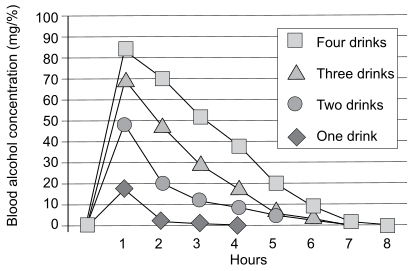
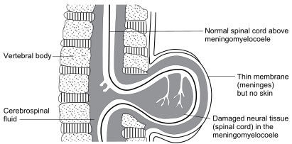

6
{:.chapter-number}

# Congenital disorders caused by teratogens

Take the chapter test before and after you read this chapter.



## Contents
{:.non-printing}

*   [Objectives](#objectives)
*   [Importance of teratogens](#importance-of-teratogens)
*   [Introduction to fetal alcohol syndrome](#introduction-to-fetal-alcohol-syndrome)
*   [The cause of fetal alcohol syndrome](#the-cause-of-fetal-alcohol-syndrome)
*   [Recognising infants with fetal alcohol syndrome](#recognising-infants-with-fetal-alcohol-syndrome)
*   [Growth and development in infants with fetal alcohol syndrome](#growth-and-development-in-infants-with-fetal-alcohol-syndrome)
*   [Care of children with fetal alcohol syndrome and their families](#care-of-children-with-fetal-alcohol-syndrome-and-their-families)
*   [Case studies](#case-study-1)
{:.chapter-toc}

## Objectives

When you have completed this unit you should be able to:

*	Understand the importance of teratogens.
*   Define fetal alcohol syndrome.
*	Understand that alcohol can damage the fetus.
*	Recommend no alcohol intake during pregnancy.
*	List factors which influence the blood alcohol concentration.
*	Recognise an infant with fetal alcohol syndrome.
*	Understand their pattern of growth and development.
*	Plan the care of an infant with fetal alcohol syndrome.
*	Understand the prevention of fetal alcohol syndrome.

## Importance of teratogens

### 6-1 What is a teratogen?

A teratogen is a fetal environmental factor that can cause a congenital disorder. This is different from multifactorial congenital disorders as teratogens cause congenital disorders without an obvious genetic factor. Therefore the chromosomes and genes are normal in children with congenital disorders caused by a teratogen.

A teratogen can be a chemical substance like alcohol, an infection like the rubella virus (German measles) or a physical agent like X-rays. Teratogens interfere with normal development of the embryo usually early in pregnancy, but some can also damage the fetus later in pregnancy. If exposure to the teratogen is removed, there is little risk of a similar congenital disorder in a further child in that family.

> A teratogen is an environmental factor that can cause a congenital disorder without a contributing genetic factor

### 6-2 When does a teratogen do the most damage?

The development of an infant from conception to birth is divided into three phases. The effect of teratogens is different in each of these phases:

1. **The pre-implantation phase**: 2-4 weeks after the start of the last menstrual period (1–17 days post conception).
During this phase the fertilised egg (zygote) develops from one cell to a ball of many cells (the conceptus). The conceptus floats in a layer of fluid which carries it from the fallopian tube into the uterus. At 4 weeks after the start of the last menstrual period (17 days post conception) the conceptus begins to burrow into the lining of the uterus. Implantation and the development of the placenta and umbilical cord now begin. Before implantation it is very difficult for a teratogen to get to the developing conceptus and damage it. In the unlikely event that a teratogen does damage the conceptus, it is so small and fragile that it would die. Implantation would not happen and the women would not even know she had conceived. Therefore, teratogens do NOT cause congenital disorders in the pre-implantation phase 2 to 4 weeks after the last menstrual period (1–17 days post conception).

> Teratogens do not cause congenital disorders during the pre-implantation phase of development.

2. **The embryonic phase**: 4–10 weeks after the start of the last menstrual period (17–56 days post conception).
With implantation and the development of the placenta, the developing infants is now called an embryo. The embryo and mother are in very close contact and a teratogen can now move easily from the mother through the placenta to the embryo. During this phase the organs of the body are developing. They are very sensitive and are easily damaged by teratogens. Teratogens do the most damage in the embryonic phase. Structural congenital disorders that occur during the embryonic phase are called malformations, e.g. a cleft lip.

> Teratogens cause the most damage in the embryonic phase of development from 4 to 10 weeks after the start of the last menstrual period.

3. **The fetal phase**: From 10 weeks after the start of the last menstrual period to delivery (56 days after conception to birth).
By 10 weeks (fifty six days) after conception the embryo has turned into a fetus with fully formed organs. The fetus still needs to grow and mature before being born. Teratogens generally do little damage to the fetus in this phase of development, but there are some exceptions. For example, the fetal brain, which can be damaged more easily than other organs, can still be affected in this phase by some teratogens, particularly drugs like alcohol.

### 6-3 What are examples of teratogens?

Important teratogens include:

1.  Maternal infections:
    * Rubella virus.
    * Cytomegalovirus (CMV).
    * Toxoplasmosis.
    * Herpes simplex virus.
    * Varicella virus (chicken pox and herpes zoster).

Note
:   Toxoplasmosis, Rubella, Cytomegalovirus and Herpes are known as the TORCH organisms.

HIV and syphilis are not teratogens.

2.  Maternal illnesses:
    * Diabetes mellitus.
    * Epilepsy.

3.  Radiation in very large doses:
    * Excessive amounts of X-ray.
    * Nuclear radiation (e.g. Chernobyl).

4.  Drugs:
    * Alcohol.
    * Retinoic acid (for severe acne).
    * Some antibiotics (e.g. tetracycline, streptomycin).
    * Anti-cancer drugs (e.g. methotrexate, thalidomide).
    * Warfarin (an anticoagulant).
    * Some anti-convulsants (e.g. phenytoin, valproic acid).
    * Lithium (an antidepressant).  

5.  Environmental pollutants:
    * Methyl mercury.
    * There are probably many more which have not yet been identified.

## Introduction to fetal alcohol syndrome

### 6-4 What is fetal alcohol syndrome?

Fetal alcohol syndrome (FAS) is a recognisable clinical disorder which presents with clinical features that include:

1.	Abnormalities in appearance.
1.	Delayed growth and development.
1.	Congenital malformations.

Fetal alcohol syndrome can often be recognised at birth although it is more easily recognisable in childhood. It is a typical example of a congenital disorder caused by a teratogen.

> Fetal alcohol syndrome can often be recognised at birth.

Note
:	Fetal alcohol spectrum disorders include alcohol-related congenital disorders, alcohol-related neurodevelopmental disorders and fetal alcohol syndrome, as well as partial fetal alcohol syndrome. Fetal alcohol syndrome is the most severe.

### 6-5 What is the cause of fetal alcohol syndrome?

Drinking of alcohol by the mother during a pregnancy. Fetal alcohol syndrome cannot occur if a woman does not drink any alcohol during her pregnancy or if she only drinks alcohol before or after the pregnancy.

Note
:	Fetal alcohol syndrome is caused by exposure of the embryo and fetus to ethyl alcohol.

> Fetal alcohol syndrome is caused by drinking alcohol during pregnancy.

### 6-6 Can fetal alcohol syndrome be inherited?

No. Fetal alcohol syndrome is not a genetically inherited condition. It is caused by alcohol, i.e. a teratogen (something which damages the fetus). However, there can be a number of individuals with fetal alcohol syndrome in a family (e.g. mother and child, or siblings) due to the excessive use of alcohol in that family.

### 6-7 Is fetal alcohol syndrome common?

While it is estimated that 1 in a 1000 infants have fetal alcohol syndrome in most industrialised countries (e.g. USA, UK, France, Sweden) there is concern that the rate of alcohol abuse is increasing and some children with fetal alcohol syndrome are not being recognised.

In South Africa fetal alcohol syndrome is common. In communities in the Western and Northern Cape provinces of South Africa the population prevalence of fetal alcohol syndrome in children attending their first year of school is more than 50 per 1000 children, i.e. 30 times commoner than Down syndrome. This is one of the highest reported rates for fetal alcohol syndrome in a community in the world. In Soweto the incidence is 20/1000 children.

An estimated 1.4% of all South African infants are born with fetal alcohol syndrome.

Note
:	Other developing countries where women abuse alcohol may also have a similarly high population prevalence of fetal alcohol syndrome. However, the research needed to recognise  the problem has not yet been done.

### 6-8 Which communities have a high rate of fetal alcohol syndrome?

Fetal alcohol syndrome is most frequent in communities where poverty, low maternal education, unemployment and heavy or binge drinking are common.

## The cause of fetal alcohol syndrome

### 6-9 How can alcohol taken during pregnancy damage the fetus?

Alcohol is a poisonous substance (teratogen), which, if drunk by the mother during pregnancy crosses the placenta and can interfere with the normal growth and development of the embryo and fetus.

Both the amount (dosage) and the time (stage of pregnancy) that alcohol is drunk are important. Alcohol is most damaging to the embryo in the period of organ development between 17–56 days after conception, but also harms the developing fetus to a lesser degree from 56 days to delivery. The timing and amount of alcohol drunk will determine which organs are damaged and the degree of damage.

A past history of heavy alcohol drinking in a woman who does not drink during her pregnancy cannot cause fetal alcohol syndrome.

### 6-10 Does drinking alcohol during pregnancy always damage the fetus?

No. Not all women who drink during pregnancy have a child with fetal alcohol syndrome but the risk in South African women who drink heavily during pregnancy is greater than 50 percent.

### 6-11 How much alcohol is needed to damage the fetus?

Any amount of alcohol that a woman drinks during pregnancy may be harmful to her fetus. The more alcohol she drinks, the greater is the chance that she will have an infant with fetal alcohol syndrome.

> Even small amounts of alcohol are not safe during pregnancy.

One or two drinks a day is regarded as light drinking, three to five drinks a day is moderate drinking while more than five drinks a day is heavy drinking. Moderate or heavy drinking may damage the fetus. However, any amount of alcohol carries a risk of damaging the fetus. It is not known what mild effects may be caused by light drinking as these are difficult to detect (e.g. a reduction in IQ or minor behaviour problems). A woman does not need be an alcoholic for her drinking to damage her fetus.

### 6-12 What is binge drinking?

This is defined as drinking more than five alcoholic drinks at a single occasion. In many South African communities, this is the usual way alcohol is taken and occurs mostly over weekends. The risk of fetal alcohol syndrome is particularly high with binge drinking during pregnancy.

Chronic drinking refers to the pattern of drinking throughout the week.

### 6-13 Is it best not to drink alcohol at all during pregnancy?

Yes. It is best for women not to drink any alcohol during pregnancy.

> No amount of alcohol is considered safe during pregnancy.

### 6-14 How much alcohol is in one drink?

One drink is defined as 15 ml of absolute alcohol which is equivalent to a glass of wine (150 ml) or a can of beer (300 ml) or a tot of spirits (25 ml). A quart of beer (the largest container commercially sold and measuring 750 ml) is equivalent to 2.5 drinks and a standard bottle of wine (750 ml) is the same as five drinks. An estimate of what a person is drinking must be calculated from the history, taking care to understand what size of container the woman is using.

Note
:	Beer contains 5% alcohol, wine about 10% and spirits approximately 30–40%.

### 6-15 Are all alcoholic drinks dangerous to the fetus?

Yes. The risk of alcohol damaging the fetus depends on the amount of absolute alcohol taken and NOT the type of drink (e.g. whisky, beer, homebrew and wine). There are no alcoholic drinks which are safe during pregnancy.

> All forms of alcohol are dangerous during pregnancy.

### 6-16 When is it most dangerous to drink alcohol during pregnancy?

Drinking alcohol is most dangerous between three and eight weeks of gestation (i.e. four to 10 weeks after the last menstrual period), as this may result in damage to the developing organs of the embryo (malformations). The organs most at risk during this time are the brain, heart, kidneys, eye, ear, palate and skeleton. Drinking alcohol during the first trimester may cause congenital malformations of any of these organs.

Therefore, women should stop drinking when they plan to fall pregnant, i.e. before conception.

> Drinking alcohol is most dangerous during the first trimester of pregnancy.

Note
:	Drinking alcohol between three and eight weeks after conception may cause malformations in the developing embryo. At this stage some women do not know or are unsure they are pregnant.

### 6-17 Are there other periods during pregnancy when alcohol is dangerous to the fetus?

Yes, alcohol is dangerous throughout pregnancy. Even after 10 weeks of gestation, alcohol can still harm the fetus even though it may not cause congenital malformations. Fetal brain and physical growth can be affected if alcohol is drunk at any time during pregnancy. If the mother only starts to drink after the first three months of pregnancy, the growth of the fetal brain and body can be slowed causing brain damage and intra-uterine growth restriction.

Therefore, there is *no* time during pregnancy when it is safe for the mother to drink alcohol.

> Women should stop drinking alcohol before they conceive, and not drink alcohol at any time during pregnancy, to ensure that their unborn infants are not damaged by alcohol.

### 6-18 What other factors may alter the risk of alcohol damaging the fetus?

Drinking alcohol affects individuals differently. Some individuals become drunk on small amounts of alcohol while others are unaffected by large volumes. The critical factor that determines the effect of alcohol in a person is the level of alcohol in their blood, the so-called blood alcohol concentration (BAC). An individual is more affected by a high blood alcohol concentration than by a low blood alcohol concentration.

A high maternal blood alcohol concentration also results in a high blood alcohol concentration in the fetus, as alcohol crosses the placenta easily. The higher the fetal blood alcohol concentration, the greater is the risk of damage to the fetus.

> The more alcohol a mother drinks, the greater is the risk of damage to her fetus.

Women who can drink a lot of alcohol before becoming drunk are at a particularly high risk of having an infant with fetal alcohol syndrome as their fetuses are exposed to very high blood alcohol concentrations.

### 6-19 What factors affect the blood alcohol concentration?

Many factors affect the mother’s blood alcohol concentration and, therefore, the blood alcohol concentration of the fetus:

1.	The amount of alcohol drunk (the volume and alcohol content of the drink).
1.	Time taken to drink the alcohol.
1.	Maternal weight.
1.	Food intake at the time of drinking.
1.	Smoking and other drug abuse at the same time as drinking alcohol.
1.	Genetic factors.
1.	Maternal malnutrition.

### 6-20 How does the amount of alcohol and the time taken to drink the alcohol affect the blood alcohol concentration?

There is a direct relationship between the amount of alcohol consumed, the time over which it was taken and the blood alcohol concentration. The greater the amount of alcohol drunk, and the shorter the time taken to drink the alcohol, the higher will be the blood alcohol concentration.

Normally, one drink results in a blood alcohol concentration in the range of 20–30 mg/% and then the alcohol is completely broken down (metabolised) over a period of two hours. After two drinks, the usual blood alcohol concentration is in the range of 40 to 50 mg/% and the alcohol is broken down in four hours, and so on.

> Drinking a lot of alcohol fast results in a high blood alcohol concentration.

> 
> 
> Figure 6-1: The blood alcohol concentration over eight hours after one to four drinks. The greater the number of drinks, the higher the peak blood alcohol concentration and the longer it takes to return to nil.
{:.figure}

### 6-21 How does maternal weight affect the blood alcohol concentration?

Each drink results in a higher blood alcohol concentration in women with a low weight than in women who weigh more. Heavier women, therefore, can usually drink more than light women before they become drunk.

Note
:	A mother’s weight is related to the amount of water in her body (her total body water). The volume of alcohol drunk passes into all the body water within 20 minutes. A large or heavy person has a large amount of body water and this dilutes the alcohol and reduces the blood alcohol concentration. The reverse is true for a small individual who has less body water to dilute the alcohol, resulting in a higher blood alcohol concentration.

### 6-22 How does food intake affect the blood alcohol concentration?

Food, especially carbohydrate foods such as bread, rice or maize products, reduces the absorption of alcohol from the stomach after drinking. This keeps the blood alcohol concentration lower. Drinking without eating, therefore, results in a higher blood alcohol concentration.

### 6-23 How does smoking and other drug abuse affect the blood alcohol concentration?

When smoking cigarettes and drinking occur together, a higher blood alcohol concentration can be expected than when the same amount of alcohol is taken alone. Similarly, smoking marijuana (dagga) or taking other drugs together with alcohol also raises the blood alcohol concentration. Therefore, the risk of fetal alcohol syndrome is higher if a woman both drinks alcohol and abuses other drugs during pregnancy.

All smoking during pregnancy is strongly contra-indicated as smoking alone may cause poor fetal growth and be a factor in causing such defects as cleft-lip and cleft palate.

### 6-24 How do genetic factors affect the blood alcohol concentration?

Alcohol is broken down in the liver by enzymes. These enzymes occur in two forms. They may either break down alcohol fast or slowly. Fast-acting enzymes, which break down alcohol rapidly, result in a lower than expected blood alcohol concentration for the amount of alcohol taken. The opposite is true for the slow-acting form of the enzymes which break down alcohol slowly resulting in a higher than expected blood alcohol concentration. The rate at which a mother’s liver breaks down alcohol is determined by whether she has inherited fast- or slow-acting enzymes from her parents. Although fetal alcohol syndrome is not an inherited defect, individuals with slow-acting enzymes are at an increased risk of having an infant with fetal alcohol syndrome.

Note
:	Two separate enzymes are involved with metabolising alcohol. The first-step enzyme breaks alcohol down to acetaldehyde while the second-step enzyme breaks down acetaldehyde to carbon dioxide and water. A rapid first-step enzyme followed by a slow second-step enzyme may result in high concentrations of acetaldehyde, which causes nausea in the person who is drinking. Due to these unpleasant side effects, this usually results in smaller amounts of alcohol being drunk by the person with this combination of enzymes. As a result, they usually have a lower blood alcohol concentration. Antabuse, the drug used to stop alcoholics from drinking, uses this mechanism by interfering with the second-step enzyme (slowing it) to produce nausea and vomiting in a person who ‘sneaks’ a drink.

### 6-25 How does maternal malnutrition affect the blood alcohol concentration?

Maternal undernutrition usually results in an individual with a low body weight. As a result, these women tend to have a higher blood alcohol concentration than a heavier woman who has drunk the same amount. Also, certain trace elements and minerals, such as iron and zinc, may be at lower than normal levels in a malnourished person. Both of these minerals are important in the breakdown of alcohol in the liver, and deficiencies of iron or zinc may, therefore, result in a higher blood alcohol concentration.

> A higher blood alcohol concentration is expected in women who are underweight, smoke and do not eat when they drink.

### 6-26 Does maternal age affect the risk of fetal alcohol syndrome?

Heavy drinking during pregnancy at any age may cause fetal alcohol syndrome. However, drinkers tend to drink more as they get older and, therefore, the risk of fetal alcohol syndrome increases with maternal age. Maternal nutrition, poverty and general health also tend to become worse over time in heavy drinkers.

This may explain why older mothers may give birth to an infant with fetal alcohol syndrome even if they delivered normal infants when they were young.

## Recognising infants with fetal alcohol syndrome

### 6-27 What are the major features of fetal alcohol syndrome?

1.	A history of the mother drinking heavily during pregnancy.
1.	Microcephaly and low birth weight.
1.	Characteristic facial features.
1.	Slower growth than expected, both before and after delivery.
1.	Developmental delay, intellectual disability and behaviour problems.
1.	Congenital malformations.

### 6-28 Can infants with fetal alcohol syndrome be recognised at birth?

Yes. Infants with fetal alcohol syndrome can often be recognised at birth as they have typical facial features. The nurse or doctor delivering the infant, or examining the infant after birth, can recognise the condition. Infants with fetal alcohol syndrome are often jittery, irritable and appear anxious after delivery. If the mother drank throughout the pregnancy, this abnormal behaviour could be due to the sudden withdrawal of alcohol to the infant after delivery.

Fetal alcohol syndrome should always be expected if the mother gives a history of heavy drinking during pregnancy. However, when mothers are not suspected of heavy drinking in pregnancy, the diagnosis of fetal alcohol syndrome may be missed.

If the doctor is not sure whether the infant has fetal alcohol syndrome, the infant’s growth and development should be monitored before confirming the diagnosis. It is important to be sure of the diagnosis before labelling an infant as having fetal alcohol syndrome. It is therefore important to refer the infant for further follow-up, e.g. developmental assessment at a later stage.

> 
> 
> Figure 6-2: The typical facial features of fetal alcohol syndrome
{:.figure}

### 6-29 At what age is it easiest to diagnose fetal alcohol syndrome?

Although the condition can be recognised at birth, the clinical features of fetal alcohol syndrome often become more obvious when the children are between three and 10 years of age. Therefore, many of these children are only diagnosed in childhood.

### 6-30 What are the characteristic facial features of a newborn infant and child with fetal alcohol syndrome?

The most important facial signs are:

1.	Narrow (short) palpebral fissures (distance between the inner and outer corner of the eye).
1.	A narrow pink border (vermillion border) of the upper lip (the visible pink part of the upper lip, i.e. the area where a woman puts her lipstick).
1.	Long, smooth upper lip with no vertical ridge (philtrum) between the nose and the lip.

Other less common signs include:

1.	Flattened nasal bridge with epicanthic folds.
1.	Short upturned nose.
1.	Small chin (micrognathia).
1.	Deep creases down both sides of the mouth when the infant cries.
1.	Flattened cheekbones.

Note
:	A formal scoring system can be used to include all dysmorphic features present. The higher the score the more likely the diagnosis of fetal alcohol syndrome or partial fetal alcohol syndrome.

Note
:	Other features of FAS include, ptosis (droopy eyelid), abnormally shaped teeth, a low hairline over the forehead and nape of the neck (hirsutism), and minor ear abnormalities. They may also have a cleft palate.

### 6-31 Why do infants with fetal alcohol syndrome all look alike?

Most facial features of fetal alcohol syndrome are due to poor development of the mid-face, giving the typical appearance. The short upturned nose, long smooth upper lip without a philtrum, narrow pink border of the upper lip and small chin are due to underdevelopment of the middle of the face.

The philtrum consisting of two narrow ridges which normal infants have running from the base of their nose to the centre of the upper lip. This is often missing or smooth in infants with fetal alcohol syndrome.

When infants with fetal alcohol syndrome cry, the pink part of the upper lip becomes stretched and thin. They also often have deep creases down both sides of their mouth which are not seen when the infant is not crying. Most of the facial features of fetal alcohol syndrome are more obvious when the infant cries.

### 6-32 Do the facial features of fetal alcohol syndrome change with age?

Yes. The facial features do change with age, and the most useful time to recognise them is between three and 10 years. Before and after this time the typical features are less obvious. After 10 years the facial features appear more normal although the palpebral fissures and ptosis remain for life.

With increasing age the flattening of the bridge of the nose fills out and becomes less noticeable while the nose and jaw become longer. If the face of an adolescent or adult with fetal alcohol syndrome is viewed from the side, there is blunting of the tip of the nose, a long upper lip and characteristic jutting shape to the jaw.

Experience is needed to notice these features.

### 6-33 May the pattern of drinking during pregnancy affect the facial appearance of the infant with fetal alcohol syndrome?

Yes. If the mother drinks heavily throughout her pregnancy, but especially between four and 10 weeks of gestation, the characteristic facial appearance will be present. However, if the mother only drinks after the first 10 weeks of pregnancy, her infant may have a normal face. A confident diagnosis of fetal alcohol syndrome then becomes very difficult.

> If a woman drinks heavily between four and 10 weeks of pregnancy, her infant will be at high risk of having the characteristic facial appearance of fetal alcohol syndrome.

### 6-34 Do infants with fetal alcohol syndrome have small eyes?

Their eyes are usually of a normal size. However, their eyes appear small because they have narrow palpebral fissures (the distance between the inner and outer corners of the eye).

Note
:	Recent studies suggest that children with fetal alcohol syndrome do have smaller eyes than normal as part of their microcephaly.

### 6-35 How can the length of the palpebral fissures be measured?

The length of the palpebral fissure can be measured with a ruler. However, this requires special training and is usually only done at a genetic clinic. It is easier done in older children.

## Growth and development in infants with fetal alcohol syndrome

### 6-36 What is the pattern of growth deficiency in newborn infants who have fetal alcohol syndrome?

Growth deficiency begins with the fetus and can be measured by serial antenatal ultrasound scans throughout pregnancy. As a result, these infants often have a low birth weight (weigh less than 2500 g at birth). Usually their weight, length and head circumference at birth all fall below the 10th centile for gestational age. They are, therefore, underweight and short for their gestational age (stunted) with small heads. Infants with fetal alcohol syndrome often have a head circumference which is lower than their weight or length on the centile charts (microcephaly).

> Infants with fetal alcohol syndrome are growth restricted at birth.

### 6-37 What are the typical growth problems seen in older children with fetal alcohol syndrome?

Usually the infant’s weight, length and head circumference remain below the 10th percentile. This pattern of slow growth continues in the infant after delivery, even if the child receives a good diet. As a result, mothers of children with fetal alcohol syndrome are often accused of not feeding their children properly.

Both head circumference and length (height) remain less than expected throughout childhood and adolescence, resulting in short adult stature with a small head. The increase in body weight is also slow although girls may become obese at puberty. Boys tend to remain underweight into adulthood.

> Children with fetal alcohol syndrome are short with small heads.

### 6-38 What is the effect of alcohol on brain growth and development?

Head circumference is a good measure of brain size and is often used to assess brain growth. Slow brain growth results in slow head growth. This can be demonstrated in the fetus with serial antenatal ultrasound scans. After delivery, slow brain growth can be recorded by measuring head circumference with a tape and plotting it on a centile chart.

Heavy drinking during pregnancy will slow down brain growth. Depending on the amount and timing, alcohol abuse can result in microcephaly. As well as reducing brain growth, alcohol also damages the brain, especially when alcohol is drunk in the first trimester. Deficient growth and structural damage to the developing brain have serious consequences for the intelligence and behaviour of people with fetal alcohol syndrome.

> Drinking alcohol during pregnancy can restrict fetal brain growth and development.

### 6-39 Are all people with fetal alcohol syndrome intellectually disabled?

Yes. All people with fetal alcohol syndrome are intellectually disabled with an average intelligence (IQ) of 60–70, which is in the mild intellectual disability range (average IQ in normal people is 100). Worldwide, fetal alcohol syndrome is one of the most common preventable causes of intellectual disability.

Infants and children with fetal alcohol syndrome are developmentally delayed. Their motor milestones are often slow and their motor coordination poor. They also have learning and behaviour problems.

> Fetal alcohol syndrome is one of the common preventable causes of intellectual disability world wide.

### 6-40 What language problems are common in children with fetal alcohol syndrome?

Children with fetal alcohol syndrome have delayed language development. However, once they learn to speak, they are often very talkative although the content is very simple and sentence construction poor.

Hearing loss or deafness, and cleft lip or palate can worsen speech problems. These can also affect the rate of acquiring speech and pronunciation. Hearing loss or deafness may be due to recurrent ear infections, fluid behind the eardrums (chronic serous otitis media) or congenital deafness due to nerve damage.

### 6-41 What behaviour problems are common in children with fetal alcohol syndrome?

Behaviour problems are very common. Infants are often irritable, cry a lot and have feeding difficulties. This may affect the mother–infant relationship and increases the risk of physical abuse.

Children with fetal alcohol syndrome commonly:

1.	Have sleeping problems.
1.	Are unable to learn from past mistakes.
1.	Have a lack of sense of danger.
1.	Have poor concentration (attention deficit disorder).
1.	Are hyperactive.
1.	Have poor memory.

These behavioural abnormalities result in children with fetal alcohol syndrome having:

1.	School learning problems. The behaviour problems, especially the poor concentration and hyperactivity associated with intellectual disability, result in school failure and the need for special education.
1.	Problems from an early age integrating into society. Stealing, lying, aggression and other abnormal activities are common. These children are often easily influenced by others to take part in anti-social (e.g. alcohol and drug abuse) and criminal activities. They often suffer from anxiety and low self-esteem and have difficulty finding employment as adults. Children with fetal alcohol syndrome often become ‘street children’.

Social development is seriously affected by the behaviour abnormalities, even if these children are placed in stable homes.

Note
:	Poor concentration and hyperactivity in children are also known as attention deficit, hyperactivity disorder (ADHD).

### 6-42 What learning problems are common in children with fetal alcohol syndrome?

Most children with fetal alcohol syndrome have general learning problems, especially with language, reading, writing, arithmetic and problem solving. Failing at school is common. The poor home environment also adds to the learning and behaviour problems as does attention deficit disorder.

> Children with fetal alcohol syndrome have serious life long physical, emotional, intellectual and behaviour problems.

### 6-43 What is alcohol-related neurodevelopmental disorder?

Children who are exposed to alcohol only after the first trimester do not suffer the serious effects of alcohol on developing organs. They do not have the typical fetal alcohol face and congenital malformations. However, alcohol later in pregnancy still has harmful effects on brain and body growth resulting in microcephaly and stunting. These children are classified as Alcohol-Related Neurodevelopmental Disorder or Alcohol-Related Neurological Defect or (ARND) and not Fetal Alcohol Syndrome. Because they do not have the typical facial features, they may be difficult to diagnose.

### 6-44 What congenital malformations are associated with fetal alcohol syndrome?

The following malformations are associated with fetal alcohol syndrome:

1.	Congenital heart defects. This is the commonest associated malformation. The defect seen most often is ventricular septal defect (VSD) followed by atrial septal defect (ASD).
1.	Skeletal abnormalities. These include radio-ulnar synostosis (bony fusion of the two bones seen on X-ray in older children and adults), neural tube defects, vertebral abnormalities, abnormal fingers (4th and 5th), and pectus excavatum (funnel chest).
1.	Cleft lip and palate. Usually only a cleft palate is present. This is not common. Therefore examination of the palate with a torch and spatula is necessary if the diagnosis of fetal alcohol syndrome is suspected.

### 6-45 Is there a test for fetal alcohol syndrome?

Unfortunately there is no specific biological test for fetal alcohol syndrome. Therefore, a blood test cannot be used to screen children for this disorder. It is a clinical diagnosis based on a careful general examination plus a history of the mother taking alcohol during pregnancy and a neurodevelopmental assessment. Great care must be taken in making the correct diagnosis as it has serious implications for the person with fetal alcohol syndrome and the family.

## Care of children with fetal alcohol syndrome and their families

### 6-46 What care is available for people with fetal alcohol syndrome?

People with fetal alcohol syndrome, as with all people with congenital disability, should be offered the ‘best possible patient care’ available. This includes care of their medical problems and meeting their special needs:

1.	It is important to make and confirm the diagnosis of fetal alcohol syndrome as early as possible. This allows for early counselling to inform parents about the disorder and available treatment, and helps them come to terms with the many problems and to emotionally bond with their child. It also allows for an early start to treatment and intervention programmes. This will ensure the best long-term outcome for the person’s health, development and intellectual ability.
1.	Newborns should be kept warm and fed early to prevent hypoglycaemia and hypothermia caused by their intra-uterine growth restriction.
1.	Ear infections are common. They should be diagnosed early and treated correctly with antibiotics.
1.	Behaviour problems should be managed. This is a specialised area of treatment and people with fetal alcohol syndrome should be referred to special units if possible.
1.	Children with congenital heart defects may need to be treated for heart failure.
1.	Surgical repair for congenital heart defects may be needed. Infants and children, suspected of having congenital heart defects, should be sent for cardiac assessment.
1.	Other congenital malformations such as cleft lip or palate will need surgical correction.

> People with fetal alcohol syndrome, like all people with disability, should get the best possible care available for them.

### 6-47 How should developmental and behavioural problems be managed?

These children should be offered neurodevelopmental therapy and community-based rehabilitation. Infants and children with fetal alcohol syndrome develop slowly, are intellectually disabled and have behaviour problems. Their successful integration into society, including schooling and finding employment, is difficult and will be greatly improved by early diagnosis and intervention. This includes:

1.	Physiotherapy to assist those infants with slow motor milestones to achieve their motor milestones faster.
1.	Hearing assessment (audiology) and speech therapy. Infants and children with fetal alcohol syndrome have delayed speech development and this may be worsened by hearing loss from recurrent ear infections or congenital auditory (hearing) nerve damage. Hearing must be checked if deafness is suspected. Speech therapy helps them to develop better speech faster.
1.	Occupational therapy. Fine motor co-ordination and personal and social development can be improved by an occupational therapist.

Neurodevelopmental therapy in all its forms is available in major centres. However, in less resourced rural and urban regions, this may only be available in the form of community-based rehabilitation. In South Africa, community-based rehabilitation for infants and children with disability can be assisted by the use of a locally produced stimulation program called START.

Information on START can be obtained from: Sunshine Centre, P O Box 41167, Craighall, 2024. Telephone 011 642 2005.

### 6-48 Should children with fetal alcohol syndrome go to school?

All children with fetal alcohol syndrome should have the opportunity of going to school, despite the fact that they will have school learning problems. In South Africa at present, the Department of Education’s policy is ‘inclusive’ education for children with mild intellectual disability. The aim of the policy is to allow disabled children to attend normal schools where they will be integrated into the education programme to the greatest extent possible, but will also have available the specialised attention they need. Because of their behaviour problems it may be necessary for the caregivers to work together with the school on the child’s educational management. The other option is for these children to go to a school for the intellectually disabled. There are a few of these special schools in South Africa.

### 6-49 Should infants with fetal alcohol syndrome be breastfed?

Yes. However, alcohol crosses into the breast milk in small amounts. Therefore, the mother should be encouraged not to drink alcohol during the period that she is breastfeeding. Emotional bonding and infant nutrition can be improved with breastfeeding, especially when the home economic conditions are poor.

### 6-50 What counselling is needed by parents who have a child with fetal alcohol syndrome?

Counselling is a major part of the care of people with fetal alcohol syndrome and their family, especially the parents. The parents need to be educated and informed about:

1.	The diagnosis.
1.	The cause of fetal alcohol syndrome.
1.	The clinical features, complications and prognosis of fetal alcohol syndrome, and the treatment available.
1.	The risk for parents with a child with fetal alcohol syndrome having another child with fetal alcohol syndrome in future pregnancies. The risk can be eliminated if the mother does not drink alcohol during all future pregnancies. If possible, she should stop drinking alcohol completely.

The parents, family and child with fetal alcohol syndrome need to be offered ongoing psychosocial support as with all individuals who have a congenital disability. They suffer lifelong problems which require lifelong care including support. The burden of the disorder is experienced not only by the affected person, but also the family, especially parents, brothers and sisters. Support, help, reassurance and care in these circumstances may be obtained from:

1.	Doctors, nurses (especially nursing staff trained in genetics), genetic counsellors and neurodevelopmental therapists.
1.	Teachers in special schools for the intellectually disabled.
1.	Social workers.
1.	The Foundation for Alcohol-Related Research (FARR). This non-governmental organisation plays a role in South Africa in advocacy, patient and parent support, and educating the public, medical and paramedical professions, social workers and educators.

Note
:	Contact details for FARR, 37 Thornhill Road, Rondebosch, 7700 (Cape Town), South Africa. Telephone: 021 686 2645/46/47. Fax 021 685 7034. Email [info@farrsa.org.za](mailto:info@farrsa.org.za). Web: [www.farr-sa.org.za](http://www.farr-sa.org.za)

### 6-51 Can fetal alcohol syndrome be prevented?

The answer is theoretically yes if the woman does not drink any alcohol when pregnant. The reality is different. It is very difficult to prevent alcohol consumption in all women who may fall pregnant. It is also difficult to persuade heavy drinkers not to drink. However, there has been some success in reducing or stopping drinking in women who have previously had a child with fetal alcohol syndrome. The alternative is to try and persuade women, who are at risk, to delay becoming pregnant by using contraception until such time as they can reduce or stop drinking alcohol

In the long term, educating the whole community about the dangers of drinking may be the best approach to preventing fetal alcohol syndrome. FARR is currently undertaking research and conducting intervention programmes in various communities in South Africa focusing on the support of pregnant women and community development and support.

Note
:	Many alcoholic drinks have a health warning on the label but it is uncertain whether this reduces the risk of fetal alcohol syndrome.

> Every effort must be made to stop women drinking alcohol during pregnancy to prevent fetal alcohol syndrome.

### 6-52 How can you identify women at risk of delivering an infant with fetal alcohol syndrome?

The following factors are associated with women at high risk:

1.	A previous child with fetal alcohol syndrome. This is the most important risk factor.
1.	A previous child with developmental delays and a suspected history of maternal drinking during pregnancy.
1.	Women who admit to heavy drinking.
1.	Women with a husband or partner who drinks heavily.
1.	Women from a community or household where alcohol is abused.
1.	A high suspicion that the woman drinks heavily.

All women must be asked about these risk factors when they book for antenatal care. Mothers should also be asked about these risk factors if their child is suspected of having fetal alcohol syndrome. It is important not to be judgemental when taking a history of alcohol intake. The amount and frequency of alcohol drunk should be established.

### 6-53 How should women at risk of delivering an infant with fetal alcohol syndrome be managed?

1.	They must be informed of the risk to her unborn infant.
1.	They should be provided with the information needed to make an informed decision about her drinking, i.e. counselled.
1.	They should be referred to the appropriate facilities or resources in the community where she can obtain help and support, e.g. social services, churches, women’s groups, schools, employers and community workers.
1.	Women who are trying to stop abusing alcohol need the support of the whole community.

> Preventing fetal alcohol syndrome is firstly a community issue, but also a national concern.

## Case study 1

A mother of two normal children drinks heavily throughout her pregnancy. She tells her friends that fetal alcohol syndrome is rare and is inherited. Because her children are healthy she believes that there is no danger to her fetus.

### 1. How common is fetal alcohol syndrome?

Although it is believed to be rare in industrialised countries (one in 1000 births) it is common in South Africa, especially in poor communities where more than 50 per 1000 infants may be affected.

### 2. Is fetal alcohol syndrome inherited?

No. However, the rate at which alcohol is broken down in the body is inherited. Therefore, women who inherit a slow rate of breaking down alcohol are at an increased risk of a damaged fetus as they have higher blood concentrations of alcohol if they drink.

### 3. Do two normal children indicate that she has no risk of damaging this fetus with alcohol?

No. Many women who drink a lot of alcohol tend to drink even more as they get older. Therefore their later children are at a particularly high risk of fetal alcohol syndrome.

### 4. Would the fetus be safe if the mother only drank in the second half of pregnancy?

Alcohol in pregnancy is more dangerous in the first 10 weeks after the last menstrual period when the fetal organs are still forming. Heavy drinking during early pregnancy may, therefore, result in brain damage and congenital malformations. However, drinking in later pregnancy may still interfere with the growth and brain development of the fetus. Some infants exposed to alcohol only late in pregnancy appear normal at delivery but still have brain damage (alcohol-related neurodevelopmental disorders or alcohol-related neurological deficit). Therefore alcohol is dangerous at any time during pregnancy.

### 5. Is it safe for a mother who drinks heavily to breastfeed her infant?

As small amounts of alcohol cross into the breast milk, it is best if a mother does not drink alcohol during the weeks and months that she is breastfeeding. However, alcohol in breast milk will not cause fetal alcohol syndrome.

## Case study 2

A young, thin woman who is pregnant with her first child goes to a party one Saturday evening with her boyfriend and gets very drunk. They both drink five 300 ml cans of beers in less than an hour. She also smokes a few cigarettes and has very little to eat.

### 1. Is it dangerous if she only drinks heavily once during her pregnancy?

Taking a lot of alcohol even once during pregnancy is dangerous to a fetus. Binge drinking like this can severely damage a fetus, especially in the first trimester.

### 2. How much alcohol is safe for a pregnant woman to drink?

Any amount of alcohol carries a risk of fetal damage. It is best to drink no alcohol during pregnancy.

### 3. Does it matter how fast the alcohol is drunk?

The greater the amount of alcohol and the faster it is drunk, the higher will be the blood alcohol concentration. The higher the blood alcohol concentration, the greater the risk of damage to the fetus.

### 4. How can one determine how many drinks there are in five 300 ml cans of beer?

One drink is equal to one 300 ml can of beer, one 150 ml glass of wine or a 25 ml tot of spirits. One drink contains 15 ml of absolute alcohol. Therefore five beers are equivalent to five drinks (or 75 ml alcohol). This is a large amount of alcohol.

### 5. Are some types of alcohol less dangerous to the fetus than others?

No. The risk to the fetus depends on the amount of alcohol not on the type of drink, e.g. beer, wine or spirits.

### 6. What other factors may have influenced her blood alcohol concentration?

She is thin (and probably does not weigh very much), smokes and has little to eat. These factors will all result in a relatively high blood alcohol concentration.

## Case study 3

A midwife notices that a newborn infant has a strange facial appearance. The infant weighs less than 2500 g at birth and the head appears particularly small. The mother admits to drinking heavily throughout her pregnancy.

### 1. What is the typical appearance of the face in infants with fetal alcohol syndrome?

They have short palpebral fissures and a long smooth upper lip without a philtrum. There are also deep creases down both sides of the mouth and not much pink upper lip to be seen, especially when the infant cries. Most of these, and other facial features of fetal alcohol syndrome, are due to poor growth of the central part of the face.

### 2. What is the size at birth of most infants born with fetal alcohol syndrome?

Most have a low birth weight (less than 2500 g). Their weight, length and especially head circumference measurements are less than expected for their gestational age (less than the 10th centile). The small head indicates that the infant’s brain has been growing slowly during pregnancy.

### 3. How may the pattern of drinking during pregnancy affect the appearance of the infant?

The facial abnormalities are most marked if the mother drinks heavily during the first months of pregnancy (four to 10 weeks after the last menstrual period).

### 4. At what age is the appearance of fetal alcohol syndrome most easy to recognise?

Although these infants can be recognised at birth, their abnormal appearance is most marked between three and 10 years of age. Most infants with fetal alcohol syndrome look similar, and with experience can be recognised.

### 5. What congenital malformations can be caused by heavy drinking during pregnancy?

Excessive alcohol intake during pregnancy not only damages the growth and development of the fetus but can also cause congenital malformations, especially of the heart (ventricular and atrial septal defects), skeleton and palate.

### 6. Is there a blood or other test that can prove the diagnosis of fetal alcohol syndrome?

No. The diagnosis is based on the mother’s history of drinking alcohol during pregnancy, a clinical diagnosis based on specific clinical signs in the infant and a neurodevelopmental assessment. There is no specific biological test for fetal alcohol syndrome.

## Case study 4

A 10-year-old child with fetal alcohol syndrome is having major schooling problems. The teacher complains of bad behaviour. The child is not able to keep up with the other normal children in the class and does not pay attention.

### 1. Why do children with fetal alcohol syndrome often fail at school?

All children with fetal alcohol syndrome have reduced intelligence and learning difficulties and, therefore, failing at school is common. The main problem is brain damage caused by exposure to alcohol during pregnancy. In addition, there are often many social problems at home.

### 2. What learning problems are common?

Children with fetal alcohol syndrome have particular problems with language, reading, writing, arithmetic and problem solving. It is, therefore, not surprising that they often fail at school.

### 3. What is the average intelligence of children with fetal alcohol syndrome?

Most have a low IQ (intelligence quotient) of 60 to 70. This puts them in the range of mildly intellectually disabled. Fetal alcohol syndrome is one of the most common preventable causes of intellectual disability.

### 4. What language difficulties occur in these children?

They have delayed language development, i.e. they learn to talk later than normal. However, once they are able to speak, they tend to be very talkative, using simple poorly constructed sentences.

### 5. Are behaviour problems common in fetal alcohol syndrome?

Yes, behaviour problems are common. Young infants with fetal alcohol syndrome are irritable and cry a lot which often affects the mother–infant relationship and can result in child abuse. Older children are hyperactive with poor concentration (attention deficit). Anti-social behaviour with lying, stealing and aggression may lead to criminal acts.

### 6. Should a child with fetal alcohol syndrome go to a normal school?

All children with fetal alcohol syndrome should go to school and, if possible, attend a normal school. As most of these children have mild intellectual disability they will need extra help. Some more seriously impaired children may need to go to a special school, if it is available.

## Case study 5

Parents of a very difficult child with fetal alcohol syndrome visit a local clinic for help and advice. They want to know what can be done to help them care for the child. They also ask about the risks of having another child with fetal alcohol syndrome as they still drink heavily.

### 1. What care is available for children with fetal alcohol syndrome?

Parents of a child with fetal alcohol syndrome need a lot of help and psychosocial support. Neurodevelopmental therapy is important and includes physiotherapy, hearing assessment and speech therapy, and occupational therapy. Doctors, nurses, teachers and social workers all have a role to play. Comprehensive care can be offered in special units in most larger centres in South Africa. Hospital and community-based services to provide neurodevelopmental therapy and stimulation programmes are becoming available in other regions. Local support groups can be of great help.

### 2. Do children with fetal alcohol syndrome need special medical treatment?

Ear infections are common and need to be diagnosed and treated early. Congenital malformations such as heart defects and cleft palate will need correct treatment.

### 3. What factors identify a women at risk of having another child with fetal alcohol syndrome?

The most important risk factor is a previous child with fetal alcohol syndrome. However, a history or suspicion of heavy drinking from the woman, her partner or the local community is also associated with an increased risk. This should always form part of the history taken at an antenatal clinic.

### 4. Can fetal alcohol syndrome be prevented?

Yes. Do not drink any alcohol throughout pregnancy. This is not easy for a woman who drinks heavily. Perhaps her best option, if she cannot stop drinking, is to delay having further pregnancies, by using contraception.

### 5. How should this woman be helped?

She must be advised about the risk of damage to her unborn child if she drinks during pregnancy, and be given the information she needs to make an informed decision about her drinking. Both parents should be referred to a local resource in the community such as a social worker, church group or community worker. People can stop drinking but they need the help and support of the whole community if they are to succeed.