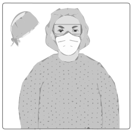
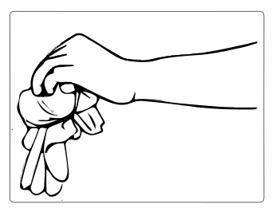
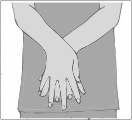
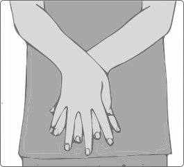
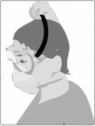
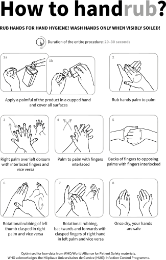
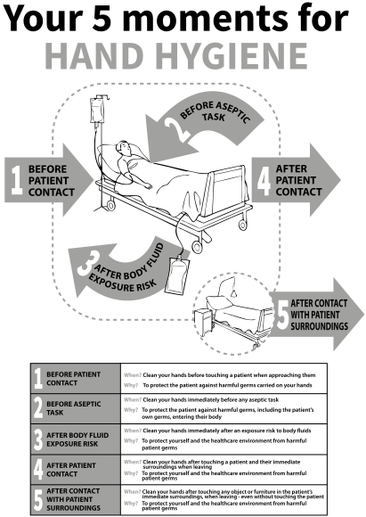

3
{:.chapter-number}

# Protection of healthcare workers

Take the chapter test before and after you read this chapter.

50073233535548

## Objectives 

When you have completed this unit you should be able to:

*	Be familiar with standard, contact and droplet precautions for Ebola
*	Understand the importance of and methods for hand hygiene
*	Know which items of personal protective equipment are required
*	Be familiar with the correct sequence for putting on and taking off protective equipment
*	Be aware of additional hazards to healthcare workers.

## Standard and isolation precautions

### 3-1 How is Ebola transmitted to healthcare workers?

The virus is transmitted through direct or indirect contact with bodily fluids from a person who is ill with Ebola (e.g. blood, urine, vomitus, faeces). Healthcare workers may become infected directly when any of these fluids enter their mucous membranes (eyes, mouth, nose), non-intact skin (open sore) or through accidental cuts or needle-stick injuries. Transmission can also occur indirectly through contact with a contaminated object, e.g. touching medical equipment, protective equipment or a surface and then touching your mouth, nose or eyes. 

### 3-2 When are healthcare workers at highest risk of contracting Ebola?

The risk to Ebola-exposed healthcare workers is greatest when they:

*	Do not consider the possibility of an Ebola diagnosis
*	Are not following procedures outlined in standard precautions guidelines
*	Are not following correct procedures for the use of personal protective equipment
*	Have contact with extremely ill or dying Ebola patients or corpses
*	Clean blood and/or body fluid spills from Ebola-infected patients.

### 3-3 What are standard precautions?

Standard infection control precautions are actions that reduce the chance of infection transmission from both known and unknown (unrecognised) sources of infection. They protect healthcare workers, patients and staff from acquiring infection. Standard precautions should be applied to *all* patients at *all* times, whether or not they are known to pose an infection risk. The reasons for using standard precautions for all patients at all times are:

*	A patient may show no signs or symptoms of infection at the time of consultation or treatment, but may be infectious (however, Ebola is not known to be infectious before symptoms are present) 
*	A patient may be an asymptomatic carrier of an organism or may be colonized with multidrug-resistant microorganisms
*	The infectious status of a patient is often only confirmed after laboratory tests or tests may not be done due to lack of laboratory facilities and/or resources
*	The clinician may fail to take a proper patient history or may not realise the possibility of an infectious cause for the patient’s symptoms.

All healthcare workers should be trained in the use of standard precautions. The diagram below shows the elements that make up standard precautions with hand hygiene, protective clothing and patient placement (isolation) being some of the most important precautions in management of Ebola cases.

> 
>
> Figure 3-1: Standard precautions
{:.figure}

> Standard precautions should be applied to all patients at all times, whether or not they are known to pose an infection risk.

### 3-4 What are transmission-based precautions?

Transmission-based precautions (TBP) are actions aimed at reducing specific modes of infection transmission, e.g. airborne precautions for tuberculosis (TB); contact precautions for Ebola. Remember that TBP are always applied in addition to standard precautions. Bear in mind too that some pathogens have more than one route of transmission, e.g. in addition to standard and contact precautions, Ebola needs droplet precautions to protect against droplet exposures of the mucous membranes and conjunctivae from splashes when patients vomit.

> Transmission-based precautions are applied in addition to standard precautions based on a pathogen’s route/s of transmission.

### 3-5 What are contact and droplet precautions?

In addition to standard precautions, these are types of transmission-based precautions applied for Ebola, and other viral haemorrhagic fevers. Ebola can be droplet spread if a patient coughs directly into someone’s face. Unlike tuberculosis, Ebola is not spread through the airborne route. For this reason airborne precautions and negative pressure ventilation are generally not required (except when performing aerosol-generating procedures, e.g. intubation, bronchoscopy). 
Droplet and airborne transmission are both forms of disease spread via the respiratory route but the precautions (actions) needed for prevention differ. Droplets are large (greater than 5 microns) and spread only about 1 metre (3 feet) from the patient. For droplet precautions, mucous membrane covers (visors/masks) are needed. Airborne spread occurs via inhalation of tiny respiratory particles (less than 5 microns) containing the pathogen. Negative pressure, closed doors and respirators for staff are needed. The table below summarises the various elements of standard, contact and droplet precautions for Ebola.

> Person-to-person spread of Ebola virus occurs through direct or indirect contact with blood and body fluids. It is not transmitted through the air.

Table 3-1: Recommended isolation precautions for Ebola
{:.table-caption}

<table>
  <thead>
    <tr>
      <th>Component</th>
      <th>Recommendation</th>
    </tr>
  </thead>
  <tbody>
    <tr>
      <td rowspan="3">Precautions required</td>
      <td>Standard precautions: For all patients at all times</td>
    </tr>
    <tr>
      <td>Contact precautions: Virus can be acquired by direct contact with blood and/or bodily fluids or indirect contact with virus-contaminated surfaces, items or equipment.</td>
    </tr>
    <tr>
      <td>Droplet precautions: Virus (in respiratory droplets), generated with forceful coughing or vomiting could spread to nearby surfaces resulting in extensive contamination.</td>
    </tr>
    <tr>
      <td>Risk-prone procedures</td>
      <td>Touching the patient, and/or blood and/or body fluids, and/or contaminated items/equipment without wearing the recommended personal protective equipment. Very high-risk procedures would include insertion and suctioning of endotracheal tubes, nasogastric tubes and surgical procedures. For aerosol generating procedures only, e.g. intubation/suctioning, airborne precautions are advised.</td>
    </tr>
    <tr>
      <td>Patient placement</td>
      <td>Ideally single room with en-suite bathroom/toilet is required, but in an outbreak setting cohort isolation is used (where two or more patients with confirmed Ebola virus disease are placed together in a single room/area). For suspected (but as yet unconfirmed Ebola cases) the same precautions apply, but these patients are cohorted in a separate location to patients with confirmed disease. Ideally the isolation area should be access-controlled, with a security officer controlling access and recording the names of healthcare workers and the times they entered the isolation area.</td>
    </tr>
    <tr>
      <td>Patient Care Considerations</td>
      <td>Keep all procedures (phlebotomy etc.) to an absolute minimum required for care. Handle contaminated needles and sharps with extreme caution, and dispose all types of contaminated sharps in a puncture-proof, sealed container. The sharps containers must be available at the point of care.</td>
    </tr>
    <tr>
      <td>Equipment and Personal Protective Equipment (PPE)</td>
      <td>In order to alert healthcare workers entering Ebola patient care areas, all entry must be restricted to staff wearing full PPE. Large, clearly understandable signs stating the requirement for contact and droplet precautions should be posted at the entrance. When seeing patients outside of an Ebola treatment unit, precautions should be applied when within 1 metre (3 feet) of a patient, including as a minimum: alcohol handrub, non-sterile gloves, disposable aprons, waterproof mask/respirator and eye protection (see detailed PPE recommendations below).</td>
    </tr>
    <tr>
      <td>Patient equipment</td>
      <td>Dedicated items/equipment or adequate cleaning with appropriate disinfection of shared equipment.</td>
    </tr>
    <tr>
      <td>Clinical Waste</td>
      <td>Put in clinical (infectious) waste box. Box to be labelled as biohazardous waste.</td>
    </tr>
    <tr>
      <td>Ventilation</td>
      <td>No special requirements.</td>
    </tr>
    <tr>
      <td>Environmental cleaning</td>
      <td>Dedicated cleaning equipment or clean room last. Terminal cleaning indicated on patient discharge. (see chapter 4)</td>
    </tr>
    <tr>
      <td>Discontinue precautions</td>
      <td>Only once patient is discharged.</td>
    </tr>
  </tbody>
</table>

## Hand hygiene

### 3-6 What is hand hygiene?

Hand hygiene is one of the most important ways to reduce the transmission of infections in healthcare settings, including outbreaks. Hand hygiene includes any activity that reduces the level of skin contamination with microorganisms, e.g. handwashing, alcohol-based handrub, antiseptic handwash and surgical handscrub.

> Hand hygiene is one of the most important ways to reduce the transmission of infections in healthcare settings.

### 3-7 Why is hand hygiene important in Ebola virus disease outbreaks?

Effective hand hygiene is an extremely important way to reduce healthcare workers’ risk of contracting Ebola. The main route of Ebola spread is through direct and indirect contact. By washing hands after all contact with patients, the patient environment, medical items/equipment and personal protective equipment, healthcare workers reduce the chances of introducing the virus to their mucous membranes.

### 3-8 Which methods of hand hygiene are recommended?

*	Routine handwashing with ordinary soap or antimicrobial soap and water should be performed for at least 40–60 seconds. This method of hand hygiene must be used when hands are visibly dirty or contaminated with blood and/or body fluids.
*	Alcohol-based handrub should be applied over the ENTIRE surface area of the hands, using proper technique (see figures at the end of the chapter). Hands should remain wet for at least 15 seconds and then allowed to dry completely (20–30 seconds altogether). Alcohol handrub is very effective but should not be used if hands are visibly soiled with dirt, blood or body fluids.

The WHO has developed 2 posters that summarise the techniques of handwashing and handrub (see end of chapter).

### 3-9 What is alcohol handrub?

Alcohol handrub is a manufactured hand hygiene product (antiseptic) containing at least 60–80% alcohol, e.g. isopropanol, ethanol or n-propanol. Emollients (moisturising agents) such as glycerol are added to reduce the drying and damaging effect of alcohol on skin. Alcohol penetrates the viral envelope (and bacterial and fungal cell membranes), causing damage to and killing the microorganism. To achieve maximal killing of microorganisms, the alcohol must be in contact with the skin for at least several seconds, at sufficient concentrations, and allowed to dry. It is almost always better to use alcohol handrub, rather than soap and water (except when hands are visibly contaminated with blood and/or body fluids). The handrub procedure is faster than hand-washing, less drying to the skin and achieves better and faster killing of microorganisms. The World Health Organization (WHO) has produced two formulations ('recipes') for pharmacies to locally produce alcohol handrub (see resources).

Note
:	Alcohol denatures the viral envelope and bacterial or fungal membranes.

> Alcohol-based handrubs are the quickest, most effective and most convenient method of hand hygiene available (when hands are not visibly contaminated).

### 3-10 What are the five moments for hand hygiene?

The World Health Organisation (WHO) has identified five times when hand hygiene should be performed by healthcare workers. They are called the 'WHO Five Moments for Hand Hygiene' and form part of a global hand hygiene awareness initiative. The five moments include:

*	Before touching a patient  
*	Before a clean/aseptic procedure or task 
*	After body fluid exposure 
*	After touching a patient  
*	After touching patient surroundings.

The last of the five moments, after contact with the patient’s surroundings, is the hand hygiene opportunity that is most often missed or not clearly understood by healthcare workers. The healthcare environment includes anything in the immediate patient’s surroundings (e.g. heart/saturation monitors, patient charts, bedside tables). Healthcare workers should take particular care to perform hand hygiene after touching these objects or surfaces.

> The 'WHO Five Moments for Hand Hygiene' are a reminder of when hand hygiene should be performed by healthcare workers.

### 3-11 Should 0.05% chlorinated solutions be used for hand hygiene?

No, this practice is not encouraged because:

*	Chlorine has not been shown to be as effective as handwashing with soap and water or alcohol handrub
*	Chlorine needs a longer skin contact time to be effective
*	Repeated washing with chlorine can irritate and/or damage the skin, which can increase the chance of Ebola virus entering the body through broken skin.

> Chlorine used as an environmental or equipment disinfectant is usually used at a strength of 0.5%. Chlorine used for skin antisepsis (washing hands/body/hair) is used at a weaker dilution of 0.05%.

## Personal protective equipment (PPE)

### 3-12 What is personal protective equipment?

Personal protective equipment (PPE) includes specialised clothing or equipment worn by healthcare workers to protect them from exposure to pathogens, e.g. gloves, aprons, face covers. It is important to note that the use of PPE is not a substitute for proper infection-control practice. For example, wearing gloves instead of washing hands is unacceptable, as healthcare workers’ hands may still become contaminated through the gloves.

> Wearing gloves instead of washing hands is not acceptable.

### 3-13 Which items of personal protective equipment are recommended for Ebola?

The recommendations for personal protective equipment (PPE) for Ebola will vary depending on the organisation or institution and which items are available at any particular time. The most important principle is that the PPE used should cover *all* of the healthcare worker’s mucous membranes and skin. In general, the following items are needed as part of the contact and droplet precautions:

*	Head and neck cover:  balaclava, hood or cap
*	Eye cover: goggles or face-shield
*	Mouth and nose cover: water-resistant mask or respirator (if not wearing a face-shield)
*	Body cover: coveralls, or waterproof gown *plus* apron
*	Foot cover: boots 
*	Hand covers: two pairs of gloves.

> 
> 
> Figure 3-2: Personal Protective Equipment (PPE) (Source: Reproduced with kind permission of the WHO Interim Infection Prevention and Control Guidance for Care of Patients with Suspected or Confirmed Filovirus Haemorrhagic Fever in Health-Care Settings, with Focus on Ebola (September 2014))
{:.figure}

### 3-14 Which types of eye protection are recommended?

Any eye-cover that adequately protects the healthcare worker’s conjunctival mucous membranes from splashes is acceptable. Either goggles or face-shields (visors) can be used. Normal reading glasses are not acceptable, as fluid splashes can still reach the wearer’s eyes. Fogging (misting up) can be a problem when using some types of goggles.

> 
> 
> Figure 3-3: Eye protection (Source: Reproduced with kind permission of the WHO Interim Infection Prevention and Control Guidance for Care of Patients with Suspected or Confirmed Filovirus Haemorrhagic Fever in Health-Care Settings, with Focus on Ebola (September 2014))
{:.figure}

### 3-15 Which types of face covers are recommended?

Healthcare workers’ need to cover the mucous membranes of the mouth and nose to avoid body fluid splashes and droplet spread. A surgical mask or N95 respirator is acceptable. The WHO recommends a structured mask, e.g. a cup-shaped or duckbill (so-called 'face-off' mask). Ideally a face-shield should be worn over the mask/respirator.

> 
> 
> Figure 3-4: Face covers (Source: Reproduced with kind permission of the WHO Interim Infection Prevention and Control Guidance for Care of Patients with Suspected or Confirmed Filovirus Haemorrhagic Fever in Health-Care Settings, with Focus on Ebola (September 2014))
{:.figure}

### 3-16 Which types of head cover are recommended?

> 
> 
> Figure 3-5: Head covers
{:.figure}

The purpose of head covers is to protect the skin and hair from virus contamination, with possible subsequent unrecognised transmission to the mucosae of the eyes, nose or mouth. A headcover that also protects the neck and sides of the head (leaving no or as little as possible skin exposed) is preferred. Hair/hair extensions should all fit inside the head cover. A balaclava provides good head and neck cover.

### 3-17 Which types of gowns are recommended?

Ideally the healthcare worker should change out of their private clothes into cool and comfortable 'underclothes' which are worn underneath the PPE. A waterproof (fluid-resistant), disposable gown or disposable coverall is then worn over this. The use of gowns versus coveralls will depend on local policy and availability, although gowns may be cooler and easier to safely remove than coveralls. If wearing a gown, the gown must be long enough to cover the top of the healthcare worker’s boots. In some countries, wearing of gowns by female healthcare workers is more culturally acceptable than coveralls.

### 3-18 Which types of footwear are recommended?

Ideally the healthcare worker should wear correctly sized gumboots. Boots are preferred over closed shoes because they are easier to clean and disinfect. In addition they provide more protection when floors are wet and can protect from sharps injuries. If boots are not available, health workers must wear closed shoes (slip-on type without shoelaces that fully cover the foot and ankles). Shoe covers (nonslip and preferably impermeable) should be used over closed shoes to facilitate decontamination. WHO does not recommend the use of overshoes if wearing boots.

> 
> 
> Figure 3-6: Footwear (Source: Reproduced with kind permission of the WHO Interim Infection Prevention and Control Guidance for Care of Patients with Suspected or Confirmed Filovirus Haemorrhagic Fever in Health-Care Settings, with Focus on Ebola (September 2014))
{:.figure}

### 3-19 Which types of apron are recommended?

Aprons must be worn over the gown or coverall to reduce contamination levels of the PPE by blood and body fluids. Both a waterproof gown *plus* apron must be used. Thin plastic aprons are disposable, whereas the heavy-duty, thick plastic aprons may be reused if safe disinfection can be ensured. 

### 3-20 Which types of gloves are recommended?

Correctly sized latex or non-sterile examination (nitrile) gloves should be used to protect against both direct and indirect contact. In all instances, double gloving (i.e. 2 layers of gloves) should be used. If gloves are damaged, torn or heavily contaminated during use, they should be replaced. Alcohol handrub should be used on the inner glove before putting on a new pair of gloves. A new pair of (outer layer) gloves should be used for each patient. For environmental cleaning or waste management, heavy-duty rubber gloves should be used.

## Using personal protective equipment (PPE)

### 3-21 What is a personal protective equipment buddy?

The putting on (donning of PPE) and removing (doffing of PPE) procedures should be supervised by a trained healthcare worker. This person, known as a 'PPE buddy', helps with the dressing procedure to ensure that there is maximum skin coverage (preferably with no skin left exposed) and that all PPE has been correctly fitted. During undressing, the buddy helps to prevent contamination with blood or body fluids transferred from the protective clothing. The PPE buddy should be appropriately dressed to avoid contaminating themselves or their clothing, i.e. long-sleeved gown, apron, mask, visor, long cuffed gloves. The procedure for putting on and taking off PPE should ideally take place in two separate areas, specifically designated for that purpose, to avoid contamination of clean PPE during undressing. There should be no crossover of staff.

> It is essential to use a PPE buddy to assist healthcare workers to put on (don) and take off (doff) their personal protective equipment for Ebola correctly.

### 3-22 How should personal protective equipment be put on?

The usual sequence for putting on (donning) PPE (assisted by the PPE buddy) is: 

1.	First pair of gloves
2.	Coverall or gown
3.	Boots
4.	Overshoes
5.	Apron
6.	Mask or N95 respirator 
7.	If using a coverall, pull hood on
8.	Goggles or visor or face-shield
9.	Balaclava or head/neck cover
10.	Second pair of gloves.

### 3-23 How should personal protective equipment be removed?

Follow your local recommended guideline for PPE removal or use the sequence recommended by the WHO:

1.	Remove the outer pair of gloves and discard immediately in a waste box (see images below). The PPE buddy sprays the worker’s hands (still in the second set of gloves) with alcohol. 
2.	Remove the plastic apron by tearing the neck strap from the back of the head (if disposable), roll it dirty side inwards. Then untie the back straps, fold inwards and keep rolling until it is completely contained into a ball and discard in waste box. If it is reusable place in a container with disinfectant.
3.	Spray inner gloved hands with alcohol rub.
4.	Remove gown by rolling it from the back towards the front with the buddy’s hands on the inside of the gown. Move it over the arms – sleeves are turned inside out -- then the gown is rolled gently into a ball away from the body. If wearing a coverall, unzip the coverall and remove the coverall hood; roll the top section of the coverall down to the hips; then when seated, pull the coverall carefully over the boots.
5.	Spray inner gloved hands with alcohol rub.
6.	Remove hood and goggles together or remove hood and then face shield.
7.	Spray inner gloved hands with alcohol rub.
8.	Remove face cover by holding the straps from the back and bringing them forward.
9.	Spray inner gloved hands with alcohol rub.
10.	Remove rubber boots and place in disinfectant.
11.	Remove inner gloves by gently rolling them off one at a time.
12.	Wash hands with soap and water and dry.

> When removing personal protective equipment (assisted by the PPE buddy), keep the eye protection until the final stages of PPE removal.

### How to remove gloves

#### Step 1

> 
> 
> Figure 3-7: Pinch one glove at the wrist level to remove it without touching the skin of the forearm, and peel away from the hand, allowing the glove to turn inside out.
{:.figure .small}

#### Step 2

> 
> 
> Figure 3-8: Hold the removed glove in the gloved hand and slide the fingers of the ungloved hand inside between the glove and the wrist. Remove the second glove by rolling it down the hand and fold into the first glove.
{:.figure .small .fixed}

#### Step 3

> 
> 
> Figure 3-9: Discard the removed gloves in an appropriate waste container.
{:.figure .small .fixed}

#### Step 4

> 
> 
> Figure 3-10: Perform hand hygiene with 70% alcohol handrub (if hands visibly clean) or with soap and water (if visibly contaminated).
{:.figure .small .fixed}

### How to remove PPE

#### Step 1

> 
> 
> Figure 3-11: Peel off plastic apron and dispose of safely (if the apron is to be reused, place in a container with disinfectant).
{:.figure .small .fixed}

#### Step 2

> 
> 
> Figure 3-12: If wearing protective overshoes, please remove them with your gloves still on. If wearing gumboots, see step 4.
{:.figure .small .fixed}

#### Step 3

> 
> 
> Figure 3-13: Remove gown and gloves and roll inside-out and dispose of safely.
{:.figure .small .fixed}

#### Step 4

> 
> 
> Figure 3-14: If wearing rubber boots, remove them (ideally using the boot remover) without touching them with your hands. Place the removed boots into a container with disinfectant.
{:.figure .small .fixed}

#### Step 5

> 
> 
> Figure 3-15: Perform hand hygiene.
{:.figure .small .fixed}

#### Step 6

> 
> 
> Figure 3-16: If wearing a head-covering, remove it now (from behind head).
{:.figure .small .fixed}

#### Step 7a

> 
> 
> Figure 3-17: Remove face protection: Remove face shield or goggles (from behind head). Place eye protection in a separate container for reprocessing.
{:.figure .small .fixed}

#### Step 7b

> 
> 
> Figure 3-18: Remove face protection: Remove mask from behind head. When removing mask, untie the bottom string first and then the top string.
{:.figure .small .fixed}

#### Step 8

> 
> 
> Figure 3-19: Perform hand hygiene.
{:.figure .small .fixed}

> Healthcare workers must take extreme caution not to contaminate themselves with blood or body fluids while removing personal protective equipment.

### 3-24 How long can one work while dressed in personal protective equipment?

When dressed in full PPE for Ebola, especially in warm climates, a healthcare worker can easily develop heat-stress and dehydration. For this reason, it is recommended that healthcare workers should spend an hour or less in the patient area before leaving and removing the PPE. Ideally, healthcare workers should mentally prepare a list of all tasks to complete while inside the patient area (e.g. observations, giving medicine, providing food) to avoid having to enter repeatedly. Staff may not re-enter the suspected cases section once they have been in the confirmed cases section.

### 3-25 Where should used, disposable personal protective equipment be discarded?

All disposable PPE items, whether visibly contaminated or not, should be discarded immediately after removal in a medical waste box (red). Do not be tempted to 'save' or 'recycle' single-use (disposable) items as the danger in disinfecting them outweighs the potential cost-saving. 

> All disposable items must be discarded in a medical waste box immediately after removal.

### 3-26 What should be done with reusable personal protective equipment?

All items that are reusable (e.g. goggles, gum boots) should be carefully placed in plastic packets during the undressing procedure. These packets are then sealed and taken by the PPE buddy to the disinfection area, where they should be immediately cleaned, disinfected and dried for subsequent use.

### 3-27 What must the healthcare worker do once all personal protective equipment has been removed?

The healthcare worker should wash hands with soap and water after removing all PPE, before leaving the undressing area. Depending on local circumstances and guidelines, a healthcare worker may then proceed to a changing area to shower and put on their own clothes. 

### 3-28 What should healthcare workers do if personal protective equipment is not available?

Caring for patients with Ebola in the absence of appropriate PPE poses a major hazard to healthcare workers. There is direct conflict between a healthcare worker’s duty of patient care and their need for self-protection (to avoid acquiring disease and being unable to care for others). There is no simple answer to this question, so healthcare workers’ would need to make a decision based on a risk-assessment of the situation.

> Healthcare workers should take every available precaution to protect themselves against becoming infected.

## Risk management

### 3-29 How can healthcare workers reduce their risk of Ebola exposure?

*	To reduce the risk of infection, healthcare workers should routinely apply standard precautions in all circumstances. 
*	Patients at risk of Ebola should be identified promptly (using the case definition) and triaged swiftly to an isolation area while waiting for assessment.
*	If Ebola is suspected, healthcare workers should use PPE as described above. Special care must be taken when removing PPE, not to become contaminated with blood and/or body fluids. 
*	Hand hygiene should be practised using the WHO 5 moments for hand hygiene indications (see figure at end of the chapter). 
*	Contact with Ebola cases should be restricted to essential, trained staff only, to reduce the number of workers exposed. 
*	Invasive procedures should be limited to absolutely essential investigations and procedures only, with extreme caution when handling and disposing of needles and sharps.
*	Contaminated surfaces and equipment must be appropriately and safely cleaned and disinfected to avoid exposure after indirect contact.

> It is very important that exposed healthcare workers follow strict protocols to protect themselves and their families.

### 3-30 How can healthcare workers reduce their risk of exposing their families?

Healthcare workers in Ebola-affected countries (who have direct patient contact) are at high risk for Ebola, especially if they do not apply precautions appropriately. Ebola is not infectious in the incubation period. As long as an individual remains healthy, they do not pose a danger to their families or colleagues. Healthcare workers with known Ebola exposure/s or those working in ETUs should carefully monitor their own health. This requires self-monitoring for possible Ebola symptoms and twice daily recording of body temperature (for 21 days after exposure, i.e. during the incubation period). Should a healthcare worker have fever or any symptoms of Ebola they should avoid all physical contact and report for Ebola testing as soon as possible. Remember that in the early stages of Ebola, the viral test (PCR) may be negative and will need to be repeated 48 hours later.

### 3-31 What other risks do healthcare workers face during outbreaks?

All healthcare workers (whether local or foreign volunteers) remain at risk for other infectious diseases that occur in the outbreak area, e.g. malaria and diarrhoeal diseases in West Africa. Adequate precautions, vaccines and/or prophylaxis should be taken as indicated. Management of non-infectious issues, e.g. road traffic accidents and non-communicable diseases in healthcare staff, may be challenging as health systems are often unable to manage in outbreak situations. Another risk in the current Ebola outbreak has been physical violence towards healthcare workers and ETUs, although this has been sporadic. 

### 3-32 How soon can healthcare workers return to routine work after returning from Ebola-affected regions?

This has been a controversial issue particularly for healthcare workers returning home to non-Ebola affected regions of the world. If they have no symptoms, healthcare workers in some settings may be allowed to return to work immediately (since individuals are not infectious during incubation). As a minimum, healthcare workers should self-monitor for Ebola symptoms and fever during the 21 day incubation period post last Ebola exposure. As a precautionary measure, many health authorities have discouraged healthcare workers from using public transport and attending mass gatherings during the 21-day post exposure period. 

> 
> 
> Figure 3-20: How to handwash (adapted for low-data access from WHO/World Alliance for Patient Safety materials.)
{:.figure .large}

> 
> 
> Figure 3-21: How to handrub (adapted for low-data access from WHO/World Alliance for Patient Safety materials.)
{:.figure .large}

> 
> 
> Figure 3-22: WHO 5 moments for hand hygiene (adapted for low-data access from WHO/World Alliance for Patient Safety materials.)
{:.figure .large}

## Case study 

A nurse from Sierra Leone is recruited to work at an Ebola Treatment Unit (ETU) in Freetown. He asks the following questions to the course facilitator during his preparatory training on Ebola Infection Prevention and Control.

### 1. When is my risk of contracting Ebola the greatest?

The risk to Ebola-exposed healthcare workers is greatest when they:

*	 Do not consider the possibility of an Ebola diagnosis in their patients
*	Are not following procedures outlined in standard precaution guidelines
*	Are not following correct procedures for use of personal protective equipment (PPE)
*	Have contact with severely ill or dying Ebola patients or corpses
*	Clean blood and/or body fluid spills from Ebola-infected patients without adequate precautions.

### 2. What can I do to reduce my risk of getting Ebola?

Healthcare workers can reduce the chance of acquiring Ebola from their patients by:

*	Routinely applying standard precautions for all patients and at all times
*	Identifying patients at risk of Ebola promptly using the case definition 
*	Removing (triaging) persons with suspected Ebola to an isolation area while waiting for assessment
*	Wearing all the recommended PPE correctly when in contact with suspected and confirmed Ebola cases
*	Taking extreme care when removing the PPE to avoid contaminated with blood and/or body fluids
*	Practising hand hygiene using the WHO 5 moments for hand hygiene indications
*	Restricting contact with Ebola cases to essential, trained staff only
*	Limiting invasive procedures for patients with Ebola to essential investigations and procedures only
*	Practising extreme caution when handling and disposing of contaminated needles and sharps
*	Paying attention to environmental disinfection of Ebola-contaminated surfaces and equipment.

### 3. What personal protective equipment will I need to wear?

The recommended personal protective equipment (PPE) for Ebola will vary depending on the organisation/institution and which items are available at any particular time. The PPE used should cover all of the healthcare worker’s mucous membranes and skin. In general, the following items are needed (as part of the contact and droplet precautions):

*	Head and neck cover: balaclava, hood or cap
*	Eye cover: goggles or face-shield
*	Mouth and nose cover: surgical mask or respirator
*	Body cover: coveralls or fluid-resistant gown *plus* apron
*	Foot cover: boots 
*	Hand covers: two pairs of gloves.

Putting on (donning of PPE) and taking off (doffing of PPE) procedures should be supervised by a trained healthcare worker. This person, known as a 'PPE buddy', helps with putting on PPE correctly, to ensure that no skin is left exposed and that all PPE has been correctly fitted. When removing PPE, the buddy helps to prevent contamination with blood and/or body fluids transferred from the protective clothing. The PPE buddy should be appropriately dressed to avoid contaminating themselves or their clothing, i.e. long-sleeved gown, apron, mask, visor, long cuffed gloves. 

### 4. Are my family at risk of getting Ebola from me?

Healthcare workers in Ebola-affected countries (who have direct patient contact) are at high risk for Ebola, especially if they do not apply precautions appropriately. Ebola is not infectious in the incubation period. As long as an individual remains symptom free (healthy), they do not pose a danger to their families or colleagues. Healthcare workers with known Ebola exposure or those working in ETU should carefully monitor their own health. This requires self-monitoring for possible Ebola symptoms and twice daily recording of body temperature (for 21 days after exposure). Should a healthcare worker have fever or any symptoms suggesting Ebola they should avoid all physical contact and report for Ebola testing as soon as possible. Remember that in the early stages of Ebola, the viral test (PCR) may be negative and should be repeated 48 hours later.
