6
{:.chapter-number}

# Resources 

## Websites

World Health Organization (WHO): www.who.int

Centers for Disease Control and Prevention (CDC): www.cdc.gov

Infection Control Africa Network (ICAN): www.icanetwork.co.za

Pro-Med Mail (outbreak updates): www.promedmail.org

## Guidelines

Interim manual - Ebola and Marburg virus disease epidemics: preparedness, alert, control, and evaluation. World Health Organization, Geneva, 2014; Available from:
http://www.who.int/csr/disease/ebola/manual_EVD/en/

Clinical Management of Patients with Viral Haemorrhagic Fever: A pocket Guide for the Front-line Health Worker. World Health Organization, Geneva, 2014.

Guideline for Isolation Precautions: Preventing Transmission of Infectious Agents in Healthcare Settings. Centers for Disease Control and Prevention, Atlanta, GA, 2007; Available from: http://www.cdc.gov/HAI/prevent/prevent_pubs.html

Standard precautions in health care AIDE-MEMOIRE. World Health Organization, Geneva, 2007; Available from: http://www.who.int/csr/resources/publications/standardprecautions/en/.

Hand Hygiene Posters. World Health Organization, Geneva, 2009. Available from:
http://www.who.int/gpsc/5may/tools/workplace_reminders/en/

Hand hygiene in health care in the context of Filovirus disease outbreak response
Rapid advice guideline. World Health Organisation, Geneva, 2014. Available from:
http://www.who.int/csr/resources/publications/ebola/hand-hygiene/en/

Glove Use Information Leaflet. World Health Organization, Geneva, 2009. Available from:
http://www.who.int/gpsc/5may/tools/training_education/en/

Personal protective equipment (PPE) in the context of filovirus disease outbreak response
Technical specifications for PPE equipment to be used by health workers providing clinical care for patients. World Health Organization, Geneva, October 2014. Available from: http://www.who.int/csr/resources/publications/ebola/ppe-guideline/en/

Guide to Local Production: WHO-recommended Handrub Formulations. World Health Organization, Geneva, 2010; Available from: http://www.who.int/gpsc/5may/tools/system_change/en/.

How to safely collect blood samples from persons suspected to be infected with highly infectious blood-borne pathogens (e.g. Ebola). World Health Organization.

WHO best practices for injections and related procedures toolkit. World Health Organization, Geneva, 2010. Available from: http://www.who.int/injection_safety/toolbox/9789241599252/en

Key questions and answers concerning Ebola health-care waste. World Health Organization, Geneva, December 2014; Available from: http://www.who.int/csr/resources/publications/ebola/health-care-waste/en/

Interim Recommendations for Cleaning Houses Safely in West Africa Ebola-Affected Areas after Persons with Symptoms of Ebola are Transferred to Ebola Treatment Units or Community Care Centers. Available from: http://www.cdc.gov/vhf/ebola/hcp/cleaning-houses-safely-in-west-africa.html

Marais F, Minkler M, Gibson N, Mwau B, Mehtar S, Ogunsola F, Banya Sama S, Corban J. A Community-engaged Infection Prevention and Control Approach to Ebola (Health Promotion International, in press)

## Appendix B: Guide to local production: WHO-recommended handrub formulations

This is intended to guide a local producer in the actual preparation of the formulation. 

### Materials required (small volume production)

#### Reagents for formulation 1

*	Ethanol 96%
*	Hydrogen peroxide 3%
*	Glycerol 98%
*	Sterile distilled or boiled water

#### Reagents for formulation 2

*	Isopropyl alcohol 99.8%
*	Hydrogen peroxide 3%
*	Glycerol 98%
*	Sterile distilled or boiled water

#### What you will need

*	10 litre glass or plastic bottles with screw-threaded stoppers (1) or
*	50 litre plastic tanks (preferably in polypropylene or high density polyethylene, translucent so as to see the liquid level (2) or
*	Stainless steel tanks with a capacity of 80-100 litres (for mixing without overflowing) (3)
*	Wooden, plastic or metal paddles for mixing (4)
*	Measuring cylinders or measuring jugs (5)
*	Plastic or metal funnel
*	100ml and 500ml plastic bottles with leak-proof tops (6)
*	An alcoholmeter: the temperature scale is at the bottom and the ethanol concentration (percentage v/v and w/w) at the top (7)

<figure>
	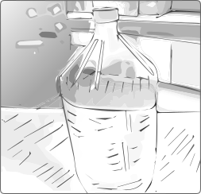
	<figcaption>Figure 6-1: 1. 10 litre glass or plastic bottles with screw-threaded stoppers
</figcaption>
</figure>

<figure>
	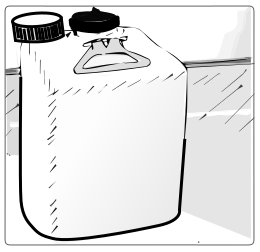
	<figcaption>Figure 6-2: 2. 50 litre plastic tanks (preferably in polypropylene or high density polyethylene, translucent so as to see the liquid level
</figcaption>
</figure>

<figure>
	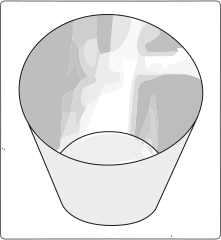
	<figcaption>Figure 6-2: 3. Stainless steel tanks with a capacity of 80-100 litres (for mixing without overflowing)
</figcaption>
</figure>

<figure>
	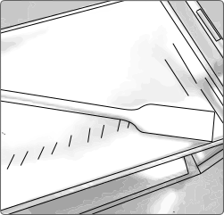
	<figcaption>Figure 6-4: 4. Wooden, plastic or metal paddles for mixing
</figcaption>
</figure>

<figure>
	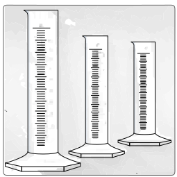
	<figcaption>Figure 6-5: 5. Measuring cylinders or measuring jugs
</figcaption>
</figure>

<figure>
	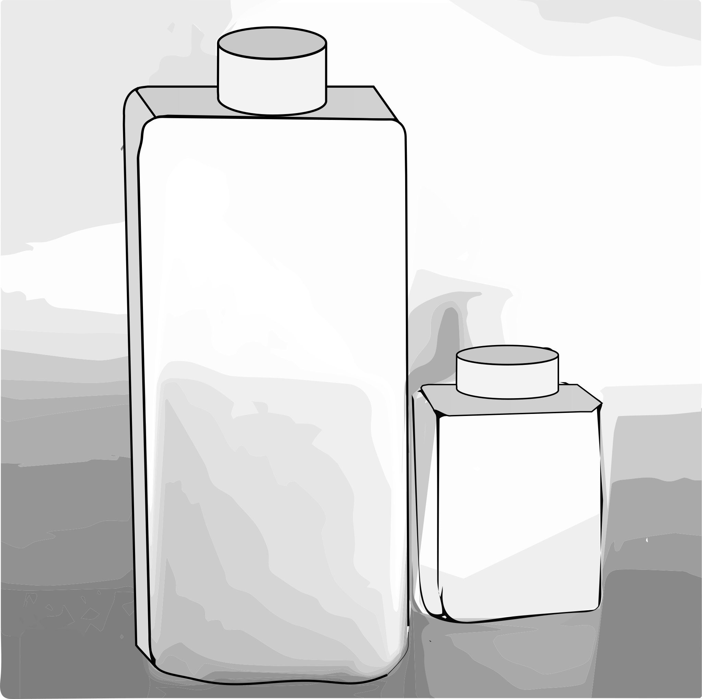
	<figcaption>Figure 6-6: 6. 100ml and 500ml plastic bottles with leak-proof tops
</figcaption>
</figure>

<figure>
	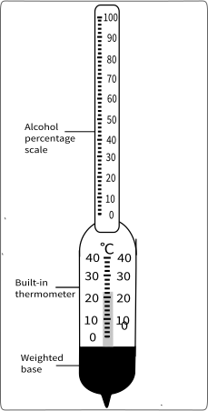
	<figcaption>Figure 6-7: 7. An alcoholmeter: the temperature scale is at the bottom and the ethanol concentration (percentage v/v and w/w) at the top
</figcaption>
</figure>

#### Note

*	Glycerol: used an humectant, but other emollients may be used for skin care, provided they are cheap, widely available and miscible in water and alcohol and do not add to toxicity or promote allergy.
*	Hydrogen peroxide: used to inactivate contaminating bacterial spores in the solution and is not an active substance for hand antisepsis. 
*	Any further additive to both formulations should be clearly labelled and non-toxic in case of accidental in-gestion.
*	A colorant may be added to allow differentiation from other fluids, but should not add to toxicity, pro-mote allergy, or interfere with antimicrobial properties. The addition of perfumes or dyes is not recom-mended due to the risk of allergic reactions.

#### General information

*	Labelling should be in accordance with national guidelines and should include the following:
*	Name of institution, date of production and batch number
*	WHO-handrub solution
*	For external use only
*	Avoid contact with eyes
*	Keep out of reach of children
*	Use: Apply a palmful of alcohol-based handrub and cover all surfaces of the hands. Rub hands until dry.
*	Composition: Ethanol or isopropanol, glycerol and hydrogen peroxide
*	Flammable: Keep away from flame and heat

#### Production and storage facilities

*	Production and storage facilities should ideally be air conditioned and cool rooms. No naked flames or smoking should be permitted in these areas.
*	WHO-recommended handrub formulations should not be produced in quantities exceeding 50 litres locally or in central pharmacies lacking specialised air conditioning and ventilation. 
*	Since undiluted ethanol is highly flammable and may ignite at temperatures as low as 10°C, production facilities should directly dilute it to the above-mentioned concentration. The flashpoints of ethanol 80% (v/v) and of isopropyl alcohol 75% (v/v) are 17.5°C and 19°C, respectively. 
*	National safety guidelines and local legal requirements must be adhered to the storage of ingredients and the final product.   

#### Method: 10 litre preparations

These can be prepared in 10 litre glass or plastic bottles with screw-threaded stoppers.

**Recommended amounts of products: Formulation 1**
{:.keep-with-next}
*	Ethanol 96%: 8333 ml
*	Hydrogen peroxide 3%: 417 ml
*	Glycerol 98%: 145 ml

**Recommended amounts of products: Formulation 2**
{:.keep-with-next}
*	Isopropyl alcohol 99.8%: 7515 ml
*	Hydrogen peroxide 3%: 417 ml
*	Glycerol 98%: 145 ml

**Step-by-step preparation**
{:.keep-with-next}

<figure>
	
	<figcaption>Figure 6-8: 1. The alcohol for the formula to be used is poured into the large bottle or tank up to the graduated mark.
</figcaption>
</figure>

<figure>
	
	<figcaption>Figure 6-9: 2. Hydrogen peroxide is added using the measuring cylinder.
</figcaption>
</figure>

<figure>
	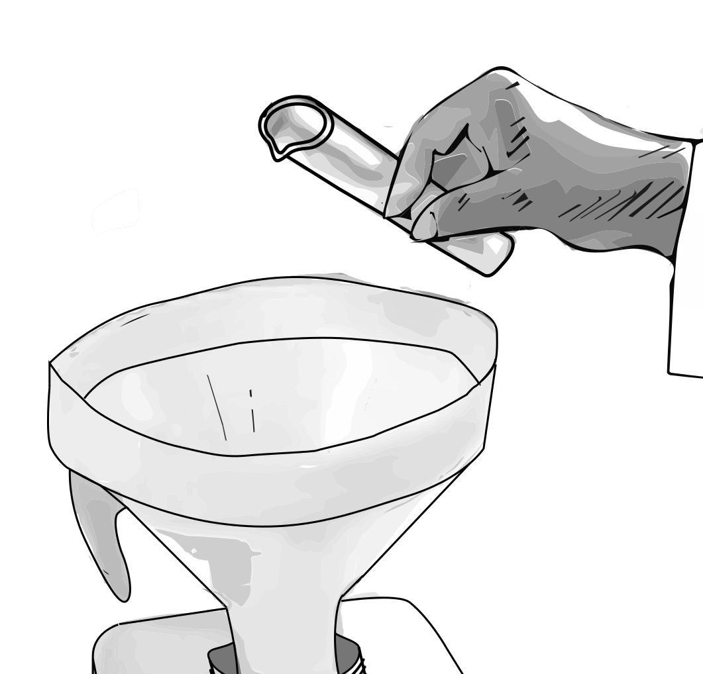
	<figcaption>Figure 6-10: 3. Glycerol is added using a measuring cylinder. As glycerol is very viscous and sticks to the wall of the measuring cylinder, it should be rinsed with some sterile distilled or cold boiled water and then emptied into the bottle/tank.
</figcaption>
</figure>

<figure>
	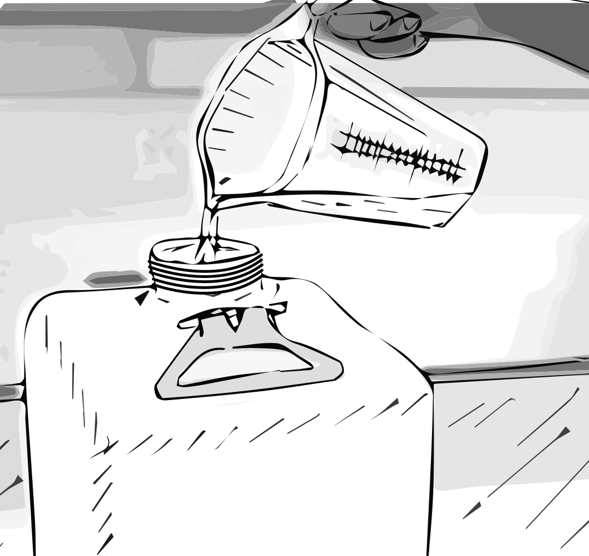
	<figcaption>Figure 6-11: 4. The bottle/tank is then topped up to the 10 litre mark with sterile distilled or cold boiled water.
</figcaption>
</figure>

<figure>
	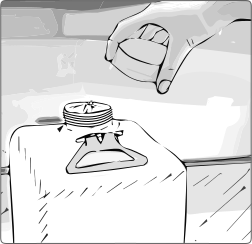
	<figcaption>Figure 6-12: 5. The lid or screw cap is placed of the tank/bottle as soon as possible after preparation in order to prevent evaporation.
</figcaption>
</figure>

<figure>
	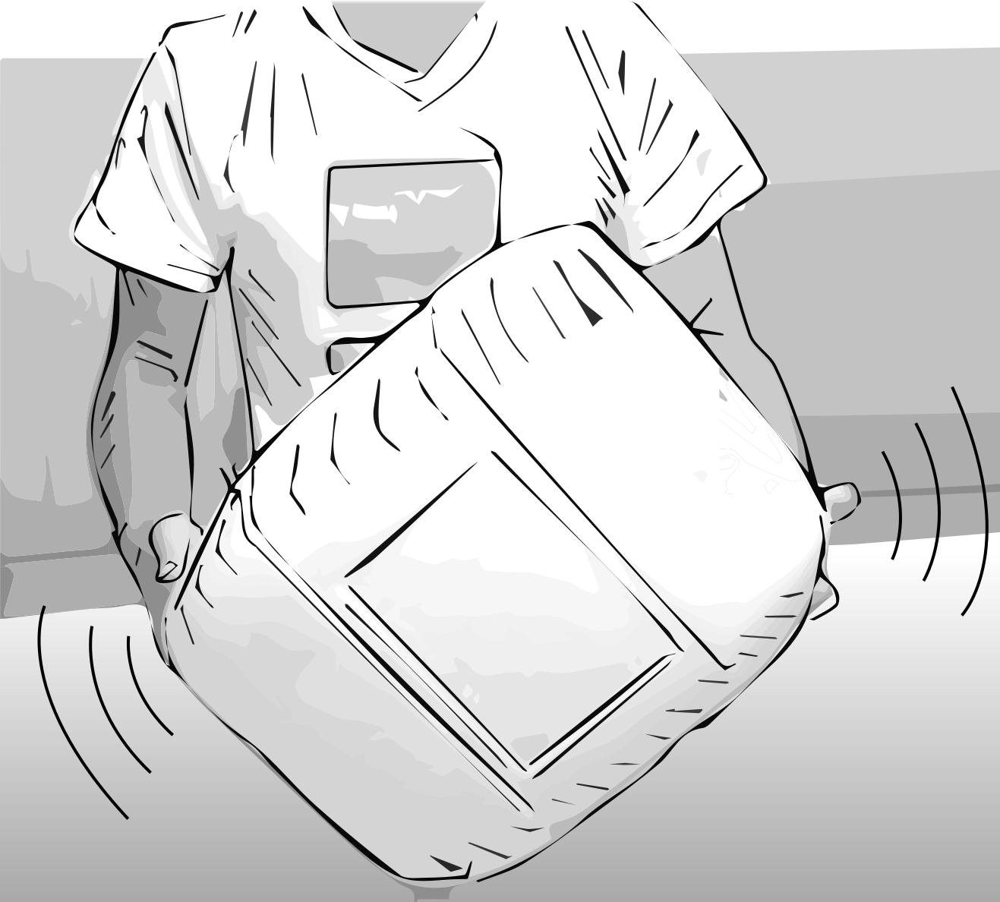
	<figcaption>Figure 6-13: 6. The solution is mixed by shaking gently where appropriate or by using a paddle.
</figcaption>
</figure>

<figure>
	
	<figcaption>Figure 6-14: 7. Immediately divide up the solution into its final containers (e.g. 500 or 100 ml plastic bottles), and place the bottles in quarantine for 72 hours before use. This allows time for any spores present in the alcohol or the newly-used bottles to be destroyed.
</figcaption>
</figure>

**Final products: Formulation 1**
{:.keep-with-next}
Final concentrations:

*	Ethanol 80% (v/v)
*	Glycerol 1.45% (v/v)
*	Hydrogen peroxide 0.125% (v/v)

**Final products: Formulation 2**
{:.keep-with-next}
Final concentrations:

*	Isopropyl alcohol 75% (v/v)
*	Glycerol 1.45% (v/v)
*	Hydrogen peroxide 0.125% (v/v)

#### Quality control

1.	Pre-production analysis should be made every time an analysis certificate is not available to guarantee the titration of alcohol (i.e. local production). Verify the alcohol concentration with the alcoholmeter and make the necessary adjustments in volume in the preparation formulation to obtain the final recommended concentration.
2.	Post-production analysis is mandatory if either ethanol or an isopropanol solution is used. Use the alco-holmeter to control the alcohol concentration of the final use solution. The accepted limits should be fixed to +- 5% of the target concentration (75%-85% for ethanol).

<figure>
	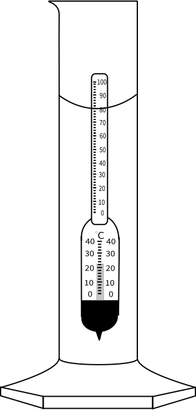
	<figcaption>Figure 6-15: Alcoholmeter in measuring cylinder showing 80%
</figcaption>
</figure>

<figure>
	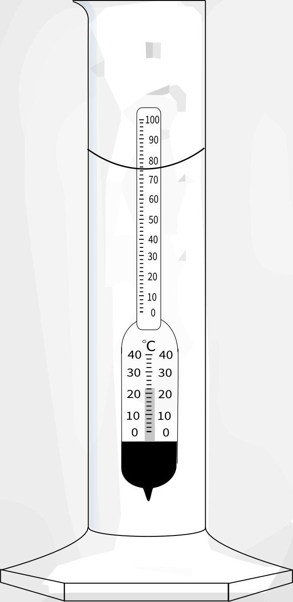
	<figcaption>Figure 6-16: Alcoholmeter in measuring cylinder showing 75%
</figcaption>
</figure>
{:.keep-with-next}
*Source: Guide to local production: WHO-recommended Handrub Formulations*

## Appendix C: Infection Control Readiness Checklist: Ebola Virus Disease

*Developed by ICAN and ISC*
{:.keep-with-next}
|-----+-------------------------------------------------------------------------------------------------------------------------------------------------------------------------------------------------------------------------------------------------------------------------------------------------------------+----------+-------------+---------------|
|     |                                                                                                                                                    Item                                                                                                                                                     | In place | In progress | Action needed |
|-----+-------------------------------------------------------------------------------------------------------------------------------------------------------------------------------------------------------------------------------------------------------------------------------------------------------------+----------+-------------+---------------|
|     |                                                                                                                                                                                                                                                                                                             |          |             |               |
| A   | Administrative/Operational support                                                                                                                                                                                                                                                                          |          |             |               |
| 1   | Infection Prevention and Control (IPC) is represented in the Hospital Operations Team preparing for Ebola/other emerging viruses                                                                                                                                                                            |          |             |               |
| 2   | There is a notification system to alert the hospital Operations and Infection Control of suspected cases of Ebola/other emerging viruses                                                                                                                                                                    |          |             |               |
| 3   | Daily surveillance reports are circulated on unexpected deaths in hospital                                                                                                                                                                                                                                  |          |             |               |
| 4   | Daily surveillance reports are circulated on unexplained illness in travellers                                                                                                                                                                                                                              |          |             |               |
| 5   | “Frontline” staff is aware of the surveillance systems and know how to notify suspected cases of Ebola and other emerging viruses                                                                                                                                                                           |          |             |               |
| 6   | There are plans in place to conduct regular in-house exercises to test systems put in place                                                                                                                                                                                                                 |          |             |               |
| 7   | A policy is in place to implement appropriate measures upon the notification of the first suspected case in the institution                                                                                                                                                                                 |          |             |               |
| 8   | A system is in place to monitor clusters of patients and staff with unexplained fever                                                                                                                                                                                                                       |          |             |               |
|     |                                                                                                                                                                                                                                                                                                             |          |             |               |
| B   | Communication                                                                                                                                                                                                                                                                                               |          |             |               |
| 1   | FAQs on infectious diseases of interest e.g. Ebola virus disease (EVD) are disseminated to all staff in the healthcare facility in particular to frontline staff                                                                                                                                            |          |             |               |
| 2   | PPE teaching posters, slides and/or video are available in appropriate languages and disseminated                                                                                                                                                                                                           |          |             |               |
| 3   | Drafts on public messaging with respect to screening and ward shutdown are ready                                                                                                                                                                                                                            |          |             |               |
| 4   | A draft press release for the first case of EVD  identified in the hospital is prepared                                                                                                                                                                                                                     |          |             |               |
| 5   | Internal communication mechanism is in place to provide regular updates to staff                                                                                                                                                                                                                            |          |             |               |
|     |                                                                                                                                                                                                                                                                                                             |          |             |               |
| C   | Education and Audit                                                                                                                                                                                                                                                                                         |          |             |               |
| 1   | There is evidence of training to ensure all healthcare workers (HCWs) know about standard precautions and isolation precautions                                                                                                                                                                             |          |             |               |
| 2   | HCWs are aware of cough etiquette and hand hygiene                                                                                                                                                                                                                                                          |          |             |               |
| 3   | Patients are aware of cough etiquette and hand hygiene                                                                                                                                                                                                                                                      |          |             |               |
| 4   | Visitors are aware of cough etiquette and hand hygiene                                                                                                                                                                                                                                                      |          |             |               |
| 5   | There are training teams in place who can rapidly train all staff in the hospital on IPC                                                                                                                                                                                                                    |          |             |               |
| 6   | There are audit teams who can audit infection control independent of the IPC teams                                                                                                                                                                                                                          |          |             |               |
| 7   | Training and competency assessments are done for the designated teams at the high risk areas on use of PPE and its removal sequence                                                                                                                                                                         |          |             |               |
| 8   | Training and exercises are conducted periodically to ensure staff competency and safety in use of PPE                                                                                                                                                                                                       |          |             |               |
| 9   | Where applicable, training and competency assessment is planned for staff handling human waste management e.g. the use of the autoclave machine                                                                                                                                                             |          |             |               |
|     |                                                                                                                                                                                                                                                                                                             |          |             |               |
| D   | Human Resources                                                                                                                                                                                                                                                                                             |          |             |               |
| 1   | All frontline healthcare workers with contact with patients have completed the mask fit test with a surgical N95 respirator                                                                                                                                                                                 |          |             |               |
| 2   | Policy is in place for HCWs who are not well or exposed to infectious agents to be given sick leave without penalty                                                                                                                                                                                         |          |             |               |
| 3   | A sick-leave policy for staff who have sick family members/dependents is in place                                                                                                                                                                                                                           |          |             |               |
| 4   | Designated teams are appointed to high-demand/risk services (e.g. infectious disease wards, emergency and intensive care units) to ensure that all the necessary clinical services are covered in the event of restriction of some HCWs from clinical service due to isolation, treatment and/or quarantine |          |             |               |
| 5   | A plan is in place to meet needs of staff for temporary accommodation for the purpose of quarantine during an outbreak                                                                                                                                                                                      |          |             |               |
| 6   | A plan is in place to provide post-exposure prophylaxis or vaccination if this is available for the emerging infectious disease                                                                                                                                                                             |          |             |               |
| 7   | A plan is in place for providing psychological support (professional counselling) to staff who were exposed, who were suspects or have loved ones who were EVD patients                                                                                                                                     |          |             |               |
|     |                                                                                                                                                                                                                                                                                                             |          |             |               |
| E   | Supplies                                                                                                                                                                                                                                                                                                    |          |             |               |
| 1   | Personal protective equipment (PPE) (i.e. medical/surgical masks, gloves, gowns, eye protection) is easily accessible to staff especially in frontline areas                                                                                                                                                |          |             |               |
| 2   | Where the supply of PPE is limited, prioritization is done for staff caring for cases                                                                                                                                                                                                                       |          |             |               |
| 3   | Stockpiling is done for essential supplies and chemoprophylaxis agents according to national guidelines                                                                                                                                                                                                     |          |             |               |
| 4   | A process is in place for checks on PPE and other stockpile items to keep items current i.e. not expired by date                                                                                                                                                                                            |          |             |               |
|     |                                                                                                                                                                                                                                                                                                             |          |             |               |
| F   | Essential support services                                                                                                                                                                                                                                                                                  |          |             |               |
| 1   | Estimation is done for additional medical and other supplies and a plan is in place to introduce a mechanism to ensure the continuous availability of these supplies                                                                                                                                        |          |             |               |
| 2   | Methods of cleaning and disinfecting the respective areas in the healthcare facilities are in accordance with the national guidelines and standards                                                                                                                                                         |          |             |               |
| 3   | Methods for the disposal of medical and non-medical solid waste are in accordance with the national guidelines and standards.                                                                                                                                                                               |          |             |               |
| 4   | Cleaning and disinfection is done for reusable equipment between patient use in accordance with current national IPC guidelines                                                                                                                                                                             |          |             |               |
| 5   | Trained cleaning personnel are appointed for the high risk areas e.g. emergency department and isolation ward                                                                                                                                                                                               |          |             |               |
| 6   | Plans exist for safe disposal of human body waste (urine and faeces) into the public system – disinfection with appropriate concentration of disinfectants OR autoclaving on-site before normal disposal process                                                                                            |          |             |               |
|     |                                                                                                                                                                                                                                                                                                             |          |             |               |
| G   | Infection Prevention and Control practices                                                                                                                                                                                                                                                                  |          |             |               |
| 1   | The IPC Department or Unit is responsible for development of evidence-based and practical IPC guidelines for the institution or publication and dissemination of the current national guidelines or international guidelines if local guidelines are not available                                          |          |             |               |
| 2   | Isolation areas/rooms for examination of suspect cases are identified in clinical areas (inpatient and outpatient)                                                                                                                                                                                          |          |             |               |
| 3   | Staff is aware of the process for safe movement of suspect patient from point of identification to examination area/room for review                                                                                                                                                                         |          |             |               |
| 4   | Isolation rooms/ward is available for use at all times in case of a suspect or probable case                                                                                                                                                                                                                |          |             |               |
| 5   | Isolation rooms should ideally be adequately ventilated single rooms (optimally ≥12 air changes per hour) and negative pressure for aerosol-generating procedures, with anteroom.                                                                                                                           |          |             |               |
| 6   | Process is in place for regular monitoring of the pressure and ventilation of the isolation rooms to ensure good maintenance ready for use                                                                                                                                                                  |          |             |               |
| 7   | There is clear identification of and restriction to the rooms, routes and buildings used in connection with patient care of patients with suspected and probable EVD                                                                                                                                        |          |             |               |
| 8   | Number of visitors is limited to those essential for patient support and they take the same IPC precautions as the health-care workers                                                                                                                                                                      |          |             |               |
| 9   | Medical/surgical masks are provided to all suspected and confirmed cases during transport                                                                                                                                                                                                                   |          |             |               |
| 10  | A particulate respirator is used during aerosol-generating procedures (e.g. aspiration of respiratory tract, intubation, resuscitation, collection of nasopharyngeal swab/aspirate, bronchoscopy, autopsy)                                                                                                  |          |             |               |
| 11  | PAPR is available when needed (as alternative to N95 mask for healthcare workers who fail to fit) and who have been adequately trained in their use, and decontamination                                                                                                                                    |          |             |               |
| 12  | Compliance to IPC guidelines related to handling laboratory specimens is audited regularly with timely feedback to stakeholders for prompt correction actions to be taken                                                                                                                                   |          |             |               |
| 13  | Compliance to IPC guidelines related to food preparation is audited regularly with timely feedback to stakeholders for prompt correction actions to be taken                                                                                                                                                |          |             |               |
| 14  | Compliance to IPC guidelines related to laundry and cleaning services is audited regularly with timely feedback to stakeholders for prompt correction actions to be taken                                                                                                                                   |          |             |               |
| 15  | Compliance to IPC guidelines related to waste management is audited regularly with timely feedback to stakeholders for prompt correction actions to be taken                                                                                                                                                |          |             |               |
| 16  | The sequence in putting on and removal of PPE is developed                                                                                                                                                                                                                                                  |          |             |               |
| 17 | Adequate alcohol handrub agents are provided at point of care areas for use of healthcare workers                                                                                                                                                                                                           |          |             |               |
| 18  | Hand moisturizer is freely accessible for use of healthcare workers to help maintain skin integrity on hands                                                                                                                                                                                                |          |             |               |
| 19  | Spill kits complete with absorbent pads and disinfectants are freely accessible in the isolation rooms for timely and prompt use by healthcare workers when required                                                                                                                                        |          |             |               |
| 20  | Healthcare workers are familiar with steps for management of spills and competent in safe execution of these steps                                                                                                                                                                                          |          |             |               |
| 21  | Staff working in high risk areas (Emergency Department, Isolation Wards) work as a team in looking out for each other on integrity of PPE during use, safe removal and compliance to IPC guidelines                                                                                                         |          |             |               |
| 22  | Where applicable, for patients discharged to home following recovery from an infectious disease, family members are instructed on the appropriate IPC measures to be taken at home                                                                                                                          |          |             |               |
| 23  | Contact tracing teams are trained and competent in contact tracing methodology                                                                                                                                                                                                                              |          |             |               |
| 24  | Policy is in place for exposure management of staff and this includes investigations, quarantine/sick leave                                                                                                                                                                                                 |          |             |               |
| 25  | Healthcare workers are familiar with steps in reporting of exposures                                                                                                                                                                                                                                        |          |             |               |
| 26  | Policy is in place for safe after death management viz. use of body bag, cleaning of corpse at clinical area                                                                                                                                                                                                |          |             |               |
|     |                                                                                                                                                                                                                                                                                                             |          |             |               |
| H   | Clinical management of patients                                                                                                                                                                                                                                                                             |          |             |               |
| 1   | Clinicians especially frontline clinicians in the ICU and EMDs are trained in recognizing the characteristics of patients with EVD                                                                                                                                                                          |          |             |               |
| 2   | Clinicians are aware of the basic principles of supportive clinical care for patients with EVD                                                                                                                                                                                                              |          |             |               |
| 3   | Laboratories have protocols in place for the detection of EVD                                                                                                                                                                                                                                               |          |             |               |
| 4   | Laboratories have protocols for the diagnosis of fever in travellers returning from west Africa in particular ruling out malaria and typhoid promptly                                                                                                                                                       |          |             |               |
| 5   | ICU facilities are available for patients with suspected and probable EVD to receive the best supportive care                                                                                                                                                                                               |          |             |               |
| 6   | Renal replacement therapy is available for patients with renal failure due to EVD                                                                                                                                                                                                                           |          |             |               |
| 7   | A process is in place for fast tracking access to any new therapeutics which might become available for treatment or chemo-prophylaxis of EVD                                                                                                                                                               |          |             |               |
|     |                                                                                                                                                                                                                                                                                                             |          |             |               |
|-----+-------------------------------------------------------------------------------------------------------------------------------------------------------------------------------------------------------------------------------------------------------------------------------------------------------------+----------+-------------+---------------|