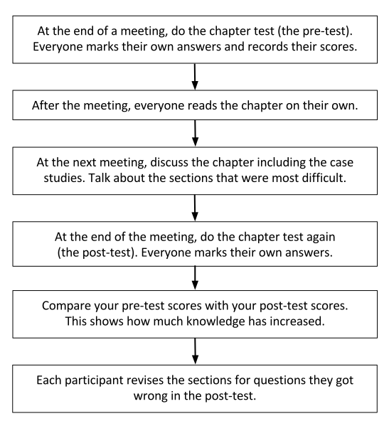

4
{:.chapter-number}

# Running a Bettercare group

## Establishing group rules

In your first meeting, you will need to establish some group rules. It’s best if the group members decide on the rules together. Ask the group members to give you some ideas of group rules. Discuss these and write them down. Some examples of rules could be:

* Group members must attend sessions and excuse themselves if they cannot.
* Members must respect different opinions and viewpoints.
* Members must listen to others in the group.
* No one should interrupt or talk over other group members.
* Debate is good, arguing is not.
* All members must prepare for group sessions.
* Everyone should participate in group discussions by listening and sharing.
	
Write the rules down on a large piece of paper and display them on the wall if possible (you can put the rules up at the beginning of the session and take them down at the end). 

## How Bettercare learning programmes work

In the first meeting, the group must read through the introduction carefully. Take time to discuss:

* what decentralised, on-site learning is,
* each person’s role in the group, and
* how the course and books work.

As a group, it is also useful to discuss at the first meeting if you would all like to take the final exam or not, but this decision does not have to be final.

## How the books work

### Objectives

These are listed at the beginning of each chapter. They highlight the most important lessons to be learned in the chapter.

### Pre- and post-tests

There is a multiple-choice test of 20 questions for each chapter provided at the end of the book. Participants should:

*  Do the test before studying each chapter (use the ‘Multiple choice answer sheet’ template at the back of the book).
* Do not look at the answers or mark their test yet.
* Do the test again after they have studied the chapter (using a new ‘Multiple choice answer sheet’).

When both tests have been completed, each participant can look up the correct answers and mark their own pre- and post tests. If any answers in the post test are wrong, participants should study those sections of the chapter again and repeat the test before moving on to the next chapter. 

You should all discuss the difficult sections of that chapter in the group meeting each week. Each chapter needs to be studied and understood before moving on to the next chapter. Some chapters may require more than one meeting to make sure everyone fully understands. Some chapters are very short and you may be able to discuss two in one meeting.

Group members should keep track of their pre- and post-test results to track their learning. It is important that participants take responsibility for assessing their own progress through the book. You will find a template at the back of this guide that can be used for keeping track of pre- and post test scores.

### Important lessons and key concepts

> Important lessons are shown like this.

### Notes

Notes, in smaller writing, give non-essential information. This is for the participants’ interest. These facts are not used in the case studies, multiple-choice tests or the exam. 

Note
:	Notes are shown like this.
	
### Case studies

Each chapter ends with a few case studies. These help participants to apply what they have learnt in the chapter. The case studies give the participant the opportunity to see a problem as it usually presents itself in real life. You can go through these case studies and the answers to them in your group sessions. Group members can take turns in reading the case studies aloud and others can answer the questions.

### Practical training

Skills workshops are very useful for a practical example of how the skills you learn in a Bettercare course are used. Skills workshops are not examined in the final exam, but you may want to arrange your own tests moderated by a senior medical or nursing colleague.

### Final examination

When you and participants have finished the course, for a fee you can take a 75-question multiple-choice exam. If you pass you will receive a certificate of completion in the post. This certificate proves that you have completed the Bettercare course for which you studied. You can take the exam as many times as you like, but you will need to pay the administration fee each time.

If you and your group are interested in writing the exams, please email exams@bettercare.co.za and we will send you a PDF version of the exam and the memo.

You can read more about the exam process in Chapter 6: Finishing a Bettercare course.

## Planning for group sessions

It’s helpful to have a predictable structure for each group session. You can do this by making a simple lesson plan. A lesson plan is a list of the steps you will follow in the session. The main parts of a lesson plan are:

* an introduction that describes why the lesson is important or useful
* the learning objectives
* a schedule or list showing the order of activities
* a list of resources needed for the lesson
* a description of what needs to be prepared in advance
* the time each activity should take
	
Example lesson plan
{:.table-caption}

<table>
  <tr>
    <th>Lesson Plan: 13/03/2015</th>
    <th>Newborn Care, Chapter 3: The routine care of normal infants</th>
  </tr>
  <tr>
    <td>Introduction</td>
    <td>This lesson is important because: it is essential to be able to,tell the difference between a normal newborn infant  and an infant that needs more specialised care to prevent complications from happening.</td>
  </tr>
  <tr>
    <td>Learning objectives</td>
    <td>By the end of the chapter, participants should be able to: Manage a normal infant at delivery. Assess a newborn infant after delivery. Give routine care to a healthy infant. Advise a mother about the care of a normal infant. Appreciate the importance of the road-to-health card.</td>
  </tr>
  <tr>
    <td>Schedule</td>
    <td>1. Discuss what has been studied before the session. 2. Skills workshop. 3. Post-test multiple-choice and mark pre- and post tests. 4. Pre-test multiple-choice for next section.</td>
  </tr>
  <tr>
    <td>Resources</td>
    <td>Qualified doctor to present skills workshop (only necessary for skills chapters) Photos/videos of normal infants Pens and paper</td>
  </tr>
  <tr>
    <td>Advance preparation</td>
    <td>Invite doctor to present and demonstrate (only necessary for skills chapters) Obtain infant model or get permission and consent for demonstration on an infant in the newborn nursery</td>
  </tr>
  <tr>
    <td>Time needed Total time: 80 minutes</td>
    <td>Discussion: 30 minutes Skills workshop: 20 minutes (only necessary for skills chapters) Post-test multiple-choice and marking: 20 minutes Pre-test multiple-choice (for next section): 10 minutes</td>
  </tr>
</table>

Keep your lesson plan short and simple. You can use the lesson plan template at the end of this guide to help you plan your lessons. 

## Inviting resource people

Occasionally you will need to invite a co-worker to give a demonstration or a talk to the group. Try to get to know the various health professionals who have expertise in the area of healthcare that you are studying. Ideally find people at your own facility or at nearby clinics and hospitals. You can ask co-workers to refer you to people who have helped them in the past or who are particularly knowledgeable. Make a note of these people and their contact details in your diary or facilitator’s file. You can use the template at the end of this guide to keep a record of contact details.

You can contact resource people via email, phone or in person. It is often easiest and quickest to speak to someone in person or on the phone, so you can answer any questions they might have immediately and give them a clear explanation of what you need them to do. 

When you invite someone, you need to be clear about what they have to do. Give/send them a copy of the skills workshop they will be covering, and remember to give them clear information about the time and place of the meeting. Give the resource person a reminder phone call the day before.

If you like, you can give the demonstrator a small gift to show your appreciation. A card signed by the members of the group is meaningful and doesn’t cost a lot of money.

## Preparing for group sessions

Each member of the group studies the material that is going to be covered before the session. As the facilitator, you must study the material too. The group members can make a list of questions they would like to discuss in the meeting and note any sections they found difficult. 

Make sure you have everything you will need in the session, for example, equipment you need for the demonstrations. 

## Using the multiple-choice tests

All participants, including the facilitator, do the pre-test at the end of the meeting before you study the chapter. You then all do the post test after you have discussed the chapter at the next meeting and learnt from one another. When both tests have been completed, each participant should look up the correct answers and mark their own pre- and post test. If any answers are wrong in the post test, participants should study those sections of the chapter again by themselves and repeat the test before moving on to the next chapter. A participant might ask for your help after a meeting if they find a chapter very difficult. If you have the time, set up an individual meeting with them to go through what they are struggling with. You could also refer them to a participant who did well in that particular chapter.

Discuss the pre- and post-test results in the group. They will help you to identify which sections need more work. However, results are personal and if an individual does not want to share this information, they should not be forced to.

You can photocopy the template multiple-choice test answer sheets at the end of this guide. Participants will need two answer sheets for each chapter (one for the pre-test and one for the post test).

Participants also need to record their pre- and post test scores to see if they are improving. A template scorecard can be found at the back of the book.

*Figure 4-1: Using the multiple choice tests*