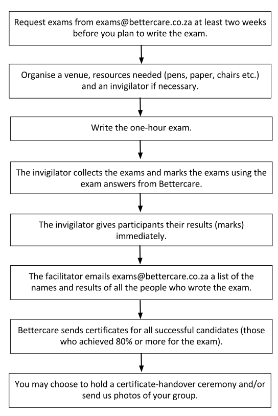

6
{:.chapter-number}

# Finishing a Bettercare course

## Completing the course with an exam

When your group has worked through the entire book, you can choose take a formal 75-question multiple-choice examination administered by Bettercare. It is not required for every member of the group to take the exam even if the majority would like to: it should be an individual choice.

The exam questions are taken from the multiple-choice tests in the book. The content of the skills workshops and notes will not be included in the examination.

### How to request exams

Exam papers can be requested from exams@bettercare.co.za. The exam paper and answer sheet will be emailed (or posted if necessary) to the exam co-ordinator or group facilitator. 

Please state clearly which course exam you require (this is the same as the name of the book). It’s best to request the exam paper at least two weeks before you would like to write the exam

### Writing the exam

* As the facilitator, you will need to arrange a venue for the exam. The venue should have enough tables and chairs for each person writing the exam to have their own. Each person will also need a pen or pencil and an exam answer sheet.
* You will also need an exam coordinator (an objective invigilator who supervises the exam process). If, as the course facilitator, you have already completed the exam or choose not to take it, you can act as the exam coordinator. If you have facilitated the course, but would like to write the exam, you need to arrange for someone else to act as the exam coordinator. 
* The time needed to write the exam is one hour, but writers should arrive at the venue at least 15 minutes before the exam is due to start so that they can find a seat, make sure they have everything they need and get ready to write.
* The exam co-ordinator should monitor the time and let those writing know when there are 30 minutes left (half-way) and again when there are only 10 minutes left. A clock in the exam venue is also helpful to the people who are writing the exam.
* When time is up, everyone must hand in their answer sheets to the exam coordinator.

### Marking completed exams

The correct answer sheet will be emailed to you, the group facilitator, along with the exam. It is password protected and must not be looked at before the exam is complete. Once the exam is complete, the group facilitator should mark the exams immediately and give the participants their results. 

### Getting certificates for completed exams

Once the exam has been written, you need to send a list of the names of the people who wrote the exam, with their mark (out of 75) to exams@bettercare.co.za. 

Participants need to achieve at least 80% (60/75 or more) in the exam to successfully complete the course and qualify for a certificate. Certificates with the successful candidates’ names will be posted to the group facilitator. 

Being a successful Bettercare Group Facilitator requires initiative and leadership skills. Because of this, we want to reward our facilitator’s for the important role they play in the empowerment and training of healthcare workers. If more than half (50%) of your group members who write the exam qualify for a certificate, we will also mail you a Bettercare Group Facilitator certificate acknowledging your leadership capability and commitment to a goal. You can earn one of these certificates for each different Bettercare course that you facilitate (e.g. one for Newborn Care and another one for Childhood HIV).

## Arranging a certificate-handover ceremony

Once members of your group have completed the course and passed the exam, you may want to have a certificate-handover ceremony to honour the graduates. 

The ceremony does not have to be fancy or time-consuming – a simple handover and public acknowledgement during a morning or lunch break would be fine. If Bettercare graduates would like to invite family or friends to the ceremony, it helps to make the occasion special. If there is any leftover money in the budget, you can buy a few snacks for graduates and guests. Alternatively, you could add this into the budget in the planning stages of the course.

## The Bettercare exam process

## Photographs

We would love to feature photographs of your groups on our website – you can send photos of your group during your weekly sessions, while doing skills workshops or at the certificate-handover ceremony and we will add them to our website. Please email photographs with names to info@bettercare.co.za, with your name and contact phone number. 

## Updating the course material

Bettercare learning materials are regularly updated to keep up with developments and changes in healthcare. Feedback from participants helps us to continuously improve our learning material. You can help by letting us know about factual or language errors, sections that are difficult to understand or by suggesting additions to the contents. Please send any comments or suggestions to info@bettercare.co.za.

## Your next Bettercare course

We have an extensive range of Bettercare titles. Once you have completed a course, we encourage you to look at others that might interest you or your colleagues as we believe that well-trained healthcare workers are empowered healthcare workers.  Different members at your institution can take turns in being the group facilitator for different courses.

## CPD points

Certain courses also offer CPD points for doctors. The following courses offer CPD points:

Maternal Care: 7 CPD points at level 2i  
Newborn Care: 7 CPD points at level 2i  
Perinatal HIV: 7 CPD points at level 2i  
Primary Newborn Care: 7 CPD points at level 2i  
Saving Mothers and Babies: 7 CPD points at level 2i  
Intrapartum Care: 7 CPD points at level 2i  
Mother and Baby Friendly Care: 7 CPD points at level 2i  
Primary Maternal Care: 7 CPD points at level 2i  
Birth Defects: 7 CPD points at level 2i   

Please contact the Perinatal Education Programme for more information about CPD points.