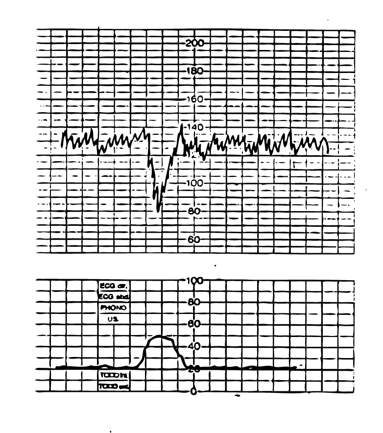
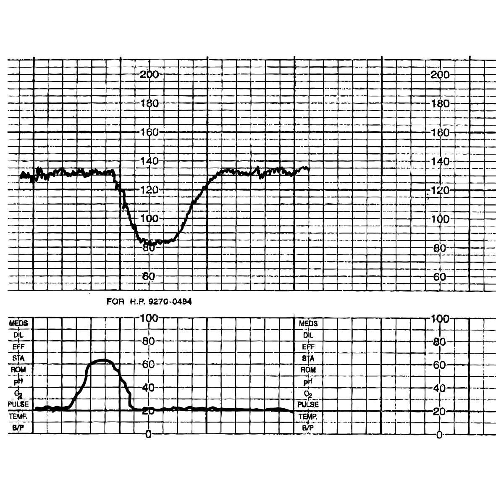

10
{:.chapter-number}

# When to use a cardiotocograph 

## Contents
{:.non-printing}

*   [When should a cardiotocograph (CTG) trace be obtained?](#when-should-a-cardiotocograph-CTG-trace-be-obtained?)
{:.chapter-toc}

### 59. When should a cardiotocograph (CTG) trace be obtained?
If the fetal heart rate pattern (baseline tachycardia or bradycardia or decelerations) is not normal and suggest fetal distress or an increased risk of fetal distress, continuous monitoring with a CTG is indicated if this is available. A CTG will help decide whether fetal distress is present or not. It will also help identify fetal distress if it does develop later in labour. There is no need for routine continuous CTG monitoring in low risk labours if the fetal heart rate pattern is normal when assessed with a fetal monitor. 

**Examples of abnormal fetal heart rate patterns on a CTG trace** 

These fetal heart rate patterns on a CTG trace help to learn how to recognize some of the same patterns of deceleration when using a fetal monitor. A fetal monitor may miss variable decelerations. Unlike a fetal monitor, variable decelerations and variability of the fetal heart rate can be easily recognised on a CTG trace. When repeated late decelerations occur, normal variability is reassuring that the fetus is not hypoxic.
{:.allow break}

> 
>
> Figure 10-1: An early deceleration shown on a CTG trace. The top trace shows the fetal heart rate, while the bottom trace shows the uterine contraction. Note that the deceleration only occurs during the contraction.
{:.figure .fixed}

> 
> 
> Figure 10-2:  Late deceleration shown on a CTG trace. The top trace shows the fetal heart rate, while the bottom trace shows the uterine contraction. Note that the late deceleration only occurs towards the end of the contraction.
{:.figure .fixed .large}

When using a cardiotocograph, a late deceleration is diagnosed when the lowest point of the deceleration occurs 30 seconds or more after the peak of the contraction. Late decelerations with a loss of variability or a baseline bradycardia with loss of variability indicates severe fetal distress.
The variability of the fetal heart rate should always be evaluated if a CTG trace is available. Variability is the alteration in the baseline heart rate, measured over a period of one minute between contractions. The variation in rate is normally five beats or more per minute, giving the baseline a spiky appearance. A loss or reduction in variability to less than five beats per minute gives a flat baseline and usually indicates fetal distress. However it may also occur if the fetus is asleep. The period of reduced variability when the fetus is asleep will not exceed 45 minutes. If the mother has received analgesics (pethidine, morphine), magnesium sulphate, corticosteroids or sedatives (phenobarbitone) the variability may also be reduced. 

A good variability (five beats or more per minute) indicates that the fetal condition is good. Poor variability with early, variable or late decelerations strongly suggests fetal hypoxia. If the variability of the fetal heart rate is good (five beats or more), a decrease of the fetal heart rate of 10 beats or more during a contraction is considered a deceleration on a CTG trace. If the variability is poor (less than five beats), a decrease of the fetal heart rate of five beats or more during a contraction is considered a deceleration.