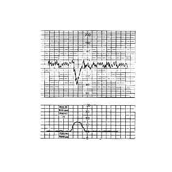

7
{:.chapter-number}

# Using a partogram

## Contents
{:.non-printing}

*   [What is a partogram?](#what-is-a-partogram?)
*   [How are the fetal observations recorded on the partogram?](#how-are-the-fetal-observations-recorded-on-the-partogram?)
{:.chapter-toc}

### 54. What is a partogram? 

This is a graphic representation of all the observations made during labour. The maternal condition, fetal condition and the progress of labour are carefully recorded. The correct use of a partogram is one of the most important steps in the safe management of labour. The partogram helps to identify problems and plan further management. 

### 55. How are the fetal observations recorded on the partogram? 

The observations of the fetus must be recorded on the partogram as shown in Figure 7-1: 

1. The fetal heart rate, presence or absence of decelerations, and type of decelerations must be recorded.
2. It must also be recorded whether the amniotic fluid is clear or meconium stained once the membranes have ruptured.

> 
> 
> Figure 7-1: Recording fetal observations on the partogram
{:.figure .fixed .medium}

The condition of the mother, progress of labour and any management decisions must also be recorded in the appropriate places on the partogram.