

	

		<a href="newborn-care/0-3-contents.html" title="Newborn Care">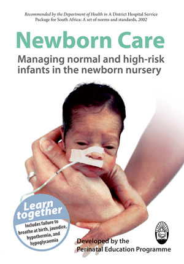</a>
	
		

	
<!--.index-available-->

	

		<h1>Coming soon</h1>
	
		<a href="#" title="Adult HIV">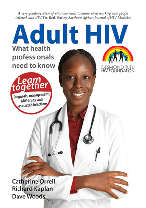</a>

		<a href="#" title="Birth Defects">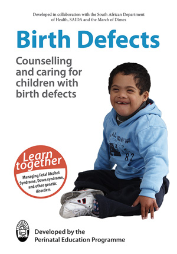</a>

		<a href="#" title="Breast Care">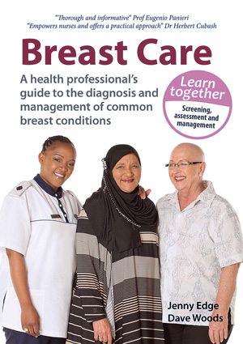</a>

		<a href="#" title="Child Healthcare">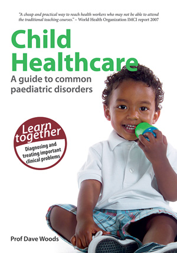</a>

		<a href="#" title="Childhood HIV">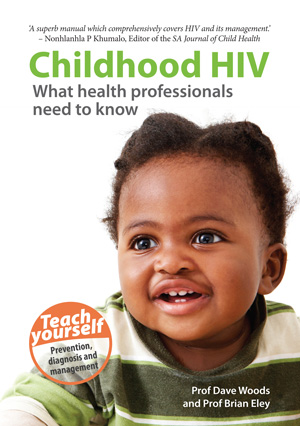</a>

		<a href="#" title="Childhood TB">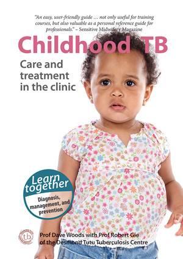</a>

		
		
		<a href="#" title="Facilitator's Guide">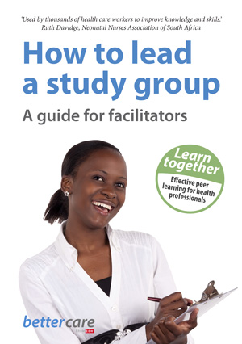</a>
		
		<a href="#" title="Infection Prevention and Control">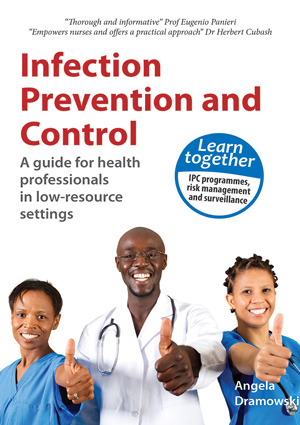</a>
		
		<a href="#" title="Intrapartum Care">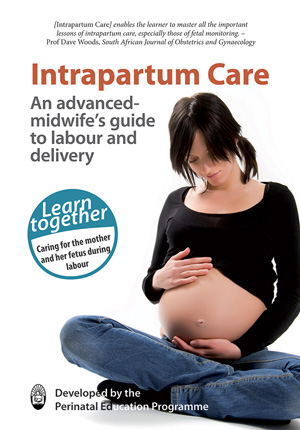</a>

		<a href="#" title="Maternal Care">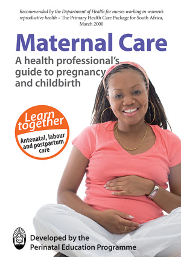</a>

		<a href="#" title="Maternal Mental Health">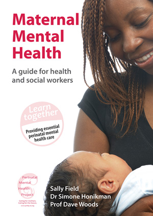</a>

		<a href="#" title="Mother and Baby Friendly Care">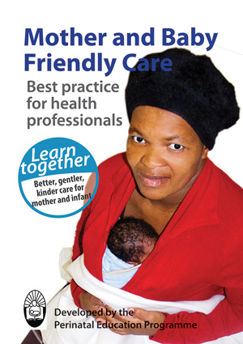</a>

		<a href="#" title="Perinatal HIV">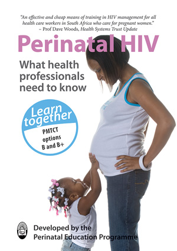</a>

		<a href="#" title="Primary Newborn Care">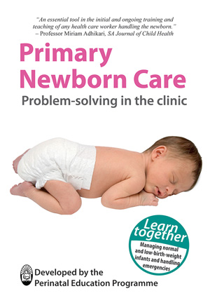</a>

		<a href="#" title="Saving Mothers and Babies">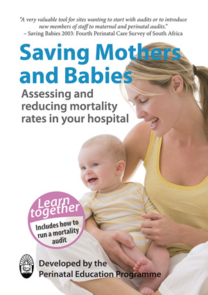</a>

		

	
<!--.index-coming-soon-->
		

<!--#chooser-->

{:.index-logo}
