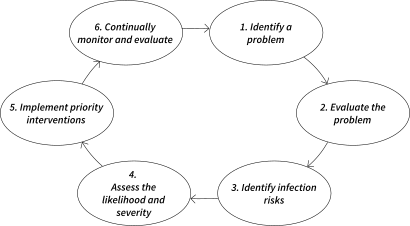
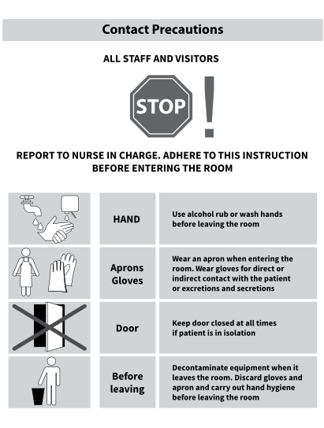
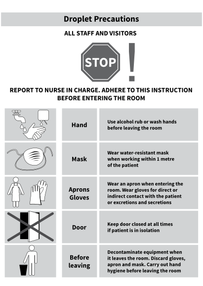
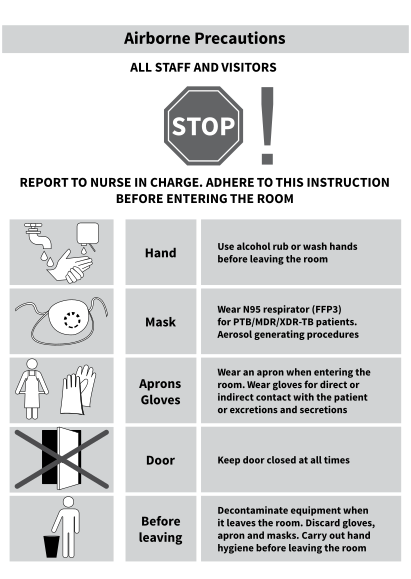

3
{:.chapter-number}

# Risk management in IPC

## Objectives 

When you have completed this chapter you should: 

*	Understand how to perform a risk assessment
*	Be able to stratify risk
*	Understand how to manage risk 
*	Be familiar with standard and transmission-based precautions
*	Understand when and how to use personal protective equipment
*	Be familiar with injection safety initiatives and re-use prevention devices
*	Be able to describe the purpose and types of care bundles.

## Risk assessment in IPC 

### 3-1 What is risk assessment in IPC? 

Risk assessment (RA) is a process that:

*	Identifies hazards (dangers)
*	Evaluates the risk associated with that hazard
*	Determines appropriate ways to eliminate or control the hazard.

In other words, RA is a detailed examination of potential or existing hazards in healthcare: 

*	To identify factors (policies, environment, practices, processes) that may cause harm to patients, staff and/or visitors. 
*	To evaluate how likely the event is and how serious the hazard is.
*	Then decide what steps should be taken to prevent or control the harm from happening.

> Risk assessment is a process that identifies, evaluates and establishes ways to eliminate or control medical hazards.

### 3-2 What are the key steps in performing a risk assessment in IPC?

The following steps can be applied in RA for IPC: 

#### 1. Identify a problem, hazard or threat 

For example, a high rate of needlestick injuries (NSI) among staff

####2. Evaluate the problem (to establish the size and context of the problem) 

For example, get data on the rate of NSI, the type of NSI, which staff were affected, when, where and how the injuries happened (in theatre, while recapping a needle).

#### 3. Identify infection risks (use a structured approach) 
For example, identify all points of risk for NSI, e.g. when taking blood from uncooperative patients; when staff are tired (post-call); no eye protection in casualty, etc.

#### 4. Assess the likelihood of occurrence and consequences of infection

For example, NSI is a frequent occurrence at your facility and your patient population has a high HIV and hepatitis B prevalence, so consequences of infection would 
be severe.

#### 5. Determine and implement priority interventions to manage the risk

For example, priority interventions for your facility: training of all staff in sharps management, sharps containers in all rooms or ensure eye shields available in casualty/obstetrics.

#### 6. Continually monitor the risk and evaluate the success of your interventions

For example, keep records of all NSI before, during and after the interventions, monitor how well the interventions were implemented, improve policies and re-train staff periodically. 

> 
> 
> Figure 3-1: Risk assessment in IPC
{:.figure}

### 3-3 When should risk assessment in IPC be performed? 

Risk assessment should be performed when:

*	A new IPC service is established (looking specifically at standard precautions, transmission-based precautions, infection surveillance, cleaning, laundry and waste management, reprocessing of re-usable instruments, and renovation projects)
*	A new piece of clinical equipment or instrument is procured
*	A new procedure or diagnostic test is implemented
*	A problem in IPC practice, policy or related issue is identified
*	At least annually to re-evaluate the priorities for your facility’s IPC programme.

### 3-4 Who should perform risk assessment in IPC? 

Ideally RA in IPC is best performed by an experienced IPC practitioner. Input should be gathered from staff in the clinical area concerned (e.g. casualty and theatre staff for needlestick injuries). The IPC practitioner may need assistance from clinicians, laboratory staff or data managers, depending on the location and type of hazard being investigated.  

### 3-5 How is risk categorised in IPC? 

Risk can be categorised as high, medium or low risk depending on the severity of the consequences of any particular hazard. For example, not wearing gloves when obtaining a blood sample would pose a low risk of infection to a healthcare worker. Handling a patient’s central venous catheter without performing hand hygiene would be medium risk. 
A high risk of infection would arise if a clinician performed an aseptic procedure (e.g. surgery) without performing adequate hand antisepsis. 

## Risk management in IPC

### 3-6 What is Risk management in IPC? 

Risk management (RM) is a structured method to identify, evaluate, avoid or reduce hazards in healthcare. RM assists with prioritising risks and is an essential part of the quality management programme.

> Risk management is an essential part of quality management programmes in healthcare. 

### 3-7 What is the purpose of performing risk management in IPC?

There are many reasons for performing RM in healthcare including:

*	To improve clinical practices
*	To increase safety of patients, healthcare workers and visitors
*	To reduce rates of healthcare-associated infections (HAI).

### 3-8 Which elements are needed for successful risk management in IPC? 

The following key elements will help to produce successful RM projects:

*	An active IPC committee: assists with risk assessment and implementation of IPC measures
*	Robust policies and procedures: lay the foundation for good institutional IPC practice
*	Effective healthcare leadership: commitment, clinical role-models and the provision of the resources to implement RM interventions
*	Clinician ownership: ensures that staff support RM processes and are accountable
*	Education and in-service training: are essential parts of any RM intervention.

## Standard and transmission-based precautions

### 3-9 Which IPC programmes exist to reduce risk of HAI?

There are several IPC programmes and interventions designed to reduce the risk of infection transmission in healthcare including:

*	Standard precautions 
*	Transmission-based precautions
*	Procedure-based precautions
*	Injection safety and re-use prevention (RUP) programmes
*	Care bundles.  

### 3-10 What are standard precautions?  

Standard precautions (previously called universal precautions) reduce the chance of infection transmission from both known and unknown (unrecognised) sources of infection. They protect healthcare workers, patients and staff from acquiring infection. Standard precautions should be applied to all patients in all circumstances, whether or not they are known to pose an infection risk. All healthcare workers should be trained in the application of standard precautions. Each of the standard precautions are addressed in more detail in the following chapters:

Table 3-1: Further details on standard precautions
{:.table-caption}

|--------------------------------------------------+---------|
|               Standard precaution                | Chapter |
|--------------------------------------------------+---------|
| Hand hygiene                                     |       4 |
| Personal protective equipment                    |       3 |
| Safe injection practice and sharps management    |       3 |
| Waste management                                 |       6 |
| Patient placement (isolation)                    |       5 |
| Cough etiquette (respiratory hygiene)            |       8 |
| Linen handling and segregation                   |       5 |
| Occupational health                              |       1 |
| Decontamination of equipment and the environment |       6 |
|--------------------------------------------------+---------|

> Standard precautions should be applied to all patients in all circumstances, whether or not they are known to pose an infection risk.

> 
> 
> Figure 3-2: Standard precautions
{:.figure}

### 3-11 What are transmission-based precautions? 

Transmission-based precautions (TBP) are interventions put in place to reduce the chance of infection transmission for particular pathogens, e.g. airborne precautions for TB. Remember that TBP are always applied in addition to standard precautions. Bear in mind too that many pathogens have more than one route of transmission, e.g varicella (chickenpox) will need both airborne and contact precautions. The table below compares and summarises the precautions needed for each of the three major routes of transmission.

Table 3-2: Transmission-based precautions for the three major routes of transmission (adapted from S Mehtar: Understanding Infection Prevention and Control, Juta, 2010.)
{:.table-caption}

|----------------------------------------------------------------------------------------------------------------------------------+--------------------------------------------------------------------------------------------------------------+---------------------------------------------------------------------------------------------------------------------------------------------------+-------------------------------------------------------------------------------------------------------------------------------------------------------------------------------------------------------------------|
|                                                         Precaution type                                                          |                                                   Contact                                                    |                                                                      Droplet                                                                      |                                                                                                     Airborne                                                                                                      |
|----------------------------------------------------------------------------------------------------------------------------------+--------------------------------------------------------------------------------------------------------------+---------------------------------------------------------------------------------------------------------------------------------------------------+-------------------------------------------------------------------------------------------------------------------------------------------------------------------------------------------------------------------|
| Indication                                                                                                                       | Patients known to be colonised or infected.                                                                  | Patients with infections spread by large respiratory droplets.                                                                                    | Patients with pathogens spread in small particles (known as aerosols).                                                                                                                                            |
| Area of risk                                                                                                                     | Pathogens acquired by touching the patient or any surfaces/equipment that the patient has had contact with.  | Pathogens (in respiratory droplets) spread less than 1  xand settle onto the surrounding surfaces.                                                | Pathogens (aerosols) spread from the patient and may also settle onto surfaces.                                                                                                                                   |
| Example diseases                                                                                                                 | Diarrhoeal disease; Skin/wound infections, many other bacterial infections and colonising bacteria.          | Meningococcal meningitis; Influenza; mumps, Rubella, Diphtheria, other respiratory viruses, e.g. adenovirus, RSV, rhinovirus, and many others.    | Tuberculosis; Measles; Chickenpox (varicella) – note also requires contact precautions.                                                                                                                           |
| Risk-prone procedures                                                                                                            | Wound dressings, vaginal or rectal exams, contact with body fluids                                           | Insertion and suctioning of endotracheal tubes, nasogastric tubes, bronchoscopy.                                                                  | Insertion and suctioning of endotracheal tubes,  bronchoscopy, sputum production. Consider obtaining sputum samples outdoors if possible.                                                                         |
| Patient placement                                                                                                                | Ideally single room, but cohort isolation* or ward placement if no options.                                  | Ideally single room with en-suite bathroom or *cohort isolation. If not available, place on ward near open window with curtains closed around bed | Do not admit unless clinically indicated. Single room with door closed at all times. Cohort isolation if no single rooms. Preferably en suite                                                                     |
| Equipment and Personal Protective Equipment (PPE)                                                                                | Contact precautions signage on door/bed                                                                      | Droplet precautions signage on door/bed                                                                                                           | Airborne precautions signage on closed door                                                                                                                                                                       |
|                                                                                                                                  | alcohol handrub                                                                                              | alcohol handrub                                                                                                                                   | alcohol handrub                                                                                                                                                                                                   |
|                                                                                                                                  | non-sterile gloves                                                                                           | non-sterile gloves and apron only  if indicated for a procedure                                                                                   | non-sterile gloves and apron for intubation, suctioning, bronchoscopy                                                                                                                                             |
|                                                                                                                                  | disposable aprons                                                                                            | surgical mask and eye protection when within 1 metre of patient.                                                                                  | N95 respirators for staff, patient to wear surgical mask when staff are in the room.                                                                                                                              |
|                                                                                                                                  | dedicated equipment or adequate cleaning of shared equipment.                                                |                                                                                                                                                   |                                                                                                                                                                                                                   |
| Waste                                                                                                                            | Put in clinical (infectious) waste box.                                                                      | Put in clinical (infectious) waste box                                                                                                            | Put in clinical (infectious) waste box.                                                                                                                                                                           |
| Ventilation                                                                                                                      | No special requirements                                                                                      | No special requirements.                                                                                                                          | Negative pressure ventilation with 6–12 air changes per hour.If negative pressure is not possible, explore all options to increase air exchange naturally, directing air flow away from other patients and staff. |
| Environment                                                                                                                      | Dedicated cleaning equipment or clean room last. Terminal cleaning indicated on patient discharge            | Dedicated cleaning equipment or clean room last. Terminal cleaning indicated on patient discharge.                                                | Dedicated cleaning equipment or clean room last. Terminal cleaning indicated on patient discharge                                                                                                                 |
| Discontinue precautions                                                                                                          | Only if patient is proven to be clear of colonisation or infection, ideally only once patient is discharged. | When patient’s symptoms have resolved or once patient is discharged                                                                               | When patient’s symptoms have resolved, when they are no longer infectious or once patient is discharged.                                                                                                          |
|                                                                                                                                  |                                                                                                              |                                                                                                                                                   |                                                                                                                                                                                                                   |
| *cohort isolation: placing two or more patients with the same disease (caused by the same micro-organism) together in isolation. |                                                                                                              |                                                                                                                                                   |                                                                                                                                                                                                                   |
|----------------------------------------------------------------------------------------------------------------------------------+--------------------------------------------------------------------------------------------------------------+---------------------------------------------------------------------------------------------------------------------------------------------------+-------------------------------------------------------------------------------------------------------------------------------------------------------------------------------------------------------------------|

> Transmission-based precautions are applied in addition to standard precautions based on a pathogen’s route/s of transmission. 

> 
> 
> Figure 3-3: Contact precautions (Adapted from *Infection Prevention and Control Manual*, Tygerberg Academic Hospital, Cape Town, South Africa, 2012)
{:.figure}

> 
> 
> Figure 3-4: Droplet precautions (Adapted from *Infection Prevention and Control Manual*, Tygerberg Academic Hospital, Cape Town, South Africa, 2012)
{:.figure}

> 
> 
> Figure 3-5: Airborne precautions (Adapted from *Infection Prevention and Control Manual*, Tygerberg Academic Hospital, Cape Town, South Africa, 2012)
{:.figure}

### 3-12 What are procedure-based precautions?

This is the requirement for specific interventions, to reduce risk of infection, during a specified procedure. For example, in order to place a central line in a patient, the healthcare worker should apply hand hygiene, proper skin antisepsis, wear appropriate personal protective equipment, use maximal barrier precautions (drapes), use sterile instruments and perform the entire procedure aseptically. 

## Use of personal protective equipment

### 3-13 What is personal protective equipment?

Personal protective equipment (PPE) includes any item designed to protect healthcare workers from exposure to pathogens, e.g. gloves, aprons, facecovers. It is important to note that the use of PPE does not replace the need for good IPC practices. For example, wearing gloves instead of washing hands is unacceptable as healthcare workers’ hands may still become contaminated through the gloves.

> The use of personal protective equipment (PPE) does not replace the need for good infection control practices.

### 3-14 When is personal protective equipment required?

PPE is required for most clinical procedures and aseptic tasks. PPE is also required for domestic, waste management and sterile services department staff. The figure below indicates which PPE are required for certain commonly performed tasks and procedures.

|         Procedure          | Hand hygiene                    |      Gloves                 |     Aprons                 | Masks                     |      Eye covers                     |
|                            | |   |  |  |       |
|----------------------------+---------------------------------+-----------------------------+----------------------------+---------------------------+-------------------------------------|
| IV cannulation             | ✓               | ✓                 |                 |                 |                       |
| Wound dressing             | ✓               | Aseptic technique |                 |                 |                       |
| Insertion of NG tube       | ✓               | ✓                 |                 |                 |                       |
| Insertion of airway        | ✓               | ✓                 |                 | ✓               | ✓                     |
| Dental procedures          | ✓               | ✓                 | Coats           | ✓               | ✓ (High-speed drills) |
| Suturing                   | ✓               | ✓ Sterile         | ✓               | ✓               |                       |
| Central line insertion     | ✓               | ✓ Sterile         | ✓ Sterile gown  | ✓               | ✓                     |
| Urinary catheter insertion | ✓               | ✓ Sterile         | ✓               |                 |                       |
| Fibre-optic procedures     | ✓               | ✓                 | ✓               | ✓               | ✓                     |
| Delivery (labour)          | ✓               | ✓                 | ✓ Sterile gown  | ✓               | ✓                     |
| Surgery (clean and dirty)  | ✓               | ✓ Sterile         | ✓ Sterile gown  | ✓               | ✓                     |
| Lumbar puncture            | ✓               | ✓ Sterile         | ✓ Sterile gown  | ✓               |                       |
|----------------------------+-----------------+-------------------+-----------------+----------------- +-----------------------|

Figure 3-6: Appropriate use of personal protective equipment (PPE) for common procedures (Adapted from Z cards, S. Mehtar, 2010)
{:.figure-caption}

### 3-15 When is personal protective equipment not required? 

No protective equipment is needed for routine patient care (e.g. turning, feeding or washing a patient), unless the patient is nursed under transmission-based precautions.

### 3-16 Where should personal protective equipment be available?

PPE should be easily available in all clinical areas. They should be located close to the point-of-care to encourage high rates of staff compliance. If certain items of PPE, e.g. N95 respirators are locked away or not easily accessible, staff will not make the effort to use them. Alternatively, if an item of PPE is in short supply, staff will re-use single-use items, e.g. plastic aprons, which increases the risk of infection transmission.

### 3-17 What should be considered when purchasing personal protective equipment?

Only good quality PPE should be procured (ideally after consultation with the IPC practitioner). The purchase of low-quality items often ends up costing healthcare facilities more, since several items have to be used for a single task, e.g. gloves that tear easily.  A variety of sizes of each type of PPE, e.g. gloves, N95 respirators, will be needed to ensure that all staff can find a product that fits correctly. Consideration must also be made for staff members with latex allergy (powder-free gloves and alternative products, e.g. neoprene or nitrile gloves should be available). 

### 3-18 How should IPC be involved in personal protective equipment procurement?

Ideally when new PPE products are introduced, the procurement department should send product samples to the IPC practitioner and clinicians for evaluation. Based on the feedback from IPC and the clinical users, the procurement department should consider all factors (quality, ease of use, availability) and not only cost, before deciding on procurement and tenders. Where items already on tender are found to be defective or of poor quality, the IPC practitioner should report this to procurement and facility management.  

## Injection safety and re-use prevention devices

### 3-19 What is injection safety?

Injections are one of the most commonly used methods to deliver preventive or curative therapy, e.g. immunisations, intromuscular antibiotics and for obtaining blood samples for analysis. Injections can be given into several different spaces, e.g. intradermal, intramuscular, intravenous, intrathecal (by lumbar puncture) or into joint spaces. Injection safety is the over-arching term that refers to the prevention of infection transmission through elimination of unsafe injection practices. 

> Injection safety refers to the prevention of bacterial infection and blood-borne virus transmission through elimination 
of unsafe injection practices.

### 3-20 What is an unsafe injection?

An unsafe injection can include any of the following practices:

*	Re-use of disposable (single-use) needles and syringes 
*	Drawing multiple doses into a syringe and injecting several patients consecutively 
*	Using a single syringe for multiple patients (changing the needle for each patient)
*	Using multi-dose vials that are pierced by a single needle to draw up the contents
*	Re-capping of needles 
*	Leaving contaminated sharps to be disposed of by someone else
*	Separation of the needle and syringe before disposal 
*	Disposal of needles or syringes in general waste containers
*	Attempted disinfection of needles or syringes (for re-use) with disinfectant, water or flames. 

### 3-21 Which diseases are transmitted by unsafe injections?

The major infection risks from unsafe injections include:

*	Bacterial or fungal infection (introduced from unsterile needles/syringes/fluids or through poorly cleaned skin prior to injection)
*	Blood-borne virus infections, e.g. HIV, hepatitis B and C.

### 3-22 How large is the problem of unsafe injection practices? 
The World Health Organization (WHO) estimates that globally up to four injections are administered per person every year. They estimate that up to 70% of injections given in low-income countries are unsafe. This leads to millions of exposures and infections especially with blood-borne viruses annually, most of which are undocumented.  

> Up to 70% of injections given in low-income countries are unsafe.

### 3-23 Which global programmes target the issue of injection safety?

The “Safe Injection Global Network” (SIGN) is a WHO-affiliated partnership between multiple stakeholders worldwide that aims to achieve safe and appropriate use of injections. In the United States of America, the Centers for Disease Control (CDC) affiliated programme on injection safety is called “The One & Only Campaign”.  These campaigns aim to promote the use of needles, syringes, and single-dose medication vials “only one time, for one patient”. Both the WHO and CDC have useful educational material and toolkits on injection safety available for download from their websites.

### 3-24 What are “safety-engineered” and “re-use prevention” devices?  

Safety-engineered devices include:

*	Devices designed to prevent re-use of needles or syringes
*	Devices designed to prevent needlestick injury
*	Devices designed to achieve both prevention of re-use and needlestick injury.

> Safety-engineered devices reduce the risk of needlestick injury and re-use prevention devices discourage healthcare workers from recycling needles and syringes.

### 3-25 What types of safety-engineered and re-use prevention (RUP) devices are available? 

Examples of safety-engineered devices for needlestick injury prevention include:

*	Retractable lancets (the lancet disappears under a plastic hood after use)
*	Retractable needles (the needle is pulled into injection chamber after use)
*	Needle guards (a sleeve moves over the needle after use)
*	Safety catheters (a metal cap moves over the tip of the stylet after the catheter is withdrawn).

Examples of RUP devices include:

*	Fixed needles (the needle is permanently attached to the syringe, encouraging the user to discard them as a single unit)
*	Auto-disable syringes (the plunger cannot be pulled out after use).

## Care bundles 

### 3-26 What is a care bundle?

Care bundles are a group of interrelated best practices used to prevent device- and procedure-related healthcare-associated infections, e.g. catheter-associated urinary tract and surgical site infections.

There is strong evidence of effectiveness for each element of a care bundle. Each bundle element can individually improve care, but when all elements are applied together, substantially greater reductions in infection rates are achieved. The focus of measurement is the completion of the entire bundle as a single intervention, rather than completion of individual elements, a so-called all-or-nothing approach.

In South Africa, the “Best Care Always” campaign is involved in supporting bundle implementation in both public and private healthcare facilities.

> A care bundle is a group of interrelated best practices used to prevent device- and procedure-related healthcare-associated infection. 

### 3-27 What is the purpose of care bundles?   

Care bundles provide a proven method to reduce specific types of healthcare-associated infections. These programmes are very effective in motivating, organising and encouraging communication among clinical teams around a specific problem, e.g. the staff of an intensive care unit or surgical ward. 

### 3-28 Who should be involved in care bundle programmes?

When implementing a care bundle it is important to involve a multidisciplinary team, e.g. doctors, nursing staff, theatre staff, respiratory therapists (as appropriate to the specific bundle).

All stakeholders have to “buy-in” to the process, as care bundles require the active participation and support of the entire healthcare team. Programmes built on team consensus are much more effective. It is very useful to identify a project champion, a recognised leader/expert who is actively involved in the clinical care of the individual ward or unit.

> Implementation of a care bundle requires the active participation of the entire healthcare team on a particular ward or unit. 

### 3-29 What types of care bundles exist? 

The following bundles are commonly used in a variety of healthcare settings:

Device-associated bundles:

*	Central line-associated bloodstream infection (CLABSI) bundle
*	Ventilator-associated event (VAE) bundle
*	Catheter-associated urinary tract infection (CA-UTI) bundle. 
Procedure-associated bundles:

*	Surgical site infection (SSI) bundle.

### 3-30 What is included in the central line-associated bloodstream infection (CLABSI) bundle?  

The elements of the CLABSI bundle include:

1.	Hand hygiene (during insertion and maintenance of the catheter)
2.	Maximal barrier precautions upon insertion (the person inserting the catheter should wear a sterile gown, sterile gloves, hair cover and surgical mask with the patient covered with sterile drapes)
3.	Optimal insertion site selection (the subclavian vein is the preferred insertion site, followed by jugular vein, with the inguinal vein being least preferred because of microbial contamination of the surrounding skin)
4.	Skin preparation with alcohol in 2% chlorhexidine gluconate (preferred over povidone iodine)
5.	Daily review of line necessity (remove any line that is no longer needed)
6.	Line maintenance (wear gloves when handling the line, swab the hubs with alcohol before accessing, change dressings as needed, change administration sets every 96 hours).

### 3-31 What is included in the ventilator-associated event (VAE) bundle?  

The elements of the VAE bundle include:

1.	Elevation of head of bed by 30–45 degrees (to reduce the risk of aspiration of secretions)
2.	Periodic sedation vacations (stop sedatives intermittently to assess if the patient is ready for extubation)
3.	Daily assessment of readiness to extubate
4.	Peptic ulcer disease prophylaxis (not required in paediatrics)
5.	Deep venous thrombosis prophylaxis (not required in paediatrics).

### 3-32 What is included in the catheter-associated urinary tract infection (CA-UTI) bundle?  

The elements of the CA-UTI bundle include:

1.	Avoid unnecessary urinary catheters
2.	Insert urinary catheters using aseptic technique
3.	Maintain urinary catheters based on recommended guidelines
4.	Review urinary catheter necessity daily and remove as soon as possible.

Other important aspects of urinary catheter management (not part of the bundle) include:

*	Using a single-use packet of sterile lubricant jelly for insertion
*	Selecting the appropriate catheter size 
*	Securing the catheter well
*	Maintaining a sterile closed system (do not allow the catheter bag to lie on the floor and do not lift the bag above the level of the bladder, otherwise urine will move back up the catheter).

### 3-33 What is included in the surgical site infection (SSI) bundle?  

The elements of the SSI bundle include:

1.	Antibiotic prophylaxis (administered in the hour before the first skin incision is made)
2.	Skin preparation (ideally with alcohol in 2% chlorhexidine gluconate, preferred over povidone iodine)
3.	Maintenance of postoperative normothermia (normal body temperature) and glucose control
4.	Maintenance of normovolemia (normal hydration status).

Other important aspects in prevention of SSI (not part of the bundle) include:

*	Get patients to do a chlorhexidine bath or shower before surgery
*	Remove hair at the surgical site, only if necessary and preferably with clippers or depilatory agents. Razors should not be used for hair removal because they irritate or cut the skin and make it easier to develop an infection
*	Thorough cleaning and sterilisation of surgical equipment (devices)
*	Thorough cleaning and disinfection of the operating theatre environment between cases
*	Traffic control in operating theatres
*	Excellent adherence to hand hygiene (on the post-operative ward).

### 3-34 How is the bundle compliance rate measured? 

Checklists are prepared for each bundle element. A witness verifies that each bundle element was complied with. The checklist is then scored as “compliant” if all bundle elements were implemented or “non-compliant” if any bundle elements were missing. Non-compliance to one element of the bundle means non-compliance to the whole bundle.  The calculation of compliance is then performed as:

(Number of checklists that showed full compliance ÷ Total number of checklists) × 100

### 3-35 What is the effect of bundle compliance on infection rates?

As the bundle compliance rate increases, the healthcare-associated infection rate (for the specific infection event being monitored) should decrease. 

Table 3-3: Example of bundle compliance (adapted from the Institute for Healthcare Improvement (IHI))
{:.table-caption}

|---------------------------+------------+------------+----------+-----------|
|                           | March 2013 | April 2013 | May 2013 | June 2014 |
|---------------------------+------------+------------+----------+-----------|
| UTI bundle compliance (%) | 30         | 23         | 68       | 88        |
| CA-UTI rate               | 11.4       | 13.8       | 9.6      | 5.1       |
|---------------------------+------------+------------+----------+-----------|

### 3-36 How are infection rates calculated for each care bundle?

A systematic surveillance system is needed for the specific infection type being targeted, e.g. surveillance for surgical site infections if the SSI bundle is being implemented. This will allow the clinical team to objectively measure the success of bundle implementation.

For device-related infections, a denominator (known as device days) must be counted and used in the calculation formula. The device days are counted as the number of patients with the indwelling device of interest (e.g. central catheters) in place for the period of interest (usually calculated monthly). For surgical site infections, the number of infections is usually divided by the total number of surgeries or type of surgeries during the chosen time period (month). 

*	CLABSI rate = (number of CLABSI events ÷ number of central line days) × 1000
*	CA-UTI rate = (number of CA-UTI events ÷ number of urinary catheter days) × 1000
*	VAE rate = (number of VAE events ÷ number of ventilator days) × 1000
*	SSI rate = (number of SSI ÷ number of surgeries) × 1000

An example of a calculation of the CA-UTI rate for a Urology Ward in September 2013 follows.

Five patients developed a CA-UTI (physician and/or laboratory confirmed UTI were included in the surveillance programme). A total of 290 urinary catheter days were counted (30 patients had a catheter in for six days each, 20 patients had a catheter in for five days each, one patient had a catheter in for 10 days = 290). The formula to calculate the CA-UTI rate is:

CA-UTI rate = (5 CA-UTI events ÷ 290 urinary catheter days) × 1000 = 17.2 CA-UTI per 1000 catheter days

### 3-37 How successful are care bundles in reducing healthcare-associated infection rates?

In both high-income and low-resource settings, there is ample published evidence that properly implemented care bundles are very effective at reducing infection rates. The most common infection across all healthcare settings are CA-UTI, so improvements in this area can result in substantial cost savings for facilities. The infections associated with highest mortality are CLABSI and VAE, so implementation of these bundles, particularly in intensive care settings can improve overall patient outcomes and save costs. 

> Well-implemented care bundles can reduce infections, mortality and healthcare costs, even in low-resource settings. 

### 3-38 What challenges may be encountered when implementing care bundles?

Implementing a care bundle is not an easy task and requires a team effort. Common challenges to programme implementation and sustainability are:

*	Lack of accountability: there may be a gap between established guidelines and what is practised in reality in a particular unit or facility
*	Fear of or resistance to change: staff are often reluctant to change existing practices 
*	Communication breakdown: implementation of such a project needs to be discussed with all stakeholders, and regular feedback to encourage staff efforts is essential
*	Lack of staff commitment: care bundles take a lot of time and effort to sustain and some staff see these programmes as just an additional work burden
*	Sustaining the new and additional practices: there is often an initial enthusiasm for the project, but as months pass it becomes more difficult to sustain the staff’s interest and commitment to the project
*	Leadership for change: strong leadership and identified project champions (clinical and managerial) are important
*	A culture of safety: staff need to realise that infection is not an inevitable consequence of care.

## Case study 1

A child is admitted to the paediatric ward with gastroenteritis and a diagnosis of rotavirus infection is confirmed on stool analysis. The IPC practitioner is made aware of the situation and she advises the ward staff to follow strict standard and transmission-based precautions.  

### 1. Which type of precautions should be adopted in patients with rotavirus gastroenteritis?

Patient isolation, standard precautions, contact AND droplet precautions should be implemented for rotavirus gastroenteritis. Rotavirus is one of several communicable diseases that have more than one route of transmission.

### 2. Which standard precautions should be implemented to prevent the rapid spread of infection in the paediatric ward?
Handwashing with soap and water or a sufficient amount of alcohol handrub may be used before and after touching the patient. Personal protective equipment (for contact and droplet transmission) should be worn. Terminal cleaning and disinfection of the environment and equipment will be required.

### 3. What are the key elements of contact precautions for such cases?

*	Use clean, non-sterile gloves for all episodes of direct patient contact
*	Change the gloves after each patient contact
*	Use gowns (disposable or re-washable) or disposable aprons for each patient contact
*	Use dedicated specific equipment for a single patient
*	Limit patient contact with other patients by isolating the child OR
*	Cohort the patient in a room with other patients who have rotavirus infection.

## Case study 2

A nurse giving an injection to an ICU patient from a multi-dose vial is pricked while re-capping the needle. He washes the blood off his hand with soap and running water. He immediately tries to find out the patient’s HIV- and hepatitis B and C status.

### 1. Why is it essential to know the patient’s HIV- and hepatitis status?

The contaminated syringe might transmit blood-borne viruses including hepatitis B, C and HIV.

### 2. What precautions should the nurse have taken to avoid this incident?

Used needles should not be re-capped. They should be immediately disposed of in a puncture-proof sharps box located within arm’s reach of the procedure. 

### 3. What are the prerequisites to make the healthcare workplace safer? 

1.	Plan for safe handling and disposal before beginning any procedure using needles
2.	Modify the work practices that pose a needlestick injury hazard
3.	Promote safety awareness in the work environment.

### 4. What precautions should be adopted to avoid contamination of multi-dose vials? 

*	A new needle and syringe should be used every time the contents of a multi-dose vial are withdrawn. 
*	The multi-dose vial cap (septum) should be disinfected with an alcohol swab prior to piercing. 

## Case study 3

An obstetric patient with obstructed labour had to undergo Caesarean section. After three days, a purulent (pussy) discharge was observed at the wound site. Bacteriological culture showed the growth of methicillin-resistant Staphylococcus aureus, which was successfully treated with antibiotics.

### 1. Which factors influence the risk of surgical site infection?

*	The duration of an operation
*	The patient’s pre-operative physical status
*	Pre-operative antibiotics within one hour of primary skin incision
*	Microbial contamination of the surgical site
*	Pre-operative skin preparation.

### 2. What can the healthcare workers do to reduce the risk of surgical site infection? 

Comply with good surgical practice: 

*	Take care to clean the hands and arms up to their elbows with an antiseptic agent just before the surgery 
*	Wear personal protective equipment (PPE) consistently and properly – hair covers, masks, gowns, and gloves during surgery
*	Keep the surgery area clean
*	Practise good hand hygiene on the ward.

### 3. What additional precautions should be taken to prevent surgical site infection? 

*	Get patients to do a chlorhexidine bath or shower before surgery
*	Clean the skin site with an antimicrobial agent
*	Remove pubic hair at the surgical site, only if necessary and preferably with clippers or depilatory agents. Razors should not be used for hair removal because they irritate or cut the skin and make it easier to develop an infection
*	Ensure diabetic patients have good blood glucose control in the peri-operative period.

### 4. What practices and policies should be followed to prevent surgical site infection? 

*	Thorough cleaning and sterilisation of equipment
*	Thorough cleaning and disinfection of the operating theatre environment
*	Traffic control in operating theatres
*	Maintain operating theatre under positive pressure ventilation
*	The operative site should be prepared and disinfected properly
*	Adherence to hand hygiene should be strictly followed.

## Case study 4

A patient admitted in the critical care unit with haemorrhagic stroke needed to have a urinary catheter inserted. After 48 hours he reports symptoms of a urinary tract infection. His doctor sends a urine sample for culture. A pathogen is cultured and the patient’s infection is successfully treated with antibiotics. The patient’s overall condition improves and his urinary catheter is later removed. 

### 1. What could his healthcare workers have implemented to prevent the urinary tract infection?

The catheter-associated urinary tract infection (CA-UTI) care bundle should have been implemented to reduce the risk of catheter-related infections.

### 2. What elements are included in the CA-UTI bundle?

*	Avoid unnecessary urinary catheters
*	Insert urinary catheters using aseptic technique
*	Maintain urinary catheters based on recommended guidelines
*	Review urinary catheter necessity daily and remove promptly.

### 3. What other factors are important for preventing CA-UTI?

*	Practise hand hygiene immediately before insertion of the catheter
*	Practise hand hygiene before and after any manipulation of the catheter site or apparatus
*	Use gloves, a drape, and antiseptic solution for cleaning the urethral meatus 
*	Use a single-use packet of sterile lubricant jelly for insertion
*	Select the appropriate catheter size and technique for catheter insertion
*	Secure the catheter well
*	Maintain a sterile closed system
*	Do not allow the catheter bag to lie on the floor and do not lift the bag above the level of the bladder (otherwise urine will move back up the catheter).

### 4. Who is responsible for implementing the care bundles?

The IPC practitioner together with clinicians should provide education about the benefits of care bundles and the ward staff should ensure implementation and compliance with all bundle elements.