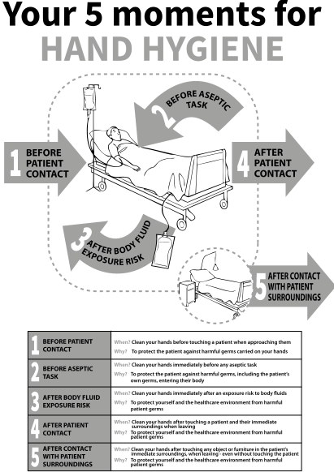
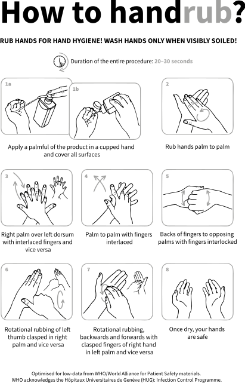

4
{:.chapter-number}

# Hand hygiene

Take the chapter test before and after you read this chapter.



## Objectives 

When you have completed this chapter you should: 

*	Understand the importance of hand hygiene in infection prevention
*	Be aware of different methods for performing hand hygiene
*	Be able to describe the ideal facilities required for hand hygiene
*	Understand the factors that impact on hand hygiene compliance
*	Know how to measure hand hygiene compliance
*	Be familiar with interventions to improve hand hygiene compliance rates.

## Infection transmission via hands

### 4-1 What is the main route of infection transmission in healthcare?

The majority of micro-organisms causing healthcare-associated infections are transmitted to patients on the hands of healthcare workers. Indirect contact (with for example healthcare equipment and the patient environment) may also result in infection transmission. Respiratory transmission (both airborne and droplet) also occurs but much less frequently. However, respiratory pathogens can be transferred from contaminated surfaces to patients on healthcare workers’ hands.

> The main vehicle for transmitting infectious pathogens in healthcare settings is the contaminated hands of healthcare workers.

### 4-2 What types of infections can be transmitted via hands?

Bacteria and fungi are the main micro-organisms transmitted to patients on the hands of healthcare workers. Certain viruses (for example influenza, rotavirus and chickenpox) can also be transmitted from person-to-person via hands (following transfer from contaminated surfaces). Parasites may occasionally be transmitted via contaminated hands (e.g. eggs from intestinal worms and scabies mites).

### 4-3 How long are bacteria carried on the hands?  

Micro-organisms found on human skin are classified as transient or resident flora. Transient skin flora is found on the surface layers (epidermis). They are easily transmitted through physical contact between patients, healthcare workers and the healthcare environment. Transient flora is usually carried on the skin for a short time only and is easily removed by proper hand hygiene by the action of rubbing. Resident flora live in the deeper skin layers (dermis) and are more difficult to remove. 

## Introduction to hand hygiene   

### 4-4 What is hand hygiene? 

Hand hygiene is one of the most important ways to reduce the transmission of infections in healthcare settings. Included in the term hand hygiene is any activity that reduces the level of contamination with micro-organisms, for example handwashing, antiseptic handwash, alcohol-based handrub and surgical hand scrub. 

> Hand hygiene is one of the most important ways to reduce the transmission of infections in healthcare settings.

### 4-5 When was hand hygiene first recognised as a way to prevent infection transmission?  

In 1846 an Austrian obstetrician named Ignaz Semmelweis recognised that a type of maternal infection (puerperal sepsis) could be prevented if nurses and doctors washed their hands in a chlorine solution before attending deliveries. 

### 4-6 How does hand hygiene reduce infection risk? 

The physical action of handwashing (friction, rinsing and drying) helps to remove and kill many transient flora from the superficial layers of the skin. The use of antiseptic handwash products, e.g. alcohol-based handrubs or medicated soaps, result in further chemical killing or inhibition of micro-organisms. By reducing the load of micro-organisms on a healthcare worker’s hands, the risk of infection transmission to the patient is reduced.

### 4-7 Is hand hygiene as effective in healthcare workers who wear jewellery?

No, it is not possible to perform adequate hand hygiene while wearing rings, bracelets or wristwatches. The skin under these items is very heavily colonised with micro-organisms that cannot be removed easily. Healthcare workers should be discouraged from wearing any of these items whilst on duty. 

### 4-8 Is hand hygiene as effective in healthcare workers who wear nail polish or artificial nails?

The area around and under the fingernails has the highest concentration of micro-organisms and is also the most difficult to adequately clean during performance of hand hygiene. Long nails, nail polish and artificial nails all make it more difficult to perform adequate hand hygiene and probably increase the likelihood of transferring micro-organisms. 

> Long nails, nail polish, artificial nails and the wearing of jewellery prevent the healthcare worker from performing proper hand hygiene.

### 4-9 How should healthcare workers care for their hands? 

In some settings (e.g. intensive care units), healthcare workers may be required to perform hand hygiene up to 20 times per hour! Frequent hand washing and/or use of skin antiseptics may cause skin irritation or drying. To avoid skin irritation healthcare workers should use non-irritant hand hygiene products, avoid using excessively hot water, pat hands dry rather than rubbing and keep their hands well moisturised. 

### 4-10 What precautions should healthcare workers take when they have skin lesions?

Damaged or broken skin (for example eczema or skin wounds) harbours much higher levels of micro-organisms and can more easily transmit infections. Ideally, healthcare workers with extensive skin damage should not provide patient care until their lesions are healed. Smaller lesions should be covered with a waterproof (occlusive) dressing.

## Principles of hand hygiene   

### 4-11 When should hand hygiene be performed in everyday life?

Routine (social) handwashing for all individuals is recommended before preparing food, before eating, and after using the toilet or changing babies’ nappies/diapers.

### 4-12 What are the ‘WHO Five Moments for Hand Hygiene’?

The World Health Organization (WHO) has identified five times when hand hygiene should be performed by healthcare workers. These times have been named the ‘WHO Five Moments for Hand Hygiene’ and form part of a global hand hygiene awareness initiative for healthcare workers. The five moments include:

*	Before patient contact
*	Before an aseptic task/procedure
*	After exposure to body fluids
*	After patient contact
*	After contact with the patient’s surroundings.

The last of the five moments, after contact with the patient’s surroundings, is the hand hygiene opportunity that is most often missed or not clearly understood by healthcare workers. The healthcare environment includes anything in the immediate patient’s surroundings (e.g. heart/saturation monitors, patient charts, bedside tables). Healthcare workers should take particular care to perform hand hygiene after touching these objects or surfaces.

> The ‘WHO Five Moments for Hand Hygiene’ are a reminder of when hand hygiene should be performed by healthcare workers.

### 4-13 What methods of hand hygiene are available to healthcare workers? 

Several methods are available:

*	Routine handwashing with ordinary soap or antimicrobial soap and water for at least 40–60 seconds
*	Alcohol-based handrub, applied over the entire hand surface area and remaining wet for at least 15 seconds and then allowed to dry completely (20–30 seconds altogether)
*	Surgical hand decontamination with an antimicrobial soap and water for 3–5 minutes.

> Alcohol-based handrubs are the most effective, quickest and most convenient method of hand hygiene available.

### 4-14 What are the advantages and disadvantages of different hand hygiene methods?   

Routine handwashing with ordinary soap and water physically removes dirt, debris and transient micro-organisms, but has no ongoing bacterial killing activity. Antimicrobial soaps have limited residual bacterial killing activity. Both ordinary and antimicrobial soap require a handwash basin/sink, with running water and supplies for hand drying. 

Alcohol handrubs have fast action and the greatest killing ability against a wide range of micro-organisms, but do not remove dirt/debris. The advantages of alcohol handrub include portability (small spray-bottles of personal handrub can be carried by healthcare workers) and that it eliminates the need for handwash basins, water and hand drying supplies. A disadvantage of alcohol-based handrub is that it is flammable and can cause skin dryness.  Allergies to particular alcohol handrubs can occur, but are infrequent.

### 4-15 What areas of the hand are most frequently missed during hand hygiene?

The fingertips, thumbs and little finger are commonly missed areas when performing hand hygiene. The correct technique for handwashing should be demonstrated to all new healthcare workers and reinforced for existing staff through the use of hand hygiene posters (available from the WHO website). 

### 4-16 Why is it not acceptable to use gloves instead of performing hand hygiene? 

Some healthcare workers use gloves to avoid having to perform hand hygiene. Besides the extra costs of using personal protective equipment inappropriately, micro-organisms can be transferred through microscopic perforations (holes) in the gloves onto the healthcare worker’s hands. If hand hygiene is not performed after glove removal, the healthcare worker’s contaminated hands can then transfer micro-organisms to the next patient or patient environment.

> It is not acceptable to use gloves to replace hand hygiene since micro-organisms can still be transferred through pores in the gloves.

### 4-17 When should gloves be used?

Healthcare workers should use ordinary, clean gloves when direct contact with blood, body fluids, respiratory secretions, mucous membranes and non-intact skin is anticipated. 

Sterile gloves should be worn for any aseptic task, e.g. inserting a urinary catheter or performing a lumbar puncture.

There is no need to wear gloves for routine patient care, e.g. turning, feeding or bathing a patient. All gloves are for single-use only and should never be washed or used while caring for multiple patients. Gloves should be changed between each patient, when dirty or contaminated and when moving from a contaminated body area to a ‘clean’ area of the same patient.

## Alcohol-based handrubs   

### 4-18 When is it acceptable to use alcohol handrub instead of soap and water?

In almost all instances it is preferable to use alcohol handrub, rather than soap and water. The entire handrub procedure is much faster than hand-washing, less drying to the skin and alcohol achieves better and faster bacterial killing. Alcohol handrub should not be used if hands are visibly soiled with dirt, blood or body fluids, or after potential exposure to spore-forming pathogens (e.g. *Clostridium difficile*). If one has washed hands with soap and water, it is unnecessary to use alcohol handrub in addition. 

### 4-19 How does alcohol handrub work?

Alcohol penetrates the cell membrane of bacteria and fungi or the viral envelope, causing damage (denaturing) of the micro-organisms’ genetic material and thereby killing the micro-organism. It is important to note though that to achieve maximal killing, the alcohol must be in contact with the skin at sufficient concentrations, and must be allowed to dry.

### 4-20 What strength of alcohol is needed? 

The WHO recommends alcohol formulations with at least 60–80% alcohol content, as this concentration is most effective at killing micro-organisms.

### 4-21 What types of alcohol formulations are available?

Several different types of alcohol can be used in the production of alcohol handrub, e.g. isopropanol (preferred), ethanol and n-propanol. Emollients (moisturising agents) such as glycerol should be added to reduce the drying and damaging effect of alcohol on the skin. The use of additional disinfectants added to alcohol (e.g. alcohol with chlorhexidine gluconate) is only recommended for skin antisepsis of patients prior to a procedure or surgery. 

### 4-22 When can you NOT use alcohol handrub?

Alcohol handrub should not be used if hands are visibly soiled with dirt, blood or body fluids. In addition, alcohol is not effective at killing bacterial spores and less effective at killing certain types of viruses (non-enveloped viruses, e.g. noro- and rotavirus). In patients with Clostridium difficile infection (a spore-forming bacterium that causes severe gastrointestinal disease), staff should wash hands with soap and water. There is evidence that alcohol handrubs (with concentrations above 60% alcohol) are still better than soap and water for killing gastrointestinal, non-enveloped viruses.

> Alcohol-based handrubs should NOT be used for hand hygiene when treating patients with *Clostridium difficile* infections.

## Facilities for optimal hand hygiene 

### 4-23 Where should alcohol handrub be made available?

Alcohol handrub should ideally be provided at the point of care – in other words at the place where hand hygiene needs to be performed. This could be at the patient’s bedside, next to the examination couch, at the entrance/exit to the room or carried on the healthcare worker himself/herself. The closer the handrub is to the point of care, the more likely the healthcare worker will be to use it. 

### 4-24 Is it safe to decant or top-up handrub or handwash solutions?

No, the permanent ‘old’ bottles of soap at the sinks and alcohol handrub become contaminated with micro-organisms over time. New handrub solution being poured into these bottles can then also be contaminated with micro-organisms.

### 4-25 Where should handwash facilities be placed?  

The location of handwash facilities is also critically important to encourage hand hygiene compliance. The following are examples of where handwash basins are needed:

*	At the entrance of all wards and clinical areas
*	Inside each patient room (ideally one basin for every 4–6 beds)
*	Inside all patient en suite bathrooms
*	Inside treatment rooms and physical examination rooms
*	Inside any room with a toilet
*	Inside or close to each nursing station
*	Inside each dirty utility room (in addition to sinks)
*	Inside the dirty linen holding area
*	Inside or close to the staff lounge
*	Inside all isolation rooms 
*	Inside the medication room
*	Inside any room where food is handled/prepared (hospital kitchen, ward kitchen, breast milk and baby formula handling areas)
*	Close to each laboratory work station
*	Inside each clinical laboratory and morgue
*	In areas where hands are likely to be contaminated – storage and disposal areas.

### 4-26 What specifications are needed for the ideal handwash station?

The ideal handwash station should be located close to the point-of-care. Handwash stations should be dedicated for handwashing only and so should not have plugs (to discourage use of the basin for washing items). The water stream should not be aligned with the water outlet/drain so as to prevent splash-back. Lukewarm, running water should be provided preferably through elbow-operated or ‘no touch’ taps. Liquid soap and paper towels are preferred. Pedal-operated ‘no touch’ waste bins are ideal to prevent re-contamination of hands. A laminated poster with instructions on how to handwash effectively should be placed above the sink.

## Hand hygiene compliance

### 4-27 Which factors increase hand hygiene compliance?

The following activities and strategies have been shown to be effective in increasing healthcare workers’ compliance with hand hygiene:

*	Staff and patient education
*	Routine observation and feedback
*	Making hand hygiene possible, easy and convenient
*	Making alcohol-based handrub available
*	Reminders in the workplace (posters, campaigns)
*	Administrative sanctions and rewards 
*	Maintaining an institutional patient safety climate (where all healthcare workers are individually accountable for adverse events like healthcare-associated infections).

> Education, compliance monitoring and provision of acceptable hand hygiene products are the most effective ways to improve hand hygiene compliance rates.

### 4-28 Which factors reduce hand hygiene compliance?

Healthcare workers’ compliance with hand hygiene is reduced when there is patient overcrowding, understaffing and an excessive workload. In such circumstances, provision of personal alcohol handrub (to be carried by all healthcare workers) can make a substantial impact on hand hygiene compliance rates. The most common reasons cited by healthcare workers for poor compliance with hand hygiene are: being too busy, skin irritation caused by handwashing and preference for using gloves instead of handwashing.

### 4-29 What tools are available to monitor and measure hand hygiene compliance? 

The best way to establish your healthcare facility’s overall hand hygiene compliance rates is to directly observe healthcare workers during routine clinical care. There are many tools and forms available for monitoring and scoring hand hygiene compliance (see addendum). An alternative indirect monitoring method is to record and track the consumption of hand hygiene supplies, e.g. amount of alcohol handrub used in a month divided by the average number of staff members per ward. 

### 4-30 How often should audits of hand hygiene compliance be performed?

Ideally each ward/clinical area should be audited six-monthly with the results of their hand hygiene compliance made available to the staff and facility managers. Some healthcare facilities run regular hand hygiene campaigns which include awards and incentives for areas with the highest average hand hygiene compliance scores. 

### 4-31 How should healthcare workers be educated about hand hygiene?

The challenge in teaching healthcare workers about hand hygiene is that they often already believe they know everything about the topic! Infection control staff may have to be creative and innovative to find new ways of presenting the information to their colleagues. Although regular hand hygiene campaigns or awareness days are important, daily workplace reminders are also effective. These include posters, regular audit or spot checks with feedback to staff and managers. Finding senior, well-respected nursing and medical staff to act as hand hygiene ‘champions’ or ambassadors may also be fruitful. It is especially important to include medical staff (physicians/doctors) as a specific target group in hand hygiene campaigns, as this group has consistently lower hand hygiene compliance rates documented in the medical literature. Another useful strategy may be pairing up staff members in a so-called hand hygiene ‘buddies’ campaign, where individuals remind one another when they spot missed opportunities for hand hygiene.

> 
> 
> Figure 4-1: 5 moments for hand hygiene (adapted for low-data access from WHO/World Alliance for Patient Safety materials.)
{:.figure .large}

> 
> 
> Figure 4-2: How to handwash (adapted for low-data access from WHO/World Alliance for Patient Safety materials.)
{:.figure .large}

> 
> 
> Figure 4-3: How to handrub (adapted for low-data access from WHO/World Alliance for Patient Safety materials.)
{:.figure .large}

## Case study 1

A doctor visits a patient`s room to perform a bedside examination. He opens the door, stands in front of the patient’s bed, leaning on the bed rails. He asks the patient if he feels pain and examines his abdomen. After completing the clinical examination he washes his hands in the sink with soap and water. He makes notes in the patient’s chart and then leaves the room.

### 1. Was the doctor compliant with good hand hygiene practice?

No, he missed several opportunities for hand hygiene.

### 2. Which of the ‘WHO five moments for hand hygiene’ did he miss?

He failed to perform hand hygiene before touching the patient and after contact with the patient environment (after he made notes in the patient’s chart).

### 3. Was the soap and water the most appropriate method of hand hygiene?

No, the most effective and fastest method of hand hygiene is alcohol-based handrub. It is also the friendliest method for the hands, as it is less irritating. Washing with soap and water is indicated only when hands are visibly dirty, contaminated, or soiled.

## Case study 2

A nurse visits a patient to change the gauze dressing of the central catheter in his chest. Before she touches the patient she cleans her hands with the alcohol-based rub. She removes the old gauze and cleans the wound. She suddenly realises that she forgot to bring new gauze, so she leaves the room to fetch some from the nursing station. She enters the room again and places the gauze on the patient`s chest. She again cleans her hands with alcohol handrub, because she notices blood from the wound on her hands.

### 1. Which hand hygiene practices did the nurse perform appropriately? 

She cleaned her hands with alcohol handrub before she touched the patient. 

### 2. Which practices did the nurse perform incorrectly during this wound dressing procedure?

*	She did not have all the necessary equipment with her, so she had to leave the room during the procedure, increasing the chance of contaminating other areas.
*	She did not clean her hands before leaving the room.
*	Wound dressing is an aseptic procedure. She should have cleaned her hands and then put on sterile gloves to clean the site and place the new gauze.
*	When she noticed the blood on her hands she should have washed with soap and water instead of alcohol handrub. 

## Case study 3

It is family visiting time in the neonatal intensive care unit. Parents enter the room and wash their hands. One of the mothers washes her hands with soap and water. She can’t find paper towels, so she doesn’t dry her hands. She picks up her baby and starts to feed him. 

### 1. Is it necessary to dry hands after washing and before touching a patient?

Hand drying is an essential part of the handwashing process, as wet skin helps spread bacteria. Bacteria are more likely to be transferred from wet skin making proper hand drying an essential part of preventing healthcare-associated infections.

### 2. What is the best way to perform hand hygiene if there are no paper towels available?

Handrubbing with an alcohol-based rub is microbiologically more effective, saves time, does not require paper towels for hand drying and generates better compliance rates than handwashing with soap and water.

## Case study 4

In the oncology unit the nurses decant supplies from new alcohol handrub bottles into permanent containers placed at each handwash sink. They do this because the replacement bottle is too large to be placed at the sink.  

### 1. Is this practice safe?  

No. The permanent ‘old’ bottles at the sinks can become contaminated. New handrub solution being poured into these bottles can then also be contaminated with micro-organisms.  

### 2. How is it possible that micro-organisms can grow inside containers of alcohols?

Alcohol is effective in killing most, but not all, micro-organisms. Spore-forming bacteria like *Clostridium difficile* and some non-enveloped viruses are not killed by alcohol. 
