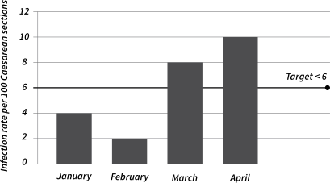

7
{:.chapter-number}

# Surveillance and outbreak investigation in low-resource settings

## Objectives 

When you have completed this chapter you should:

*	Understand the role and purpose of performing surveillance for healthcare-associated infections
*	Be familiar with different types of healthcare-associated infection surveillance
*	Be aware of the importance of communicating results of healthcare-associated infection surveillance
*	Identify feasible targets for surveillance in low-resource settings
*	Understand how to recognise an outbreak
*	Understand the role and purpose of outbreak investigation
*	Be familiar with the steps  in outbreak investigation
*	Understand the role of the IPC practitioner in outbreak investigation
*	Know how to find resources or obtain help for outbreak investigation.

## Surveillance of healthcare-associated infections (HAI)

### 7-1 What is surveillance?

Surveillance is an organised method for collecting, analysing and sharing information. For example, surveillance for needlestick injuries involves collecting information (data) on when, how, why and in which staff categories these incidents occurred. An important part of surveillance is communicating the results of surveillance to people who can improve the outcome being measured, for example the facility manager, ward manager or head of department. 

> Surveillance is an organised method for collecting, analysing and sharing information. 

### 7-2 What is the purpose of surveillance?

Surveillance produces “information for action”. In other words, the findings of surveillance activities or programmes should be used to understand the problem and then identify changes or interventions to prevent or manage the problem. 
There are many other reasons for performing surveillance, including:

*	Establishing baseline data on rates of infection, before implementing a change or intervention.
*	Identifying important pathogens to target with interventions.
*	To detect increases in infection rates above baseline in order to identify groups (clusters) of people with infection (outbreaks).
*	To detect cases of notifiable disease for reporting to the department or ministry of health.
*	To monitor the effectiveness of IPC control measures or impact of changes in practice.

> Surveillance programmes help to understand a problem and then identify changes or interventions to address the problem.

### 7-3 Why should surveillance of healthcare-associated infection be conducted?  

Surveillance for HAI is an essential part of any IPC programme. Through tracking HAI, the IPC practitioner may be able to establish the following key information:

*	Clinical areas with the highest infection rates (usually intensive care units)
*	The most prevalent (common) types of infections, e.g. urinary tract infections
*	The infection types that cause the most morbidity and mortality
*	The most frequently performed invasive procedures, e.g. surgery, IV catheter insertion
*	The types of patients with the greatest risk for infection, e.g. HIV-infected patients, diabetics.

This information will assist the IPC practitioner and facility manager in determining the important (priority) areas and clinical practices which require intervention to reduce infection rates.

### 7-4 Who should perform surveillance of healthcare-associated infection?  

Surveillance is a team effort, ideally involving staff with training in data collection, surveillance methods, data analysis and interpretation. It is critical to involve all stakeholders or at least to make them aware of the surveillance process and results, e.g. facility management, clinical and IPC staff.

> Surveillance is a team effort.

### 7-5 At which different levels is surveillance conducted?

Depending on the information required, surveillance can be conducted at many different levels:

*	At individual unit or ward level, e.g what is the rate of bloodstream infections in ward A?
*	At facility or institution level, e.g. what is the overall rate of HAI at hospital B?
*	At provincial or national level, e.g. how many measles cases were notified in country C this year?
*	At global level, e.g. what is the rate of TB notifications per 100 000 population in each country that publishes annual TB data?

### 7-6 What resources are required for healthcare-associated infection surveillance?

Surveillance is a labour and resource-intensive activity that usually requires a dedicated person or team of people to achieve. Basic requirements for surveillance include:

*	A clear purpose 
*	Standard definitions of infection (most use the Centers for Disease Control National Healthcare Safety Network definitions obtainable from the Internet)
*	A central person or institution to standardise definitions and protocols, receive the data, assess data quality, standardise the approach to analysis, interpret and share the data.

### 7-7 What different types of surveillance can be performed?

The resources available for HAI surveillance will determine which surveillance method is most practical for an individual unit or facility. 

The main HAI surveillance methods are:

*	Continuous surveillance: e.g. for a period of at least six months of either total or targeted surveillance; total surveillance collects data on all types of HAI, whereas targeted surveillance identifies only a particular type of infection, disease or pathogen to survey.
*	Periodic surveillance: is conducted intermittently, giving a “snapshot” of infection rates at certain points in time, e.g. number of cases for one week every month. This is also known as a point prevalence survey.
*	Laboratory-based surveillance: uses laboratory isolates of pre-selected pathogens, often called “alert organisms” from specific types of samples or “alert sites”, e.g. blood cultures, urine, pus swabs to calculate HAI rates.
*	Clinical surveillance: uses definitions of infection based on clinical parameters, with or without inclusion of laboratory results, e.g. a presumptive clinical diagnosis of lung infection would include fever above 38 °C, pneumonia on chest radiograph, and a raised white blood cell count. 

> The type of surveillance method selected is determined by the question to be answered and the resources available to carry out surveillance. 

### 7-8 What is the difference between outcome and process measures?

Surveillance can measure:

*	Outcomes (e.g. HAI rates, infection with specific pathogens or needlestick injuries)
*	Processes (e.g. staff compliance with hand hygiene or uptake of influenza immunisation).

> Surveillance can measure the outcome of a problem or the process which can prevent or correct a problem.

### 7-9 What is a surveillance plan?

Before starting with surveillance it is essential to have a well-thought out plan that includes the following steps:

*	Over what period of time (continuous) or at what interval (periodic) will surveillance be performed
*	Clear and easily understood case definitions of the HAI or event or practice being surveyed
*	Who will collect the data?
*	Who will check (verify) the accuracy of the data?
*	How will the data entry be done?
*	How will the data be analysed?
*	Who will the results of the surveillance be shared with?

### 7-10 How are healthcare-associated infection rates reported? 

The most common way of reporting on the frequency of HAI is by using a rate. Simply put, a rate is the number of times something happens during a particular period of time. To calculate HAI rates we divide the number of people who acquired infection (the numerator) by the total population at risk of an infection (the denominator), for example:

The Caesarean section infection rate at hospital X in 2013 = The number of women with Caesarean section wound infection in 2013 ÷ The total number of women who had a Caesarean section in 2013

It is essential to have the denominator data, as this allows for comparison of rates between different clinical areas or institutions.  

> Surveillance findings for healthcare-associated infection are usually measured and reported as a rate. A denominator is essential.

### 7-11 How is healthcare-associated infection surveillance performed in high-income countries? 

The United States of America uses a sophisticated, centralised system for reporting of HAI, using the National Healthcare Safety Network (NHSN) criteria. Every institution country-wide is required to report their HAI data onto an Internet-based surveillance programme. The programme uses standardised case definitions and data-collection methods. This ensures that HAI data can be compared between institutions and regions (so-called benchmarking). The information is also made available to all stakeholders, to guide IPC programmes and identify priorities for intervention.  

### 7-12 What is known about healthcare-associated infection rates in low-resource settings? 

Many low-resource settings lack the resources (human, technical and laboratory) required to conduct accurate surveillance of HAI. HAIs are the most common adverse event (complication) encountered in health care. The World health Organization (WHO) estimates that of every 100 patients hospitalised, seven in developed and 10 in developing countries will acquire a HAI. Rates of HAI in newborn infants in low-resource settings are up to 20 times higher, and in intensive care units up to three times higher than rates in developed countries. In low-resource settings, surgical site infections are the most common type of HAI, affecting up to one-third of all patients operated on.

> Healthcare-associated infection rates are far higher in low-income countries than in wealthy countries.

### 7-13 Is it feasible for low-income countries to perform healthcare-associated infection surveillance? 

In settings with very limited resources it may be very difficult to conduct even the most basic HAI surveillance. In such settings, it may be worthwhile doing once-off (only done once) or periodic point prevalence surveys of HAI as this requires fewer resources. Where diagnostic microbiology laboratory services are limited, clinical HAI surveillance can usually be conducted using standardised case definitions. In settings with good laboratory services and access to data, laboratory-based surveillance may be possible (without the need for additional human resources to do data collection). 
### 7-14 How should healthcare-associated infection surveillance data be communicated to healthcare workers?

An essential part of the surveillance process is sharing the results with people who can improve the outcome, for example informing the obstetrics ward staff of the Caesarean section wound infection rate. The information should ideally be communicated verbally (to allow for discussion) and displayed in a prominent place (at the entrance to the ward) for all staff and visitors to see. The results should be graphically displayed in an uncomplicated way, so that it is easily understandable. Ideally some interpretation or comparison of the results should be provided so that stakeholders know whether their performance for this surveillance measure was good, mediocre or poor. Suggestions on how to improve the outcome or process measure being surveyed are useful.

> Surveillance findings should always be communicated to people who have influence over the outcome, e.g. ward staff and facility managers.

> #### Caesarean section wound infection rates
> 
> Location: Obstetrics Ward X
> 
> Period: January 2013 – April 2013
> 
> Criteria for wound infection include any of the following:
>
> *	Wound infection within 30 days of operation
> *	Purulent wound drainage
> *	Organisms isolated from wound swab
> *	Inflammation at wound site
> *	Doctor diagnoses wound infection
> 
> 
> 
> Figure 7-1: Caesarean section wound infection rates January – April 2013
> {:.figure-caption}
> 
> Caesarean section wound infection rates have steadily increased in Ward X over the first four months of 2013. The infection rates have exceeded our target level of less than six infections per 100 Caesarean sections. Infection control has visited the operating theatre and ward to review all clinical practices. We recommend these measures to reduce the wound infection rates: 
> 
> *	encourage all staff to practise adequate and regular hand hygiene
> *	ensure that pre-operative antibiotics are given within one hour of surgery
> *	ensure that all women for elective Caesarean shower before surgery.
{:.box}

## Outbreak investigation

### 7-15 What is an outbreak?

An outbreak is the occurrence of more cases of an infectious disease than would normally be expected for a particular time, place or population. For most outbreaks, two or more people with the same symptoms occurring in the same area and time, may be linked. In certain circumstances, even one case of a life-threatening disease is considered an outbreak, e.g. meningococcal meningitis or viral haemorrhagic fever.  

> An outbreak is the occurrence of more cases of an infectious disease than would normally be expected for a particular time, place or population.

### 7-16 Which other key definitions are used in an outbreak investigation?

When investigating or reading about outbreaks, you should be familiar with the terms in the table below.

Table 7-1: Terms used in outbreak investigation
{:.table-caption}

|----------------------------------------------------------------------------------------+---------------------------------------------------------------------------------------------------------------------------------------------------------------------------------------------------------------------------------------|
|                                          Term                                          |                                                                                                              Definition                                                                                                               |
|----------------------------------------------------------------------------------------+---------------------------------------------------------------------------------------------------------------------------------------------------------------------------------------------------------------------------------------|
| Endemic                                                                                | The usual level of disease in a particular area                                                                                                                                                                                       |
| Epidemic                                                                               | A level of disease above what is normally expected; more widespread or prolonged than an outbreak                                                                                                                                     |
| Cluster                                                                                | A group of cases in a certain place and time greater than would normally                                                                                                                                                              |
| be expected                                                                            |                                                                                                                                                                                                                                       |
| Vehicle                                                                                | A non-living intermediary (factor) that can transmit pathogens (e.g. food                                                                                                                                                             |
| or water)                                                                              |                                                                                                                                                                                                                                       |
| Vector                                                                                 | A living intermediary (e.g. insects, arthropods) that can transmit pathogens                                                                                                                                                          |
| Reservoir                                                                              | The usual place or area where a particular pathogen is found (e.g. humans, animals, the environment)                                                                                                                                  |
| Modes of transmission                                                                  | The way in which a pathogen is spread to infect humans; may be direct infection (MRSA transferred onto a patient by the healthcare worker’s hands) or indirect (tick bite fever caused by inoculation of Rickettsia from a tick bite) |
| Portal of entry e.g. swallowing contaminated food or water, or breathing in a pathogen | The way or site in which a pathogen enters a person to cause infection,                                                                                                                                                               |
| Common source outbreak                                                                 | All victims acquire disease from a single point, e.g. cholera-contaminated water or Salmonella-contaminated food                                                                                                                      |
| Continuing source outbreak                                                             | Victims contract disease over multiple incubation periods (many people infected from others) e.g. chickenpox in a hospital ward                                                                                                       |
|----------------------------------------------------------------------------------------+---------------------------------------------------------------------------------------------------------------------------------------------------------------------------------------------------------------------------------------|

###7-17 How are outbreaks usually recognised?

Outbreaks may be recognised in a variety of ways:

*	Routine surveillance activities: in settings with good surveillance programmes, e.g. when outbreaks are detected early because the baseline infection rate is known. However, with all surveillance methods, you only find what you’re looking for. In other words, if your surveillance programme does not include all potential pathogens, you may fail to detect an outbreak with an unusual pathogen.
*	Reporting by clinicians and laboratory staff: alert clinicians may notice an unusual increase in patients presenting with certain symptoms or infectious diseases. Similarly, a good laboratory service will phone clinicians or the IPC practitioner if they detect a cluster of a particular infection or identify a life-threatening pathogen. For this method of outbreak recognition to be effective, there must be good communication between all role players. 
*	Reports from individuals affected by a particular infectious disease: this is the way in which community outbreaks of disease, e.g. diarrhoeal or respiratory diseases, are often recognised. Communities should be aware of who to inform in the case of suspected outbreaks, e.g. the local health service, and in turn someone at district level should be responsible for investigation of outbreak claims. 
### 7-18 What is the purpose of outbreak investigation? 

The main aims of outbreak investigation are to identify the source of illness and to guide public health efforts to stop the spread of the outbreak. In addition, preventable risk factors for outbreaks can be identified and longer-term interventions can be planned, e.g. provision of safe drinking water to communities affected by cholera outbreaks. Outbreaks also provide opportunities to train healthcare workers about public health investigations and emergency response. 

> The main aims of outbreak investigation are to identify the source of illness and to guide public health efforts to stop the spread of the outbreak.

### 7-19 What is a pseudo-outbreak?

Several suspected outbreaks turn out to be “pseudo-outbreaks” (false alarms). The impression of an increased infection rate may arise from: 

*	A change in the clinical or case definition of a disease
*	An improved diagnostic method identifies more cases  
*	A change in the surveillance criteria.

To confirm an outbreak, you must analyse historical patient and/or laboratory data or sometimes consult published medical literature. You should ensure that no changes in surveillance methods, diagnostic methods or case definitions have occurred.

### 7-20 What are the steps involved in outbreak investigation? 

The steps (processes) are:

1.	Prepare for investigation: all role players in outbreak investigation should be alerted, e.g. facility management, department of health, laboratories, clinicians, casualty and the community. A small core group of people (the outbreak team) should be formed to plan the investigation.
2.	Confirm the existence of an outbreak: a case definition must be developed. This should ideally be clinical, e.g. the case definition for suspected measles would be fever, rash, cough and red eyes. This definition can be used to establish the size of outbreak, while laboratory confirmation of cases is awaited. The estimated numbers of cases can then be used to compare the present number of cases with usual rates of disease for that population and time period, to determine whether it is in fact an outbreak.
3.	Establish the diagnosis: for each individual meeting the case definition, obtain and analyse clinical and laboratory data, to assist with identifying the suspected pathogen. For all cases, send appropriate clinical samples for laboratory investigation.
4.	Search for additional cases: prepare a list of all individuals meeting the case definition in the facility or community (known as a line list). For hospital outbreaks, prepare a Gantt chart to track patient movements, procedures, samples submitted and disease outcome (see example in the case section).
5.	Characterise (describe) the cases: use the demographic details from affected cases to build up a profile (description) of who is at risk of developing this infection. Where possible, draw the epidemic curve (this is a visual method of tracking when and at what rate new infections are occurring).
6.	Put immediate control measures in place: support and intensify IPC measures, e.g. hand hygiene; and remove suspected sources of contamination, e.g. dirty drinking water.
7.	Formulate a hypothesis (a possible explanation): analyse all the information collected to date and put together a theory (idea) that would explain the disease for most of the affected cases. Remember not all cases may be caused by the same pathogen and that it is possible for more than one outbreak to occur at the same time.
8.	Test your hypothesis: most outbreak investigations do not reach this stage, as the intervention measures put in place often stop ongoing transmission. If this step is required, get help to perform further research on the problem.
9.	Communicate your findings: identify a single member of the outbreak team to interact with the facility, the community and sometimes even the local media! It is vital to communicate progress and findings to all stakeholders and the public, as there is often a degree of panic and misinformation associated with outbreaks. Once the outbreak is over, summarise the investigation, make recommendations for prevention of future outbreaks and share the report widely. 

### 7-21 What is the role of the IPC practitioner in outbreak investigation? 

The IPC practitioner is a key person in outbreak investigation and should form part of the outbreak team. Additional activities that the IPC practitioner may help co-ordinate in an outbreak include:

*	Collection of clinical specimens
*	Evaluation and implementation of IPC measures
*	Initiation of expanded disease surveillance into other areas
*	Review of facility policies
*	Education of healthcare workers regarding outbreak control measures.

### 7-22 What resources are available for outbreak investigation?

Outbreak investigation is a resource and time-intensive exercise. Ensure that the provincial or national communicable disease authorities have been alerted. Where local expertise in microbiology, virology and infectious disease is lacking, ask for assistance from larger institutions, the department of health and reference or national laboratories. In the case of large-scale or life-threatening disease outbreaks, the department of health may request assistance from international bodies like the World Health Organization (WHO) or the Centers for Disease Control (CDC).

### 7-23 Where can healthcare workers obtain up-to-date information on outbreaks? 

Most countries have communicable disease control programmes within their Health Departments or Ministries. In some countries, information on regional or national outbreaks may be made available from the national laboratory service. ProMED-mail (a programme of the International Society for Infectious Diseases) distributes a free email listserv with daily updates on outbreaks occurring throughout 
the world. 

## Case study 1

Your facility manager asks you to look into the problem of needlestick injuries (NSI) at your clinic. Many of the clinic’s staff who have had recent NSI are on sick leave, complaining of side-effects from their anti-retroviral prophylaxis. You decide to start a surveillance programme for NSI at your workplace.

### 1. What is the purpose of this needle- stick injury surveillance programme?

Through starting the NSI surveillance you hope to better understand the problem and to establish the following:

*	How prevalent (common) is the problem of NSI among the clinic staff?
*	What factors increase the risk of a staff member having a NSI?
*	What is the impact of staff having NSI on the clinic?
*	What can be done to prevent NSI among staff members?

### 2. Who will you involve in the needle-stick injury surveillance programme?

Surveillance is a team effort, ideally involving staff with training in data collection, surveillance methods, data analysis and interpretation. It is important to involve all stakeholders or at least to make them aware of the surveillance process and results. Given this information, you decide to invite the following people to be involved:

*	The facility manager
*	The IPC and occupational health nurse
*	The nurse manager of casualty (where the highest number of NSI occurred)
*	The facility data manager. 

### 3. What type of surveillance method will you use?

You want to get an idea of how frequently NSIs in staff occur, as well as the circumstances surrounding each NSI incident. You decide that the best way to achieve this is to use continuous surveillance (ongoing for at least six months).

### 4. What parts of the surveillance plan do you need to consider?

Before starting your data collection, the surveillance team should plan and agree on the following:

*	Over what period of time will the continuous surveillance be performed?
*	What is your definition of a NSI? Will it include mucosal blood splashes? 
*	What information will you collect about each NSI incident?
*	Who will be responsible for collecting and analysing the data?
*	Who will the results of the surveillance be shared with?

### 5. How will you report the findings of your surveillance?

You could report on NSI at your clinic by using a rate (the number of times something happens during a particular period of time). To calculate the NSI rate you will divide the number of reported incidents of NSI (the numerator) by the total number of clinic staff at risk of a NSI incident.  Using a denominator allows your data to be compared with data from other facilities or regions, regardless of the number of staff involved. 

## Case study 2

The IPC team at a hospital notice an increase in healthcare-associated infections (HAI) involving the pathogen *Acinetobacter baumannii*. They decide to conduct a point prevalence survey for the entire hospital to measure the burden of infections with *Acinetobacter baumannii*.

### 1. What is a point prevalence survey?

A point prevalence survey is a periodic surveillance method. Data is collected at a single time point giving a “snapshot” of infection rates. Using the example above, the IPC team would survey all patients admitted to the hospital on a particular day. They could then establish how many patients have current infections with Acinetobacter baumannii. 

### 2. The IPC team identified 10 patients with *Acinetobacter baumannii* infections. A total of 150 hospitalised patients were surveyed on that day. What is the point prevalence rate?

[all patients with any site of Acinetobacter infection on the day of the survey (numerator): 10] ÷ [total number of hospitalised patients
on that day (denominator): 150] = [10 ÷ 50] = [6.7% prevalence of *Acinetobacter baumannii* infections on that particular day].

### 3. Five of the affected patients are in the intensive care unit (ICU) and the remaining five are on the medical and surgical wards. How can the investigators determine if these infections are caused by a single strain of *Acinetobacter baumannii*?

Infections linked to a single strain of the organism are spread by cross-contamination.  In other situations, infections may arise from different organisms or different strains of an organism and are spread from multiple sources. In this case, the infections may be linked, i.e. spread from a common source or from one patient to another. As a crude guide, outbreaks from a single-strain of a particular pathogen should have similar antibiotic susceptibility patterns from each of the different laboratory isolates. 

### 4. After a thorough investigation, the IPC team conclude that possible factors responsible for this outbreak were inadequate disinfection of respiratory equipment and poor hand hygiene compliance. At what point in an outbreak investigation should IPC control measures be implemented?

Control measures should be implemented as soon as possible, based on the best available evidence.

### 5. In this case, what interventions could be implemented?

*	Better adherence to hand hygiene
*	Improved staff compliance with contact precautions on the wards
*	Enhanced frequency of environmental cleaning on the affected wards
*	Review of the cleaning procedure for respiratory equipment
*	Refresher training for all cleaning staff and respiratory technicians
*	Active surveillance for new *Acinetobacter* infections in the hospital.

## Case study 3

On a Monday morning in April of 2012, the infection control department receives a phone call. The doctor in the neonatal intensive care unit reports that seven babies have developed sepsis over the weekend. Of the seven babies, four have laboratory confirmed bloodstream infection with Enterobacter cloacae. One baby has died and two others remain critically ill. The doctor is worried that this might be an outbreak. 
### 1. When should an outbreak be suspected?

The following circumstances should alert you to the possibility of an outbreak:

*	An increase in a particular type of infection in a ward or group of patients
*	An increase in the number of device-associated infections, e.g. central line infections
*	The occurrence of the same type of infection in healthcare workers and patients
*	An increase in infections caused by an unusual pathogen or a highly drug-resistant bacteria.

### 2. Establishing a case definition is an important step in outbreak investigation. What case definition would you suggest for this case study?

When starting an outbreak investigation, the case definition used is usually broad, to include as many potential cases as possible. As more information becomes available, one can make the definition more specific, to include only cases with a strong link to the current outbreak. 

The case definition may include several pieces of information: clinical criteria, e.g. fever, rash; laboratory criteria, e.g. positive stool culture for *Salmonella typhi*; epidemiological criteria, e.g. time, space, population. In this scenario a possible case definition could be: “Any newborn infant admitted to the neonatal wards after 1 April 2012 with clinical deterioration or raised infective markers.” 

### 3. How will you confirm or disprove the doctor’s concern of an outbreak? 

Several suspected outbreaks turn out to be “pseudo-outbreaks” (false alarms). The impression of an increased infection rate may arise from: 

*	A change in the clinical or case definition of a disease
*	An improved diagnostic method identifies more cases  
*	A change in the surveillance criteria.

To confirm an outbreak, you must analyse historical patient and/or laboratory data or sometimes consult published medical literature. You should ensure that no changes in surveillance methods, diagnostic methods or case definitions have occurred. Analysis of historical microbiology records showed that Enterobacter cloacae was an infrequently isolated pathogen on the neonatal wards.

### 4. What is a line list?

A line list is a method of summarising the personal and clinical information of all affected cases. It is one of the most important steps in outbreak investigation. It allows the outbreak team to compare all available data on the affected cases, to help with identifying common exposures, possible routes of infection and risk factors for infection. Below is the line list that was drawn up. 

Table 7-2: Example of a line list
{:.table-caption}

|---------+------------+----------------------------------------------------------+-------------------------+-----------------+---------------------------------+----------------------+---|
| Patient | Birth date | Date of positive blood culture with Enterobacter cloacae | Gestational age (weeks) | Weight at birth | Premature  rupture of membranes | Parenteral nutrition | … |
|---------+------------+----------------------------------------------------------+-------------------------+-----------------+---------------------------------+----------------------+---|
|       1 | 03/25      | 04/03                                                    |                      28 | 910g            | Yes                             | Yes                  | … |
|       2 | 03/30      | 04/12                                                    |                      29 | 960g            | No                              | Yes                  | … |
|       3 | 04/01      | 04/14                                                    |                      31 | 1400g           | No                              | Yes                  | … |
|       4 | 04/14      | 04/14                                                    |                      28 | 1030g           | No                              | Yes                  | … |
|       5 | 04/08      | 04/16                                                    |                      30 | 1000g           | No                              | Yes                  | … |
|       6 | 04/05      | 04/17                                                    |                      36 | 1240g           | No                              | Yes                  | … |
|       7 | 03/15      | 04/18                                                    |                      26 | 1000g           | No                              | Yes                  | … |
|---------+------------+----------------------------------------------------------+-------------------------+-----------------+---------------------------------+----------------------+---|

### 5. A line list was drawn up with detailed information about the seven affected babies. What conclusions can you make regarding possible risk factors and the source of this infection?

An important step in outbreak investigation is to organise all the patient information by time, place, and person (a line list). This assists with identifying common risk factors and often identifies potential sources of infection. The time course of an epidemic can be plotted on graph showing the number of cases over time (the epidemic curve). In this case scenario, the babies all became ill within the space of a few days (likely a point-source outbreak) and all were very low-birth-weight, premature infants. They all had a single common exposure to parenteral (intravenous) nutrition, which is a potential source of their bacterial sepsis.  

## Case study 4

In July 2013 the IPC practitioner in a government hospital identifies two patients with mediastinitis (infection of the tissue below the breastbone) after open-heart surgery. She starts an investigation to determine the cause of these infections and to establish if this is an outbreak. Together with the ward doctor and the microbiologist, she reviews clinical and laboratory information from these patients, establishes a case definition and starts surveillance for additional cases. In total, three patients hospitalised in July 2013 meet the case definition. There were no other cases of mediastinitis identified between January and June in that year. With all the information available she draws up the line list below.

Table 7-3: Line list for mediastinitis cases
{:.table-caption}

|-------------+-------------+--------+----------------+-----------------+----------+--------------------+----------------------------+----------------------+--------------------------+------------------------------+---------+-----------------------|
| Case number | Age (years) | Gender | Admission date | Operation date  | Diabetic | Surgical procedure | Peri-operative blood sugar | Day of symptom onset | Organism on wound swab   |    Susceptibility profile    | Surgeon |        Outcome        |
|-------------+-------------+--------+----------------+-----------------+----------+--------------------+----------------------------+----------------------+--------------------------+------------------------------+---------+-----------------------|
|           1 |          57 | F      | 6 July         | 8 July          | Y        | CABG ×3            | Normal                     | Day 9                | *E. coli*                | Resistant only to ampicillin | A       | died                  |
|           2 |          61 | M      | 25 June        | 27 June         | Y        | CABG×5; endarter   | High                       | Day 22               | *Staph. aureus*          | Methicillin sensitive        | B       | ICU admission – alive |
|           3 |          76 | F      | 30 June        | 2 July          | Y        | CABG×2; Ao plasty  | High                       | Day 15               | *Staph. aureus*          | Methicillin resistant        | C       | ICU admission – alive |
|-------------+-------------+--------+----------------+-----------------+----------+--------------------+----------------------------+----------------------+--------------------------+------------------------------+---------+-----------------------|

*CABG = Coronary artery bypass graft*

### 1. Do you think this is an outbreak?

Yes, because the rate of mediastinitis in July (compared to the period January – June) is more than would be expected for this time, place and population. 

### 2. Do you think the three cases are linked?

Looking at the line list there are some similarities in the three patients’ histories – all are diabetics and underwent the same operation in the same operating theatre. However, in all three cases the infections were caused by different organisms with different antibiotic susceptibility patterns. The cases are therefore not directly linked, but are part of a polyclonal outbreak.  

### 3. The investigators have so far not identified a source for this outbreak. What should they do next?

Direct observation of clinical practices is often a very helpful exercise during outbreak investigation.  One cannot rely on written procedures or interviews with healthcare workers – it is best to check and see for yourself. The IPC practitioner made the following observations after visiting the operating theatre and the post-operative ward:

*	The operating theatre air conditioner was broken, with temperatures reaching up to 30 °C (much higher than the acceptable limit of 18–24 °C).
*	Pre-operative hair removal was done using a razor.
*	For surgical hand antisepsis, a three minute hand wash with antimicrobial soap was done.
*	For pre-operative skin disinfection, 10% povidone iodine was used. 
*	Perioperative antibiotic prophylaxis was given within 30 minutes of skin incision.
*	Hand hygiene compliance rates measured in the post-operative ward were poor (30%).

### 4. What is the most likely cause of this outbreak?

A possible contributing factor was the high temperatures recorded in the operating theatre, which could result in contamination of the operating field by the surgeons’ sweat. Poor hand hygiene in the post-operative ward may also have played a role. After fixing the ventilation system, no more wound infections occurred. An active surveillance programme for surgical site infection was established in the cardiac surgery ward. 
