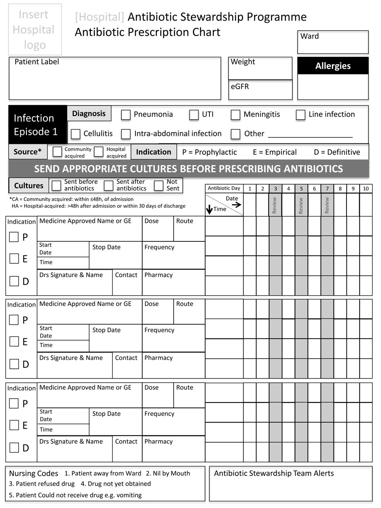
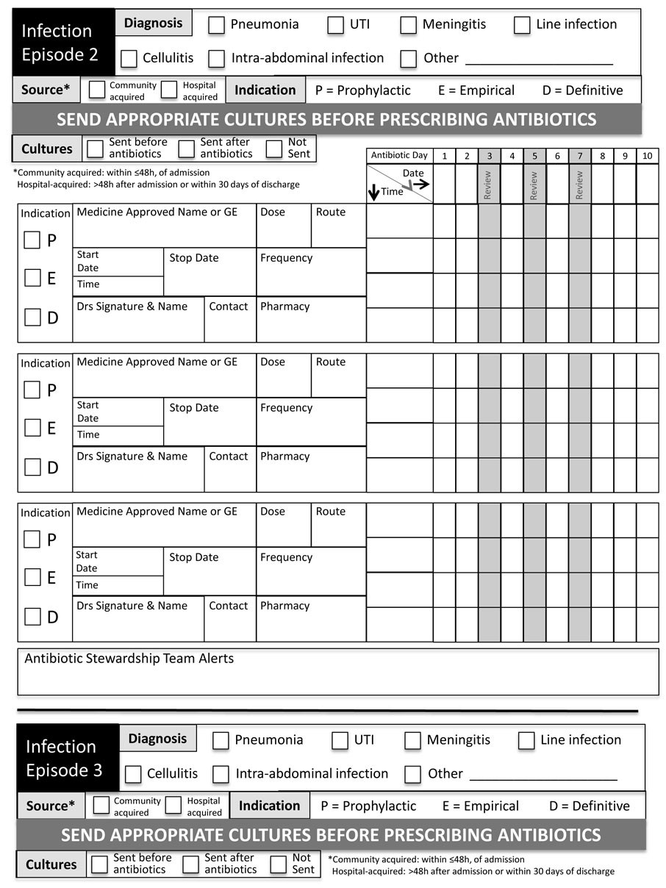
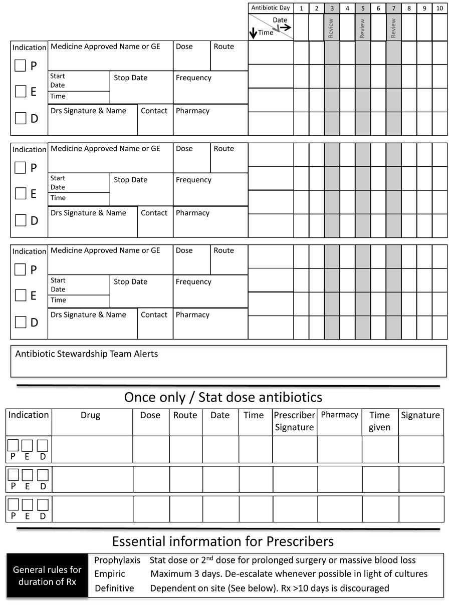
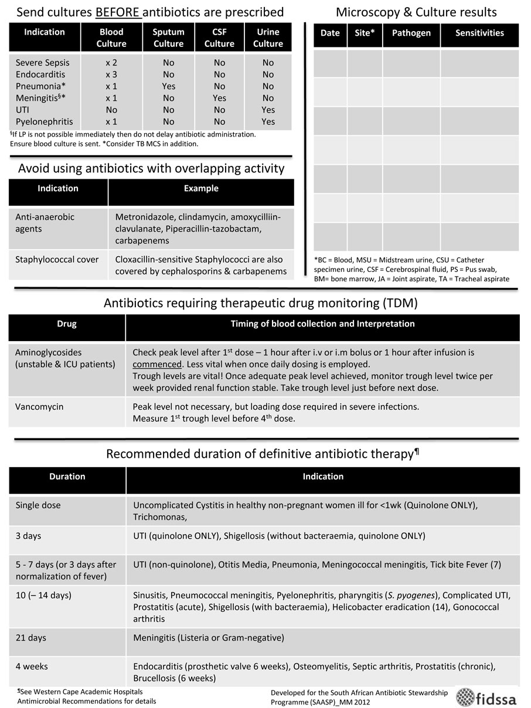

9
{:.chapter-number}

# Antimicrobial stewardship

## Objectives 

When you have completed this chapter you should:

*	Be aware of the global problem of antimicrobial resistance
*	Know how and why antimicrobial resistance develops
*	Be familiar with the concept of antimicrobial stewardship
*	Know some components of antimicrobial stewardship programmes
*	Understand the role of IPC in antimicrobial stewardship programmes. 

## Antimicrobial resistance 

### 9-1 What is an antimicrobial agent?

Antimicrobial agent is a general term used for drugs, chemicals or other substances that kill or slow down the growth of micro-organisms. Antimicrobial agents include antibacterial, antiviral, antifungal, antiparisitic drugs, disinfectants and antiseptic solutions.

> An antimicrobial is a substance that kills or slows down the growth of pathogenic micro-organisms.

### 9-2 What is antimicrobial resistance?

Antimicrobial resistance is the ability of micro-organisms to grow in the presence of a chemical or drug that would normally kill them or slow 
their growth.

> Antimicrobial resistance is the ability of pathogens to grow in the presence of a drug or chemical that would normally kill them or slow their growth.

### 9-3 What is the impact of antimicrobial resistance?

Antimicrobial resistance makes it more difficult to treat infections because the available drugs become less effective. There are many examples of old infectious diseases which have become more difficult to treat than in the past, e.g. gonorrhoea (a sexually-transmitted disease), malaria and TB (with evolving anti-TB drug resistance). 

### 9-4 Why has antimicrobial resistance developed?  

Micro-organisms evolve constantly and are able to survive difficult conditions by adapting to new environments. Factors contributing to the rapid development of antimicrobial resistance are the overuse and misuse of anti-microbial drugs, some disinfectants and related chemicals.

> The development of antimicrobial resistance is inevitable but is worsened by the overuse and misuse of antimicrobial drugs.

### 9-5 How does antimicrobial resistance develop?  

Certain micro-organisms are naturally resistant to some types of antimicrobials. 

But resistance can also develop (be acquired) in two ways: 
*	By genetic mutation (a change in the micro-organisms’ DNA make-up) or 
*	By acquiring resistance from another micro-organism (through sharing of genetic material).

In bacteria, these genetic changes may produce antibiotic resistance by:

*	Altering the antibiotic binding site on the bacterial surface
*	Destroying the antibiotic with enzymes produced by the bacteria
*	Preventing the antibiotic from entering the bacterial cell wall
*	Pumping the antibiotic out of the bacterial cell as soon as it enters.

### 9-6 How does the overuse of antibiotics encourage development of resistance?

Drug-susceptible (sensitive) bacteria are killed when an appropriate antibiotic is given at sufficient dose, frequency and duration. If there are any bacteria resistant to the antibiotic, they can survive, multiply and replace the drug-susceptible bacteria. Overuse of antibiotics (in humans and animals) creates ‘selective pressure’, selecting out drug-resistant strains. Misuse of antibiotics (e.g. underdosing or not completing a course of antibiotics) also selects out resistant bacteria.

### 9-7 How does antimicrobial resistance spread?

Once resistance develops, it can spread rapidly because bacteria multiply quickly. The drug-resistant strain is then spread through direct contact. Poor infection control practices (especially poor hand hygiene compliance) accelerate the spread of drug-resistant bacteria, particularly in hospitals and homes for the elderly. The increased usage of antibiotics in hospitals, vulnerable patients, invasive procedures and indwelling devices increase the likelihood of development and transfer of drug-resistant bacteria. Global travel and the widespread use of antibiotics as growth promoters in animals also contribute to the spread of resistance. 

> Good infection control practices can reduce the spread of drug-resistant micro-organisms in healthcare facilities.

### 9-8 Why is antimicrobial resistance a worrying development?    

There are many reasons to be concerned about antimicrobial resistance (AMR):

*	Patients with AMR infections are twice as likely to die or suffer prolonged illness when compared with infections caused by non-resistant bacteria
*	Patients with AMR infections remain infectious for a longer time, increasing the chance of spreading resistant micro-organisms
*	Some AMR infections may be untreatable with currently available drugs, threatening the gains made in the antibiotic era
*	AMR infections cost more to treat and extend the length of hospital stay, increasing the overall cost of healthcare.

> Antimicrobial-resistant infections cost more to treat and are more likely to result in death than infections with drug-susceptible micro-organisms. 

## Antimicrobial stewardship

### 9-9 What is antimicrobial stewardship?

The primary goal of antimicrobial stewardship is to improve patient outcomes while minimising the adverse effects of antimicrobial use, such as the development of antimicrobial resistance. Antimicrobial stewardship is any activity that promotes:

*	The use of antimicrobials only when indicated
*	The appropriate selection of antimicrobials
*	The appropriate dosing of antimicrobials
*	The appropriate route and duration of antimicrobial therapy.

> Antimicrobial stewardship activities promote the appropriate use of antimicrobials thereby aiming to reduce antimicrobial resistance. 

### 9-10 What does antimicrobial stewardship mean for individual patients?

When practising antimicrobial stewardship at an individual patient level, one should try to prescribe an antimicrobial that: 

*	Is indicated on clinical and/or microbiological grounds
*	Is the best selection, dose, and duration for the patient and the specific infection
*	Will ensure the best clinical outcome
*	Will have minimal toxicity to the patient
*	Will have minimal impact on subsequent development of resistance.

### 9-11 Why is antimicrobial stewardship needed? 

Antimicrobial resistance (AMR) is developing faster than the pharmaceutical industry can produce  new antimicrobial drugs. This means that some infections are becoming more difficult, more expensive and even impossible to treat. Although microbial evolution and resistance are inevitable, the situation is aggravated by overuse and misuse of antimicrobials. Antimicrobial stewardship is urgently needed to slow down the pace at which resistance is developing and to conserve our current antimicrobial agents for future use.  

> Antimicrobial stewardship is urgently needed to slow down the development of resistance and to conserve antimicrobials for future use.  

### 9-12 In which ways can antimicrobials be misused?

Antimicrobials can be misused in the following ways:

*	Overuse: animal husbandry uses tonnes of antibiotics per year as growth promoters
*	Inappropriate use: unnecessary prescriptions of antibiotics for viral infections, e.g. the common cold, sore throats and influenza
*	Underdosing: the use of a dose or duration of treatment that does not result in bacterial killing, but rather selects out drug-resistant strains, e.g. TB treatment defaulters.

### 9-13 What are the consequences of antibiotic misuse?

The negative, unintended consequences of antibiotic overuse or misuse are called ‘collateral damage’. These can include the following:

*	Selection of drug-resistant micro-organisms
*	Fungal super-infection, e.g. candida infections
*	Selection of particularly dangerous micro-organisms, e.g. *Clostridium difficile* infections.

## Antimicrobial stewardship programmes 

### 9-14 What is an antimicrobial stewardship programme?  

Antimicrobial stewardship is a co-ordinated programme of varied activities that aim to:

*	Promote the appropriate use of antimicrobials (especially antibiotics)
*	Apply appropriate IPC principles
*	Improve patient outcomes
*	Reduce antimicrobial resistance
*	Decrease the spread of multidrug-resistant micro-organisms.  

### 9-15 Who should be involved in an antimicrobial stewardship programme?  

Antimicrobial stewardship is a team effort that should involve all parties delivering and managing clinical care, i.e. doctors, nurses, pharmacists, IPC practitioners and healthcare managers.

> Antimicrobial stewardship is a team effort that should involve everyone delivering and managing clinical care.  

### 9-16 What is the role of the antimicrobial stewardship programme (ASP) committee?

The ASP committee should perform the following functions:

*	Raise awareness of the need for antimicrobial stewardship at their facility
*	Consult institutional stakeholders on proposed projects and policies
*	Discuss and develop facility-specific stewardship policies and activities
*	Co-ordinate surveillance of antimicrobial usage at their facility
*	Report back on ASP progress to facility management and stakeholders. 

### 9-17 Who should be members of the antimicrobial stewardship programme (ASP) committee?

The ASP committee should comprise senior facility staff (to ensure the co-operation of all staff members) for example:

*	The facility manager, superintendent or CEO 
*	A senior physician (if possible with training in infectious diseases)
*	A pharmacist (if possible a clinical pharmacist with infectious disease training)
*	A microbiologist (if available)
*	An information system specialist or data manager
*	An IPC practitioner.

> The antimicrobial stewardship committee should include senior clinicians, management, microbiology, pharmacy 
and IPC staff. 

### 9-18 Who should the antimicrobial stewardship programme committee report to?

The ASP committee should provide regular (6-monthly) feedback to the facility manager, and preferably also to all antimicrobial prescribers (doctors and nurse practitioners).

### 9-19 What data is needed for antimicrobial stewardship programmes?

It is very useful to have some baseline information about antibiotic usage at a particular facility before starting with an ASP intervention. Information may be available from the pharmacy service or may need to be collected by the ASP committee. The type of information needed includes:

*	Most commonly used antibiotics (and where possible, the indication or reason for use)
*	Volume of antibiotic usage
*	Wards or clinical areas with the highest antibiotic usage
*	Local or facility-specific antimicrobial prescribing guidelines (if they exist).

This information will help the ASP to identify which drugs and wards should initially be targeted in the intervention. The local antimicrobial guidelines assist the ASP to identify whether prescribers are adhering to recommended practices.

> Information from an institution’s pharmacy is very helpful in identifying which antimicrobials and which clinical areas should be targeted by the ASP. 

### 9-20 What resources are needed for antimicrobial stewardship programmes?

The most important resources needed are the time, enthusiasm and perseverance of the ASP committee. Changing prescriber attitudes and behaviours takes time and effort, and is unlikely to happen quickly. Access to information (data) on antibiotic usage is crucial for ASP committees to be able to track the effect of their interventions. Some financial resources will be needed, but the cost savings achieved by most well-functioning programmes will easily cover this. 

### 9-21 How do antimicrobial stewardship programmes save healthcare facilities’ money?

Many research studies have shown that antimicrobial stewardship programmes are very cost-effective. Patient outcomes are improved, duration of hospitalisation is reduced, and unnecessary antibiotic usage is prevented. In the United States of America, stewardship programmes have shown annual savings to healthcare facilities of up to $400,000 each.

> Investment in antimicrobial stewardship saves lives and money. 

## The role of IPC in antimicrobial stewardship 

### 9-22 How does IPC practice impact on antimicrobial usage?

Antimicrobial stewardship is sometimes referred to as a ‘marriage’ between IPC and antimicrobial management. This acknowledges the primary role of IPC in preventing spread of drug-resistant pathogens in healthcare facilities. Without good IPC practices, any attempt at antimicrobial stewardship is unlikely to be successful (as the uncontrolled spread of drug-resistant pathogens will require more antibiotic treatment).

> Good IPC practices at healthcare facility level are needed to ensure the success of antimicrobial stewardship programmes.

### 9-23 What is the role of the IPC practitioner in the antimicrobial stewardship programme?

The IPC practitioner can add value to the antimicrobial stewardship programme through activities that reduce spread of resistant pathogens (thereby reducing the need for antibiotic treatment):

*	Performing surveillance for resistant pathogens
*	Auditing hand hygiene compliance regularly
*	Ensuring healthcare staff perform cleaning and decontamination of patient  care equipment such as bedpans, urinals and bowls
*	Ensuring appropriate isolation and transmission-based precautions are implemented
*	Ensuring thorough environmental cleaning is performed, especially for rooms where the prior occupant had a drug-resistant infection
*	Auditing IPC practices and healthcare-associated infection rates, with provision of feedback and support to clinical areas with poor performance
*	Encouraging healthcare workers to remove indwelling devices that are no longer needed, e.g. peripheral cannulae (drips), urinary catheters
*	Assisting with education and awareness programmes so that all clinical staff understand the importance of antimicrobial stewardship.

> The IPC practitioner contributes to antimicrobial stewardship through activities that reduce the spread of resistant pathogens. 

## Tools for antimicrobial stewardship 

### 9-24 What techniques or tools are used for antimicrobial stewardship?

There are many antimicrobial stewardship interventions and activities that are successful in reducing inappropriate antimicrobial usage including:

*	Selective reporting
*	Antimicrobial consultation
*	Treatment de-escalation
*	Intravenous to oral switch
*	Therapeutic dose monitoring
*	Antimicrobial restriction
*	Antibiotic cycling
*	Antimicrobial guidelines
*	Antimicrobial prescription charts
*	Antimicrobial stewardship ward rounds.

The basic principles of these stewardship tools are discussed below.

### 9-25 What is empiric antimicrobial therapy?

Empiric antimicrobial therapy is the prescription of an antimicrobial/s based on the treating physician’s ‘best guess’ at which pathogen/s are causing a particular infection. For example, a nurse practitioner sees a baby with a rash on the bottom that looks typical of candida infection (thrush). Her empiric choice of antimicrobial for this infection is an antifungal that can kill candida. 

In patients with severe and life-threatening infections, it is often unclear which pathogen/s may be causing the illness. Critically ill patients may need to be started on several powerful antimicrobials at once, until the cause of the infection is revealed. In such cases it is very important to obtain appropriate specimens for diagnostic microbiology, BEFORE starting antibiotics. Antibiotics given before specimens are taken may make it impossible to grow and identify the responsible pathogen(s) in the laboratory. 

### 9-26 What is targeted antimicrobial therapy?

Once the pathogen causing the infection has been identified, antimicrobial therapy can be matched or targeted to the specific pathogen and its drug-susceptibility pattern. This means that other antimicrobials that will not treat the pathogen can be stopped. In most cases, targeted therapy will reduce the patient’s antimicrobial drugs from several agents to a single agent.

> Targeted antimicrobial therapy aims to match the antimicrobial to the pathogen causing the infection.  

### 9-27 What is a narrow-spectrum versus a broad-spectrum antibiotic?

A narrow-spectrum antibiotic will treat only a limited number of pathogens, whereas a broad-spectrum antibiotic is effective against a wide variety of pathogens. The disadvantage of using a broad-spectrum antibiotic is that it encourages selection of drug-resistant pathogens, by killing off normal flora and other sensitive bacteria living in and on the patient.

> Broad-spectrum antibiotics (effective against a wide variety of pathogens) encourage the selection of drug-
resistant pathogens.  

### 9-28 What is selective reporting?

Selective reporting is a technique used by microbiology laboratories to encourage prescribers to use targeted therapy. Most microbiology laboratories will test each isolate against a wide variety of antibiotics that could be used to treat the infection. With selective reporting, only the most ‘narrow-spectrum’ antibiotics that the pathogen is sensitive to is displayed on the report.  

### 9-29 What is microbiology consultation?

In some healthcare facilities (with well-established microbiology laboratories), a telephonic consultation service and microbiology ward rounds may be available to clinicians. Clinicians should be encouraged to discuss the antimicrobial management of complex clinical cases with the microbiologist. Microbiology consultation often helps to ensure prescription of antimicrobial therapy that is rational, effective and based on the principles of antibiotic stewardship. 

### 9-30 What is de-escalation of antimicrobial therapy?

When a pathogen causing an infection is identified, broad-spectrum antimicrobial treatment can be de-escalated or targeted by changing to a narrow-spectrum agent. De-escalation ensures that the patient receives an effective treatment while at the same time avoiding harmful effects of broad-spectrum antimicrobials. In sick patients, it is essential to take appropriate clinical specimens for microbiological analysis, so that the causative organism can be identified and antimicrobial therapy de-escalated.

> De-escalation of therapy ensures effective treatment while avoiding the harmful effects of broad-spectrum antimicrobials.  

### 9-31 What is discontinuation of antimicrobials?

In many instances, antimicrobials (particularly antibiotics) are given for too long:

*	Continued for much longer than is needed to treat a confirmed infection
*	Continued inappropriately even when tests for infection are negative at 72 hours (e.g. blood cultures and septic markers)
*	Prescription of surgical (pre-operative) prophylaxis for more than one dose or day. 

Unnecessarily prolonged courses of antibiotics expose patients to greater risk of side-effects and encourage development of antibiotic resistance. Clinicians should be encouraged to review the need for ongoing antimicrobials 72 hours after starting treatment. When no longer indicated, antimicrobials should be discontinued promptly. Early discontinuation of antibiotics can have a significant effect in reducing overall antibiotic usage. 

It is useful for each healthcare facility or district to develop standard treatment guidelines with recommended antimicrobial choices, doses and specific duration of treatment for different infections or clinical presentations. 

> Unnecessarily prolonged courses of antibiotics expose patients to greater risk of side-effects and encourage development of antibiotic resistance.

### 9-32 What is meant by intravenous to oral switch?

Once an ill patient’s condition has improved and they are able to tolerate oral feeds/fluids, clinicians should strongly consider switching antimicrobial therapy from the intravenous to the oral route. Most antimicrobials have both intravenous and oral preparations (with oral agents being substantially cheaper). Switching to the oral route (and removing the IV catheter) also has the advantage of reducing the risk of healthcare-associated bloodstream and soft tissue infections (thrombophlebitis). 

### 9-33 What is therapeutic dose monitoring?

Therapeutic dose monitoring (TDM) is the taking of samples to estimate antibiotic concentration in a patient’s blood, while the patient is receiving a particular dose of the antibiotic. If the concentrations are too low, maximal killing of bacteria will not be achieved and the patient’s dose or dosing frequency will need to be increased. If the concentrations are too high, the patient may experience side-effects from the antibiotic, and the dose or dosing frequency will need to be decreased.  TDM is important for antibiotic stewardship because if the patient is under-dosed, there is a greater chance that antibiotic resistance will develop. TDM is usually required for aminoglycosides (gentamicin, amikacin) and glycopeptides (vancomycin).

### 9-34 What is antimicrobial restriction? 

Antimicrobial restriction is a policy that limits clinician’s access to certain classes of antimicrobials, without the prior approval of a senior colleague, e.g. microbiologist, infectious diseases clinician or hospital manager. The aim of antimicrobial restriction is to decrease inappropriate usage of broad-spectrum agents, and thereby reduce further development of antimicrobial resistance. Such a policy must be agreed upon at healthcare facility level. The facility should have clinicians (telephonically available to prescribers) who are able to assess whether a request for a particular restricted antimicrobial is appropriate or not.

> Antimicrobial restriction is a policy that limits use of certain antimicrobials, without the prior approval of a senior colleague.

### 9-35 What is antibiotic cycling or antibiotic diversity?

Antibiotic cycling is the planned (scheduled) rotation or switching between different classes of antibiotics with similar spectrums of action (will treat similar groups of pathogens). In theory, switching between different types of antibiotics decreases the ‘selection pressure’ for particular patterns of antibiotic resistance. Antibiotic cycling can be practised at individual ward or ICU level or for an entire healthcare facility. The effectiveness of this strategy is still debated, since resistance to a particular class of antibiotics increases rapidly once they have been re-introduced.

### 9-36 What is an antimicrobial prescription guideline?

An antimicrobial prescription guideline can be implemented at healthcare facility, district, provincial or national level. It is crucial though, that antimicrobial recommendations are based on updated, local antimicrobial susceptibility patterns. The guideline should include recommended antimicrobial choices, doses and specific duration of treatment for different infections or clinical presentations. The availability of a guideline is very helpful when implementing antibiotic stewardship, since prescribers can be encouraged to follow standard recommendations.

### 9-37 What is an antimicrobial prescription chart?

An antimicrobial prescription chart is a dedicated (stand-alone) chart that contains only prescriptions for antimicrobial agents (usually antibiotics). The chart is designed to encourage antimicrobial stewardship through the following design features:

*	Space to document the indication for antimicrobial treatment
*	Space to document patient’s weight and renal function (to accurately calculate doses)
*	Space to document submitted microbiological specimens and results
*	Prompts at day three, seven and so on, to review the need for ongoing treatment
*	Local guidelines on antibiotic choice and standard treatment durations.

An example of the antimicrobial prescription chart used by the South African Antibiotic Stewardship Programme (SAASP) can be seen in Figure 9-1.

> 
> 
> Figure 9-1a: Antimicrobial prescription chart, developed and produced by the South African Antibiotic Stewardship Programme (SAASP), reproduced by kind permission of  Dr Marc Mendelson and the SAASP
{:.figure .large}

> 
> 
> Figure 9-1b: Antimicrobial prescription chart, developed and produced by the South African Antibiotic Stewardship Programme (SAASP), reproduced by kind permission of  Dr Marc Mendelson and the SAASP
{:.figure .large}

> 
> 
> Figure 9-1c: Antimicrobial prescription chart, developed and produced by the South African Antibiotic Stewardship Programme (SAASP), reproduced by kind permission of  Dr Marc Mendelson and the SAASP
{:.figure .large}

> 
> 
> Figure 9-1d: Antimicrobial prescription chart, developed and produced by the South African Antibiotic Stewardship Programme (SAASP), reproduced by kind permission of  Dr Marc Mendelson and the SAASP
{:.figure .large}

### 9-38 What is an antimicrobial stewardship ward round?

An antimicrobial stewardship ward round is a useful and non-threatening way to involve and educate prescribers (especially junior colleagues) about stewardship principles. The ASP committee members visit various clinical areas (usually one area per week) for a brief discussion of all patients on the ward currently receiving antimicrobials. The indication for treatment, dose, route, duration of therapy and need for dose monitoring (TDM) are discussed for each patient. The AS ward rounds also incorporate discussion of IPC implications, where relevant, e.g. need for patient isolation and contact precautions in a patient being treated for methicillin-resistant *Staphylococcus aureus* infection. 
Where possible, the AS ward round team makes recommendations for interventions which could include any of the following:

*	Discontinuation of antimicrobial therapy
*	De-escalation of targeting of antimicrobial therapy
*	Intravenous to oral switch
*	Removal of unnecessary indwelling devices, e.g. intravenous and urinary catheters
*	IPC recommendations, e.g. isolation or transmission-based precautions.

### 9-39 Why do healthcare staff need education about antimicrobial stewardship?

It is crucial that the above tools for antimicrobial stewardship are implemented together with an ongoing education programme. Only when clinical staff understand the reasons for restriction of their prescribing choices, will they be likely to comply with stewardship recommendations. There is often passive resistance because they do not understand why the microbiology, infectious diseases and/or IPC team is being ‘unreasonable’.

## Case study 1

A 15-year-old schoolgirl is taken by her mother to see her local general practitioner (doctor).  She is complaining of a sore throat, fever and body aches. She is not particularly unwell but is worried because she has an exam later that week. Her mother asks the doctor to prescribe a course of antibiotics, because she thinks this will get her daughter better faster. 

### 1. What is the best management for viral infections such as viral pharyngitis? 

Most viral infections present with fever plus other symptoms like tiredness, body aches and poor appetite. Since there is no effective treatment available for most viral infections, management includes supportive care with medicines to address the complaints of the patient. Antibiotics have no role in the management of viral infections. 

### 2. How should prescribers handle patients who insist on having antibiotics prescribed  for a viral infection?

Pressure from patients and their family members is one of the reasons for antibiotic overuse. Many patients expect a prescription of antibiotics every time they go to the doctor for various complaints like fever, sore throat or diarrhoea, even if these infections will not be helped by antibiotics.

Prescribers should take time to explain the diagnosis and reassure them that their condition does not require antibiotics. They could also educate patients about the potential harmful effects of giving unnecessary antibiotics.

### 3. What problems can arise when a patient is given antibiotics unnecessarily?

The patient may experience side-effects (adverse drug reactions) from antibiotics such as rash, diarrhoea (as in *Clostridium difficile* infection) and fungal infections (e.g. vaginal thrush). Antibiotics also cause changes in the flora of the gut, selective pressure and development of antibiotic resistance.

## Case study 2 

A 28-year-old healthy pregnant lady is scheduled to have her baby delivered by Caesarean section. She is given a dose of cefazolin as pre-operative prophylaxis four hours before the operation starts.  The baby is delivered successfully without any complications. After delivery, the obstetrician continues the patient on cefazolin 1 gram every eight hours for three more days.  

### 1. What are the main concerns regarding antibiotic stewardship in this case?

The timing of the pre-operative antibiotic should be less than one hour before the first skin incision is made (operation starts).  In uncomplicated, clean (non-infected) cases, a single dose of pre-operative antibiotics is sufficient. 

### 2. Why are patients sometimes given extra postoperative doses of antibiotics?

Many doctors feel that additional doses of antibiotics will somehow ‘protect’ the patient from surgical site infection. This is especially true in training hospitals where doctors may be young and inexperienced. Many research studies have shown no benefit from giving extra doses of antibiotics postoperatively for routine surgical procedures. The extra antibiotic doses unnecessarily expose patients to side-effects and increase the chance of developing antibiotic resistance.

## Case study 3 

A 40-year-old lady is admitted to hospital complaining of headache and severe chest pain. After four days she develops fever and cough productive of yellow sputum. The doctors now diagnose her with hospital-acquired pneumonia. Sputum samples sent to the laboratory show *Klebsiella pneumoniae*. The bacteria is resistant to several antibiotics including cephalosporins, piperacillin-tazobactam and aminoglycosides. The patient is the wife of the hospital manager. The occurrence of this hospital-acquired infection (which is highly antibiotic resistant) has upset the manager. He orders the hospital staff to set up an Antibiotic Stewardship Programme.

### 1. Which hospital staff should be involved in the development of the Antibiotic Stewardship Programme?

The ASP committee should include senior facility staff such as: 

*	The hospital manager, superintendent or medical director
*	A senior doctor (if possible an Infectious Diseases specialist)
*	A pharmacist 
*	A microbiologist 
*	An information system specialist or data manager
*	The most senior IPC practitioner.

### 2. What roles should the newly formed ASP committee take on?

The ASP committee has the following functions:

*	Raise awareness among doctors, nurses and other hospital staff about the antimicrobial resistance problem in their facility and the need for an ASP  
*	Consult facility stakeholders on the ASP projects 
*	Collect and analyse data related to ASP
*	Plan interventions, activities and goals of the ASP
*	Make and submit reports to the facility administration.

### 3. Why is it important to include an IPC practitioner in the ASP committee?

The IPC practitioner is an essential member of the ASP committee. Without good IPC practices, any attempt at antimicrobial stewardship is unlikely to succeed. IPC ensures that policies and practices to control the spread of drug-resistant organisms are in place.

## Case study 4 

The Infectious Disease (ID) specialist doctor leads an ASP ward round with several medical students, junior doctors, nursing and pharmacy staff. The first patient is a 70-year-old male who has been on intravenous antibiotics for ten days. The specialist asks why the patient is still on intravenous antibiotics even though his fever has settled and he is clinically better.

### 1. What should the ID specialist recommend for antibiotic management of this patient?

Since the patient is clinically well, the antibiotics should be stopped. Most infections require only five to seven days of antibiotics. For patients who need prolonged antibiotic courses, the intravenous antibiotic can often be switched to an oral formulation. 

### 2. The next patient is a 65-year-old male with chronic kidney disease requiring haemodialysis. He has a permanent central catheter inserted in his right internal jugular vein. The patient is on antibiotics for a bloodstream infection with a methicillin-resistant Staphylococcus aureus (MRSA). What should the ID specialist recommend for antibiotic management of this patient?

The ID specialist doctor emphasises the need to submit adequate blood cultures specimens to the microbiology laboratory. Without appropriate specimens, the doctors cannot identify the micro-organism causing the infection or choose the correct antibiotic based on the susceptibility profile. He also recommends therapeutic dose monitoring of the antibiotic (vancomycin) to ensure that the patient (who has kidney failure) is getting the correct dosage. He also recommends that contact precautions be implemented.

### 3. The third patient is a 49-year-old female who has had a total hysterectomy three days ago. She still has intravenous prophylactic antibiotics boarded on her prescription chart. Her Foley’s catheter is still in place. What should the ID specialist recommend for management of this patient?

The ID specialist doctor recommends stopping the antibiotic immediately, since only a single pre-operative dose was needed. He also recommended removal of the Foley’s catheter as soon as possible to reduce the possibility of a catheter-associated urinary tract infection.