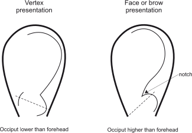
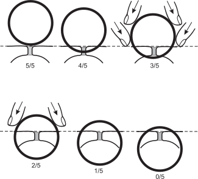

3A
{:.chapter-number}

# Skills: Examination of the abdomen in labour

## Contents
{:.non-printing}

*   [Objectives](#objectives)
*   [Abdominal palpitation](#abdominal-palpitation)
*   [Assessing contractions](#assessing-contractions)
*   [Assessing the fetal heart rate](#assessing-the-fetal-heart-rate)
{:.chapter-toc}

## Objectives

When you have completed this skills chapter you should be able to:

*	Assess the size of the fetus.
*	Determine the fetal lie and presentation.
*	Determine the descent of the head.
*	Grade the uterine contractions.

## Abdominal palpitation

### A. When should you examine the abdomen of a woman who is in labour?

The abdominal examination forms an important part of every complete physical examination in labour. The examination is done:

1.	On admission.
1.	Before *every* vaginal examination.
1.	At any other time when it is considered necessary.

### B. What should be assessed on examination of the abdomen of a woman who is in labour?

1.	The shape of the abdomen.
1.	The height of the fundus.
1.	The size of the fetus.
1.	The lie of the fetus.
1.	The presentation of the fetus
1.	The descent and engagement of the head.
1.	The presence or absence of hardness and tenderness of the uterus.
1.	The contractions.
1.	Fetal heart rate pattern.

### C. Shape of the abdomen

It is helpful to look at the shape and contour of the abdomen.

1.	The shape of the uterus will be oval with a singleton pregnancy and a longitudinal lie.
1.	The shape of the uterus will be round with a multiple pregnancy or polyhydramnios.
1.	A ‘flattened’ lower abdomen suggests a vertex presentation with an occipito-posterior position (ROP or LOP).
1.	A suprapubic bulge suggests a full bladder.

### D. Height of the fundus

It is important to ask yourself whether the height of the fundus is in keeping with the woman’s dates and the findings at previous antenatal attendances.

### E. Size of the fetus

It is important, on palpation, to assess the size of the fetus. This is best done by feeling the size of the fetal head. Is the size of the fetus in keeping with the woman’s dates and the size of the uterus? A fetus which feels smaller than expected is likely to be associated with:

1.	Incorrect dates.
1.	Intra-uterine growth restriction.
1.	Multiple pregnancy.

### F. Lie and presentation of the fetus

It is important to know whether the lie is longitudinal (cephalic or breech presentation), oblique, or transverse. The normal lie is longitudinal. With an abnormal lie, there is an increased risk of umbilical cord prolapse. An abnormal lie may suggest that there is a multiple pregnancy or a placenta praevia.

It is also important to know the presentation of the fetus. The normal presentation is cephalic (fetal head presentation). If a breech presentation is present, it must be decided whether a vaginal delivery is possible. With breech presentation, there is an increased risk of cord prolapse or a placenta praevia.

### G. Cephalic presentation of the fetus

If the presentation is cephalic, it is sometimes possible when palpating the abdomen to determine the presenting part of the fetal head (vertex, face or brow). Figure 3A-1 indicates some features that can assist you in determining the presentation.

> 
> 
> Figure 3A-1: Vertex, face and brow presentations
{:.figure}

### H. Descent and engagement of the head

This assessment is an essential part of *every* examination of a woman in labour. The descent and engagement of the head is an important part of assessing the progress of labour and must be assessed before each vaginal examination.

The amount of descent and engagement of the head is assessed by feeling how many fifths of the head are palpable *above* the brim of the pelvis:

1.	5/5 of the head palpable mean that the whole head is above the brim of the pelvis.
1.	4/5 of the head palpable means that a small part of the head is below the brim of the pelvis and can be lifted out of the pelvis with the deep pelvic grip.
1.	3/5 of the head palpable means that the head cannot be lifted out of the pelvis. On doing the deep pelvic grip, your fingers will move outwards from the neck of the fetus, then inwards before reaching the pelvic brim.
1.	2/5 of the head palpable means that most of the head is below the pelvic brim, and on doing the deep pelvic grip, your fingers only splay outwards from the fetal neck to the pelvic brim.
1.	1/5 of the head palpable means that only the tip of the fetal head can be felt above the pelvic brim.

It is very important to be able to distinguish between 3/5 and 2/5 head palpable above the pelvic brim. If only 2/5 of the head is palpable, then engagement has taken place and the possibility of disproportion at the pelvic inlet can be ruled out. The head is still unengaged if 3/5 head is palpable above the pelvic brim.

Note
:	Another method that could be used to determine the amount of fetal head above the pelvis is to assess the number of fingers that could be placed on the remaining fetal head above the pelvic brim, i.e. three fingers indicate that the fetal head is 3/5 above pelvic brim.

> Descent and engagement of the head are assessed on abdominal and not on vaginal examination.

> 
> 
> Figure 3A-2: An accurate method of determining the amount of head palpable above the brim of the pelvis
{:.figure}

### I. Hardness and tenderness of the uterus

A uterus may be regarded as abnormally hard:

1.	When it is difficult to palpate fetal parts.
2.	When the uterus feels harder than usual.

This may occur:

1.	In some primigravidas.
2.	During a contraction.
3.	When there has been an abruptio placentae.
4.	When the uterus has ruptured.

When there is both hardness and tenderness of the uterus, without period of relaxation during which the uterus is not tender, the commonest causes are:

1.	An abruptio placentae.
2.	A ruptured uterus.

Therefore, there is likely to be a serious problem if the uterus is harder than normal *and* there is also tenderness without periods of relaxation. Hardness or tenderness of the uterus must be recorded on the partogram and the most experienced person called to assess the woman.

## Assessing contractions

### J. Contractions

Contractions can be felt by placing a hand on the abdomen and feeling when the uterus becomes hard, and when it relaxes. It is, therefore, possible to assess the length of the contractions by taking the time at the beginning and end of the contraction. The strength of each contraction is assessed by measuring the duration of the contraction.

### K. Grading the duration of contractions

1.	Contractions lasting less than 20 seconds (‘weak contractions’).
2.	Contractions lasting 20–40 seconds (‘moderate contractions’)
3.	Contractions lasting more than 40 seconds (‘strong contractions’).

> 
> 
> Figure 3A-3: Method of grading the duration of uterine contractions for recording on the partogram
{:.figure}

### L. Grading the frequency duration of contractions

The frequency of contractions is assessed by counting the number of contractions that occur in a period of 10 minutes

## Assessing the fetal heart rate

### M. Fetal heart rate pattern

The fetal heart must be detected and the fetal heart rate pattern assessed and recorded every time the abdomen is examined in labour.
