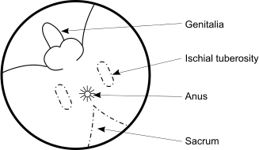
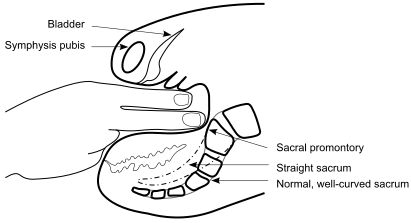

3B
{:.chapter-number}

# Skills: Vaginal examination in labour

## Contents
{:.non-printing}

*   [Objectives](#objectives)
*   [Preparation for a vaginal examination in labour](#preparation-for-avaginal-examination-in-labour)
*   [Procedure of examination](#procedure-of-examination)
*   [The vulva and vagina](#the-vulva-and-vagina)
*   [The cervix](#the-cervix)
*   [The membranes and liquor](#the-membranes-and-liquor)
*   [The presenting part](#the-presenting-part)
*   [Moulding](#moulding)
{:.chapter-toc}

## Objectives

When you have completed this skills chapter you should be able to:

*	Perform a complete vaginal examination during labour.
*	Assess the state of the cervix.
*	Assess the presenting part.
*	Assess the size of the pelvis.

## Preparation for a vaginal examination in labour

### A. Equipment that should be available for a sterile vaginal examination

A vaginal examination in labour is a sterile procedure if the membranes have ruptured or are going to be ruptured during the examination. Therefore, a sterile tray is needed. The basic necessities are:

1.	Swabs.
2.	Tap water for swabbing.
3.	Sterile gloves.
4.	A suitable instrument for rupturing the membranes.
5.	An antiseptic vaginal cream or sterile lubricant.

An ordinary surgical glove can be used and the patient does not need to be swabbed if the membranes have not ruptured yet and are not going to be ruptured during the examination.

### B. Preparation of the patient for a sterile vaginal examination

1.	Explain to the patient what examination is to be done, and why it is going to be done.
2.	The woman needs to know that it will be an uncomfortable examination, and sometimes even a little painful.
3.	The patient should lie on her back, with her legs flexed and knees apart. Do not expose the patient until you are ready to examine her. It is sometimes necessary to examine the patient in the lithotomy position.
4.	The patient’s vulva and perineum are swabbed with tap water. This is done by first swabbing the labia majora and groin on both sides and then swabbing the introitus while keeping the labia majora apart with your thumb and forefinger.

### C. Preparation needed by the examiner

1.	The person to do the vaginal examination must have thoroughly washed his/her hands and wrists. 
2.	Sterile gloves must be worn.
3.	The examiner must *think* about the findings, and their significance for the patient and the management of her labour.

## Procedure of examination

A vaginal examination in labour is a systematic examination, and the following should be assessed:

1.	Vulva and vagina.
2.	Cervix.
3.	Membranes.
4.	Liquor.
5.	Presenting part.
6.	Pelvis.

Always examine the abdomen before performing a vaginal examination in labour.

> An abdominal examination should always be done before a vaginal examination.

## The vulva and vagina

### D. Important aspects of the examination of the vulva and vagina

This examination is particularly important when the patient is first admitted:

1.	When you examine the vulva you should look for ulceration, condylomata, varices and any perineal scarring or rigidity.
2.	When you examine the vagina, the presence or absence of the following features should be noted:
	*	A vaginal discharge.
	*	A full rectum.
	*	A vaginal stricture or septum.
	*	Presentation or prolapse of the umbilical cord.
3.	A speculum examination, *not* a digital examination, must be done if it is thought that the patient has preterm or prelabour rupture of the membranes.

## The cervix

When you examine the cervix you should observe:

1.	Length.
2.	Dilatation.

### E. Measuring cervical length

The cervix becomes progressively shorter in early labour. The length of the cervix is measured by assessing the length of the endocervical canal. This is the distance between the internal os and the external os on digital examination. The endocervical canal of an uneffaced cervix is approximately 3 cm long, but when the cervix is fully effaced there will be no endocervical canal, only a ring of thin cervix. The length of the cervix is measured in centimetres and millimetres. In the past the term ‘cervical effacement’ was used and this was measured as a percentage.

### F. Dilatation

Dilatation must be assessed in centimetres, and is best measured by comparing the degree of separation of the fingers on vaginal examination, with the set of circles in the labour ward. In assessing the dilatation of the cervix, it is easy to make two mistakes:

1.	If the cervix is very thin, it may be difficult to feel, and the patient may be said to be fully dilated, when in fact she is not.
2.	When feeling the rim of the cervix, it is easy to stretch it, or pass the fingers through the cervix and feel the rim with the side of the fingers. Both of these methods cause the recording of dilatation to be more than it really is. The correct method is to place the tips of the fingers on the edges of the cervix.

> 
> 
> Figure 3B-1: The correct method of measuring cervical dilatation
{:.figure}

## The membranes and liquor

### G. Assessment of the membranes

Rupture of the membranes may be obvious if there is liquor draining. However, one should always feel for the presence of membranes overlying the presenting part. If the presenting part is high, it is usually quite easy to feel intact membranes. It may be difficult to feel the membranes if the presenting part is well applied to the cervix. In this case, one should wait for a contraction, when some liquor often comes in front of the presenting part, allowing the membranes to be felt. Sometimes the umbilical cord can be felt in front of the presenting part (a cord presentation).

If the membranes are intact, the following two questions should be asked:

1.	Should the membranes be ruptured?
	*	In most instances, if the patient is in the active phase of labour, the membranes should be ruptured.
	*	When the presenting part is high, there is always the danger that the umbilical cord may prolapse. However, it is better for the cord to prolapse while the hand of the examiner is in the vagina, when it can be detected immediately, than to have the cord prolapse with spontaneous rupture of the membranes while the patient is unattended.
	*	HIV-positive patients should not have their membranes ruptured unless there is poor progress of labour.
2.	What is the condition of the liquor when the membranes rupture? 

	The presence of meconium may change the management of the patient as it indicates that fetal distress has been and may still be present.

## The presenting part

An abdominal examination must have been done before the vaginal examination to determine the lie of the fetus and the presenting part. If the presenting part is the fetal head, the number of fifths palpable above the pelvic brim must first be determined.

When palpating the presenting part on vaginal examination, there are four important questions that you must ask yourself:

1.	What is the presenting part, e.g. head, breech or shoulder?
2.	If the head is presenting, what is the presentation, e.g. occiput, brow or face presentation?
3.	What is the position of the presenting part in relation to the mother’s pelvis?
4.	If the presentation is occiput, vault or brow, is moulding present?

### H. Assessing the presenting part

The presenting part is usually the head but may be the breech, the arm, or the shoulder.

1.	*Features of an occiput presentation*. The posterior fontanelle is normally felt. It is a small triangular space. In contrast, the anterior fontanelle is diamond shaped. If the head is well flexed, the anterior fontanelle will not be felt. If the anterior fontanelle can be easily felt, the head is deflexed and the presenting part the vault.
2.	*Features of a face presentation*. On abdominal examination the presenting part is the head. However, on vaginal examination:
	*	Instead of a firm skull, the presenting part is soft. 
	*	The gum margins distinguish the mouth from the anus.
	*	The cheek bones and the mouth form a triangle.
	*	The orbital ridges above the eyes can be felt.
	*	The ears may be felt.
3.	*Features of a brow presentation*. The presenting part is high. The anterior fontanelle is felt on one side of the pelvis, the root of the nose on the other side, and the orbital ridges may be felt laterally.
4.	*Features of a breech presentation*. On abdominal examination the presenting part is the breech (soft and triangular) and the fetal head is ballotable in the fundus. On vaginal examination:
	*	Instead of a firm skull, the presenting part is soft.
	*	The anus does not have gum margins.
	*	The anus and the ischial tuberosities form a straight line.
5.	*Features of a shoulder presentation*. On abdominal examination the lie will be transverse or oblique. Features of a shoulder presentation on vaginal examination will be quite easy if the arm has prolapsed. The shoulder is not always that easy to identify, unless the arm can be felt. The presenting part is usually high.

> 
> 
> Figure 3B-2: Features of an occiput presentation
{:.figure}

> 
> 
> Figure 3B-3: Features of a face presentation
{:.figure}

> 
> 
> Figure 3B-4: Features of a brow presentation
{:.figure}

> 
> 
> Figure 3B-5: Features of a breech presentation
{:.figure}

### I. Determining the position of the presenting part

Position means the relationship of a fixed point on the presenting part (i.e. the point of reference or the denominator) to the symphysis pubis of the mother’s pelvis. The position is determined on vaginal examination.

1.	In a vertex presentation the point of reference is the posterior fontanelle (i.e. the occiput).
2.	In a face presentation the point of reference is the chin (i.e. the mentum).
3.	In a breech presentation the point of reference is the sacrum of the fetus.

> 
> 
> Figure 3B-6: Examples of the position of the presenting part with the patient lying on her back
{:.figure}

### J. Determining the descent and engagement of the head

The descent and engagement of the head is assessed on abdominal and not on vaginal examination.

## Moulding

Moulding is the overlapping of the fetal skull bones at a suture which may occur during labour due to the head being compressed as it passes through the pelvis of the mother.

### K. The diagnosis of moulding

In a cephalic (head) presentation, moulding is diagnosed by feeling the overlap of the sutures of the skull on vaginal examination, and assessing whether or not the overlap can be reduced (corrected) by pressing gently with the examining finger.

The presence of caput succedaneum can also be felt as a soft, boggy swelling, which may make it difficult to identify the presenting part of the fetal head clearly. With severe caput the sutures may be impossible to feel.

### L. Grading the degree of moulding

The occipito-parietal and the sagittal sutures are palpated and the relationship or closeness of the two adjacent bones assessed. The amount of moulding recorded on the partogram should be the most severe degree found in any of the sutures palpated.

The degree of moulding is assessed according to the following scale:

0 = Normal separation of the bones with open sutures.

1+ = Bones touching each other.

2+ = Bones overlapping, but can be separated with gentle digital pressure.

3+ = Bones overlapping, but cannot be separated with gentle digital pressure. (3+ is regarded as severe moulding.)

### M. Assessing the pelvis

When assessing the pelvis, the size and shape of the pelvic inlet, the mid-pelvis, and the pelvic outlet must be determined.

1.	To assess the size of the pelvic inlet, the sacral promontory and the retropubic area are palpated.
2.	To assess the size of the mid-pelvis, the curve of the sacrum, the sacrospinous ligaments and the ischial spines are palpated.
3.	To assess the size of the pelvic outlet, the subpubic angle, intertuberous diameter and mobility of the coccyx are determined.

It is important to use a step-by-step method to assess the pelvis.

> 
> 
> Figure 3B-7: Lateral view of the pelvis, showing the examining fingers just reaching the sacral promontory
{:.figure}

> 
> 
> Figure 3B-8: The brim of the pelvis
{:.figure}

> 
> 
> Figure 3B-9: The pelvic outlet
{:.figure}

*Step 1. The sacrum*
{:.keep-with-next}

Start with the sacral promontory and follow the curve of the sacrum down the midline.

1.	An adequate pelvis: The promontory cannot be easily palpated, the sacrum is well curved and the coccyx cannot be felt.
2.	A small pelvis: The promontory is easily palpated and prominent, the sacrum is straight, and the coccyx is prominent and/or fixed.

*Step 2. The ischial spines and sacrospinous ligaments*
{:.keep-with-next}

Lateral to the midsacrum, the sacrospinous ligaments can be felt. If these ligaments are followed laterally, the ischial spines can be palpated.

1.	An adequate pelvis: 2 fingers can be placed on the sacrospinous ligaments (i.e. they are 3 cm or longer) and the spines are small and round.
2.	A small pelvis: The ligaments allow less than 2 fingers and the spines are prominent and sharp.

*Step 3. Retropubic area*
{:.keep-with-next}

Put 2 examining fingers, with the palm of the hand facing upwards, behind the symphysis pubis and then move them laterally to both sides:

1.	An adequate pelvis: The retropubic area is flat.
2.	A small pelvis: The retropubic area is angulated.

*Step 4. The subpubic angle and intertuberous diameter*
{:.keep-with-next}

To measure the subpubic angle, the examining fingers are removed from the vagina and turned so that the palm of the hand faces upward, a third finger is held at the entrance of the vagina (introitus) and the angle under the pubis felt. The intertuberous diameter is measured with the knuckles of a closed fist placed between the ischial tuberosities.

1.	An adequate pelvis: The subpubic angle allows 3 fingers (i.e. an angle of about 90°) and the intertuberous diameter allows four knuckles.
2.	A small pelvis: The subpubic angle allows only 2 fingers (i.e. an angle of about 60°) and the intertuberous diameter allows only three knuckles.