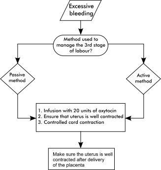
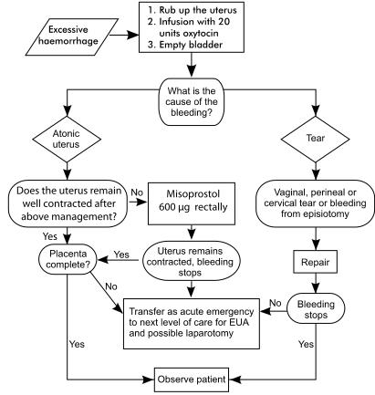

5
{:.chapter-number}

# The third stage of labour

Before you begin this unit, please take the corresponding test to assess your knowledge of the subject matter. You should redo the test after you’ve worked through the unit, to evaluate what you have learned.

## Objectives

When you have completed this unit you should be able to:

*	Define the third stage of labour.
*	Manage the third stage of labour.
*	List the observations needed during the third stage of labour.
*	Examine a placenta after delivery.
*	Manage a patient with prolonged third stage of labour.
*	Manage a patient with retained placenta.
*	List the causes of postpartum haemorrhage.
*	Manage a patient with postpartum haemorrhage.
*	Prevent infection of the staff with HIV at delivery.

## The normal third stage of labour

### 5-1 What is the third stage of labour?

The third stage of labour starts immediately after the delivery of the infant and ends with the delivery of the placenta and membranes.

### 5-2 How long does the normal third stage of labour last?

The normal duration of the third stage of labour lasts less than 30 minutes, and mostly only two to five minutes.

### 5-3 What happens during the third stage of labour?

1.	Uterine contractions continue, although less frequently than in the second stage.
1.	The uterus contracts and becomes smaller and, as a result, the placenta separates.
1.	The placenta is squeezed out of the upper uterine segment into the lower uterine segment and vagina. The placenta is then delivered.
1.	The contraction of the uterine muscle compresses the uterine blood vessels and this prevents bleeding. Thereafter, clotting (coagulation) takes place in the uterine blood vessels due to the normal clotting mechanism.

### 5-4 Why is the third stage of labour important?

Excessive bleeding is a common complication during the third stage of labour. Therefore, the third stage, if not correctly managed, can be an extremely dangerous time for the patient. Postpartum haemorrhage is the commonest cause of maternal death in some developing countries.

> The third stage of labour can be a very dangerous time and, therefore, must be correctly managed.

## Managing the third stage of labour

### 5-5 How should the third stage of labour be managed?

There are two ways of managing the third stage of labour:

1.	The active method.
1.	 The passive method.

Whenever possible, the active method should be used. However, midwives conducting deliveries alone, without an assistant, in a midwife obstetric unit or level 1 hospital may use the passive method. Midwives who choose to use the passive method of managing the third stage of labour MUST also be able to confidently use the active method, as this method may have to be used in some patients.

> Everybody conducting a delivery must be able to use the active method of managing the third stage of labour.

### 5-6 What are the advantages and disadvantages of the active method of managing the third stage of labour?

Advantages:

1.	Blood loss is less than when the active method is used. Therefore the active method reduces the incidence of postpartum haemorrhage.
1.	There is less possibility that oxytocin will be needed to contract the uterus following the third stage of labour.

Disadvantages:

1.	The person actively managing the third stage of labour must not leave the patient. Therefore, an assistant is needed to give the oxytocic drug and examine the newborn infant, while the person conducting the delivery continues with the management of the third stage of labour.
1.	The risk of a retained placenta is increased if the active method is not carried out correctly, especially if the first two contractions after the delivery of the infant are not used to deliver the placenta.
1.	Excessive traction on the umbilical cord can result in inversion of the uterus, especially if the fundus of the uterus is not supported by placing a hand above the bladder on the abdomen.

> Blood loss during the third stage of labour is less when the active management is used.

### 5-7 What is the active management of the third stage of labour?

1.	Immediately after the delivery of the infant, an abdominal examination is done to exclude a second twin.
1.	An oxytocic drug is given if no second twin is present.
1.	When the uterus contracts, *controlled cord traction* must be applied:
	*	Keep steady tension on the umbilical cord with one hand.
	*	Place the other hand just above the symphysis pubis and push the uterus upwards.

	Controlled cord traction is also called the Brandt–Andrews method (manoeuvre).

1.	Placental separation will take place when the uterus contracts. When controlled cord traction is applied the placenta will be moved down from the upper segment to the lower segment of the uterus.
1.	Once this occurs, continuous light traction on the umbilical cord will now deliver the placenta from the lower uterine segment or vagina.
1.	If placental separation does not take place during the first uterine contraction after giving the oxytocic drug, wait until the next contraction occurs and then repeat the manoeuvre.

With the passive method of managing the third stage of labour, the patient is asked to bear down only after there are signs of placental separation. An oxytocic drug is only given after the placenta has been delivered.

### 5-8 Which oxytocic drug is usually given during the third stage of labour?

One of the following two drugs is generally given:

1.	Oxytocin (Syntocinon ) 10 units. This is given intramuscularly. It is not necessary to protect this drug against direct light. Although the drug must also be kept in a refrigerator, it has a shelf life of one month at room temperature.
1.	Syntometrine. This is given by intramuscular injection. Syntometrine is supplied in a 1 ml ampoule which contains a mixture of five units oxytocin and 0.5 mg ergometrine maleate. The drug must be protected from direct light at all times and must be kept in a refrigerator. The ampoules must, therefore, be kept in an opaque container in the refrigerator.

Oxytocin (Syntocinon) is the drug of choice. However, as Syntometrine is still widely prescribed, the correct use of this drug will also be explained.

The latest information in the Cochrane Review indicates that the best drug and dosage to use is oxytocin 10 units.

> Oxytocin is the drug of choice in the management of the third stage of labour.

### 5-9 What are the actions of the two components of syntometrine?

1.	Oxytocin causes physiological uterine contractions which start two to three minutes after an intramuscular injection and continue for approximately one to three hours.
1.	Ergometrine causes a tonic contraction of the uterus which starts five to six minutes after an intramuscular injection and continues for about three hours.

### 5-10 What are the contraindications to the use of syntometrine?

Syntometrine contains ergometrine and, therefore, should not be used if:

1.	The patient is hypertensive. Ergometrine causes vasospasm which may result in a severe increase in the blood pressure.
1.	The patient has heart valve disease. Tonic contraction of the uterus pushes a large volume of blood into the patient’s circulation, which may cause heart failure with pulmonary oedema.

> Make sure that there are no contraindications before using syntometrine.

### 5-11 What oxytocic drug should be used if there is a contraindication to the use of syntometrine?

Oxytocin (Syntocinon) should be used. An intravenous infusion of 10 units oxytocin in 200 ml normal saline is given at a rate of 30 drops per minute or 10 units oxytocin are given by intramuscular injection.

### 5-12 Should the umbilical cord be allowed to bleed before the placenta is delivered?

1.	The umbilical cord must *not* be allowed to bleed after the delivery of the first infant in a multiple pregnancy. In identical twins with a single placenta (monochorionic placenta), the undelivered second twin may bleed to death if the umbilical cord of the first born infant is allowed to bleed. Therefore, the forceps should be left in place on the umbilical cord after the delivery of the first twin.
1.	The umbilical cord should be allowed to bleed if the patient’s blood group is Rhesus negative (Rh negative) with a single fetus. This will reduce the risk of fetal blood crossing the placenta to the mother’s circulation and, thereby, sensitizing the patient. Nevertheless, anti-D immunoglobulin must always be given to these patients.
1.	Allowing the umbilical cord to bleed during the third stage of labour, reduces the placental volume and, thereby, speeds up the separation of the placenta. As a general rule, the umbilical cord should be allowed to bleed once a multiple pregnancy has been excluded. Recent research suggest that the umbilical cord is best clamped and cut three minutes after delivery to allow the infant to receive extra blood from the placenta.

> Allowing the umbilical cord to bleed after delivering the infant speeds up the separation of the placenta.

### 5-13 What recordings must always be made during and after the third stage of labour?

1.	Recordings made about the third stage of labour:
	*	Duration of the third stage.
	*	The amount of blood lost.
	*	Medication given.
	*	The condition of the perineum and the presence of any tears.
1.	Recordings made immediately after the delivery of the placenta:
	*	Whether the uterus is well contracted or not.
	*	Any excessive vaginal bleeding.
	*	A short note on the suturing of an episiotomy or perineal tear.
	*	The patient’s pulse rate, blood pressure and temperature.
	*	The completeness of the placenta and membranes, and any placental abnormality.
1.	Recordings made during the first hour after the delivery of the placenta:
	*	During this time (sometimes called the fourth stage of labour) it is important to record whether the uterus is well contracted and whether there is any excessive bleeding. During the first hour after the completion of the third stage of labour, there is a high risk of postpartum haemorrhage.
	*	If the third stage of labour and the observations were normal, the patient’s pulse rate and blood pressure should be measured again an hour later.
	*	If the third stage of labour was not normal, the observations must be repeated every 15 minutes, until the patient’s condition is normal. Thereafter, the observations should be repeated every hour for further four hours.

> During the first hour after the delivery it is essential to ensure that the uterus is well contracted and that there is no excessive bleeding.

### 5-14 When should the infant be given to the mother to hold and put to the breast?

As soon as possible after delivery. Usually the infant is well dried and then placed on the mother’s abdomen if the infant is crying or breathing well. Wait three minutes before clamping the umbilical cord and then give the infant to the mother to hold and place to the breast. The nipple stimulation causes uterine contractions which may help placental separation.

## Examination of the placenta after birth

### 5-15 How should you examine the placenta after delivery?

Every placenta must be examined for:

1.	Completeness. Make sure that both the placenta and the membranes are complete after the delivery of the placenta:
	*	The membranes are examined for completeness by holding the placenta up by the umbilical cord so that the membranes hang down. You will see the round hole through which the infant was delivered. Examine the membranes carefully to determine whether they are complete.
	*	The placenta is now held in both hands and the maternal surface is inspected after the membranes are folded away. A missing part of the placenta, or cotyledon, is thus easily noticed.
1.	Abnormalities.
	*	Cloudy membranes, or a placenta that smells offensive, suggest the presence of chorioamnionitis. Peeling the amnion off the chorion is the best way of examining the amnion over the placenta for cloudiness caused by chorioamnionitis.
	*	Clots of blood which stick to the maternal surface suggest that abruptio placentae has occurred.
	*	Infarcts can be recognised as firm, pale areas on the maternal surface of the placenta. Calcification on the maternal surface is normal.
1.	Umbilical cord. Two arteries and a vein should be seen on the cut end of the umbilical cord. If only one umbilical artery is present, the infant must be carefully examined for other congenital abnormalities.
1.	Size. Finally the placenta must be weighed. The weight of the placenta increases with gestational age and is usually 1/6 the weight of the infant, i.e. 450–650 g at term. If the placenta is abnormally large and heavy, the following possibilities must be considered:
	*	A heavy, oedematous placenta is suggestive of congenital syphilis.
	*	A heavy, pale placenta is suggestive of Rhesus haemolytic disease.
	*	A placenta which is heavier than would be expected for the weight of the infant, but with a normal appearance, is suggestive of maternal diabetes.

	A placenta which weighs less than would be expected for the weight of the infant, is suggestive of fetal intra-uterine growth restriction (IUGR).

> All placentas must be carefully examined for completeness and abnormalities after delivery.

## The abnormal third stage of labour

### 5-16 What is a prolonged third stage of labour?

If the placenta has still not been delivered after 30 minutes, the third stage is said to be prolonged.

> The third stage is prolonged when the placenta still has not been delivered after 30 minutes.

### 5-17 How should a prolonged third stage of labour be managed?

1.	If the active method has been applied and failed:
	*	An infusion with 20 units of oxytocin in 1000 ml Basol or normal saline must be started and run in rapidly.
	*	Once the uterus is well contracted, try again to deliver the placenta by controlled cord traction.

### 5-18 What should be done if the placenta is still not delivered, after the routine management of a prolonged third stage of labour?

A vaginal examination must be done:

1.	If the placenta or part of the placenta is palpable in the vagina or lower segment of the uterus, this confirms that the placenta has separated. By pulling on the umbilical cord with one hand, while pushing the fundus of the uterus upwards with the other hand (i.e. controlled cord traction), the placenta can be delivered.
1.	If the placenta or part of the placenta is not palpable in the vagina or lower segment of the uterus and only the umbilical cord is felt, then the placenta is still in the upper segment of the uterus and a diagnosis of retained placenta must be made.

> A retained placenta is diagnosed if the management of prolonged labour has failed.

### 5-19 What is the management of a retained placenta?

1.	Continue with the intravenous infusion of oxytocin and make sure that the uterus is well contracted. This will reduce the risk of postpartum haemorrhage.
1.	While waiting for the theatre to be ready or transfer of the patient, check continuously whether the uterus remains well contracted and for excessive vaginal bleeding. The blood pressure and pulse must be measured and recorded every 30 minutes.
1.	If the patient is at a clinic or a level 1 hospital without an operating theatre, she must be transferred to a level 2 or 3 hospital, for manual removal of the placenta under general anaesthesia.
1.	Keep the patient ‘nil per mouth’.

## Managing a postpartum haemorrhage

### 5-20 What is a postpartum haemorrhage?

1.	Blood loss of more than 500 ml within the first 24 hours after delivery of the infant.
1.	Any bleeding after delivery, which appears excessive.

> Any excessive bleeding after delivery should be considered to be a postpartum haemorrhage and managed as such.

### 5-21 What should be done if a patient has a postpartum haemorrhage?

The management will depend on whether the placenta has been delivered or not.

### 5-22 What is the management of a postpartum haemorrhage, if the placenta has not been delivered?

1.	If the active method has been used to manage the third stage of labour, a rapid intravenous infusion of 20 units oxytocin in 1000 ml Basol or normal saline must be started, to ensure that the uterus is well contracted. A further attempt should now be made to deliver the placenta. Immediately after the delivery of the placenta, make sure that the uterus is well contracted, by rubbing up the fundus.
1.	If the attempt to deliver the placenta fails, the patient has a retained placenta and should be managed for a retained placenta.

The management of a patient with a postpartum haemorrhage before the delivery of the placenta is summarised in figure 5-1.

Figure 5-1: The management of a patient with a postpartum haemorrhage before the delivery of the placenta
{:.figure-caption}

### 5-23 What is the management of a patient with a postpartum haemorrhage, if the placenta has already been delivered?

This is a dangerous complication, which must be rapidly and correctly managed, according to a clear plan:

*Step 1*: Call for help. One cannot manage a postpartum haemorrhage alone. Someone needs to get the oxytocin, cannulas, infusion sets and intravenous fluids while the other person is controlling the bleeding.

*Step 2*: The uterus must immediately be rubbed up, i.e. massaged. This will cause the uterus to contract and stop bleeding in most cases.

If the bleeding persists following rubbing up the uterus, bleeding must be controlled by bi-manual compression of the uterus. A fist is inserted in the vagina or four fingers with the palm upwards in the posterior fornix of the vagina, with the other hand pushing down on the fundus of the uterus abdominally.

*Step 3*: A rapid intravenous infusion of 20 units oxytocin in 1000 ml Plasmalyte B or normal saline must be started. Once again, make sure that the uterus is well contracted, by massaging it.

*Step 4*: The patient’s bladder must be emptied. A full bladder can cause the uterus to contract poorly, with resultant haemorrhage.

These four steps must always be carried out, irrespective of the cause of the postpartum haemorrhage. The cause of the haemorrhage must now be diagnosed.

Note
:	Bleeding can also be controlled by aortic compression. The aorta can be compressed abdominally by pressing down at the level of the umbilicus. Compression of the aorta is particularly useful during a laparotomy for postpartum haemorrhage.

> A postpartum haemorrhage is a dangerous complication and must be managed according to a definite plan.

The management of a patient with a postpartum haemorrhage after the delivery of the placenta is summarised in figure 5-2.

Figure 5-2: The management of a patient with a postpartum haemorrhage after the delivery of the placenta
{:.figure-caption}

### 5-24 What are the main causes of postpartum haemorrhage?

The two main causes of postpartum haemorrhage are:

1.	Haemorrhage due to an atonic (poorly contracted) uterus.
1.	Haemorrhage due to trauma, usually in the form of tears (lacerations).

It is very important that they are differentiated from one another as this will determine the correct management.

> The two main causes of postpartum haemorrhage are an atonic uterus and trauma.

### 5-25 What clinical signs indicate that the bleeding is caused by an atonic uterus?

1.	The uterus is atonic (feels soft and spongy), or tends to become atonic after it is rubbed up or after an oxytocin infusion is given.
1.	The bleeding is intermittent and consists mainly of dark red clots.
1.	If the uterus is rubbed up and becomes well contracted, a large amount of dark red blood clots escapes from the vagina.

> Bleeding from an atonic uterus occurs in episodes and consists of dark red blood clots.

### 5-26 What are the possible causes of an atonic uterus?

1.	A uterus full of blood clots is the commonest cause.
1.	A full bladder.
1.	Retained placental cotyledons.
1.	Factors during the pregnancy, which resulted in an abnormally large uterus:
	*	A large infant.
	*	A multiple pregnancy.
	*	Polyhydramnios.
1.	A prolonged first stage of labour.
1.	The intravenous infusion of oxytocin during the first stage of labour.
1.	General anaesthesia.
1.	Grande multiparity.
1.	Abruptio placentae.

> The commonest causes of an atonic uterus are a uterus full of blood clots and a full bladder.

### 5-27 What is the correct management of postpartum haemorrhage, if the clinical signs indicate bleeding from an atonic uterus?

1.	Rub up the uterus, empty the patient’s bladder and start a fast intravenous infusion of 20 units oxytocin in 1000 ml Basol or normal saline.
1.	If the uterus still tends to relax, examine the placenta again, to check whether it is complete.
1.	If the placenta is not complete, manage the patient as detailed in section 5-28.
1.	If the placenta is complete and the uterus remains poorly contracted, the patient must be referred to a hospital with theatre facilities. This is an extremely serious complication, which could result in the patient’s death. While waiting for the theatre or arranging transfer, the following management must be followed:
	*	Start a second, rapidly running, intravenous infusion and take a sample of blood for urgent cross-matching. A blood transfusion must be started as soon as possible.
	*	The uterus must be bi-manually compressed as explained in Step 2 of section 5-23. This should control the bleeding, until the patient is in theatre or until she reaches a level 2 hospital.
	*	Lie the patient flat, or in the head-down position and give oxygen by means of a face mask.
1.	Place three misoprostol (Cytotec) tablets (one tablet = 200 µg) in the patient’s rectum.

### 5-28 What is the further management of postpartum haemorrhage due to an atonic uterus if the initial management fails?

All patients that did not respond to the initial emergency management should be transferred as acute emergencies to an appropriate level of care, which will be at least level 1 hospitals with theatre facilities and emergency blood available.

Prostaglandin F2-alpha is a potent uterotonics agent. The drug may be injected into the myometrium. 5 mg is added to 20 ml saline and 2 ml injected into various sites in the myometrium being careful not to inject intravascularly. Alternatively 5 mg may be added to a litre of the crystalloid infusion.

If the uterus continues to relax, the patient needs to be taken to theatre in a level 2 hospital. Four units of blood and a person with the skills to do an emergency hysterectomy need to be available if required. While waiting for theatre bi-manual compression of the uterus should be applied to reduce further blood loss.

In theatre an examination under general anaesthetic (EUA) is done:

1.	Inspect the vagina and cervix for tears.
1.	A bi-manual examination and exploration of the uterine cavity with two fingers for retained placental tissue and a possible laceration.
1.	The uterus is further emptied with a large ovum forceps and then firmly curetted with a Baum’s curette.

Trans-abdominal ultrasound in theatre is of value to confirm that the uterus is empty.

Inserting a balloon cather could be valuable to reduce the bleeding while waiting for theatre or if the patient is primiparous or of low parity, where a hysterectomy after evacuation would be a last option. The balloon cather is made by using a large Foley’s catheter and surgical latex glove. The glove is tied around the Foley’s catheter above the bulb. Any suture material can be used. Saline is infused under pressure into the glove either by injecting with a syringe or by squeezing a vacolitre. Once 500 ml of saline has been infused the catheter is clamped. The balloon catheter is used in conjunction with oxytocics or misoprostol.

It is important to note that the clinician must progress to the next step without delay until it is certain that the bleeding has stopped.

If the bleeding persists a laparotomy (midline incision) is required:

1.	If the patient has completed her family or is of high parity, proceed directly with a total abdominal hysterectomy.
1.	If the patient is primiparous or of low parity, the following steps could be followed:
	*	The patient is draped in the lithotomy position with the legs angled slightly downwards at about 30 degrees. This allows the surgeon more room during the operation. This will allow immediate inspection to assess the result of intra-abdominal measures to reduce blood loss.
	*	Compression sutures are inserted (B-Lynch sutures). The bladder peritoneum is opened. A Vicryl 1 suture is passed through the lower segment 2–3 cm from the lateral border of the uterus. These sutures are tied as tight as possible on top for the uterus 3–4 cm medial to the uterine cornu.
1.	If the bleeding persists systematic devascularisation of the uterus is required. Number one absorbable suturing material is used on a large round bodied (taper) needle.
	*	First, ligate the uterine artery. A suture is inserted through full thickness myometrium just above the deflection of the broad ligament on the pelvic floor. This will be at the level of the internal os of the cervix. The anterior entry and posterior exit point of the needle will be 2 cm medial to the lateral insertion of the broad ligament. Pass the needle back from posterior to anterior through an avacular portion of the broad ligament and tie a tight knot. If bleeding persists a similar suture is inserted on the other side of the uterus.
	*	If bleeding persists the anastomosis of the ovarian and uterine artery is ligated with a similar suture inserted above the level of the insertion of the ovarian ligament to the uterus and below the uterine tube. Both anastomoses need to be ligated with persistent bleeding.
	*	If bleeding persists proceed with a hysterectomy as a life saving procedure. A less experienced surgeon should perform a subtotal hysterectomy, by amputating the uterus above the cervix following the ligation of the uterine arteries.

As a general principle the decision to do a hysterectomy must not be postponed too long. Continued blood loss requiring the transfusion of five or more units of blood compromise blood clotting and increase the risk of a maternal death.

### 5-29 What should be done if the membranes or placenta are not complete after delivery and the patient is not bleeding?

1.	Incomplete membranes usually do not cause any complications.
1.	An incomplete placenta with one or more cotyledons missing can cause a postpartum haemorrhage due to an atonic uterus. Therefore, manage as follows:
	*	An intravenous infusion of 20 units oxytocin in 1000 ml Basol or normal saline must be started to make sure that the uterus is well contracted.
	*	Arrange for an evacuation of the uterus or transfer the patient to a hospital with theatre facilities to evacuate the uterus.
	*	Keep the patient ‘nil per mouth’ as a general anaesthetic will be necessary.

> An evacuation of the uterus under general anaesthesia is required if placental cotyledons are retained in the uterus.

### 5-30 What can be done to reduce the risk of postpartum haemorrhage?

In patients who are at high risk of postpartum haemorrhage (e.g. multiple pregnancy, polyhydramnios or grande multiparity) the following should be done:

1.	An intravenous infusion should be started during the active phase of the first stage of labour.
1.	Twenty units of oxytocin in 1000 ml Basol or normal saline should be given by rapid infusion after the placenta has been delivered.
1.	Make sure that the uterus is well contracted during the first hour after the delivery of the placenta and make sure that the patient empties her bladder frequently.

### 5-31 What clinical signs indicate that the bleeding is from a tear?

1.	The uterus is well contracted.
1.	A continuous trickle of bright red blood comes from the uterus in spite of a well contracted uterus.

> Bleeding from a tear causes a continuous trickle of bright red blood in spite of a well contracted uterus.

### 5-32 What is the correct management if the clinical signs indicate that the bleeding is from a tear?

The patient should be placed in the lithotomy position and examined as follows:

1.	First the perineum must be examined for bleeding from a a tear or episiotomy. Repair any tear or episiotomy.
1.	Thereafter, the vagina must be examined for a tear using the index finger of each hand to hold the vagina open. If available, a retractor (a Werdheim’s retractor) is helpful in examining the vagina. If a tear is found it must be sutured.
1.	If a perineal or vaginal tear cannot be found, a cervical tear or even a ruptured uterus may be present.

### 5-33 What will the further management be once a perineal and vaginal tear has been excluded and the bleeding persists?

The patient is put into the Lithotomy position. A good light and a cervical suturing pack must be available. The cervical suturing pack contains three swab holders, a Sims speculum (or Auvard’s speculum) and a Werdheim retractor. The postpartum cervix is very floppy and it can be difficult to orientate oneself. Also there is often a lot of blood making vision difficult.

1.	The vagina is held open with a posterior inserted Sims speculum (or Auvard’s speculum) and an anterior inserted Werdheim retractor. A swab holder is placed on the cervix at 12 o’clock to serve as a marker. A second swab holder is placed next to it. The part of the cervix between the swab holders is inspected for a tear. A third swab holder is placed next to the second swab holder and the part of the cervix between the swab holders is inspected for a tear. The second swab holder is then placed next to the third swab holder and the cervix between them examined. The process of alternating the second and third swab holders and examining the cervix in between is repeated around the cervix until one reaches the first ‘marker’ swab holder. The entire cervix will then have been thoroughly examined.
1.	If a cervical tear is found, two swab holders are placed on both sides of the tear and if downward traction allows the full length of the tear to be seen, the tear is sutured. If the apex of the tear cannot be seen the patient needs to be taken to theatre and consent signed and preparations made for a possible hysterectomy.
1.	In theatre a bi-manual examination and exploration of the uterine cavity with two fingers for retained placental tissue is done. If the apex of the cervical laceration is seen, the tear is sutured. Larger tears will require a laparotomy and in most cases a hysterectomy.

### 5-34 What is the correct management for bleeding from an episiotomy?

1.	If the episiotomy has not yet been stitched, it should be repaired. Make sure that all bleeding stops.
1.	If the episiotomy has already been repaired, the stitches must be removed and the bleeding vessels must be identified and tied off. Then the episiotomy must be resutured.

### 5-35 Which patients are at high risk of a cervical tear?

1.	Patients who bear down and deliver an infant before the cervix is fully dilated.
1.	Patients with a rapid labour when the cervix dilates very quickly (a precipitous delivery).
1.	Patients who have an instrument delivery.

### 5-36 How can you recognise an inverted uterus?

1.	The diagnosis must be considered if a patient suddenly becomes shocked during the third stage of labour without excessive vaginal bleeding.
1.	No uterus is palpable on abdominal examination.
1.	The uterus lies in the vagina or may even hang out of the vagina.

### 5-37 What is the management of a patient with an inverted uterus?

1.	Two fast running intravenous infusions must be started to treat the shock.
1.	The patient must be transferred to a level 2 or 3 hospital as an emergency.

Bleeding disorders can also result in postpartum haemorrhage. Placental abruption is the commonest cause of a bleeding disorder in the third stage of labour. In this situation it is extremely important to ensure that the uterus is well contracted after the delivery of the placenta. The powerful contraction of the uterus plays a greater role than blood clotting in the prevention of bleeding.

## Protecting the staff from HIV infection during labour

### 5-38 What should be done during labour to prevent the staff from becoming infected with the human immunodeficiency virus (HIV)?

All patients should be regarded as being potentially infected with HIV, the virus which causes AIDS (acquired immunodeficiency syndrome). The virus is present in blood, liquor and placental tissue. Contamination of the eyes or cuts on the hands or arms, and pricks by contaminated needles carry a small risk of causing infection.

Therefore, the following precautions should be taken for all deliveries:

1.	The person conducting the delivery must wear gloves and a plastic apron. A face mask and goggles are recommended. People wearing glasses need only a mask to protect their face.
1.	Any person who resuscitates the infant or cleans the labour ward after the delivery must wear gloves.
1.	The umbilical cord must be squeezed to empty it of blood before applying the second clamp. This will prevent blood spurting out when the cord is cut.
1.	Injection needles must be placed in a sharps container *immediately* after being used. Needles must not be replaced into their sheaths.
1.	When an episiotomy is repaired, the needle must only be held with needle holder and the tissues with forceps.
1.	The needle should be cut loose from the suture material and replaced in the dish as soon as possible. When the needle is to be used again, it must be held in a safe manner with forceps.

> Procedures aimed at preventing the infection of staff with HIV must be strictly enforced.

## Case study 1

Following normal first and second stages of labour, the third stage of labour is actively managed. The patient was not hypertensive during her pregnancy and does not have a history of heart valve disease. Syntometrine is given by intramuscular injection and the patient is observed for signs of placental separation.

### 1. Were the necessary precautions taken before giving the Syntometrine ?

No. A second twin must be excluded before giving the Syntometrine.

### 2. Is the third stage of labour being correctly managed by the active method?

No. The placenta must be delivered when the uterus contracts. If the active method of managing the third stage is used, it is incorrect to wait for signs of placental separation.

### 3. How soon after giving the Syntometrine does the uterus contract?

Syntometrine includes oxytocin which causes uterine contractions two to three minutes after intramuscular administration.

### 4. What should have been done as soon as the uterus contracted?

The umbilical cord should have been steadily pulled with one hand while the other hand was pushing upwards on the uterus, i.e. controlled cord traction. Placental separation and then placental delivery occur with the uterine contraction.

### 5. What should be done if placental separation does not take place with the first uterine contraction?

A second uterine contraction will occur five to six minutes after giving Syntometrine by intramuscular injection due to the action of the ergometrine. A second attempt must now be made to deliver the placenta by controlled cord traction. Most placentas which are not delivered with the first contraction will be delivered with the second contraction.

## Case study 2

A patient with normal first and second stages of labour has been delivered by a midwife working alone at a peripheral clinic. A second twin is excluded on abdominal examination and the passive method is used to manage the third stage of labour. After 30 minutes there has been no sign of placental separation. A diagnosis of retained placenta is made and the doctor in the nearest district hospital phoned. The doctor agrees to accept the patient and arranges ambulance transfer to the hospital.

### 1. Is the diagnosis of a retained placenta correct?

No. The diagnosis of retained placenta can only be made if the placenta is not delivered after the active method of managing the third stage of labour has been used. The correct diagnosis is a prolonged third stage of labour.

### 2. What should have been done in this case of a prolonged third stage of labour?

The placenta should have been delivered by the active method of managing the third stage of labour, i.e. by giving oxytocin 10 units intramuscular and using controlled cord traction.

### 3. What should be done in a peripheral clinic if the placenta is retained?

The patient should be transferred to a hospital with theatre facilities for a manual removal of the placenta under general anaesthesia.

### 4. What complication is this patient at high risk of developing?

A postpartum haemorrhage due to an atonic uterus.

### 5. What should have been done in this case to make the patient’s transfer to hospital safer?

An intravenous infusion of 20 units oxytocin in 1000 ml Basol or normal saline should have been started. She should also have been carefully observed to make sure that the uterus was well contracted. Make sure that the uterus remains well contracted, and measure the blood pressure and pulse rate every 15 minutes until the patient is transferred.

## Case study 3

After normal first and second stages of labour in a grande multipara, the placenta is delivered by the active management of the third stage of labour. There are no complications. Half an hour later you are called to see the patient as she is bleeding vaginally. You immediately measure her blood pressure which indicates that she is shocked.

### 1. Was the patient’s third stage of labour correctly managed?

No. As the patient falls into a high risk group for postpartum haemorrhage, an intravenous infusion should have been started during the first stage of labour. Twenty units of oxytocin should have been added to the infusion after the placenta was delivered. The patient should also have been carefully observed to make sure that the uterus remained well contracted.

### 2. Do you agree that the first step in the management of postpartum haemorrhage is to measure the blood pressure?

No. The first step should be to rub up the uterus in order to stop the bleeding.

### 3. What should be the further management of this patient?

A rapid intravenous infusion of 20 units oxytocin in 1000 ml Basol or normal saline should be started. Make sure that the uterus is well contracted. Then check that the patient’s bladder is empty as a full bladder can cause relaxation of the uterus.

### 4. What additional management is needed for this patient?

The cause of the bleeding must now be found. The two important causes of postpartum haemorrhage are an atonic uterus or a tear.

### 5. What is the most probable cause of this patient’s postpartum haemorrhage?

As she is a grande multipara the most likely cause is an atonic uterus.

### 6. What are the clinical signs of bleeding due to an atonic uterus?

The uterus will not be well contracted and will tend to relax after it is rubbed up. In addition, the bleeding is not continuous but occurs in episodes, and the blood consists of dark red clots.

## Case study 4

A primigravid patient who did not co-operate well during the first stage of labour delivers soon after a vaginal examination. At the examination the cervix was found to be 7 cm dilated and paper thin. When observations were made an hour after delivery of the placenta, the patient was found lying in a pool of blood. Her uterus was well contracted and her bladder was empty.

### 1. What should be the next step in the management of this patient?

A rapid intravenous infusion of 20 units oxytocin in 1000 ml Plasmalyte B or normal saline should be started and you should make sure that the uterus is well contracted.

### 2. In spite of this management a continuous trickle of bright red blood is observed. What is the most likely cause of the bleeding?

A tear.

### 3. Why is this patient at high risk of a cervical tear?

Because the infant was delivered through an incompletely dilated cervix.

### 4. What should be the next step in the management of this patient?

The patient must be placed in the lithotomy position and be examined for a vaginal or perineal tear. Any tear must be sutured.

### 5. The midwife who is managing this patient does not find either a vaginal or perineal tear. What should be the next step in the management of this patient?

A doctor should examine the patient for a cervical tear. The most likely site of a tear is the cervix as this patient probably delivered before full cervical dilatation.
