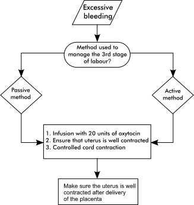

11
{:.chapter-number}

# The third stage of labour

Take the chapter test before and after you read this chapter.



## Contents
{:.non-printing}

*   [Objectives](#objectives)
*   [The normal third stage of labour](#the-normal-third-stage-of-labour)
*   [Managing the third stage of labour](#managing-the-third-stage-of-labour)
*   [Examination of the placenta after birth](#examination-of-the-placenta-after-birth)
*   [The abnormal third stage of labour](#the-abnormal-third-stage-of-labour)
*   [Managing postpartum haemorrhage](#managing-postpartum-haemorrhage)
*   [Protecting the staff from HIV infection](#protecting-the-staff-from-hiv-infection)
*   [Case studies](#case-study-1)
{:.chapter-toc}

## Objectives

When you have completed this unit you should be able to:

*	Define the third stage of labour.
*	Manage the third stage of labour.
*	List the observations needed during the third stage of labour.
*	Examine a placenta after delivery.
*	Manage a patient with a prolonged third stage of labour.
*	Manage a patient with a retained placenta.
*	List the causes of postpartum haemorrhage.
*	Manage a patient with postpartum haemorrhage.
*	Prevent infection of the staff with HIV at delivery.

## The normal third stage of labour

### 11-1 What is the third stage of labour?

The third stage of labour starts immediately after the delivery of the infant and ends with the delivery of the placenta and membranes.

### 11-2 How long does the normal third stage of labour last?

The normal duration of the third stage of labour depends on the method used to deliver the placenta. It usually lasts less than 30 minutes, and mostly only 2 to 5 minutes.

### 11-3 What happens during the third stage of labour?

1.	Uterine contractions continue, although less frequently than in the second stage.
2.	The uterus contracts and becomes smaller and, as a result, the placenta separates.
3.	The placenta is squeezed out of the upper uterine segment into the lower uterine segment and vagina. The placenta is then delivered.
4.	The contraction of the uterine muscle compresses the uterine blood vessels and this prevents bleeding. Thereafter, clotting (coagulation) takes place in the uterine blood vessels due to the normal clotting mechanism.

### 11-4 Why is the third stage of labour important?

Excessive bleeding is a common complication during the third stage of labour. Therefore, the third stage, if not correctly managed, can be an extremely dangerous time for the patient. Postpartum haemorrhage is the commonest cause of maternal death in some developing countries.

> The third stage of labour can be a very dangerous time and, therefore, must be correctly managed.

## Managing the third stage of labour

### 11-5 How should the third stage of labour be managed?

There are two ways of managing the third stage of labour:

1.	The active method.
2.	The passive method.

Whenever possible, the active method should be used. However, a midwife working on her own may need to use the passive method. 

Midwives who choose to use the passive method of managing the third stage of labour *must* also be able to confidently use the active method, as this method may have to be used in some patients.

> Everybody conducting a delivery must be able to use the active method of managing the third stage of labour.

### 11-6 What is the active management of the third stage of labour?

1.	Immediately after the delivery of the infant, an abdominal examination is done to exclude a second twin.
2.	An oxytocic drug is given if no second twin is present.
3.	When the uterus contracts, controlled cord traction must be applied:
	*	Keep steady tension on the umbilical cord with one hand.
	*	Place the other hand just above the symphysis pubis and push the uterus upwards.

	Note
	:	Controlled cord traction is also called the Brandt-Andrews method (manoeuvre).

4.	Placental separation will take place when the uterus contracts. When controlled cord traction is applied the placenta will be delivered from the upper segment of the uterus.
5.	Once this occurs, continuous light traction on the umbilical cord will now deliver the placenta from the lower uterine segment or vagina.
6.	If placental separation does not take place during the first uterine contraction after giving the oxytocic drug, wait until the next contraction occurs and then repeat the manoeuvre.

### 11-7 Which oxytocic drug is usually given during the third stage of labour?

One of the following two drugs is generally given:

1.	Oxytocin (Syntocinon) 10 units. This is given intramuscularly. It is not necessary to protect this drug against direct light. Although the drug must also be kept in a refrigerator, it has a shelf life of 1 month at room temperature.
2.	Syntometrine. This is given by intramuscular injection after the delivery of the infant. Syntometrine is supplied in a 1 ml ampoule which contains a mixture of 5 units oxytocin and 0.5 mg ergometrine maleate. The drug must be protected from direct light at all times and must be kept in a refrigerator. At all times the ampoules must, therefore, be kept in an opaque container in the refrigerator.

Oxytocin (Syntocinon) is the drug of choice. However, as Syntometrine is still generally prescribed, the correct use thereof will also be explained.

Note
:	The latest information in the Cochrane Library indicates that the best drug and dosage to use is oxytocin 10 units.

### 11-8 What are the actions of the two components of Syntometrine?

1.	Oxytocin causes physiological uterine contractions which start 2 to 3 minutes after an intramuscular injection and continue for approximately 1 to 3 hours.
2.	Ergometrine causes a tonic contraction of the uterus which starts 5 to 6 minutes after an intramuscular injection and continues for about 3 hours.

### 11-9 What are the contraindications to the use of Syntometrine?

Syntometrine contains ergometrine and, therefore, should not be used if:

1.	The patient is hypertensive. Ergometrine causes vasospasm which may result in a severe increase in the blood pressure.
2.	The patient has heart valve disease. Tonic contraction of the uterus pushes a large volume of blood into the patient’s circulation, which may cause heart failure with pulmonary oedema.

> Make sure that there are no contraindications before using Syntometrine.

### 11-10 What oxytocic drug should be used if there is a contraindication to the use of Syntometrine?

Oxytocin (Syntocinon) should be used. An intravenous infusion of 10 units oxytocin in 200 ml normal saline is given at a rate of 30 drops per minute (20 drops per ml dropper) or 10 units oxytocin are given by intramuscular injection.

### 11-11 What is the passive method of managing the third stage of labour?

1.	After delivery of the infant the signs of placental separation are waited for.
2.	When the signs of placental separation appear, the patient is asked to bear down and the placenta is delivered spontaneously, by maternal effort only.
3.	Only after the placenta has been delivered is an oxytocic drug given.

### 11-12 What are the signs of placental separation?

1.	Uterine contraction.
2.	The fundus of the uterus rises in the abdomen, when the placenta moves from the upper segment of the uterus to the lower segment and vagina.
3.	Lengthening of the umbilical cord. This sign is most easily seen if the cord is clamped with forceps at the vulva. Any lengthening of the umbilical cord above the forceps is then easily noticed.
4.	An amount of blood suddenly escapes from the vagina.

Separation of the placenta can now be confirmed by applying suprapubic pressure. The placenta has definitely separated if the umbilical cord does not shorten when the uterus is pushed up (no cord retraction).

### 11-13 What are the advantages and disadvantages of the active method of managing the third stage of labour?

Advantages:

1.	Blood loss is less than when the passive method is used.
2.	There is less possibility that additional oxytocin will be needed to contract the uterus following the third stage of labour.

Disadvantages:

1.	The person actively managing the third stage of labour must not leave the patient. Therefore, an assistant is needed to give the oxytocic drug and examine the newborn infant, while the person conducting the delivery continues with the management of the third stage of labour.
2.	The risk of a retained placenta is increased if the active method is not carried out correctly, especially if the first two contractions after the delivery of the infant are not used to deliver the placenta.
3.	Excessive traction on the umbilical cord can result in inversion of the uterus, especially if the fundus of the uterus is not supported by placing a hand above the bladder on the abdomen.

### 11-14 What are the advantages and disadvantages of the passive method of managing the third stage of labour?

Advantages:

1.	No assistant is needed.
2.	A retained placenta is less common than with the active method.

Disadvantages:

1.	Blood loss is greater than with the active method.
2.	The active method may be needed anyway, if:
	*	there is excessive bleeding before delivery of the placenta.
	*	the placenta does not separate spontaneously.

### 11-15 When should the active method be used and when should the passive method be used in the management of the third stage of labour?

The *active* method:

1.	Midwives and doctors working in level 2 and 3 hospitals usually use the active method, as an assistant is generally available at delivery.
2.	This method should be used when dealing with intermediate- and high-risk patients.

The *passive* method:

1.	Midwives working in a peripheral clinic or level 1 hospital may find this method useful, when they do not have an assistant while conducting a delivery.
2.	This method is safe in most low-risk patients managed in clinics and hospitals.

### 11-16 How long can you safely wait for signs of placental separation, if the passive method of managing the third stage is used?

If the signs of placental separation have still not appeared 30 minutes after the start of the third stage of labour, then an oxytocic drug must be given and the active management of the third stage must be used.

### 11-17 Should the umbilical cord be allowed to bleed before the placenta is delivered or should the forceps be left in place on the umbilical cord?

1.	The umbilical cord must *not* be allowed to bleed after the delivery of the first infant in a multiple pregnancy. In identical twins with a single placenta (monochorionic placenta), the undelivered second twin may bleed to death if the umbilical cord of the firstborn infant is allowed to bleed.
2.	The umbilical cord should be allowed to bleed if the patient’s blood group is Rhesus negative (Rh negative) with a single fetus. This will reduce the risk of fetal blood crossing the placenta to the mother’s circulation and, thereby, sensitising the patient. Nevertheless, anti-D immunoglobulin must always be given to these patients.
3.	Allowing the umbilical cord to bleed during the third stage of labour reduces the placental volume and, thereby, speeds up the separation of the placenta. As a general rule, the umbilical cord should be allowed to bleed once a multiple pregnancy has been excluded.

### 11-18 What recordings must always be made during and after the third stage of labour?

1.	Recordings made about the third stage of labour:
	*	Duration of the third stage.
	*	The amount of blood lost.
	*	Medication given.
	*	The condition of the perineum and the presence of any tears.
2.	Recordings made immediately after the delivery of the placenta:
	*	Whether the uterus is well contracted or not.
	*	Any excessive vaginal bleeding.
	*	A short note on the suturing of an episiotomy or perineal tear.
	*	The patient’s pulse rate, blood pressure and temperature.
	*	The completeness of the placenta and membranes, and any placental abnormality.
3.	Recordings made during the first hour after the delivery of the placenta:
	*	During this time (sometimes called the fourth stage of labour) it is important to record whether the uterus is well contracted and whether there is any excessive bleeding. During the first hour after the completion of the third stage of labour, there is a high risk of postpartum haemorrhage.
	*	If the third stage of labour and the observations were normal, the patient’s pulse rate and blood pressure should be measured again an hour later.
	*	If the third stage of labour was not normal, the observations must be repeated every 15 minutes, until the patient’s condition is normal. Thereafter, the observations should be repeated every hour for a further 4 hours.

> During the first hour after the delivery it is essential to ensure that the uterus is well contracted and that there is no excessive bleeding.

### 11-19 When should the infant be given to the mother to hold and put to the breast?

If the labour and delivery were normal and the infant appears to be healthy and normal, the infant should be put to the breast immediately after delivery. The nipple stimulation causes uterine contractions which may help placental separation.

## Examination of the placenta after birth

### 11-20 How should you examine the placenta after delivery?

Every placenta must be examined for:

1.	Completeness.
2.	Make sure that both the placenta and the membranes are complete after the delivery of the placenta:
	*	The membranes are examined for completeness by holding the placenta up by the umbilical cord so that the membranes hang down. You will see the round hole through which the infant was delivered. Examine the membranes carefully to determine whether they are complete.
	*	The placenta is now held in both hands and the maternal surface is inspected after the membranes are folded away. A missing part of the placenta, or cotyledon, is thus easily noticed.
3.	Abnormalities.
	*	Cloudy membranes, or a placenta that smells offensive, suggests the presence of chorioamnionitis.
	*	Clots of blood which adhere to the maternal surface suggest that abruptio placentae has occurred.
4.	Size.

	The weight of the placenta increases with gestational age and is usually 1/6 the weight of the infant, i.e. 450–650 g at term.

	If the placenta is abnormally large, the following possibilities must be considered:
	
	*	A heavy, oedematous placenta is suggestive of congenital syphilis.
	*	A heavy, pale placenta is suggestive of Rhesus haemolytic disease.
	*	A placenta which is heavier than would be expected for the weight of the infant, but with a normal appearance, is suggestive of maternal diabetes.
	*	A placenta which is lighter than would be expected for the weight of the infant, is suggestive of fetal intra-uterine growth restriction (IUGR).
5.	Umbilical cord.
6.	Two arteries and a vein should be seen on the cut end of the umbilical cord. If only one umbilical artery is present, the infant must be carefully examined for other congenital abnormalities.

Note
:	Infarcts can be recognised as firm, pale areas on the maternal surface of the placenta. Calcification on the maternal surface is normal.

> All placentas must be carefully examined for completeness and abnormalities after delivery.

## The abnormal third stage of labour

### 11-21 What is a prolonged third stage of labour?

If the placenta has still not been delivered after 30 minutes, the third stage is said to be prolonged.

### 11-22 How should a prolonged third stage of labour be managed?

If the active or passive method has been applied and failed:

*	An intravenous infusion is commenced. A side infusion containing 20 units of oxytocin in 1000 ml Balsol or normal saline must be added and run in over 4 hours. 
*	Once the uterus is well contracted, try again to deliver the placenta by controlled cord traction.

### 11-23 What should be done if the placenta is still not delivered, after the routine management of a prolonged third stage of labour?

A vaginal examination must be done:

1.	If the placenta or part of the placenta is palpable in the vagina or lower segment of the uterus, this confirms that the placenta has separated. By pulling on the umbilical cord with one hand, while pushing the fundus of the uterus upwards with the other hand (i.e. controlled cord traction), the placenta can be delivered.
2.	If the placenta or part of the placenta is not palpable in the vagina or lower segment of the uterus and only the umbilical cord is felt, then the placenta is still in the upper segment of the uterus and a diagnosis of retained placenta must be made.

### 11-24 What is the management of a retained placenta?

1.	Continue with the intravenous infusion of oxytocin and make sure that the uterus is well contracted. This will reduce the risk of postpartum haemorrhage.
2.	While waiting for the theatre to be ready for transfer of the patient, check continuously whether the uterus remains well contracted and for excessive vaginal bleeding. The blood pressure and pulse must be measured and recorded every 30 minutes.
3.	If the patient is at a clinic or a level 1 hospital without an operating theatre, she must be transferred to a level 2 or 3 hospital, for manual removal of the placenta under general anaesthesia.
4.	Keep the patient nil per mouth.

## Managing postpartum haemorrhage

### 11-25 What is a postpartum haemorrhage?

1.	Blood loss of more than 500 ml within the first 24 hours after delivery of the infant.
2.	Any bleeding after delivery, which appears excessive.

> Any excessive bleeding after delivery should be considered to be a postpartum haemorrhage and managed as such.

### 11-26 What should be done if a patient has a postpartum haemorrhage?

The management will depend on whether the placenta has been delivered or not.

### 11-27 What is the management of a postpartum haemorrhage if the placenta has not been delivered?

1.	If the active method has been used to manage the third stage of labour, a rapid intravenous infusion is commenced with a side infusion containing 20 units oxytocin in 1000 ml Balsol or normal saline to run in over 4 hours, to ensure that the uterus is well contracted. A further attempt should now be made to deliver the placenta. Immediately after the delivery of the placenta, make sure that the uterus is well contracted, by rubbing up the fundus.
2.	If the passive method has been used to manage the third stage of labour, a rapid intravenous infusion of 20 units oxytocin in 1000 ml Balsol or normal saline as a side infusion must be given. The placenta is delivered by controlled cord traction, i.e. the active method is used.
3.	If the attempt to deliver the placenta fails, the patient has a retained placenta and should be managed correctly.

The management of a patient with a postpartum haemorrhage before the delivery of the placenta is summarised in Figure 11-1.

> 
> 
> Figure 11-1: The management of a patient with a postpartum haemorrhage before the delivery of the placenta
{:.figure .large}

### 11-28 What is the management of a patient with a postpartum haemorrhage, if the placenta has already been delivered?

This is a dangerous complication which must be rapidly and correctly managed according to a clear plan:

*Step 1*: Call for help. One cannot manage a postpartum haemorrhage alone. Someone needs to get the oxytocin, cannulas, infusion sets and intravenous fluids while the other person is controlling the bleeding.

*Step 2*: The uterus must immediately be rubbed up, (massaged). This will cause the uterus to contract and stop bleeding.

*Step 3*: A rapid intravenous infusion is commenced with a side infusion containing of 20 units oxytocin in 1000 ml Balsol or normal saline to run in over 4 hours. Once again, make sure that the uterus is well contracted by massaging it.

*Step 4*: The patient’s bladder must be emptied. A full bladder causes the uterus to contract poorly, with resultant haemorrhage.

These four steps must always be carried out, irrespective of the cause of the postpartum haemorrhage. The cause of the haemorrhage must now be diagnosed.

> A postpartum haemorrhage is a dangerous complication and must be managed according to a definite plan.

### 11-29 What are the main causes of postpartum haemorrhage?

The cause of the haemorrhage must now be diagnosed. The two main causes of postpartum haemorrhage must be differentiated from one another:

1.	Haemorrhage due to an atonic (poorly contracted) uterus.
2.	Haemorrhage due to trauma, usually in the form of tears (lacerations).

It is very important that the two causes are differentiated from one another as this will determine the correct management.

> The two main causes of postpartum haemorrhage are an atonic uterus and trauma.

The management of a patient with a post­partum haemorrhage after the delivery of the placenta is summarised in Figure 11-2.

> 
> 
> Figure 11-2: The management of a patient with a postpartum haemorrhage after the delivery of the placenta
{:.figure .large}

### 11-30 What clinical signs indicate that the bleeding is caused by an atonic uterus?

1.	The uterus is atonic (feels soft and spongy), or tends to become atonic after it is rubbed up and after an oxytocin infusion is given.
2.	The bleeding is intermittent and consists mainly of dark red clots.
3.	If the uterus is rubbed up and becomes well contracted, a large amount of dark red blood clots escapes from the vagina.

> Bleeding from an atonic uterus occurs in episodes and consists of dark red blood clots.

### 11-31 What are the possible causes of an atonic uterus?

1.	A uterus full of blood clots is the commonest cause.
2.	A full bladder.
3.	Retained placental cotyledons.
4.	Factors during the pregnancy, which resulted in an abnormally large uterus:
	*	A large infant.
	*	A multiple pregnancy.
	*	Polyhydramnios.
5.	A prolonged first stage of labour.
6.	The intravenous infusion of oxytocin during the first stage of labour to augment uterine contractions.
7.	General anaesthesia.
8.	Grande multiparity.
9.	Abruptio placentae.

> The commonest causes of an atonic uterus are a uterus full of blood clots and a full bladder.

### 11-32 What is the correct management of postpartum haemorrhage if the clinical signs indicate bleeding from an atonic uterus?

1.	Rub up the uterus, empty the patient’s bladder and start a fast intravenous infusion of 20 units oxytocin in 1000 ml Basol or normal saline.
2.	If the uterus still tends to relax, examine the placenta again to check whether it is complete.
3.	If the placenta is not complete, manage the patient as detailed in section&nbsp;11-33.
4.	If the placenta is complete and the uterus remains poorly contracted, a doctor must be called urgently to examine the patient. If no doctor is available, the patient must be referred to a hospital with theatre facilities. This is an extremely serious complication, which could result in the patient’s death. While waiting for the doctor, or arranging transfer, the following management must be followed:
	*	Start a second, rapidly running, intravenous infusion and take a sample of blood for urgent cross-matching. A blood transfusion must be started as soon as possible.
	*	The uterus must be manually compressed between a hand over the uterus abdominally and the other hand, palm upwards, in the anterior fornix of the vagina. This should control the bleeding, until a doctor can attend to the patient or until she reaches a level 2 hospital.
	*	Lie the patient flat, or in the head-down position and give oxygen by means of a face mask.
5.	Give 3 misoprostol (Cytotec) tablets (1 tablet = 200 µg) sublingually or to swallow. 

Note
:	Further management includes the use of a uterine balloon to tamponade the uterus. The need for a total abdominal hysterectomy may have to be considered.

### 11-33 What should be done if the membranes or placenta are not complete after delivery and the patient is not bleeding?

1.	Incomplete membranes usually do not cause any complications.
2.	An incomplete placenta with one or more cotyledons missing can cause a postpartum haemorrhage due to an atonic uterus. Therefore, manage as follows:
	*	An intravenous infusion is commenced and a side infusion containing of 20 units oxytocin in 1000 ml Balsol or normal saline must be started to make sure that the uterus is well contracted. 
	*	Inform a doctor or transfer the patient to a hospital with theatre facilities to evacuate the uterus.
	*	Keep the patient nil per mouth, as a general anaesthetic may be necessary.

> An evacuation of the uterus under general anaesthesia is required if placental cotyledons are retained in the uterus.

### 11-34 What can be done to reduce the risk of postpartum haemorrhage?

In patients who are at high risk of postpartum haemorrhage (e.g. multiple pregnancy, polyhydramnios or grande multiparity) the following should be done:

1.	An intravenous infusion should be started during the active phase of the first stage of labour.
2.	20 units of oxytocin in 1000 ml Basol or normal saline should be given by side infusion after the placenta has been delivered.
3.	Make sure that the uterus is well contracted during the first hour after the delivery of the placenta and make sure that the patient empties her bladder frequently.

### 11-35 What clinical signs indicate that the bleeding is from a tear?

1.	The uterus is well contracted.
2.	A continuous trickle of bright red blood comes from the uterus in spite of a well-contracted uterus.

> Bleeding from a tear causes a continuous trickle of bright red blood in spite of a well-contracted uterus.

### 11-36 What is the correct management if the clinical signs indicate that the bleeding is from a tear?

The patient should be placed in the lithotomy position and examined as follows:

1.	First the perineum must be examined for a tear and for bleeding from an episiotomy. Repair any tear or episiotomy.
2.	Thereafter, the vagina must be examined for a tear using the index finger of each hand to hold the vagina open. If available, a Werdheim’s retractor is helpful in examining the vagina. If a tear is found it must be sutured.
3.	If a perineal or vaginal tear cannot be found, a cervical tear or even a ruptured uterus may be present. Therefore, a doctor must be called to examine the patient or she should be transferred to a hospital so that these conditions can be excluded.

### 11-37 What is the correct management for bleeding from an episiotomy?

1.	If the episiotomy has not yet been stitched, it should be repaired. Make sure that all bleeding stops.
2.	If the episiotomy has already been repaired, the stitches must be removed and the bleeding vessels must be identified and tied off. Then the episiotomy must be resutured.

### 11-38 Which patients are at high risk of a cervical tear?

1.	Patients who bear down and deliver an infant before the cervix is fully dilated.
2.	Patients with a rapid labour when the cervix dilates very quickly (a precipitous delivery).
3.	Patients who have an instrument delivery.

### 11-39 How can you recognise an inverted uterus?

1.	The diagnosis must be considered if a patient suddenly becomes shocked during the third stage of labour without excessive vaginal bleeding.
2.	No uterus is palpable on abdominal examination.
3.	The uterus lies in the vagina or may even hang out of the vagina.

### 11-40 What is the management of a patient with an inverted uterus?

1.	Two fast-running intravenous infusions must be started to treat the shock.
2.	The patient must be transferred to a level 2 or 3 hospital as an emergency.

Note
:	Bleeding disorders can also result in postpartum haemorrhage. Abruptio placentae is the commonest cause of a bleeding disorder in the third stage of labour. In this situation it is extremely important to ensure that the uterus is well contracted after the delivery of the placenta. The powerful contraction of the uterus plays a greater role than blood clotting in the prevention of bleeding.

## Protecting the staff from HIV infection

### 11-41 What should be done during labour to prevent the staff from becoming infected with the human immunodeficiency virus (HIV)?

All patients should be regarded as being potentially infected with HIV, the virus which causes AIDS (Acquired Immune Deficiency Syndrome). The virus is present in blood, liquor and placental tissue. Contamination of the eyes or cuts on the hands or arms, and pricks by contaminated needles carry a small risk of causing infection.

Therefore, the following precautions should be taken for all deliveries:

1.	The person conducting the delivery should wear gloves, a plastic apron, a face mask and goggles. People wearing glasses need only a mask to protect their face.
2.	Any person who resuscitates the infant or cleans the labour ward after the delivery must wear gloves.
3.	The umbilical cord must be squeezed to empty it of blood before applying the second clamp. This will prevent blood spurting out when the cord is cut.
4.	Injection needles must be placed in a sharps container *immediately* after being used. Needles must not be replaced into their sheaths.
5.	When an episiotomy is repaired, the needle must only be held with a needle holder and the tissues with a forceps.
6.	The needle should be cut loose from the suture material and replaced in the dish as soon as possible. When the needle is to be used again, it must be clamped in a safe manner, on a needle holder. 

> Procedures aimed at preventing the infection of staff with HIV must be strictly enforced.

## Case study 1

Following normal first and second stages of labour, the third stage of labour is actively managed. The patient was not hypertensive during her pregnancy and does not have a history of heart valve disease. Syntometrine is given by intramuscular injection and the patient is observed for signs of placental separation.

### 1. Were the necessary precautions taken before giving the Syntometrine ?

No. A second twin must be excluded before giving the Syntometrine.

### 2. Is the third stage of labour being correctly managed by the active method?

No. The placenta must be delivered when the uterus contracts. If the active method of managing the third stage is used, it is incorrect to wait for signs of placental separation.

### 3. How soon after giving the Syntometrine does the uterus contract?

Syntometrine includes oxytocin which causes uterine contractions 2 to 3 minutes after intramuscular administration.

### 4. What should have been done as soon as the uterus contracted?

The umbilical cord should have been steadily pulled with one hand while the other hand was pushing upwards on the uterus, i.e. controlled cord traction. Placental separation and then placental delivery occur with the uterine contraction.

### 5. What should be done if placental separation does not take place with the first uterine contraction?

A second uterine contraction will occur 5 to 6 minutes after giving Syntometrine by intramuscular injection due to the action of the ergometrine. A second attempt must now be made to deliver the placenta by controlled cord traction. Most placentas which are not delivered with the first contraction will be delivered with the second contraction.

## Case study 2

A patient with normal first and second stages of labour has been delivered by a midwife working alone at a peripheral clinic. A second twin is excluded on abdominal examination and the passive method is used to manage the third stage of labour. After 30 minutes there has been no sign of placental separation. A diagnosis of retained placenta is made and the patient is referred to the nearest hospital for a manual removal of the placenta.

### 1. Is the diagnosis of a retained placenta correct?

No. The diagnosis of retained placenta can only be made if the placenta is not delivered after the active method of managing the third stage of labour has been used. The correct diagnosis is a prolonged third stage of labour.

### 2. What should have been done in this case of a prolonged third stage of labour?

The placenta should have been delivered by the active method of managing the third stage of labour, i.e. by giving oxytocin 10 units intramuscular and using controlled cord traction.

### 3. What should be done in a peripheral clinic if the placenta is retained?

The patient should be transferred to a hospital with theatre facilities for the manual removal of the placenta under general anaesthesia.

### 4. What complication is this patient at high risk of developing?

A postpartum haemorrhage due to an atonic uterus.

### 5. What should have been done in this case to make the patient’s transfer to hospital safer?

An intravenous infusion is commenced with a side infusion containing of 20 units oxytocin in 1000 ml Basol or normal saline. She should also have been carefully observed to make sure that the uterus was well contracted. Make sure that the uterus remains well contracted, and measure the blood pressure and pulse rate every 15 minutes until the patient is transferred.

## Case study 3

After normal first and second stages of labour in a grande multipara, the placenta is delivered by the active management of the third stage of labour. There are no complications. Half an hour later you are called to see the patient as she is bleeding vaginally. You immediately measure her blood pressure which indicates that she is shocked.

### 1. Was the patient’s third stage of labour correctly managed?

No. As the patient falls into a high-risk group for postpartum haemorrhage, an intravenous infusion should have been started during the first stage of labour. Twenty units of oxytocin should have been added as a side infusion after the placenta was delivered. The patient should also have been carefully observed to make sure that the uterus remained well contracted.

### 2. Do you agree that the first step in the management of postpartum haemorrhage is to measure the blood pressure?

No. The first step should be to call for help and to rub up the uterus in order to stop the bleeding.

### 3. What should be the further management of this patient?

A rapid intravenous infusion is commenced with a side infusion containing of 20 units oxytocin in 1000 ml Basol or normal saline. Make sure that the uterus is well contracted. Then check that the patient’s bladder is empty as a full bladder can cause relaxation of the uterus.

### 4. What additional management is needed for this patient?

The cause of the bleeding must now be found. The two important causes of postpartum haemorrhage are an atonic uterus or a tear.

### 5. What is the most probable cause of this patient’s postpartum haemorrhage?

As she is a grande multipara the most likely cause is an atonic uterus.

### 6. What are the clinical signs of bleeding due to an atonic uterus?

The uterus will not be well contracted and will tend to relax after it is rubbed up. In addition, the bleeding is not continuous but occurs in episodes, and the blood consists of dark red clots.

## Case study 4

A primigravida patient who did not co-operate well during the first stage of labour delivers soon after a vaginal examination. At the examination the cervix was found to be 7 cm dilated and paper thin. When observations were made an hour after delivery of the placenta, the patient was found lying in a pool of blood. Her uterus was well contracted and her bladder was empty.

### 1. What should be the next step in the management of this patient?

A rapid intravenous infusion is commenced with a side infusion containing of 20 units oxytocin in 1000 ml Balsol or normal saline and you should make sure that the uterus is well contracted.

### 2. In spite of this management a continuous trickle of bright red blood is observed. What is the most likely cause of the bleeding?

A tear.

### 3. Why is this patient at high risk of a cervical tear?

Because the infant was delivered through an incompletely dilated cervix.

### 4. What should be the next step in the management of this patient?

The patient must be placed in the lithotomy position and be examined for a vaginal or perineal tear. Any tear must be sutured.

### 5. The midwife who is managing this patient does not find either a vaginal or perineal tear. What should be the next step in the management of this patient?

A doctor should examine the patient for a cervical tear. The most likely site of a tear is the cervix as this patient probably delivered before full cervical dilatation.