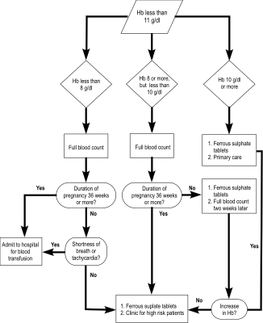
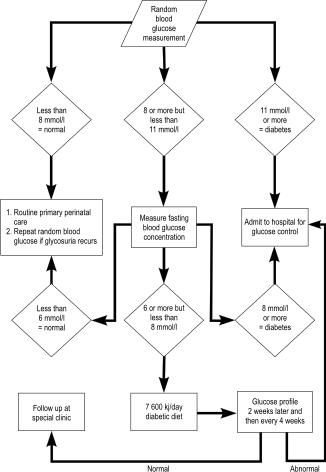

13
{:.chapter-number}

# Medical problems during pregnancy, labour and the puerperium

Take the chapter test before and after you read this chapter.



## Contents
{:.non-printing}

*   [Objectives](#objectives)
*   [Urinary tract infection during pregnancy](#urinary-tract-infection-during-pregnancy)
*   [Anaemia in pregnancy](#anaemia-in-pregnancy)
*   [Heart valve disease in pregnancy and the puerperium](#heart-valve-disease-in-pregnancy-and-the-puerperium)
*   [Diabetes mellitus in pregnancy](#diabetes-mellitus-in-pregnancy)
*   [Case studies](#case-study-1)
{:.chapter-toc}

## Objectives

When you have completed this unit you should be able to:

*	Diagnose and manage cystitis.
*	Reduce the incidence of acute pyelonephritis in pregnancy.
*	Diagnose and manage acute pyelonephritis in pregnancy.
*	Diagnose and manage anaemia during pregnancy.
*	Identify patients who may possibly have heart valve disease.
*	Manage a patient with heart valve disease during labour and the puerperium.
*	Manage a patient with diabetes mellitus.

## Urinary tract infection during pregnancy

### 13-1 Which urinary tract infections are important during pregnancy?

1.	Cystitis.
2.	Asymptomatic bacteriuria.
3.	Acute pyelonephritis.

### 13-2 Why are urinary tract infections common during pregnancy and the puerperium?

1.	Placental hormones cause dilatation of the ureters.
2.	Pregnancy suppresses the function of the immune system.

> A urinary tract infection is the most common infection during pregnancy. 

### 13-3 How should you diagnose cystitis?

1.	These severe urinary symptoms suddenly appear:
	*	Dysuria (pain on passing urine).
	*	Frequency (having to pass urine often).
	*	Nocturia (having to get up at night to pass urine).
2.	The patient appears generally well with normal observations. The only clinical sign is tenderness over the bladder.
3.	Examination of the urine under a microscope shows many pus cells and bacteria.

A midstream urine sample for culture must be collected, if possible, to confirm the clinical diagnosis. Treatment must commence immediately without waiting for the results of the culture.

### 13-4 How should you manage a patient with cystitis?

Give 4 adult tablets of co-trimoxazole (e.g. Bactrim, Cotrim, Durobac, Mezenol or Purbac) as a single dose. This is also the drug of choice for patients who are allergic to penicillin.

Amoxycillin (Amoxil) 3 g as a single dose orally could also be used but organisms causing cystitis are often resistant to this antibiotic. The treatment will be more successful if 2 amoxycillin capsules (250 mg) are replaced with 2 Augmentin tablets that contain 125 mg clavulanic acid each.

Fosfomycin (Urozone) granules 3 g can also be used. 

A midstream sample should again be sent for microscopy, culture, and sensitivity at the next antenatal visit to determine whether the management was successful.

Co-trimoxazole can be safely used during pregnancy, including the first trimester.

### 13-5 What is asymptomatic bacteriuria?

It is significant colonisation of the urinary tract with bacteria, without any symptoms of a urinary tract infection.

### 13-6 Why is asymptomatic bacteriuria during pregnancy important?

1.	Between 6 and 10% of pregnant women have asymptomatic bacteriuria.
2.	One third of these patients with asymptomatic bacteriuria will develop acute pyelonephritis during pregnancy.
3.	If patients with asymptomatic bacteriuria are diagnosed and correctly managed, their risk of developing acute pyelonephritis will be reduced by 70%.

> The diagnosis and treatment of asymptomatic bacteriuria will greatly reduce the incidence of acute pyelonephritis during pregnancy.

### 13-7 How and when should patients be screened for asymptomatic bacteriuria?

If possible, bacterial culture of a midstream urine sample should be done at the first antenatal visit to screen patients for asymptomatic bacteriuria.

Note
:	A culture medium prepared by a laboratory, or a commercially prepared culture medium, is inoculated with urine and then incubated for 12 to 24 hours to determine whether bacteriuria is present or not.

> If possible, a screening test for asymptomatic bacteriuria should be done at the first antenatal visit. 

### 13-8 Can reagent strips be reliably used to diagnose asymptomatic bacteriuria?

No. Tests for nitrites (which detect the presence of bacteria) and leukocytes, separately or together, cannot be used to accurately screen for asymptomatic bacteriuria.

### 13-9 What is the management of a patient with asymptomatic bacteriuria?

The same as the management of a patient with cystitis, i.e. 4 adult tablets of co-trimoxazole (e.g. Bactrim, Cotrim, Durobac, Mezenol or Purbac) as a single dose or fosfomycin (Urozone) granules 3 g or amoxycillin (Amoxil) 3 g as a single dose. Patients who are allergic to penicillin should be given co-trimoxazole.

A midstream specimen of urine should again be sent for culture at the next antenatal visit to determine whether the management was successful.

### 13-10 What symptoms suggest acute pyelonephritis?

1.	Most patients have severe general symptoms
	*	Headache.
	*	Pyrexia and rigors (shivering).
	*	Lower backache, especially pain over the kidneys (renal angles).
2.	Only 40% of patients have urinary complaints.

### 13-11 What physical signs are usually found in a patient with acute pyelonephritis?

1.	The patient is acutely ill.
2.	The patient usually has high pyrexia and a tachycardia. However, the temperature may be normal during rigors.
3.	On abdominal examination, the patient is tender over one or both kidneys. The patient is also tender on light percussion over one or both renal angles (posteriorly over the kidneys).

### 13-12 What is the management of a patient with acute pyelonephritis?

1.	The patient must be admitted to hospital.
2.	A midstream urine sample for microscopy, culture and sensitivity must be collected, if possible, to confirm the clinical diagnosis, identify the bacteria and determine the antibiotic of choice.
3.	An intravenous infusion of Balsol or Ringer’s lactate should be started and 1 litre given rapidly over 2 hours. Thereafter, 1 litre of Maintelyte should be given every 8 hours.
4.	Broad-spectrum antibiotics must be given, i.e. cefuroxime (Zinacef) 750 mg 8-hourly. All antibiotics must be given intravenously until the patient’s temperature has been normal for 24 hours. Oral cefuroxime (Zinnat) can then be given until a course of 10 days of antibiotics has been completed.
5.	Pethidine 100 mg is given intramuscularly for severe pain while paracetamol (Panado) two adult tablets can be used for moderate pain.
6.	Paracetamol (Panado) two adult tablets, together with tepid sponges, are used to bring down a high temperature.

Note
:	If the bacterial culture from the urine is positive, the antibiotic may need to be changed, depending on the sensitivity of the bacteria.

> Patients with acute pyelonephritis during pregnancy must be admitted to hospital for treatment with a broad-spectrum antibiotic. 

### 13-13 Why is acute pyelonephritis a serious infection in pregnancy?

Because serious complications can result:

1.	Preterm labour.
2.	Septic shock.
3.	Perinephric abscess (an abscess around the kidney).
4.	Anaemia.

Septic shock usually presents with continuing hypotension in spite of adequate intravenous fluids. There is also failure of the clinical signs of acute pyelonephritis to improve rapidly within the first 72 hours of treatment. If septic shock is diagnosed, intravenous gentamicin 80 mg must be given immediately, followed by a further 80 mg every 8 hours. Gentamicin (Garamycin) must be added to any other antibiotic already given. The patient must also be transferred to a level 3 hospital.

### 13-14 What should be done at the first antenatal visit after the patient has been treated for acute pyelonephritis?

1.	A midstream urine sample for culture and sensitivity must be collected to determine whether the treatment has been successful.
2.	The haemoglobin concentration must be measured as there is a risk of anaemia developing.

## Anaemia in pregnancy

### 13-15 What is the definition of anaemia in pregnancy?

A haemoglobin concentration of less than 11 g/dl.

### 13-16 What are the dangers of anaemia?

1.	Heart failure, which can result from severe anaemia.
2.	Shock, which may be caused by a relatively small vaginal blood loss (antepartum haemorrhage, delivery or postpartum haemorrhage) in an anaemic patient.

### 13-17 What are the common causes of anaemia in pregnancy?

1.	Iron deficiency as the result of a diet poor in iron.
2.	Blood loss during pregnancy (also during labour or the puerperium).
3.	Acute infections (e.g. pyelonephritis), chronic infections (e.g. tuberculosis and HIV), and infestations (e.g. malaria, bilharzia or hook worm) in regions where these occur.
4.	Folic-acid deficiency is less common.

> The commonest cause of anaemia in pregnancy is iron deficiency. 

A full blood count, which is sent to the laboratory, will usually identify the probable cause of the anaemia.

The size and colour of the red cells indicate the probable cause of the anaemia:

1.	Microcytic, hypochromic cells suggest iron deficiency.
2.	Normocytic, normochromic cells suggest bleeding or infection.
3.	Macrocytic, normochromic cells suggest folate deficiency.

### 13-18 What is the management of patients with iron deficiency in pregnancy or the puerperium?

1.	The management of iron-deficiency anaemia in pregnancy will depend on the haemoglobin concentration and the duration of pregnancy.
	*	If the haemoglobin concentration is less than 8 g/dl, the gestational age is less than 36 weeks, and the patient is asymptomatic, she can be treated with 2 tablets of ferrous sulphate 3 times a day and be followed at the antenatal clinic.
	*	If the haemoglobin concentration is less than 8 g/dl and the gestational age is 36 weeks or more, the patient must be admitted to hospital for a blood transfusion.
	*	All patients with a haemoglobin concentration of less than 8 g/dl who are short of breath or have a tachycardia of more than 100 beats per minute (signs of heart failure) must be admitted to hospital for a blood transfusion.
	*	If the haemoglobin concentration is between 8 g/dl and 10 g/dl, the patient can be treated with 2 tablets of ferrous sulphate 3 times a day. If the haemoglobin concentration does not increase after 2 weeks or the patient is 36 weeks pregnant or more, and a full blood count has not yet been done, then a full blood count must be done to decide whether the cause of the anaemia is iron deficiency.
	*	If the haemoglobin concentration is 10 g/dl or more, but less than 11 g/dl, the patient can be treated with *1* tablet of ferrous sulphate 3 times a day.

	In the case of the first three points above, a full blood count must be done. The size and colour of the red blood cells will help in determining the cause of the anaemia.

2.	The management of a patient with iron-deficiency anaemia during the puerperium will depend on whether the patient is bleeding or not.
	*	If the patient is not bleeding, if she has no signs of heart failure, and her haemoglobin concentration is 6 g/dl or more, she can be treated with oral iron tablets. *1* tablet of ferrous sulphate 3 times daily for a month is sufficient.
	*	If the patient is not bleeding and she has signs of heart failure, or if her haemoglobin concentration is less than 6 g/dl, she must be admitted to hospital and given a blood transfusion to be followed by oral iron for a month.
	*	If the patient is bleeding, she should be managed for a postpartum haemorrhage.

The management of a patient with iron-deficiency anaemia during the puerperium is summarised in Figure 13-1.

> 
> 
> Figure 13-1: The management of a patient with iron-deficiency anaemia in pregnancy
{:.figure .large}

### 13-19 Should all patients receive iron supplements in pregnancy?

1.	Well-nourished patients who have a healthy diet and a haemoglobin concentration of 11 g/dl or more, must take *1* tablet daily.
2.	Patients who are poorly nourished, have a poor diet or have a haemoglobin concentration of less than 11 g/dl need iron supplements.
3.	Patients from communities where iron deficiency is common, or where socio-economic circumstances are poor, should receive iron supplements.

Iron tablets are dangerous to small children as even 1 tablet can cause serious iron poisoning. Therefore, patients must always keep their iron tablets in a safe place where children cannot reach them.

### 13-20 How are iron supplements given in pregnancy?

As 200 mg ferrous sulphate tablets.

1.	Patients with a haemoglobin concentration of 11 g/dl or higher must take *1* tablet daily.
2.	Patients who are anaemic must increase iron supplementation as explained in this unit.

### 13-21 What side effects can be caused by ferrous sulphate tablets?

Nausea and even vomiting due to irritation of the lining of the stomach.

### 13-22 How should you manage a patient who complains of side effects due to ferrous sulphate tablets?

1.	The tablets should be taken with meals. Although less iron will be absorbed, the side effects will be less.
2.	If the patient continues to complain of side effects, she should be given 300 mg ferrous gluconate tablets instead. They cause fewer side effects than ferrous sulphate tablets.

## Heart valve disease in pregnancy and the puerperium

Heart valve disease consists of damage to, or abnormality of, one or more of the valves of the heart. Usually the mitral valve is damaged. The cause of heart valve disease in a developing country is almost always rheumatic fever during childhood.

### 13-23 Why is it important during pregnancy to identify patients with heart valve disease in pregnancy?

1.	A correct diagnosis of the type of heart valve disease and good management of the problem reduces the risk to the patient during her pregnancy.
2.	Undiagnosed heart valve disease and inadequate treatment may result in serious complications (e.g. heart failure causing pulmonary oedema) which may threaten the patient’s life.
3.	A clear family-planning plan must be made during the pregnancy. The patient may have a reduced lifespan and cannot risk having a large family.

> Correct diagnosis and good management reduce the risk to the patient of heart valve disease in pregnancy.

### 13-24 Which symptoms in a patient’s history suggest that she may have heart valve disease?

1.	Shortness of breath on exercise or even with limited effort.
2.	Coughing up blood (haemoptysis).
3.	Often the patient has previously been told by a doctor that she has a ‘leaking heart’.
4.	Some patients with heart valve disease give a history of previous rheumatic fever. However, most patients are not aware that they have suffered from previous rheumatic fever.

The cause of heart valve disease in a developing country is almost always previous rheumatic fever. However, these patients usually do not know that they have had one or more attacks of rheumatic fever during childhood.

During the examination of the cardiovascular system, a cardiac murmur will be heard if the patient has heart valve disease.

### 13-25 How should a patient with heart valve disease in pregnancy be managed?

1.	The patient must be referred to the high-risk antenatal clinic.
2.	At the high-risk antenatal clinic the type of lesion and correct management will be determined.
3.	The follow-up visits will also be at the high-risk antenatal clinic. However, the patient may be referred to the primary-care antenatal clinic for some ‘in between’ visits. Take care to follow the instructions from the high-risk clinic carefully.
4.	Patients who are not hospitalised should stop work earlier and rest more than usual.
5.	The patient must be told to report immediately if she experiences any symptoms of heart failure, e.g. worsening shortness of breath or tiredness.
6.	The patient must be delivered at least in a secondary level hospital where specialist care is available.

### 13-26 How should patients with heart valve disease be managed in the first stage of labour?

1.	All patients must be delivered in hospital because of the risk of pulmonary oedema.
2.	The patient should lie on her side with her upper body raised with pillows to 45 degrees.
3.	Good analgesia is important to ensure that the patient does not become exhausted.
4.	A slow intravenous infusion of 200 ml saline should be started, using a minidropper to make sure that not too much fluid is given.

Note
:	There is lack of evidence supporting the use of prophylactic antibiotics against infective endocarditis with normal deliveries and Caesarean sections. 

### 13-27 How should patients with heart valve disease be managed in the second stage of labour?

1.	The patient must be managed with her upper body raised with pillows to 45 degrees.
2.	There should be good progress with effective maternal effort to ensure a short and easy second stage. Otherwise, an assisted delivery must be done.
3.	If indicated, an episiotomy should be done to ensure a short and easy second stage.
4.	The patient’s legs must not be placed in the normal lithotomy position as this may cause pulmonary oedema. If the lithotomy position is needed, the patient should place her feet on two chairs which are at a lower level than the bed.

### 13-28 How should patients with heart valve disease be managed in the third stage of labour?

This is a very dangerous time for a patient with heart valve disease as there is an increased risk of pulmonary oedema. Therefore, careful attention must be paid to the following:

1.	Syntometrine or ergometrine must *not* be given as they increase the risk of pulmonary oedema.
2.	Oxytocin may be given. 10 units are given intramuscularly.
3.	The third stage of labour should be actively managed.

> Any drug containing ergometrine is absolutely contraindicated in the third stage of labour and the first 24 hours of the puerperium if the patient has heart valve disease.

### 13-29 What is important in the puerperium in patients with heart valve disease?

The risk of pulmonary oedema during the first 24 hours of the puerperium is great. Therefore, attention must be paid to the following:

1.	During the first 24 hours of the puerperium the patient must be carefully observed for signs of pulmonary oedema, i.e. tachypnoea (breathing fast), dyspnoea (shortness of breath) and crepitations in the lungs.
2.	The course of prophylactic antibiotics must be completed.

> There is a high risk of pulmonary oedema in the third stage of labour and for the first 24 hours of the puerperium in patients with heart valve disease.

### 13-30 What form of family planning should be offered to patients with heart valve disease?

A postpartum sterilisation should be done if patients have completed their families. Because of the risk of heart failure, the procedure must be postponed until the third day after delivery. Patients who are willing and are prepared to return for the procedure, can have a laparoscopic sterilisation done six weeks after delivery. Meanwhile, an injectable contraceptive must be given.

Patients desiring future fertility should use an intra-uterine contraceptive device or an implant.

## Diabetes mellitus in pregnancy

### 13-31 Why is it important to diagnose diabetes if it develops in pregnancy?

Diabetes mellitus is a disorder which is caused by the secretion of inadequate amounts of insulin from the pancreas to keep the blood glucose concentration normal. As a result, the blood glucose concentration becomes abnormally high. Diabetes may often present for the first time in pregnancy, and may then recover spontaneously after delivery. The early diagnosis and good management of diabetes in pregnancy will greatly reduce the incidence of complications.

> The early diagnosis and good management of diabetes in pregnancy will greatly reduce the incidence of complications.

### 13-32 What complications may be caused by diabetes in pregnancy if it is not diagnosed early and is not well managed?

1.	Throughout the pregnancy infections are common, especially:
	*	Candida vaginitis.
	*	Urinary tract infection.
2.	During the first trimester congenital abnormalities may occur in the developing fetus due to the raised blood glucose concentration.
3.	During the third trimester pre-eclampsia and polyhydramnios are common.
4.	The fetus may be large if the patient’s diabetes has been poorly controlled during the pregnancy, resulting in problems during labour and delivery, mainly:
	*	Cephalopelvic disproportion.
	*	Impacted shoulders.
5.	During the third stage of labour there is an increased risk of postpartum haemorrhage.
6.	The newborn infant is at increased risk of many complications, especially hypoglycaemia and hyaline membrane disease.

### 13-33 How can complications which commonly occur in diabetics during pregnancy and labour be avoided?

These complications can largely be avoided by:

1.	Early diagnosis.
2.	Good control of the blood glucose concentration.

> Early diagnosis and good control of the blood glucose concentration will prevent most of the pregnancy and labour complications caused by diabetes.

### 13-34 How can diabetes be diagnosed early if it should develop for the first time during pregnancy?

1.	At every antenatal visit all patients should routinely have their urine tested for glucose.
2.	A random blood glucose concentration must be measured if the patient has 1+ glycosuria or more at any antenatal visit.

> Patients with repeated or marked glycosuria during pregnancy must always be investigated further for diabetes.

### 13-35 Should additional screening for diabetes be done during pregnancy?

In addition to testing urine for glucose at each antenatal visit, patients at high risk of developing diabetes during pregnancy should have a glucose profile done at 28 weeks.

### 13-36 Which patients are at high risk of developing diabetes during pregnancy?

1.	Patients with a previous history of developing diabetes during pregnancy. 
2.	Patients with previous large babies with a birth weight of 4.5 kg or more. 
3.	Patients with a body mass index of 40 or more. 
4.	Patients with unexplained polyhydramnios. 
5.	Patients with a previous unexplained intra-uterine death. 
6.	Patients with parents or brothers and sisters with diabetes.

### 13-37 Is a reagent strip accurate enough to measure a random blood glucose concentration?

Yes, if an electronic instrument (Glucometer or Reflolux) is used to measure the blood glucose concentration. However, a reagent strip alone may not be accurate enough. Therefore, a sample of blood must be sent to the nearest laboratory for a blood glucose measurement, if an instrument is not available.

### 13-38 Is it possible that a patient with an initially normal blood glucose concentration may develop an abnormal concentration later in pregnancy?

Yes. This may be possible due to an increase in the amount of placental hormones as pregnancy progresses. Placental hormones tend to increase the blood glucose concentration, explaining why some patients only become diabetic during their pregnancies.

### 13-39 How should random blood glucose measurements be interpreted and how do the results determine further management?

A random blood glucose measurement is done on a blood sample taken from the patient at the clinic without any previous preparation, i.e. the patient does not have to fast. However, patients who have had nothing to eat during the previous four hours should be encouraged to eat something before the test.

1.	A random blood glucose concentration of less than 8 mmol/l is normal. These patients can receive routine primary care. However, if glycosuria is again present, a random blood glucose measurement must be repeated.
2.	A random blood glucose concentration of 8 mmol/l or more, but less than 11 mmol/l, may be abnormal and is an indication to measure the fasting blood glucose concentration. The further management of the patient will depend on the result of the fasting blood glucose concentration.
3.	A random blood glucose concentration of 11 mmol/l or more is abnormal and indicates that the patient has diabetes. These patients must be admitted to hospital to have their blood glucose controlled. Thereafter, they must remain on treatment and be followed as high-risk patients.

### 13-40 How should fasting blood glucose measurements be interpreted and how do the results determine further management?

The patient must have nothing to eat or drink (except water) from midnight. At 08:00 the next day a sample of blood is taken and the fasting blood glucose concentration is measured:

1.	A fasting blood glucose concentration of less than 6 mmol/l is normal. These patients can receive routine primary care. If their random blood glucose concentration is again abnormal, the fasting blood glucose concentration should be measured again.
2.	Patients with fasting blood glucose concentrations of 6 mmol/l or more but less than 8 mmol/l should be placed on a 7 600 kilojoule (1 800 kilocalorie) diabetic diet. A glucose profile should be determined after 2 weeks and be repeated every 4 weeks until delivery. Usually the glucose profile becomes normal on this low kilojoule diet.
3.	Patients with a fasting blood glucose concentration of 8 mmol/l or more have diabetes. They must be admitted to hospital so that their blood glucose concentration can be controlled.

A 7600 kJ diabetic diet consists of a normal diet with reduced refined carbohydrates (e.g. sugar, cool drinks, fruit juices) and added high fibre foods (e.g. beans and wholewheat bread).

> A patient with a normal blood glucose concentration early in pregnancy may develop diabetes later during that pregnancy.

### 13-41 How is a glucose profile obtained?

The patient must have nothing to eat or drink (except water) from midnight. At 08:00 the next day a sample of blood is taken and the fasting blood glucose concentration is measured. Immediately afterwards she has breakfast (which she can bring with her to the clinic). After 2 hours the blood glucose concentration is measured again.

### 13-42 How should the glucose profile be interpreted and how do the results determine further management?

1.	A fasting blood glucose result of less than 6 mmol/l and a 2-hour result of less than 8 mmol/l are normal. These patients can be followed up as intermediate-risk patients.
2.	A fasting blood glucose result of 6 mmol/l or more and/or a 2-hour result of 8 mmol/l or more are abnormal. These patients must be admitted to hospital so that they can have their blood glucose concentration controlled.

The management of patients with an abnormal random blood glucose concentration is summarised in flow diagram 13-2.

> 
> 
> Figure 13-2: The management of a patient with glycosuria who has a random blood glucose concentration measured in pregnancy
{:.figure .large}

## Case study 1

A patient presents at 30 weeks gestation and complains of backache, feeling feverish, dysuria and frequency. On examination she has a tachycardia and a temperature of 38.5 °C. A diagnosis of cystitis is made and the patient is given oral amoxicillin to take at home.

### 1. Do you agree with the diagnosis?

No. The symptoms and signs suggest that the patient has acute pyelonephritis.

### 2. Is the management of this patient adequate to treat acute pyelonephritis?

No. The patient should be admitted to hospital and be given a broad-spectrum antibiotic intravenously.

### 3. Why is it necessary to treat acute pyelonephritis in pregnancy so aggressively?

Because severe complications may occur which can be dangerous both to the patient and her fetus.

### 4. What two complications should you watch for after admitting this patient to hospital?

1.	Preterm labour.
2.	Septic shock.

### 5. How will you recognise that the patient has developed septic shock?

The patient will become hypotensive in spite of receiving adequate intravenous fluid.

### 6. What should be done at the first antenatal visit after the patient is discharged from hospital?

A midstream urine sample should be collected for culture to make sure that the infection has been adequately treated. Her haemoglobin concentration must also be measured as patients often become anaemic after acute pyelonephritis.

## Case study 2

A patient is seen at her first antenatal visit. She is already 36 weeks pregnant and has a haemoglobin concentration of 7.5 g/dl. As she is not short of breath and has no history of antepartum bleeding, she is treated with 2 tablets of ferrous sulphate to be taken 3 times a day. She is asked to return to the clinic in 1 week.

### 1. Do you agree with the management?

No. The patient is already 36 weeks pregnant and, therefore, is at great risk of going into labour before her haemoglobin concentration has had time to respond to the oral iron treatment. Therefore, the patient must be admitted to hospital and be given a blood transfusion.

### 2. Are any further investigations needed?

Yes. The cause of the anaemia must always be looked for. Blood for a full blood count must be taken before she is given a blood transfusion.

### 3. Is a full blood count adequate to diagnose the cause of the anaemia, or should other investigations be done?

In most cases a full blood count is adequate. The majority of patients who have anaemia without a history of bleeding are iron deficient. A full blood count will confirm the diagnosis of iron deficiency.

### 4. What should be done if a patient presents before 36 weeks gestation with a haemoglobin concentration below 8 g/dl?

If the patient is not short of breath and does not have a tachycardia above 100 beats per minute, she may be managed at a high-risk clinic. After blood has been sampled for a full blood count, she should be prescribed 2 ferrous sulphate tablets 3 times a day. With this treatment the patient should have corrected her haemoglobin concentration before she goes into labour.

### 5. What should be done if a patient presents before 36 weeks gestation with shortness of breath, tachycardia and a low haemoglobin concentration?

The patient must be admitted to hospital for a blood transfusion. This is necessary because the patient has shortness of breath and tachycardia, which suggest heart failure. Again, a full blood count must be done before the transfusion is started.

## Case study 3

A patient presents for her first antenatal visit and gives a history that she has a ‘leaking heart’ due to rheumatic fever as a child. As she has no symptoms and does not get short of breath on exercise, she is reassured and managed as a low-risk patient. As she remains well with no shortness of breath, she is told that she can be delivered by a midwife at the primary perinatal-care clinic.

### 1. Why is the management incorrect?

With her history of rheumatic fever and a ‘leaking heart’, the patient must be examined by a doctor to determine whether she has heart valve disease. Undiagnosed heart valve disease can result in serious complications such as pulmonary oedema.

### 2. What should be done if the patient has a heart murmur due to heart valve disease?

The type of heart valve disease must be diagnosed. If the patient needs medication, the correct drug must be prescribed in the correct dosage. She must be managed as a high-risk patient and should be carefully followed up for symptoms or signs of heart failure.

### 3. Will most patients with heart valve disease give a history of previous rheumatic fever?

No. Although most heart valve disease is caused by rheumatic fever during childhood, most of these patients are not aware that they have had rheumatic fever.

### 4. Is it safe to deliver a patient with heart valve disease at a primary perinatal-care clinic?

No. Special management is needed in at least a secondary hospital with specialist care available. The patient must be closely observed for signs of heart failure, good pain relief is needed during labour and prophylactic antibiotics against infective endocarditis must be given. An assisted delivery may be necessary.

### 5. Is the danger over once the infant is born?

No. The third stage of labour and the first 24 hours of the puerperium are also dangerous. Ergometrine or Syntometrine must not be given and the patient must be closely observed for signs of heart failure. Oxytocin should be given and the third stage must be actively managed.

## Case study 4

An obese 35-year-old multiparous patient presents with 1+ glycosuria at 20 weeks gestation. At the previous antenatal visit she had no glycosuria. A random blood glucose concentration is 7.5 mmol/l. She is reassured and followed up as a low-risk patient. At 28 weeks she has 3+ glycosuria. As the random blood glucose concentration at 20 weeks was normal, she is again reassured and asked to come back to the clinic in 2 weeks.

### 1. Do you agree with the management at 20 weeks gestation?

Yes, the patient was correctly managed when a random blood glucose concentration was measured after she had 2+ glycosuria. When 1+ glycosuria or more is present again, later in pregnancy, a random blood glucose concentration must be measured again.

### 2. How should the patient have been managed at 28 weeks?

She should have had another random blood glucose concentration measurement. Further management would depend on the result of this test.

### 3. Why should a patient be investigated if she has 2+ glycosuria of more for the first time?

Because the patient may already be a diabetic with a high blood glucose concentration causing the marked glycosuria.

### 4. What should the management have been if her random blood glucose was 9.0 mmol/l at 28 weeks gestation?

The patient should be seen the next morning after fasting from midnight. Her fasting blood glucose concentration should then be measured.

### 5. If the patient has a fasting blood glucose concentration of 7.0 mmol/l, what should her further management be?

The result is abnormal but is not high enough to diagnose diabetes. She should, therefore, be placed on a 7600 kJ per day diabetic diet. A glucose profile must be obtained after 2 weeks and this should be repeated every 4 weeks until delivery.