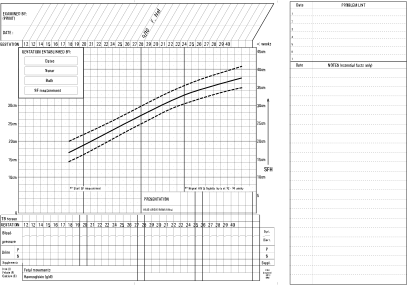
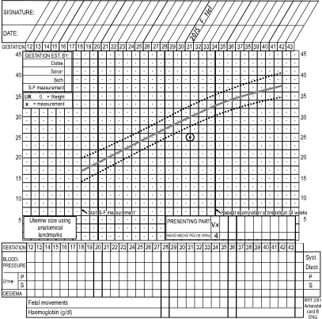
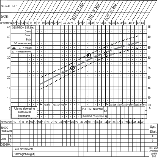

2A
{:.chapter-number}

# Skills: Routine use of the antenatal card

## Contents
{:.non-printing}

*   [Objectives](#objectives)
{:.chapter-toc}

## Objectives

When you have completed this skills chapter you should be able to:

*	Plot the symphysis-fundus height.
*	Use the symphysis-fundus height graph to assess whether the fetus is growing adequately.
*	Plot the patient’s weight and assess whether the weight gain is normal.

### A. Recording information on the antenatal card

The front of the antenatal card is used to record details of the patient’s history, examination, special investigations, duration of pregnancy, planned management, and future family planning at the first and second antenatal visits. The back of the antenatal card is used to record the observations made at each antenatal visit throughout pregnancy.

The following items should be recorded on the back of the antenatal card every time the patient attends the antenatal clinic:

1.	Date.
2.	Blood pressure.
3.	Proteinuria or glycosuria.
4.	Oedema.
5.	Fetal movements from 28 weeks onwards.
6.	Presenting part from 34 weeks onwards.
7.	Haemoglobin concentration at 28 and 34 weeks.
8.	The symphysis-fundus height from 18 weeks.
9.	Any additional notes.
10.	Signature of the responsible midwife or doctor.

The symphysis-fundus (SF) height is recorded on the antenatal graph while the other information is recorded in the spaces provided (see Figure 2A-1).

> 
> 
> Figure 2A-1: The back of the antenatal card
{:.figure}

### B. Recording the results of the rapid HIV test on the antenatal card.

1.	If the first rapid test is negative, it is accepted that the patient is HIV negative. In the space for special investigations on the front of the antenatal card, ‘Yes’ must be circled as the test was done (i.e. accepted) and then ‘No’ must be circled as the result was negative for RVD (i.e. precautions are not needed). RVD is the abbreviation for Retro Viral Disease (see Figure 2A-2).
2.	If both the first rapid test and the confirmatory (second) test are positive, it is accepted that the patient is HIV positive. Circle ‘Yes’ for the test being done and again ‘Yes’ for the test being positive for RVD. The test was therefore accepted and precautions are needed (see Figure 2A-3). The patient must receive appropriate antiretrovirals to prevent mother-to-child transmission of HIV.
3.	If, after counselling, the patient decides not to have an HIV test, ‘No’ must be circled as the test was not done. As the test was not done, a decision about precautions is not required (see Figure 2A-4).

> 
> 
> Figure 2A-2: Recording of a negative HIV test on the antenatal card
{:.figure}

> 
> 
> Figure 2A-3: Recording of a positive HIV test on the antenatal card
{:.figure}

> 
> 
> Figure 2A-4: Recording that the patient decided not to be tested for HIV
{:.figure}

### C. The significance of the lines on the graph

There are three oblique lines on the antenatal graph.

The three lines represent the normal increase in the symphysis-fundus or SF height (i.e. a centile growth chart of fundal height). The solid line in the centre is the 50th centile or average growth line. The dotted lines above and below this represent the 90th and 10th centiles respectively (i.e. the upper and lower limits of normal fundal growth).

### D. Plotting the symphysis-fundus height for the first time when the patient is sure of the date of her last menstrual period

1.	Calculate the period of gestation in weeks. The gestational age is given along the top and bottom of the graph (the horizontal axis). The patient’s gestational age is 24 weeks.
2.	Measure the SF height. The SF height in centimetres is given on both sides of the graph (the vertical axis). The patient’s SF height measures 21 cm.
3.	Knowing the gestational age and the SF height, the SF height for the gestational age can be plotted on the graph and should be recorded by making a dot. A small circle is drawn around the dot to make sure that it is clearly seen (Figure 2A-5).
4.	The date of the antenatal visit should be written at the top of the card in the square opposite the gestational age of the patient. The person recording the observations on the antenatal card must also write her or his name next to the date.
5.	The method whereby the gestational age was determined must now be ticked in the appropriate block at the top left-hand corner of the chart. In this case ‘Dates’ should be ticked.
6.	Between 18 and 36 weeks the SF height in centimetres should be plotted on the SF curve to determine the gestational age in weeks. If the fundal height is at the level of the umbilicus or higher, and the SF height differs from the gestational age by 4 weeks or more, the SF height should be plotted.

> 
> 
> Figure 2A-5: An s-f height measurement of 21 cm at a gestational age of 24 weeks is plotted on July 27th
{:.figure}

### E. Plotting the SF height for the first time when the patient does not know the date of her last menstrual period

1.	The patient’s SF height measures 27 cm. Plot the measurement on the 50th centile opposite the 27 cm on the vertical axis (figure 2A-6).
2.	By plotting the SF height measurement on the 50th centile you are *assuming* that the fetus is growing normally and that the measurement on the horizontal axis represents the approximate gestational age. In this case the approximate gestational age is 28 weeks.
3.	The method whereby the gestational age was determined must now be ticked in the appropriate block at the top left-hand corner of the chart. In this case ‘SF-measurement’ should be ticked.
4.	The fundal growth must be carefully recorded at the following visits. If little or no growth occurs in the next 4 weeks, the diagnosis of intra-uterine growth restriction must be made. If excessive growth occurs, multiple pregnancy must be excluded. Normal growth with the SF height between the 90th and 10th centiles confirms a normal growing singleton pregnancy.

> 
> 
> Figure 2A-6: Recording the s-f height of 27 cm on the 50th centile when a patient could not remember the date of her last menstrual period. The patient attended the antenatal clinic on 4 October.
{:.figure}

### F. The first recording of the SF height when the duration of pregnancy, as determined by her last normal menstrual period, differs from that determined by the SF height by four or more weeks.

1.	According to the patient’s last menstrual period, she is 31 weeks pregnant. The SF height measurement is 25 cm which indicates a gestational age of 26 weeks if plotted on the 50th centile of the SF curve (Figure 2A-7).
2.	In this case the fundal height is above the umbilicus, and the gestational age estimated from the mother’s last menstrual period and the SF height differ by 5 weeks. The SF height probably indicates the true gestational age. Make a mark on the 50th centile opposite 25 cm. This indicates an estimated gestational age of 26 weeks.
3.	The method by which the gestational age is estimated must be recorded in the box at the top left-hand corner of the growth chart. In this case a tick should be made opposite ‘SF measurement’.
4.	The fundal growth must be carefully recorded at the following visits. If little or no growth occurs in the next 4 weeks, a diagnosis of intra-uterine growth restriction must be made. If excessive growth occurs, multiple pregnancy must be excluded. Normal growth with the SF height between the 90th and 10th centiles confirms a normal growing singleton pregnancy. This information also confirms that using the SF height to determine gestational age was correct.

> 
> 
> Figure 2A-7: A patient’s gestational age, according to her last menstrual period, is 31 weeks and the s-f height measurement is 25 cm.
{:.figure}

### G. Plotting the symphysis-fundus height at subsequent antenatal visits

The symphysis-fundus height must be plotted on the graph at every subsequent antenatal clinic visit. As before, the symphysis-fundus height measurement and the gestational age are used to determine where the dot should be made on the graph. For example, if the patient’s present visit is 4 weeks after she last attended the antenatal clinic, the SF height measurement must be plotted 4 weeks later on the graph (Figure 2A-8).

> 
> 
> Figure 2A-8: A patient’s SF height measurement is 25 cm at 26 weeks and then 31 cm at 30 weeks. Four weeks after her last visit the SF height is 32 cm.
{:.figure}

### H. Recording the presenting part and the amount of fetal head palpable above the brim of the pelvis

From 34 weeks gestation onwards the lie and the presenting part must be determined at every visit. The presenting part may be a vertex or breech. If the presenting part is a fetal head, then the amount of head above the pelvic brim must be determined.

### I. Writing notes on the antenatal record card

A space for brief notes is provided on the antenatal card. A block is also provided for a problem list. Few notes are needed and usually there are no notes for patients that are assessed as being low risk with normal pregnancies (Figure 2A-9).

> 
> 
> Figure 2A-9: A problem list with short notes
{:.figure}
