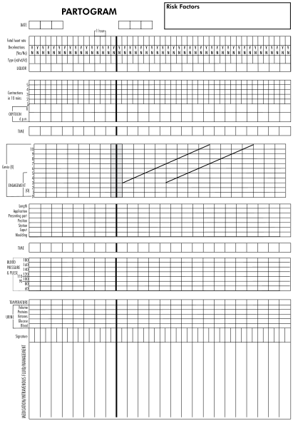

8
{:.chapter-number}

# Monitoring and managing the first stage of labour

Before you begin this unit, please take the corresponding test to assess your knowledge of the subject matter. You should redo the test after you’ve worked through the unit, to evaluate what you have learned.

## Objectives

When you have completed this unit you should be able to:

*	Monitor and manage the first stage of labour.
*	Evaluate accurately the progress of labour.
*	Know the importance of the alert and action lines on the partogram.
*	Recognise poor progress during the first stage of labour.
*	Systematically evaluate a patient to determine the cause of the poor progress in labour.
*	Manage a patient with poor progress in labour.
*	Recognise patients at increased risk of prolapse of the umbilical cord.
*	Manage a patient with cord prolapse.

## The diagnosis of labour

### 8-1 When is a patient in labour?

A patient is in labour when she has *both* of the following:

1.	Regular uterine contractions with at least 1 contraction every 10 minutes.
2.	Cervical changes (i.e. cervical effacement and/or dilatation) *or* rupture of the membranes.

## The two phases of the first stage of labour

The first stage of labour can be divided into two phases:

1.	The latent phase.
2.	The active phase.

> The first stage of labour is divided into two phases: the latent phase and the active phase.

### 8-2 What do you understand by the latent phase of the first stage of labour?

1.	The latent phase starts with the onset of labour and ends when the patient’s cervix is 3 cm dilated. With primigravidas the cervix should also be fully effaced to indicate that the latent phase has ended. However, in a multigravida the cervix need not be fully effaced.
2.	During the latent phase, the cervix dilates slowly. Although no time limit need be set for cervical dilatation, this phase does not normally last longer than 8 hours. The time taken may vary widely.
3.	During the latent phase there is a progressive increase in the duration and the frequency of uterine contractions.

### 8-3 What do you understand by the active phase of the first stage of labour?

1.	This phase starts when the cervix is 3 cm dilated and ends when the cervix is fully dilated.
2.	During the active phase, more rapid dilatation of the cervix occurs.
3.	The cervix should dilate at a rate of at least 1 cm per hour.

Note
:	The average rate of dilatation of the cervix during the active phase is at least 1.5 cm per hour in multigravidas and 1.2 cm in primigravidas. Therefore, the lower limit of the normal rate of cervical dilatation is 1 cm per hour.

> The cervix should dilate at a rate of at least 1 cm per hour in the active phase of labour.

## Monitoring of the first stage of labour

### 8-4 What do you understand by a complete physical examination during labour?

1.	The routine observations (usually done hourly or half-hourly) of the condition of the mother, the condition of the fetus, and the contractions.
2.	A careful abdominal examination.
3.	A careful vaginal examination.

This examination is only complete when the findings have been charted on the partogram. If the findings are abnormal, a plan must be made regarding the further management of the patient.

### 8-5 When should you do a complete physical examination on a patient in labour?

1.	On admission.
2.	During the latent phase: Four hours after admission or when the patient starts to experience more painful, regular contractions.
3.	During the active phase: 4-hourly, provided all observations indicate that progress is normal. If there is poor progress, the next complete examination will have to be done after 2 hours in most instances.

After the complete examination has been done and an assessment made about the progress of labour, a decision is taken on when the next complete examination should be done. The time of the next examination is marked on the partogram with an arrow. The next complete examination may, if the circumstances demand it, be done sooner (but not later) than the time indicated.

### 8-6 How should progress during the first stage of labour be monitored?

A *partogram* is used to monitor and record the progress of labour.

### 8-7 What is a partogram?

A partogram is a chart on which the progress of labour over time can be presented. You will notice that provision has been made on the chart to record all the important observations regarding the condition of the mother, the condition of the fetus, and the progress of labour.

An example of a partogram is shown in figure 8-1.

### 8-8 What is the first oblique line on the partogram called?

The *alert line*. It represents a rate of cervical dilatation of 1 cm per hour.

### 8-9 What is the importance of the alert line?

The alert line represents the minimum progress in cervical dilatation which is acceptable during the active phase of the first stage of labour.

### 8-10 What is the second oblique line on the partogram called?

This line is called the *action line*.

### 8-11 What is the importance of the action line?

1.	Any patient whose graph of the cervical dilatation falls on or crosses the action line must have a complete examination by the doctor. Her further management must be under the doctor’s supervision and direction. If a patient is not already in hospital, she will need to be transferred into a hospital where there are facilities for instrumental delivery and Caesarean section.
2.	The progress of labour is very slow when the graph of cervical dilatation crosses or falls on this line. When this occurs, action must be taken in order to hasten the delivery of the infant.

> If the cervical dilatation falls on, or crosses, the action line of the partogram, a doctor must be called to assess the patient.

> 
> 
> Figure 8-1: An example of a partogram
{:.figure .large}

## Management of a patient in the latent phase of the first stage of labour

The latent phase of labour should not last longer than 8 hours.

### 8-12 What is the initial management of a patient in the latent phase of labour?

When a patient is admitted in early labour, and on examination everything is found to be normal, only routine observations are done. The next complete examination is done 4 hours later, or sooner if the patient starts to experience more regular and painful contractions. The patient should eat and drink normally, and should be encouraged to walk around. She need not be admitted to the labour ward.

### 8-13 What should you do at the second complete examination?

At this time, the following must be assessed.

1.	The contractions: If the contractions have stopped the patient is no longer in labour, and if the maternal and fetal conditions are normal, she may be discharged. However, if the contractions have remained regular, then you must assess the cervix.
2.	The cervix:
	*	If the effacement and dilatation of the cervix have remained unchanged, the patient is probably not in true labour. If she is experiencing painful contractions, she should be given an analgesic, e.g. pethidine 100 mg and promethazine (Phenegan) 25 mg or hydroxyzine (Aterax) 100 mg by intramuscular injection and, provided that all other observations are normal, the next complete physical examination is planned for 4 hours later.
	*	If there has been progress in effacement and/or dilatation of the cervix, the patient is in labour and, provided that all other observations are normal, the next complete examination is planned for 4 hours later. If the cervix is 3 cm or more dilated, the patient has now progressed to the active phase of the first stage of labour.

### 8-14 What should you do if a patient has not progressed to the active phase of labour within 8 hours after admission?

1.	The contractions may have stopped, in which case the patient is not in labour. If the membranes have not ruptured and if there is no indication to induce labour, the patient should be discharged.
2.	The patient may still be having regular contractions. In this case, further management depends upon the state of the cervix:
	*	If there has been no progress in effacement and/or dilatation of the cervix, the patient is probably not in labour. The responsible doctor should see and assess this patient, in order to decide whether labour should be induced.
	*	If there has been progressive effacement and/or dilatation of the cervix, the patient is in labour. If the progress has been slow during the latent phase, it may be necessary to rupture the membranes or commence an oxytocin infusion if she is HIV positive as described in 8-35.

## Management of a patient in the active phase of the first stage of labour

When a patient is admitted in the active phase of labour, she will probably be in normal labour. However, the possibility of cephalopelvic disproportion must be considered, especially if the patient is unbooked.

### 8-15 How do you manage a patient who is in normal labour?

When the condition of the mother and the condition of the fetus are normal, and there are no signs of cephalopelvic disproportion, the next complete examination must be done 4 hours later. The cervical dilatation, in centimetres, is recorded on the alert line of the partogram.

### 8-16 What represents normal progress during the active phase of the first stage of labour on the partogram?

1.	The recording of cervical dilatation at the various vaginal examinations lie on or to the left of the alert line. In other words cervical dilatation is at least 1 cm per hour.
2.	There is also progressive descent of the fetal head into the pelvis. This is detected by assessing the amount of the fetal head above the brim of the pelvis on abdominal examination. Descent of the head during the active phase of the first stage of labour may occur late, especially in multigravidas.

> With normal progress during the active phase of the first stage of labour, the recording of the dilatation of the cervix will lie on or to the left of the alert line on the partogram. In addition, there will be progressively less of the fetal head palpable above the pelvic brim.

### 8-17 Why is it necessary to evaluate both cervical dilatation and the descent of the head in order to determine whether there has been progress in the active phase of the first stage of labour?

1.	Cervical dilatation without associated descent of the head does not necessarily indicate progress in labour.
2.	Cervical dilatation may occur when there are good contractions, in association with increasing caput succedaneum formation and moulding of the fetal skull, while the amount of fetal head palpable above the brim of the pelvis remains the same. In these circumstances no real progress has occurred, because the head is not descending into the pelvis.
3.	The station of the presenting part of the head in relation to the spine, as felt on vaginal examination, can also improve *without further descent of the head and without real progress* having occurred. This is because of increasing caput succedaneum and moulding.

> Descent of the head is assessed on abdominal and not on vaginal examination.

### 8-18 What circumstances will make it necessary to do vaginal examinations more frequently than 4-hourly in the active phase of the first stage of labour?

1.	If cephalopelvic disproportion is suspected, the next vaginal examination must be done 2 hours later.
2.	If a complete examination has revealed poor progress of labour, without the presence of cephalopelvic disproportion, the next complete examination should also be done 2 hours later, to assess the effectiveness of the measures taken to correct the poor progress.
3.	If a patient’s cervix is more than 6 cm dilated, the next complete examination would normally be done when the cervix is expected to be fully dilated. However, the examination may need to be done earlier if there are signs that the cervix is already fully dilated.

### 8-19 When should you rupture the patient’s membranes?

1.	It is possible to reduce the risk of transferring HIV from a mother to her infant by keeping the duration of ruptured membranes as short as possible. Do not rupture the membranes of patients whose HIV status is positive or unknown if they are still intact at the start of the active phase of labour. The following vaginal examination will not increase the risk of infection if the membranes are intact. The next complete examination should be done after 2 hours when the management should be as follows:
	*	With normal progress do not rupture the membranes.
	*	With poor progress the membranes should be ruptured and the next examination performed 4 hours later.
2.	A patient who is HIV negative and in labour with a vertex presentation may have her membranes ruptured with safety if:
	*	She is in the active phase of labour.
	*	The fetal head is 3/5 or less palpable above the brim of the pelvis.
3.	After rupturing the membranes, carefully feel around the fetal head to rule out the possibility of a cord prolapse.

If the fetal head is 4/5 or more above the pelvic brim, and the cervix is 6 cm or more dilated, it is safer to carefully rupture the membranes than to allow them to rupture spontaneously. This will reduce the risk of cord prolapse.

### 8-20 What should you do if a patient ruptures her membranes spontaneously during labour?

1.	If the fetal head is 4/5 or more palpable above the pelvic inlet, or if there is a breech presentation, the patient is at high risk for a cord prolapse. A sterile vaginal examination must, therefore, be done to rule out this possibility.
2.	If the fetal head is 3/5 or less palpable above the pelvic inlet, it is highly unlikely that a cord prolapse might happen. However, the fetal heart must be monitored to rule out the possibility of fetal distress due to cord compression.

### 8-21 What are the advantages of rupturing a patient’s membranes?

1.	Rupture of the membranes acts as a stimulus to labour, so that there is often better progress.
2.	Meconium staining of the liquor will be detected.
3.	If the cord prolapses when the membranes are ruptured, this can be detected immediately, and the appropriate management can therefore be started without delay.

It is important to make sure that the patient is in the active phase of the first stage of labour before rupturing the membranes.

## Poor progress in the active phase of the first stage of labour

### 8-22 How would you recognise poor progress in the active phase of labour?

Poor progress is present when the graph showing cervical dilatation crosses the alert line. In other words, cervical dilatation in the active phase of the first stage of labour is less than 1 cm per hour.

### 8-23 What should you do if the graph showing cervical dilatation crosses the alert line?

A systematic assessment of the patient must be made in order to determine the cause of the poor progress in labour.

### 8-24 How should you systematically examine a patient with poor progress in the active phase of the first stage of labour?

*Step 1*: Two questions must be asked:

1.	Is the patient in the active phase of the first stage of labour?
2.	Are the membranes ruptured?

If the answer to both questions is ‘yes’, proceed to step 2.

*Step 2*: The cause of the poor progress of labour must be determined by examining the patient using the ‘Rule of the 4 Ps’. The 4 Ps are:

1.	The patient.
2.	The powers.
3.	The passenger.
4.	The passage.

> The cause of poor progress of the active phase of the first stage of labour is determined by assessing the 4 Ps.

### 8-25 How may problems with the patient cause poor progress of labour and how should these problems be managed?

Any of the following factors may interfere with the normal progress of labour.

1.	*The patient needs pain relief*. Patients who experience very painful contractions, especially if associated with excessive anxiety, may have poor progress of labour as a result. Pain relief, emotional support and reassurance can be of great value in speeding up the progress of labour.
2.	*The patient has a full bladder*. A full bladder not only causes mechanical obstruction, but also depresses uterine muscle activity. A patient must be encouraged to pass urine frequently but may need catheterisation, and sometimes an indwelling catheter, until after delivery.
3.	*The patient is dehydrated*. Dehydration is recognised by the fact that the patient is thirsty, has a dry mouth, passes small amounts of concentrated urine and may have ketonuria. Dehydration must be corrected as it may be the cause of the poor progress. With good care during labour the patient will not become dehydrated, because she can eat and drink during the latent phase of labour and take oral fluids during the active phase of labour. If there is poor progress during the active phase of labour, an intravenous infusion must be started.

### 8-26 How may problems with the powers cause poor progress of labour?

The powers (i.e. the uterine contractions) may either be inadequate or ineffective. Any patient in whom labour progresses normally has both adequate and effective contractions, irrespective of the duration and frequency of contractions.

1.	*Inadequate uterine contractions*. Inadequate uterine contractions can be the cause of poor progress of labour. Such contractions:
	*	Last less than 40 seconds, and/or
	*	There are fewer than 2 contractions per 10 minutes.
2.	*Ineffective uterine contractions*. The uterine contractions may be adequate but not effective, as poor progress can occur even in the presence of apparently good, painful contractions (i.e. 2 or more in 10 minutes with each contraction lasting 40 seconds or longer), without disproportion being present (i.e. no moulding of the fetal skull). The problem of ineffective contractions occurs only in primigravidas. Any patient whose labour progresses normally must have effective uterine contractions.

Note
:	Dysfunctional uterine contractions are diagnosed when the uterine contractions appear to be ineffective.

### 8-27 How may problems with the passenger cause poor progress of labour and how should these problems be managed?

The cause of poor progress of labour may be due to a problem with the passenger (i.e. the fetus). These problems can be identified by performing an abdominal examination followed by a vaginal examination.

On abdominal examination the following problems causing poor progress may be identified.

1.	*The lie of the fetus is abnormal*. If the lie of the fetus is transverse the patient will need a Caesarean section.
2.	*The presenting part of the fetus is abnormal*. With a breech presentation, the patient must be assessed by a doctor to decide whether a vaginal delivery will be possible or whether a Caesarean section is required. If the presentation is cephalic, the part of the head which is presenting must be determined on vaginal examination.

	Note
	:	Fetuses who present by the breech and who comply with the criteria for vaginal delivery, are only delivered vaginally if there is normal progress during the first stage of labour.

3.	*The fetus is large*. A large fetus (i.e. estimated as 4 kg or more), with signs of cephalopelvic disproportion (i.e. 2+ or 3+ moulding) must be delivered by Caesarean section.
4.	*There are 2 or more fetuses*. Poor progress may also occur in a patient with a multiple pregnancy, usually due to inadequate uterine contractions.
5.	*The fetal head has not engaged*. The number of fifths of the head palpable above the pelvis must always be assessed:
	*	Engagement has occurred only when 2/5 or less of the head is palpable above the brim of the pelvis. In this case the problem of cephalopelvic disproportion at the pelvic inlet is excluded.
	*	With 3/5 or more of the head above the pelvic brim, plus 2+ or 3+ moulding, a Caesarean section is indicated for cephalopelvic disproportion at the pelvic inlet.

> An abdominal examination, to assess the lie and the presenting part of the fetus, as well as the amount of fetal head palpable above the pelvic brim, must always be done before performing a vaginal examination.

On vaginal examination the following problems causing poor progress may be identified.

1.	*The presenting part is abnormal*. Vertex (i.e. occipital) presentation of the fetal head is the most favourable presentation for the normal progress of labour. With any other presentation of the fetal head in early labour (e.g. brow), there is no urgency to interfere, as the presentation may become more favourable when the patient is in established labour. However, in established labour, if moulding is present in any presentation other than a vertex, a Caesarean section will have to be done.
2.	*The position of the fetal head in relation to the pelvis is abnormal*. An occipito-anterior (right or left) is the most favourable position for normal progress of labour. Positions other than this (i.e. left or right occipito-posterior) will progress more slowly. Labour can be allowed to continue provided there is progress, and no progressive evidence of disproportion. The patient will also need adequate pain relief and an intravenous infusion to prevent dehydration.
3.	*Cephalopelvic disproportion is present*.
	*	The head is examined for the amount of caput succedaneum present. Caput is not an accurate indicator of disproportion as it can also be present in the absence of disproportion, for example, in a patient who bears down before the cervix is fully dilated.
	*	The sutures are examined for moulding, which is the best indication of the presence of disproportion. 3+ of moulding is a definite sign of disproportion. In a vertex presentation, the sagittal and lambdoid (occipito-parietal) sutures are examined. The worst degree of moulding noted in any of the sutures is that which is recorded on the partogram as the amount of moulding present.
	*	Improvement in the station of the presenting part (i.e. the level of the presenting part relative to the ischial spines) is not a reliable method of assessing progress in labour, compared to descent and engagement of the fetal head as determined on abdominal examination.

> Improvement in the station of the presenting part of the fetal head, in relation to the ischial spines, is not a reliable method of assessing progress in the first stage of labour.

### 8-28 How may problems with the passage cause poor progress in labour and how should these problems be managed?

The following problems with the passage may cause poor progress in labour:

1.	*The membranes are still intact*. Should the membranes still be intact, they must be ruptured and the patient reassessed after 4 hours before poor progress can be diagnosed.
2.	*The pelvis is small*. A pelvic assessment which shows a small pelvis, together with 2+ or 3+ moulding of the fetal skull means that there is cephalopelvic disproportion, and is an indication for Caesarean section.

### 8-29 What are the two important causes of poor progress of labour?

1.	*Cephalopelvic disproportion*. This is a dangerous condition if it is not recognised early and not correctly managed.
2.	*Inadequate uterine action*. This is a common cause of poor progress in primigravidas. It can be easily corrected with an oxytocin infusion.

### 8-30 What must be done after the patient has been systematically evaluated to determine the cause of the poor progress of labour?

1.	The nurse attending to the patient must inform the doctor about the clinical findings. Together they must decide on the cause of the slow progress and what action must be taken to correct this problem.
2.	A decision must also be made as to when the next complete examination of the patient will be done. Usually this will be in 2 hours, but sometimes in 4 hours. This consultation may be done by telephone and it is not necessary for the doctor to see the patient at this stage.
3.	If labour progresses satisfactorily following the action taken, labour is allowed to continue. However, if poor progress continues, or if the action line has been reached or crossed, the patient must be examined by the responsible doctor who must then decide on further management.

The following are examples of causes of poor progress in labour together with their management:

| Cause                                                       | Action                                     |
|-------------------------------------------------------------+--------------------------------------------|
| Cephalopelvic disproportion                                 | Caesarean section                          |
| An anxious patient unable to cope with painful contractions | Reassurance and analgesia                  |
| Inadequate uterine contractions                             | An oxytocin infusion                       |
| Occipito-posterior position                                 | Analgesia and an intravenous infusion      |
| Ineffective uterine contractions                            | Analgesia followed by an oxytocin infusion |

## Cephalopelvic disproportion

### 8-31 How will you know when poor progress is due to cephalopelvic disproportion?

This can be recognised by the following findings:

1.	On abdominal examination, the fetal head is not engaged in the pelvis. Remember, this is diagnosed by finding 3/5 or more of the head palpable above the brim of the pelvis.
2.	On vaginal examination, there is severe moulding (i.e. 3+) of the fetal skull. Severe moulding must always be regarded as serious, as it confirms that cephalopelvic disproportion is present.

Cephalopelvic disproportion may already be present when the patient is admitted.

> A high fetal head (3/5 or more above the brim) on abdominal examination, with 3+ moulding on vaginal examination, indicates cephalopelvic disproportion.

### 8-32 Does a patient’s cervix always dilate at a rate slower than 1 cm per hour if cephalopelvic disproportion is present?

When there is cephalopelvic disproportion, the cervix usually dilates at a rate slower than 1 cm per hour, but the cervix may dilate normally, even though the fetal head remains high due to cephalopelvic disproportion. This is a dangerous situation as it may be incorrectly concluded that labour is progressing normally.

### 8-33 What features would make you diagnose cephalopelvic disproportion when the fetal head is not descending into the pelvis?

Often, especially in multiparous patients, the head does not descend into the pelvis until late in the active phase of the first stage of labour. However, when the head does not descend into the pelvis, you should look for possible causes:

1.	A malpresentation, e.g. a face or a brow presentation.
2.	Moulding (i.e. 2+ or 3+).

If either of these are present, there is cephalopelvic disproportion, and a Caesarean section should be done.

On the other hand, labour can be allowed to continue if:

1.	There is no malpresentation.
2.	There is no more than 1+ moulding.
3.	The maternal and fetal conditions are good.

The next complete physical examination must be repeated within 2 hours.

### 8-34 What should you do if you decide that the poor progress is due to cephalopelvic disproportion?

1.	Once the diagnosis of cephalopelvic disproportion has been made, the infant must be delivered as soon as possible. This means that a Caesarean section will have to be done.
2.	While the preparations for Caesarean section are being made, it is of value to both the mother and fetus to suppress uterine contractions. This is done by giving 3 nifedipine (Adalat) 10 mg capsules by mouth (a total of 30 mg) or give 250 μg (0.5 ml) salbutamol (Ventolin) slowly intravenously, the 0.5 ml salbutamol is diluted with 9.5 ml sterile water and given slowly intravenously over 5 minutes, provided that there are no contraindications.

## Inadequate uterine action

### 8-35 What should you do if you decide that the poor progress is due to inadequate or ineffective uterine contractions?

1.	Provided there are no contraindications, the patient must be given an oxytocin infusion in order to strengthen the contractions.
2.	The patient’s progress must be reassessed after 2 hours.
3.	If cervical dilatation has proceeded at the rate of 1 cm per hour or more, progress has been satisfactory and labour is allowed to continue.
4.	If cervical dilatation has been slower than 1 cm per hour once the patient has adequate uterine contractions, the patient must be reassessed by the responsible doctor. Cephalopelvic disproportion may be present.
5.	If at this stage the patient is still in a peripheral clinic, there should be enough time to refer her to hospital before the action line is crossed.
6.	Patients who complain of painful contractions need analgesia before oxytocin is started.

### 8-36 What are the contraindications to the use of oxytocin in order to strengthen contractions in the first stage of labour?

1.	Evidence of cephalopelvic disproportion. Oxytocin must, therefore, *not* be given if there is already moulding (i.e. 2+ or 3+) present.
2.	Any patient with a scar of the uterus, e.g. from a previous Caesarean section.
3.	Any patient with a fetus in whom the presenting part is not a vertex.
4.	Multiparas with poor progress during the active phase of labour of the first stage of labour.
5.	Grande multiparity during the latent or active phase of the first stage of labour.
6.	When there is fetal distress.
7.	Patients with poor kidney function or heart valve disease.

Note
:	Oxytocin has an antidiuretic effect, so there is a danger of the patient developing pulmonary oedema. Hyperstimulation must be avoided if an oxytocin infusion is used. 5 or more contractions in 10 minutes, or contractions lasting longer than 60 seconds, indicate hyperstimulation.

### 8-37 How must oxytocin be administered when it is used during the first stage of labour?

The following is a good method:

1.	Begin with 1 unit of oxytocin in 1 litre of Plasmalyte B, Ringer’s lactate or rehydration fluid.
2.	Use a giving set which delivers 20 drops per ml.
3.	Start with 15 drops per minute and increase the rate at intervals of 30 minutes to 30 drops, and then to 60 drops per minute, until the patient gets at least 3 contractions lasting at least 40 seconds every 10 minutes.
4.	If there are still inadequate contractions with 1 unit of oxytocin per litre at 60 drops per minute, a new litre of intravenous fluid containing 8 units per litre is started at a rate of 15 drops per minute. The rate is increased in the same way as above until 30 drops per minute are being given. This is the maximum amount of oxytocin which should be used during the first stage of labour.

Note
:	The starting dose of oxytocin is 1 milliunit (mUnit) per minute and the maximum dose 12 mU per minute which is line with international dose recommendations.

### 8-38 What are the effects of a long labour?

Both the mother and fetus may be affected.

1.	The mother. A patient in whom the progress of labour is slow is more likely to become anxious and to be dehydrated. If the poor progress is due to cephalopelvic disproportion (i.e. obstructed labour), and labour is allowed to continue, then there is the danger of the mother developing any or all of the following:
	*	A ruptured uterus.
	*	A vesicovaginal fistula.
	*	A rectovaginal fistula.
2.	The fetus. The stress of a long labour results in progressive fetal hypoxia, which causes fetal distress and eventually in intra-uterine death.

## The referral of patients with poor progress during the active phase of the first stage of labour

The guidelines for referral will vary from region to region, depending on the distances between clinics and hospitals, and the availability of transport. In general, arrangements must be made so that the patient will be under the care of the responsible doctor by the time the graph depicting cervical dilatation crosses the action line.

### 8-39 What arrangements should you make to ensure the patient’s safety during transfer to hospital, if there is poor progress of labour?

1.	An intravenous infusion must be started.
2.	The patient must lie on her side while being transferred to hospital.
3.	A nurse should accompany the patient, unless there is a trained ambulance crew.
4.	If cephalopelvic disproportion is the cause of the poor progress of labour, the contractions must be stopped. To stop contractions, 3 nifedipine (Adalat) 10 mg capsules (total of 30 mg) can be taken orally or 250 μg (0.5 ml) salbutamol (Ventolin) slowly intravenously, the 0.5 ml salbutamol is diluted with 9.5 ml sterile water and given slowly intravenously over 5 minutes. If indicated, the same dose of salbutamol may be repeated after 30 minutes. Both drugs should only be used if there are no contraindications.

## Prolapse of the umbilical cord

### 8-40 Why is prolapse of the umbilical cord a serious complication?

Because the flow of blood between the fetus and placenta is severely reduced and may stop completely, causing fetal distress and possibly fetal death.

### 8-41 What is the difference between a cord presentation and a cord prolapse?

1.	With a cord presentation, the umbilical cord lies in front of the presenting part with the *membranes still intact*.
2.	With a cord prolapse, the cord lies in front of the presenting part and the *membranes have ruptured*. The loose cord may lie between the presenting part of the fetus and the cervix, in the vagina or outside the vagina.

### 8-42 How should a cord presentation be managed?

If the cord is felt between the membranes and the presenting part of the fetus, if the fetus is alive and is viable and if the patient is in labour, a Caesarean section must be done. This will prevent a cord prolapse when the membranes rupture.

### 8-43 Which patients are at risk of a prolapsed cord?

1.	Patients in labour with an abnormal lie (e.g. transverse lie) or an abnormal presentation (e.g. breech presentation).
2.	Patients who rupture their membranes when the fetal head is still not engaged (i.e. 4/5 or more above the pelvic brim, e.g. in a grande multipara).
3.	Patients with polyhydramnios where the increased volume of liquor may wash the cord out of the uterus.
4.	Patients in preterm labour where the presenting part is small relative to the pelvis when the membranes rupture.
5.	Patients with a multiple pregnancy, where preterm labour, abnormal lie and polyhydramnios are common.

### 8-44 What should be done when a patient, who is at high risk of prolapse of the cord, ruptures her membranes?

A sterile vaginal examination must immediately be done to determine whether the cord has prolapsed.

### 8-45 What is the management of a prolapsed cord?

A vaginal examination must be done immediately.

1.	If the cervix is 9 cm or more dilated and the fetal head is on the perineum, the patient must bear down and the infant must be delivered as soon as possible.
2.	Otherwise the patient must be managed as follows:
	*	Replace the cord carefully into the vagina.
	*	Give the patient mask oxygen and give 250 μg (0.5 ml) salbutamol (Ventolin) slowly intravenously, the 0.5 ml salbutamol is diluted with 9.5 ml sterile water and given slowly intravenously over 5 minutes to stop labour.
	*	Put a Foley catheter into the patient’s bladder and fill the bladder with 500 ml saline.
	*	If the full bladder does not lift the presenting part off the prolapsed cord, the presenting part must be pushed up by an assistant’s hand in the vagina, and by turning the patient into the knee-chest position.

### 8-46 Why should the cord carefully be replaced in the vagina?

The cord must not be allowed to become cold or dry as this will produce vasospasm and, thereby, further reduce the blood flow through the cord.

### 8-47 Why are oxygen and salbutamol given to a patient with a prolapsed cord?

1.	Giving oxygen to the patient may improve the oxygen supply to the fetus.
2.	Stopping uterine contractions will reduce the pressure of the presenting part on the prolapsed cord.

### 8-48 Should a Caesarean section be done on all women with a prolapsed cord if the infant cannot be rapidly delivered vaginally?

No. A Caesarean section is only done if the infant is potentially viable (28 weeks or more) and the cord is still pulsating. Otherwise the infant should be delivered vaginally as the chances of survival are then extremely small.

## HIV positive women

On admission to the labour ward the HIV status of all pregnant women must be established, documented and the correct anti-retroviral (ARV) medication prescribed.

### 8-49 How should antiretroviral medication be administered to HIV positive women during labour?

Women who have been on ARV prophylaxis or treatment during pregnancy should continue taking their daily dose of FDC throughout labour. They do not need any additional ARV drugs in labour.

However HIV positive women who have not taken ARV prophylaxis or treatment during pregnancy or who only started FDC in the last weeks of pregnancy are at high risk of transmitting HIV to their infant. Therefore they should receive 300mg of AZT 3 hourly by mouth and a single dose of 200 mg nevirapine (NVP) as well as a single dose of TDF/FTC (Truvada). The Truvada is given to prevent resistance against nevirapine developing. 

## Case study 1

A primigravida patient at term, who is HIV negative, is admitted to the labour ward. She has 1 contraction, lasting 30 seconds, every 10 minutes. The cervix is 1 cm dilated and 1.5 cm long. The maternal and fetal observations are normal. After 4 hours she is having 2 contractions, each lasting 40 seconds, every 10 minutes. On vaginal examination the cervix is now 2 cm dilated and 0.5 cm long with bulging membranes. The diagnosis of poor progress of labour due to poor uterine contractions is made and an oxytocin infusion is started to improve contractions.

### 1. Do you agree with the diagnosis of poor progress of labour?

The diagnosis is incorrect as the patient is still in the latent phase of the first stage of labour. Poor progress of labour can only be diagnosed in the active phase of labour.

### 2. Why can it be said with certainty that the patient is in the latent phase of labour?

*	The cervix is still less than 3 cm dilated.
*	The cervix is dilating slowly.
*	The cervix is effacing.
*	The frequency of the uterine contractions is increasing.

### 3. What is your assessment of the patient’s management?

Apart from the wrong diagnosis, oxytocin should not be given before the membranes have been ruptured.

### 4. Should the patient’s membranes have been artificially ruptured when the second vaginal examination was done?

No. If the maternal and fetal condition are good, you should wait until the cervix is 3 cm or more dilated. The membranes may also be ruptured if the patient has been in the latent phase of labour for 8 hours without any progress.

## Case study 2

A patient at term is admitted in labour with a vertex presentation. The cervix is already 4 cm dilated. The cervical dilatation is recorded on the alert line. At the next vaginal examination the cervix has dilated to 8 cm. Caput can be palpated over the fetal skull. It is decided that the progress is favourable and that the next vaginal examination should be done after a further 4 hours.

### 1. On admission, should the woman’s cervical dilatation have been entered on the alert line?

Yes. The patient is in the active phase of the first stage of labour as her cervix is 4 cm dilated. Therefore, the cervical dilatation must be plotted on the alert line. The future observations should fall on or to the left of the alert line.

### 2. Do the findings of the second examination indicate normal progress of labour?

Not necessarily, as no information is given about the amount of fetal head palpable above the pelvic brim. Cervical dilatation without descent of the head does not always indicate normal progress of labour.

### 3. Is normal cervical dilatation with improvement in the station of the presenting part possible if cephalopelvic disproportion is present?

Yes. The uterine contractions cause an increasing amount of caput and moulding, which is incorrectly interpreted as normal progress of labour. In this case, caput was noted during the second examination. However, further information about any moulding and the amount of fetal head palpable above the pelvic brim are essential before it can be decided whether normal progress is present or not.

### 4. Was the correct decision made at the time of the second examination to repeat the vaginal examination after 4 hours?

No. If the cervix is 8 cm dilated, the next examination must be done 2 hours later, or even sooner if there are indications that the woman’s cervix is fully dilated. If it is uncertain whether the progress of labour is normal then the examination should also be repeated in 2 hours.

## Case study 3

A primigravida patient at term is admitted in labour. At the first examination the fetal head is 2/5 above the pelvic brim and the cervix is 6 cm dilated. 3 contractions in 10 minutes, each lasting 45 seconds, are palpated. At the next examination 4 hours later, the head is still 2/5 above the brim and the cervix is still 6 cm dilated. No moulding can be felt. The patient is still having 3 contractions in 10 minutes, each lasting 45 seconds and complains that the contractions are painful. Because there has been no progress in spite of painful contractions of adequate frequency and duration, it is decided that cephalopelvic disproportion is present and that, therefore, a Caesarean section must be done.

### 1. Do you agree that the poor progress of labour is due to cephalopelvic disproportion?

No. To diagnose poor progress due to cephalopelvic disproportion, severe moulding (3+) must be present.

### 2. What is most probably the reason for the poor progress of labour?

The patient is a primigravida with strong, painful contractions and no signs of cephalopelvic disproportion. A diagnosis of ineffective uterine contractions (dysfunctional uterine contractions) can, therefore, be made with confidence.

### 3. What should be the management of the patient’s poor progress of labour?

Firstly, the patient should be reassured and given analgesia with pethidine and promethazine (Phenegan) or hydroxyzine (Aterax). Then an oxytocin infusion should be started to make the contractions more effective.

### 4. Why is reassuring the patient so important?

Anxious patients often progress slowly in labour and have painful contractions. Emotional support during labour is a very important part of patient care.

### 5. When must the next vaginal examination be done?

The next vaginal examination should be done 2 hours later to determine whether the treatment has been effective. During the examination it is very important to exclude cephalopelvic disproportion.

## Case study 4

A patient who is in labour at term has progressed slowly and the alert line has been crossed. During a systematic evaluation of the patient by the midwife for poor progress of labour, a diagnosis of an occipito-posterior position is made. As the patient is making some progress, she decides to allow labour to continue. After 4 hours, the cervical dilatation falls on the action line. Although there is still slow progress, she again decides to allow labour to continue and to repeat the vaginal examination in a further 2 hours.

### 1. Was the patient managed correctly when she crossed the alert line?

Yes. She was systematically examined and a diagnosis of slow progress of labour due to an occipito-posterior position was made.

### 2. What should be done if a long first stage of labour is expected due to an occipito-posterior position?

An intravenous infusion must be started to ensure that the patient does not become dehydrated. In addition, adequate analgesia must be given.

### 3. Was the patient correctly managed when she reached the action line?

No. A doctor should have evaluated the patient. Further management should have been under his/her direction.

### 4. Under what conditions should the doctor allow labour to progress further?

If there is steady progress of labour, the maternal and fetal conditions are good, and there is less than 3+ moulding.
