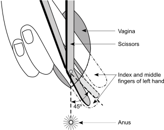
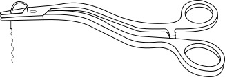
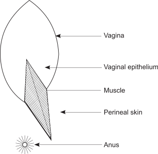
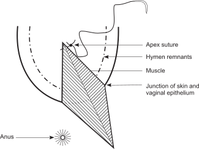
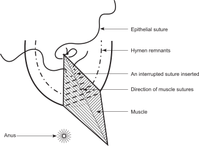
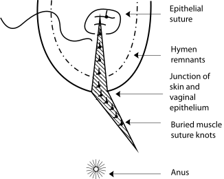

9A
{:.chapter-number}

# Skills: Performing and repairing an episiotomy

## Objectives

When you have completed this skills chapter you should be able to:

*	Perform a mediolateral episiotomy.
*	Repair an episiotomy.

## Performing an episiotomy

### A. The purpose of an episiotomy

1.	To aid the delivery of the presenting part when the perineum is tight and causing poor progress in the second stage of labour.
2.	To prevent third-degree perineal tears.
3.	To allow more space for operative or manipulative deliveries, e.g. forceps or breech deliveries.
4.	To shorten the second stage of labour, e.g. with fetal distress.

### B. Preparation for an episiotomy

If you anticipate that an episiotomy may be needed, you should inject local anaesthetic into the perineum. An episiotomy should not be done without adequate analgesia. Usually 10–15 ml 1% lignocaine (Xylotox) supplies adequate analgesia for performing an episiotomy. Be very careful that the local anaesthetic is not injected into the presenting part of the fetus.

### C. Types of episiotomy

There are two methods of performing an episiotomy:

1.	Mediolateral or oblique.
2.	Midline.

The midline episiotomy has the danger that it can extend into the rectum to become a third-degree tear while the mediolateral episiotomy often results in more bleeding. This skills chapter will only deal with the mediolateral episiotomy because it is used most frequently, is safe, and requires the least experience.

### D. Performing a mediolateral episiotomy

The incision should only be started during a contraction when the presenting part is stretching the perineum. Doing the episiotomy too early may cause severe bleeding and will not immediately assist the delivery. The incision is started in the midline with the scissors pointed 45° away from the anus. It is usually directed to the patient’s left but can also be to the right. 2 fingers of the left hand are slipped between the perineum and the presenting part when performing a mediolateral episiotomy.

> 
> 
> Figure 9A-1: The method of performing a left mediolateral episiotomy
{:.figure .medium}

### E. Problems with episiotomies

1.	The episiotomy is done *too soon*: This can result in excessive bleeding as the presenting part is not pressing on the perineum. An episiotomy will not help the descent of a high head.
2.	Extension of the episiotomy by *tearing*: This is not only a problem in a midline episiotomy. Mediolateral episiotomies may also tear through the anal sphincter into the rectum. However, extension of mediolateral episiotomies are less likely to occur than a midline episiotomy.
3.	Excessive *bleeding* may occur:
	*	When the episiotomy is done too early.
	*	From a mediolateral episiotomy.
	*	After the delivery.

Arterial bleeders may have to be temporarily clamped, while venous bleeding is easily stopped by packing a swab into the wound. Suturing the episiotomy usually stops the venous bleeding but arterial bleeders need to be tied off.

## Repairing an episiotomy

### F. Preparations for repairing an episiotomy

1.	This is an uncomfortable procedure for the patient. Therefore, it is essential to explain to her what is going to be done.
2.	The patient should be put into the lithotomy position if possible.
3.	It is essential to have a good light that must be able to shine into the vagina. A normal ceiling light usually is not adequate.
4.	Good analgesia is essential and is usually provided by local anaesthesia which is given before the episiotomy is performed. As 20 ml of 1% lignocaine may be safely infiltrated, 5–10 ml usually remains to be given in sensitive areas. An episiotomy should not be sutured until there is good analgesia of the site.
5.	In order to prevent blood which drains out of the uterus from obscuring the episiotomy site, a rolled pad or tampon should be carefully inserted into the vagina above the episiotomy wound. As this is uncomfortable for the patient, she should be reassured while this is being done.
6.	Absorbable suture material should be used for the repair. Three packets of chromic 0 are required. Two on a round (taper) needle for the vaginal epithelium and muscles, and one on a cutting needle for the skin. With smaller episiotomies one packet on a round needle and one on a cutting needle may be sufficient. Non-absorbable suture material such as nylon and dermalon are very uncomfortable and should not be used. Remember that the patient has to sit on her wound.

### G. The following important principles apply to the suturing of an episiotomy

1.	The apex (highest point) of the episiotomy must be visualised and a suture put in at the apex.
2.	Dead space must be closed.
3.	The same opposing tissue must be brought together using the skin vaginal epithelium juncture as an anatomical landmark.
4.	Tissues must be brought together but not strangulated by excessive tension on the sutures.
5.	Haemostasis must be obtained.
6.	The needles must be handled with a pair of forceps and not by hand, and should be removed from the operating field as soon as possible.

> 
> 
> Figure 9A-2: The method of safely handling a needle
{:.figure .small}

### H. The method of suturing an episiotomy

Three layers have to be repaired:

1.	The vaginal epithelium.
2.	The muscles.
3.	The perineal skin.

> 
> 
> Figure 9A-3: An episiotomy wound
{:.figure .medium}

There are four important steps in the repair of an episiotomy wound.

*Step 1*: Place a suture (stitch) at the apex of the incision in the vaginal epithelium. Then insert one or two more continuous sutures in the vaginal epithelium. Do not complete suturing the vaginal epithelium when the episiotomy is large or deeply cut but leave this suture and do not cut it. When placing the suture at the apex, be very careful not to prick your finger with the needle.

> 
> 
> Figure 9A-4: Suturing the vaginal epithelium
{:.figure .medium}

*Step 2*: Insert interrupted sutures in the muscles. Start at the apex of the wound. The aim is to bring the muscles together firmly and to eliminate any ‘dead space’, i.e. any spaces between the muscles where blood can collect. Remember that the sutures must be inserted at 90 degrees to the line of the wound.

When suturing the muscles, be careful not to put the suture through the rectum. If you make sure that the point of the needle is seen when crossing from the one side to the other of the deepest part of the wound, the stitch will not be too deep. ‘Figure 8’ stitches (double stitches) are used to suture the muscle layer. When the muscles have been correctly sutured the cut edges of the vaginal epithelium and the skin should be lying close together. The markers for correct alignment are:

1.	The remains of the hymen.
2.	The junction of the skin and the vaginal epithelium. The skin is recognised by the darker pigmentation.

> 
> 
> Figure 9A-5: Suturing the muscles
{:.figure .medium}

*Step 3*: Return to the vaginal epithelium and complete the continuous catgut suture, ending at the junction with the skin. Do not pull the sutures tight as they only need to bring the edges of the vaginal epithelium together.

> 
> 
> Figure 9A-6: The correct position of the skin and vaginal epithelium
{:.figure .medium}

*Step 4*: Use interrupted sutures with an absorbable suture material to repair the perineal skin. Mattress sutures may be used. Do not pull the sutures tight as they only need to bring the edges of the skin together. Sutures that are too tight become uncomfortable for the patient.

> 
> 
> Figure 9A-7: The repair of the skin
{:.figure .medium}

When the suturing is complete:

1.	Remove the pad from the vagina. Be gentle as this will be uncomfortable for the patient.
2.	Put a finger into the rectum and feel if a suture has been placed through the rectal wall by mistake.
3.	Make sure that the uterus is well contracted. 
4.	Get the patient out of the lithotomy position and make sure that she is comfortable.
