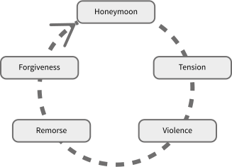

5
{:.chapter-number}

# Special issues in maternal mental health

Before you begin this unit, please take the corresponding test to assess your knowledge of the subject matter. You should redo the test after you’ve worked through the unit, to evaluate what you have learned. 

## Objectives

When you have completed this unit you should be able to:

*	Understand how poverty makes pregnant women more vulnerable to mental illness
*	Understand how emotional support can influence mental illness
*	Understand how HIV affects mental illness
*	Understand how pregnant teenagers can be affected by mental illness
*	Understand how having an unintended pregnancy can affect mental health
*	Be informed about the options of termination and adoption
*	Understand how being a refugee can influence mental health
*	Understand the relationship between substance misuse and mental illness
*	Understand the different types of abuse
*	Understand how health workers can assist abused mothers
*	Understand some of the causes of child abuse
*	Understand the risk of suicide during pregnancy
*	Practise some basic skills for dealing with suicidal mothers
*	Understand how miscarriage, stillbirth or neonatal death affect mental health
*	Practise some basic skills for assisting mothers with pregnancy loss.

## Poverty and mental illness

### 5-1 Why does poverty make women more vulnerable to mental illness?

Women living in poverty are at a greater risk of developing a mental illness, and those with mental illness are more likely to slide into poverty, or stay poor. Current studies show that as many as 1 out of any 3 women living in poverty in South Africa experience depression during or after their pregnancy. 

There are many issues associated with poverty which can negatively affect a woman’s mental health, such as:

*	Losing her job or being unemployed
*	A change in social class or status, e.g. being divorced, being foreign, losing her home
*	Housing problems, overcrowding
*	Losing access to social grants or other forms of income
*	Malnutrition
*	Domestic violence
*	Abuse
*	Past or recent trauma
*	Sick children or relatives requiring her care.

> Women living in poverty are at greater risk of developing a mental illness. 

### 5-2 How does poverty affect the way in which women access resources for mental illness?

When helping and supporting a woman to identify the resources that are available, it must be kept in mind that women living in poverty face significant challenges. There may be fewer resources available to them and their situation might make it more difficult for them to get help that is available. However, it is important to be aware that the ‘vicious cycle’ relationship between poverty and mental ill-health can be broken if the correct interventions are put into place.  

### 5-3 Why is it difficult for poor women to find emotional and practical support for their mental health?

Without support, women can feel lonely and overwhelmed, and may be less likely to get the help needed during pregnancy. This is why they are more likely to experience psychological problems. 

> Even women living in busy or overcrowded settings can feel completely alone and in despair. 

Poor women may not find emotional and practical support because:

*	The women don’t feel worthy of support
*	The women don’t feel strong enough to seek out support
*	The community disapproves of the women
*	The community is not used to being supportive of women
*	The community is trying to survive in a difficult environment.

### 5-4 What are some signs that women may be lacking in support?

Signs that a woman may not be supported are:

*	Difficult relationships with her partner, mother or mother-in-law
*	Little support from a partner or mother, such as financial, emotional or practical support
*	Difficult relationships with the wider family or community
*	Isolation, because of being rejected due to her HIV status, an unintended pregnancy, being a refugee, hostile in-laws, being a teenager or her choice of partner.

Women value the support that comes from the people close to them. Women may feel supported if practical help or financial assistance is given. Emotional support is also considered extremely important to mothers.

## HIV and mental illness

### 5-5 How does HIV affect mental health?

The frequency of mental illness is much higher among HIV-positive people. This is because HIV infection can make someone more vulnerable to mental illness. At the same time, having a mental illness can make someone much more vulnerable to getting HIV infection. So, in general, HIV-positive pregnant women have much poorer mental health than those who are HIV-negative.  

There are several HIV-related issues that a health worker should be aware of during and after the pregnancy.  

During pregnancy:

*	Some women learn of their positive HIV status for the first time. They are then faced with coming to terms with diagnosis, as well as a pregnancy that may be unwanted.
*	If they disclose that they are HIV-positive, they might be accused of being unfaithful, be isolated, beaten or thrown out of the home by their partner or family. 
*	They also face having to adjust to the Prevention of Mother to Child Transmission (PMTCT) Programme or having to take the Antiretroviral Treatment (ART).

After pregnancy:

*	HIV-positive women may face difficult decisions around the method of feeding their infant.
*	If they choose to bottle feed, they run the risk of family and friends becoming suspicious of their HIV status.
*	Women experience guilt and anxiety that their babies may also be HIV-positive.
*	She may fear for the future of her family if she becomes sick with AIDS. 

> Mental illness is much more common in HIV-positive women. 

### 5-6 How can mental health affect HIV/AIDS?

Mental illness can also have a very negative impact on the progression of HIV/AIDS. Mental illness that is not treated can lead to:

*	Poorer adherence to HIV management, e.g. PMTCT or ART 
*	Avoidance of treatment e.g. not attending clinic appointments
*	Higher risk of AIDS-related maternal death.

## Teenage pregnancy and mental illness

### 5-7 How are pregnant teenagers affected by mental illness?

Pregnant teenagers are at greater risk of developing mental illness. Also, young women who are depressed are more likely to become pregnant during their teenage years. Health workers should keep in mind that adolescence is a time when a number of physical and emotional changes take place. Adolescent girls are vulnerable and may have difficulties dealing with crises or recovering from trauma. They also may experience pressure to engage in sex or use alcohol and drugs. Pregnant adolescents need special attention that is non-judging and supportive. 

### 5-8 Can typical adolescent behaviour be confused with mental illness?

‘Typical’ adolescent behaviour, such as aggression or withdrawal, may be the natural ‘fight or flight’ responses to the terrifying situation in which the adolescent finds herself. A health worker explaining that her fear is natural and showing empathy, can make a positive difference to the outcome for the girl and the pregnancy. Kindness and acceptance from health workers may help the fear and help with the difficult behaviours that some teenagers display in health care settings.

## Unintended pregnancy and abortion

### 5-9 How can having an unintended pregnancy affect mental health?

About 60% of all pregnancies in South Africa are unintended (unplanned). Of these, one out of three is unwanted. The decision to either terminate or continue with the pregnancy is a very difficult one for most women and may cause severe distress. 

For some women, the **choice to terminate** a pregnancy may have negative mental health consequences, and for others, the **choice to continue** with an unintended pregnancy has mental health consequences, both for the mother and for the child. They may be stressed or worried that they will not be able to provide for this child. They may feel anger at a partner who has abandoned them. The timing of this pregnancy may disrupt schooling, studies or work plans – all of which may negatively affect others in the family or home. There are many reasons why an unintended pregnancy can cause mental distress.  

> Unplanned and unwanted pregnancies are common in South Africa and may result in mental illness. 

### 5-10 How can health workers help women with unintended pregnancies?

Any women experiencing distress needs non-judgemental support and kindness to help them to make the best decision for themselves. Persuasion by a health worker to make a decision either way may be damaging for the mother.

### 5-11 Is terminating the pregnancy an option?

Health workers are legally obliged to provide information on Termination of Pregnancy (TOP) services for those who seek this, whatever the personal beliefs the staff may have. A health worker who is approached by a woman for an abortion may decline if they choose to do so, but are obligated by law to inform the woman of her rights and refer her to another health worker or facility where she can get an abortion.
 
### 5-12 What is the law on terminating a pregnancy in South Africa?

The Choice on Termination of Pregnancy Act, 1996 (Act No. 92 of 1996) is the law governing abortion in South Africa. During the first twelve weeks of a pregnancy, an abortion may be performed at the request of the woman. From the thirteenth to the twentieth week, a pregnancy may be terminated if it endangers the woman's mental or physical health, if the fetus could suffer from a severe mental or physical abnormality, if the pregnancy resulted from rape or incest, or if it would significantly affect the woman's social or economic circumstances. After the twentieth week, a pregnancy may only be terminated if it could endanger the woman's life, if the fetus is severely malformed, or if there is a risk of severe illness in the fetus.

### 5-13 Are Termination Services accessible?

Certain state hospitals or clinics perform free abortions, although sometimes only if the woman is referred by a health worker. Problems with access to early and safe TOP services mean that women can face a range of physical and mental health complications. Part of the poor access to services may relate to judgemental attitudes of health workers or to a lack of information given by health workers. Stigma and fear often make women have unsafe and dangerous abortions. Backstreet abortions, often using the drug Misoprotol, can lead to septic infections, damage to internal organs or the most common effect is a continued pregnancy.

### 5-14 Is adoption an option?

Women who have booked at an antenatal clinic may have accepted that they are having the baby, but it may still be unwanted. Women may want to explore the option of having the baby adopted. 

### 5-15 What is adoption?

Adoption is the legal act of permanently placing a child with a parent or parents other than the child’s birth/biological mother or father. A legal adoption order terminates the parental rights of the birth mother and father, while ‘handing over’ the parental rights and responsibilities to the adoptive parents. The adopted child is then regarded as the child of the adoptive parents. In a disclosed adoption, the identity of the biological parents and the identity of the adoptive parents are known by both parties. This form of adoption may include a post-adoption agreement that provides for future contact or the exchange of information. In a closed adoption, no identifying details are available or exchanged between the adoptive parents and biological parents.

### 5-16 How does adoption work?

Adoption proceedings are handled by social workers at accredited and designated child protection organisations. Some organisations may charge a fee relating to adoption. 

Note
:	See further information about adoption agencies in the Resources section. 

Consenting to the adoption of a child is a difficult thing to do and child protection organisations and the Department of Social Development provide support services to assist with the process.

## Refugees and mental illness

### 5-17 How does being a refugee affect mental health?

Women who have had to leave their home countries, because of war or economic difficulties, experience high rates of emotional and physical trauma. They may have experienced violence during war or during their travels to other countries. Refugee women are also particularly vulnerable to being raped. In addition, they are often living in poverty and may find it difficult to access health care. 

Because refugees have been separated from their families and communities, they often have very few sources of support or no support at all. They may find it difficult to communicate in the local language. Some communities are violent toward refugees, so refugee women may also face social isolation, discrimination and ongoing physical danger. These experiences, on top of the previous trauma of violence, economic hardship, the death of loved ones, torture or rape, can lead to very poor mental health among refugee women. Counselling a refugee woman can be difficult, as she may: 

*	Be very scared
*	Not trust strangers or people in positions of power, such as health workers
*	Find it difficult to express herself in the local language
*	Not understand the procedures of the clinic or what is happening during her pregnancy or labour. 

Note
:	'Loneliness, loss of identity, poverty and trauma are the main stressors that we see. Many refugee women have no-one to talk to, and pregnancy makes them more vulnerable.' Charlotte Mande-Ilunga: French-speaking Perinatal Mental Health Project counsellor

> 
> 
> Figure 5-1: Loneliness, loss of identity, poverty and trauma are the main stressors refugees face.
{:.figure}

## Substance misuse

### 5-18 What is substance misuse?

Substance misuse is the harmful use of substances (like drugs and alcohol) for non-medical purposes. The term “substance misuse” often refers to illegal drugs. However, legal substances can also be misused, such as alcohol, prescription medications, caffeine, nicotine and substances like petrol, glue or paint. 

### 5-19 What is substance abuse?

Substance abuse, is a pattern of use of a substance (like drugs and alcohol) in which the user consumes the substance in amounts or with methods that are harmful to themselves or others.

### 5-20 How does substance misuse affect mental health?

Drug or alcohol misuse can lead to mental illness (substance use disorder), and in some cases, mental illness can make a person more likely to misuse drugs or alcohol as a form of ‘self-medication’. Substance misuse is a threat to the physical health of both the woman and her pregnancy.

Drug or alcohol abuse is also a mental illness, and can be treated. By being supportive, health workers can make a positive impact to a mother’s recovery.

Drug and alcohol misuse are serious health problems and may require the mother to be referred to addiction specialists. But, being aware that the mother has a substance misuse problem is important for the treatment of the mother, and for her overall antenatal care. The most commonly misused substances in South Africa are alcohol, cannabis, ‘tik’ (or methamphetamine), crack/cocaine and heroin. Alcohol misuse is the biggest substance misuse problem in South Africa.

> Substance misuse may lead to mental illness while mental illness can result in the misuse of drugs. 

### 5-21 What are the signs of substance misuse?

The signs of drug or alcohol misuse can be similar to depression or anxiety:

*	Agitation, irritability or mood swings
*	Isolation from other people or not wanting to be around people
*	Inability to keep up with responsibilities due to time spent trying to find drugs or alcohol
*	Inability to keep up with responsibilities because of regularly being high or not being sober 
*	Inability to take care of oneself or children because of being high or not being sober
*	Crime in order to obtain money for alcohol or drugs.

### 5-22 How can you find out if a mother is using drugs or alcohol?

Many women would not want to disclose that they are misusing substances because of the fear of what may happen to them or to the baby if authorities find out. If a health worker is concerned that a mother might be using alcohol or drugs, they can ask informal questions to determine if this is the case. Non-threatening questions could help start this conversation. For example:

*	Have you ever used alcohol or drugs in the past?
*	Have you ever used anything to help you relax?

Direct questions such as ‘are you drunk?’ are threatening and may sound judgemental. This may make the mother defensive and less likely to tell the truth.

If the mother is using substances, she should be referred for appropriate assessment and treatment. Brief motivational interviewing has been shown to be useful for addiction problems. 

> If your facility does not have substance misuse treatment services, try to find a suitable referral organisation in the community. 

## Maternal abuse

### 5-23 What is domestic abuse?

Domestic abuse is defined as abusive acts that threaten another person’s physical safety, freedom, health and emotional well-being. Abusive acts can be physical, sexual, emotional and financial. These are committed by someone the person lives with, or used to live with (a domestic relationship), e.g.  a partner or ex-partner, boyfriend/girlfriend, parents, children, family member or a person sharing the same home. 

> Domestic abuse often takes place in the home.

Domestic violence is abuse which often has a specific purpose in mind. It is used by someone to gain and maintain control over the person. This control is designed to make the person feel fearful of the abuser, so that control over the person’s life can be maintained.

There are very high rates of rape and violent assault in South Africa: it has the highest rate of violence against women in the world. 

### 5-24 Does domestic violence affect pregnancy and mental health?

Experiencing domestic violence is common in South Africa, and domestic violence is likely to increase during pregnancy. It is important for a health worker to pay special attention to these situations as they can affect a woman’s mental and physical health.

> Domestic violence is common in South Africa and can affect a woman’s mental health. 

### 5-25 What is intimate partner violence (IPV)?

Intimate partner violence (IPV) is defined as threatened, attempted, or completed physical or sexual violence or emotional abuse by a current or former intimate (sexual) partner. IPV can be committed by a spouse, an ex-spouse, a current or former boyfriend or girlfriend, or a dating partner.

### 5-26 What is emotional abuse? 

Emotional abuse is the repeated use of controlling and harmful emotional behaviour by a partner to control a person.

As a result of emotional abuse, a person may live in fear and have altered thoughts, feelings and behaviours, as well as deny personal needs, to avoid further abuse. Emotionally abusive behaviour by someone’s partner may include: 

*	Harsh, unreasonable and repeated criticism
*	Unreasonable or unrealistic demands or expectations
*	Unpredictable behaviour
*	Aggressive non-physical behaviour such as blaming, threatening and demanding
*	Humiliation and other verbal assaults
*	Isolation
*	Using ‘fear tactics’ or ‘guilt trips’
*	Threats of abandonment, or threats of having an affair 
*	Threats of harm to the person, or the person’s children, friends or family
*	Exploitation
*	Demanding sexual acts
*	Control of a person’s sexual and reproductive choices
*	Financial control (see financial abuse below).

The abuser uses emotional abuse to damage someone’s feelings of self-worth and independence. People who have experienced emotional abuse may feel that there is no way out of their relationship, or that ‘they are nothing’ without their abusive partner. They will often blame themselves for the abuse.

### 5-27 What is physical abuse?

Physical abuse is physical injury inflicted on a person, on purpose, with the intention of being cruel or hurtful. Physical abuse can refer to punching, beating, kicking, biting, burning, shaking, or any other way of harming someone’s body physically. Physical abuse can happen just once, or can be on-going.

### 5-28 What is sexual abuse?

Sexual abuse is any sexual contact or interaction (physical, visual, verbal or psychological) between one person (the victim) and another who is in a position of power (the abuser). The difference between rape and sexual abuse is that sexual abuse can be any act which uses someone for sexual stimulation. It can happen just once, or be on-going. When physical sexual abuse is committed by a person who is a blood or legal relative, this is incest. 

### 5-29 What is rape?

Rape is any sexual act which has been forced onto another person. It can include, but is not limited to, acts of sexual penetration into the vagina, anus or mouth of another individual without their consent. A person can be raped by their partner, a family member, a friend, someone they know, a stranger, or by several people. Rape may be committed by a person who is a blood or legal relative. Rape is a violent, traumatic and life changing experience that can happen to anyone, female or male. It can create stressful situations within a person’s relationship, family and community.

### 5-30 What is economic or financial abuse?

Financial abuse is a way of exercising control over another person. Financial abuse may include: 

*	Strict control over a person’s finances, such as restricting the person to an ‘allowance’ or ‘pocket money’
*	Withholding money
*	Withholding basic necessities, such as food, clothes, medicine or even shelter
*	Preventing a person from working or from choosing a career  
*	Sabotaging a person’s job, such as causing reasons for the person to miss work, calling or going to the person’s workplace frequently.

### 5-31 Why do women stay in abusive relationships? 

There are many reasons why women stay in abusive relationships. A woman might:

*	Feel she is dependent on the abuser to support her and her children financially
*	Think it is best that the children grow up with their parents living together 
*	Feel she has nowhere else to go
*	Have been threatened by the abuser if she were to leave 
*	Feel worthless 
*	Hope that the abuser will change and stop being abusive.

### 5-32 What is the ‘cycle of violence’?

Domestic violence often occurs in a cycle. 
{:.keep-with-next}

1.	‘Honeymoon’ phase: a violence-free period
2.	Tension: as the relationship progresses, arguments start; the abuser’s reaction seems extreme and tension builds up
3.	Violence: the abuse begins, and can be of any form (e.g. physical, emotional etc.)
4.	Remorse: the abuser shows remorse and repeatedly apologises and begs forgiveness
5.	Forgiveness: the woman starts feeling guilty, thinking perhaps she was the cause of the outburst, and accepts the abuser’s apology
6.	‘Honeymoon’ phase: the quiet, violence-free period starts again and the cycle continues
{:.keep-with-next}

> 
> 
> Figure 5-2: The cycle of violence
{:.figure}

The cycle usually repeats itself as the woman hopes that the abuser will change and go back to the person she once knew.

Note
:	The term honeymoon as used here does not refer to the brief holiday many people take together immediately after their marriage.

### 5-33 How can you tell if a woman is being or has been abused?

Women are not all the same, yet there are some common signs that women show when they are experiencing abuse. Rape and other forms of abuse can have a range of effects on women, such as:

1.	Physical effects: shock, physical injury, nausea, tension headaches, disturbed sleeping and eating patterns, HIV or other sexually transmitted infections, pregnancy.
2.	Behavioural effects: crying more than usual, difficulty concentrating, restlessness, listlessness, withdrawing from people, relationships and social situations, not wanting to be alone, being easily frightened and jumpy, being easily upset, irritability, fear of sex, loss of sexual pleasure, changes in lifestyle, increased substance misuse and behaving as if the rape did not occur (denial).
3.	Psychological effects: anxiety and fear, guilt, helplessness, humiliation and embarrassment, shame, low self-esteem, anger, feeling alone and misunderstood, losing hope for the future, numbness, confusion, aggression, personality changes, loss of memory, having flashbacks of the rape, nightmares, anxiety, depression and suicidal thoughts.

However, if a woman does not show any of these reactions or symptoms, it does not necessarily mean that she has not been abused. She may be hiding the effects.

Women who are experiencing abuse by their partner may:

*	Seem afraid or anxious to please their partner
*	Go along with everything their partner says and does
*	Check in often with their partner to report where they are and what they are doing
*	Receive frequent, harassing phone calls from their partner
*	Talk about their partner’s temper, jealousy or possessiveness.

### 5-34 What are some of the warning signs for physical abuse?

Warning signs of physical abuse can include:

*	Frequent injuries, with the excuse of ‘accidents’
*	Frequently missing work, school or social occasions, without explanation
*	Dressing in clothing or makeup designed to hide bruises or scars (e.g. wearing long sleeves in the summer or sunglasses indoors).

### 5-35	What are some of the warning signs for emotional abuse?

Warning signs of isolation and emotional abuse can include:

*	Being restricted from seeing family and friends
*	Rarely going out in public without the partner
*	Have little or no access to money
*	Not being able to make appointments with doctors, counsellors or anyone else because the partner does not approve.

### 5-36 What can be done if a woman is experiencing abuse?

Women who are suffering from domestic violence can feel very vulnerable and alone. So, it is particularly important to support them emotionally and provide practical support. This can be done by helping them understand their situation and what their options are, and refer them to community organisations for legal and social support.

Many health workers avoid asking about abuse, perhaps because they are worried it will take a lot of their time and energy to deal with, they do not feel properly trained to help, or because they do not know about options for care.

### 5-37 How can a health worker offer emotional support?

*	Ask the mother how she is feeling.
*	Express your concern.
*	Listen to her and acknowledge what she tells you.
*	Avoid pressuring her to leave her abuser, unless her safety can be guaranteed.
*	Women are often most vulnerable to violence and murder after they attempt to leave.
*	You could discuss a safety plan with her.
*	Use the basic, but powerful listening and counselling skills covered in Chapter 4.
*	You could offer to see her again as she may only be ready to accept help once a relationship of trust has developed with you and once she feels stronger in herself. 

### 5-38 What options are available to an abused mother?

*	Explain to the mother that she has a right to human dignity, freedom of movement, equality and life. Explain that the way she is being treated goes against her rights.
*	Explain that she can apply for a Protection Order (in South Africa), which will legally forbid the abuser from committing any acts of domestic violence against her. (There is more information about the process of applying for a Protection Order in the Resources Chapter.)
*	Try and get to know the NGOs, support organisations or shelters that work with domestic and gender-based violence in the community: you can refer the woman to one of these so she can get legal, social and emotional support. She should get help from someone she trusts. 
*	You could offer her a referral to a medical doctor to assess her injuries or any other physical problems she may have.

### 5-39 Can the mother stay in the abusive situation?

In extreme situations, a woman may have to remove herself from immediate harm, and stay in a shelter or at a friend’s or relative’s home.

This is a difficult and important step for a woman victim of domestic abuse: it is essential that she is shown empathy and emotional support. You may be able to develop a safety plan with her. This will include ensuring secrecy of the location of where she is going, packing (sometimes secretly storing, over time) important documents, ID documents, valuables, clothing and food necessary for the woman and her children to leave. 

### 5-40 What if she does not want to leave?

The abuser might suspect that she is leaving, so she may not want to disclose her plans. Try to be patient, understanding, and not pressure her to talk. 

She is especially vulnerable as she may be losing the financial or practical support she had in her home. Try to make sure that there is someone (e.g. sibling, cousin, friend, or someone from a support organisation) who can support her and help her stay away from harm. 

Try to support her choice, no matter what she decides to do.
 
A woman may deny she is being abused when she is asked about it. However, by simply asking, you are showing the mother that you care. She will appreciate that, and may feel safe to disclose at a later stage. 

Women who are being abused may have also witnessed abuse of their children. Often more than one person is being abused in a home. The woman herself may be abusing her children. The decision to stay or leave an abusive relationship may be influenced by whether her children are also being abused.

## Child Abuse

### 5-41 What is child abuse? 

Child abuse is when a child is being hurt, on purpose, in any way, physically or emotionally. This includes emotional, physical and sexual abuse, and emotional and physical neglect. 

While working, health workers may come across mothers who are engaging in or witnessing abuse of their own children.  

*	Emotional abuse is regular criticising, humiliating and mocking a child.
*	Physical abuse is any act of physical assault (e.g. hitting) or physical exploitation (e.g. forced child labour) by parents, caregivers or strangers. This includes cuts, fractures, bruises, shaking, burns and internal injuries.
*	Sexual abuse is any act of sexual assault and sexual exploitation of minors by parents, caregivers or strangers. It can happen just once or be on-going. It includes fondling a child’s genitals, intercourse, rape, sodomy, exhibitionism and pornography.

### 5-42 What is child neglect?

*	Emotional neglect is the on-going failure to provide a child with appropriate emotional support, attention and affection. 
*	Physical neglect is the failure to provide children with adequate food, clothing, shelter and medical care. Physical neglect also includes abandonment, expulsion from home and failure to enrol children in school. It is important to distinguish between neglect on purpose, and a parent’s failure to provide food, clothing and shelter because of poverty.

### 5-43 What are the causes of child abuse?

It is common for abusive parents to report being physically, sexually or emotionally abused themselves as children. However, there are parents who have not been abused as children who become abusive. There are also parents who have been abused as children who do not abuse their own children. 

Some of the reasons parents or caregivers can become abusive are:

*	Low self-esteem
*	Hostility and anger
*	Feelings of isolation, loneliness or being overwhelmed
*	Anxiety
*	Depression
*	Apathy
*	Fear of rejection
*	Emotional immaturity
*	Difficulty with being able to trust others
*	Drug or alcohol misuse 
*	Adjusting to being a first-time parent, especially if the infant cries a lot, is ‘difficult’ or does not sleep well
*	Parents’ lack of knowledge about childhood development 
*	Lack of parenting skills and inappropriate attitudes e.g. acceptance of violence as a way to solve problems
*	Unwanted pregnancy
*	Physical illness 
*	Being unable to empathise or relate to the child.

> None of these factors mean that abuse will definitely happen. It is important to explore carefully all the details before making a claim of child abuse.

### 5-44 What types of children are at risk of abuse?

The child’s age and physical, mental, emotional and social development can increase the chance of abuse.  Younger children, due to their physical size and developmental status, are more vulnerable to certain forms of abuse, such as the ‘battered child syndrome’, the ‘shaken infant syndrome’ and the ‘failure to thrive syndrome’.

The child’s behaviour, (e.g. crying, being unresponsive, irritable or aggressive) can increase the likelihood of abuse, particularly if a parent is not able to relate to the child, or has difficulty controlling his or her own emotions.

In general, children who are thought to be ‘different’, such as disabled children, are at greater risk of abuse. Children who are socially isolated can also be at high risk. For example, a child who does not have close relationships with his family and has few or no friends can be more vulnerable.

### 5-45 What types of families are at risk of abuse?

The situation of some families can increase the likelihood of abuse, such as:

*	Conflict in the marriage
*	Domestic violence
*	Unemployment and financial stress 
*	Social isolation.

Abusive families are often isolated from their neighbours and the community. As a result, abusive families tend to participate less in community activities and make less use of available economic, health and social resources. A health worker may notice over-reactions to the child’s negative behaviour, and very little reaction to positive behaviour. In addition, abusive parents often use inconsistent and inappropriate forms of punishment and discipline. 

It is important to remember that cultural or religious differences can make it difficult to identify or act on child abuse. What one culture defines as child abuse can be a socially acceptable act in another culture. 

For example, values concerning the role of the child in the family, and attitudes about the use of physical punishment, differ between cultures. It is important to be sensitive and careful in these cases. 

### 5-46 What can health workers do about child abuse?

Health workers have a duty and legal obligation to take action if child abuse is taking place. You may notice that a mother is not coping. She might say something that causes the health worker to be concerned, such as: 

*	When I am stressed I hit or shake my baby
*	I’m afraid that I’m really going to hurt my baby
*	I want to shake my baby until she stops crying
*	I often feel out of control.

It is important to take these comments seriously.

Child abuse may be a mild, single event, or more serious or on-going. The health worker’s responses should adapt to the level of abuse. 

### 5-47 How can you help a mother who has only hurt her child once?

You can help the mother who has hurt her child, or is afraid that she may hurt her child, to think about some short-term solutions. A health worker can say: 

*	This sometimes happens if someone is feeling very stressed. However you must make sure that this does not happen again, to avoid harming the child physically and emotionally.
*	If you can, take a quick walk outside, have a bath or wash your face.
*	Breathe deeply and slowly.
*	Count to ten.
*	Only go back to your baby when you feel you can control your emotions.
*	Hitting a pillow, or shouting into the pillow can help release some of your stress.
*	Talk to someone you trust.
*	If you feel like this again, walk out of the room after making sure that your baby is safe. Then, phone your partner, mother, friend or counsellor.

Help the mother understand the baby’s needs and behaviour. For example, explain that the baby is not trying to frustrate her on purpose. If you think that she should be referred to a counsellor, you can introduce the idea by saying: ‘It sounds as though you are extremely stressed and that you need help immediately. I need to refer you to someone who will be able to give you the help and support you need. They might want to speak to you, your partner or your family about the situation.’

### 5-48 What should you do if you think that the mother is likely to hurt her child again?

You can offer her some longer-term suggestions, like:

*	You need to take this incident very seriously. It shows that something in your situation must change. 
*	You should get help in finding ways to reduce your stress levels. 
*	Therapy can help you to feel calmer and help you find solutions to your problems. 
*	Sometimes stress, depression or anxiety can result in you hurting your child. Counselling or medication can help with this. A therapist can help you decide if medication is an option for you.
*	You may need more support from your partner, family, friends or neighbours. 
*	You may need practical help, like help with your housework. It is important for you to understand that more help may be necessary to have relief from the baby. This does not make you a bad mother. Making sure you get relief and support, so that you can take better care of your baby, is a good thing.

### 5-49 What should you do if you are concerned that the mother has hurt her child more than once?

You may have to call Social Services or Child Welfare. The mother may have said things like: 

*	Yesterday I really hit my child hard, I felt like I was losing control
*	I was so frustrated that I shook my baby
*	I threw my child on the bed.

The mother may feel unsure or even scared about Child Welfare getting involved in her life. Many mothers fear that their child/children will be taken away from them. 

*	Explain that you are going to phone Social Services/Child Welfare, which supports families in times of crisis. Explain that they help families to avoid tragedy and to overcome crisis situations.
*	You must be firm about contacting Social Services or Child Welfare because the child’s life is at risk. 
*	Be empathic. Listen to the mother’s feelings and allow her to share her fears and concerns.
*	Do not sound shocked.
*	Do not judge the mother.
*	Assure her that Social Services/Child Welfare will do what is best for the baby and the mother.

> Urgent action must be taken if a mother has hurt her child more than once. 

## The risk of suicide

### 5-50 Is suicide a real risk to some mothers?

Yes. Suicide is an important cause of maternal mortality.
 
Researchers believe that the suicide rate is very high in South Africa. However, suicide is usually not reported correctly, possibly because family members often try to hide the fact that a suicide has taken place, due to the stigma of mental illness.   

Some potential reasons for a high suicide rate among pregnant women are: 

*	The impact of HIV/AIDS on women’s mental health
*	A high rate of adolescent pregnancies: adolescents are at higher risk of mental illness and are more likely to commit suicide than adults
*	Poverty and social problems

There are many stories about suicide and the type of people who commit suicide, and those who do not. Some of these are incorrect, as can be seen in the table below.

Common myths about suicide
{:.table-caption}

|------------------------------------------------------------------------+-----------------------------------------------------------------------------------------------------------------------------------------------------------------------------------------------------------------------------------------------------------------------------------------------------------------------------------------------|
|                               Incorrect                                |                                                                                                                                                                    Correct                                                                                                                                                                    |
|------------------------------------------------------------------------+-----------------------------------------------------------------------------------------------------------------------------------------------------------------------------------------------------------------------------------------------------------------------------------------------------------------------------------------------|
| People who talk about suicide do not commit suicide.                   | Eight out of ten people who commit suicide give warnings.                                                                                                                                                                                                                                                                                     |
| Suicide happens without warning.                                       | Studies show that the suicidal person often gives many clues and warnings before attempting suicide.                                                                                                                                                                                                                                          |
| Suicidal people want to die.                                           | Most suicidal people are undecided, but take chances and unusual risks. These actions can be a cry for help, and may be asking someone to save them.                                                                                                                                                                                          |
| Improvement following a suicidal crisis means that the crisis is over. | Most suicides occur within the 3 months after the person has recovered from a previous suicidal episode. This ‘improvement’ sometimes means that the person now has the energy to put his/her suicidal thoughts and feelings into action. Sometimes the ‘improvement’ is because he/she feels relieved at having made his/her final decision. |
| Suicide is the act of a psychotic or ‘mad’ person.                     | Although the suicidal person is extremely unhappy, the person is not necessarily suffering from a severe mental illness. The person does not have to be psychotic to be suicidal.                                                                                                                                                             |
| Once suicidal, always suicidal.                                        | Often a suicide attempt occurs during a particularly stressful period. If that period can be managed and good coping strategies can be developed, the person can continue with a normal, happy life.                                                                                                                                          |
|------------------------------------------------------------------------+-----------------------------------------------------------------------------------------------------------------------------------------------------------------------------------------------------------------------------------------------------------------------------------------------------------------------------------------------|

### 5-51 What are the danger signs that a mother is at risk of committing suicide?

Sometimes a woman can show very clear signs that she wants to hurt herself. However, it is important to remember that it may not be possible to predict self-harm. A woman who is suicidal may not exhibit any of these signs, but may still be in danger of harming herself. These are possible signs:

*	The mother has made direct comments about wanting to commit suicide
*	The mother has said that she wants to die or that there is no point in going on
*	The mother has talked about how she plans to commit suicide
*	The mother feels that ‘the baby would be better off without me’
*	The mother is getting her affairs in order, like making plans for her children, or giving away her most valuable and important possessions.

If you have met the mother before, you may notice changes in her mood and/or behaviour, for example: 

*	She may be eating less, or more
*	Her sleeping patterns have changed
*	She has withdrawn from other people
*	The mother is severely depressed.

Other signs that the woman may be at higher risk of hurting herself are: 

*	She has made previous suicide attempts
*	She has a history of severe mental disorder or severe depression
*	She is dependent on drugs or alcohol
*	She is a victim of violence, e.g. rape, domestic violence, abuse
*	She is a person who ‘acts out’ her feelings instead of ‘talking them out’

> It is important to take any threat or hint of suicide seriously. If the mother shows one or more of the above signs, you should take action and get help urgently.

### 5-52 What can a health worker do to help if you think someone is suicidal?
	
*	Let the mother know you care about her.
*	Do not make out like she is being ‘silly’.
*	Do not ignore her feelings, put her down for feeling this way, or scold her.
*	Do not judge her.
*	Empathise, but do not encourage the mother to feel sorry for herself.
*	Be supportive, but do not make unrealistic promises. It is not your job to ‘rescue’ the mother: instead, care for her and make sure you refer her so she can get the help she needs. 
*	Talk openly about suicide.
*	Ask the woman how she plans on committing suicide. There is a higher risk if she has a detailed plan and has spent time thinking about how to commit suicide.

> If the risk seems high, and you think the mother is in danger of acting on her plan, do not leave her alone. GET HELP URGENTLY!

### 5-53  Who can assist the health worker who believes that a woman may commit suicide? 

*	Inform the doctor or sister-in-charge immediately.
*	Call her partner or a family member (but not someone she is afraid of or who she does not trust).
*	If available, contact the psychiatric nurse at the nearest facility.
*	Call a helpline, so she can speak to a counsellor on the phone (see the Resources section).
*	Call the woman’s minister, pastor or religious leader if she has one, or contact your own if you think they can help.
*	Give her the telephone numbers of helplines and emergency services.

> The way that the mother is spoken to is very important.

### 5-54 What should be said to a suicidal person?

This is a very difficult situation and it is important to stay calm while speaking with the mother. Below are some suggestions for what a health worker can say to her:

*	It sounds as if life has become very difficult for you.
*	Have you felt like this before?
*	Have you thought about how you might do it?
*	When we feel extremely stressed, we sometimes think of extreme solutions. We feel there is no way out. But this is a serious step to take. I don’t want to argue about how you feel. It is clear that you are feeling very, very bad. But together we can find ways of dealing with your extreme stress.
*	Other people have felt suicidal, and feel as badly as you do now, and they have found help.
*	When we feel suicidal, it means that we have more pain than we can cope with. Can you give yourself time to think about ways to cope? Can you wait 24 hours before doing anything? We can use this time to think about other solutions to cope. 
*	You are not a bad person, or crazy, or weak, because you feel suicidal. It may not mean that you really want to die – it may mean that you have more pain than you can cope with right now. You deserve to get help. You deserve to feel better.
*	You can be proud for speaking to someone about how you feel. It means that you want to survive this; that some part of you wants to live. It shows that you are a survivor.  
*	I feel that I need to contact your partner/doctor/family to let them know how desperate you are feeling. You need support right now, and they can help in different ways to support you.
 
### 5-55 Does the health worker need help herself when dealing with suicidal mothers?

Yes. Get support for yourself! If you can, talk to someone you can trust afterwards. While respecting the confidentiality of the mother, you may need to debrief after helping someone who is in a lot of pain. This experience can be traumatic for both you and the woman at risk. 

## Perinatal loss and mental health

### 5-56 How does losing a baby affect a woman’s mental health?  

When a woman loses her baby through termination, miscarriage, stillbirth or neonatal death, she, and her partner, are in need of emotional support. They could have a range of needs related to this experience. 

*	They may be in shock.
*	They may need time to sort out their feelings.
*	They should be given plenty of time to make decisions, e.g. whether they want to hold the baby.
*	They may need on-going counselling, especially if this has happened before. 

### 5-57 How can a health worker help women who experience miscarriage?

During or after a miscarriage you can:
{:.keep-with-next}

*	Acknowledge the loss of a baby, no matter how early the miscarriage. Avoid using words like “miscarriage”, “embryo” or “fetus” as these may seem impersonal to some women.
*	Explain that the miscarriage is not the mother’s fault and that it can happen in as many as a third of pregnancies.  
*	Recognise that parents can experience intense grief, however early the miscarriage. You can help them to acknowledge these feelings. 

### 5-58 How can a health worker help women who experience a late miscarriage?

When a baby dies during the pregnancy and the mother has not experienced the baby as separate from herself, she may feel a loss of part of herself. This can be experienced as a sense of emptiness. Often a miscarriage is not recognised as a ‘loss of a baby’. This can make recovery very difficult. Many mothers find it helpful to mourn their loss and to create a memory of their baby. This makes the experience and the baby ‘real’. Here are ways health workers can help her:

*	Help the mother talk about the baby even if their time together has been brief
*	Help her remember the baby’s behaviour during pregnancy
*	Support her in holding and saying goodbye to her baby, if appropriate
*	Be supportive while she decides to have a funeral or not.

> It is important to remember the baby, and the death, as a real event. Grieving properly can deeply affect a mother’s mental well-being in the future, especially if she plans on having more children. 

### 5-59 How can a health worker help women who experience a stillbirth?

Help the woman and her partner express and manage their feelings when they know before the birth that the infant is dead. Before and during the birth health workers can help the mother, and her partner, to discuss their wishes for the baby:  

*	Do they want to see the baby?
*	Do they want to have the baby delivered into her arms?
*	Do they wish to cuddle the baby while he/she is still warm from the mother’s body warmth?
*	Have they chosen a name so the baby can be greeted by name at birth?
*	Do they want a photograph of the baby?

Treat the infant gently at birth, e.g. wrap the infant in warm blankets.

### 5-60 What practical suggestions can be made for women who have a stillbirth or neonatal death?

Parents may not know how to be with their infant who has died. Watching the health worker’s tender interaction with the infant may help to show them.

*	Offer to show the baby who has died to the parents and other members of the family, if they wish, and help them cuddle the infant if that is what they want. Point out positive features, e.g. beautiful little hands.
*	Support parents in deciding whether to stay with an infant who is dying or has died, and help them care for the infant if they want to do this. Do not judge their decision, whatever it is.
*	Give parents privacy with their infant for as long they want after the birth. Put a bereavement (grieving) notice on the door.
*	Help parents to obtain photographs and other mementos, such as a foot or hand print or lock of hair, if this is what they want.
*	Suggest they choose a name for the baby
*	Tell parents where their infant has been taken in case they want to see their infant again.
*	Explain to them the procedures that will take place after the birth, e.g. Will there be a post-mortem? What will the funeral and administrative arrangements be? 
*	Help them complete the necessary forms when they are ready to do so.

### 5-61 How can you help women and their partners who have experienced a loss?

*	Stay close, and provide emotional support.
*	Create an atmosphere of trust.
*	Talk with both parents, if possible, so that the mother is not burdened with all the grief and so that the father’s grief is acknowledged.
*	Be aware that either parent may express anger. They may want to blame someone. 
*	Explain what has been done to save the baby and answer their questions about whether anything else could have been done.
*	Be prepared to talk through likely outcomes of future pregnancies.
*	Help parents express their feelings, particularly their fears.
*	Empathise with the parents. It is acceptable to show some of your feelings, but be careful not to get too involved, to avoid the parents feeling concerned about your feelings and grief. 
*	Ask parents what they want to know and give relevant information. Do not assume they know more than they do. They may be upset and confused. Give explanations, where appropriate, to help them understand what has happened. They may need the same explanations to be given many times.
*	Put parents in touch with support services, such as support groups or counsellors (see the Resources section).

### 5-62 Do health workers need help after dealing with a mother’s pregnancy loss? 

Look after yourself. The loss of a newborn baby, a late miscarriage or stillbirth can be very upsetting for everyone involved. It may help the parents to see you share their sadness and grief, and this can validate their feelings and show them that grief is a normal reaction. 

Do not be afraid to show your emotions. However, make sure you are not putting too much of a burden on the parents by being upset. Instead, you may need to talk to someone else about the experience. 

> Do not be afraid to ask for support or a debriefing if you need it. Health workers need support themselves after helping parents with a perinatal loss. 

## Case study 1 

A pregnant mother at your facility has just had her HIV test and the result is positive. She is a refugee from a central African country and had a very traumatic experience during the war there. She feels lonely and has few friends in the area.  Now that she has the test result, she is very worried about her future and that of her family. This is her second pregnancy and her previous HIV test was negative. She has always been faithful to her husband. Her husband has been working as a truck driver and is away from home much of the time. She feels betrayed. 

### 1.	What information about this mother indicates that she is vulnerable to mental illness? 

*	She is a refugee.
*	She has experienced previous trauma.
*	She lacks support.
*	She is HIV positive.

### 2.	What impact could HIV have on her mental well-being?

People with HIV infection are more vulnerable to mental illness. She is therefore at greater risk of poor mental health. 

### 3.	With regard to her HIV status, what difficult issues does this mother need to face during her pregnancy?

*	She has been diagnosed as HIV positive for the first time. 
*	She feels betrayed and considers that her husband has been unfaithful to her and that he may be HIV positive. This is likely to affect their relationship.
*	She is worried that her baby may be infected with HIV 
*	She will need to adjust to the Prevention of Mother to Child Transmission (PMTCT) Programme or having to take Antiretroviral Treatment (ART).

### 4.	With regard to her HIV status, what issues does this mother need to consider once the baby is born?

*	She will need to make decisions around feeding her baby (breast or bottle).
*	If she chooses to bottle feed, people in the community may become suspicious of her HIV status.
*	She may experience guilt and anxiety that her baby may also be HIV-positive.
*	She may fear for the future of her family if she becomes sick with AIDS .

### 5.	How could being HIV positive and having a mental illness affect her health seeking behaviour?

This mother could have:

*	Poorer adherence to HIV management protocols e.g. PMTCT or ART 
*	Avoidance of treatment e.g. not attending clinic appointments.

## Case study 2
 
A pregnant mother at your facility keeps missing her appointments. When she does attend, she brings her older 2 children with her, and they always look dirty and uncared for. The oldest child is not at school even though she is old enough. The last time this mother attended the clinic, she did not appeared to be sober. When she attends her appointment today, she is irritable and tells you to hurry up so that she can leave. She shouts at the children and warns them that she is going to beat them if they don’t behave. The children are playing quietly in the corner of the room. You suspect that she may have a drug problem. 

### 1. What are the signs in this mother should alert you to a possible drug problem?

*	She keeps missing appointments.
*	She seems unable to keep up with her responsibilities, her children seem uncared for.
*	She is irritable and agitated to leave.

### 2. What non-threatening questions could you ask her to start speaking about drugs?

You could say:

*	Have you ever used drugs in the past?
*	Have you ever used anything to help you relax?

### 3. You are concerned that this mother is neglecting or abusing her children. What makes you think this?

*	The children look dirty and uncared for.
*	The older child is not in school when she should be.
*	She is hostile and angry towards them.
*	She seems to lack parenting skills and sees violence as a way to solve problems.
*	She seems unable to relate to her children.

*You talk to the mother and she tells you that she does sometimes get out of control and hit her children.*

### 4. What short-term solutions can you tell her about to help her when she is stressed with the children?

You can say: 

*	This sometimes happens if someone is feeling very stressed. However you must make sure that this does not happen again, to avoid harming the child physically and emotionally.
*	If you can, take a quick walk outside, have a bath or wash your face.
*	Breathe deeply and slowly.
*	Count to ten.
*	Only go back to your children when you feel you can control your emotions.
*	Hitting a pillow, or shouting into the pillow can help release some of your stress.
*	Talk to someone you trust.
*	If you feel like this again, walk out of the room after making sure that your children are safe. Then, phone your partner, mother, friend or counsellor.

Help the mother understand the children’s needs and behaviour. For example, explain that they are not trying to frustrate her on purpose. If you think that she should be referred to a counsellor, you can introduce the idea by saying: "It sounds as though you are extremely stressed and that you need help immediately. I need to refer you to someone who will be able to give you the help and support you need. They might want to speak to you, your partner or your family about the situation."

*While you are talking, the older child comes over and you notice that she has bruises on her arms. Some of them look old and some are new. You realise that this may be a case of on-going child abuse.*

### 5. What can you do?

You are obliged to contact Social Services and report child abuse. The mother may feel unsure or even scared about Social Services getting involved in her life. She may fear that the children will be taken away. She may get aggressive or break down in tears – both are signs of fear. 

*	Explain that you are going to phone Social Services/Child Welfare, which supports families in times of crisis. 
*	Explain that they help families to avoid tragedy and to overcome crisis situations.
*	You must be calm, but firm about contacting Social Services or Child Welfare because the children’s lives are at risk. 
*	Be empathic. Listen to the mother’s feelings and allow her to share her fears and concerns.
*	Do not sound shocked.
*	Do not judge the mother.
*	Assure her that Social Services/Child Welfare will do what is best for the children and the mother.

## Case study 3

A young mother at your facility has come in with her new baby. It is a hot day and she is wearing a long-sleeved jersey over her dress. You remember her from when she gave birth as her partner seemed charming and was extremely attentive. You are surprised that she has not been back sooner for her postnatal check-up. The child looks well-cared for but wakes up and starts crying hungrily. The mother carefully covers herself up when feeding the baby. While she is waiting to see you, she takes a call on her cell phone. She seems agitated by the conversation and tells the person on the line that she is at home. She reassures the person she is speaking to that she would never leave without telling him and that, of course, she still loves him.  

### 1. From the information that you have gathered, what makes you suspect that this mother may be abused by her partner?

*	She is wearing long sleeves on a hot day.
*	Her partner seemed to be possessive.
*	She has not been able to make it to the facility for a check-up before today.
*	She covers herself carefully.
*	Her partner calls to check where she is.
*	She needs to reassure her partner. 

### 2. How can you offer emotional support to this mother?

*	Ask the mother how she is feeling.
*	Express your concern.
*	Listen to her and acknowledge what she tells you.
*	Avoid pressuring her to leave her abuser, unless her safety can be guaranteed.

*You ask the mother about her relationship with her partner. She starts crying and tells you that it is very difficult. She says that at times everything is fine, and then he starts finding fault in the things that she does. He comes home and says the house has not been cleaned properly and that his work shirts are not ironed. She tries hard to get everything done, but never seems to be good enough for him. He shouts at her, tells her she is useless and sometimes hits her. Then he is sorry, says he won’t do it again and everything is fine for a while. She keeps hoping that this time he will change and be the loving person that she once knew. She worries that she has nowhere else to go and that she is stupid and unable to earn money to support herself and the baby. He won’t let her see her cousins who live nearby.* 

### 3. What do you suspect is happening at home?

The mother has been describing domestic abuse.

### 4. What is the cycle of repeated abuse known as?

It is known as the 'cycle of violence'. 

### 5. What are some of the reasons that this mother gives for why she stays with her violent partner?

*	She keeps hoping that this time he will change and be the loving person that she once knew. 
*	She worries that she has nowhere else to go. 
*	She feels worthless and stupid.
*	She is financially dependent on him.

### 6. What options are open to this abused mother?

*	Explain to the mother that she has a right to human dignity, freedom of movement, equality and life. Explain that the way she is being treated goes against her rights.
*	Explain that she can apply for a Protection Order (in South Africa), which will legally forbid the abuser from committing any acts of domestic violence against her. 
*	If there are any NGOs, support organisations or shelters that work with domestic and gender-based violence in the community, you can refer the woman to one of these so she can get legal, social and emotional support.
*	She should get help from someone she trusts. 
*	You could discuss a safety plan with her.
*	You could offer her a referral to a medical doctor to assess her injuries or any other physical problems she may have.
*	You could offer to see her again as she may only be ready to accept help once a relationship of trust has developed with you and once she feels stronger in herself. 

## Case study 4
 
A pregnant mother at your facility has been losing weight. You have noticed that she no longer chats to the other women in the waiting room and seems very withdrawn. Today she told you that she can’t go on anymore and wants to end it all. In your panic about hearing this, you tell her to stop being silly and say that she should think about the baby.

### 1. What are some of the danger signs that this mother is suicidal?

*	She has lost weight.
*	She is withdrawn.
*	She has said she want to end her life.

### 2. Why was your reaction inappropriate? What should you have done to help her? 

It is important to take any threat or hint of suicide seriously. Telling her she to stop being silly is not taking her seriously. You should not scold her or put her down. You told her to stop being silly and think about the baby.

Instead, you should:

*	Let the mother know you care about her.
*	Empathise, but do not encourage the mother to feel sorry for herself.
*	Be supportive, but do not make unrealistic promises. It is not your job to ‘rescue’ the mother. Instead, care for her and make sure you refer her so she can get the help she needs. 
*	Talk openly about suicide.
*	Ask the woman how she plans on committing suicide. There is a higher risk if she has a detailed plan, and has spent time thinking about how to commit suicide.

*You find talking to this suicidal mother very difficult and need to stay calm.*

### 3. What might it be helpful to say to her? 

*	It sounds as if life has become very difficult for you.
*	Have you felt like this before?
*	Have you thought about how you might do it?
*	When we feel extremely stressed, we sometimes think of extreme solutions. We feel there is no way out. But this is a serious step to take. I don’t want to argue about how you feel. It is clear that you are feeling very, very bad. But together we can find ways of dealing with your extreme stress.
*	Other people have felt suicidal, and feel as badly as you do now, and they have found help.
*	When we feel suicidal, it means that we have more pain than we can cope with. Can you give yourself time to think about ways to cope? Can you wait 24 hours before doing anything? We can use this time to think about other solutions to cope. 
*	You are not a bad person, or crazy, or weak, because you feel suicidal. It may not mean that you really want to die – it may mean that you have more pain than you can cope with right now. You deserve to get help. You deserve to feel better.
*	You can be proud for speaking to someone about how you feel. It means that you want to survive this; that some part of you wants to live. It shows that you are a survivor.  
*	I feel that I need to contact your partner/doctor/family to let them know how desperate you are feeling. You need support right now, and they can help in different ways to support you.

*You realise that this is not a situation that you can handle alone. You are going to need help with dealing with this suicidal mother. In your conversation with her, she says that her partner has left her but that her mother lives nearby. Her mother is a member of a church group.*

### 4. Who can assist you? 

*	Inform the doctor or sister-in-charge immediately.
*	As she does not have a partner, find out whether she trusts her mother to assist. If so, call her mother.
*	If available, contact the psychiatric nurse at the nearest facility.
*	Call a helpline, so she can speak to a counsellor on the phone.
*	Explore if it is suitable for the mother to draw on the minister or church group for support.
*	Give her the telephone numbers of helplines and emergency services.

*You have found dealing with this woman very traumatic and stressful. She has finally gone home with her mother, and has an appointment to see the psychiatric nurse in the morning. You have given them the numbers for a helpline and the emergency services.*

### 5. What else should you do?

Get support for yourself! If you can, talk to someone you can trust. While respecting the confidentiality of the mother, you may need to debrief after helping someone who is in a lot of pain. This was very stressful for you. 

## Case study 5

A mother in your care has reported no fetal movement recently. She was sent for an ultrasound and no heartbeat was detected. She has been told that the infant has died and that labour will be induced so that she can deliver the fetus. 

### 1. How do you think she, and her partner, may be feeling? What may they need?

*	They may be in shock.
*	They may need time to sort out their feelings.
*	They should be given plenty of time to make decisions, e.g. whether they want to hold the baby.
*	They may need on-going counselling. 

### 2. What can you do to help these parents to express and manage their feelings before the baby is born? 

It might be useful to help this couple to discuss their wishes for the infant:  

*	Do they want to see the baby?
*	Do they want to have the baby delivered into her arms?
*	Do they wish to cuddle the baby while he/she is still warm from the mother’s body warmth?
*	Have they chosen a name so the baby can be greeted by name at birth?
*	Do they want a photograph of the baby?

### 3. What do you think you can do for these parents once the baby has been born?

*	Be gentle with the baby who has died. Wrap it gently in warm blankets. This may help to show the parents how to be with their infant who has died. 
*	Offer to show the stillborn baby to the parents and other members of the family, if they wish, and help them cuddle the baby if that is what they want.
*	Point out positive features, e.g. beautiful little hands.
*	Support the parents in deciding whether to stay with the baby who has died, and help them care for the baby if they want to do this. Do not judge their decision, whatever it is.
*	Give the parents privacy with their baby for as long they want after the birth. Put a bereavement (grieving) notice on the door.
*	Help the parents to obtain photographs and other mementos, such as a foot or hand print or lock of hair, if this is what they want.
*	Suggest they choose a name for the baby.
*	Tell the parents where their baby has been taken in case they want to see their baby again.
*	Explain to them the procedures that will take place after the birth, e.g. Will there be a post-mortem? What will the funeral and administrative arrangements be? 

*The parents are very upset and confused about the death of their baby. They are angry with you and feel that this is because they did not have proper antenatal care. They are scared that this will happen again if they ever want to have another child.*

### 4. What can you do to help in this situation?

*	Stay close, and provide emotional support.
*	Create an atmosphere of trust.
*	Talk with both parents, if possible, so that the mother is not burdened with all the grief and so that the father’s grief is acknowledged.
*	Explain what had been done throughout the antenatal care and answer their questions about whether anything else could have been done.
*	Talk through likely outcomes of future pregnancies.
*	Help parents express their feelings, particularly their fears.
*	Empathise with the parents. It is acceptable to show some of your feelings, but be careful not to get too involved, to avoid the parents feeling concerned about your feelings and grief. 
*	Ask the parents what they want to know and give relevant information. Give explanations, where appropriate, to help them understand what has happened. Do not get annoyed if these same explanations need to be given many times.

*The loss of this baby has been very upsetting. You have answered the parent’s questions and they have gone home. You are feeling exhausted and sad.*

### 5.	What support may you need?

You may need to talk to someone else about the experience. Do not be afraid to ask for support or a debriefing.
