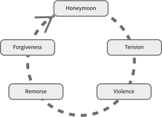

6
{:.chapter-number}

# Special social issues in maternal mental health

Take the chapter test before and after you read this chapter.



## Objectives

When you have completed this unit you should be able to:

*	Understand how poverty makes pregnant women more vulnerable to mental illness.
*	Understand how emotional support can influence mental illness.
*	Understand how pregnant teenagers can be affected by mental illness.
*	Understand how having an unintended pregnancy can affect mental health.
*	Be informed about the options of termination and adoption.
*	Understand how being a refugee can influence mental health.
*	Understand the different types of abuse.
*	Understand how health workers can assist abused mothers.
*	Understand some of the causes of child abuse.

Whether women are being referred to a professional counsellor, nurse, social worker or any kind of caregiver, there are a number of special issues which should be considered when caring for mothers with social problems. 

## Poverty and mental illness

### 6-1 Why does poverty make women more vulnerable to mental illness?

Women living in poverty are at greater risk of developing a mental illness, and those with mental illness are more likely to slide into poverty, or stay poor. Current studies show that as many as 1 out of any 3 women living in poverty in South Africa experience depression during or after their pregnancy. 

There are many issues associated with poverty which can negatively affect a woman’s mental health, such as:

*	losing her job or being unemployed
*	a change in social class or status, e.g. being divorced, being foreign, losing her home
*	housing problems, overcrowding
*	losing access to social grants or other forms of income
*	malnutrition
*	domestic violence
*	abuse
*	past or recent trauma
*	sick children or relatives requiring her care.

> Women living in poverty are at greater risk of developing a mental illness.

### 6-2 How does poverty affect the way in which women access resources for mental illness?

When helping and supporting a woman to identify the resources that are available, it must be kept in mind that women living in poverty face significant challenges. There may be fewer resources available to them and their situation might make it more difficult for them to get help that is available. However, it is important to be aware that the ‘vicious cycle’ relationship between poverty and mental ill-health can be broken, if the correct interventions are put into place.  

### 6-3 Why is it difficult for poor women to find emotional and practical support for their mental health?

Without support, women can feel lonely and overwhelmed, and may be less likely to get the help needed during pregnancy. This is why they are more likely to experience psychological problems. 

Even women living in busy or overcrowded settings can feel completely alone and in despair. 

Poor women may not find emotional and practical support because:
 
*	The women don’t feel worthy of support.
*	The women don’t feel strong enough to seek out support.
*	The community disapproves of the women.
*	The community is not used to being supportive of women.
*	The community is trying to survive in a difficult environment.

### 6-4 What are some signs that women may be lacking in support?

Signs that a woman may not be supported are:

*	Difficult relationships with her partner, mother or mother-in-law.
*	Little support from a partner or mother, such as financial, emotional or practical support.
*	Difficult relationships with her wider family or community.
*	Isolation, because of being rejected due to her HIV status, an unintended pregnancy, being a refugee, hostile in-laws, being a teenager, or her choice of partner.

### 6-5 How can a health worker help someone with limited resources?

Listen to her. Being heard and having someone provide emotional support can be very helpful. Are there any support groups in the area that can assist with finding resources? Can she be linked into accessing a social grant or work skills? 

Women value the support that comes from the people close to them. Women may feel supported if practical help or financial assistance is given. Emotional support is also considered extremely important to mothers.

> Emotional and practical support is important to maintain mental health.

## Teenage pregnancy and mental illness

### 6-6 How are pregnant teenagers affected by mental illness?

Pregnant teenagers are at greater risk of developing mental illness. Also, young women who are depressed are more likely to become pregnant during their teenage years. Health workers should keep in mind that adolescence is a time when a number of physical and emotional changes take place. Adolescent girls are vulnerable, and may have difficulties dealing with crises or recovering from trauma. They also may experience pressure to engage in sex or use alcohol and drugs. Pregnant adolescents need special attention that is non-judging and supportive. 

### 6-7 Can typical teenage behaviour be confused with mental illness?

‘Typical’ teenage behaviour, such as aggression or withdrawal, may be the natural ‘fight or flight’ responses to the terrifying situation in which the adolescent finds herself. 

### 6-8 How can a health worker help a pregnant teenager?

Do not judge her or show anger. This may cause the girl to reject the care you offer her out of fear. A health worker explaining that her fear is natural and showing empathy, can make a positive difference to the outcome for the girl and the pregnancy. Kindness and acceptance from health workers may help the fear and help with the difficult behaviours that some teenagers display in health care settings.

> Pregnant teenagers are at greater risk of mental illness. 

## Unintended pregnancy and termination of pregnancy

### 6-9 How can having an unintended pregnancy affect mental health?

About 60% of all pregnancies in South Africa are unintended (unplanned). Of these, one out of three is unwanted. The decision to either terminate or continue with the pregnancy is a very difficult one for most women and may cause severe distress. 

For some women, termination of a pregnancy is the decision they arrive at after weighing up their options, and this needs to be respected as their decision. Other women, however, will, even  in adverse social circumstances, decide to continue with the pregnancy and this needs to be supported.  It is important not to make a woman who faces an unintended pregnancy feel guilty about her decision. She is already in a crisis situation which will be made worse if she is judged for her choice.

For some women, the **choice to terminate** a pregnancy may have negative mental health consequences, and for others, the **choice to continue** with an unintended pregnancy also has mental health consequences, both for the mother and for the child. They may be stressed or worried that they will not be able to provide for this child. They may feel anger at a partner who has abandoned them or denied paternity. The timing of this pregnancy may disrupt schooling, studies or work plans – all of which may negatively affect others in the family or home. There are many reasons why an unintended pregnancy can cause mental distress.  

> Unplanned and unwanted pregnancies are common in South Africa and may result in mental illness.

### 6-10 How can health workers help women with unintended pregnancies?

Any women experiencing distress needs non-judgemental support and kindness to help them to make the best decision for themselves. Persuasion by a health worker to make a decision either way may be damaging for the mother.

### 6-11  Is terminating the pregnancy an option?

Health workers are legally obliged to provide information on Termination of Pregnancy (TOP) services for those who seek this, whatever the personal beliefs that the staff may have. A health worker who is approached by a woman for a termination may decline to do so, but is obligated by law to inform the woman of her rights and refer her to another health worker or facility where she can get a termination.

### 6-12 What is the law on terminating a pregnancy in South Africa?

The Choice on Termination of Pregnancy Act, 1996 (Act No. 92 of 1996) is the law governing terminations  in South Africa. During the first twelve weeks of a pregnancy, a termination may be performed at the request of the woman. From the thirteenth to the twentieth week, a pregnancy may be terminated if it endangers the woman's mental or physical health, if the fetus could suffer from a severe mental or physical abnormality, if the pregnancy resulted from rape or incest, or if it would significantly affect the woman's social or economic circumstances. After the twentieth week, a pregnancy may only be terminated if it could endanger the woman's life, if the fetus is severely malformed, or if there is a risk of severe illness to the fetus.

Note
:	Reference to this Act, and its amendment in 2004, can be found at [www.acts.co.za/choice-on-termination-of-pregnancy-act-1996](http://www.acts.co.za/choice-on-termination-of-pregnancy-act-1996).

### 6-13 Are termination services accessible?

Certain state hospitals or clinics perform free terminations, although sometimes only if the woman is referred by a health worker. Problems with access to early and safe TOP services mean that women can face a range of physical and mental health complications. Part of the poor access to services may relate to judgemental attitudes of health workers or to a lack of information given by health workers. Stigma and fear often make women have unsafe and dangerous illegal abortions. Backstreet abortions, often using the drug Misoprostol, can lead to septic infections, damage to internal organs or the most common effect is a continued pregnancy. Termination services have dramatically reduced both the number of and deaths from illegal abortions.

> The option of a termination of pregnancy must be available for unwanted pregnancies before twelve weeks gestation. 

### 6-14 Is adoption an option?

Women who have booked at an antenatal clinic may have accepted that they are having the baby, but it may still be unwanted. Women may want to explore the option of having the baby adopted. 

### 6-15 What is adoption?

Adoption is the legal act of **permanently placing a child with a parent or parents other than the child’s birth/biological mother or father**. A legal adoption order terminates the parental rights of the birth mother and father, while ‘handing over’ the parental rights and responsibilities to the adoptive parents. The adopted child is then regarded as the child of the adoptive parents. In a **Disclosed adoption**, the identity of the biological parents and the identity of the adoptive parents are known by both parties. This form of adoption may include a post-adoption agreement that provides for future contact or the exchange of information. In a **Closed adoption**, no identifying details are available or exchanged between the adoptive parents and biological parents.

### 6-16 How does adoption work?

Adoption proceedings are handled by social workers at accredited and designated child protection organisations. Some organisations may charge a fee relating to adoption. See further information about adoption agencies in the Resources section. 

Consenting to the adoption of a child is a difficult thing to do and child protection organisations and the Department of Social Development provide support services to assist with the process.

> Women should be helped if they are considering having their baby adopted.  

## Refugees and mental illness

### 6-17 How does being a refugee affect mental health?

Women who have had to leave their home countries, because of war or economic difficulties, experience high rates of emotional and physical trauma. They may have experienced violence during war or during their travels to other countries. Refugee women are also particularly vulnerable to being raped. In addition, they are often living in poverty and may find it difficult to access health care. 

> 
> 
> Figure 6-1: Refugee women may have experienced economic difficulty, violence, emotional and physical trauma and are often living in poverty.
{:.figure}

Because refugees have been separated from their families and communities, they often have very few sources of support or no support at all. They may find it difficult to communicate in the local language. Some communities are violent toward refugees, so refugee women may also face social isolation, discrimination and ongoing physical danger. These experiences, on top of the previous trauma of violence, economic hardship, the death of loved ones, torture or rape, can lead to very poor mental health among refugee women. Counselling a refugee woman can be difficult, as she may: 

*	be very scared
*	not trust strangers or people in positions of power, such as health workers
*	find it difficult to express herself in the local language
*	not understand the procedures of the clinic or what is happening during her pregnancy or labour.

### 6-18 How can a health worker assist a refugee mother?

Be gentle and understanding. If she is unable to speak the local language, try to get someone that she trusts to act as an interpreter. Try to explain what is happening and how the clinic works in simple language. Check that she understands before you examine her.

> Refugees often suffer many difficulties and are at risk of mental illness. 

Note
:	‘Loneliness, loss of identity, poverty and trauma are the main stressors that we see. Many refugee women have no one to talk to, and pregnancy makes them more vulnerable.’ *Charlotte Mande-Ilunga: French-speaking Perinatal Mental Health Project counsellor*

## Maternal abuse

### 6-19 What is domestic abuse?

Domestic abuse is defined as abusive acts that threaten another person’s physical safety, freedom, health and emotional wellbeing. Abusive acts can be physical, sexual, emotional and financial. These are committed by someone the person lives with, or used to live with (a domestic relationship), e.g.  a partner or ex-partner, boyfriend/girlfriend, parents, children, family member or a person sharing the same home. 

Domestic abuse often takes place in the home.

Domestic violence is abuse which often has a specific purpose in mind. It is used by someone to gain and maintain control over another person. This control is designed to make the person feel fearful of the abuser, so that control over the person’s life can be maintained.

There are very high rates of rape and violent assault in South Africa: it has the highest rate of violence against women in the world. 

### 6-20 Does domestic violence affect pregnancy and mental health?

Experiencing domestic violence is common in South Africa, and domestic violence is likely to increase during pregnancy. It is important for a health worker to pay special attention to these situations as they can affect a woman’s mental and physical health.

> Domestic violence is common in South Africa and can affect a woman's mental health.

### 6-21 What is intimate partner violence (IPV)? 

Intimate partner violence (IPV) is defined as threatened, attempted, or completed physical or sexual violence or emotional abuse by a current or former intimate (sexual) partner. IPV can be committed by a spouse, an ex-spouse, a current or former boyfriend or girlfriend, or a dating partner.

### 6-22 What is emotional abuse? 

Emotional abuse is the repeated use of controlling and harmful emotional behaviour by a partner to control a person.

As a result of emotional abuse, a person may live in fear and have altered thoughts, feelings and behaviours, as well as deny personal needs, to avoid further abuse.  Emotionally abusive behaviour by someone’s partner may include: 
 
*	Harsh, unreasonable and repeated criticism
*	Unreasonable or unrealistic demands or expectations
*	Unpredictable behaviour
*	Aggressive non-physical behaviour such as blaming, threatening and demanding
*	Humiliation and other verbal assaults
*	Isolation
*	Using ‘fear tactics’ or ‘guilt trips’
*	Threats of abandonment, or threats of having an affair
*	Threats of harm to the person, or the person’s children, friends or family
*	Exploitation
*	Demanding sexual acts
*	Control of person’s sexual and reproductive choices
*	Financial control (see financial abuse in section 6-26)
 
The abuser uses emotional abuse to damage someone’s feelings of self-worth and independence. People who have experienced emotional abuse may feel that there is no way out of their relationship, or that ‘they are nothing’ without their abusive partner. They will often blame themselves for the abuse.

### 6-23 What is physical abuse?

Physical abuse is physical injury inflicted on a person, on purpose, with the intention of being cruel or hurtful. Physical abuse can refer to punching, beating, kicking, biting, burning, shaking, or any other way of harming someone’s body physically. Physical abuse can happen just once, or can be ongoing.

### 6-24 What is sexual abuse?

Sexual abuse is any sexual contact or interaction (physical, visual, verbal or psychological) between one person (the victim) and another who is in a position of power (the abuser). The difference between rape and sexual abuse is that sexual abuse can be any act which uses someone for sexual stimulation. It can happen just once, or be ongoing. When physical sexual abuse is committed by a person who is a blood or legal relative, this is incest. 

### 6-25 What is rape?

Rape is any sexual act which has been forced onto another person. It can include, but is not limited to, acts of sexual penetration into the vagina, anus or mouth of another individual without their consent. A person can be raped by their partner, a family member, a friend, someone they know, a stranger, or by several people. Rape may be committed by a person who is a blood or legal relative. Rape is a violent, traumatic and life-changing experience that can happen to anyone, female or male. It can create stressful situations within a person’s relationship, family and community.

### 6-26 What is economic or financial abuse?

Financial abuse is a way of exercising control over another person. Financial abuse may include:
 
*	Strict control over a person’s finances, such as restricting the person to an ‘allowance’ or ‘pocket money’.
*	Withholding money.
*	Withholding basic necessities, such as food, clothes, medicine or even shelter.
*	Preventing a person from working or from choosing a career.
*	Sabotaging a person’s job, such as causing reasons for the person to miss work, calling or going to the person’s workplace frequently.

> There are many forms of abuse and each can affect mental health.

### 6-27 Why do women stay in abusive relationships? 

There are many reasons why women stay in abusive relationships. A woman might:

*	feel she is dependent on the abuser to support her and her children financially
*	think it is best that the children grow up with their parents living together 
*	feel she has nowhere else to go
*	have been threatened by the abuser if she were to leave 
*	feel worthless 
*	hope that the abuser will change and stop being abusive.

### 6-28 What is the ‘cycle of violence’?

Domestic violence often occurs in a cycle. 

*	Honeymoon phase: a violence-free period.
*	Tension: as the relationship progresses, arguments start; the abuser’s reaction seems extreme and tension builds up.
*	Violence: the abuse begins, and can be of any form (e.g. physical, emotional, etc.).
*	Remorse: the abuser shows remorse and repeatedly apologises and begs forgiveness.
*	Forgiveness: the woman starts feeling guilty, thinking perhaps she was the cause of the outburst, and accepts the abuser’s apology.
*	Honeymoon phase: the quiet, violence-free period starts again and the cycle continues.

The cycle usually repeats itself as the woman hopes that the abuser will change and go back to being the person she once knew.

> 
> 
> Figure 6-2: The cycle of violence.
{:.figure}

Note
:	The term honeymoon as used here does not refer to the brief holiday many people take together immediately after their marriage.

### 6-29 How can you tell if a woman is being or has been abused?

Women are not all the same, yet there are some common signs that women show when they are experiencing abuse. Rape and other forms of abuse can have a range of effects on women, such as:

**Physical effects**: shock, physical injury, nausea, tension headaches, disturbed sleeping and eating patterns, HIV or other sexually transmitted infections, pregnancy

**Behavioural effects**: crying more than usual, difficulty concentrating, restlessness, listlessness, withdrawing from people, relationships and social situations, not wanting to be alone, being easily frightened and jumpy, being easily upset, irritability, fear of sex, loss of sexual pleasure, changes in lifestyle, increased substance misuse and behaving as if the rape did not occur (denial)

**Psychological effects**: anxiety and fear, guilt, helplessness, humiliation and embarrassment, shame, low self-esteem, anger, feeling alone and misunderstood, losing hope for the future, numbness, confusion, aggression, personality changes, loss of memory, having flashbacks of the rape, nightmares, anxiety, depression and suicidal thoughts

However, if a woman does not show any of these reactions or symptoms, it does not necessarily mean that she has not been abused.  She may be hiding the effects.

Women who are experiencing abuse by their partner may:

*	Seem afraid or anxious to please their partner
*	Go along with everything their partner says and does
*	Check in often with their partner to report where they are and what they are doing
*	Receive frequent, harassing phone calls from their partner
*	Talk about their partner’s temper, jealousy or possessiveness

### 6-30 What are some of the warning signs for physical abuse?

Warning signs of physical abuse can include:

*	Frequent injuries, with the excuse of ‘accidents’
*	Frequently missing work, school or social occasions, without explanation
*	Dressing in clothing or make-up designed to hide bruises or scars (e.g. wearing long sleeves in the summer or sunglasses indoors)

### 6-31 What are some of the warning signs for emotional abuse?

Warning signs of isolation and emotional abuse can include:

*	Being restricted from seeing family and friends.
*	Rarely going out in public without the partner.
*	Having little or no access to money.
*	Not being able to make appointments with doctors, counsellors or anyone else because the partner does not approve.

### 6-32 What can be done if a woman is experiencing abuse?

Women who are suffering from domestic violence can feel very vulnerable and alone. So, it is particularly important to support them emotionally and provide practical support. This can be done by helping them understand their situation and what their options are, and refer them to community organisations for legal and social support.

Many health workers avoid asking about abuse, perhaps because they are worried it will take a lot of their time and energy to deal with, they do not feel properly trained to help, or because they do not know about options for care.

### 6-33 How can a health worker offer emotional support?

*	Ask the mother how she is feeling.
*	Express your concern.
*	Listen to her and acknowledge what she tells you.
*	Avoid pressuring her to leave her abuser, unless her safety can be guaranteed. Women are often most vulnerable to violence and murder after they attempt to leave.
*	You could discuss a safety plan with her.
*	Use the basic, but powerful listening and counselling skills covered in chapter 4.
*	You could offer to see her again as she may only be ready to accept help once a relationship of trust has developed with you and once she feels stronger in herself.

### 6-34 What options are available to an abused mother?

*	Explain to the mother that she has a right to human dignity, freedom of movement, equality and life. Explain that the way she is being treated goes against her rights.
*	Explain that she can apply for a Protection Order (in South Africa), which will legally forbid the abuser from committing any acts of domestic violence against her. 
*	There is more information about the process of applying for a Protection Order in the Resources chapter.
*	Try and get to know the non-governmental organisations (NGOs), support organisations or shelters that work with domestic and gender-based violence in the community: you can refer the woman to one of these so she can get legal, social and emotional support. She should get help from someone she trusts. 
*	You could offer her a referral to a medical doctor to assess her injuries or any other physical problems she may have.

### 6-35 Can the mother stay in the abusive situation?

In extreme situations, a woman may have to remove herself from immediate harm, and stay in a shelter or at a friend’s or relative’s home.

This is a difficult and important step for a woman victim of domestic abuse: it is essential that she is shown empathy and emotional support. You may be able to develop a safety plan with her. This will include ensuring secrecy of the location of where she is going, packing (sometimes secretly storing, over time) important documents, ID documents, valuables, clothing and food necessary for the woman and her children to leave. 

### 6-36 What if she does not want to leave?

*	The abuser might suspect that she is leaving, so she may not want to disclose her plans. Try to be patient, understanding, and not pressure her to talk. 
*	She is especially vulnerable, as she may be losing the financial or practical support she had in her home. Try to make sure that there is someone (e.g. sibling, cousin, friend, or someone from a support organisation) who can support her and help her stay away from harm. 
*	Try to support her choice, no matter what she decides to do.

A woman may deny she is being abused when she is asked about it. However, by simply asking, you are showing the mother that you care. She will appreciate that, and may feel safe to disclose at a later stage. 

Women who are being abused may have also witnessed abuse of their children. Often more than one person is being abused in a home. The woman herself may be abusing her children. The decision to stay or leave an abusive relationship may be influenced by whether her children are also being abused.

## Child abuse

### 6-37 What is child abuse? 

Child abuse is when a child is being hurt, on purpose, in any way, physically or emotionally. This includes emotional, physical and sexual abuse, and emotional and physical neglect. 

While working, health workers may come across mothers who are engaging in or witnessing abuse of their own children.  

*	Emotional abuse is regularly criticising, humiliating and mocking a child.
*	Physical abuse is any act of physical assault (e.g. hitting) or physical exploitation (e.g. forced child labour) by parents, caregivers or strangers. This includes cuts, fractures, bruises, shaking, burns and internal injuries.
*	Sexual abuse is any act of sexual assault and sexual exploitation of minors by parents, caregivers or strangers. It can happen just once or be ongoing. It includes fondling a child’s genitals, intercourse, rape, sodomy, exhibitionism and pornography.

### 6-38 What is child neglect?

*	Emotional neglect is the ongoing failure to provide a child with appropriate emotional support, attention and affection. 
*	Physical neglect is the failure to provide children with adequate food, clothing, shelter and medical care. Physical neglect also includes abandonment, expulsion from home and failure to enrol children in school. It is important to distinguish between neglect on purpose, and a parent’s failure to provide food, clothing and shelter because of poverty.

### 6-39 What are the causes of child abuse?

It is common for abusive parents to report being physically, sexually or emotionally abused themselves as children. However, there are parents who have not been abused as children who become abusive. There are also parents who have been abused as children who do not abuse their own children. 

Some of the reasons parents or caregivers can become abusive are:

*	low self-esteem
*	hostility and anger
*	feelings of isolation, loneliness or being overwhelmed
*	anxiety
*	depression
*	apathy
*	fear of rejection
*	emotional immaturity
*	difficulty with being able to trust others
*	drug or alcohol misuse 
*	adjusting to being a first-time parent, especially if the infant cries a lot, is ‘difficult’ or does not sleep well
*	parents’ lack of knowledge about childhood development 
*	lack of parenting skills and inappropriate attitudes e.g. acceptance of violence as a way to solve problems
*	unwanted pregnancy
*	physical illness 
*	being unable to empathise or relate to the child.

None of these factors mean that abuse will definitely happen. It is important to explore carefully all the details before making a claim of child abuse.

### 6-40 What types of children are at risk of abuse?

The child’s age and physical, mental, emotional and social development can increase the chance of abuse.  Younger children, due to their physical size and developmental status, are more vulnerable to certain forms of abuse, such as the ‘battered child syndrome’, the ‘shaken infant syndrome’ and the ‘failure to thrive syndrome’.

The child’s behaviour (e.g. crying, being unresponsive, irritable or aggressive) can increase the likelihood of abuse, particularly if a parent is not able to relate to the child, or has difficulty controlling his or her own emotions.

In general, children who are thought to be ‘different’, such as disabled children, are at greater risk of abuse. Children who are socially isolated can also be at high risk. For example, a child who does not have close relationships with his family and has few or no friends can be more vulnerable.

### 6-41 What types of families are at risk of abuse?

The situation of some families can increase the likelihood of abuse, such as:
 
*	conflict in the marriage
*	domestic violence
*	unemployment and financial stress 
*	social isolation.

Abusive families are often isolated from their neighbours and the community. As a result, abusive families tend to participate less in community activities and make less use of available economic, health and social resources. A health worker may notice over-reactions to the child’s negative behaviour, and very little reaction to positive behaviour. In addition, abusive parents often use inconsistent and inappropriate forms of punishment and discipline. 
 
It is important to remember that cultural or religious differences can make it difficult to identify or act on child abuse. What one culture defines as child abuse can be a socially acceptable act in another culture. 
 
For example, values concerning the role of the child in the family, and attitudes about the use of physical punishment, differ between cultures. It is important to be sensitive and careful in these cases. 

### 6-42 What can health workers do about child abuse?

Health workers have a duty and legal obligation to take action if child abuse is taking place. You may notice that a mother is not coping. She might say something that causes the health worker to be concerned, such as: 
 
*	When I am stressed I hit or shake my baby.
*	I’m afraid that I’m really going to hurt my baby.
*	I want to shake my baby until she stops crying.
*	I often feel out of control.
 
It is important to take these comments seriously.

Child abuse may be a mild, single event, or more serious or ongoing. The health worker’s responses should adapt to the level of abuse. 

### 6-43 How can you help a mother who has only hurt her child once?

You can help the mother who has hurt her child, or is afraid that she may hurt her child, to think about some short-term solutions. A health worker can say: 

*	This sometimes happens if someone is feeling very stressed. However, you must make sure that this does not happen again, to avoid harming the child physically and emotionally.
*	If you can, take a quick walk outside, have a bath or wash your face.
*	Breathe deeply and slowly.
*	Count to ten.
*	Only go back to your baby when you feel you can control your emotions.
*	Hitting a pillow, or shouting into the pillow can help release some of your stress.
*	Talk to someone you trust.
*	If you feel like this again, walk out of the room after making sure that your baby is safe. Then, phone your partner, mother, friend or counsellor.

Help the mother understand the baby’s needs and behaviour. For example, explain that the baby is not trying to frustrate her on purpose. If you think that she should be referred to a counsellor, you can introduce the idea by saying: ‘It sounds as though you are extremely stressed and that you need help immediately. I need to refer you to someone who will be able to give you the help and support you need. They might want to speak to you, your partner or your family about the situation.’

### 6-44 What should you do if you think that the mother is likely to hurt her child again?

You can offer her some longer-term suggestions, like:

*	You need to take this incident very seriously. It shows that something in your situation must change. 
*	You should get help in finding ways to reduce your stress levels. 
*	Therapy can help you to feel calmer and help you find solutions to your problems. 
*	Sometimes stress, depression or anxiety can result in you hurting your child.  Counselling or medication can help with this. A therapist can help you decide if medication is an option for you.
*	You may need more support from your partner, family, friends or neighbours. 
*	You may need practical help, like help with your housework. It is important for you to understand that more help may be necessary to have relief from the baby. This does not make you a bad mother. Making sure you get relief and support, so that you can take better care of your baby, is a good thing.

### 6-45 What should you do if you are concerned that the mother has hurt her child more than once?

You may have to call Social Services or Child Welfare. The mother may have said things like: 

*	Yesterday I really hit my child hard, I felt like I was losing control.
*	I was so frustrated that I shook my baby.
*	I threw my child on the bed.

The mother may feel unsure or even scared about Child Welfare getting involved in her life. Many mothers fear that their child/children will be taken away from them. 

*	Explain that you are going to phone Social Services or Child Welfare, which supports families in times of crisis. Explain that they help families to avoid tragedy and to overcome crisis situations.
*	You must be firm about contacting Social Services or Child Welfare because the child’s life is at risk. 
*	Be empathic. Listen to the mother’s feelings and allow her to share her fears and concerns.
*	Do not sound shocked.
*	Do not judge the mother.
*	Assure her that Social Services or Child Welfare will do what is best for the baby and the mother.

> Urgent action must be taken if a mother has hurt her child more than once. 

## Case study 1

A pregnant teenager is waiting in the clinic for her antenatal check-up. She seems sulky and is not engaging with other women who are waiting. She has booked late for antenatal care and has missed some of her appointments. When you call her to come for her check-up, she sighs loudly and takes her time in coming through. You think she is being disrespectful and rude. When you talk with her she says there is no point in looking after herself in the pregnancy. She explains how she is not interested in spending time with her friends and no one in her family ‘gets’ her.

### 1. How are pregnant teenagers affected by mental illness?

Pregnant teenagers are at greater risk of developing mental illness. Adolescence is a time when a number of physical and emotional changes take place. Teenagers are vulnerable, and may have difficulties dealing with crises or recovering from trauma. They also may experience pressure to engage in sex or use alcohol and drugs. 

### 2. What signs of mental illness are shown by this teenager? 

She has been late in booking and missed appointments; these could indicate withdrawal or avoidance behaviour. These may be linked to her feelings of hopelessness and social withdrawal.

### 3. What mental illness could this indicate?

She might be depressed or really scared about what is happening to her. Her fear may affect her functioning to a degree that she has an anxiety disorder.

*When you talk to her in private, you ask her why she got pregnant when she is so young. You tell her that she is ruining her future. She says she is leaving now; she does not need your advice.*

### 4. Did you approach this teenager in a helpful way?

No, you judged her and gave her unwanted advice. This has meant that she does not want to interact with you and wants to avoid the self-hating feelings your discussion created in her. She wants to leave the clinic and may not come back for any further care. 

### 5. Even though you thought she was rude, how should you have behaved towards her?

Do not judge her.  Explore her feelings and reflect these back to her. Explain to her that her fear is natural.  Show empathy. Kindness and acceptance from you may help with the difficult behaviours that this teenager has shown. 

## Case study 2

A pregnant mother has another child by a different father who is not providing any financial support. The father of this pregnancy is unknown. She was in a relationship with someone who has left the country, and also had unprotected sex with a stranger at a party. This pregnancy was unplanned and is unwanted. She does not know what to do. She is distressed and worries that she will not be able to support another child by herself. She feels guilty that she got herself into this crisis. 

### 1. Is an unwanted pregnancy unusual in South Africa?

About 60% of all pregnancies in South Africa are unintended (unplanned). Of these, one out of three is unwanted. 

### 2. How can you help this mother?

Any women experiencing distress needs non-judgemental support and kindness to help them to make the best decision for themselves. She should not be persuaded to make a decision according to your own assessment of the situation. This could be damaging for her mental health.  Rather, you could provide her information about her options and explore with her the implications of these, without leading her down any particular path. You could speak about how the decision is difficult to make but that she is best able to make it for herself.

### 3. If she chooses not to keep this baby, what are her choices? 

She can choose to have a termination or give the baby up for adoption. 

### 4. If she chooses to terminate the pregnancy, do you have to help her?

Yes, no matter what your beliefs are, you are legally obliged to provide information on Termination of Pregnancy (TOP) services for those who want this information. You are obligated by law to inform the woman of her rights and refer her to another health worker or facility where she can get a termination.

### 5. Are Termination Services accessible?
Certain state hospitals or clinics perform free terminations of pregnancy, although sometimes only if the woman is referred by a health worker. It also depends on how far her pregnancy has advanced. Termination on request is only available if the woman is less than twelve weeks pregnant.

### 6. What could happen if you do not provide her with information about Termination Services?

If she chooses to terminate the pregnancy without safe medical care, she may have a backstreet abortion – which could lead to infections, damage to internal organs or a continued pregnancy. She may feel that this is her only option due to the stigma and fear she confronts. She could prosecute you for withholding information. 

## Case study 3

A poor, pregnant mother is waiting outside the clinic. She is from a neighbouring country and does not speak the local language. She came to South Africa because of fighting in her home country. Her husband has no regular employment and is trying to get day work as a labourer. They live in a backyard dwelling with no flush toilet and only an outside tap for water. She does not understand how the system at the clinic works, and even though she has been outside for two hours, other people are being seen before her. They ignore her and walk past her into the clinic. She is now sitting on the pavement crying. She appears malnourished.

### 1. What factors associated with poverty make this mother more vulnerable to mental illness?

*	Being unemployed and having no secure form of income.
*	A change in social class or status, such as being foreign.
*	Housing problems.
*	Malnutrition.
*	Past or recent trauma.

### 2. Why do you think this mother is sitting crying? 

She could be overwhelmed and confused by her situation. If she is depressed, then she is also less able to make decisions to help herself. Malnourishment could also make her unable to think clearly or make decisions about her situation. She may not feel strong enough to get help. She may not feel that she is worthy of assistance. 

### 3. As a refugee, this mother is particularly vulnerable to mental illness. Why do you think this is so?	

*	She is unable to communicate in the local language and may feel lonely and confused by her situation. This could make her feel isolated and lacking in support.  
*	She may have experienced trauma in the conflict in her home country.
*	She may have experienced negative attitudes towards her from the local community or from health facilities in the past.   

*You bring this mother into the clinic and want to do her antenatal check-up. She has turned away from you and won’t let you examine her. She keeps crying.*

### 4. How can you try to help her?

Be gentle and understanding. She is unable to speak the local language so try to get someone that she trusts to act as an interpreter. Try to explain what is happening and how the clinic works in simple language. Check that she understands before you examine her. 

### 5. You would like to refer her for emotional support and counselling. As a refugee, what particular issues may she face that make it difficult for her?

*	She may be very scared.
*	She may not trust strangers or people in positions of power.
*	She could find it difficult to express herself in the local language.

## Case study 4

A young mother at your facility has come in with her new baby. It is a hot day and she is wearing a long-sleeved jersey over her dress. You remember her from when she gave birth as her partner seemed charming and was extremely attentive. You are surprised that she has not been back sooner for her postnatal check-up. The child looks well-cared for but wakes up and starts crying hungrily. The mother carefully covers herself up when feeding the baby. While she is waiting to see you, she takes a call on her cellphone. She seems agitated by the conversation and tells the person on the line that she is at home. She reassures the person she is speaking to that she would never leave without telling him and that, of course, she still loves him.  

### 1. From the information that you have gathered, what makes you suspect that this mother may be abused by her partner?

*	She is wearing long sleeves on a hot day.
*	Her partner seemed to be possessive.
*	She has not been able to make it to the facility for a check-up before today.
*	She covers herself carefully.
*	Her partner calls to check where she is.
*	She needs to reassure her partner. 

### 2. How can you offer emotional support to this mother?
*	Ask the mother how she is feeling.
*	Express your concern.
*	Listen to her and acknowledge what she tells you.
*	Avoid pressuring her to leave her abuser, unless her safety can be guaranteed.

*You ask the mother about her relationship with her partner. She starts crying and tells you that it is very difficult. She says that at times everything is fine, and then he starts finding fault in the things that she does. He comes home and says the house has not been cleaned properly and that his work shirts are not ironed. She tries hard to get everything done, but never seems to be good enough for him. He shouts at her, tells her she is useless and sometimes hits her. Then he is sorry, says he won’t do it again and everything is fine for a while. She keeps hoping that this time he will change and be the loving person that she once knew. She worries that she has nowhere else to go and that she is stupid and unable to earn money to support herself and the baby. He won’t let her see her cousins who live nearby.*

### 3. What do you suspect is happening at home?

The mother has been describing domestic abuse.

### 4. What is the cycle of repeated abuse known as?

The 'cycle of violence’.

### 5. What are some of the reasons that this mother gives for why she stays with her violent partner?

*	She keeps hoping that this time he will change and be the loving person that she once knew.
*	She worries that she has nowhere else to go.
*	She feels worthless (stupid).
*	She is financially dependent on him.

### 6. What options are open to this abused mother?

*	Explain to the mother that she has a right to human dignity, freedom of movement, equality and life. Explain that the way she is being treated goes against her rights.
*	Explain that she can apply for a Protection Order (in South Africa), which will legally forbid the abuser from committing any acts of domestic violence against her. 
*	If there are any NGOs, support organisations or shelters that work with domestic and gender-based violence in the community, you can refer the woman to one of these so she can get legal, social and emotional support.
*	She should get help from someone she trusts. 
*	You could discuss a safety plan with her.
*	You could offer her a referral to a medical doctor to assess her injuries or any other physical problems she may have.
*	You could offer to see her again as she may only be ready to accept help once a relationship of trust has developed with you and once she feels stronger in herself. 

## Case study 5

A pregnant mother at your facility has brought her two children with her, and they look dirty and uncared for. The oldest child is not at school even though she is old enough. The mother is irritable and shouts at the children and warns them that she is going to beat them if they don’t behave. The children are playing quietly in the corner of the room. Your cousin is a neighbour of this woman, and she has told you that the husband is unemployed.  He shouts and swears at his wife and the neighbours won’t talk to them. 

### 1. You are concerned that this mother is neglecting or abusing her children. What makes you think this?

*	The children look dirty and uncared for.
*	The older child is not in school when she should be.
*	The mother is hostile and angry towards her children.
*	She seems to lack parenting skills and sees violence as a way to solve problems.
*	She seems unable to relate to her children.

### 2. What factors indicate that this family could be at risk of abuse?

*	Conflict in the marriage.
*	Unemployment and financial stress.
*	Social isolation.

*You talk to the mother and she tells you that she does sometimes get out of control and hit her children.*

### 3. What short-term solutions can you tell her about to help her when she is stressed with the children?

You can say: 

*	This sometimes happens if someone is feeling very stressed. However, you must make sure that this does not happen again, to avoid harming the children physically and emotionally.
*	If you can, take a quick walk outside, have a bath or wash your face.
*	Breathe deeply and slowly.
*	Count to ten.
*	Only go back to your children when you feel you can control your emotions.
*	Hitting a pillow, or shouting into the pillow can help release some of your stress.
*	Talk to someone you trust.
*	If you feel like this again, walk out of the room after making sure that your children are safe. Then, phone your partner, mother, friend or counsellor.
*	Help the mother understand the children’s needs and behaviour. For example, explain that they are not trying to frustrate her on purpose. If you think that she should be referred to a counsellor, you can introduce the idea by saying: ‘It sounds as though you are extremely stressed and that you need help immediately. I need to refer you to someone who will be able to give you the help and support you need. They might want to speak to you, your partner or your family about the situation.’

*While you are talking, the older child comes over and you notice that she has bruises on her arms. Some of them look old and some are new. You realise that this may be a case of ongoing child abuse.*

### 4. What can you do?

You are obliged to contact Social Services and report child abuse. The mother may feel unsure or even scared about Social Services getting involved in her life. She may fear that the children will be taken away. She may get aggressive or break down in tears – both are signs of fear. 

### 5. How should you deal with her?

*	Explain that you are going to phone Social Services or Child Welfare, which supports families in times of crisis. Explain that they help families to avoid tragedy and to overcome crisis situations.
*	You must be firm about contacting Social Services or Child Welfare because the children’s lives are at risk. 
*	Be empathic. Listen to the mother’s feelings and allow her to share her fears and concerns.
*	Do not sound shocked.
*	Do not judge the mother.
*	Assure her that Social Services or Child Welfare will do what is best for the children and for her.
