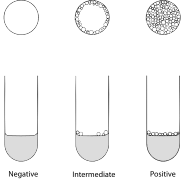

10
{:.chapter-number}

# Respiratory distress and apnoea

Before you begin this unit, please take the corresponding test to assess your knowledge of the subject matter. You should redo the test after you’ve worked through the unit, to evaluate what you have learned.

## Objectives

When you have completed this unit you should be able to:

* Diagnose respiratory distress.
* Diagnose apnoea.
* List the causes of respiratory distress and apnoea.
* Diagnose the different causes of respiratory distress and apnoea.
* Prevent respiratory distress and apnoea.
* Manage an infant with respiratory distress or apnoea.

## Respiratory distress

### 10-1 What is respiratory distress?

Respiratory distress in a newborn infant presents as a group of clinical signs which indicate that the infant has difficulty breathing. The 4 most important clinical signs of respiratory distress are:

1. **Tachypnoea**. A respiratory (breathing) rate of 60 or more breaths per minute (normal respiratory rate is less than 60).
2. **Central cyanosis**. A blue tongue in room air.
3. **Recession**. The in-drawing of the ribs and sternum during inspiration (also called retractions).
4. **Grunting**. A snoring noise made in the throat during expiration.

If an infant has 2 or more of the above clinical signs, the infant is said to have respiratory distress. Most infants with respiratory distress have central cyanosis.

> An infant has respiratory distress if two or more of the important clinical signs of difficult breathing are present.

Note
:	Respiratory distress is not a complete diagnosis as there are many different causes.

### 10-2 What are the important causes of respiratory distress?

Respiratory distress in newborn infants has many pulmonary (lung) as well as extra-pulmonary (outside the lungs) causes.

The most important *pulmonary causes* of respiratory distress are:

1. Hyaline membrane disease
2. Wet lung syndrome
3. Meconium aspiration
4. Pneumonia

The important *extra-pulmonary* causes of respiratory distress are:

1. Pneumothorax
2. Heart failure
3. Hypothermia
4. Metabolic acidosis
5. Anaemia
6. Polycythaemia

Note
:	Less common pulmonary causes of respiratory distress include pulmonary haemorrhage, hypoplastic lungs and chronic lung disease while less common extra-pulmonary causes include diaphragmatic hernia and persistent pulmonary hypertension.

> There are many different causes of respiratory distress.

Always look for the cause if an infant has respiratory distress. Simply saying that an infant has respiratory distress is not enough.

### 10-3 How should you manage an infant with respiratory distress?

The principles of general care are the same, irrespective of the cause of the respiratory distress. Therefore, all infants with respiratory distress should receive the following general management:

1. Keep the infant warm, preferably in a closed incubator or under an overhead radiant heater.
2. Handle the infant as little as possible, because stimulating the infant often increases the oxygen requirements. There is no need to routinely suction the airways.
3. Provide energy, preferably by giving an infusion of maintenance fluid (e.g.&nbsp;Neonatalyte).
4. Record the following important observations every hour and note any deterioration:
	* Respiratory rate
	* Presence or absence of recession and grunting
	* Presence or absence of cyanosis
	* Percentage of inspired oxygen (FiO₂)
	* Oxygen saturation (SaO₂) by pulse oximeter
	* Heart rate
	* Both the abdominal skin (or axilla) and incubator temperatures
5. Treat central cyanosis by giving oxygen by head box, nasal cannula or nasal prongs. An air/oxygen blender or venturi must be used. Monitor the percentage (fraction) of inspired air (FiO₂) and oxygen saturation (SaO₂). If this is not possible, give just enough oxygen to keep the infant’s tongue pink.
6. Take a chest X-ray.
7. If possible measure the infant’s arterial blood gases (pH, oxygen and carbon dioxide).
8. Consult the nearest level 2 or 3 hospital as the infant may need to be transferred. This is particularly important in hyaline membrane disease.
9. The infant may need continuous positive airways pressure (CPAP) via nasal prongs if oxygen alone fails to keep the infant pink.
10. If the infant develops recurrent apnoea or if continuous positive airways pressure fails to keep the infant pink, then intubation and ventilation are indicated.

In addition to the general management of respiratory distress, any specific treatment of the cause of the respiratory distress must be given, e.g. antibiotics for pneumonia or surfactant for hyaline membrane disease.

Note
:	Spasm of the pulmonary arteries may be caused by excessive handling, hypothermia, acidosis or hypoxia. Pulmonary blood is then shunted away from the lungs making the hypoxia much worse. It is, therefore, essential to avoid these aggravating factors.

## Hyaline membrane disease

### 10-4 What is hyaline membrane disease (HMD)?

At term the fetal alveoli are mature and ready to be inflated with air after delivery. These mature alveoli secrete a substance called *surfactant* that prevents them collapsing completely at the end of each expiration. This allows the infant to breathe air in and out with very little physical effort.

In contrast, infants with immature lungs do not have adequate amounts of surfactant at birth. As a result their alveoli collapse with expiration and the infant has difficulty expanding them again during inspiration. Collapsed alveoli, due to the lack of surfactant, result in respiratory distress. This condition with too little surfactant is known as hyaline membrane disease (HMD).

> Hyaline membrane disease is caused by the lack of enough surfactant in immature lungs.

Note
:	The lungs of infants with hyaline membrane disease have 3 major problems:

	* Generalised alveolar collapse due to inadequate amounts of surfactant
	* The collapsed alveoli fill with a protein-rich fluid that forms hyaline membranes, giving the condition its name
	* Spasm of the pulmonary arteries which results in blood being shunted away from the lungs via the foramen ovale and ductus arteriosus

	These abnormalities all result in respiratory failure with poor oxygenation of the blood.

### 10-5 Which infants do not have adequate surfactant?

Preterm infants often have immature lungs with inadequate surfactant. Therefore, the more preterm the infant, the greater is the risk of hyaline membrane disease.

> Hyaline membrane disease is a major cause of death in preterm infants.

### 10-6 How can you tell whether an infant has adequate amounts of surfactant?

1. The presence or absence of surfactant in the fetal lung can be determined before delivery by doing a *bubbles test* on a sample of amniotic fluid obtained by amniocentesis.
2. Similarly the *shake test* on a sample of gastric aspirate obtained within 30 minutes after delivery will indicate whether adequate amounts of surfactant are present in the lungs of a newborn infant.

Note
:	Fetal lung fluid is both swallowed and passed out of the mouth into the amniotic fluid during pregnancy. A sample of amniotic fluid before delivery, or gastric aspirate immediately after delivery can, therefore, be used to test whether surfactant is being produced by the alveoli.

### 10-7 How do you diagnose hyaline membrane disease?

1. The infant is almost always preterm. Only occasionally does a term infant develop hyaline membrane disease. Term infants with hyaline membrane disease are usually born to women with poorly controlled diabetes or after severe intrapartum hypoxia.
2. The bubbles test on amniotic fluid or the shake test on gastric aspirate is negative indicating inadequate surfactant.
3. The infant develops respiratory distress at or soon after delivery. The signs of respiratory distress gradually become worse during the first 48 hours after birth if surfactant treatment is not given.
4. The infant is usually inactive and commonly develops peripheral oedema.
5. The chest X-ray is abnormal and shows small lungs with granular lung fields. These findings are the result of alveolar collapse. A typical chest X-ray is needed to make a definite diagnosis of hyaline membrane disease.
6. Oxygenation improves dramatically if surfactant treatment is given.

Note
:	The typical X-ray findings of severe hyaline membrane disease include small lung volume (best seen on the lateral view) with air bronchograms extending beyond the cardiothymic shadow, granular opacities extending out to the periphery of the lungs, poor distinction between the cardiothymic shadow and the lungs, and usually a large thymus. The X-ray features of hyaline membrane disease may not be typical in the first few hours after birth and less marked in infants with mild hyaline membrane disease..

### 10-8 What is the clinical course in hyaline membrane disease?

The degree of respiratory distress gets worse and the concentration of inspired oxygen needed to keep the infant pink increases for the first 2 to 3 days after birth. During this time some infants will die of hyaline membrane disease. Otherwise the respiratory distress gradually improves after 48 to 72&nbsp;hours and the oxygen can usually be stopped after 5 to 10 days of age. Once fully recovered the infant’s lungs are usually normal, although repeated episodes of bronchiolitis during the first year of life are common. This natural course of hyaline membrane disease is changed and shortened with surfactant treatment.

Note
:	The clinical signs of respiratory distress get worse after delivery as the alveolar surfactant is gradually used up. However, after 2 to 3 days of breathing air the lungs start to produce surfactant again and the signs of respiratory distress, therefore, improve.

> Hyaline membrane disease gets worse before it gets better.

### 10-9 How do you prevent hyaline membrane disease?

1. If possible, preterm delivery should be prevented. Unfortunately this is often not possible.
2. If the patient is in preterm labour between 26 and 34 weeks gestation, labour should be suppressed if there are no contra-indications. Steroids (intramuscular betamethasone in 2 doses given 24 hours apart) should then be given to a mother to accelerate maturation of the fetal lungs. If possible, delivery should be delayed for 48 hours to allow the full benefit of steroids.
3. Move the mother to a hospital where there is a neonatal unit able to manage small infants.
4. All preterm infants must be adequately resuscitated. Avoid using high pressures during ventilation.
5. Prevent hypothermia, hypoglycaemia and hypoxia after birth as they can all decrease the production of surfactant.
6. Giving steroids to the newborn infant does not prevent hyaline membrane disease.

> Maternal steroids during preterm labour can prevent hyaline membrane disease in many infants.

Note
:	In preterm labour, it is possible to assess whether the fetal lungs are mature by doing a bubbles test on a sample of amniotic fluid obtained by amniocentesis. However, this is usually no longer done.

### 10-10 How do you manage an infant with hyaline membrane disease?

1. Provide the general supportive management needed by all infants with respiratory distress. If the infant can be kept alive for the first 72 hours, recovery usually occurs when spontaneous surfactant production increases.
2. It is important to diagnose hyaline membrane disease as soon as possible after birth because these infants need urgent transfer to a level 2 or 3 hospital with a newborn intensive care unit. Whenever possible, all infants at high risk of hyaline membrane disease should be delivered in a level 2 or 3 hospital.
3. Give oxygen correctly and safely to prevent hypoxia.
4. Provide continuous positive airways pressure (CPAP) via nasal prongs. This has greatly improved the management of infants with hyaline membrane disease and should be started as soon as the diagnosis is made. It is best started as soon as the infant has been resuscitated.
5. If nasal CPAP and oxygen fail to keep the infant pink, intubation and ventilation are needed. However, CPAP can usually prevent the need for ventilation in most infants with hyaline membrane disease.
6. The early use of artificial surfactant has shortened the course and lessened the severity of hyaline membrane disease. It has also decreased the mortality. Fortunately artificial surfactant is less expensive than before.

> The early use of continuous positive airways pressure and artificial surfactant has greatly improved the management and survival of infants with hyaline membrane disease.

### 10-11 When and how is artificial surfactant given?

Artificial surfactant is usually given within the first few hours to infants with hyaline membrane disease who cannot be adequately oxygenated with a FiO₂ of 0.4 using nasal prong CPAP alone. These infants are intubated and the surfactant is instilled rapidly down the endotracheal tube. After a minute of gentle bag ventilation the endotracheal tube can be withdrawn and the infant is placed back on nasal prong CPAP. The use of artificial surfactant is usually restricted to level 2 and 3 units. It is important that staff receive special training before attempting to use this form of treatment.

Note
:	Survanta and Curosurf are two commonly used artificial surfactants in South Africa. Usually a single dose is adequate. The dosing regime differs between the two products but their effectiveness is similar.

### 10-12 What are the complications of hyaline membrane disease?

1. All the other problems of the preterm infant are common in these infants, especially jaundice, apnoea of immaturity, hypothermia and hypoglycaemia.
2. Hypoxic brain damage if the infant cannot be kept pink
3. Secondary bacterial pneumonia if the infant is intubated
4. Intraventricular haemorrhage
5. Pneumothorax
6. Patent ductus arteriosus
7. Chronic lung disease

## Wet lung syndrome

### 10-13 What is the wet lung syndrome?

Before delivery the fetal lungs are not collapsed but the alveoli and bronchi are filled with lung fluid. At vaginal delivery, most of this fluid is squeezed out of the lungs as the chest is compressed in the birth canal. After birth the remaining fluid is coughed up or is absorbed into the capillaries and lymphatics of the lung within a few minutes. In some infants this rapid removal of fetal lung fluid does not take place resulting in the wet lung syndrome which presents as respiratory distress. The wet lung syndrome (also called ‘wet lungs’ or transient tachypnoea of the newborn) is the commonest cause of respiratory distress. It is also important because during the first day of life it can easily be confused with hyaline membrane disease.

> The wet lung syndrome is the commonest cause of respiratory distress.

### 10-14 Which infants commonly develop the wet lung syndrome?

In the following conditions the normal clearance of lung fluid is often delayed for many hours resulting in the wet lung syndrome:

1. Caesarean section, especially if the mother has not been in labour and the membranes have not been ruptured before delivery (elective caesarean section)
2. Fetal hypoxia or severe neonatal asphyxia (need for resuscitation after delivery)
3. Maternal sedation
4. Polyhydramnios

In some infants, however, the above risk factors are not present and the cause of the wet lung syndrome is not known.

Note
:	Excessive secretion of pulmonary fluid, poor respiratory efforts, damaged pulmonary capillaries and poor contraction of the left ventricle probable all can result in the wet lung syndrome.

### 10-15 How can you diagnose the wet lung syndrome?

1. These infants may be born at or before term.
2. They develop respiratory distress soon after delivery.
3. They often have an overinflated chest and usually do not need more than 50% oxygen (FiO₂ of 0.5) to correct the central cyanosis.
4. Their clinical signs gradually improve after birth and usually disappear by 72 hours.
5. The shake test on the gastric aspirate is positive, which excludes hyaline membrane disease.
6. The chest X-ray in the wet lung syndrome shows hyperinflated (large) lungs, which is different from the small lungs seen in hyaline membrane disease.

> The wet lung syndrome is important because it can be confused with hyaline membrane disease.

Note
:	After 6 hours of age the chest X-ray in the wet lung syndrome is typical with hyperexpanded lungs (due to air trapping caused by oedematous small airways), increased parahilar vascular mark­ings (due to dilated lymphatics and capillaries) and clear peripheral lung fields. However, the chest X-ray in the first few hours after delivery may be similar to that of hyaline membrane disease due to the presence of alveolar fluid. It is, therefore, best to wait a few hours before taking a chest X-ray if hyaline membrane disease and wet lung syndrome are to be differentiated.

### 10-16 What is the clinical course of the wet lung syndrome?

Respiratory distress caused by the wet lung syndrome presents at or soon after birth and can mimic hyaline membrane disease for the first few hours after delivery. However, infants with the wet lung syndrome gradually improve during the first 24 hours, and oxygen is usually needed for 2 to 3 days only. Therefore the clinical course of the wet lung syndrome is very different from that of hyaline membrane disease.

> Wet lung syndrome steadily improves after delivery.

### 10-17 How should you manage infants with the wet lung syndrome?

The management of an infant with the wet lung syndrome is the same as the general management of all infants with respiratory distress. However, oxygen alone or continuous positive airways pressure is usually all that is needed to prevent cyanosis, and only rarely is there a need to transfer the infant to a level 2 or 3 unit as the condition can be expected to steadily improve. Three hourly feeds by nasogastric tube, rather than an intravenous infusion, can usually be given.

## Meconium aspiration syndrome

### 10-18 What is the meconium aspiration syndrome?

If the fetus is hypoxic in utero it may pass meconium and make gasping movements which suck the meconium-stained liquor into the larynx and trachea. If the airways are not well suctioned after the head is delivered, the meconium can be inhaled into the smaller airways and alveoli with the onset of breathing, resulting in the following lung damage:

1. Meconium contains enzymes (from the fetal pancreas) which damage the epithelial lining of the bronchi and bronchioles.
2. The enzymes in meconium also cause severe alveolar damage.
3. Meconium plugs partially or completely block the airways resulting in some areas of collapsed lung and other areas of over-expanded lung.

Most meconium-stained infants have not gasped and inhaled meconium before delivery. Therefore they will not develop the meconium aspiration syndrome.

Note
:	Severe meconium aspiration causes a chemical pneumonitis and almost always results in pulmonary hypertension with shunting of blood away from the lungs via the foramen ovale and ductus arteriosus. This causes severe hypoxaemia.

### 10-19 How do you diagnose the meconium aspiration syndrome?

1. The infant is usually born at term or postterm but only rarely preterm.
2. The amniotic fluid is meconium stained. The thicker the meconium the greater is the risk of severe meconium aspiration syndrome.
3. Meconium may be suctioned from the mouth and upper airways at birth and the infant is usually meconium stained.
4. Respiratory distress is present and the chest usually appears hyperinflated (over-expanded).
5. The chest X-ray shows hyperinflation with many white areas of collapsed lung.

Note
:	The contradictory combination of marked hyperinflation (due to partially blocked airways) together with diffuse patches of collapsed lung (due to completely blocked airways and chemical pneumonitis) is typical of the meconium aspiration syndrome.

### 10-20 What is the clinical course of the meconium aspiration syndrome?

From birth the meconium-stained infant has respiratory distress which, in severe aspiration, gets progressively worse and may kill the infant. Milder cases will gradually recover over days or weeks. Infants who survive severe meconium aspiration often have damaged lungs that may take months to recover.

### 10-21 Can you prevent the meconium aspiration syndrome?

Yes, most cases of severe meconium aspiration syndrome can be prevented by carefully suctioning the upper airways of *all* meconium-stained infants *before* they start to breathe at birth. Therefore, it is essential to clear the airways before the infant’s shoulders are delivered.

> Severe meconium aspiration can usually be prevented by suctioning the upper airways immediately after the infant’s head has been delivered.

Meconium may be passed into the amniotic fluid and then sucked into the large airways by a fetus who suffers hypoxia during labour. Because the fetal alveoli are filled with lung fluid before delivery, very little meconium can get into the small airways and alveoli until the infant inhales air at delivery.

If the infant requires active resuscitation after delivery, suction the airway well once more before starting bag and mask ventilation. There is no need for further suctioning after delivery if the infant cries well and does not need resuscitation.

The most effective way to prevent meconium aspiration syndrome is to improve the care during labour to avoid fetal hypoxia.

Note
:	Reports from trials conducted in countries with high rates of caesarean section and low rates of neonatal death due to meconium aspiration syndrome suggest that early suctioning is not needed. These results must be accepted with caution in countries with inadequate obstetric services where severe meconium aspiration is common. Other studies suggest that amniotic fluid washout before delivery may reduce the risk of meconium aspiration.

### 10-22 How should you manage an infant with the meconium aspiration syndrome?

1. Management consists of the supportive care needed by any infant with respiratory distress.
2. Unfortunately there is no specific treatment for the infant with respiratory distress caused by meconium aspiration. The value of steroids, to decrease the inflammation, and prophylactic antibiotics remains unproved and, therefore, they are usually not given.
3. Continuous positive airways pressure or mechanical ventilation may be needed to correct hypoxaemia.
4. A stomach washout with 2% sodium bicarbonate or half normal saline helps to prevent gastritis caused by meconium. The phagocytes in colostrum feeds also help in the removal of meconium from the stomach.
5. Look for complications.

> It is far better to prevent than have to treat meconium aspiration syndrome.

### 10-23 What are the complications of meconium aspiration?

1. Pneumothorax and pneumomediastinum are common due to rupture of areas of over-expanded lung.
2. Hypoxic damage to other organs, such as the brain, due to the intrapartum hypoxia that caused the fetus to pass meconium.
3. Meconium gastritis which presents with repeated vomiting of meconium-stained mucus.

Note
:	Persistent pulmonary hypertension (damage and spasm of the pulmonary arteries) often complicates meconium aspiration syndrome and causes severe hypoxia. This condition may be present and result in respiratory distress even if good suctioning prevents meconium aspiration.

## Pneumonia

### 10-24 What is the cause of pneumonia in newborn infants?

1. An infant may be born with bacterial pneumonia (congenital pneumonia) as a complication of chorioamnionitis.
2. Infants may develop pneumonia in the days or weeks after birth (acquired pneumonia) due to the spread of bacteria by the hands of staff or parents (nosocomial infection).
3. Congenital syphilis may also cause pneumonia if mothers are not routinely screened for syphilis during pregnancy.

### 10-25 How is pneumonia diagnosed and treated in newborn infants?

The diagnosis of congenital pneumonia resulting from chorioamnionitis is suggested by seeing pus cells and bacteria in a Gram stain of the gastric aspirate after delivery. These infants are often preterm and develop respiratory distress soon after birth. Usually their mothers have no clinical symptoms or signs of infection.

In contrast, infants with acquired pneumonia usually only become ill 2 or 3 days after delivery. Acquired pneumonia is common in infants receiving ventilation. Every effort must be made to prevent pneumonia in newborn nurseries by practising good aseptic techniques (clean hands).

The clinical diagnosis of pneumonia can be confirmed by a chest X-ray which usually shows areas of collapsed or consolidated lung. Treatment of pneumonia is supportive care plus parenteral antibiotics, e.g. penicillin and gentamicin, or ceftriaxone. Infants with congenital syphilis are treated with penicillin.

> Clean hands can prevent many cases of pneumonia in a newborn care unit.

## Pneumothorax

### 10-26 What is a pneumothorax?

A pneumothorax (pneumo=air; thorax=chest) is a collection of air in the pleural cavity surrounding the lung. It is caused by the rupture of one or more alveoli which allows air to escape from the lung. The pneumothorax compresses the lung and prevents normal lung expansion during inspiration. Usually a pneumothorax occurs on one side only but it may be bilateral (pneumothoraces).

### 10-27 Who is at risk of pneumothorax?

1. All infants with respiratory distress, whatever the cause
2. Infants with meconium aspiration
3. Infants that need ventilation at resuscitation
4. Infants that are intubated and are ventilated in the nursery

### 10-28 How do you diagnose a pneumothorax?

The clinical diagnosis of pneumothorax in the newborn is often very difficult as the classical signs may not be present. The following signs are helpful however:

1. Sudden unexpected collapse
2. Rapidly increasing oxygen needs in respiratory distress
3. Poor breath sounds with little movement on one side of the chest
4. An easily palpable liver in a right-sided pneumothorax
5. Poor heart sounds or heart sounds best heard on the right of the sternum in a left-sided pneumothorax (the heart is pushed to the right)

The suspected clinical diagnosis can be confirmed by:

1. Transillumination of the chest. The chest wall on the side of the pneumothorax transilluminates well while the chest wall on the normal side does not.
2. A chest X-ray which will show air in the pleural space.

### 10-29 How do you treat a pneumothorax?

1. If the infant has mild respiratory distress with a small pneumothorax and is not cyanosed in headbox oxygen, the infant can be closely observed. Many small pneumothoraces will reabsorb without drainage. However, infants requiring oxygen should be transferred to a level 2 or 3 hospital where a chest drain can be inserted, if necessary.
2. If the infant develops severe respiratory distress due to a pneumothorax, is receiving continuous positive airways pressure or is on a ventilator, a chest drain must be inserted immediately.
3. If a chest drain cannot be inserted due to lack of equipment or a trained person, the pleural space can be aspirated with a needle and syringe as an emergency procedure. This is a first aid measure only and must be followed as soon as possible with a chest drain.

## Heart failure and patent ductus arteriosus

### 10-30 What are the common causes of heart failure in the newborn infant?

There are many different causes of heart failure. The common causes in the newborn infant are:

1. Patent ductus arteriosus
2. Congenital malformation of the heart
3. Infusion of excessive amounts of intravenous fluid
4. Hypoxia
5. Anaemia

Heart failure in many of these conditions presents as respiratory distress due to pulmonary oedema.

### 10-31 What is a patent ductus arteriosus (PDA)?

The ductus arteriosus is a large artery that joins the aorta and pulmonary artery in the fetus. Because the lungs do not function before birth, blood from the pulmonary artery by-passes the fetal lungs via the ductus arteriosus to the aorta. After delivery the ductus arteriosus normally closes and blood then passes from the pulmonary artery to the lungs. In preterm infants the ductus often does not close normally but remains open (patent) for a few weeks. As a result, blood flows backwards from the aorta into the pulmonary artery, flooding the lungs with blood and causing heart failure. This usually presents 3 or more days after delivery and may be precipitated by increasing a preterm infant’s feeds to more than 150 ml/kg/day. If the ductus is large then it will cause pulmonary oedema and present with signs of respiratory distress.

### 10-32 How is a patent ductus arteriosus diagnosed?

The clinical diagnosis of a patent (open) ductus arteriosus can be made by observing the following signs:

1. A heart murmur
2. Collapsing pulses (the pulses are very easy to feel)
3. In severe cases the infant will also have signs of respiratory distress.

The clinical diagnosis is easily confirmed by ultrasonography.

Note
:	The heart murmur is typically pansystolic and heard best under the left clavicle or to the left of the sternum. Usually the heart beat can also be easily felt by placing your hand over the infant’s lower sternum. On chest X-ray the lungs appear congested.

### 10-33 How should you treat a patient with a patent ductus arteriosus?

If the infant has no signs of heart failure, then the feeds should not exceed 150 ml/kg/day and the infant should be carefully observed. In most cases further treatment is not needed and the ductus closes spontaneously when term is reached.

However, if the infant has signs of respiratory distress:

1. The infant must be referred to a level 2 or 3 hospital.
2. Restrict fluid intake to 120 ml/kg/day.
3. Furosemide (Lasix) 1 mg/kg must be given orally or by intramuscular or intravenous injection.
4. Transfuse very slowly with packed cells (10&nbsp;ml/kg) if the PCV is below 30% (Hb below 10 g/dl).

If the infant fails to respond to this management then the infant must be transferred to a level 3 hospital for ultrasound examination to confirm the clinical diagnosis. Oral or intravenous treatment with indomethacin (Indocid) or ibuprofen (Brufen) is used to close the patent ductus arteriosus. Rarely surgical closure may be needed.

Note
:	Indomethicinan or ibuprofen blocks the synthesis of prostaglandins which keep the ductus arteriosus patent. Both drugs have side effects, however, including renal failure.

### 10-34 How can you differentiate between the common causes of respiratory distress?

Factors in the history, physical examination and investigations may suggest a particular cause for the respiratory distress.

**History**:

1. Hyaline membrane disease in a preterm infant or an infant of a diabetic mother
2. Wet lung syndrome in an infant born by elective caesarean section
3. Meconium aspiration if the infant is meconium stained
4. Congenital pneumonia if there has been maternal pyrexia or offensive liquor
5. Patent ductus arteriosus in a preterm infant who is a few days or weeks old

**Examination**:

1. Preterm infant in hyaline membrane disease
2. Hyperexpanded chest in the wet lung syndrome
3. Meconium staining in the meconium aspiration syndrome
4. Offensive smell at birth in congenital pneumonia
5. Asymmetrical chest movement and breath sounds in pneumothorax
6. Murmur and full pulses in an infant with a patent ductus arteriosus

**Investigations**:

1. No surfactant on shake test in hyaline membrane disease
2. Pus cells and bacteria in the gastric aspirate in congenital pneumonia
3. Typical chest X-ray in hyaline membrane disease, wet lung syndrome, meconium aspiration syndrome, pneumonia and pneumothorax
4. Transillumination in pneumothorax
5. Ultrasonography to diagnose patent ductus arteriosus

## Apnoea

### 10-35 What is apnoea?

Apnoea is the arrest (stopping) of respiration for long enough to cause bradycardia together with cyanosis or pallor. The oxygen saturation falls with apnoea. Usually apnoea for 20&nbsp;seconds or longer is needed to produce these clinical signs. The infant may have a single apnoeic attack but usually the episodes of apnoea are repeated.

> Infants with apnoea stop breathing for long enough to result in bradycardia and cyanosis.

Apnoea should not be confused with *periodic breathing*, which is a normal pattern of breathing in preterm and some term infants. These infants have frequent short pauses in their respiration (less than 20 seconds each). With periodic breathing, the arrest of breathing movements does not last long enough to cause bradycardia, cyanosis or pallor.

> Periodic breathing does not cause bradycardia or cyanosis.

### 10-36 How should you diagnose apnoea?

1. The diagnosis of apnoea is usually made by observing the breathing pattern, colour and heart rate of an infant.
2. Apnoea can also be diagnosed with the aid of an apnoea monitor which is usually set to trigger if the infant does not breathe for 20 seconds. A solid sensor pad is placed under the infant, or electrodes are attached to the infant’s chest. The sensor pad or electrodes are attached via a connecting lead to the monitor unit.
3. A cardiorespiratory monitor, that measures and displays both the respiratory and heart rate, can also be used to detect apnoea.
4. A pulse oximeter will indicate a fall in oxygen saturation when the infant has apnoea.

Note
:	Obstruction of the airways can similarly present with bradycardia and cyanosis even though respiratory efforts are still being made. However, there is no movement of air in and out of the lungs (obstructional apnoea).

### 10-37 What are the causes of apnoea?

Apnoea is a clinical sign that has many causes:

1. The commonest cause is apnoea of immaturity.
2. Respiratory distress of any cause may result in apnoea.
3. Infection, especially pneumonia, septi­caemia and meningitis may cause apnoea.
4. Hypoxia, hypothermia or hypoglycaemia.
5. Hyperthermia due to overheating in an incubator or overhead radiant heater is an important and easily correctable cause of apnoea.
6. Intraventricular haemorrhage.
7. A large feed, vomit or gastro-oesophageal reflux.
8. Convulsions may present with recurrent apnoea only.
9. Maternal analgesia or sedation during labour, e.g. pethidine, morphine or diazepam (Valium).
10. Anaemia, especially if the infant also has a patent ductus arteriosus.

### 10-38 What is apnoea of immaturity?

In some preterm infants the respiratory centre in the brain stem is immature and this results in repeated attacks of apnoea. These infants are usually under 34 weeks of gestation. The more preterm the infant, the greater is the risk of apnoea of immaturity. Apnoeic attacks usually start after 48 hours of age, and occur especially after a feed.

### 10-39 How should you manage apnoea?

1. Always look for a cause of the apnoea and treat the cause if possible.
2. Apnoea of immaturity can be prevented and treated with the use of oral theophylline or caffeine.
3. Nursing newborn infants slightly head up on their abdomen (the prone position) decreases the incidence of apnoea. However, older infants should be nursed on their backs to prevent sudden infant death.
4. Keeping the infant’s abdominal skin temperature strictly between 36 and 36.5&nbsp;°C helps to prevent apnoea.
5. Monitor infants for apnoea, or infants with a high risk of apnoea, using an apnoea monitor, cardiorespiratory monitor or pulse oximeter.
6. During an attack of apnoea, breathing can be restarted in most cases by simply stimulating the infant. Touching the feet is usually adequate to restart breathing.
7. Headbox or nasal cannula oxygen, at a concentration not higher than 25% (FiO₂&nbsp;0.25), may prevent repeated apnoea. Giving a higher concentration of oxygen to prevent apnoea is extremely dangerous as it can cause retinopathy of prematurity.
8. Continuous positive airways pressure via nasal prongs is used to prevent repeated apnoea if theophylline fails. It can usually be given without oxygen.
9. In more severe apnoea, resuscitation with bag and mask ventilation is needed. If oxygen is used, the concentration must be reduced to 25% or less as soon as breathing is established and the cyanosis corrected. These infants may need intubation and ventilation to prevent further apnoea.
10. Apnoea needing ventilation usually is not due to immaturity but is caused by some other more serious problem.

> Apnoea of immaturity can be prevented by oral theophylline.

### 10-40 How is theophylline administered?

Theophylline is usually given via a nasogastric tube, e.g. as Nuelin liquid. With oral theophylline, a loading dose of 5&nbsp;mg/kg is given, followed by a maintenance dose of 2.5 mg/kg every 12 hours. Prophylactic theophylline is given routinely to all infants born below 35 weeks of gestation. It can usually be stopped at 35 weeks or when a weight of 1600 g is reached. Monitor the infant for apnoea for 48 hours after stopping theophylline. An overdose of theophylline can cause tachycardia, vomiting or convulsions.

Oral caffeine is very effective but has to be made up by the hospital pharmacy. An oral loading dose of 10 mg/kg is followed by a daily dose of 2.5 mg/kg.

Note
:	Theophylline can also be given intravenously at the same dose as oral theophylline. The serum concentration of theophylline can be measured to determine whether the correct dose is being given. The correct range to prevent apnoea of immaturity is 5–10 µg/ml.

## Case study 1

A male infant is born at 32 weeks gestation in a level 1 hospital. Soon after delivery his respiratory rate is 80 breaths per minute with recession and expiratory grunting. The infant’s tongue is blue in room air. The gastric aspirate collected 10 minutes after delivery contains no pus cells or bacteria on Gram stain but the shake test is negative.

### 1. What are the infant’s clinical signs which indicate that he has respiratory distress?

Tachypnoea, recession, grunting and central cyanosis in room air.

### 2. What is the probable cause of the respira­tory distress? Give reasons for your answer.

The infant probably has hyaline membrane disease due to immature lungs. This is common in infants born preterm. The diagnosis is supported by the negative shake test. The normal Gram stain suggests that the infant does not have congenital pneumonia as a complication of chorioamnionitis.

### 3. Should this infant remain at the level 1 hospital?

No, he should be moved as soon as possible to a level 2 or 3 hospital with staff and facilities to care for sick infants. Hyaline membrane disease deteriorates for 2 to 3 days before improving. Therefore, this infant will need more intensive care during the next 72 hours.

### 4. What would you expect to see on a chest X-ray of this infant?

The lungs will appear small and granular due to collapsed alveoli.

### 5. How would you manage this infant before transfer to a larger hospital?

Keep the infant warm and give just enough oxygen via a head box or nasal cannula to keep the tongue pink. Handle the infant as little as possible after starting an intravenous infusion of maintenance fluid (e.g. Neonatalyte). Carefully observe his respiration rate and pattern, colour, heart rate and temperature.

### 6. How is hyaline membrane disease treated in a neonatal intensive care unit?

The use of artificial surfactant and continuous positive airways pressure (CPAP) via nasal prongs has greatly improved the management on infants with respiratory distress due to hyaline membrane disease. Ventilation via an endotracheal tube may be needed.

### 7. What is the best way to determine whether this infant is receiving the correct amount of oxygen?

By measuring his oxygen saturation with a pulse oximeter.

## Case study 2

A preterm infant with mild hyaline membrane disease is treated with nasal cannula oxygen in the intensive care unit of a level 2 hospital. On day 5 the respiratory distress becomes much worse and the amount of oxygen (FiO₂) has to be increased.

### 1. Give 3 important conditions that may complicate hyaline membrane disease on day 5.

Pneumonia, pneumothorax and a patent ductus arteriosus.

### 2. How would you diagnose a pneumo­thorax?

The chest may move poorly with decreased breath sounds on the side of the pneumothorax. An easily palpable liver suggests a right-sided pneumothorax while poorly heard heart sounds suggest a left-sided pneumothorax. However, the clinical diagnosis is difficult and transilluminating the chest is the quickest way to diagnose a pneumothorax. A chest X-ray will also confirm the diagnosis.

### 3. How is a pneumothorax treated?

Usually a chest drain must be inserted for a few days. In an emergency, the air in the pleural space can be aspirated with a syringe and needle while waiting for staff and equipment to insert a chest drain.

### 4. What clinical signs would suggest a patent ductus arteriosus?

A heart murmur and collapsing pulses (i.e. very easy to feel).

### 5. What investigation can confirm a patent ductus arteriosus?

Ultrasonography.

### 6. What drug can be used to close a patent ductus arteriosus?

Indomethicin or ibrufen.

## Case study 3

A 2900 g infant is delivered in a clinic and appears normal at birth. However, at 30&nbsp;minutes of age the infant has tachypnoea and mild central cyanosis. There is no meconium staining. The infant improves markedly in oxygen and is transferred to a level 1 hospital.

### 1. Does this infant have enough clinical signs to diagnose respiratory distress?

Yes, as the infant has 2 of the 4 important signs of respiratory distress, i.e. tachypnoea and central cyanosis in room air.

### 2. What is the probable cause of the respiratory distress?

Wet lung syndrome. The birth weight suggests that the infant is not preterm while the lack of meconium staining makes meconium aspiration unlikely. Congenital pneumonia cannot be excluded.

### 3. What test on the gastric aspirate after birth would help to diagnose congenital pneumonia?

A Gram stain showing pus cells and bacteria.

### 4. Why is a patent ductus arteriosus unlikely to be the cause of the respiratory distress in this infant?

Because a patent ductus arteriosus rarely causes respiratory distress in a term infant and usually does not present the first few days of life.

### 5. Should this infant be transferred to hospital?

Yes. As the wet lung syndrome usually resolves in 48 hours, this infant need only be transferred to a level 1 hospital, provided that there are adequate facilities to give and monitor oxygen via a headbox or nasal cannulas. Careful observations are essential. The infant must be transferred to a level 2 or 3 hospital if the signs of respiratory distress become worse as this would suggest that the cause is not wet lung syndrome.

## Case study 4

An infant with a gestational age of 30 weeks has 3 apnoeic attacks on day 3. Clinically the infant is well with no signs of respiratory distress or infection. The infant is nursed in a closed incubator and fed by nasogastric tube.

### 1. What are the likely causes of the apnoea?

Apnoea of immaturity, big volume feeds, or the incubator temperature being too high.

### 2. What is apnoea of immaturity?

Apnoea which is common in healthy preterm infants, due to immaturity of the respiratory centre.

### 3. How do you differentiate apnoea from periodic breathing?

In periodic breathing the infant stops breathing for less than 20 seconds and does not develop bradycardia, cyanosis or pallor. The oxygen saturation does not drop.

### 4. How would you treat this infant?

Give the infant oral theophylline (e.g.&nbsp;Nuelin liquid) 5 mg/kg as a loading dose via a naso­gastric tube, then 2.5 mg/kg every 12&nbsp;hours. The theophylline can usually be stopped when the infant reaches 1800&nbsp;g or 35&nbsp;weeks. If available. Oral caffeine could also be used. Observe the infant carefully with an apnoea monitor.

### 5. Should this infant be given oxygen?

Infants with apnoea but no respiratory distress usually do not need oxygen. If oxygen is used for apnoea alone, the FiO₂ must not be higher than 0.25. If possible a pulse oximeter should be used to make sure too much oxygen is not given.

# Skills workshop: Respiratory distress and apnoea

## Objectives

When you have completed this skills workshop you should be able to:

* Perform a gastric aspirate shake test.
* Use an apnoea monitor.
* Transilluminate an infant’s chest.
* Needle a pneumothorax in an emergency.
* Insert a chest drain (if adequately trained).

## Gastric aspirate shake test

In the fetus, lung fluid is either swallowed or passes out of the mouth into the amniotic fluid. A sample of gastric aspirate collected from a newborn infant within 30 minutes after delivery consists mainly of swallowed lung fluid and amniotic fluid. Therefore, gastric aspirate can be used to assess whether surfactant is present in the infant’s lungs at birth. If the gastric aspirate shake test indicates that surfactant is present, then the infant’s lungs are mature and hyaline membrane disease is very unlikely. The gastric aspirate shake test should be done on all infants who develop respiratory distress within the first 30 minutes after delivery and in all infants who weigh less than 1500 g at birth (i.e. likely to be less than 35 weeks gestation).

Note that the gastric aspirate shake test is similar to, but not the same as, the bubbles test performed on amniotic fluid obtained by amniocentesis. In the bubbles test the amniotic fluid is not diluted and a different concentration of alcohol is used.

### 10-a The equipment needed for the gastric aspirate shake test

1. A F5 or F6 nasogastric tube
2. Three 1&nbsp;ml plastic syringes
3. A clean glass test tube
4. An ampoule of normal saline
5. A bottle of 95% alcohol with a tight-fitting top
6. A rubber stopper or piece of Parafilm

### 10-b Collection of the gastric aspirate

A nasogastric tube is passed after delivery and before the first feed is given. The stomach contents are aspirated into a plastic syringe. The sample of gastric aspirate must be collected within 30 minutes of birth. Thereafter the stomach contents consist of gastric secretion rather than swallowed lung fluid and amniotic fluid and, therefore, may give an incorrect result with the shake test.

### 10-c The method of doing the shake test

1. Inject 0.5 ml of gastric aspirate from the syringe into a clean glass test tube.
2. Aspirate 0.5 ml of saline into a second clean syringe and inject the saline into the test tube containing the gastric aspirate.
3. Close the end of the test tube with a rubber stopper or piece of Parafilm and shake the 1 ml mixture of gastric aspirate and saline well for 15 seconds. Remove the stopper or Parafilm.
4. Aspirate 1 ml of 95% alcohol into the third clean syringe and inject the alcohol into the test tube containing the gastric aspirate-saline mixture.
5. Again close the test tube with the stopper or Parafilm and shake the 2 ml mixture of gastric aspirate, saline and alcohol well for a further 15 seconds.
6. Let the test tube stand upright for 15&nbsp;minutes and then examine the surface of the fluid to decide the result of the shake test.

### 10-d Evaluating the result of the shake test

The result of the shake test is determined by observing the number of bubbles present on the surface of the mixture after it has been allowed to stand for 15 minutes:

1. If no bubbles are present then the test is *negative*. This result indicates that the infant’s lungs are probably immature and that very little surfactant is present. As a result, the infant is at high risk of developing hyaline membrane disease.
2. If bubbles are seen around the top of the fluid but not enough bubbles are present to completely cover the surface, then the test is *intermediate*. This result indicates that only some surfactant is present in the lungs and the infant may still develop mild hyaline membrane disease.
3. If bubbles are present right across the surface of the fluid, then the test is *positive*. This indicates that the lungs are mature and are producing adequate amounts of surfactant. Any respiratory distress that the infant might develop is very unlikely to be due to hyaline membrane disease.

<figure>
		
	<figcaption>Figure 10-A: The method of evaluating the shake test.</figcaption>
</figure>

### 10-e Problems with the shake test

1. The gastric aspirate must be collected within 30 minutes after delivery. If collected later than this the shake test may give an incorrect result. If a preterm infant or infant with respiratory distress is to be transferred to a level 1 or 2 unit, it is advisable to collect a sample of gastric aspirate soon after delivery and to send it with the infant.
2. The exact amount of gastric aspirate, saline and alcohol must be measured correctly.
3. The test tube must be clean.
4. The test tube must be closed with a rubber stopper or piece of Parafilm before shaking. Covering the opening with your finger may give a false positive result, which means that no surfactant is present even though the test is positive.
5. The alcohol must be 95%. Always close the top of the alcohol bottle immediately after use as this keeps the alcohol concentration constant. If the top is left off, the alcohol absorbs moisture from the air. As a result, the concentration of the alcohol will fall.
6. You must always mix the gastric aspirate with saline first before adding the alcohol or you will get an incorrect result.
7. You must wait for 15 minutes before reading the result. Examining the number of bubbles earlier may give a false positive result. Reading the result too early is the commonest mistake made when doing the shake test.
8. If the gastric aspirate is blood or meconium stained you should not do the shake test as the result may be falsely positive.

## Using an apnoea monitor

An apnoea monitor (or apnoea alarm) is an electronic apparatus used to detect apnoea in a newborn infant. If the infant stops breathing the monitor will alarm to attract the attention of the nursery staff. The apnoea can then be treated immediately.

### 10-f The components of an apnoea monitor

A number of different types of apnoea monitor are available but they all have a similar function and consist of 3 parts:

#### 1. The monitor unit

The monitor unit is powered by electricity via a power cable which is plugged into a wall plug. It also has a battery which should be replaced periodically. The monitor can be switched on or off. A jack is present, usually at the back of the monitor, to plug in the lead from the sensor pad. When the monitor alarms a red light flashes and a high-pitched noise is made. Some monitors also indicate the respiratory rate or have a yellow light that flashes with each breath. At the back of the monitor the duration of apnoea needed to activate the alarm can be set at 10, 15 or 20&nbsp;seconds. Usually the monitor is set to alarm after 20 seconds of apnoea.

#### 2. The sensor pad

The infant lies prone (chest down) or supine (back down) on a flat, solid sensor pad. The modern sensor pad is easier to use than the earlier air-filled mattress. In some models skin electrodes are used instead of a sensor pad. The sensor pad should be cleaned with a detergent solution before it is used on another infant.

#### 3. The lead connecting the sensor pad to the monitor unit

The monitor unit is attached to the sensor pad by a thin wire lead. If the infant is in a closed incubator, take the connecting lead out of an incubator port. Do not let the hood rest on the lead as this may damage the lead.

### 10-g Using an apnoea monitor

The method of using an apnoea monitor with a sensor pad is as follows:

1. Plug the connecting lead of the sensor pad into the monitor.
2. Plug the power cable into the power source and switch the wall plug on.
3. Place the sensor pad in the incubator or bassinet so that it will lie under the infant’s chest or back. Cover the pad with a thin sheet or blanket only.
4. Set the apnoea period to 20 seconds.
5. Switch on the monitor.
6. Make sure that the monitor registers the infant’s breathing.
7. The monitor can be tested by removing the sensor pad from under the infant. After 20&nbsp;seconds the alarm should register.

### 10-h Common problems with an apnoea monitor

1. If the infant is only partially on the pad or has moved off the pad, the alarm will repeatedly trigger.
2. If the apnoea period is set at less than 20&nbsp;seconds the alarm may trigger repeatedly during normal periodic breathing.
3. Often the alarm is switched off while the infant is removed for a feed and is not switched on again when the infant is placed back in the incubator or bassinet.
4. If the sensor pad is covered with a thick blanket it may not detect breathing movements and, therefore, may trigger repeatedly.

Examine the apnoea monitors in your nursery and identify the different components. If you are still not able to operate an apnoea monitor after completing this skills workshop, please get a senior staff member or maintenance technician to help you.

## Transillumination of the chest

Transillumination of the chest is a simple and easy method of diagnosing or excluding a large pneumothorax. It is far quicker than waiting for a chest X-ray.

### 10-i The transillumination light

A very bright, mobile, cold light (fibre-optic light) is needed. The light shines through the end of a flexible tube. The tube is attached to a light box which is powered by a cable from an electrical wall plug. Although expensive, a transillumination light is an important piece of equipment in a level 2 or 3 nursery.

### 10-j Method of chest transillumination

1. Make the nursery as dark as possible by switching off the ceiling lights and closing the curtains or blinds. If this is not possible, use a black cloth of 1 metre by 1&nbsp;metre. The cloth can be used to cover the infant and the examiner’s head thereby producing a miniature dark room.
2. Turn the infant into the supine position (chest upwards).
3. Switch on the cold light to the brightest setting.
4. Hold the light firmly against the infant’s skin in line with the axilla (armpit) and about halfway down the chest.
5. Observe whether that side of the chest transilluminates well (lights up). Normally only the skin about 1 cm around the light will transilluminate and form a halo.
6. Repeat by holding the light against the infant’s skin in the midclavicular line and halfway down the chest.
7. Always transilluminate both sides of the chest and compare the degree of transillumination on both sides.

If only one side of the chest transilluminates well then a pneumothorax is present on that side of the chest. If both sides of the chest transilluminate equally poorly then a pneumothorax is probably not present. A small pneumothorax may be missed especially if it is not possible to darken the nursery and the infant is term with thick skin.

An obvious pneumothorax on trans­illumination should be treated immediately. Do not wait for a chest X-ray to confirm the diagnosis. However, if the result of the trasillumination is uncertain and the infant is not severely distressed a chest X-ray should first be asked for.

## Emergency needling of a pneumothorax

Inserting a needle to relieve a pneumothorax is an emergency procedure which should only be done if you are certain that a pneumothorax is present, if you have been trained in the procedure and if the infant has severe respiratory distress.

This procedure relieves the severe respiratory distress caused by a pneumothorax and is used while preparations are being made to insert a chest drain. Chest needling should only be done if the infant’s life appears to be in danger. It should *not* be used to diagnose a pneumothorax as the needle may puncture the lung and actually cause a pneumothorax.

### 10-k The method of needling a pneumothorax

1. Clean the skin over the side of the infant’s chest with an alcohol swab.
2. Attach a 20 ml syringe to a scalp vein set.
3. Insert the needle in the midaxillary line between the forth and fifth intercostal spaces. Push the needle through the skin and just above a rib. Remember that the blood vessels lie immediately below the ribs. When the needle enters the pleural space you will feel a ‘pop’ as the needle punctures the pleura. Do not push the needle in any further.
4. Aspirate as much air as possible. If the syringe fills up with air, pinch closed the tubing of the scalp vein set, detach and empty the syringe, and again aspirate as much air as possible. Rather than having to remove the syringe, a 3-way tap can be used to expel the aspirated air. The infant’s clinical condition should improve rapidly and the oxygen saturation increase after the air is aspirated. Some people prefer to hold the end of the scalp vein set under water in a small plastic dish rather than use a syringe. If a pneumothorax is present a gush of air escapes into the water followed by a steady stream of bubbles.
5. Once the air has been aspirated from the pneumothorax remove the needle before it damages the underlying lung. If the infant’s respiratory distress again gets worse before a chest drain can be inserted, repeat the above procedure.
6. A chest X-ray should always be done after the chest has been needled to confirm or exclude the presence of a pneumothorax.

## Inserting a chest drain

Treatment of a pneumothorax by inserting a chest drain is an invasive procedure and should only be done by a doctor who is trained and experienced in the technique. However, this section should still be read even if you are not going to learn the procedure.

Inserting a chest drain is the correct way to treat most pneumothoraces as needling the chest usually only improves the respiratory distress for a short time. Inserting a chest drain is a sterile procedure and, therefore, the person must scrub as for any minor surgical operation. The surgical equipment needed should be kept in a sterile pack and stored in the nursery so that it is always available in an emergency.

### 10-l Equipment needed to insert a chest drain

1. Mask, gloves and a sterile drape
2. Chlorhexidine (Hibitane) and providone iodine (Betadine) solution together with 2 small dishes and small swabs
3. A pointed scalpel blade
4. A small pair of curved forceps (mosquito forceps)
5. A large pair of straight artery forceps
6. 000 suture material attached to a curved, cutting needle
7. A needle holder
8. F10 and F12 intercostal drains. A trochar is *not* needed. If present, it must be removed and discarded.
9. A sterile suction bottle with plastic tubing to connect to the chest drain. A plastic connector should be inserted into the end of the tubing so that it can be easily attached to the intercostal drain.
10. If local anaesthetic is to be used, an ampoule of 1% lignocaine, a 2 cm syringe and a 26 gauge needle will be needed.

### 10-m Method of inserting a chest drain

1. First prepare the underwater drainage bottle. Half fill with sterile water so that the drainage pipe is about 1 cm below the surface. Make sure that the connecting piping is correctly fitted to the bottle, and that the plastic connector is in place. Do not attach to the suction apparatus yet.
2. The infant should lie supine (chest up) with the side of the pneumothorax facing the operator. Undress the infant and keep the infant warm in an incubator, or preferably under a radiant warmer. The infant’s arm should be held above the head to expose the side of the chest. It is useful to place a small, folded towel under the infant’s back to turn the side of the chest slightly away from the operator. Usually the infant will need oxygen via a face mask or head box.
3. The operator should mask, scrub and wear surgical gloves. Clean the side of the chest with chlorhexidine and alcohol.
4. If local anaesthetic is used, infiltrate the skin between the forth and fifth rib in the midaxillary line. Do not use more than 0.5&nbsp;ml of 1% lignocaine. If possible, always use local anaesthetic.
5. Make a small (0.5 cm) incision parallel and between the forth and fifth rib in the midaxillary line. Make sure that you are at least 2 cm away from the nipple as the breast bud may be damaged. A common mistake is to make too long an incision which later has to be stitched closed.
6. By repeatedly opening and closing the small, curved forceps push through the intercostal muscle just above the forth rib. Remember that the blood vessels lie immediately below the rib. A ‘pop’ will be felt when the pleura is pierced. Do not remove the forceps when the pleural space is entered.
7. With your other hand pick up the chest drain. Open the small forceps as wide as possible and push the tip of the drain through the hole in the chest wall. Insert the drain 5 cm. If you are not able to get the drain in place, remove the small forceps and use them to pick up the drain so that the tip of the forceps is parallel to and holds the tip of the drain. Now push the tip of the forceps, still holding the drain, into the pleural space. If you are still not successful, enlarge the incision in the skin and try again. Do *not* use the trochar.
8. When the chest drain is correctly placed remove the forceps.
9. Attach the chest drain to the connecting tubing. The drain should ‘swing’ well if correctly in place. If not, remove the drain and insert it again.
10. Often the skin incision will not need to be sutured closed. If the incision was too big, however, close it with 1 or 2 interrupted sutures. There is no need to tie the sutures to the drain or to put on a dressing. Never use a purse-string suture as it may cause necrosis of the trapped skin.
11. Fix the chest drain in place with a ‘soccer post’ made of adhesive strapping. *(This method is fully explained in the skills workshop in chapter 8)*.
12. When the drain has been successfully inserted, obtain a chest X-ray to determine whether the pneumothorax has been completely emptied. If the infant is on a ventilator or if the pneumothorax is not completely emptied, the underwater drainage bottle should be suctioned at –200&nbsp;cm water pressure.

Usually the chest drain is left in place until the drain fills with serum and does not swing. Then clamp the drain for a further 6 hours. If the infant’s clinical condition remains stable, the drain can be removed. Loosen the strapping and remove any sutures present. Pull the drain out and immediately cover the hole with a piece of sterile gauze that has been smeared with a thin layer of Vaseline. This provides an airtight seal and prevents an air leak through the incision. The gauze should be held in place for 24 hours with a strip of strapping. Usually there is no need to close the incision with a suture. The wound should heal rapidly and leave only a small scar.
