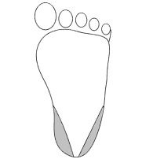

8A
{:.chapter-number}

# Skills workshop: Glucose control and hypoglycaemia

## Objectives

When you have completed this skills workshop you should be able to:

* Measure the glucose concentration of capillary blood with reagent strips.
* Measure the glucose concentration of capillary blood with a glucose meter.
* Insert an umbilical vein catheter.

## Measuring the glucose concentration in capillary blood with reagent strips

### 8-a The equipment that is needed

1. An alcohol swab or gauze swab soaked with surgical spirits
2. A sterile lancet
3. A container for ‘sharps’, i.e. for lancets
4. Reagent strips such as Haemo-Glukotest
5. Cotton wool swab to stop the bleeding
6. A clock or watch
7. Plastic squeeze bottle of water
8. Paper towel and cotton wool

### 8-b Description of reagent strips

An infant’s blood glucose concentration can be simply, cheaply and rapidly measured using a reagent strip. This consists of a plastic strip to which is attached a block of paper (the reagent area) containing the required chemical reagents. A commonly used reagent strip for newborn infants is Haemo-Glukotest. Reagent strips are packed, together with a desiccant, in a plastic container. The desiccant keeps the reagent strips dry while the container prevents damage to the reagent strips by bright light. The reagent strips should be stored at room temperature, not in a fridge. Keep away from direct sunlight. The cap must be replaced immediately after a reagent strip is removed. Once the bottle or container is opened, the reagent strips must not be used beyond the expiry date. Always replace the stopper of the container as soon as a strip is removed. 

Note
:	The reagent strip contains the enzymes glucose oxidase and peroxidase, together with a colour indicator. The glucose oxidase reacts specifically with glucose, releasing hydrogen peroxide. This in turn is broken down by the peroxidase, to oxidise the colour agent. The higher the concentration of glucose in the blood the greater is the colour change. The reagent strips, therefore, are specific for glucose.

### 8-c How to obtain a capillary blood sample

While capillary blood is usually used, a sample of venous or arterial blood is also suitable. 

<figure>
		
	<figcaption>Figure 8-A: The areas of the heel (shaded) that are usually used to obtain capillary blood</figcaption>
</figure>

Capillary blood is usually obtained from the infant’s heel:

1. Clean the skin over the side of the heel with an alcohol swab.
2. Allow the skin to dry and then pierce the skin with a lancet to obtain 1 large drop of blood. Usually the skin is pierced in the areas shown in Figure 8-A. Recent research has shown that piercing the skin over the middle and back of the heel with a lancet is safe and very unlikely to penetrate the periosteum of the bone and cause osteitis.
3. Put the lancet into a container for ‘sharps’.
4. Transfer the drop of blood onto the reagent strip and stop the bleeding by compressing the puncture site for a few minutes.

### 8-d Do not prick your finger by mistake

Be very careful not to prick your finger by mistake when obtaining a sample of capillary blood from an infant. Immediately after piercing the infant’s skin, the lancet must be placed in a special container for ‘sharps’. It is very important to dispose of the lancet before transferring the drop of blood onto the reagent strip. Most people prick themselves while removing the used equipment after the procedure. Therefore, never leave a lancet or needle lying exposed. Viruses such as hepatitis&nbsp;B and HIV can be transmitted as a result of a finger prick with a lancet or needle if the patient is infected.

> Place the lancet in a special container for ‘sharps’ immediately after piercing the skin.

### 8-e The types of reagent strips available

Most strips show a colour change which can be read by eye. They can also be read with a special device (a reflectance meter) which gives a more objective reading. Common examples of reagent strips are Haemo-Glukotest and Accu-Check Active.

### 8-f How to use a haemo-glukotest reagent strip

1. Place a large drop of blood onto the two reagent areas, which are found on the printed side of the plastic strip. Both reagent areas must be covered with blood.
2. Wait exactly 60 seconds then quickly wipe the blood off the reagent area with a piece of cotton wool. Do not touch the reagent area with your finger.
3. After a further 60 seconds compare the colour of the reagent areas by holding the strip against the colour chart on the container. A good light is essential.
4. The reagent area, closer to the end of the reagent strip that you hold, gives the more accurate measurement if the blood glucose concentration is in the normal or low range. The colour chart consists of 7 colour blocks ranging from yellow through grey-green to dark blue, which indicate blood glucose concentrations from 1 mmol/l (20 mg/dl) to 17 mmol/l (300 mg/dl) and above. The reagent area may match a colour block or fall between 2 adjacent colour blocks.

It is essential that the method described is strictly adhered to. Otherwise an incorrect reading may be obtained. For a more accurate measurement of the blood glucose concentration, a blood glucose meter (Reflolux) can be used to read the Haemo-Glukotest strips.

### 8-g Common errors with reagent strips

1. The reagent strips must be fresh. Age, temperature, humidity or light may cause the reagents to deteriorate. This may result in a falsely low reading. The reagent strips must also be discarded if the expiry date on the bottle has been reached.
2. The whole reagent area must be covered with blood to prevent difficulty reading the colour change. A large drop of blood is, therefore, needed.
3. The blood must be wiped off after exactly 60 seconds. Waiting less than 60 seconds will give a falsely low reading while waiting too long will give a falsely high reading. It is advisable to use a watch or clock with a second hand to measure the 60 seconds accurately.
4. Do not attempt to wipe or wash off or rub off any pieces of adherent, dry blood as excessive washing will give a falsely low reading.
5. A low packed cell volume (PCV) may give a falsely high reading while a high PCV may give a false low reading.
6. If possible, all readings below 2 mmol/l (40 mg/dl) should be confirmed with a blood glucose meter or by a laboratory measurement of the blood glucose concentration in venous or arterial blood.

## Measuring the glucose concentration in capillary blood with a glucose meter

### 8-h How to use a Reflolux blood glucose meter

A blood glucose meter (such as Reflolux) allows the reagent strip to be read more accurately than is possible with the eye. This is particularly important when the blood glucose concentration is below 2 mmol/l.

1. Press the ‘On/Off’ button of the Reflolux meter to switch the instrument on.
2. Obtain a drop of blood as described above.
3. Transfer the drop of blood onto the Haemo-Glukotest strip making sure that both blocks of paper are covered.
4. Immediately press the ‘Time’ button on the Reflolux meter.
5. After 60 seconds wipe the blood off the Haemo-Glukotest strip with a piece of cotton wool.
6. Insert the Haemo-Glukotest strip into the opening of the Reflolux meter with the blocks of paper facing the ‘On/Off’ button.
7. After 120 seconds the blood glucose concen­tration is displayed on the Reflolux meter.
8. Remove the Haemo-Glukotest strip after noting the reading.
9. Press the ‘On/Off’ button to switch the instrument off.

When a new container of Haemo-Glukotest strips is opened the Reflolux meter must be calibrated with the bar code enclosed in the container. Insert the code strip into the Reflolux meter and switch the instrument on. The code will be read and displayed on the panel. This will calibrate the meter.

Accu-Chek Active test strips can also be read by eye but are best used with an Accu-Chek Active, Accu-Chek Plus or Glucotrend monitor. The method of using the strips and the monitor are given in the package insert.

## Inserting an umbilical vein catheter

### 8-i Common indications for inserting an umbilical vein catheter

An umbilical vein catheter should be considered in any infant of less than 48 hours of age when an urgent intravenous line is needed and a peripheral vein infusion cannot be started. Usually a sterile, end-hole umbilical vein or artery catheter is used to catheterise the umbilical vein. If this is not available, a sterile nasogastric tube may be used.

The common indications for an umbilical vein catheter are:

1. Need for urgent correction of hypoglycaemia.
2. Need for urgent intravenous fluids at resuscitation.
3. Need for plasma volume expanders in a shocked infant.
4. Inability to start a peripheral infusion in a small or sick infant.
5. Exchange transfusion.

### 8-j The equipment needed

1. A sterile size F5 umbilical vein or artery catheter (or nasogastric tube).
2. A 5 ml syringe.
3. An ampoule of normal saline.
4. A sterile scalpel blade.
5. Surgical spirits.
6. Sterile swabs.
7. A sterile linen cord tie.
8. Narrow adhesive strapping.
9. An aerosol can of acrylic spray (plastic skin).
10. A container for ‘sharps’.

These items should be packed and ready in a surgical tray. Remember that inserting an umbilical vein catheter is a sterile procedure.

### 8-k How to insert an umbilical vein catheter

1. Put on a face mask.
2. Wash your hands and forearms well. Dry with a sterile paper towel and put on sterile gloves.
3. Open the sterile pack and fill the sterile syringe with normal saline. Attach the catheter to the syringe and fill the catheter with saline to displace any air.
4. The infant should be placed naked on its back in a warm environment. A good light is essential.
5. While the assistant lifts up the umbilical cord stump with an artery forcep, clean the cord and peri-umbilical skin well with surgical spirits.
6. Place a sterile towel around the umbilicus.
7. Loosely tie a sterile tape around the base of the umbilical cord. This is done so that the tape can be quickly tied if the cut umbilical vessels start to bleed.

	<figure>
			
		<figcaption>Figure 8-B: Loosely tie a tape around the base of the umbilical cord</figcaption>
	</figure>
	
8. Grasp the base of the cord between the thumb and index finger of one hand. Do not release the pressure on the base of the cord until the catheter has been inserted and the tape around the base of the cord has been firmly tied. This is very important to prevent bleeding from the cord vessels.

	<figure>
			
		<figcaption>Figure 8-C: Squeeze the base of the umbilical cord to prevent any possible bleeding from the umbilical vessels when they are cut.</figcaption>
	</figure>
	
9. While squeezing the base of the cord, ask the assistant to hold up the cord away from the infant’s abdominal wall. Now cut the cord off about 2 cm from the skin. Immediately after cutting the umbilical cord, the scalpel blade must be dropped into a special container for ‘sharps’.
10. On the cut end of the cord you will now see the one umbilical vein and two umbilical arteries. The umbilical vein is thin walled and situated towards the infant’s head (at 12 o’clock) while the umbilical arteries have thick walls and are situated towards the infant’s feet (at 4 and 8 o’clock).

	<figure>
			
		<figcaption>Figure 8-D: The cut surface of the umbilical cord has one thin-walled vein and two thick walled arteries.</figcaption>
	</figure>

11. Insert the tip of the saline-filled catheter into the umbilical vein. Only gentle pressure is needed to introduce the catheter. Feed about 10 cm of the catheter into the vein, when you should be able to aspirate blood.
12. Tighten the knot of the tape around the umbilical cord to prevent bleeding from the arteries. Only now should you release your grip on the base of the umbilical cord.

	<figure>
			
		<figcaption>Figure 8-E: The catheter has been inserted into the umbilical vein and the tape has been tied tightly around the base of the umbilical cord.</figcaption>
	</figure>

13. Spray the area of skin around the umbilicus with acrylic spray (plastic skin) and allow to dry.
14. Cut 2 lengths of strapping about 15 cm each. Fold them as shown in Figure 8.F and attach to the prepared skin on either side of the umbilical cord to form the ‘uprights’ of a ‘soccer goal post’.

	<figure>
			
		<figcaption>Figure 8-F: Two lengths of strapping are folded as illustrated.</figcaption>
	</figure>

	<figure>
			
		<figcaption>Figure 8-G: The pieces of strapping are stuck to the prepared skin on either side of the umbilical cord.</figcaption>
	</figure>
	
15. Use a piece of strapping to fix the catheter to the ‘uprights’ as shown.

	<figure>
			
		<figcaption>Figure 8-H: A piece of strapping is used to fix the catheter in place.</figcaption>
	</figure>
	
16. The catheter is now ready to be used and can be attached to a syringe, intravenous giving set or to a 3 way tap.

The method of inserting a catheter into the umbilical vein can be practised on the umbilical cord still attached to a placenta after delivery.

### 8-l Problems with umbilical vein catheters

1. Bleeding is the most serious complication. Bleeding can occur if the base of the cord is not tightly held during the procedure. Bleeding can also occur after the catheter is inserted if the tie is not tightly in place or if the catheter is dislodged from the vein.
2. If the procedure is not conducted in a sterile manner, infection can be introduced.
3. Air may be introduced via the vein if the syringe and catheter are not first filled with saline.
4. It may not be possible to insert the catheter if the cord is cut too long, if an attempt is made in error to catheterise one of the arteries or if the infant is more than a few days old and the vein has dried out.
5. Dextrose 50% and sodium bicarbonate 8% should never be given via the umbilical vein as they are very hypertonic and may cause liver damage.
6. Rarely portal vein thrombosis may complicate umbilical vein catheterisation.
7. The catheter may be inserted into an umbilical artery by mistake.

Do not insert an umbilical vein catheter if it is possible to put up a peripheral vein infusion (drip) as this is less dangerous.
