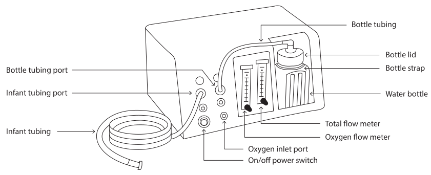

11A
{:.chapter-number}

# Skills: Oxygen therapy

## Contents
{:.non-printing}

*   [Objectives](#objectives)
*   [Using a flow meter with humidifier](#using-a-flow-meter-with-humidifier)
*   [Using a blender or venturi](#using-a-blender-or-venturi)
*   [Using an oxygen monitor](#using-an-oxygen-monitor)
*   [Using a pulse oximeter (oxygen saturation monitor)](#using-a-pulse-oximeter-oxygen-saturation-monitor)
*   [Providing nasal cannula oxygen](#providing-nasal-cannula-oxygen)
*   [Providing nasal CPAP](#providing-nasal-cpap)
{:.chapter-toc}

## Objectives

When you have completed this skills chapter you should be able to:

* Use a flow meter with humidifier.
* Use an air/oxygen blender.
* Use a venturi.
* Use an oxygen monitor.
* Use a pulse oximeter (saturation monitor).
* Provide cannula oxygen.
* Provide nasal prong CPAP.

## Using a flow meter with humidifier

### 11-a The flow meter

It is important to measure the flow rate of gas given to an infant with a flow meter. The flow meter is usually plugged into an oxygen/air blender. However, the flow meter can also be plugged directly into an oxygen wall plug or the reducing value of an oxygen cylinder.

The flow of gas is measured in litres per minute and can be adjusted by turning an adjusting wheel. A flow rate of 5 litres per minute is usually used into a head box. A high flow rate wastes gas and cools the infant while a low flow rate may allow carbon dioxide to accumulate in the head box.

### 11-b The humidifier

It is also important to use a humidifier together with the flow meter so that water vapour can be added to the dry gas (oxygen, medical air or a mixture). If a humidifier is not used the infant will breathe very dry gas which may damage the airways.

A simple humidifier (‘water bubbler’ at room temperature) is usually used to add water vapour to the dry gas if a head box or nasal cannulas are used. Sterile or boiled water (which has been allowed to cool) is added to the humidifier bottle until the water level reaches the full mark. When the water level approaches the empty mark more water must be added. The water must be changed and the humidifier must be cleaned every day or when the humidifier is to be used for another infant. Dangerous bacteria such as Pseudomonas can grow well in water and, therefore, the humidifier should only be filled with water when it is being used. The humidifier should be cleaned with detergent or soap and water, and be allowed to drip dry. The switch on the humidifier must be kept on ‘bubbles’ and not ‘jet’. The humidifier must be dry during storage.

Some humidifiers both warm and humidify the gas. These are expensive and are usually used with a blender. When infants are given nasal prong CPAP or are ventilated via an endotracheal tube (except during resuscitation), warmed, humidified gas must be used as the high flow rates can cool and dry out the mucosa.

## Using a blender or venturi

Except during an emergency resuscitation, 100% oxygen from a cylinder or piped source should not be used as pure oxygen is toxic to many tissues, especially the retina of the eye. Whenever possible oxygen should be mixed (blended) with medical air using a blender or with room air using a venturi.

### 11-c The components of an oxygen/air blender

1. The plastic gas pipes: The pipe for oxygen is usually white while the pipe for medical air is usually black. Each pipe ends in a steel connector that must be plugged into a wall gas fitting or a reduction valve on a gas cylinder. The shape of the 2 connectors differs to prevent the pipe being connected to the incorrect source. The oxygen connector is 6 sided while the medical air connector has 2 flat sides and 2 curved sides. The wall fitting for oxygen is white and the wall fitting for medical air is grey.
2. The blender unit: This, with the gas pipes, is usually attached to a supporting rail on the wall. The blender also has emergency escape valves which operate if the gas pressure gets too high. An alarm will sound if one of the pipes is not plugged in properly, or the pressure of oxygen or air is too low. The dial which controls the mixture of oxygen and air can be set at any combination from 21% oxygen (i.e. pure medical air) to 100% oxygen (pure oxygen).
3. The flow meter with humidifier (either room temperature or warmed).

### 11-d Using a venturi

If a blender is not available, a venturi can be used with a head box. A venturi is cheaper than a blender but not as accurate. The venturi is a short plastic tube to which a pipe supplying oxygen is attached. The oxygen passing through the venturi sucks in room air and, thereby, mixes the 2 gases. The venturi is usually attached to a head box (oxygen hood). Some venturis provide a fixed concentration of oxygen while others can be used to give the concentration required. The latter are preferred. When using a venturi attached to a head box, an oxygen flow rate of 5 litres must be used. If possible the percentage of oxygen in the head box should still be accurately measured with an oxygen monitor.

## Using an oxygen monitor

Whenever an infant is given oxygen into a head box the FiO₂ (fraction of inspired oxygen) must be measured with an oxygen monitor as too high or too low a concentration of oxygen may be dangerous for that infant if it results in too much or too little oxygen in the blood. The FiO₂ cannot be controlled accurately with a flow meter alone. If an oxygen monitor is not available then a blender or venturi should be used to determine the approximate FiO₂, provided a flow of 5 litres or more is used.

### 11-e The components of an oxygen monitor

1. **The monitoring unit**: This is usually attached to a rail or stands on a shelf. On the front of the unit is an on/off switch, a display of the FiO₂, high and low settings, a calibration knob and an alarm light. The monitor is powered by batteries that have to be replaced at intervals. Most models have a ‘low battery’ display to warn that the battery is getting flat.
2. **The oxygen sensor**: This is attached to the monitoring unit by a thin cable. The sensor is placed in the head box next to the infant’s head.

### 11-f Calibrating the oxygen monitor

Place the sensor in room air and switch on the monitor. The display should read 21%. If not, adjust the calibration knob until the display reads 21%. The monitor should always be calibrated before it is used. It should also be calibrated at least daily while in use.

### 11-g Using the oxygen monitor

First calibrate the monitor with room air. Then place the sensor into the head box. The display should now give the FiO₂ in the head box. Set the high and the low alarm limits to 5% above and 5% below the required FiO₂. If the display falls outside these limits, the red alarm light will come on and the alarm buzzer will sound. Silence the alarm by correcting the air/oxygen mixture to the required FiO₂. The display should be read and recorded on the observation chart at regular intervals while the infant is receiving extra oxygen. Remember that the monitor measures the FiO₂ but does not control the FiO₂. The FiO₂ cannot be changed by simply adjusting the oxygen monitor!

## Using a pulse oximeter (oxygen saturation monitor)

A pulse oximeter (also called an oxygen saturation monitor) measures the saturation (amount) of oxygen in the red cells of small arteries under the skin. The result is expressed as a percentage and the normal saturation of oxygen (SaO₂) in a newborn infant is 86–92%.

A SaO₂ above 92% is safe only if the infant is breathing room air.

A saturation below this range may be dangerous to the infant. The measurement is made by shining a bright light through the skin and then determining the colour of the transmitted light on the other side with a sensor. If the blood is red (well saturated) the SaO₂ reading will be normal or high. A low reading will be obtained if the blood is cyanosed. The monitor also measures the pulse rate by detecting the arterial pulsations in the small vessels in the skin.

### 11-h Components of a pulse oximeter

The monitor is attached to a skin sensor by a thin cable. The monitor is powered by electricity (via a power cable which plugs into a wall fitting) or battery and displays a pattern of the pulse wave together with the percentage saturation and pulse rate. A number of different designs of sensor are available. One type looks like a clothes peg and can be clipped onto the infant’s hand, foot or ear lobe. Another type can be strapped onto a hand or foot with tape, while an adult finger sensor can, with difficulty, be slipped over the infant’s foot. A regular pulse wave indicates that the skin sensor is correctly positioned. The pulse wave may be displayed as a moving line on a screen or a digital display of vertically arranged lights.

### 11-i Using a pulse oximeter

1. Attach the sensor to the infant’s hand, foot or ear and then switch on the monitor. It may take a short while before it displays the pulse wave on the screen.
2. A good, regular pulse wave should be displayed. If not, adjust the position of the sensor slightly or move the sensor to another part of the body.
3. Set the upper and lower limits for the SaO₂ and pulse rate. This is usually done by simply pressing the limit buttons. The SaO₂ limits are usually set at 86% and 92% while the pulse rate limits are usually set to 120–160 beats per minute.
4. You should now be able to read both the SaO₂ and the pulse rate on the display panel. If the pulse wave is poor or the SaO₂ or pulse rate is abnormal the alarm will sound. Press the alarm button to switch off the alarm and take the necessary action.

### 11-j Problems with a pulse oximeter

1. If the infant moves a lot it may not be poss­ible to obtain a good pulse wave reading and the monitor will alarm repeatedly.
2. If the infant’s perfusion is poor it is best to attach the sensor to the hand or ear rather than the foot.
3. If the infant is receiving phototherapy or is under a bright light, it is preferable to cover the sensor with a nappy or piece of cloth as the light may interfere with the function of the sensor.

The pulse oximeter should be used when the measurement of SaO₂ is needed on a sick infant. The sensor can be left attached for continuous monitoring or the sensor can be attached at regular intervals for a single reading. The monitor should not be used simply to obtain the pulse rate. If the pulse rate recorded by the monitor differs from the correct heart rate, then the monitor is not functioning properly and, as a result, the SaO₂ displayed may be incorrect. When moving the sensor from one infant to another, the sensor should first be wiped with an alcohol swab to prevent the spread of infection.

Note
:	A red and infrared light is used in a pulse oximeter to measure the colour of red cells. Well-oxygenated haemoglobin absorbs more infrared light while poorly oxygenated haemoglobin absorbs more red light. The bar graph indicates when the pulse of arterial blood enters the capillaries. The oximeter reading is taken at the height of the pulse and, therefore, reflects the oxygen saturation of arterial blood. A good pulse is needed to get an accurate reading.

## Providing nasal cannula oxygen

This is the best way of providing an infant with extra oxygen if CPAP or ventilation is not required.

### 11-k Setting up the equipment needed

1. Source of oxygen and medical air which is mixed in a blender. If a blender is not available, 100% oxygen can be used.
2. A flow meter. The flow rate is set between 0.5 and 1 litre per minute. Do not use high flow rates.
3. A humidifier (bubbler) at room temperature
4. Connecting tubing
5. A nasal cannula set. This consists of a loop of tubing with two short nasal cannulas at the centre of the loop. The nasal cannula set is plugged into the connecting tubing from the blender or oxygen source.
6. It is very useful to have a pulse oximeter to make sure that the correct percentage oxygen is being given.

### 11-l Attaching nasal cannulas

The nasal cannula set is slipped over the infant’s head so that both short cannulas sit comfortably in the nostrils. The two tubes are then gently pulled together at the back of the head. Usually the tubing is taped to the infant’s face on either side of the nose. This will keep the nasal cannulas in place and prevent them pulling out.

## Providing nasal CPAP

It is important not to attempt to provide nasal CPAP unless the medical and nursing staff have been trained in the correct method to apply this management. A number of commercial and localy made CPAP devices are available. The Pumani bubble CPAP device has been designed for under resourced countries and will be used as an example of how to provide nasal CPAP. The device is cheap, easy to use, very effective, portable and easy to repair. Pumani means “breathe easy” in Chichewa, the language of Malawi.

> 
> 
> Figure 11a-1: Pumani CPAP device
{:.figure}

### 11-m CPAP apparatus

The Pumani CPAP device consists of a number of parts:

* A high flow 220 volt electric air pump (uses a fish tank air pump!) with a power cable
* A pressure regulator consisting of a water bottle
* An oxygen inlet port where oxygen can be provided from piped wall oxygen, an oxygen cylinder or an oxygen concentrator.
* An oxygen flow meter which controls the flow of oxygen if needed
* A total flow meter which controls the flow of mixed (blended) gas from the device to the infant
* Tubing from the outflow port to the infant
* Nasal prongs (different sizes) with two elbow connectors and an end cap

### 11-n Setting up the CPAP apparatus

1. Plug the power lead into the electric mains and attach to the back of the device. An alarm will sound if the power fails.
2. Fill the water bottle with clean tap water to 6 cm, Attach the lid and strap the bottle into position
3. Attach the tubing from the bottle port to the water bottle
4. Attach the tubing from the oxygen source to the oxygen inlet port of the device
5. Attach the infant tubing to the outflow port of the device and connect the infant tubing to the nasal prongs tubing
6. The nasal prong tubing is made up of two elbow connectors, the nasal prongs themselves and the end cap
7. Open both the flow meter from the oxygen source and the oxygen flow meter on the device to 3 litres per minute if oxygen will be needed. Keep the flow meters closed if oxygen is not needed. If required a humidifier can be added to the oxygen source.
8. Open the total (blended) flow meter on the device at 6 litres per minute
9. Block the nasal prongs with your fingers and make sure the water bottle bubbles. Bubbling should stop when the prongs are left open. Turn up the total flow if there is no bubbling with the prongs blocked
10. The CPAP pressure depends on the amount of the water in the bottle and not on the flow rate.
11. Turn on on the power switch of the device. When the device is switched on a red light will shine.

> 
> 
> Figure 11a-2: Nasal prongs in place
{:.figure}

### 11-o Insert the nasal prongs and attach the tubing to the hat

1. Place the infant supine (back lying on the bed) under an overhead radiant heater or in a close incubator.
2. It is useful to place a small rolled-up nappy under the infant’s shoulders to get the head and neck in the correct position.
3. The infant should not be fed and an orogastric tube should be passed and kept on open drainage to prevent abdominal distension. An intravenous infusion is needed.
4. Choose the correct size cotton hat that fits snugly over the back of the infant’s head. The hat should have a good turn up brim to which the tubing can be attached. Stockinette can be used to make a hat with a wide brim.
5. Gently suction both nostrils to make sure they are clear and place 2 drops of saline into each nostril
6. Choose the correct size Hudson nasal prongs which fill the nostril but are not too tight. If the prongsd are too tight they can damage the infant’s nose while the pressure will be drop if the prongs are too small as this allows an air leak. Leave at least 0,25 cm between the prongs and the nose so that the prongs are not inserted too deeply
7. Assemble the prong tubing then insert the nasal prongs with the curved side down
8. Attach the tubing to either side of the hat using the special attachment clips or four nappy pins and elastic bands.
9. If safety pins are used, hold the tubing against the hat and insert a pin through the brim of the hat on either side of the tubing. Do not let the pins touch the infant’s skin and face them away from the face.
10. Wrap the elastic band over one pin, over the tubing and then over the other pin.
11. Check that the water bottle is bubbling. If not increase the total flow rate until bubbling starts.

Correct nasal prong size:

|----------------+-------------+-------------+-------------+-------------+
| Prong size     | 1           | 2           | 3           | 4           
|----------------+-------------+-------------+-------------+-------------+
| Infant weight  | 000-1249 g  | 1250-1999 g | 2000-3000 g | Over 3000 g 

### 11-p Adjusting the flow and pressure

At a total (blended) flow rate of 6 litres per minute the approximate FiO2 can be determined by altering the oxygen flow rate as follows:

|-----------------+-----+-----+-----+-----+-----+-----+-----+-----+
| Oxygen % needed | 21% | 30% | 40% | 50% | 60% | 70% | 80% | 90%
|-----------------+-----+-----+-----+-----+-----+-----+-----+-----+
| Total flow rate | 0   | 1.5 | 2.5 | 3.5 | 4   | 4.5 | 5   | 5.5 

If the total flow rate has to be increased the oxygen flow rate will also need to be increased to keep the FiO₂ the same. It is best to use a saturation monitor to decide what oxygen flow rate is needed.  A higher oxygen flow rate will give a higher FiO₂.

### 11-q Managing an infant on nasal CPAP

* Monitor the infant carefully with regular observations. This is very important as the nasal prongs can easily be dislodged. Routine suctioning is not needed.
* If possible the infant should be monitored with a pulse oximeter.
* Record the infant’s respiratory rate, heart rate, colour, presence or absence of recession or apnoea. Record the pulse oximeter reading if available.
* Check that the nasal prongs are in position and make sure that they are not too tight.
* Check the level in the water bottle and make sure it is bubbling.
* If the infant’s clinical signs of respiratory distress do not improve slowly increase the CPAP by adding water to the bottle.
* Increase the oxygen flow rate if the FiO₂ remains low
* The tubing, bottle and lid and prongs must be thoroughly cleaned before being used on another infant.

### 11-r Weaning an infant from nasal CPAP

* When the infant’s clinical condition improves, slowly reduce the oxygen flow rate to 1 litre per minute
* Then reduce the CPAP to 5 cm
* The infant should now be ready to be removed from CPAP, usually onto nasal prong oxygen