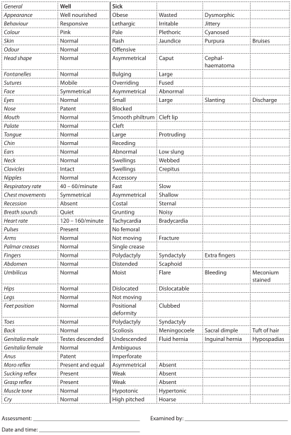

3A
{:.chapter-number}

# Skills workshop: Clinical history and examination

## Objectives

When you have completed this skills workshop you should be able to:

* Take a perinatal history.
* Perform a physical examination on a newborn infant.
* Complete an examination chart.
* Issue a preschool health card.

## Introduction

The complete examination of a newborn infant consists of:

1. The perinatal history
2. The physical examination
3. The assessment of the findings

## Taking a perinatal history

### 3-a The importance of a perinatal history

Before examining a newborn infant, it is important to first take a careful perinatal history. The history should be taken from the mother, together with the maternal and infant record. Discussion with the staff who have cared for the mother and infant is also important. The history will often identify clinical problems and suggest what clinical signs to look for during the examination. A general examination is not complete if a history is not taken.

### 3-b The sections of a perinatal history

1. **The maternal background:**
	* The mother’s age, gravidity and parity.
	* The number of infants that are alive and the number that are dead. The cause of death and age at death.
	* The birth weight of the previous infants.
	* Any problems with previous infants, e.g. neonatal jaundice, preterm delivery, congenital abnormalities.
	* The home and socioeconomic status.
	* Family history of congenital abnormalities.
2. **The present pregnancy:**
	* Gestational age based on menstrual dates, early obstetric examination and ultrasound examination.
	* Problems during the pregnancy, e.g.&nbsp;vaginal bleeding.
	* Illnesses during the pregnancy, e.g.&nbsp;rubella.
	* Smoking, alcohol or medicines taken.
	* VDRL (or RPR) and TPHA (or FTA) results. Treatment if syphilis diagnosed.
	* HIV status and CD4 count if HIV positive.
	* Antiretroviral prophylaxis or treatment.
	* Blood groups.
	* Assessment of fetal growth and condition.
3. **Labour and delivery:**
	* Spontaneous or induced onset of labour.
	* Duration of labour.
	* Method of delivery.
	* Signs of fetal distress.
	* Problems during labour and delivery.
	* Medicines given to the mother, e.g. pethidine, antiretroviral therapy.
4. **Infant at delivery:**
	* Apgar score and any resuscitation needed.
	* Any abnormalities detected.
	* Birth weight and head circumference.
	* Estimated gestational age.
	* Vitamin K given.
	* Placental weight.
5. **Infant since delivery:**
	* Time since delivery.
	* Feeds given.
	* Urine and meconium passed.
	* Any clinical problems, e.g.&nbsp;hypothermia, respiratory distress, hypoglycaemia.
	* Contact between infant and mother.

### 3-c Assessment of history

It is a valuable exercise to make an assessment of the potential and actual problems after taking the history and before examining the infant. This helps you to look for important clinical signs that may confirm or exclude problems suggested by the history.

## The physical examination of a newborn infant

### 3-d Requirements for the examination

1. Whenever possible the infant’s mother should be present. This gives her the chance to ask questions. She can also be reassured by the examination. The examiner should use the opportunity to teach the mother about caring for her infant.
2. A warm environment is essential to prevent the infant becoming cold. The room should be warm or a source of heat must be used, e.g. an overhead radiant heater. Prevent draughts of cold air by closing doors and windows. Do not place the infant on a cold table top. Use a towel or blanket if necessary.
3. A good light is important so that the examiner can see the infant well.
4. Wash your hands before examining the infant to prevent the spread of infection.
5. The infant should be completely undressed. A full examination is impossible with the infant partially dressed.

A basic general examination should be done on all infants. A more detailed general examination is needed in ill infants.

### 3-e The order of examination

The physical examination should always be performed in a fixed order so that nothing is forgotten. Usually the following steps are followed:

1. **Measurements:**
	* The infant’s *weight* and *head circumference* are measured and recorded.
	* An assessment of the infant’s *gestational age* should be made. If necessary, the weight and head circumference measurements can now be plotted against the gestational age on weight and head circumference for gestational age charts.
	* Often the infant’s skin or axillary *temperature* is measured at this stage of the examination.
2. **General inspection:**
	A general inspection is made of the infant, paying special attention to the infant’s appearance, nutritional state and skin colour.
3. **Regional examination:**
	The infant is examined in regions starting at the head and ending with the feet. The examination of the hips is usually left until last as this often makes the infant cry.
4. **Neurological status.**
5. **Examination of the hips.**
6. **Examination of the placenta (if available).**
7. **An assessment:**
	An assessment is made using all the information from the history and the physical examination.

The physical examination of the newborn infant is not easy and requires a lot of practice. The correct method of examination should be taught at the bedside by an experienced doctor or nurse. It is not possible to learn how to examine an infant simply by reading an explanation of the method of examination.

### 3-f Recording the findings of the physical examination

Usually a form is used to remind the nurse or doctor which clinical signs to look for and also to record the results of the physical examination. The important observations needed are listed together with the possible normal and abnormal results. The normal results are given on the left hand side of the form while the abnormal results are given on the right hand side. The normal and abnormal results are separated by a bold vertical line. A tick should be placed in the appropriate blocks to indicate which physical signs are present. At a glance any abnormality will be noticed on a completed examination form as it will be recorded to the right of the solid line.

### 3-g Assessment of the complete examination

When the history has been taken and the physical examination completed, an overall assessment of the infant must be made. The examiner must decide whether the infant is normal or abnormal. In addition, a list of the problems identified must be drawn up. The management of each problem can then be addressed in turn. A perinatal history and physical examination are of little value if an assessment is not made.

See Figure 3A-1, a form used to record the results of the physical examination. It can also be used as a guideline for a basic general examination.

> 
> 
> Figure 3A-1: Form for recording the results of a physical examination
{:.figure .large}

### 3-h Guidelines for a detailed examination

*Table 3-1: Guidelines for a detailed examination*
{:.table-caption}

<table>
  <thead>
    <tr>
      <th>Measurements</th>
      <th>Normal</th>
      <th>Abnormal</th>
    </tr>
  </thead>
  <tbody>
    <tr>
      <td>Birthweight</td>
      <td>2500 g to 4000 g. Between 10th and 90th centile for gestational age.</td>
      <td>Low birthweight (below 2500 g). Underweight (below 10th centile) or overweight (above 90th centile) for gestational age.</td>
    </tr>
    <tr>
      <td>Head circumference</td>
      <td>Between 10th and 90th centile for gestational age.</td>
      <td>Small head (below 10th centile) or large head (above 90th centile for gestational age).</td>
    </tr>
    <tr>
      <td>Gestational age</td>
      <td>Physical and neurological features of term infants (37–42 weeks).</td>
      <td>Immature features in preterm infant (below 37 weeks). Postterm infants (42 weeks and above) have long nails.</td>
    </tr>
    <tr>
      <td>Skin temperature</td>
      <td>Abdominal wall (36–36.5 °C) or axilla (36.5–37 °C).</td>
      <td>Hypothermia (below 36 °C).</td>
    </tr>
    <tr class="table-subhead">
      <td colspan="3"><strong>General inspection</strong></td>
    </tr>
    <tr>
      <td>Wellbeing</td>
      <td>Active, alert.</td>
      <td>Lethargic, appears ill.</td>
    </tr>
    <tr>
      <td>Appearance</td>
      <td>No abnormalities.</td>
      <td>Gross abnormalities. Abnormal face.</td>
    </tr>
    <tr>
      <td>Wasting</td>
      <td>Well nourished.</td>
      <td>Soft tissue wasting.</td>
    </tr>
    <tr>
      <td>Colour</td>
      <td>Pink tongue.</td>
      <td>Cyanosis, pallor, jaundice, plethora.</td>
    </tr>
    <tr>
      <td>Skin</td>
      <td>Smooth or mildly dry. Vernix and lanugo. Stork bite, mongolian spots, milia, erythema toxicum, salmon patches.</td>
      <td>Dry, marked peeling. Meconium staining. Petechiae, bruising. Large or many pigmented naevi. Capillary or cavernous haemangioma. Infection. Oedema.</td>
    </tr>
    <tr class="table-subhead">
      <td colspan="3"><strong>Regional examination</strong></td>
    </tr>
    <tr class="table-subhead">
      <td colspan="3"><em>Head</em></td>
    </tr>
    <tr>
      <td>Shape</td>
      <td>Caput, moulding.</td>
      <td>Cephalhaematoma, subaponeurotic bleed. Asymmetry, anencephaly, hydrocephaly, encephalocoele.</td>
    </tr>
    <tr>
      <td>Fontanelle</td>
      <td>Open, soft fontanelle with palpable sutures.</td>
      <td>Full or sunken anterior fontanelle. Large or closed fontanelles. Wide or fused sutures.</td>
    </tr>
    <tr class="table-subhead">
      <td colspan="3"><em>Eyes</em></td>
    </tr>
    <tr>
      <td>Position</td>
      <td> </td>
      <td>Wide or closely spaced.</td>
    </tr>
    <tr>
      <td>Size</td>
      <td> </td>
      <td>Small or abnormal eyes.</td>
    </tr>
    <tr>
      <td>Lids</td>
      <td>Mild oedema common after delivery.</td>
      <td>Marked oedema, ptosis, bruising.</td>
    </tr>
    <tr>
      <td>Conjunctivae</td>
      <td>May have small subconjunctival haemorrhages.</td>
      <td>Pale or plethoric. Conjunctivitis. Excessive tearing when nasolacrimal duct obstructed.</td>
    </tr>
    <tr>
      <td>Cornea, iris and lens</td>
      <td>Cornea clear, regular pupil, red reflex.</td>
      <td>Opaque cornea, irregular pupil, cataracts, no red reflex, squint, abnormal eye movements.</td>
    </tr>
    <tr class="table-subhead">
      <td colspan="3"><em>Nose </em></td>
    </tr>
    <tr>
      <td>Shape</td>
      <td>Small and upturned.</td>
      <td>Flattened in oligohydramnios.</td>
    </tr>
    <tr>
      <td>Nostrils</td>
      <td>Both patent. Easy passage of feeding catheter.</td>
      <td>Choanal atresia. Blocked with dry secretions.</td>
    </tr>
    <tr>
      <td>Discharge</td>
      <td> </td>
      <td>Mucoid, purulent or bloody secretions.</td>
    </tr>
    <tr class="table-subhead">
      <td colspan="3"><em>Mouth</em></td>
    </tr>
    <tr>
      <td>Lips</td>
      <td>Sucking blisters.</td>
      <td>Cleft lip. Long smooth upper lip in fetal alcohol syndrome.</td>
    </tr>
    <tr>
      <td>Palate</td>
      <td>Epstein's pearls.</td>
      <td>High arched or cleft palate.</td>
    </tr>
    <tr>
      <td>Tongue</td>
      <td>Pink.</td>
      <td>Cyanosed, pale, or large.</td>
    </tr>
    <tr>
      <td>Teeth</td>
      <td>None at birth.</td>
      <td>Extra or primary teeth.</td>
    </tr>
    <tr>
      <td>Gums</td>
      <td>Small cysts.</td>
      <td>Tumours.</td>
    </tr>
    <tr>
      <td>Mucous membranes</td>
      <td>Pink, shiny.</td>
      <td>Thrush, ulcers.</td>
    </tr>
    <tr>
      <td>Saliva</td>
      <td> </td>
      <td>Excessive if poor swallowing or oesophageal atresia.</td>
    </tr>
    <tr>
      <td>Jaw</td>
      <td>Smaller than in older child.</td>
      <td>Very small.</td>
    </tr>
    <tr class="table-subhead">
      <td colspan="3"><em>Ears</em></td>
    </tr>
    <tr>
      <td>Site</td>
      <td>Ears vertical.</td>
      <td>Low-set ears.</td>
    </tr>
    <tr>
      <td>Appearance</td>
      <td>Familial variation.</td>
      <td>Skin tag or sinus. Malformed ears. Hairy ears.</td>
    </tr>
    <tr class="table-subhead">
      <td colspan="3"><em>Neck</em></td>
    </tr>
    <tr>
      <td>Shape</td>
      <td>Usually short.</td>
      <td>Webbing, torticollis.</td>
    </tr>
    <tr>
      <td>Masses</td>
      <td>No palpable lymph nodes or thyroid.</td>
      <td>Cystic hygroma. Goitre. Sternomastoid tumour.</td>
    </tr>
    <tr>
      <td>Clavicle</td>
      <td> </td>
      <td>Swelling or fracture.</td>
    </tr>
    <tr class="table-subhead">
      <td colspan="3"><em>Breasts</em>  </td>
    </tr>
    <tr>
      <td>Appearance</td>
      <td>Breast bud at term 5 to 10 mm. Enlarged, lactating breasts.</td>
      <td>Extra or wide spaced nipples. Mastitis.</td>
    </tr>
    <tr class="table-subhead">
      <td colspan="3"><em>Heart</em>  </td>
    </tr>
    <tr>
      <td>Pulses</td>
      <td>Brachial and femoral pulses easily palpable. 120–160 beats per minute.</td>
      <td>Pulses weak, collapsing, absent, fast or slow or irregular.</td>
    </tr>
    <tr>
      <td>Capillary filling time</td>
      <td>Less than 4 seconds over chest and peripheries.</td>
      <td>Prolonged filling time if infant cold or shocked.</td>
    </tr>
    <tr>
      <td>Blood pressure</td>
      <td>Systolic 50 to 70 mm at term.</td>
      <td>Hypertensive or hypotensive.</td>
    </tr>
    <tr>
      <td>Precordium</td>
      <td>Mild pulsation felt over heart and epigastrium.</td>
      <td>Hyperactive precordium.</td>
    </tr>
    <tr>
      <td>Apex beat</td>
      <td>Heard maximally to left of sternum.</td>
      <td>Heard best in right chest in dextrocardia.</td>
    </tr>
    <tr>
      <td>Murmurs</td>
      <td>Soft, short systolic murmur common on day 1.</td>
      <td>Systolic or diastolic murmurs.</td>
    </tr>
    <tr>
      <td>Heart failure</td>
      <td> </td>
      <td>Oedema, hepatomegaly, tachypnoea or excessive weight gain.</td>
    </tr>
    <tr class="table-subhead">
      <td colspan="3"><em>Lungs</em>  </td>
    </tr>
    <tr>
      <td>Respiration rate</td>
      <td>40-60 breaths per minute. Irregular in REM sleep. Periodic breathing with no change in heart rate or colour.</td>
      <td>Tachypnoea above 60 breaths per minute. Gasping. Apnoea with drop in heart rate, pallor or cyanosis.</td>
    </tr>
    <tr>
      <td>Chest shape</td>
      <td>Symmetrical.</td>
      <td>Hyperinflated or small chest.</td>
    </tr>
    <tr>
      <td>Chest movement</td>
      <td>Symmetrical.</td>
      <td>Asymmetrical in pneumothorax and diaphragmatic hernia.</td>
    </tr>
    <tr>
      <td>Recession</td>
      <td>Mild recession in preterm infant.</td>
      <td>Severe recession in respiratory distress.</td>
    </tr>
    <tr>
      <td>Grunting</td>
      <td> </td>
      <td>Expiratory grunt in respiratory distress.</td>
    </tr>
    <tr>
      <td>Stridor</td>
      <td> </td>
      <td>Inspiratory stridor a sign of upper airway obstruction.</td>
    </tr>
    <tr>
      <td>Percussion</td>
      <td>Resonant bilaterally.</td>
      <td>Dull with effusion or haemothorax. Hyperresonant with pneumothorax.</td>
    </tr>
    <tr>
      <td>Air entry</td>
      <td>Equal air entry over both lungs. Bronchovesicular.</td>
      <td>Unequal or decreased.</td>
    </tr>
    <tr>
      <td>Adventitious sounds</td>
      <td>Transmitted sounds.</td>
      <td>Crackles, wheeze or rhonchi.</td>
    </tr>
    <tr class="table-subhead">
      <td colspan="3"><em>Abdomen</em></td>
    </tr>
    <tr>
      <td>Umbilicus</td>
      <td>2 arteries and 1 vein.</td>
      <td>1 artery, 1 vein. Infection. Bleeding or discharge. Hernia. Exomphalos.</td>
    </tr>
    <tr>
      <td>Skin</td>
      <td> </td>
      <td>Periumbilical redness or oedema.</td>
    </tr>
    <tr>
      <td>Shape</td>
      <td> </td>
      <td>Distended or hollow.</td>
    </tr>
    <tr>
      <td>Liver</td>
      <td>Palpable 1 cm below coastal margin, soft.</td>
      <td>Enlarged, firm, tender.</td>
    </tr>
    <tr>
      <td>Spleen</td>
      <td>Not easily felt.</td>
      <td>Enlarged, firm.</td>
    </tr>
    <tr>
      <td>Kidneys</td>
      <td>Often felt but normal size.</td>
      <td>Enlarged, firm.</td>
    </tr>
    <tr>
      <td>Masses</td>
      <td>No other masses palpable. Full bladder can be percussed.</td>
      <td>Palpable mass.</td>
    </tr>
    <tr>
      <td>Bowel sounds</td>
      <td>Heard immediately on auscultation.</td>
      <td>Few or absent.</td>
    </tr>
    <tr>
      <td>Anus</td>
      <td>Patent.</td>
      <td>Absent or covered.</td>
    </tr>
    <tr>
      <td>Stools</td>
      <td>Meconium passed within 48 hours of birth. Yellow stools by day 5. Breastfed stool may be green and mucoid.</td>
      <td>Blood in stool. White stools in obstructive jaundice. Offensive watery stools.</td>
    </tr>
    <tr class="table-subhead">
      <td colspan="3"><em>Spine</em></td>
    </tr>
    <tr>
      <td>Appearance</td>
      <td>Coccygeal dimple or sinus. Straight spine.</td>
      <td>Sacral dimple or sinus. Scoliosis. Meningomyelocoele.</td>
    </tr>
    <tr class="table-subhead">
      <td colspan="3"><em>Genitalia</em>  </td>
    </tr>
    <tr>
      <td>Penis</td>
      <td>Urethral dimple at centre of glans.</td>
      <td>Hypospadias.</td>
    </tr>
    <tr>
      <td>Testes</td>
      <td>Descended by 37 weeks.</td>
      <td>Undescended.</td>
    </tr>
    <tr>
      <td>Scrotum</td>
      <td>Well formed at term.</td>
      <td>Inguinal hernia. Fluid hernia.</td>
    </tr>
    <tr>
      <td>Vulva</td>
      <td>Skin tags, mucoid or bloody discharge.</td>
      <td>Fusion of labia.</td>
    </tr>
    <tr>
      <td>Clitoris</td>
      <td>Uncovered in preterm or wasted infants.</td>
      <td>Enlarged in adrenal hyperplasia.</td>
    </tr>
    <tr>
      <td>Urine</td>
      <td>Passed in first 12 hours.</td>
      <td>Poor stream suggests posterior urethral valve.</td>
    </tr>
    <tr class="table-subhead">
      <td colspan="3"><em>Arms</em>  </td>
    </tr>
    <tr>
      <td>Position</td>
      <td>Flexed position in term infant.</td>
      <td>Brachial palsy.</td>
    </tr>
    <tr class="table-subhead">
      <td colspan="3"><em>Hands</em>  </td>
    </tr>
    <tr>
      <td>Appearance</td>
      <td> </td>
      <td>Extra, fused or missing fingers. Skin tags. Single palmar crease. Hypoplastic nails.</td>
    </tr>
    <tr class="table-subhead">
      <td colspan="3"><em>Legs</em>  </td>
    </tr>
    <tr>
      <td>Appearance</td>
      <td>Mild bowing of lower legs common.</td>
      <td>Dislocatable knees in breach.</td>
    </tr>
    <tr class="table-subhead">
      <td colspan="3"><em>Feet</em>  </td>
    </tr>
    <tr>
      <td>Appearance</td>
      <td>Positional deformation.</td>
      <td>Clubbed feet. Abnormal toes.</td>
    </tr>
    <tr class="table-subhead">
      <td colspan="3"><em>Hips</em></td>
    </tr>
    <tr>
      <td>Movement</td>
      <td>Click common. Fully abducted.</td>
      <td>Dislocated or dislocatable. Limited abduction.</td>
    </tr>
    <tr class="table-subhead">
      <td colspan="3"><strong>Neurological status</strong></td>
    </tr>
    <tr>
      <td>Behaviour</td>
      <td>Alert, responsive.</td>
      <td>Drowsy, irritable.</td>
    </tr>
    <tr>
      <td>Position</td>
      <td>Flexion of all limbs at term.</td>
      <td>Extended limbs or frog position in preterm and ill infants.</td>
    </tr>
    <tr>
      <td>Movement</td>
      <td>Active. Moves all limbs equally when awake. Stretches, yawns and twists.</td>
      <td>Absent, decreased or asymmetrical movement. Jittery or convulsions.</td>
    </tr>
    <tr>
      <td>Tone</td>
      <td> </td>
      <td>Decreased or increased.</td>
    </tr>
    <tr>
      <td>Hands</td>
      <td>Intermittently clenched.</td>
      <td>Permanently clenched.</td>
    </tr>
    <tr>
      <td>Cry</td>
      <td>Good cry when awake.</td>
      <td>Weak, high pitch or hoarse cry.</td>
    </tr>
    <tr>
      <td>Vision</td>
      <td>Follows a face, bright light or red object.</td>
      <td>Absent or poor following.</td>
    </tr>
    <tr>
      <td>Hearing</td>
      <td>Responds to loud noise.</td>
      <td>No response.</td>
    </tr>
    <tr>
      <td>Sucking</td>
      <td>Good suck and rooting reflexes after 36 weeks gestation.</td>
      <td>Weak suck at term.</td>
    </tr>
    <tr>
      <td>Moro reflex</td>
      <td>Full extension then flexion of arms and hands. Symmetrical.</td>
      <td>Absent, incomplete or asymmetrical response.</td>
    </tr>
	<tr class="table-subhead">
      <td colspan="3"><strong>Hips</strong></td>
    </tr>
	<tr>
      <td>Movement</td>
      <td>Click common. Fully abducted.</td>
      <td>Dislocated or dislocatable. Limited abduction.</td>
    </tr>
  </tbody>
</table>

Note
:	The Moro reflex was described by Ernst Moro in 1918. He was professor of paediatrics in Heidelberg, Germany.

### 3-i Examination of the hips

The hips must be examined in all newborn infants to exclude congenital dislocation or an unstable hip.

The infant is examined lying supine (back on the bed) with the hips flexed to a right angle and knees flexed.

**Barlows test** demonstrates both a dislocated and a dislocatable (unstable) hip: One hand immobilises the pelvis (thumb over pubic ramus, fingers over sacrum) while the other hand moves the opposite thigh into mid-abduction. If the hip is dislocatable, backward pressure on the inner side of the thigh with the thumb causes the femoral head to slip backwards out of the acetabulum. Conversely forward pressure on the outer side of the thigh with the fingers would tend to cause the head to spring forwards, back into the acetabulum. The same procedure is then carried out for the opposite side.

**Ortolani test** for a dislocated hip: Both thighs are held so that the examiner’s fingers are over the outer side of each thigh (greater trochanter) and his thumbs rest on the inner side of each thigh (lesser trochanter). Both thighs are then abducted. If a hip is dislocated, a ‘clunk’ can be felt and heard as the femoral head slips forward into its normal position in the acetabulum.

### 3-j Examination of the placenta

Every placenta should be carefully examined after birth as this can provide valuable information about the infant. Usually the gross placental weight is measured and recorded (placenta, membranes and umbilical cord). As gestation progresses the weight of the placenta increases. An infant of 3000 g usually has a placenta weighing about 600 g (between 450 and 750 g). Therefore, at term the gross placental weight is about a fifth that of the fetus. Infants who are underweight for gestational age have both an absolutely and relatively small placenta. In contrast, infants of poorly controlled diabetics, and infants who have suffered a chronic intrauterine infection (e.g. syphilis) or fetal hydrops have placentas that weigh more than expected.

There are three layers to the placental membranes. The amnion on the inside (prevents the fetus sticking to the membranes), the chorion in the middle (to provide strength), and the decidua on the outside. The amnion is usually smooth and shiny. If the healthy amnion is peeled away from the rest of the membranes, it is completely clear and transparent. A cloudy or opaque amnion suggests infection (chorioamnionitis) while a granular surface (amnion nodosum) suggests too little amniotic fluid (oligohydramnios). The membranes should not smell offensive.

The umbilical cord normally has one large vein and two thick walled arteries. The more the pull (e.g. when a cord is relatively short due to it being wrapped around the fetal neck) the longer the cord will grow. A short cord suggests very poor fetal movement. The cord becomes stained green once the amniontic fluid has been contaminated with meconium for a few hours. A single umbilical artery is associated with congenital malformations. The umbilical vein has one-way valves (‘false’ knots). A true knot may kill the fetus.

The shape of the placenta is not important. Most are oval. Usually the umbilical cord is inserted into the centre of the placenta with arteries and veins radiating out in all directions over the chorionic plate. A peripheral insertion is of no clinical importance. However, insertion into the membranes in a low-lying placenta can result is severe haemorrhage from a fetal vessel when the membranes rupture (*vasa praevia*). Arteries always cross over veins. Fetal vessels torn off at the placental edge indicate that an extra piece of placenta has been retained (accessory lobe). Pale patches on the fetal surface are due to fibrin deposits and are not clinically important.

The maternal surface of the placenta is dark maroon in preterm infants but becomes grey towards term. A pale placenta suggests anaemia. Calcification is not important and reflects a good maternal calcium intake. The maternal surface is divided into lobes (cotyledons). Make sure that the placenta is complete as a retained lobe can result in postpartum haemorrhage or infection. Firmly attached blood clot, especially if it lies over an area of compressed placenta, suggest placental abruption. Fresh infarcts are best identified on palpation as they form a hard lump. Old infarcts are yellow or grey and easily seen, especially if the placenta is sliced. It is of no help to simple describe a placenta as ‘unhealthy’.

It is particularly important to examine the placentas of twins. Unlike-sexed (boy and girl) twins are always non-identical (dizygous). Liked-sex twins are definitely identical (monozygous) if they share a single placenta (monochorionic twins). *Monochorionic* placentas always have fetal blood vessels on the chorioninic place which run from one umbilical cord to the other. Monochorionic placentas have one chorion and usually two amniotic sacs. Two placentas fused together (*dichorionic* placentas) may be mistaken for a single placenta. However, there are never fetal blood vessels linking the two umbilical cords. Dichorionic placentas can be seen in both identical and non-identical twins. The separating membranes of dichorionic twins always include both amnion and chorion.

Pathological examination with histology should be requested if an abnormality of the placenta is identified. Placental ischaemia, chronic intrauterine infection and chorioamnionitis are easily identified on histology.

## The road-to-health card

Use of the road-to-health card (preschool health card) is advocated by the World Health Organisation as one of the main methods of improving child health, especially in a developing country. The card is widely used throughout southern Africa.

After delivery each newborn infant is issued with a road-to-health card which forms the primary health-care record until the infant starts school by the age of 6 years. The infant’s mother keeps the card in a plastic cover and should present the card whenever the infant is taken to a clinic or hospital. The infant’s perinatal history, growth, immunisations and childhood illnesses are recorded on the card. Usually the infant’s HIV status and management are also recorded on the card.

### 3-k Completing the road-to-health card after delivery

After delivery the clinic or hospital staff must enter the perinatal details onto the road-to-health card. The details which are usually entered onto the card are:

1. Maternal information:
	* The mother’s name
	* The mother’s hospital number
	* The mother’s home address
2. Pregnancy and delivery information:
	* The duration of pregnancy
	* The result of the VDRL or other creening test for syphilis and HIV
	* The maternal blood group
	* Any pregnancy complications
	* The method of delivery
	* The date and place of birth
3. Neonatal data:
	* The Apgar scores
	* The birth weight (mass), head circumference (and sometimes length)
	* The name and sex of the infant
	* The date, infant weight and method of feeding at discharge

Details of the information recorded on the preschool health card vary slightly from one region to another. Sometimes additional information is also recorded after delivery.

> 
> 
> Figure 3A-2: The front and back of a road-to-health card
{:.figure .large}
