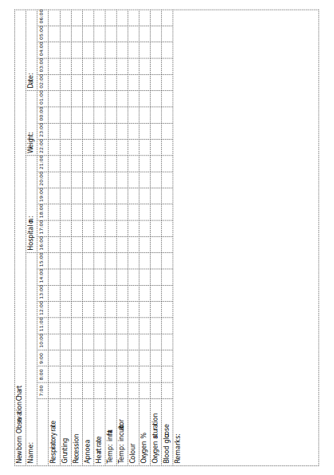
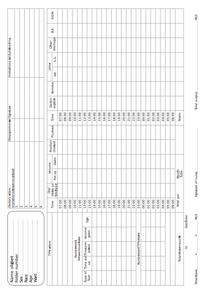

5A
{:.chapter-number}

# Skills workshop: Clinical notes and observations

## Objectives

* When you have completed this skills workshop you should be able to:
* Write good clinical notes.
* Record routine observations.

## Writing good clinical notes

Good clinical notes, which form the patient record, should be accurate, brief and easy to read. In addition, they must be systematic. Therefore, they should be written in an orderly, logical way so that all staff members can understand them.

### 5-a The date and time

Whenever notes are written it is important to give the date and the time that the record is made. It is then possible to know when the observation was made or care was given.

### 5-b Always sign your notes

Every time you write clinical notes you should sign (and write) your name. The rest of the health team then knows who wrote the notes.

### 5-c The ‘soap’ method of writing notes

When an infant is examined for the first time the clinical notes should include:

1. The **story** (i.e. the history)
2. The **observations** (i.e. the physical examination and investigations)
3. The **assessment**
4. The **plan**

In order to remember these important steps in writing clinical notes, remember the word ‘SOAP’. The letters in SOAP stand for Story–Observations–Assessment–Plan.

### 5-d The story

Good notes should always start with the history (i.e. the history of the pregnancy, labour, delivery and events after delivery). A history should always be taken before examining an infant.

### 5-e The observations

The observations include the findings of the physical examination and the results of any additional investigations done, e.g. packed cell volume or chest X-ray.

### 5-f The assessment

Once you have recorded the results of the history, the physical examination and the investigations, you must make an assessment of the infant’s condition. For example, you should ask yourself:

1. Is the infant sick or well?
2. Is the infant at high risk or low risk for clinical problems?
3. What clinical problems does the infant have at present?

The assessment must not be forgotten as a carefully recorded history and examination are of little value if you are unable to assess what the results mean. The management depends on an accurate assessment of the infant’s problems. If you cannot identify the problems you will not be able to plan the correct treatment. Assessing an infant’s problems correctly takes a lot of practice.

### 5-g The problem list

When the assessment is made, it is very helpful to compile a problem list. Each clinical problem that you identify from the story and observations must be listed separately. A typical problem list looks like this:

1. Unmarried, teenage mother.
2. Preterm delivery.
3. Jaundice.

You now have a good idea of the clinical problems that require management.

Read the following case history and draw up your own problem list:

*"After a normal vaginal delivery at 40 weeks, an infant has Apgar scores of 3 and 8 and requires mask ventilation. The birth weight is 2300&nbsp;g. The infant is not put to the breast after delivery and at 45&nbsp;minutes after birth the blood glucose concentration, measured with a reagent strip, is 1.5 mmol/l. While starting an intravenous infusion, the infant’s skin temperature falls to 34.5 °C."*

You should be able to identify at least 4 problems. Each will have to be managed.

### 5-h The management

Finally the management of the infant must be planned. The management consists of the nursing care, the observations needed, the medical treatment, and the management of the parents.

### 5-i An example of good ‘soap’ notes

	14-1-2008 10:30

	S:

	18 year old primip. Booked. Spontaneous preterm labour. 35 weeks by dates and palpation. No signs of fetal distress. 

	NVD 06:15. Apgar scores 4 and 9. Intubation and ventilation needed for 3 minutes. Thereafter infant moved to nursery.

	O:

	Male infant. Weight 2000 g.

	Assessed gestational age 36 weeks.

	Active. No congenital abnormalities.

	Skin temperature 36°C.

	RS – Respiratory distress with recession and a respiratory rate of 65 breaths per minute. Infant needs 50% head box oxygen to remain pink.

	CVS – Heart rate 150/min. Well perfused.

	GIT – Abdomen normal.

	CNS – Appears normal. Fontanelle flat.

	Blood glucose 3.0 mmol/l. PCV 60%.

	A:

	1. Preterm delivery.

	2. Neonatal asphyxia.

	3. Respiratory distress.

	P:

	1. Incubator.

	2. Neonatalyte IVI at 4 dpm.

	3. Nasogastric tube. Nil per mouth.

	4. Routine observations.

	5. Head box oxygen.

	6. Speak to parents.

	7. Arrange transfer to level 2 hospital.

	Signed: Sr. Mowtana

These brief notes give all the important information in a simple and systematic manner. Try to write your notes using the SOAP method.

### 5-j An example of poor notes

	No antenatal care. Antepartum haemorrhage.

	Normal delivery. 2000 g. Female, term infant.

	Good Apgar scores. Vitamin K given.

	Temp. 36 °C. Infant looks pale. Blood glucose normal.

	No respiratory distress. Heart rate 200/min.

	Abdomen normal. Sucks poorly.

	Keep nil per mouth. Neonatalyte infusion started at 5 dpm.

	Hb. 10 g/dl. Blood taken for cross match.

	Nurse in incubator.

Although most of the information is given, these notes are not systematic and, therefore, they are difficult to understand. Notice how the history, examination and investigations are mixed up in a disorganised way. There is no problem list so that the reader is not sure what problems have been identified. There is also no date or signature. Try to rewrite these notes using the SOAP method. Do not forget to draw up a problem list.

### 5-k Problem-orientated patient record

When writing follow-up notes, the SOAP system can be applied to each problem in turn. This method is known as the problem-orientated patient record. It is very useful in a nursery where infants may need ongoing care for days or weeks. Each day the problem list of the previous day is examined. You must decide which problems remain unresolved and, therefore, must be carried over to the next day. Resolved problems can be dropped from the list. After reviewing the record for the past 24 hours and examining the infant, any new problems are added to the previous list.

For example, on day 2, the infant described in 5-i is doing well. The respiratory distress has improved slightly but the infant has developed a mild conjunctivitis. The problem list for day 2 should, therefore, be:

1. Preterm infant.
2. Respiratory distress.
3. Conjunctivitis.

The problem of neonatal asphyxia has been removed from the problem list, as it has resolved and no longer has any effect on the infant, while the new problem of conjunctivitis has been added to the list.

Again the SOAP system can be used, but now it is applied to each problem in the problem list. For example:

	15/1/08 09:00

	1. Preterm infant.

	S:

	No problems during the night. Passed meconium. No apnoea.

	O:

	Active. Abdomen normal. Not pale. Blood glucose and temperature normal.

	A:

	No change.

	P:

	1. Keep in incubator.
	2. Start 2 x 12 feeds of expressed breast milk.
	3. Continue Neonatalyte at 4 dpm.

	2. Respiratory distress.

	S:

	Oxygen requirements came down slightly during the night. 

	O:

	Mild recession. Respiratory rate 55/min. Chest clear with good air entry. Pink with normal oxygen saturation in 40% head box oxygen. Blood gases normal.

	A:

	Improving. Diagnosis probably hyaline membrane disease.

	P:

	1. Continue head box oxygen.
	2. Repeat blood gas analysis at lunch time.

	3. Conjunctivitis.

	S:

	Eyes became sticky during the night. Swabbed with saline.

	O:

	Mild purulent discharge from both eyes. Eyelids not swollen.

	A:

	Probably Gonococcal conjunctivitis.

	P:

	1. Pus swab for laboratory.
	2. Clean eyes every 2 hours.
	3. Chloromycetin eye drops 2 hourly.
	4. Ceftriaxone 100 mg IMI.

	Signed: Dr A. Smith

This example shows how simple, short, problem-orientated notes can give a very clear record of the patient’s progress. This is far better than pages and pages of jumbled notes. Each day, after the infant has been carefully examined and the observations chart read, the problem list should be drawn up and the SOAP method used to write notes under each problem.

### 5-l A common patient record

It is far more efficient if both the medical and nursing staff use the same patient notes. In all clinics and hospitals the records should be shared. All members of the health team should learn how to keep systematic patient records.

### 5-m Abbreviations

To save time and space, abbreviations are often used in the patient record. A list of the commonly used abbreviations in your nursery should be drawn up and displayed in the nursery. Below is a list of some of the commonly used abbreviations in the notes of newborn infants:

|------|-----------------------------------------------------------|
| AFIS | Amniotic fluid infection syndrome, i.e. chorioamnionitis  |
| AGA  | Appropriate weight for gestational age                    |
| CNS  | Central nervous system                                    |
| CPAP | Continuous positive airways pressure                      |
| CVS  | Cardiovascular system                                     |
| EBM  | Expressed breast milk                                     |
| FAS  | Fetal alcohol syndrome                                    |
| GIT  | Gastro-intestinal tract                                   |
| Hb   | Haemoglobin                                               |
| HC   | Head circumference                                        |
| HMD  | Hyaline membrane disease                                  |
| IDM  | Infant of a diabetic mother                               |
| IMI  | Intramuscular injection                                   |
| IV   | Intravenous                                               |
| LBW  | Low birth weight                                          |
| NEC  | Necrotising enterocolitis                                 |
| PCV  | Packed cell volume                                        |
| PDA  | Patent ductus arteriosus                                  |
| RDS  | Respiratory distress syndrome                             |
| RS   | Respiratory system                                        |
| TSB  | Total serum bilirubin                                     |
| UGA  | Underweight for gestational age                           |

## Recording routine observations

### 5-n The observation chart

Routine observations made on sick infants by nurses or doctors must be recorded on a special chart. The usual observations are:

1. Heart (pulse) rate.
2. Respiratory rate.
3. Skin or axillary temperature.
4. Incubator temperature (if the infant is in an incubator).
5. Percentage oxygen given (FiO₂).
6. Pattern of respiration (recession, grunting, shallow or irregular).
7. Colour.
8. Apnoea.
9. Blood glucose concentration.

### 5-o Using an observation chart

The names of the different observations are listed along the top of the chart at the head of separate columns. Each time an observation is made, the date and time must be recorded as well as the observer’s name. The result of the observation is then recorded in the correct column. A column is also available for comments to be written. It is very important that the person recording the observation knows whether the result is normal or abnormal. Some people prefer to write abnormal results in red. The record on the observation chart is started when observations on a sick infant begin. Usually a new page is started each day, most commonly in the morning when the day staff take over duty from the night staff.

Different observation charts are used in different hospitals. However, they all use the same principle for recording clinical observations.

See Figure 5-A, an example of a chart used for the routine observations of sick infants.

<figure>
		
	<figcaption>Figure 5-A, an example of a chart used for the routine observations of sick infants</figcaption>
</figure>

## Recording fluid intake and output

The total amount of fluid given to a sick infant (the intake) and lost by a sick infant (the output) should be carefully recorded on an intake and output chart so that the fluid balance can be calculated each day.

### 5-p Recording fluid intake

The fluid may be given by mouth, nasogastric or orogastric tube, or by intravenous infusion. The type, volume and time of each oral or tube feed must be noted on the chart by the nurse who has given the feed. The type of intravenous fluid given, together with the time it was started, the time it was completed and the volume received, must also be carefully recorded.

The daily volume of each type of fluid intake is recorded separately and then added together to give the total intake for the 24 hour period.

It is essential that clear instructions are given each day for both milk and intravenous fluids. The type of oral or tube feed to be given, together with the volume and frequency of feeds, must be clearly written on the intake chart. In addition, the type of intravenous fluid and the drip rate must also be stated.

### 5-q Recording fluid output

Fluid may be lost in the urine, stool, vomitus or may be aspiration from a nasogastric or orogastric tube. Less commonly, fluid may be lost via a drain from the chest or other site. Some forms of fluid loss, such as in the stools and from the lungs and skin, cannot be measured easily and therefore are not routinely recorded. If necessary, they can be measured or calculated. Even very small volumes of fluid loss may be important in a small infant.

Urine has to be collected in a urine bag, aspirated via a catheter and measured with a plastic syringe if an accurate record of urine output is to be kept. This is often difficult, especially in a female infant, as the urine tends to leak out of the bag. In addition, removing a urine bag may damage the infant’s skin. Disposable nappies can be weighed dry and wet with urine to calculate output. This is usually done in a level 3 nursery. Therefore, an accurate record of the volume of urine passed is only kept when there is a clinical indication, e.g. possible dehydration or renal failure. Most infants pass about 2&nbsp;ml/kg/hour. Oliguria in a newborn infant is defined as a urine output of less than 1&nbsp;ml/kg/hour.

In many small infants, only a record of the frequency of wet nappies is kept. Most infants have about 8–10 wet nappies a day.

The number of vomits, and whether they are large or small, must be carefully recorded. If the stomach is aspirated before feeds, an accurate record of the volume of fluid aspirated should also be kept.

The number and appearance of stools passed is recorded. Loose stools may contain a lot of fluid and, therefore, must be recorded carefully.

Each type of fluid loss is recorded separately and then added up at the end of the 24 hour period to give the total measured output. The difference between the intake and the output over 24 hours is called the daily fluid balance.

See Figure 5-B, an example of an intake and output chart.

<figure>
		
	<figcaption>Figure 5-B: An example of an intake and output chart</figcaption>
</figure>
