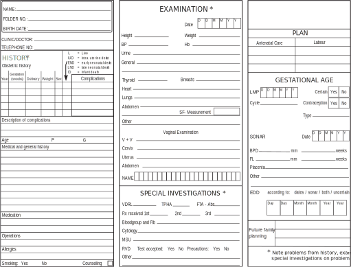
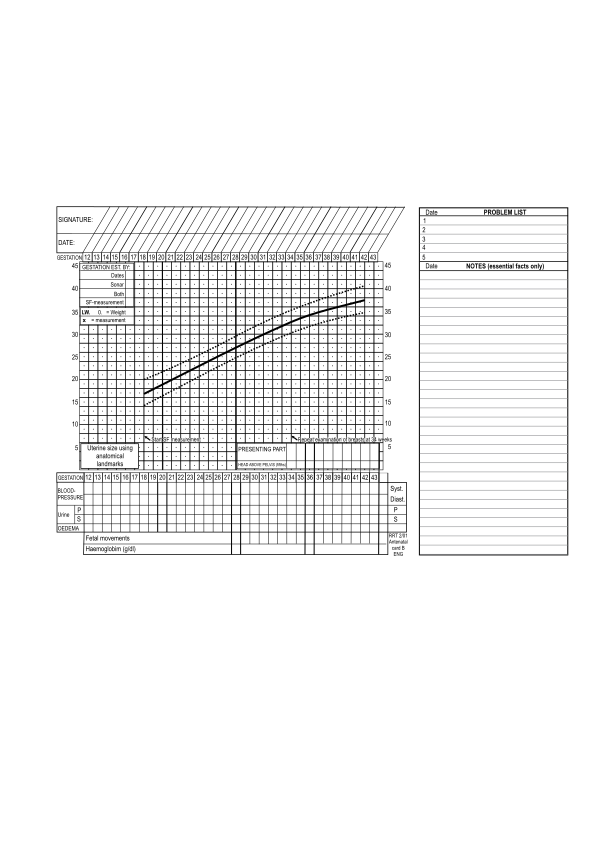
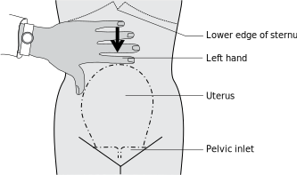
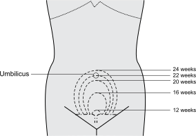
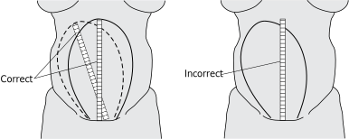
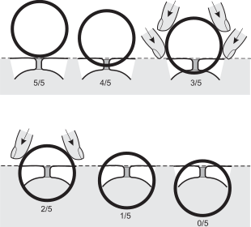

1
{:.chapter-number}

# Antenatal care

Before you begin this unit, please take the corresponding test to assess your knowledge of the subject matter. You should redo the test after you’ve worked through the unit, to evaluate what you have learned.

## Objectives

When you have completed this unit you should be able to:

*	List the goals of good antenatal care.
*	Diagnose pregnancy.
*	Know what history should be taken and examination done at the first visit.
*	Determine the duration of pregnancy.
*	List and assess the results of the side room and screening tests needed at the first visit.
*	Identify low, intermediate and high-risk pregnancies.
*	Plan and provide antenatal care that is problem oriented.
*	List what specific complications to look for at 28, 34 and 41 weeks.
*	Provide health information during antenatal visits.
*	Manage women with HIV infection.

## Goals of good antenatal care

### 1-1 What are the aims and principles of good antenatal care?

The aims of good antenatal care are to ensure that pregnancy causes no harm to the mother and to keep the fetus healthy during the antenatal period. In addition, the opportunity must be taken to provide health education. These aims can usually be achieved by the following:

1.	Antenatal care must follow a definite plan.
2.	Antenatal care must be problem oriented.
3.	Possible complications and risk factors that may occur at a particular gestational age must be looked for at these visits.
4.	The fetal condition must be repeatedly assessed.
5.	Health care education must be provided.

All information relating to the pregnancy must be entered on a patient-held antenatal card. The antenatal card can also serve as a referral letter if a patient is referred to the next level of care and therefore serves as a link between the different levels of care as well as the antenatal clinic and labour ward.

> The antenatal card is an important source of information during the antenatal period and labour.

## Diagnosing pregnancy

### 1-2 How can you confirm that a patient is pregnant?

The common symptoms of pregnancy are amenorrhoea (no menstruation), nausea, breast tenderness and urinary frequency. If the history suggests that a patient is pregnant, the diagnosis is easily confirmed by testing the urine with a standard pregnancy test. The test becomes positive by the time the first menstrual period is missed.

A positive pregnancy test is produced by both an intra-uterine and an extra-uterine pregnancy. Therefore, it is important to establish whether the pregnancy is intra-uterine or not.

> Confirm that the patient is pregnant before beginning antenatal care.

### 1-3 How do you diagnose an intra-uterine pregnancy?

The characteristics of an intra-uterine pregnancy are:

1.	The size of the uterus is appropriate for the duration of pregnancy.
2.	There is no lower abdominal pain or vaginal bleeding.
3.	There is no tenderness of the lower abdomen.

### 1-4 How do you diagnose an extra-uterine pregnancy?

The characteristics of an extra-uterine (ectopic) pregnancy are:

1.	The uterus is smaller than expected for the duration of pregnancy.
2.	Lower abdominal pain and vaginal bleeding are usually present.
3.	Tenderness over the lower abdomen is usually present.

## The first antenatal visit

This visit is usually the patient’s first contact with the medical services during her pregnancy. She must be treated with kindness and understanding in order to gain her confidence and to ensure her future co-operation and regular attendance. This opportunity must be taken to book the patient for antenatal care and, thereby, ensure the early detection and management of treatable complications.

### 1-5 At what gestational age should a patient first attend an antenatal clinic?

As early as possible, preferably when the second menstrual period has been missed, i.e. at a gestational age (duration of pregnancy) of 8 weeks. Note that for practical reasons the gestational age is measured from the first day of the last normal menstrual period. Antenatal care should start at the time that the pregnancy is confirmed.

> It is important that all pregnant women book as early as possible.

### 1-6 What are the aims of the first antenatal visit?

1.	A full history must be taken.
2.	A full physical examination must be done.
3.	The duration of pregnancy must be established.
4.	Important screening tests must be done.
5.	Some high-risk patients can be identified.

### 1-7 What history should be taken?

A full history, containing the following:

1.	The previous obstetric history.
2.	The present obstetric history.
3.	A medical history.
4.	HIV status.
5.	History of medication and allergies.
6.	A surgical history.
7.	A family history.
8.	The social circumstances of the patient.

### 1-8 What is important in the previous obstetric history?

1.	Establish the number of pregnancies (gravidity), the number of previous pregnancies reaching viability (parity) and the number of miscarriages and ectopic pregnancies that the patient may have had. This information may reveal the following important factors:

	*	Grande multiparity (i.e. 5 or more pregnancies which have reached viability).
	*	Miscarriages: 3 or more successive first trimester miscarriages suggest a possible genetic abnormality in the father or mother. A previous midtrimester miscarriage suggests a possible incompetent internal cervical os.
	*	Ectopic pregnancy: ensure that the present pregnancy is intra-uterine.
	*	Multiple pregnancy: non-identical twins tend to recur.

2.	The birth weight, gestational age and method of delivery of each previous infant as well as of previous perinatal deaths are important:
	*	Previous low birth weight infants or spontaneous preterm labours tend to recur.
	*	Previous large infants (4 &nbsp;kg or more) suggest maternal diabetes.
	*	The type of previous delivery is also important: a forceps delivery or vacuum extraction may suggest that a degree of cephalopelvic disproportion had been present. If the patient had a previous caesarean section, the indication for the caesarean section must be determined.
	*	The type of incision in the uterus is also important (this information must be obtained from the patient’s folder) as only patients with a transverse lower segment incision should be considered for a possible vaginal delivery.
	*	Having had one or more perinatal deaths places the patient at high risk of further perinatal deaths. Therefore, every effort must be made to find out the cause of any previous deaths. If no cause can be found, then the risk of a recurrence of perinatal death is even higher.
3. Previous complications of pregnancy or labour:
	*	In the antenatal period, e.g. pre-eclampsia, preterm labour, diabetes, and antepartum haemorrhage. Patients who develop pre-eclampsia before 34 weeks gestation have a greater risk of pre-eclampsia in further pregnancies.
	*	First stage of labour, e.g. a long labour.
	*	Second stage of labour, e.g. impacted shoulders.
	*	Third stage of labour, e.g. a retained placenta or a postpartum haemorrhage.

> Complications in previous pregnancies tend to recur in subsequent pregnancies. Therefore, patients with a previous perinatal death are at high risk of another perinatal death, while patients with a previous spontaneous preterm labour are at high risk of preterm labour in their next pregnancy.

### 1-9 What information should be asked for when taking the present obstetric history?

1.	The first day of the last normal menstrual period must be determined as accurately as possible.
2.	Any medical or obstetric problems which the patient has had since the start of this pregnancy, for example:
	*	Pyrexial illnesses (such as influenza) with or without skin rashes.
	*	Symptoms of a urinary tract infection.
	*	Any vaginal bleeding.
3. Attention must be given to minor symptoms which the patient may experience during her present pregnancy, for example:
	*	Nausea and vomiting.
	*	Heartburn.
	*	Constipation.
	*	Oedema of the ankles and hands.
4.	Is the pregnancy planned and wanted, and was there a period of infertility before she became pregnant?
5.	If the patient is already in the third trimester of her pregnancy, attention must be given to the condition of the fetus.

### 1-10 What important facts must be considered when determining the date of the last menstrual period?

1.	The date should be used to measure the duration of pregnancy only if the patient had a regular menstrual cycle.
2.	Were the date of onset and the duration of the last period normal? If the last period was shorter in duration and earlier in onset than usual, it may have been an implantation bleed. Then the previous period must be used to determine the duration of pregnancy.
3.	Patients on oral or injectable contraception must have menstruated spontaneously after stopping contraception, otherwise the date of the last period should not be used to measure the duration of pregnancy.

### 1-11 Why is the medical history important?

Some medical conditions may become worse during pregnancy, e.g. a patient with heart valve disease may go into cardiac failure while a hypertensive patient is at high risk of developing pre-eclampsia.

Ask the patient if she has had any of the following:

1.	Hypertension.
2.	Diabetes mellitus.
3.	Rheumatic or other heart disease.
4.	Epilepsy.
5.	Asthma.
6.	Tuberculosis.
7.	Psychiatric illness.
8.	Any other major illness.

It is important to ask whether the patient knows her HIV status.  If she had an HIV test, both the date and result need to be noted.  If she is HIV positive, record whether she is on antiretroviral (ARV) treatment (ART) and which drugs she is taking. If she is not on  ARV treatment, note whether she knows her CD4 count and when it was done.

### 1-12 Why is it important to ask about any medication taken and a history of allergy?

1.	Ask about the regular use of any medication. This is often a pointer to an illness not mentioned in the medical history.
2.	Certain drugs can be teratogenic (damage the fetus) during the first trimester of pregnancy, e.g. retinoids which are used for acne and efavirenz (Stocrin) used in antiretroviral treatment.
3.	Some drugs can be dangerous to the fetus if they are taken close to term, e.g. Warfarin.
4.	Allergies are also important and the patient must be specifically asked if she is allergic to penicillin.

### 1-13 What previous operations may be important?

1.	Operations on the urogenital tract, e.g. caesarean section, myomectomy, a cone biopsy of the cervix, operations for stress incontinence and vesicovaginal fistula repair.
2.	Cardiac surgery, e.g. heart valve replacement.

### 1-14 Why is the family history important?

Close family members with a condition such as diabetes, multiple pregnancy, bleeding tendencies or mental retardation increases the risk of these conditions in the patient and her unborn infant. Some birth defects are inherited.

### 1-15 Why is information about the patient’s social circumstances very important?

1.	Ask if the woman smokes cigarettes or drinks alcohol. Smoking may cause intra-uterine growth restriction while alcohol may cause both intra-uterine growth restriction and congenital malformations.
2.	The unmarried mother may need help to assist her to plan for the care of her infant.
3.	Unemployment, poor housing and overcrowding increase the risk of tuberculosis, malnutrition and intra-uterine growth restriction. Patients living in poor social conditions need special support and help.

### 1-16 To which systems must you pay particular attention when doing a physical examination?

1.	The general appearance of the patient is of great importance as it can indicate whether or not she is in good health.
2.	A woman’s height and weight may reflect her past and present nutritional status.
3.	In addition the following systems or organs must be carefully examined:
	*	The thyroid gland.
	*	The breasts.
	*	Lymph nodes in the neck, axillae (armpits) and inguinal areas.
	*	The respiratory system.
	*	The cardiovascular system.
	*	The abdomen.
	*	Both external and internal genitalia.

### 1-17 What is important in the examination of the thyroid gland?

1.	A thyroid gland which is visibly enlarged is possibly abnormal and must be examined by a doctor.
2.	A thyroid gland which on palpation is only slightly, diffusely enlarged is normal in pregnancy.
3.	An obviously enlarged gland, a single palpable nodule or a nodular goitre is abnormal and needs further investigation.

### 1-18 What is important in the examination of the breasts?

1.	Inverted or flat nipples must be diagnosed and treated so that the patient will be more likely to breastfeed successfully.
2.	A breast lump or a blood-stained discharge from the nipple must be investigated further as it may indicate the presence of a tumour.
3.	Whenever possible, patients should be advised and encouraged to breastfeed. Teaching the advantages of breastfeeding is an essential part of antenatal care and must be emphasised in the following groups of women:
	*	HIV-negative women.
	*	Women with unknown HIV status.
	*	HIV-positive women who have elected to exclusively breastfeed.

### 1-19 What is important in the examination of the respiratory and cardiovascular systems?

1.	Look for any signs which suggest that the patient has difficulty breathing (dyspnoea).
2.	The blood pressure must be measured and the pulse rate counted.

### 1-20 How do you examine the abdomen at the booking visit?

1.	The abdomen is palpated for enlarged organs or masses.
2.	The height of the fundus above the symphysis pubis is measured.

### 1-21 What must be looked for when the external and internal genitalia are examined?

1.	Signs of sexually transmitted diseases which may present as single or multiple ulcers, a purulent discharge or enlarged inguinal lymph nodes.
2.	Carcinoma of the cervix is the commonest form of cancer in most communities. Advanced stages of this disease present as a wart-like growth or an ulcer on the cervix. A cervix which looks normal does not exclude the possibility of an early cervical carcinoma.

### 1-22 When must a cervical smear be taken when examining the internal genitalia (gynaecological examination)?

1.	All patients aged 30 years or more who have not previously had a cervical smear that was reported as normal.
2.	All patients who have previously had a cervical smear that was reported as abnormal.
3.	All patients who have a cervix that looks abnormal.
4.	All HIV-positive patients who did not have a cervical smear reported as normal within the last year.

> A cervix that looks normal may have an early carcinoma.

## Determining the duration of pregnancy

All available information is now used to assess the duration of pregnancy as accurately as possible:

1.	Last normal menstrual period.
2.	Size of the uterus on bimanual or abdominal examination up to 18 weeks.
3.	Height of fundus at or after 18 weeks.
4.	The result of an ultrasound examination (ultrasonology).

> An accurate assessment of the duration of pregnancy is of great importance, especially if the woman develops complications later in her pregnancy.

### 1-23 When is the duration of pregnancy calculated from the last normal menstrual period?

When there is certainty about the accuracy of the dates of the last, normal menstrual period. The duration of pregnancy is then calculated from the first day of that period.

### 1-24 How does the size of the uterus indicate the duration of pregnancy?

1.	Up to 12 weeks the size of the uterus, assessed by bimanual examination, is a reasonably accurate method of determining the duration of pregnancy. Therefore, if there is uncertainty about the duration of pregnancy before 12 weeks the patient should be referred for a bimanual examination.
2.	From 13 to 17 weeks, when the fundus of the uterus is still below the umbilicus, the abdominal examination is the most accurate method of determining the duration of pregnancy.
3.	From 18 weeks, the symphysis-fundus height measurement is the more accurate method.

### 1-25 How should you determine the duration of pregnancy if the uterine size and the menstrual dates do not indicate the same gestational age?

1.	If the fundus is below the umbilicus (in other words, the patient is less than 22 weeks pregnant):
	*	If the dates and the uterine size differ by 3 weeks or more, the uterine size should be considered as the more accurate indicator of the duration of pregnancy.
	*	If the dates and the uterine size differ by less than 3 weeks, the dates are more likely to be correct.
2.	If the fundus is at or above the umbilicus (in other words, the patient is 22 weeks or more pregnant):
	*	If the dates and the uterine size differ by 4 weeks or more, the uterine size should be considered as the more accurate indicator of the duration of pregnancy.
	*	If the dates and the uterine size differ by less than 4 weeks, the dates are more likely to be correct.

### 1-26 How should you use the symphysis-fundus height measurement to determine the duration of pregnancy?

From 18 weeks gestation, the symphysis-fundus (S-F) height measurement in cm is plotted on the 50th centile of the S-F growth curve to determine the duration of pregnancy. For example, a S-F measurement of 26 cm corresponds to a gestation of 27 weeks.

> A difference between the gestational age according to the menstrual dates and the size of the uterus is usually the result of incorrect dates.

### 1-27 What conditions other than incorrect menstrual dates cause a difference between the duration of pregnancy calculated from menstrual dates and the size of the uterus?

1.	A uterus bigger than dates suggests:
	*	Multiple pregnancy.
	*	Polyhydramnios.
	*	A fetus which is large for the gestational age.
	*	Diabetes mellitus.
2. A uterus smaller than dates suggests:
	*	Intra-uterine growth restriction.
	*	Oligohydramnios.
	*	Intra-uterine death.
	*	Rupture of the membranes.

## Side room and special screening investigations

### 1-28 Which side room screening investigations must be done routinely?

1.	A haemoglobin estimation at the first antenatal visit and again at 28 and 36 weeks.
2.	A urine test for protein and glucose is done at every visit.

### 1-29 What special investigations should be done routinely?

1.	A laboratory serological screening test for syphilis such as a VDRL, RPR or TPHA test. An on-site RPR card test or syphilis rapid test can be performed in the clinic, if a laboratory is not within easy reach of the hospital or clinic.
2.	Determining whether the patient’s blood group is Rh positive or negative. A Rh card test can be done in the clinic.
3.	A rapid HIV screening test after health worker initiated counselling and preferably after written consent.
4.	A smear of the cervix for cytology if it is indicated.
5.	If possible, all patients should have a midstream urine specimen examined for asymptomatic bacteriuria. The best test is bacterial culture of the urine.
6.	Where possible, an ultrasound examination when the patient is 18–22 weeks pregnant can be arranged

Note
:	Ultrasound screening at 11 to 13 weeks for nuchal thickness, or the triple test, is very useful in screening for Down syndrome and other chromosomal abnormalities. Written informed consent for HIV testing is not a legal requirement in South Africa, but recommended as good practice.

### 1-30 Is it necessary to do an ultrasound examination on all patients who book early enough for antenatal care?

With well-trained ultrasonographers and adequate ultrasound equipment, it is of great value to:

1.	Accurately determine the gestational age if the first ultrasound examination is done at 24 weeks or less. With uncertain gestational age the fundal height will measure less than 24 cm.
2.	Diagnose multiple pregnancies early.
3.	Identify the site of the placenta.
4.	Diagnose severe congenital abnormalities.

If it is not possible to provide ultrasound examinations to all antenatal patients before 24 weeks gestation, the following groups of patients may benefit greatly from the additional information which may be obtained:

1.	Patients with a gestational age of 14 to 16 weeks:
	*	Patients aged 37 years or more because of their increased risk of having a fetus with a chromosomal abnormality (especially Down syndrome). A patient who would agree to termination of pregnancy if the fetus was abnormal, should be referred for amniocentesis.
	*	Patients with a previous history or family history of congenital abnormalities. The nearest hospital with a genetic service should be contacted to determine the need for amniocentesis.
2.	Patients with a gestational age of 18 to 22 weeks:
	*	Patients needing elective delivery (e.g. those with 2 previous caesarean sections, a previous perinatal death, a previous vertical uterine incision or hysterotomy, and diabetes).
	*	Gross obesity when it is often difficult to determine the duration of pregnancy.
	*	Previous severe pre-eclampsia or preterm labour before 34 weeks. As there is a high risk of recurrence of either complication, accurate determination of the duration of pregnancy greatly helps in the management of these patients.
	*	Rhesus sensitisation where accurate determination of the duration of pregnancy helps in the management of the patient.

> An ultrasound examination done after 24 weeks is too unreliable to be used to estimate the duration of pregnancy.

### 1-31 What is the assessment of risk after booking the patient?

Once the patient has been booked for antenatal care, it must be assessed whether she or her fetus have complications or risk factors present, as this will decide when she should be seen again. At the first visit some patients should already be placed in a high-risk category.

### 1-32 If no risk factors are found at the booking visit, when should the patient be seen again?

She should be seen again when the results of the screening tests are available, preferably 2 weeks after the booking visit. However, if no risk factors were noted and the screening tests done as rapid tests were normal the second visit is omitted.

### 1-33 If there are risk factors noted at the booking visit, when should the patient be seen again?

1.	A patient with an underlying illness must be admitted for further investigation and treatment.
2.	A patient with a risk factor is followed up sooner if necessary:
	*	The management of a patient with chronic hypertension would be planned and the patient would be seen a week later.
	*	An HIV-positive patient with an unknown CD4 count must be seen a week later to assess the state of her immune system.

### 1-34 How should you list risk factors?

All risk factors must be entered on the problem list on the back of the antenatal card. The gestational age when management is needed should be entered opposite the gestational age at the top of the card, e.g. vaginal examination must be done at each visit from 26 to 32 weeks if there is a risk of preterm labour.

The clinic checklist (Figure 1-3) for the first visit could now be completed. If all the open blocks for the first visit can be ticked off, the visit is completed and all important points have been addressed. The checklist should again be used during further visits to make sure that all problems have been considered (i.e. it should be used as a quality control tool).

## The second antenatal visit

### 1-35 What are the aims of the second antenatal visit?

If the results of the screening tests were not available by the end of the first antenatal visit, a second visit should be arranged 2 weeks later to review and act on these results. It would then be important to perform the second screen for risk factors. If possible, all the results of the screening tests should be obtained at the first visit.

## Assessing the results of the special screening investigations

### 1-36 How should you interpret the results of the VDRL or RPR screening tests for syphilis?

The correct interpretation of the results is of the greatest importance:

1.	If  either the VDRL (Venereal Disease Research Laboratory), or RPR (Rapid Plasmin Reagin) test is  negative, then the patient does not have syphilis and no further tests for syphilis are needed.
2.	If the VDRL or RPR titre is 1:16 or higher, the patient has syphilis and must be treated.
3.	If the VDRL or RPR titre is 1:8 or lower (or the titre is not known), the laboratory should test the same blood sample by means of the TPHA (Treponema Pallidum Haemagglutin Assay) or FTA (Fluorescent Treponemal Antibody) test:
	*	If the TPHA or FTA  is also positive, the patient has syphilis and must be fully treated.
	*	If the TPHA or FTA  is negative, then the patient does not have syphilis and, therefore, need not be treated.
	*	If a TPHA or FTA test cannot be done, and the patient has not been fully treated for syphilis in the past 3 months, she must be given a full course of treatment.
A  syphilis rapid test can be done instead of a TPHA or FTA test.

> A VDRL or RPR titre of less than 1 in 16 may be caused by syphilis.

Note
:	The VDRL, RPR or rapid syphilis test may still be negative during the first few weeks after infection with syphilis as the patient has not yet had enough time to form antibodies. The VDRL and RPR tests detect regain antibodies which indicate present syphilis infection while the TPHA, FTA and syphilis rapid tests detect spirichaetal antibodies which indicate syphilis at ant time in that person’s life.

### 1-37 How should the results of the on-site RPR card test and syphilis rapid test be interpreted?

If either test is negative the patient does not have syphilis.

1.	If the RPR card test is strongly positive the patient most likely has syphilis and treatment should be started. However, a blood specimen must be sent to the laboratory to confirm the diagnosis, and the patient must be seen again 1 week later. Further treatment will depend on the result of the laboratory test. It is important to explain to the patient that the result of the card test needs to be checked with a laboratory test.
If the test is weakly positive a blood specimen must still be sent to the laboratory and the patient seen 1 week later. Any treatment will depend on the result of the laboratory test.
2.	If the syphilis rapid test is positive the person either has active (untreated) syphilis or was infected in the past and no longer has active disease. The diagnosis of active syphilis must be confirmed or rejected by a VDRL or RPR test.  It is advisable that treatment for syphilis be started immediately while waiting for the result of the RPR or VDRL test.  A TPHA can be used as a screening test in the same way as the syphilis rapid test.

### 1-38 What is the treatment of syphilis in pregnancy?

The treatment of choice is penicillin. If the patient is not allergic to penicillin, she is given benzathine penicillin (Bicillin LA or Penilente LA) 2.4 million units intramuscularly weekly for 3 weeks. At each visit 1.2 million units is given into each buttock. This is a painful injection so the importance of completing the full course must be impressed on the patient.

Benzathine penicillin crosses the placenta and also treats the fetus.

If the patient is allergic to penicillin, she is given erythromycin 500&nbsp;mg 6 hourly orally for 14 days. This may not treat the fetus adequately, however. Tetracycline is contraindicated in pregnancy as it may damage the fetus.

The patient’s sexual partner must also be treated.

### 1-39 How should the results of the rapid HIV test be interpreted?

1.	If the rapid HIV test is NEGATIVE, there is a very small chance that the patient is HIV positive. The patient should be informed about the result and given counselling to help her to maintain her negative status.
2.	If the rapid HIV test is POSITIVE, a second rapid test should be done with a kit from another manufacturer. If the second test is also positive, then the patient is HIV positive. The patient should be given the result and post-test counselling for an HIV-positive patient should be provided.
3.	If the first rapid test is positive and the second negative, the patient’s HIV status is uncertain. This information should be given to the patient and blood should be taken and sent to the nearest laboratory for an ELISA test for HIV:
	*	If the ELISA test is negative, there is only a very small chance that the patient is HIV positive.
	*	If the ELISA test is positive, the patient is HIV positive.

### 1-40 What should you do if the cervical cytology result is abnormal?

1.	A patient whose smear shows an infiltrating cervical carcinoma must immediately be referred to the nearest gynaecological oncology clinic (level 3 hospital). The duration of pregnancy is very important, and this information (determined as accurately as possible) must be available when the unit is phoned.
2.	A patient with a smear showing a low grade CIL (cervical intra-epithelial lesion) such as CIN I (cervical intra-epithelial neoplasia), atypia or only condylomatous changes is checked after 9 months, or as recommended on the cytology report.
3.	A patient with a smear showing a high grade CIL, such as CIN II or III or atypical condylomatous changes, must get an appointment at the nearest gynaecology or cytology clinic.
4.	Abnormal vaginal flora is only treated if the patient is symptomatic.

> It is essential to record on the antenatal card the plan that has been decided upon, and to ensure that the patient is fully treated after delivery.

### 1-41 What should you do if the patient’s blood group is Rh negative?

Between 5 and 15% of patients are Rhesus negative (i.e. they do not have the Rhesus D antigen on their red cells). The blood grouping laboratory will look for Rhesus anti-D antibodies in these patients. If the Rh card test was used, blood must be sent to the blood grouping laboratory to confirm the result and look for Rhesus anti-D antibodies.

1.	If there are no anti-D antibodies present, the patient is not sensitised. Blood must be taken at 26, 32 and 38 weeks of pregnancy to determine if the patient has developed anti-D antibodies since the first test was done.
2.	If anti-D antibodies are present, the patient has been sensitised to the Rhesus D antigen. With an anti-D antibody titre of 1:16 or higher, she must be referred to a centre which specialises in the management of this problem. If the titre is less than 1:16, the titre should be repeated within 2 weeks or as directed by the laboratory.

### 1-42 What should you do if the ultrasound findings do not agree with the patient’s dates?

Between 18 and 22 weeks:

1.	If the duration of pregnancy, as suggested by the patient’s menstrual dates, falls within the range of the duration of pregnancy as given by the ultrasonographer (usually 3–4 weeks), the dates should be accepted as correct.
2.	However, if the dates fall outside the range of the ultrasound assessment, then the dates must be regarded as incorrect.
3.	If the ultrasound examination is done in the first trimester (14 weeks or less), the error in determining the gestational age is only one week.

Remember, if the patient is more than 24 weeks pregnant, ultrasonology cannot be used to accurately determine the gestational age.

### 1-43 What action should you take if an ultrasound examination at 18 to 22 weeks shows a placenta praevia?

In most cases the placenta will move out of the lower segment as pregnancy progresses, as the size of the uterus increases more than the size of the placenta. Therefore, a follow-up ultrasound examination must be arranged at 32 weeks, where a placenta praevia type II or higher has been diagnosed, to assess whether the placenta is still praevia.

### 1-44 What should you do if the ultrasound examination shows a possible fetal abnormality?

The patient must be referred to a level 3 hospital for detailed ultrasound evaluation and a decision about further management.

## Grading the risk

Once the results of the special investigations have been obtained, all patients must be graded into a risk category. (A list of risk factors and the level of care needed is given in Appendix 1). A few high-risk patients would have already been identified at the first antenatal visit while others will be identified at the second visit.

### 1-45 What are the risk categories?

There are 3 risk categories:

1.	Low (average) risk.
2.	Intermediate risk.
3.	High risk.

A low-risk patient has no maternal or fetal risk factors present. These patients can receive primary care from a midwife.

An intermediate-risk patient has a problem which requires some, but not continuous, additional care. For example, a grande multipara should be assessed at her first or second visit for medical disorders, and at 34 weeks for an abnormal lie. She also requires additional care during labour and postpartum. She, therefore, is at an increased risk of problems only during part of her pregnancy, labour and puerperium. Most of the antenatal care in these patients can be given by a midwife.

A high-risk patient has a problem which requires continuous additional care. For example, a patient with heart valve disease or a patient with a multiple pregnancy. These patients usually require care by a doctor.

## Subsequent visits

General principles:

1.	The subsequent visits must be problem oriented.
2.	The visits at 28, 34 and 41 weeks are more important visits. At these visits, complications specifically associated with the duration of pregnancy are looked for.
3.	From 28 weeks onwards the fetus is viable and the fetal condition must, therefore, be regularly assessed.

### 1-46 When should a patient return for further antenatal visits?

If a patient books in the first trimester, and is found to be at low risk, her subsequent visits can be arranged as follows:

1.	Every 8 weeks until 28 weeks.
2.	The next visit is 6 weeks later at 34 weeks.
3.	Primigravids are then seen at 36 weeks and multigravidas at 38 weeks. However, multigravidas are also seen again at 36 weeks if a breech presentation was present at 34 weeks.
4.	Thereafter primigravidas are seen at 40 and 41 weeks while multigravidas are seen at 41 weeks if they have not yet delivered.
5.	In some rural areas it may be necessary to see low-risk patients less often because of the large distances involved. The risk of complications with less frequent visits in these patients is minimal. Visits may be scheduled as follows: after the first visit (combining the booking and second visit), the follow-up visits at 28, 34 and 41 weeks.

### 1-47 Which patients should have more frequent antenatal visits?

If a complication develops, the risk grading will change. This change must be clearly recorded on the patient’s antenatal card. Subsequent visits will now be more frequent, depending on the nature of the risk factor.

Primigravidas, whenever possible, must be seen every 2 weeks from 36 weeks, even if it is only to check the blood pressure and test the urine for protein, because they are a high-risk group for developing pre-eclampsia.

A waiting area (obstetric village), where cheap accommodation is available for patients, provides an ideal solution for some intermediate-risk patients, high-risk patients and the above-mentioned primigravidas, so that they can be seen more regularly.

## The visit at 28 weeks

### 1-48 What important complications of pregnancy should be looked for?

1.	Antepartum haemorrhage becomes a very important high-risk factor from 28 weeks.
2.	Early signs of pre-eclampsia may now be present for the first time, as it is a problem which develops in the second half of pregnancy. Therefore, the patient must be assessed for proteinuria and a rise in the blood pressure.
3.	Cervical changes in a patient who is at high risk for preterm labour, e.g. multiple pregnancy, a history of previous preterm labour, or polyhydramnios.
4.	If the symphysis-fundal height measurement is below the 10th centile, assess the patient for causes of poor fundal growth.
5.	If the symphysis-fundal height measurement is above the 90th centile, assess the patient for the causes of a uterus larger than dates.
6.	Anaemia may be detected for the first time during pregnancy.
7.	Diabetes in pregnancy may present now with glycosuria. If so, a random blood glucose concentration must be measured.

### 1-49 Why is an antepartum haemorrhage a serious sign?

1.	Abruptio placentae causes many perinatal deaths.
2.	It may also be a warning sign of placenta praevia.

### 1-50 How should you monitor the fetal condition?

1.	All women should be asked about the frequency of fetal movements and warned that they must report immediately if the movements suddenly decrease or stop.
2.	If a patient has possible intra-uterine growth restriction or a history of a previous fetal death, then she should count fetal movements once a day from 28 weeks and record them on a fetal movement chart.

## The visit at 34 weeks

### 1-51 Why is the 34 weeks visit important?

1.	All the risk factors of importance at 28 weeks (except for preterm labour) are still important and must be excluded.
2.	The lie of the fetus is now very important and must be determined. If the presenting part is not cephalic, then an external cephalic version must be attempted at 36 weeks if there are no contraindications. A grande multipara who goes into labour with an abnormal lie is at high risk of rupturing her uterus.
3.	Patients who have had a previous caesarean section must be assessed with a view to the safest method of delivery. A patient with a small pelvis, a previous classical caesarean section, as well as other recurrent causes for a caesarean section must be booked for an elective caesarean section at 39 weeks.
4.	The patient’s breasts must be examined again for flat or inverted nipples, or eczema of the areolae which may impair breastfeeding. Eczema should be treated.
5.	If the first HIV screen was  negative, it should be repeated around 32 weeks gestation to detect any late infections.

## The visit at 41 weeks

### 1-52 Why is the visit at 41 weeks important?

A patient, whose pregnancy extends beyond 42 weeks, has an increased risk of developing the following complications:

1.	Intrapartum fetal distress.
2.	Meconium aspiration.
3.	Intra-uterine death.

### 1-53 How should you manage a patient who is 41 weeks pregnant?

1.	A patient with a complication such as intra-uterine growth restriction (retardation) or pre-eclampsia must have labour induced.
2.	A patient who booked early and was sure of her last menstrual period and where, at the booking visit, the size of the uterus corresponded to the duration of pregnancy by dates must have the labour induced on the day she reaches 42 weeks. The same applies to a patient whose duration of pregnancy was confirmed by ultrasound examination before 24 weeks.
3.	A patient who is unsure of her dates, or who booked late, must have an ultrasound examination on the day she reaches 42 weeks to determine the amount of amniotic fluid present:
	*	If the amniotic fluid index is 5 or more (or the largest pool of liquor measures 3 cm or more) and the patient reports good fetal movement, she should be reassessed in one weeks time.
	*	If the amniotic fluid largest pool of liquor measures less than 3 cm, the pregnancy must be induced.

Note
:	The amniotic fluid index measures the largest vertical pool of liquor in the each of the 4 quadrants of the uterus and adds them together.

It is very important that the above problems are actively looked for at 28, 34 and 41 weeks. It is best to memorise these problems and check then one by one at each visit.

> Remember that the commonest cause of being postterm is wrong dates.

### 1-54 How should the history, clinical findings and results of the special investigations be recorded in low-risk patients?

There are many advantages to a hand-held antenatal card which records all the patient’s antenatal information. It is simple, cheap and effective. It is uncommon for patients to lose their records. The clinical record is then always available wherever the patient presents for care. The clinic need only record the patient’s personal details such as name, address and age together with the dates of her clinic visits and the result of any special investigations.

On the one side of the card are recorded the patient’s personal details, history, estimated gestational age, examination findings, results of the special investigations, plan of management and proposed future family planning. On the other side are recorded all the maternal and fetal observations made during pregnancy.

> It is important that all antenatal women have a hand-held antenatal card.

### 1-55 What topics should you discuss with patients during the health education sessions?

The following topics must be discussed:

1.	Danger symptoms and signs.
2.	Dangerous habits, e.g. smoking or drinking alcohol.
3.	Healthy eating.
4.	Family planning.
5.	Breastfeeding.
6.	Care of the newborn infant.
7.	The onset of labour and labour itself must also be included when the patient is a primigravida.
8.	Avoiding HIV infection or counselling if HIV positive.

### 1-56 What symptoms or signs, which may indicate the presence of serious complications, must be discussed with patients?

1.	Symptoms and signs that suggest abruption placenta:
	*	Vaginal bleeding.
	*	Persistent, severe abdominal pain.
	*	Decreased fetal movements.
2.	Symptoms and signs that suggest pre-eclampsia:
	*	Persistent headache.
	*	Flashes before the eyes.
	*	Sudden swelling of the hands, feet or face.
3.	Symptoms and signs that suggest preterm labour:
	*	Rupture of the membranes.
	*	Regular uterine contractions before the expected date of delivery.

## Managing women with HIV infection

### 1-57 What is HIV infection and AIDS?

AIDS (Acquired Immune Deficiency Syndrome) is a severe chronic illness caused by the human immunodeficiency virus (HIV). Women with HIV infection can remain clinically well for many years before developing signs of the disease. Severe HIV disease is called AIDS. These patients have a damaged immune system and often die of other opportunistic infections such as tuberculosis.

### 1-58 Is AIDS an important cause of maternal death?

As the HIV epidemic spreads, the number of pregnant women dying of AIDS has increased dramatically. In some countries, such as South Africa, AIDS is now the commonest cause of maternal death. Therefore all pregnant women must be screened for HIV infection.

> All pregnant women must be screened for HIV infection as AIDS is the commonest cause of maternal death in South Africa.

### 1-59 Does pregnancy increase the risk of progression from asymptomatic HIV infection to AIDS?

Pregnancy appears to have little or no effect on the progression from asymptomatic to symptomatic HIV infection. However, in women who already have symptomatic HIV infection, pregnancy may lead to a more rapid progression to AIDS.

### 1-60 How is the severity of HIV infection classified?

The severity and progression of HIV infection during pregnancy can be monitored by:

**Assessing the clinical stage of the disease**

Stage 1: Clinically well.
Stage 2: Mild clinical problems.
Stage 3: Moderate clinical problems.
Stage 4: Severe clinical problems (i.e. AIDS).

**Measuring the CD4 count in the blood**
A falling CD4 count is an important marker of progression in HIV infection. It is an indicator of the degree of damage to the immune system. The normal adult CD4 count is 700 to 1100 cells/mm3. A CD4 count equal or below 350 cells/mm3 indicates severe damage to the immune system.

> The CD4 count is an important marker of the severity and progression of HIV infection during pregnancy.

### 1-61 What clinical signs suggest stage 1 and 2 HIV infection?

Persistent generalised lymphadenopathy is the only clinical sign of stage 1 HIV infection.

Signs of stage 2 HIV infection include:

*	Repeated or chronic mouth or genital ulcers.
*	Extensive skin rashes.
*	Repeated upper respiratory tract infections such as otitis media or sinusitis.
*	Herpes zoster (shingles).

### 1-62 What are important features suggesting stage 3 or 4 HIV infection?

Features of stage 3 HIV infection include:

*	Unexplained weight loss.
*	Oral candidiasis (thrush).
*	Cough, fever and night sweats suggesting pulmonary tuberculosis.
*	Cough, fever and shortness of breath suggesting bacterial pneumonia.
*	Chronic diarrhoea or unexplained fever for more than 1 month.
*	Pulmonary tuberculosis.

Features of stage 4 HIV infection include:

*	Severe weight loss.
*	Severe or repeated bacterial infections, especially pneumonia.
*	Severe HIV-associated infections such as oesophageal candidiasis (which presents with difficulty swallowing) and Pneumocystis pneumonia (which presents with cough, fever and shortness of breath).
*	Malignancies such as Kaposi’s sarcoma.
*	Extrapulmonary tuberculosis (TB).

### 1-63 How should pregnant women with a positive HIV screening test be managed?

It is very important to identify women with HIV infection as soon as possible in pregnancy so that they can be carefully assessed and their management can be planned. The HIV management should be integrated into the rest of the antenatal care. All women with a positive HIV screening test must have their CD4 count determined as soon as the HIV screening result is obtained.

Pregnant women with HIV infection need either antiretroviral prophylaxis or treatment.

Determine and note the clinical stage of the disease on the antenatal record.

> All HIV-positive women must have a CD4 count.

### 1-64 What are the indications for antiretroviral prophylaxis in pregnancy?

All pregnant women who are HIV positive but appear clinically well with a CD4 count above 350 need antiretroviral (ARV) prophylaxis only.

> All pregnant women who are HIV positive should receive either antiretroviral prophylaxis or treatment.

### 1-65 What is antiretroviral prophylaxis?

Antiretroviral prophylaxis aims at reducing the risk of the mother infecting her fetus and newborn infant with HIV (prevention of mother-to-child transmission or PMTCT). It is not aimed at treating the mother’s HIV infection and therefore is given to HIV positive women who are clinically well with a CD4 count above 350 cells/mm3. With prophylaxis the women stop their ARVs once they have stopped breastfeeding and there is no further risk of mother-to-child transmission (WHO option B).  ARV prophylaxis should be started at 14 weeks or as soon as possible thereafter.  It will reduce the risk of HIV transmission from mother to infant to 2%, compared to 30% without prophylaxis.

For prophylaxis a fixed dose combination (FDC) pill is taken daily, usually at bedtime. 

Note
:	WHO option A, which is no longer used in South Africa, consists of Zidovudine (AZT) 300&nbsp;mg orally twice daily started at 14 weeks gestation. A single dose of nevirapine 200mg  is given to the mother at the onset of labour and AZT 300mg 3 hourly is given during labour. In addition, a single dose of Truvada, a combination of tenofovir (TDF) and emtricitabine (FTC), must be given to the mother during or immediately after labour to prevent nevirapine resistance in the mother. Daily nevirapine is started in the infant. This regime is known as dual therapy and will reduce the risk of HIV transmission from mother to infant to 2%, compared to 30% without prophylaxis. Truvada is the trade name of the combination of TDF and FTC. It is given to prevent nevirapine resistance in the mother.

> Antiretroviral prophylaxis can reduce the risk of perinatal HIV transmission to 2%.

### 1-66 What are the indications for antiretroviral treatment in pregnancy?

The indications for ARV antiretroviral treatment (ART) instead of ARV prophylaxis are any of the following:

*	Clinical signs of stage 3 or 4 HIV infection.	
*	A CD4 count equal or below 350 cells/mm3
*	Tuberculosis.

Therefore, women with clinical signs of stage 3 or 4 HIV disease need antiretroviral treatment even if their CD4 count has not yet dropped to below 350. The difference between ARV prophylaxis and treatment is that women on treatment continue their ARVs for life and do not stop once breastfeeding is completed. In future all pregnant women who are HIV positive will probably be given treatment with ARVs for life (WHO option B+).

### 1-67 What is antiretroviral treatment?

The aim of antiretroviral treatment is to lower the viral load and allow the immune system to recover. This will both reduce the risk of HIV transmission to the infant and treat the mother’s HIV infection. ARV treatment consists of taking TDF, FTC and EFV as a FDC tablet daily. Patients on antiretroviral treatment are not also given antiretroviral prophylaxis as antiretroviral treatment alone provides excellent prophylaxis. The use of FDC during pregnancy is the same for both prophylaxis and treatment.

Women who are already on ARV treatment when they book for antenatal care should continue on their ARV treatment during the pregnancy.  If not already on FDC, their ARV’s may be changed to FDC by a special HIV clinic.

> A fixed dose combination of antiretroviral drugs is used for HIV prophylaxis and treatment during pregnancy.

### 1-68 Can an HIV-positive woman be cared for in a primary-care clinic?

Most women who are HIV positive are clinically well with a normal pregnancy. Others may only have minor problems (stage 1 or 2). These women can usually be cared for in a primary-care clinic throughout their pregnancy, labour, and puerperium, provided they remain well and their pregnancy is normal. Women with a pregnancy complication should be referred to hospital as would be done with HIV-negative patients. Women with severe (stage 3 or 4) HIV-related problems or severe treatment side effects will need to be referred to a special HIV clinic or hospital.

> Most HIV-positive women can be managed at a primary-care clinic during pregnancy.

### 1-69 How are pregnant women with HIV infection managed at a primary-care clinic?

The management of pregnant women with HIV infection is very similar to that of non-pregnant adults with HIV infection. The most important step is to identify those pregnant women who are HIV positive.

The principles of management of pregnant women with HIV infection at a primary-care clinic are:

*	Make the diagnosis of HIV infection by offering HIV screening to all pregnant women at the start of their antenatal care.
*	Assess the CD4 count in all HIV-positive women as soon as their positive HIV status is known.
*	Screen for clinical signs of HIV infection and clinical staging at each antenatal visit.
*	Screen for symptoms of TB.
*	Good diet. Nutritional support may be needed.
*	Emotional support and counselling.
*	Prevention of mother-to-child transmission (PMTCT) of HIV.
*	Start ARV (antiretroviral) prophylaxis or treatment when indicated.
*	Early referral if there are pregnancy or HIV complications.

### 1-70 What preparation is needed for antiretroviral treatment?

Preparing a patient to start ARV treatment is very important. This requires education, counselling and social assessment before ARV treatment can be started. These patients must have regular clinic attendance and must learn about their illness and the importance of excellent adherence (taking their ARV drugs at the correct time every day). They also need to know the side effects of ARV drugs and how to recognise them. Careful general examination and some blood tests are also needed before starting ARV treatment. ARV management should start as soon as possible, preferably within a few days. It usually takes 2 weeks to prepare a patient for treatment.

### 1-71 How should pregnant women on antiretroviral treatment be managed?

The national drug protocol using a FDC tablet should be followed. It is very important that staff at the antenatal clinic are trained to manage women with HIV infection. They should work together with the local antiretroviral (ARV) clinic or HIV service of the local hospital.

### 1-72 What drugs are used in the fixed dose combination pill for starting antiretroviral treatment during pregnancy?

A fixed dose combination regimen of three drugs is usually used as first line treatment in South Africa. The FDC consists of tenofovir (TDF) 300&nbsp;mg, emtricitabine (FTC) 200&nbsp;mg and efavirenz (EFV) 600&nbsp;mg. 

This is the current national first-line standard drug combination used during pregnancy.  Zidovudine (AZT) may replace TDF while emtricitabine (FTC) may replace 3TC if necessary.

### 1-73 What are the side effects of antiretroviral drugs?

Pregnant women on antiretroviral prophylaxis or treatment may experience side effects to the ARV drugs. These are usually mild and occur during the first six weeks of treatment. However, side effects may occur at any time that patients are taking antiretroviral treatment. It is important that the staff at primary-care clinics are aware of these side effects and that they ask for symptoms and look for signs at each clinic visit. Side effects with antiretroviral treatment are more common than with antiretroviral prophylaxis during pregnancy.

Common early side effects during the first few weeks of starting ARV antiretroviral drugs treatment include:

*	Lethargy, tiredness and headaches
*	Nausea, vomiting and diarrhoea
*	Muscle pains and weakness

These mild side effects usually disappear on their own. They can be treated symptomatically. It is important that antiretroviral treatment is continued even if there are mild side effects.

EFV may cause insomnia (cannot sleep), abnormal dreams and rarely psychiatric symptoms.

More severe side effects, which can be fatal, include:

*	TDF may cause decreased renal function.  
*	NVP may cause severe skin rashes. All patients with severe skin rashes must be referred urgently to the HIV clinic.
*	AZT may suppress the bone marrow, causing anaemia. There may also be a reduction in the white cell and platelet counts.
*	Hepatitis can be caused by all antiretroviral drugs, but especially by NVP.
*	Lactic acidosis is a late but serious side effect, especially with stavudine (d4T). It presents with weight loss, tiredness, nausea, vomiting, abdominal pain and shortness of breath in patients who have been well on antiretroviral treatment for a few months.

Staff at primary-care clinics must be aware and look out for these very important side effects.

### 1-74 Is HIV/TB co-infection common in pregnancy?

Tuberculosis (TB) is common in patients with HIV who have a weakened immune system. Therefore co-infection with both HIV and TB bacilli is common during pregnancy in communities with a high prevalence of HIV and TB. 

Symptomatic screening for TB must be done at each visit by weighing the patient, to check for weight loss, and by asking her about a chronic cough, fever or profuse night sweats.  If any one of these are present further investigations for TB are required.

TB is treated with four drugs (rifampicin, isoniazid, pyrizinamide and ethambutol) which may interact and increase the adverse effects of antiretroviral ARV drugs. Treatment of both HIV and tuberculosis should be integrated with routine antenatal care whenever possible.

## Case study 1

A 36 year old gravida 4 para 3 patient presents at her first antenatal clinic visit. She does not know the date of her last menstrual period. The patient says that she had hypertension in her last 2 pregnancies. The symphysis-fundus height measurement suggests a 32 week pregnancy. At her second visit, the report of the routine cervical smear states that she has a low grade cervical intra-epithelial lesion.

### 1.	Why is her past obstetric history important?

Because hypertension in a previous pregnancy places her at high risk of hypertension again in this pregnancy. She must be carefully examined for hypertension and proteinuria at this visit and at each subsequent visit. This case stresses the importance of a careful history at the booking visit.

### 2.	How accurate is the symphysis-fundus height measurement in determining that the pregnancy is of 32 weeks duration?

This is the most accurate clinical method to determine the size of the uterus from 18 weeks gestation. If the uterine growth, as determined by symphysis-fundus measurement, follows the curve on the antenatal card, the gestational age as determined at the first visit is confirmed.

### 3.	Why would an ultrasound examination not be helpful in determining the gestational age?

Ultrasonology is accurate in determining the gestational age only up to 24 weeks. Thereafter, the range of error is virtually the same as that of a clinical examination.

### 4.	What should you do about the result of the cervical smear?

The cervical smear must be repeated after 9 months. It is important to write the result in the antenatal record and to indicate what plan of management has been decided upon.

## Case study 2

At booking a patient has a positive VDRL test with a titre of 1:4. She has had no illnesses or medical treatment during the past year. By dates and abdominal palpation she is 26 weeks pregnant.

### 1.	What does the result of this patient’s VDRL test indicate?

The positive VDRL test indicates that the patient may have syphilis. However, the titre is below 1:16 and, therefore, a definite diagnosis of syphilis cannot be made without a further blood test.

### 2.	What further test is needed to confirm or exclude a diagnosis of syphilis?

If possible, the patient must have a TPHA or FTA or rapid syphilis test. A positive result of any of these tests will confirm the diagnosis of syphilis. If these tests are not available, the patient must be treated for syphilis.

### 3.	Why is the fetus at risk of congenital syphilis?

Because the spirochaetes that cause syphilis may cross the placenta and infect the fetus.

### 4.	What treatment is required if the patient has syphilis?

The patient should be given 2,4 million units of benzathine penicillin (Bicillin LA or Penilente LA) intramuscularly weekly for 3 weeks. Half of the dose is given into each buttock. Benzathine penicillin will cross the placenta and also treat the fetus.

### 5.	What other medical conditions is this patient likely to suffer from?

She may have other sexually transmitted diseases such as HIV.

## Case study 3

A healthy primigravid patient of 18 years booked for antenatal care at 22 weeks pregnant. Her rapid syphilis and HIV tests were negative. Her Rh blood group is positive according the Rh card test. She is classified as at low risk for problems during her pregnancy.

### 1.	What is the best time for a pregnant woman to attend an antenatal care clinic for the first time?

If possible, all pregnant women should book for antenatal care within the first 12 weeks. The duration of pregnancy can then be confirmed with reasonable accuracy on physical examination, medical problems can be diagnosed early, and screening tests can be done as soon as possible.

### 2.	When should this patient return for her next antenatal visit?

She should attend at 28 weeks.

### 3.	What important complications should be looked for in this patient at her 28 week visit?

Anaemia, early signs of pre-eclampsia, a uterus smaller than expected (suggesting intra-uterine growth restriction), or a uterus larger than expected (suggesting multiple pregnancy). A history of antepartum haemorrhage should also be asked for.

### 4.	When should she attend antenatal clinic in the last trimester if she and her fetus remain normal?

The next visit should be at 34 weeks, and then every 2 weeks until 41 weeks.

## Case study 4

A 24 year old gravida 2 para 1 attends the booking antenatal clinic and is seen by a midwife. The previous obstetric history reveals that she had a caesarean section at term because of poor progress in labour. She is sure of her last menstrual period and is 14 weeks pregnant by dates. On abdominal palpation the height of the uterine fundus is halfway between the symphysis pubis and the umbilicus.

### 1.	What further important information must be obtained about the previous caesarean section?

The exact indication for the caesarean section must be found in the patient’s hospital notes. In addition, the type of uterine incision made must be established, i.e. whether it was a transverse lower segment or a vertical incision.

### 2.	Why is it important to obtain this additional information?

If the patient had a caesarean section for a non-recurring cause and she had a transverse lower segment incision, she may be allowed a trial of labour.

### 3.	In which risk category would you place this patient?

She should be placed in the intermediate category.

### 4.	How must you plan this patient’s antenatal care?

Her next visit must be arranged at a hospital. If possible, the hospital where she had the caesarean section so that the required information may be obtained from her folder. Then she may continue to receive her antenatal care from the midwife at the clinic until 36 weeks gestation. From then on the patient must again attend the hospital antenatal clinic where the decision about the method of delivery will be made.

### 5.	Which of the two estimations of the duration of pregnancy is the correct one?

A fundal height measurement midway between the symphysis pubis and the umbilicus suggests a gestational age of 16 weeks. According to her dates, the patient is 14 weeks pregnant. As the difference between these two estimations is less than 3 weeks, the duration of pregnancy as calculated from the patient’s dates must be accepted as the correct one.

<figure>
	
	<figcaption>Figure 1-1: The front of an antenatal record card</figcaption>
</figure>

<figure>
	
	<figcaption>Figure 1-2: The back of an antenatal record card</figcaption>
</figure>

<figure>
	
	<figcaption>Figure 1-3: Clinic checklist</figcaption>
</figure>

<figure>
	
	<figcaption>Figure 1-4: Back page of clinic checklist</figcaption>
</figure>

# Skills workshop 1A: General examination at the first antenatal visit

## Objectives

When you have completed this skills workshop you should be able to:

*	Take an adequate history.
*	Perform a good general examination.
*	Test the patient’s urine.
*	Perform and interpret a pregnancy test.

## History taking

The purpose of taking a history is to assess the past and present obstetrical, medical and surgical problems in order to detect risk factors for the patient and her fetus.

### A The last normal menstrual period (LMP)

1.	Does she have a normal and regular menstrual cycle?
2.	When did she last have a normal menstrual period?

It may be difficult to establish the LMP when she has an irregular cycle.

If the patient is uncertain of her dates, it is often helpful to relate the onset of pregnancy to some special event, e.g. Christmas or school holidays. For example “How many periods have you had since your birthday?, or “How many periods had you missed before New Year?

The expected date of delivery (EDD) must now be estimated as accurately as possible. A quick estimate can be made by taking the date of the LMP and adding 9 months and 1 week. Therefore, if the LMP was on 2-2-09, the EDD will be on 9-11-09. If the LMP is 27-10-08, the EDD will be 3-8-09.

### B Past obstetric history

It is important to know how many pregnancies the patient has lost. Patients often forget about miscarriages and ectopic pregnancies, and may also not mention previous pregnancies from another husband or boyfriend. Questions which need to be asked are therefore:

**How many times have you been pregnant?** Ask specifically about miscarriages and ectopic pregnancies.

**How many children do you have?** This can bring to light the fact that she has had twins.

**How many children do you have who are alive?** If a child has died, one needs to know approximately at what age the child died, and the cause of death, e.g. “died at 15 months from diarrhoea”. If the death occurred before delivery or during the neonatal period (first 28 days), information about the cause of death is of particular importance. Approximate birth weights of previous children, and the approximate period of gestation, if the infant was small or preterm, are useful. Low birth weight suggests either growth restriction or preterm delivery, and heavy infants should alert one to the possibility of maternal diabetes.

**Were you well during your previous pregnancies?** In addition, asking about any episodes of hospitalisation can be helpful.

**How long were you in labour?** It is important to know if she has had a long labour, as this may indicate cephalopelvic disproportion.

The type of delivery is important. Any form of assisted delivery, including a caesarean section, suggests that there may have been cephalopelvic disproportion. The patient should always be asked if she knows the reason for having had a caesarean section. Information about the type of incision made in the uterus must be obtained from the hospital where the patient had her caesarean section. A history of impacted shoulders is important as it suggests that the infant was very large.

A retained placenta or postpartum haemorrhage in previous pregnancies should be asked for specifically.

All these findings should be recorded briefly on the antenatal clinic record.

<figure>
	
	<figcaption>Figure 1A-1: Recording past obstetric history</figcaption>
</figure>

### C Medical history

Patients must be specifically asked about diabetes, epilepsy, hypertension, renal disease, heart valve disease and tuberculosis. Also ask about any other illnesses which she may have had. Asking about allergies and medication often brings to light a problem which the patient may have forgotten, or thought not to be of significance. Always ask whether she has ever had an operation or has been admitted to hospital and, if so, where and why.

Any abnormal findings in the medical history should be recorded, with a brief comment, on the antenatal record.

### D Family planning

The patient’s family planning needs and wishes should be discussed at the first antenatal visit. She (and her consort) should be encouraged to plan the number and spacing of their children. The contraceptive methods used should also be in keeping with these plans. The patient’s wishes should be respected. The outcome of these discussions should be recorded on the antenatal record.

## Examination of the patient

### E General examination

The following should be assessed:

1.	**Height** – measured in cm. This does not require special equipment. A tape measure stuck to the wall, or a wall marked at 1 cm intervals is adequate. The patient should not wear shoes when her height is measured.
2.	**Weight** – measured in kilograms. The patient should only wear light clothing while her weight (mass) is being measured. The scale should be periodically checked for accuracy, and if necessary re-calibrated. Latest research indicates that poor weight gain, no weight gain or excessive weight gain during pregnancy is not important. Worldwide there is a swing away from weighing patients except at the first antenatal visit.
3.	**General appearance**:
	*	Is the patient thin or overweight?
	*	Is there evidence of recent weight loss?
	*	The presence of pallor, oedema, jaundice and enlarged lymph nodes should be specifically looked for.

### F Examination of the thyroid gland

This can be difficult when the patient has a short, thick neck, or when she is obese. Look for an obviously enlarged thyroid gland (a goitre). The patient should be referred for further investigation when there is obvious enlargement of the thyroid, the thyroid feels nodular or a single nodule can be felt. A normal thyroid gland is usually slightly enlarged during pregnancy.

### G Examination of the breasts

The patient must be undressed in order for the breasts to be examined properly. The breasts should be examined with the patient both sitting and lying on her back, with her hands above her head.

**Look**: There may be obvious gross abnormalities. Particularly look for any distortion of the breasts or nipples. The nipples should be specifically examined with regard to their position and deformity (if any), discharge, and whether or not they are inverted. Note any eczema of the areola.

**Feel**: Feel for lumps, using the flat hand rather than the fingers.

### H Examination of the lymph nodes

When the thyroid is examined, the neck should also be thoroughly examined for enlarged lymph nodes. The areas above the clavicles and behind the ears must be palpated. The axillae and inguinal areas should also be examined for enlarged lymph nodes.

Patients with AIDS usually have enlarged lymph nodes in all these areas.

### I Examination of the chest

The patient must be undressed. Look for any of the following signs:

1.	Any deformities or scars.
2.	Any abnormality of the spine.
3.	Any difficulty breathing (dyspnoea).

### J Examination of the cardiovascular system

1.	Pulse: The rate is important. A rapid heart rate is almost always an indication that the patient is anxious or ill.
2.	Blood pressure.

## Testing the patient’s urine
Urine is most conveniently tested using reagent strips. Some strips will measure pH, glucose, ketones, protein and blood (e.g. Lenstrip-5) while others will also measure bilirubin, specific gravity, urobilinogen, nitrite and leucocytes (e.g. Multistix and Combi-9 Test). However, measuring glucose and protein are most important and, therefore, only glucose and protein (e.g. Uristix) need to be measured in routine antenatal screening. This is the cheapest method. The cost can be reduced further by cutting the strips in two, longitudinally.

The strips should be kept in their containers, away from direct sunlight, and at a temperature of less than 30 °C. A cool dry cupboard is satisfactory. The strips should only be removed from their containers one at a time immediately before use, and the container closed immediately.

### K Procedure for testing urine

1.	The patient should pass a fresh specimen of urine. If the specimen is more than 1 hour old the test results may be unreliable.
2.	The specimen should be collected in a clean, dry container.
3.	Dip the reagent strip in the urine so that all the reagent areas are covered, and then remove it immediately. If the strip is left in the urine, the reagents dissolve out of the strip, giving a false reading.
4.	Draw the edge of the reagent strip across the edge of the urine container to remove excess urine, and hold the strip horizontally.
5.	Hold the strip close to the colour chart on the container label (but not touching it). It is important to compare the colours of the test strip with those on the chart at the correct times. Most of the test results are read between 30 and 60 seconds after dipping the strip in urine:
	*	Lenstip-5: All the tests are read after 30–60 seconds.
	*	Multistix: The times for reading the individual tests are on the chart.
	*	Combi-9: All the tests are read after 60 seconds.

After 2 minutes the colours on the reagent strips no longer give a reliable result.

The patient’s urine should be tested at every antenatal visit, and the results recorded on the antenatal chart. Proteinuria of 1+ or more is abnormal while glycosuria must be investigated further.

## Doing a pregnancy test

### L Indications for a pregnancy test

This test is usually done when a patient has missed one or more menstrual periods and when, on clinical examination, one is uncertain whether or not she is pregnant.

The test is based on the detection of human chorionic gonadotrophin in the patient’s urine.

The earliest that the test can be expected to be positive is 10 days after conception. The test will be positive by the time a pregnant woman first misses her period. If the test is negative and the woman has not missed her period yet, the test should be repeated after 48 hours.

## M Storage of test ‘kit’

The test which is described in this unit is the U-TEST β-hCG STRIP FOIL. If another pregnancy test is used, the method of doing the test and reading the results must be carefully studied in the instruction booklet. All these kits can be stored at room temperature. However, do not expose to direct sunlight, moisture or heat.

## N Method of performing a pregnancy test

The patient should bring a fresh urine specimen.

1.	Open the foil rapper and remove the test strip.
2.	Hold the blue end of the test strip so that the blue arrow points downwards. Dip the test strip into the urine, as far as the point of the arrow, for 5 seconds.
3.	Place the test strip on a flat surface and read after 30 seconds. The result is not reliable if the test strip is read more than 10 minutes after it was dipped into the urine.

## O Reading the result of the pregnancy test

1.	**Negative** if only the control band nearest the upper blue part of the test strip becomes pink.
2.	**Positive** if two pink bands are visible. Between the control band and the blue part of the test strip another pink band is seen.
3.	**Uncertain** if no pink bands are seen. Either the test was not performed correctly or the test strip is damaged. Repeat the test with another test strip.

# Skills workshop 1B: Examination of the abdomen in pregnancy

## Objectives 

When you have completed this skills workshop you should be able to:

*	Determine the gestational age from the size of the uterus.
*	Measure the symphysis-fundus height.
*	Assess the lie and the presentation of the fetus.
*	Assess the amount of liquor present.
*	Listen to the fetal heart.
*	Assess fetal movements.
*	Assess the state of fetal wellbeing.

## General examination of the abdomen

There are 2 main parts to the examination of the abdomen:

1.	General examination of the abdomen.
2.	Examination of the uterus and the fetus.

### A Preparation of the patient for examination

1.	The patient should have an empty bladder.
2.	She should lie comfortably on her back with a pillow under her head. She should not lie slightly turned to the side, as is needed when the blood pressure is being taken.

### B General appearance of the abdomen

The following should be specifically looked for and noted:

1.	The presence of obesity.
2.	The presence or absence of scars. When a scar is seen the reason for it should be specifically asked for (e.g. what operation did you have?), if this has not already become clear from the history.
3.	The apparent size and shape of the uterus.
4.	Any other abnormalities.

### C Palpation of the abdomen

1.	The liver, spleen and kidneys must be specifically palpated (felt) for.
2.	Any other abdominal mass should be noted.
3.	The presence of an enlarged organ, or a mass, should be reported to the responsible doctor, and the patient should then be assessed by the doctor.

## Examination of the uterus and the fetus

### D Palpation of the uterus

1.	Check whether the uterus is lying in the midline of the abdomen. Sometimes it is rotated to either the right or the left.
2.	Feel the wall of the uterus for irregularities. An irregular uterine wall suggests either:
	*	The presence of myomas (fibroids) which usually enlarge during pregnancy and may become painful.
	*	A congenital abnormality such as a bicornuate uterus.

### E Determining the size of the uterus before 18 weeks gestation

1.	Anatomical landmarks are used, i.e. the symphysis pubis and the umbilicus.
2.	Gently palpate the abdomen with the left hand to determine the height of the fundus of the uterus:
	*	If the fundus is palpable just above the symphysis pubis, the gestational age is probably 12 weeks.
	*	If the fundus reaches halfway between the symphysis and the umbilicus, the gestational age is probably 16 weeks.
	*	If the fundus is at the same height as the umbilicus, the gestational age is probably 22 weeks (one finger under the umbilicus = 20 weeks and one finger above the umbilicus = 24 weeks).

### F Determining the height of the fundus from 18 weeks gestation

The symphysis-fundus height should be measured as follows:

1.	**Feel for the fundus of the uterus**. This is done by starting to gently palpate from the lower end of the sternum. Continue to palpate down the abdomen until the fundus is reached. When the highest part of the fundus has been identified, mark the skin at this point with a pen. If the uterus is rotated away from the midline, the highest point of the uterus will not be in the midline but will be to the left or right of the midline. Therefore, also palpate away from the midline to make sure that you mark the highest point at which the fundus can be palpated. Do not move the fundus into the midline before marking the highest point.
2.	**Measure the symphysis-fundus (s-f) height**. Having marked the fundal height, hold the end of the tape measure at the top of the symphysis pubis. Lay the tape measure over the curve of the uterus to the point marking the top of the uterus. The tape measure must not be stretched while doing the measurement. Measure this distance in centimetres from the symphysis pubis to the top of the fundus. This is the symphysis-fundus height.
3.	If the uterus does not lie in the midline but, for example, lies to the right, then the distance to the highest point of the uterus must still be measured without moving the uterus into the midline.

Having determined the height of the fundus, you need to assess whether the height of the fundus corresponds to the patient’s dates, and to the size of the fetus. From 18 weeks, the S-F height must be plotted on the SF growth curve to determine the gestational age. This method is, therefore, only used once the fundal height has reached 18 weeks. In other words when the S-F height has reached two fingers width under the umbilicus.

<figure>
	
	<figcaption>Figure 1B-1: Determining the fundal height</figcaption>
</figure>

<figure>
	
	<figcaption>Figure 1B-2: Determining the uterine size before 24 weeks</figcaption>
</figure>

<figure>
	
	<figcaption>Figure 1B-3: Measuring the symphysis-fundus height</figcaption>
</figure>

### G Palpation of the fetus

The lie and presenting part of the fetus only becomes important when the gestational age reaches 34 weeks.

The following must be determined:

1.	**The lie of the fetus**. This is the relationship of the long axis of the fetus to that of the mother. The lie may be longitudinal, transverse, or oblique.

2.	**The presentation of the fetus**. This is determined by the presenting part:
	*	If there is a breech, it is a breech presentation.
	*	If there is a head, it is a cephalic presentation.
	*	If no presenting part can be felt, it is a transverse or oblique lie.
3.	**The position of the back of the fetus**. This refers to whether the back of the fetus is on the left or right side of the uterus, and will assist in determining the position of the presenting part.

### H Methods of palpation

There are 4 specific steps for palpating the fetus. These are performed systematically. With the mother lying comfortably on her back, the examiner faces the patient for the first 3 steps, and faces towards her feet for the fourth.

1.	**First step**. Having established the height of the fundus, the fundus itself is gently palpated with the fingers of both hands, in order to discover which pole of the fetus (breech or head) is present. The head feels hard and round, and is easily movable and ballotable. The breech feels soft, triangular and continuous with the body.
2.	**Second step**. The hands are now placed on the sides of the abdomen. On one side there is the smooth, firm curve of the back of the fetus, and on the other side the rather knobbly feel of the fetal limbs. It is often difficult to feel the fetus well when the patient is obese, when there is a lot of liquor or when the uterus is tight, as in some primigravidas.
3.	**Third step**. The examiner grasps the lower portion of the abdomen, just above the symphysis pubis, between the thumb and fingers of one hand. The objective is to feel for the presenting part of the fetus and to decide whether the presenting part is loose above the pelvis or fixed in the pelvis. If the head is loose above the pelvis, it can be easily moved and balloted. The head and breech are differentiated in the same way as in the first step.
4.	**Fourth step**. The objective of the step is to determine the amount of head palpable above the pelvic brim, if there is a cephalic presentation. The examiner faces the patient’s feet, and with the tips of the middle 3 fingers palpates deeply in the pelvic inlet. In this way the head can usually be readily palpated, unless it is already deeply in the pelvis. The amount of the head palpable above the pelvic brim can also be determined.

<figure>
	
	<figcaption>Figure 1B-4: The 4 steps in palpating the fetus</figcaption>
</figure>

### I Amount of head palpable above pelvis

The amount of head is assessed by feeling how many fifths of the head are palpable above the brim of the pelvis:

1.	5/5 of the head palpable means that the whole head is above the brim of the pelvis. A normal thyroid gland is usually slightly enlarged during pregnancy.
2.	4/5 of the head palpable means that a small part of the head is below the brim of the pelvis and can be lifted out of the pelvis with the deep pelvic grip. A normal thyroid gland is usually slightly enlarged during pregnancy.
3.	3/5 of the head palpable means that the head cannot be lifted out of the pelvis. On doing the deep pelvic grip, your fingers will move outwards from the neck of the fetus, then inwards before reaching the pelvic brim.
4.	2/5 of the head palpable means that most of the head is below the pelvic brim, and on doing the deep pelvic grip, your fingers only splay outwards from the fetal neck to the pelvic brim.
5.	1/5 of the head palpable means that only the tip of the fetal head can be felt above the pelvic brim.

<figure>
	
	<figcaption>Figure 1B-5: An accurate method of determining the amount of head palpable above the brim of the pelvis</figcaption>
</figure>

### J Special points about the palpation of the fetus

1.	When you are palpating the fetus, always try to assess the size of the fetus itself. Does the fetus fill the whole uterus, or does it seem to be smaller than you would expect for the size of the uterus, and the duration of pregnancy? A fetus which feels smaller than you would expect for the duration of pregnancy, suggests intra-uterine growth restriction, while a fetus which feels smaller than expected for the size of the uterus, suggests the presence of a multiple pregnancy.
2.	If you find an abnormal lie when you palpate the fetus, you should always consider the possibility of a multiple pregnancy. When you suspect that a patient might have a multiple pregnancy, she should have an ultrasound examination.

### K Special points about the palpation of the fetal head

1.	**Does the head feel too small for the size of the uterus?** You should always try to relate the size of the head to the size of the uterus and the duration of pregnancy. If it feels smaller than you would have expected, consider the possibility of a multiple pregnancy.
2.	**Does the head feel too hard for the size of the fetus?** The fetal head feels harder as the pregnancy gets closer to term. A relatively small fetus with a hard head suggests the presence of intra-uterine growth restriction.

### L Assessment of the amount of liquor present

This is not always easy to feel. The amount of liquor decreases as the pregnancy nears term. The amount of liquor is assessed clinically by feeling the way that the fetus can be moved (balloted) while being palpated.

1.	If the liquor volume is reduced (oligohydramnios), it suggests that:
	*	There may be intra-uterine growth restriction.
	*	There may be a urinary tract obstruction or some other urinary tract abnormality in the fetus. This is uncommon.
2.	If the liquor volume is increased (polyhydramnios), it suggests that one of the following conditions may be present:
	*	Multiple pregnancy.
	*	Maternal diabetes.
	*	A fetal abnormality such as spina bifida, anencephaly or oesophageal atresia.

In many cases, however, the cause of polyhydramnios is unknown. However, serious problems can be present and the patient should be referred to a hospital where the fetus can be carefully assessed. The patient needs an ultrasound examination by a trained person to exclude multiple pregnancy, or a congenital abnormality in the fetus.

### M Assessment of uterine irritability

This means that the uterus feels tight, or has a contraction, while being palpated. Uterine irritability normally only occurs after 36 weeks of pregnancy, i.e. near term. If there is an irritable uterus before this time, it suggests either that there is intra-uterine growth restriction or that the patient may be in, or is likely to go into, preterm labour.

### N Listening to the fetal heart

1.	**Where should you listen?** The fetal heart is most easily heard, by listening over the back of the fetus. This means that the lie and position of the fetus must be established by palpation before listening for the fetal heart.
2.	**When should you listen to the fetal heart?** You need only listen to the fetal heart if a patient has not felt any fetal movements during the day. Listening to the fetal heart is, therefore, done to rule out an intra-uterine death.
3.	**How long should you listen for?** You should listen long enough to be sure that what you are hearing is the fetal heart and not the mother’s heart. When you are listening to the fetal heart, you should, at the same time, also feel the mother’s pulse.

### O Assessment of fetal movements

The fetus makes 2 types of movement:

1.	**Kicking** movements, which are caused by movement of the limbs. These are usually quick movements.
2.	**Rolling** movements, which are caused by the fetus changing position.

When you ask a patient to count her fetal movements, she must count both types of movement.

If there is a reason for the patient to count fetal movements and to record them on a fetal movement chart, it should be done as follows:

1.	**Time of day**. Most patients find that the late morning is a convenient time to record fetal movements. However, she should be encouraged to choose the time which suits her best. She will need to rest for an hour. It is best that she use the same time every day.
2.	**Length of time**. This should be for 1 hour per day, and the patient should be able to rest and not be disturbed for this period of time. Sometimes the patient may be asked to rest and count fetal movements for 2 or more half-hour periods a day. The patient must have access to a watch or clock, and know how to measure half- and one-hour periods.
3.	**Position of the patient**. She may either sit or lie down. If she lies down, she should lie on her side. In either position she should be relaxed and comfortable.
4.	**Recording of fetal movements**. The fetal movements should be recorded on a chart as shown in Table 1B-6. For example, in the chart we see that:
	*	Between 08:00 and 09:00 on 3rd of July the fetus moved 6 times.
	*	Between 11:00 and 12:00 on 4th July the fetus moved 9 times.
	*	Between 08:00 and 09:00 on 5th July the fetus moved 3 times.
	
<figure>
	
	<figcaption>Figure 1B-6: An example of fetal movements recorded on a fetal movements chart</figcaption>
</figure>

All the movements should be recorded. Therefore, every time the fetus moves, the patient must make a tick on the chart. The time and day should be marked on the chart. If the patient is illiterate, the nurse giving her the chart can fill in the day (and times if the chart is to be used more than once a day). It is important to explain to the patient exactly how to use the chart. Remember that a patient who is resting can easily fall asleep and, therefore, miss fetal movements.

### P Assessment of the state of fetal wellbeing

It is very important to assess the state of fetal well being at the end of every abdominal palpation. This is done by taking into account all the features mentioned in this skills workshop.

# Skills workshop 1C: Vaginal examination in pregnancy

## Objectives

When you have completed this skills workshop you should be able to:

*	List the indications for a vaginal examination.
*	Insert a bivalve speculum.
*	Perform a bimanual vaginal examination.
*	Take a cervical smear.

## Indications for a vaginal examination

A vaginal examination is the most intimate examination a woman is ever subjected to. It must never be performed without:

1.	A careful explanation to the patient about the examination.
2.	Asking permission from the patient to perform the examination.
3.	A valid reason for performing the examination.

## A Indications for a vaginal examination in pregnancy

1.	**At the first visit**:
	*	The diagnosis of pregnancy during the first trimester.
	*	Assessment of the gestational age.
	*	Detection of abnormalities in the genital tract.
	*	Investigation of a vaginal discharge.
	*	Examination of the cervix.
	*	Taking a cervical (Papanicolaou) smear.
2.	**At subsequent antenatal visits**:
	*	Investigation of a threatened abortion.
	*	Confirmation of preterm rupture of the membranes with a sterile speculum.
	*	To confirm the diagnosis of preterm labour.
	*	Detection of cervical effacement and/or dilatation in a patient with a risk for preterm labour, e.g. multiple pregnancy, a midtrimester abortion, previous preterm labour or polyhyramnios.
	*	Assessment of the ripeness of the cervix prior to induction of labour.
	*	Identification of the presenting part in the pelvis.
	*	Performance of a pelvic assessment.
3.	**Immediately before labour**:
	*	Performance of artificial rupture of the membranes to induce labour.

### B Contraindications to a vaginal examination in pregnancy

1.	**Antepartum haemorrhage**. However, there are 2 exceptions to this rule:
	*	A cephalic presentation with the fetal head palpable 2/5 or less above the pelvic brim (i.e. engaged), thereby, excluding a placenta praevia.
	*	Obvious signs and symptoms of abruptio placentae.
3.	Preterm and prelabour rupture of the membranes without contractions (except with a sterile speculum to confirm or exclude rupture of the membranes).

## Method of vaginal examination

### C Preparation for vaginal examination

1.	The bladder must be empty.
2.	The procedure must be carefully explained to the patient.
3.	The patient is put in the dorsal or lithotomy position:
	*	The **dorsal** position is more comfortable and less embarrassing than the lithotomy position and does not require any equipment. This is the position most often used.
	*	The **lithotomy** position provides better access to the genital tract than the dorsal position. Lithotomy poles and stirrups are required.

> A vaginal examination must always be preceded by an abdominal examination.

### D Examination of the vulva

The vulva must be carefully inspected for any abnormalities, e.g. scars, warts, varicosities, congenital abnormalities, ulcers or discharge.

### E Speculum examination

1.	A speculum examination is always performed at the first antenatal visit. At subsequent antenatal visits this examination is only done when indicated, e.g. to investigate a vaginal discharge or in the case of preterm or prelabour rupture of the membranes.
2.	The Cusco or bivalve speculum is the one commonly used.

### F Insertion of a bivalve speculum

1.	The procedure must be explained to the patient.
2.	The labia are parted with the fingers of the gloved left hand.
3.	The patient is asked to bear down.
4.	The closed speculum is gently inserted posteriorly into the vagina. Great care must be taken to avoid undue contact with the anterior vaginal wall at the introitus as this causes great discomfort, or even pain, from pressure on the urethra.
5.	As soon as the speculum has passed through the vaginal opening, the blades must be slightly opened. The speculum is now inserted deeper into the vagina. When the cervix is reached, the speculum is fully opened. This method allows for inspection of the vaginal walls during insertion and ensures that the cervix is found.
6.	Any vaginal discharge must be identified. Where needed, a sample is taken with a wooden spatula.
7.	The vagina is inspected for congenital abnormalities such as a vaginal septum, a vaginal stenosis or a double vagina and cervix.
8.	The cervix is inspected for any laceration or tumour. A smooth, red area surrounding the external os that retains the normal smooth surface, is normal during the reproductive years and is called ectopy.
9.	If there is a history of rupture of the membranes, the presence of liquor is noted and tested for.
10.	A cervical (Papanicolaou) smear must be taken if a smear has not been taken recently.
11.	At the end of the examination the speculum is gently withdrawn, keeping it slightly open, so that the vaginal walls can again be inspected all the way out.

### G Taking a cervical smear

1.	A cervical (Papanicolaou) smear is taken to detect abnormalities of the cervix, e.g. human papilloma virus infection, cervical intra-epithelial neoplasia or carcinoma of the cervix.
2.	Ideally the first cervical smear should be taken when the patient becomes sexually active. In practice the first smear is usually taken when the patient first attends a family planning or antenatal clinic.
3.	If the cervical smear is normal, it should be repeated at 30, 40 and 50 years of age.
4.	The technique of taking a cervical smear is as follows:
	*	The name, folder number and date must be written on the slide with a pencil beforehand. Also make sure that a spray can is close at hand to fix the slide.
	*	A vaginal speculum is inserted.
	*	The cervix must be clearly seen and is carefully inspected.
	*	A suitable spatula is inserted into the cervix and rotated through 360 degrees, making sure that the whole circumference is gently scraped. It is important that the smear is taken from the inside of the cervical canal as well as from the surface of the cervix. An Ayres (Aylesbury) or tongue spatula must be used and not a brush with sharp or long points such as a spatula, Cervibrush or Cytobrush.
	*	The material obtained is smeared onto a glass slide and immediately sprayed with Papanicolaou’s fixative.
	*	When the slide is dry, it is sent to the laboratory for examination.

### H Performing a bimanual examination

1.	First 1 and then, where possible, 2 gloved and lubricated fingers are gently inserted into the vagina.
2.	If a vaginal septum or stenosis is present, the patient should be referred to a doctor to decide whether delivery will be interfered with.
3.	The cervix is palpated and the following are noted:
	*	Any dilatation.
	*	The length of the cervix in cm, i.e. whether the cervix is effaced or not.
	*	The surface should be smooth and regular.
	*	The consistency which will become softer during pregnancy.
4.	Special care must be taken, when performing a bimanual examination late in pregnancy and in the presence of a high presenting part, not to damage a low-lying placenta. If the latter is suspected, a finger must not be inserted into the cervical canal. Instead, the presenting part is gently palpated through all the fornices. If any bogginess is noted between the fingers of the examining hand and the presenting part, the examination must be immediately abandoned and the patient must be referred urgently for ultrasonography.
5.	Where possible the presenting part is identified.
6.	A most important part of the bimanual examination is the determination of the gestational age, by estimating the size of the uterus and comparing it with the period of amenorrhoea. This is only really accurate in the first trimester. Thereafter, the fundal height and the size of the fetus must be determined by abdominal examination.
7.	The uterine wall is palpated for any irregularity, suggesting the presence of a congenital abnormality (e.g. bicornuate uterus) or myomata (fibroids).
8.	Lastly, the fornices are palpated to exclude any masses, the commonest of which is an ovarian cyst or tumour.

### I Explanation to the patient
Do not forget to explain to the patient, after the examination is completed, what you have found. It is especially important to tell her how far pregnant she is, if that can be determined, and to reassure her, if everything appears to be normal.

# Skills workshop 1D: Screening tests for syphilis

## Objectives

When you have completed this skills workshop you should be able to:

*	Screen a patient for syphilis with the syphilis rapid test and the RPR card test.
*	Interpret the results of the screening tests.

## Syphilis screening

At the first antenatal visit each woman should be screened for syphilis. This can be done at the clinic with the syphilis rapid test (Determine Syphilis TP) or RPR card test. If syphilis is diagnosed the patient must be informed and treatment must be started immediately at the antenatal clinic. Positive rapid screening tests must be confirmed with a laboratory RPR or VDRL test. The syphilis rapid test or RPR card test can be used in any antenatal clinic as no sophisticated equipment is required.

## Syphilis rapid test

The syphilis rapid test is a specific test for syphilis and will become positive when there are antibodies against Treponema pallidum (the organism that causes syphilis) in the blood. The test result corresponds to that of a TPHA or FTA test which are also specific tests for syphilis.

### A Equipment needed to perform a syphilis rapid test

1.	The Abbott Determine TB Whole Blood Essay. Each kit contains 10 cards with 10 tests. The Chase Buffer (2.5 ml bottle) is supplied with the kit.
2.	EDTA capillary tubes marked to indicate 50 μl, lancets, alcohol swabs and sterile gauze swabs. These are not supplied with the kit.

The kit needs to be stored at room temperature between 2 °C and 30 °C. Storage in a fridge is required during summer time. The kit must not be used after the expiry date.

### B Performing the syphilis rapid test

1.	Clean a fingertip with an alcohol swab and allow the finger to dry.
2.	Remove a test trip from the foil cover.
3.	Prick the skin of the finger tip with a lancet. Wipe the first drop of blood away with a sterile gauze swab.
4.	Collect the next drop of blood into the EDTA tube. Either side of the tube can be used to collect blood. Fill the tube from the tip to the first black circle (i.e. 50 μl blood). Avoid the collection of air bubbles.
5.	Apply the 50 μl of blood from the EDTA tube onto the sample pad marked with an arrow on the test strip.
6.	Wait until all the blood has been absorbed into the sample pad and then apply one drop of Chase Buffer. The bottle must be held vertically (upside down) above the test strip when a drop of the buffer is dropped on the sample pad.
7.	Wait a minimum of 15 minutes and then read the result. The maximum waiting time for reading the test is 24 hours. After 24 hours the test becomes invalid.

### C Reading the results of the syphilis rapid test

1.	**Positive**: A red bar will appear within both the Control window and the Patient window on the test strip. Any visible red bar in the Patient window must be regarded as positive.
2.	**Negative**: A red bar will appear within the Control window but no red bar is seen in the Patient window.
3.	**Invalid**: If no red bar appears in the Control window, even if a red bar is visible in the Patient window, the result is invalid and the test must be repeated.

### D The interpretation of the syphilis rapid test

1.	A positive test indicates that a person has antibodies against syphilis. This means that the person either has active (untreated) syphilis or was infected in the past and no longer has the disease.
2.	A negative test indicates that a person does not have antibodies and cannot have syphilis, either in the present or past, unless the person was infected very recently and has not yet formed antibodies.

### E Management if the syphilis rapid test is positive

1.	Explain to the patient that the screening test for syphilis is positive but that this should be confirmed or rejected by a laboratory test (RPR or VDRL test).
2.	It is advisable, however, that treatment with penicillin be started immediately so that the fetus can be treated while waiting for the result of the laboratory test.
3.	Ask the patient to return in one week for the result of the laboratory test.

### F Interpretation of the RPR or VDRL test when the syphilis rapid test is positive

1.	If the RPR or VDRL is negative the patient does not have syphilis. Treatment can be stopped.
2.	If the RPR or VDRL titer is 1:16 or higher the patient has syphilis and must be treated with a full course of three doses of benzathine penicillin (Bicillin LA of Penilente LA).
3.	If the RPR of VDRL titer is 1:8 or lower and woman and partner have been fully treated in the past three months, treatment can be stopped. Otherwise a full course of three doses of benzathine penicillin must be given.

## The RPR card test

The RPR card test is a non-specific test that will become positive if the patient has syphilis. The result corresponds to that of a laboratory RPR and VDRL test which are also non-specific tests for syphilis.

### G Collecting a blood sample

A 3 ml sample of venous blood is needed for the test. Place the blood in a test tube for clotted blood (red topped tube).

### H Equipment needed to perform a RPR card test

1.	The carbon antigen suspension.
2.	The antigen dispenser to which must be attached the special calibrated needle with a blunt tip.
3.	The special stirrers (Dispenstirs).
4.	The white RPR card.
5.	The test tube holder.

Except for the test tube holder, all the necessary equipment comes with the RPR card kit.

If many tests are to be done each day and the container with the carbon antigen will be used up within 3 weeks, it is not necessary to keep the container in a fridge. However, the container should be kept in a fridge if it is to be used for more than 3 weeks.

Note
:	A number of different commercial companies manufacture RPR card tests. (A RPR kit can be obtained from DAVIES DIAGNOSTICS at the toll free number 0800 110 509 in South Africa).

### I The method of performing the RPR card test

1.	Keep the test tube containing 3 ml of clotted blood in an upright position. It is important to remove the stopper when the blood is placed in the tube.
2.	Place the test tube in the test tube stand for 30 minutes so that the serum can be expressed from the clotted blood.
3.	Use the special stirrer to transfer one drop of serum from the test tube to the card. Squeeze the hollow stirrer between your thumb and forefinger while the tip of the stirrer is in the serum. Now relax your grip on the stirrer and a sample will be sucked up.
4.	Place the tip of the stirrer above the test card and again squeeze the stirrer so that one drop falls onto the centre of the circle. If the serum of more than one patient is tested at the same time, the test tube of clotted blood must be numbered and the same number must be written on the card with a soft pen. Make sure that the number on the test tube always corresponds to the number on the card.
5.	Using the flat end of the stirrer, spread the drop of serum over the whole area within the circle.
6.	Shake the antigen dispenser containing the antigen suspension well. Use the dispenser with the attached calibrated needle to place *one* drop (50 µl) of antigen onto the serum in the circle.
7.	The card must now be gently rocked by hand so that the serum and the antigen suspension are well mixed, while the fluid on the card remains within the circle. If available, an electrical rotator can be used to rock the card.
8.	After 4 minutes of hand rocking or 8 minutes of electronic rocking the test can be read.

### J Reading the results of the RPR card test

1.	**A positive test**: Obvious **clumping** takes place (flocculation). Definite black particles form which are clearly seen with the naked eye. While the particles cover the whole area of the spread-out droplet, they tend to gather around the edge of the droplet.
2.	**A negative test**: **No clumping** takes place. The small black particles of the carbon antigen tend to collect at the centre of the spread-out droplet where they form a black dot. They do not collect around the rim of the droplet as is seen in a positive test.

### K Interpretation of the results of the RPR card test

1.	**A positive test**: Explain to the patient that the screening test for syphilis is positive but that this should be confirmed or rejected by a laboratory test. It is advisable, however, that treatment with penicillin be started immediately so that the fetus can be treated. If possible, send a sample of clotted blood to the laboratory for a RPR or VDRL test and ask the patient to return in one week for the result.
2.	**A negative test**: The patient can be reassured that she does not have syphilis. No treatment is needed. However, it is advisable that 1 out of every 20 negative RPR tests be checked with a laboratory VDRL test in order that quality control can be observed.

If it cannot be decided whether clumping of particles is present or not, a sample of the patient’s blood must be sent to the laboratory for a VDRL test. The patient must be seen again as soon as the results are available so that the correct management can be given. If the patient cannot come back for the result or if it is not possible to get a laboratory VDRL, start treatment immediately.

<figure>
	
	<figcaption>Figure 1D-1: Examples of positive and negative tests</figcaption>
</figure>

# Skills workshop 1E: Screening tests for HIV

## Objectives

When you have completed this skills workshop you should be able to:

*	Screen a patient for HIV using the HIV rapid test.
*	Interpret the results of the screening test.
*	Record the results of the HIV rapid test.

## HIV screening

At the first antenatal visit each woman should be offered screening for HIV. An HIV rapid test can be used in any antenatal clinic as no sophisticated equipment is required. Prior to testing, provider-initiated counselling and consent must be obtained.

### A Equipment needed to perform an HIV rapid test

1.	The Abbott Determine HIV-1/2 Whole Blood Essay. Each kit contains 10 cards with 10 tests. The Chase Buffer (2.5 ml bottle) is supplied with the kit.
2.	EDTA capillary tubes marked to indicate 50 μl, lancets, alcohol swabs and sterile gauze swabs. These are not supplied with the kit.

The kit needs to be stored at room temperature between 2 °C and 30 °C. Storage in a fridge is required during summer time. The kit cannot be used after the expiry date.

### B The method of performing the HIV rapid test

1.	Clean a fingertip with an alcohol swab and allow the finger to dry.
2.	Remove a test trip from the foil cover.
3.	Prick the skin of the fingertip with a lancet. Wipe the first drop of blood away with a sterile gauze swab.
4.	Collect the next drop of blood with the EDTA tube. Either side of the tube can be used to collect blood. Fill the tube from the tip to the first black circle (i.e. 50 μl of blood). Avoid the collection of air bubbles.
5.	Apply the 50 μl of blood from the EDTA tube onto the sample pad marked with an arrow on the test strip.
6.	Wait one minute until all the blood has been absorbed into the sample pad and then apply one drop of Chase Buffer. The bottle must be held vertically (upside down) above the test strip when a drop of the buffer is dropped on the sample pad.
7.	Wait a minimum of 15 minutes and then read the results. The maximum waiting time for reading the test is 24 hours. After 24 hours the test becomes invalid.

### C Reading the results of the HIV rapid test

1.	**Positive**: A red bar will appear within both the Control window and the Patient window on the test strip. Any visible red bar in the Patient window must be regarded as positive. The result is positive even if the patient bar appears lighter or darker than the control bar.
2.	**Negative**: A red bar will appear within the Control window and but no red bar is seen in the Patient window.
3. **Invalid**: If no red bar appears in the Control window, even if a red bar is visible in the Patient window, the result is invalid and the test must be repeated.

### D The interpretation of the HIV rapid test

The test is a specific test for HIV and will become positive when there are antibodies against HIV (the virus that causes AIDS) in the blood.

1.	A positive test indicates that a person has antibodies against HIV (HIV positive). Therefore the person is infected with HIV.
2.	A negative test indicates that a person does not have antibodies against HIV (HIV negative). Therefore the person is not infected with HIV, unless infected very recently and the HIV antibodies have not appeared yet.

### E Management if the HIV rapid test is positive

1.	Explain to the patient that the first screening test for HIV is positive but that this should be confirmed with a second test.
2.	Proceed with a second test using a different kit.
3.	If the second test is also positive, the patient is HIV positive.
4.	Proceed with post-test counselling for a patient with a positive test.

### F Management if the first HIV rapid test is positive but the second is negative

1.	A blood sample to confirm or rule out HIV must be sent to the laboratory.
2.	The patient must be informed that the results of the HIV rapid tests are inconclusive and that a laboratory test is required to finally determine her HIV status.
3.	If the confirming HIV test is positive the patient is HIV positive (i.e. HIV infected).
4.	If the confirming HIV test is negative the patient is HIV negative (i.e. not HIV infected).
5.	Proceed with appropriate counselling.

### G Recording the results of the rapid HIV test on the antenatal card

1.	If the first rapid test is negative, it is accepted that the patient is HIV negative. In the space for special investigations on the front of the antenatal card, ‘Yes’ must be circled if the test was accepted while precautions ‘No’ must be circled as the result was negative for RVD. RVD is the abbreviation for Retroviral Disease.
2.	If both the first rapid test and the confirmatory (second) test are positive, it is accepted that the patient is HIV positive. Circle ‘Yes’ for the test accepted and again ‘Yes’ for precautions.
3.	If, after counselling, the patient decides not to have an HIV test, test accepted ‘No’ must be circled as the test was not done. Therefore there is no result.

<figure>
	
	<figcaption>Figure 1E-1: Recording of a negative HIV test on the antenatal card</figcaption>
</figure>

<figure>
	
	<figcaption>Figure 1E-2: Recording of a positive HIV test on the antenatal card</figcaption>
</figure>

<figure>
	
	<figcaption>Figure 1E-3: Recording that the patient decided not to be tested for HIV</figcaption>
</figure>
