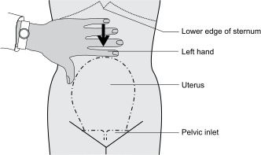
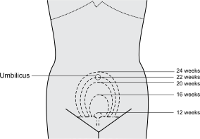
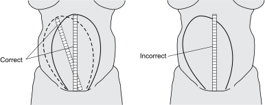
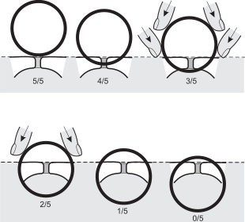

1B
{:.chapter-number}

# Skills workshop 1B: Examination of the abdomen in pregnancy

## Objectives 

When you have completed this skills workshop you should be able to:

*	Determine the gestational age from the size of the uterus.
*	Measure the symphysis-fundus height.
*	Assess the lie and the presentation of the fetus.
*	Assess the amount of liquor present.
*	Listen to the fetal heart.
*	Assess fetal movements.
*	Assess the state of fetal wellbeing.

## General examination of the abdomen

There are 2 main parts to the examination of the abdomen:

1.	General examination of the abdomen.
2.	Examination of the uterus and the fetus.

### A Preparation of the patient for examination

1.	The patient should have an empty bladder.
2.	She should lie comfortably on her back with a pillow under her head. She should not lie slightly turned to the side, as is needed when the blood pressure is being taken.

### B General appearance of the abdomen

The following should be specifically looked for and noted:

1.	The presence of obesity.
2.	The presence or absence of scars. When a scar is seen the reason for it should be specifically asked for (e.g. what operation did you have?), if this has not already become clear from the history.
3.	The apparent size and shape of the uterus.
4.	Any other abnormalities.

### C Palpation of the abdomen

1.	The liver, spleen and kidneys must be specifically palpated (felt) for.
2.	Any other abdominal mass should be noted.
3.	The presence of an enlarged organ, or a mass, should be reported to the responsible doctor, and the patient should then be assessed by the doctor.

## Examination of the uterus and the fetus

### D Palpation of the uterus

1.	Check whether the uterus is lying in the midline of the abdomen. Sometimes it is rotated to either the right or the left.
2.	Feel the wall of the uterus for irregularities. An irregular uterine wall suggests either:
	*	The presence of myomas (fibroids) which usually enlarge during pregnancy and may become painful.
	*	A congenital abnormality such as a bicornuate uterus.

### E Determining the size of the uterus before 18 weeks gestation

1.	Anatomical landmarks are used, i.e. the symphysis pubis and the umbilicus.
2.	Gently palpate the abdomen with the left hand to determine the height of the fundus of the uterus:
	*	If the fundus is palpable just above the symphysis pubis, the gestational age is probably 12 weeks.
	*	If the fundus reaches halfway between the symphysis and the umbilicus, the gestational age is probably 16 weeks.
	*	If the fundus is at the same height as the umbilicus, the gestational age is probably 22 weeks (one finger under the umbilicus = 20 weeks and one finger above the umbilicus = 24 weeks).

### F Determining the height of the fundus from 18 weeks gestation

The symphysis-fundus height should be measured as follows:

1.	**Feel for the fundus of the uterus**. This is done by starting to gently palpate from the lower end of the sternum. Continue to palpate down the abdomen until the fundus is reached. When the highest part of the fundus has been identified, mark the skin at this point with a pen. If the uterus is rotated away from the midline, the highest point of the uterus will not be in the midline but will be to the left or right of the midline. Therefore, also palpate away from the midline to make sure that you mark the highest point at which the fundus can be palpated. Do not move the fundus into the midline before marking the highest point.
2.	**Measure the symphysis-fundus (s-f) height**. Having marked the fundal height, hold the end of the tape measure at the top of the symphysis pubis. Lay the tape measure over the curve of the uterus to the point marking the top of the uterus. The tape measure must not be stretched while doing the measurement. Measure this distance in centimetres from the symphysis pubis to the top of the fundus. This is the symphysis-fundus height.
3.	If the uterus does not lie in the midline but, for example, lies to the right, then the distance to the highest point of the uterus must still be measured without moving the uterus into the midline.

Having determined the height of the fundus, you need to assess whether the height of the fundus corresponds to the patient’s dates, and to the size of the fetus. From 18 weeks, the S-F height must be plotted on the SF growth curve to determine the gestational age. This method is, therefore, only used once the fundal height has reached 18 weeks. In other words when the S-F height has reached two fingers width under the umbilicus.

<figure>
	
	<figcaption>Figure 1B-1: Determining the fundal height</figcaption>
</figure>

<figure>
	
	<figcaption>Figure 1B-2: Determining the uterine size before 24 weeks</figcaption>
</figure>

<figure>
	
	<figcaption>Figure 1B-3: Measuring the symphysis-fundus height</figcaption>
</figure>

### G Palpation of the fetus

The lie and presenting part of the fetus only becomes important when the gestational age reaches 34 weeks.

The following must be determined:

1.	**The lie of the fetus**. This is the relationship of the long axis of the fetus to that of the mother. The lie may be longitudinal, transverse, or oblique.

2.	**The presentation of the fetus**. This is determined by the presenting part:
	*	If there is a breech, it is a breech presentation.
	*	If there is a head, it is a cephalic presentation.
	*	If no presenting part can be felt, it is a transverse or oblique lie.
3.	**The position of the back of the fetus**. This refers to whether the back of the fetus is on the left or right side of the uterus, and will assist in determining the position of the presenting part.

### H Methods of palpation

There are 4 specific steps for palpating the fetus. These are performed systematically. With the mother lying comfortably on her back, the examiner faces the patient for the first 3 steps, and faces towards her feet for the fourth.

1.	**First step**. Having established the height of the fundus, the fundus itself is gently palpated with the fingers of both hands, in order to discover which pole of the fetus (breech or head) is present. The head feels hard and round, and is easily movable and ballotable. The breech feels soft, triangular and continuous with the body.
2.	**Second step**. The hands are now placed on the sides of the abdomen. On one side there is the smooth, firm curve of the back of the fetus, and on the other side the rather knobbly feel of the fetal limbs. It is often difficult to feel the fetus well when the patient is obese, when there is a lot of liquor or when the uterus is tight, as in some primigravidas.
3.	**Third step**. The examiner grasps the lower portion of the abdomen, just above the symphysis pubis, between the thumb and fingers of one hand. The objective is to feel for the presenting part of the fetus and to decide whether the presenting part is loose above the pelvis or fixed in the pelvis. If the head is loose above the pelvis, it can be easily moved and balloted. The head and breech are differentiated in the same way as in the first step.
4.	**Fourth step**. The objective of the step is to determine the amount of head palpable above the pelvic brim, if there is a cephalic presentation. The examiner faces the patient’s feet, and with the tips of the middle 3 fingers palpates deeply in the pelvic inlet. In this way the head can usually be readily palpated, unless it is already deeply in the pelvis. The amount of the head palpable above the pelvic brim can also be determined.

<figure>
	
	<figcaption>Figure 1B-4: The 4 steps in palpating the fetus</figcaption>
</figure>

### I Amount of head palpable above pelvis

The amount of head is assessed by feeling how many fifths of the head are palpable above the brim of the pelvis:

1.	5/5 of the head palpable means that the whole head is above the brim of the pelvis. A normal thyroid gland is usually slightly enlarged during pregnancy.
2.	4/5 of the head palpable means that a small part of the head is below the brim of the pelvis and can be lifted out of the pelvis with the deep pelvic grip. A normal thyroid gland is usually slightly enlarged during pregnancy.
3.	3/5 of the head palpable means that the head cannot be lifted out of the pelvis. On doing the deep pelvic grip, your fingers will move outwards from the neck of the fetus, then inwards before reaching the pelvic brim.
4.	2/5 of the head palpable means that most of the head is below the pelvic brim, and on doing the deep pelvic grip, your fingers only splay outwards from the fetal neck to the pelvic brim.
5.	1/5 of the head palpable means that only the tip of the fetal head can be felt above the pelvic brim.

<figure>
	
	<figcaption>Figure 1B-5: An accurate method of determining the amount of head palpable above the brim of the pelvis</figcaption>
</figure>

### J Special points about the palpation of the fetus

1.	When you are palpating the fetus, always try to assess the size of the fetus itself. Does the fetus fill the whole uterus, or does it seem to be smaller than you would expect for the size of the uterus, and the duration of pregnancy? A fetus which feels smaller than you would expect for the duration of pregnancy, suggests intra-uterine growth restriction, while a fetus which feels smaller than expected for the size of the uterus, suggests the presence of a multiple pregnancy.
2.	If you find an abnormal lie when you palpate the fetus, you should always consider the possibility of a multiple pregnancy. When you suspect that a patient might have a multiple pregnancy, she should have an ultrasound examination.

### K Special points about the palpation of the fetal head

1.	**Does the head feel too small for the size of the uterus?** You should always try to relate the size of the head to the size of the uterus and the duration of pregnancy. If it feels smaller than you would have expected, consider the possibility of a multiple pregnancy.
2.	**Does the head feel too hard for the size of the fetus?** The fetal head feels harder as the pregnancy gets closer to term. A relatively small fetus with a hard head suggests the presence of intra-uterine growth restriction.

### L Assessment of the amount of liquor present

This is not always easy to feel. The amount of liquor decreases as the pregnancy nears term. The amount of liquor is assessed clinically by feeling the way that the fetus can be moved (balloted) while being palpated.

1.	If the liquor volume is reduced (oligohydramnios), it suggests that:
	*	There may be intra-uterine growth restriction.
	*	There may be a urinary tract obstruction or some other urinary tract abnormality in the fetus. This is uncommon.
2.	If the liquor volume is increased (polyhydramnios), it suggests that one of the following conditions may be present:
	*	Multiple pregnancy.
	*	Maternal diabetes.
	*	A fetal abnormality such as spina bifida, anencephaly or oesophageal atresia.

In many cases, however, the cause of polyhydramnios is unknown. However, serious problems can be present and the patient should be referred to a hospital where the fetus can be carefully assessed. The patient needs an ultrasound examination by a trained person to exclude multiple pregnancy, or a congenital abnormality in the fetus.

### M Assessment of uterine irritability

This means that the uterus feels tight, or has a contraction, while being palpated. Uterine irritability normally only occurs after 36 weeks of pregnancy, i.e. near term. If there is an irritable uterus before this time, it suggests either that there is intra-uterine growth restriction or that the patient may be in, or is likely to go into, preterm labour.

### N Listening to the fetal heart

1.	**Where should you listen?** The fetal heart is most easily heard, by listening over the back of the fetus. This means that the lie and position of the fetus must be established by palpation before listening for the fetal heart.
2.	**When should you listen to the fetal heart?** You need only listen to the fetal heart if a patient has not felt any fetal movements during the day. Listening to the fetal heart is, therefore, done to rule out an intra-uterine death.
3.	**How long should you listen for?** You should listen long enough to be sure that what you are hearing is the fetal heart and not the mother’s heart. When you are listening to the fetal heart, you should, at the same time, also feel the mother’s pulse.

### O Assessment of fetal movements

The fetus makes 2 types of movement:

1.	**Kicking** movements, which are caused by movement of the limbs. These are usually quick movements.
2.	**Rolling** movements, which are caused by the fetus changing position.

When you ask a patient to count her fetal movements, she must count both types of movement.

If there is a reason for the patient to count fetal movements and to record them on a fetal movement chart, it should be done as follows:

1.	**Time of day**. Most patients find that the late morning is a convenient time to record fetal movements. However, she should be encouraged to choose the time which suits her best. She will need to rest for an hour. It is best that she use the same time every day.
2.	**Length of time**. This should be for 1 hour per day, and the patient should be able to rest and not be disturbed for this period of time. Sometimes the patient may be asked to rest and count fetal movements for 2 or more half-hour periods a day. The patient must have access to a watch or clock, and know how to measure half- and one-hour periods.
3.	**Position of the patient**. She may either sit or lie down. If she lies down, she should lie on her side. In either position she should be relaxed and comfortable.
4.	**Recording of fetal movements**. The fetal movements should be recorded on a chart as shown in Table 1B-6. For example, in the chart we see that:
	*	Between 08:00 and 09:00 on 3rd of July the fetus moved 6 times.
	*	Between 11:00 and 12:00 on 4th July the fetus moved 9 times.
	*	Between 08:00 and 09:00 on 5th July the fetus moved 3 times.
	
<figure>
	
	<figcaption>Figure 1B-6: An example of fetal movements recorded on a fetal movements chart</figcaption>
</figure>

All the movements should be recorded. Therefore, every time the fetus moves, the patient must make a tick on the chart. The time and day should be marked on the chart. If the patient is illiterate, the nurse giving her the chart can fill in the day (and times if the chart is to be used more than once a day). It is important to explain to the patient exactly how to use the chart. Remember that a patient who is resting can easily fall asleep and, therefore, miss fetal movements.

### P Assessment of the state of fetal wellbeing

It is very important to assess the state of fetal well being at the end of every abdominal palpation. This is done by taking into account all the features mentioned in this skills workshop.
