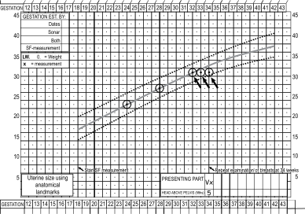
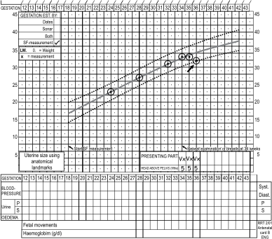
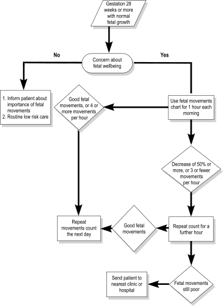

2
{:.chapter-number}

# Assessment of fetal growth and condition during pregnancy

Before you begin this unit, please take the corresponding test to assess your knowledge of the subject matter. You should redo the test after you’ve worked through the unit, to evaluate what you have learned.

## Objectives

When you have completed this unit you should be able to:

*	Assess normal fetal growth.
*	List the causes of intra-uterine growth restriction.
*	Understand the importance of measuring the symphysis-fundus height.
*	Understand the clinical significance of fetal movements.
*	Use a fetal movement chart.
*	Manage a patient with decreased fetal movements.
*	Understand the value of antenatal fetal heart-rate monitoring.

## Introduction

1.	During the antenatal period, both maternal and fetal growth must be continually monitored.
2.	Individualised care will improve the accuracy of antenatal observations.
3.	At every antenatal visit from 28 weeks gestation onwards, the wellbeing of the fetus must be assessed.

### 2-1 How can you assess the condition of the fetus during pregnancy?

The condition of the fetus before delivery is assessed by:

1.	Documenting fetal growth.
2.	Recording fetal movements.

> When managing a pregnant woman, remember that you are caring for two individuals.

## Fetal growth

### 2-2 What is normal fetal growth?

If the assessed fetal weight is within the expected range for the duration of pregnancy, then the fetal growth is regarded as normal.

> To determine fetal growth you must have an assessment of both the duration of pregnancy and the weight of the fetus.

### 2-3 When may fetal growth appear to be abnormal?

Fetal growth will appear to be abnormal when the assessed fetal weight is greater or less than that expected for the duration of pregnancy. Remember that incorrect menstrual dates are the commonest cause of an incorrect assessment of fetal growth.

### 2-4 When is intra-uterine growth restriction suspected?

When the weight of the fetus is assessed as being less than the normal range for the duration of pregnancy, then intra-uterine growth restriction (fetal growth restriction) is suspected.

### 2-5 What maternal and fetal factors are associated with intra-uterine growth restriction?

Intra-uterine growth restriction may be associated with either maternal, fetal and placental factors:

1.	**Maternal** factors:
	*	Low maternal weight, especially a low body mass index resulting from undernutrition.
	*	Tobacco smoking.
	*	Alcohol intake.
	*	Strenuous physical work.
	*	Poor socio-economic conditions.
	*	Pre-eclampsia and chronic hypertension.  
	Poor maternal weight gain is of very little value in diagnosing intra-uterine growth restriction.

2.	**Fetal** factors:
	*	Multiple pregnancy.
	*	Chromosomal abnormalities, e.g. trisomy 21.
	*	Severe congenital malformations.
	*	Chronic intra-uterine infection, e.g. congenital syphilis.

3.	**Placental** factors:
	*	Poor placental function (placental insufficiency) is usually due to a maternal problem such as pre-eclampsia.
	*	Smoking.  
	Poor placental function is uncommon in a healthy woman who does not smoke.

If severe intra-uterine growth restriction is present, it is essential to look for a maternal or fetal cause. Usually a cause can be found.

### 2-6 How can you estimate fetal weight?

The following methods can be used:

1.	Measure the size of the uterus on abdominal examination.
2.	Palpate the fetal head and body on abdominal examination.
3.	Measure the size of the fetus using antenatal ultrasonography (ultrasound).

### 2-7 How should you measure the size of the uterus?

1.	This is done by determining the symphysis-fundus height (S-F height), which is measured in centimetres from the upper edge of the symphysis pubis to the top of the fundus of the uterus.
2.	The S-F height in centimetres should be plotted against the gestational age on the S-F growth curve.
3.	From 36 weeks onwards, the presenting part may descend into the pelvis and measurement of the S-F height will not accurately reflect the size of the fetus. A reduction in the S-F height may even be observed.

### 2-8 What is the symphysis-fundus growth curve?

The symphysis-fundus growth curve compares the S-F height to the duration of pregnancy. The growth curve should preferably form part of the antenatal card. The solid line of the growth curve represents the 50th centile, and the upper and lower dotted lines, the 90th and 10th centiles, respectively. If intra-uterine growth is normal, the S-F height will fall between the 10th and 90th centiles. The ability to detect abnormalities from the growth curve is much increased if the same person sees the patient at every antenatal visit.

Between 18 and 36 weeks of pregnancy, the S-F height normally increases by about 1 cm a week.

### 2-9 When will the symphysis-fundus height suggest intra-uterine growth restriction?

If any of the following are found:

1.	Slow increase in uterine size until one measurement falls under the 10th centile.
2.	Three successive measurements ‘plateau’ (i.e. remain the same) without necessarily crossing below the 10th centile.
3.	A measurement which is less than that recorded 2 visits previously without necessarily crossing below the 10th centile.

Note that a measurement that was originally normal, but on subsequent examinations has fallen to below the 10th centile, indicates intra-uterine growth restriction and not incorrect dates.

### 2-10 How can you identify severe intra-uterine growth restriction?

With severe intra-uterine growth restriction, the difference between the actual duration of pregnancy and that suggested by plotting S-F height is 4 weeks or more.

### 2-11 Does descent of the presenting part of the fetus affect your interpretation of the growth curve?

Yes. Descent of the presenting part may occur in the last 4 weeks of pregnancy. Therefore, after 36 weeks the above criteria are no longer valid, if at subsequent antenatal visits progressively less of the fetal head is palpable above the pelvic inlet.

### 2-12 What action would you take if the symphysis-fundus height measurement suggests intra-uterine growth restriction?

1.	The patient should stop smoking and rest more, while attention must be given to her diet. It may be necessary to arrange sick leave and social support for the patient.
2.	A poor diet which is low in energy (kilojoules) may cause intra-uterine growth restriction, especially in a patient with a low body mass index. Therefore, ensure that patients with suspected intra-uterine growth restriction receive a high-energy diet. If possible, patients must be given food supplements (food parcels).
3.	Exclude pre-eclampsia as a cause.
4.	If the gestational age is 28 weeks or more, careful attention must be paid to counting the fetal movements.
5.	The patient should be followed up weekly at a level 1 hospital.

### 2-13 Which special investigation is of great value in the further management of this patient?

The patient must be referred to a fetal evaluation clinic or level 2 hospital for a Doppler measurement of blood flow in the umbilical arteries:

1.	Good flow (low resistance) indicates good placental function. As a result the woman can receive further routine management as a low-risk patient. Spontaneous onset of labour can be allowed. Induction of labour at 38 weeks is not needed.
2.	Poor flow (high resistance) indicates poor placental function. Antenatal electronic fetal heart rate monitoring must be done. The further management will depend on the result of the monitoring.

If Doppler measurement is not available, the patient must be managed as given in 2-14.

### 2-14 What possibilities must be considered if, after taking the above steps, there is still no improvement in the symphysis-fundus growth?

1.	Intra-uterine death must be excluded by the presence of a fetal heart beat on auscultation.
2.	With moderate intra-uterine growth restriction and good fetal movements, the patient must be followed up weekly and delivery at 38 weeks should be considered.
3.	If the above patient also has poor social circumstances, an admission to hospital will need to be considered. This should ensure that the patient gets adequate rest, a good diet and stops smoking.
4.	If there are decreased or few fetal movements, the patient should be managed as described in sections 2-25 and 2-26.
5.	When there is severe intra-uterine growth restriction, the patient must be referred to a level 2 or 3 hospital for further management.

<figure>
	
	<figcaption>Figure 2-1: The symphysis-fundus growth chart</figcaption>
</figure>

<figure>
	
	<figcaption>Figure 2-2: One measurement below the 10th centile</figcaption>
</figure>

<figure>
	
	<figcaption>Figure 2-3: Three successive measurements that remain the same</figcaption>
</figure>

<figure>
	
	<figcaption>Figure 2-4: A measurement less than that recorded 2 visits before</figcaption>
</figure>

## Fetal movements

### 2-15 When are fetal movements first felt?

1.	At about 20 weeks in a primigravida.
2.	At about 16 weeks in a multigravida.

### 2-16 Can fetal movements be used to determine the duration of pregnancy accurately?

No, because the gestational age when fetal movements are first felt differs a lot from patient to patient. Therefore, it is only useful as an approximate guide to the duration of pregnancy.

### 2-17 What is the value of assessing fetal movements?

Fetal movements indicate that the fetus is well. By counting the movements, a patient can, therefore, monitor the condition of her fetus.

### 2-18 From what stage of pregnancy will you advise a patient to become aware of fetal movements in order to monitor the fetal condition?

From 28 weeks, because the fetus can now be regarded as potentially viable (i.e. there is a good chance that the infant will survive if delivered). All patients should be encouraged to become aware of the importance of an adequate number of fetal movements.

> Asking the patient if the fetus is moving normally on the day of the visit is an important way of monitoring the fetal wellbeing.

### 2-19 What is a fetal movement chart?

A fetal movement chart records the frequency of fetal movements and, thereby, assesses the condition of the fetus. The name “kick chart” is not correct, as all movements must be counted, e.g. rolling and turning movements, as well as kicking.

### 2-20 Which patients should use a fetal movement chart?

A fetal movement chart need not be used routinely by all antenatal patients, but only when:

1.	There is concern about the fetal condition.
2.	A patient reports decreased fetal movements.

### 2-21 How should you advise a patient to use the fetal movement chart?

Fetal movements should be counted and recorded on the chart over a period of an hour per day after breakfast. The patient should preferably rest on her side for this period.

### 2-22 How accurate is a fetal movement count?

A good fetal movement count always indicates a fetus in good condition. A distressed fetus will never have a good fetal movement count. However, a low count or a decrease in fetal movements may also be the result of periods of rest or sleep in a healthy fetus. The rest and sleep periods can last several hours.

Tests with electronic equipment have shown that mothers can detect fetal movements accurately. With sufficient motivation, the fetal movement chart can be an accurate record of fetal movements. It is, therefore, not necessary to listen to the fetal heart at antenatal clinics if the patient reports an adequate number of fetal movements, or an adequate number of fetal movements has been recorded for the day.

> A uterus which increases in size normally, and an actively moving fetus, indicate that the fetus is well.

### 2-23 What is the least number of movements per hour which indicates a good fetal condition?

1.	The number of movements during an observation period is less important than a decrease in movements when compared to previous observation periods. If the number of movements is reduced by half, it suggests that the fetus may be at increased risk of fetal distress.
2.	If a fetus normally does not move much, and the count falls to 3 or fewer per hour, the fetus may be in danger.

### 2-24 What would you advise if the fetal movements suggest that the fetal condition is not good?

1.	The mother should lie down on her side for another hour and repeat the count.
2.	If the number of fetal movements improves, there is no cause for concern.
3.	If the number of fetal movements does not improve, she should report this to her clinic or hospital as soon as possible.

A patient who lives far away from her nearest hospital or clinic should continue with bed rest, but if the movements are 3 or fewer over a 6 hour period, then arrangements must be made for her to be moved to the nearest hospital.

### 2-25 What should you do if a patient arrives at the clinic or hospital without a cardiotocograph (CTG machine) with reduced fetal movements?

1.	Listen to the fetal heart with a fetal stethoscope or a doptone to exclude intra-uterine death.
2.	The patient should be allowed to rest and count fetal movements over a 6 hour period. With 4 or more movements during the next 6 hours, repeat the fetal movement count the next day, after breakfast. If there are 3 or fewer movements over the next 6 hours, the patient should see the responsible doctor.

The patient should be given a drink containing sugar (e.g. tea) to drink to exclude hypoglycaemia as the cause of the decreased fetal movements.

## Case study 1

A patient is seen at the antenatal clinic at 37 weeks gestation. She is clinically well and reports normal fetal movements. The S-F height was 35 cm the previous week and is now 34 cm. The previous week the fetal head was ballotable above the brim of the pelvis and it is now 3/5 above the brim. The fetal heart rate is 144 beats per minute. The patient is reassured that she and her fetus are healthy, and she is asked to attend the antenatal clinic again in a week’s time.

### 1.	Are you worried about the decrease in the S-F height since the last antenatal visit?

No, as the fetal head is descending into the pelvis. The head was 5/5 above the brim of the pelvis and is now 3/5 above the brim.

### 2.	What is your assessment of the fetal condition?

The fetus is healthy as the S-F height is normal for 37 weeks and the fetus is moving normally.

### 3.	What is the value of a normal fetal heart rate during the antenatal period?

The fetal heart rate is not a useful measure of the fetal condition before the onset of labour. If the fetus moves well during the antenatal period, there is no need to listen to the fetal heart.

### 4.	What is the value of fetal movements during the antenatal period?

Active fetal movements, noted that day, indicate that the fetus is healthy. The patient can, therefore, monitor the condition of her fetus by taking note of fetal movements.

## Case study 2

You examine a 28 year old gravida 4 para 3 patient who is 34 weeks pregnant. She has no particular problems and mentions that her fetus has moved a lot, as usual, that day. The S-F height has not increased over the past three antenatal visits but only the last S-F height measurement has fallen to the 10th centile. The patient is a farm labourer and she smokes.

### 1.	What do the S-F height measurements indicate?

They indicate that the fetus may have intra-uterine growth restriction, as the last three measurements have remained the same even though the S-F height measurement has not fallen below the 10th centile.

### 2.	What are the probable causes of the poor fundal growth?

Hard physical labour and smoking. Both these factors can cause intra-uterine growth restriction.

### 3.	What is the possibility of fetal distress or death in the next few days?

Both these possibilities are most unlikely as the patient has reported normal fetal movements.

### 4.	What can be done to improve fetal growth?

Arrangements should be made, if possible, for the patient to stop working. She must also stop smoking, get enough rest and have a good diet.

### 5.	How should this patient be managed?

She must be given a fetal movement chart and you must explain clearly to her how to use the chart. She must be placed in the high-risk category and, therefore, seen at the clinic every week. If the fundal growth does not improve, the patient must be hospitalised and labour should be induced at 38 weeks.

If a Doppler blood flow measurement of the umbilical arteries indicates normal placental function, routine management of a low-risk patient can be given. Induction at 38 weeks is not needed.

## Case study 3

A patient, who is 36 weeks pregnant with suspected intra-uterine growth restriction, is asked to record her fetal movements on a fetal movement chart. She reports to the clinic that her fetus, which usually moves 20 times per hour, only moved 5 times during an hour that morning.

### 1.	What should the patient have done?

Rather than come to the clinic, she should have counted the number of fetal movements for a further hour.

### 2.	What is the correct management of this patient?

She must not go home unless you are sure that her fetus is healthy. She should lie on her side and count the number of fetal movements during one hour. If she has not had breakfast, give her a cold drink or a cup of sweetened tea to make sure that she is not hypoglycaemic.

### 3.	What should you do if the fetus moves more than 10 times during the hour?

If the number of fetal movements returns to more than half the previous count (i.e. more than 10 times per hour), she can go home and return to the clinic in a week. In addition, she must count the fetal movements daily.

### 4.	What should you do if the fetus moves fewer than 10 times during the hour?

If the fetal movement count remains less than half the previous count, the patient should be transferred to a hospital where antenatal electronic fetal heart monitoring can be done. Further management will depend on the result of the monitoring.

### 5.	What is the correct management if electronic fetal heart monitoring is not available?

Fetal movements should be counted for a full 6 hours. If the fetus moves fewer than 4 times, there is a high chance that the fetus is distressed. A doctor must now examine the patient and decide whether the fetus should be delivered and what would be the safest method of delivery.

<figure>
	
	<figcaption>Figure 2-5: The management of a patient with decreased fetal movements</figcaption>
</figure>
