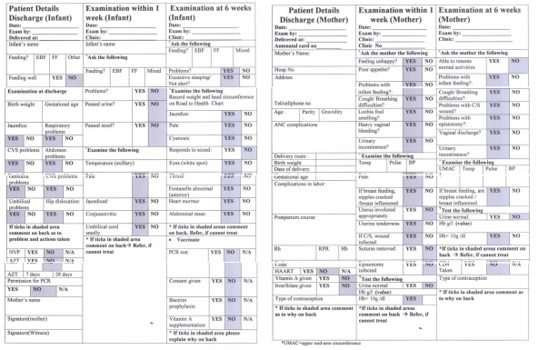

# The puerperium and family planning

Before you begin this unit, please take the corresponding test to assess your knowledge of the subject matter. You should redo the test after you’ve worked through the unit, to evaluate what you have learned.

## Objectives

When you have completed this unit you should be able to:

*	Define the puerperium and list the physical changes which occur during the puerperium.
*	Manage the normal puerperium.
*	Assess a patient at the 6 week postnatal visit.
*	Diagnose and manage the various causes of puerperal pyrexia.
*	Recognise the puerperal psychiatric disorders.
*	Diagnose and manage secondary postpartum haemorrhage.
*	Teach the patient the concept of ‘the mother as a monitor’.
*	Explain the wider meaning of family planning and give contraceptive counselling.
*	List the health benefits, efficiency, contraindications and side effects of the various contraceptive methods.
*	Advise a postpartum patient on the most appropriate method of contraception.

## The puerperium

### 6-1 What is the puerperium?

The puerperium is the period from the end of the third stage of labour until most of the patient’s organs have returned to their pre-pregnant state.

### 6-2 How long does the puerperium last?

The puerperium starts when the placenta is completely delivered and lasts for 6 weeks. However, some organs may only return to their pre-pregnant state weeks or even months after the 6 weeks have elapsed (e.g. the ureters). Other organs never regain their pre-pregnant state (e.g. the perineum).

It is important for the midwife or doctor to assess whether the patient has returned, as closely as possible, to normal health and activity by the end of the puerperium.

> The puerperium starts when the placenta is delivered and lasts for 6 weeks.

### 6-3 Why is the puerperium important?

1. 	The patient recovers from her labour, which often leaves her tired and even exhausted. There is, nevertheless, a feeling of great relief and happiness
2.	The patient undergoes what is probably the most important psychological experience of her life, as she realises that she is responsible for another human being, her infant.
3.	Breastfeeding should be established.
4.	The patient should decide, with the guidance of a midwife or doctor, on an appropriate contraceptive method.

### 6-4 What physical changes occur in the puerperium?

Almost every organ undergoes change in the puerperium. These adjustments range from mild to marked. Only those changes which are important in the management of the normal puerperium following discharge from the hospital or clinic (midwife obstetric unit–MOU) will be described here.

1.	**Skin**.
	*	The increased pigmentation of the face, abdominal wall and vulva lightens but the areolae may remain darker than they were before pregnancy.
	*	With the onset of diuresis (increased amount of urine passed) the general puffiness and any oedema disappear in a few days.
	*	Marked sweating may occur for some days.
2.	**Abdominal wall**.
	*	The abdominal wall is flaccid (loose and wrinkled) and some separation (divarication) of the abdominal muscles occurs.
	*	Pregnancy marks (striae gravidarum), where present, do not disappear but do tend to become less red in time.
3.	**Gastrointestinal tract**.
	*	Thirst is common.
	*	The appetite varies from anorexia to ravenous hunger.
	*	There may be flatulence (excess wind).
	*	Many patients are constipated as a result of decreased tone of the bowel during pregnancy and, decreased food intake during labour. They may also have passed stool during labour and delivery. Constipation is common in the presence of an episiotomy or painful haemorrhoids. Giving a patient an enema on admission in labour is of no advantage to her and contributes to constipation in the puerperium.
4.	**Urinary tract**.
	*	Retention of urine is common and may result from decreased tone of the bladder in pregnancy and oedema of the urethra following delivery. Dysuria (discomfort or pain) and difficulty in passing urine may lead to complete urinary retention or retention with overflow incontinence. A full bladder will interfere with uterine contraction.
	*	A diuresis usually occurs on the second or third day of the puerperium. In oedematous patients it may start immediately after delivery.
	*	Stress incontinence (a leak of urine) is common when the patient laughs or coughs. It may first be noted during the puerperium or follow stress incontinence which was present during pregnancy. Often stress incontinence becomes worse initially but tends to improve with time and with pelvic floor exercises.

	Pelvic floor exercises are also known as pinch or ‘knyp’ exercises. The muscles that are exercised are those used to suddenly stop a stream of urine midway through micturition. These muscles should be tightened, as strongly as possible, 10 times in succession on at least 4 occasions a day.
5.	**Blood**.
	*	The haemoglobin concentration becomes stable around the 4th day of the puerperium.
	*	The platelet count is raised and the platelets become more sticky from the 4th to 10th day after delivery. These and other changes in the clotting (coagulation) factors may cause thrombo-embolism in the puerperium.
6.	**Breasts**.
	Marked changes occur during the puerperium with the production of milk
7.	**Genital tract**.
	Very marked changes occur in the genital tract during the puerperium:
	*	**Vulva**: The vulva is swollen and congested after delivery, but these features rapidly disappear. Tears and/or an episiotomy usually heal easily.
	*	**Vagina**: Immediately after delivery the vagina is large, smooth walled, oedematous and congested. It rapidly shrinks in size and rugae return by the third week. The vaginal walls remain laxer than before and some degree of vaginal prolapse (cystocoele and/or rectocoele) is common after a vaginal delivery. Small vaginal tears, which are very common, usually heal in 7 to 10 days.
	*	**Cervix**: After the first vaginal delivery the circular external os of the nullipara becomes slit like. For the first few days after delivery the cervix remains partially open, admitting 1 or 2 fingers. By the 7th day postpartum the cervical os will have closed so that a finger can no longer be passed through it.
	*	**Uterus**: The most important change occurring in the uterus is involution. After delivery the uterus is about the size of a 20 week pregnancy. By the end of the first week it is about 12 weeks in size. At 14 days the fundus of the uterus should no longer be palpable above the symphysis pubis. After 6 weeks it has decreased to the size of a normal multiparous uterus, which is slightly larger than a nulliparous one. This remarkable decrease in size is the result of contraction and retraction of the uterine muscle. The normally involuting uterus should be firm and non-tender. The decidua of the uterus necroses (dies), due to ischaemia, and is shed as the lochia. The average duration of red lochia is 24 days. Thereafter, the lochia becomes straw coloured. Normal lochia has a typical, non-offensive smell. Offensive lochia is always abnormal.

## Management of the puerperium

The management of the puerperium may be divided into 3 stages:

1.	The management of the first hour after delivery of the placenta (sometimes called the fourth stage of labour).
2.	The management of the rest of the puerperium.
3.	The 6 week postnatal visit.

### 6-5 When should a postpartum patient be allowed to go home?

This will depend on:

1.	Whether the patient had a normal pregnancy and delivery.
2.	The circumstances of the hospital or clinic where the patient was delivered.

### 6-6 When should a patient be allowed to go home following a normal pregnancy and delivery?

A patient who has had a normal pregnancy and delivery may be allowed to go home about 6 hours after the birth of her infant, provided:

1.	The observations done on the mother and infant since delivery have been normal.
2.	The mother and infant are normal on examination, and the infant is sucking well.
3.	The patient is able to attend her nearest clinic on the day after delivery (day 1) and then again on days 3 and 5 after delivery for postnatal care, or be visited at home by a midwife on those days. Primigravidas should be seen again on day 7, especially to ensure that breastfeeding is well established.

A patient should only be discharged home after delivery if no abnormalities are found when the following examinations are performed:

*	A general examination, paying particular attention to the:
	*	Pulse rate.
	*	Blood pressure.
	*	Temperature.
	*	Haemoglobin concentration.
*	An abdominal examination, paying particular attention to the state of contraction and/or tenderness of the uterus.
*	An inspection of the episiotomy site and the amount, colour and odour of the lochia.
*	Patients who received no antenatal care and delivered without having any screening tests, must have a rapid syphilis test and a rapid test for Rhesus grouping. Counselling for HIV testing must also be done.

It is important to arrange for suitable contraception before the patient is discharged home.

The Essential Postnatal Obstetric Care (EPOC) card with the mother’s and infant’s discharge information could now be completed. If any of the shaded blocks are ticked, treatment is required or the mother needs to be referred to the next level of care.  The checklist will again be used during the day-5 or -6 visit to check that all the important tasks have been completed (i.e. as a quality control tool).

### 6-7 When should a patient be discharged from hospital following a complicated pregnancy and delivery?

This will depend on the nature of the complication and the method of delivery. For example:

1.	A patient with pre-eclampsia should be kept in hospital until her blood pressure has returned to normal or is well controlled with oral drugs.
2.	A patient who has had a caesarean section will usually stay in hospital for 2 days or longer.
3.	A patient who has had a postpartum haemorrhage must be kept in hospital for at least 24 hours to ensure that her uterus is well contracted and that there is no further bleeding.
4.	HIV-positive patients are at increased risk for infections. Careful examination for any signs of infection is required and the patients should be kept in hospital or the delivery clinic for 24 hours.

### 6-8 How will the circumstances at a clinic or hospital influence the time of discharge?

1.	Some clinics have no space to accommodate patients for longer than 6 hours after delivery. Therefore, patients who cannot be discharged safely at 6 hours will have to be transferred to a hospital.
2.	Some hospitals manage patients who live in remote areas where follow-up is not possible. These patients will have to be kept in hospital longer before discharge.

### 6-9 What postnatal care should be given during the puerperium after the patient has left the hospital or clinic?

Ideally, visits for postnatal care must be scheduled for the day following discharge (day 1), day 3 and day 5 or 6.  Limited health care facilities or long distances may require the visits to be limited to a single visit on day 5 or 6. 

The following observations must be done on the **mother**:

1.	Assess the patient’s general condition.
2.	Ask about problems with breathing and coughing.
3.	Observe the pulse rate, blood pressure and temperature.
4.	Determine the height of the uterine fundus and assess whether any uterine tenderness is present.
5.	Assess whether the amount of vaginal bleeding is more than normal.
6.	Assess the amount, colour and odour of the lochia.
7.	Check whether the episiotomy is healing satisfactorily.
8.	Ask if the patient passes urine normally and enquire about any urinary symptoms. Reassure the patient if she has not passed a stool by day 5.
9.	Measure the haemoglobin concentration if the patient appears pale.
10.	Assess the condition of the patient’s breasts and nipples. Determine whether successful breastfeeding has been established.

The following observations must be done on the **infant**:

1.	Assess whether the infant is feeding well and is satisfied after a feed.
2.	Assess whether the infant appears well and is thriving.
3.	Check whether the infant is jaundiced.
4.	Examine the umbilical stump for signs of infection.
5.	Examine the eyes for conjunctivitis.
6.	Ask whether the infant has passed urine and stool.

> The successful establishment of breastfeeding is one of the most important goals of patient care during the puerperium.

The EPOC card for the day 5 to 6 visit could now be completed. The checklist will again be used during the 6 weeks visit.

### 6-10 How can you help to establish successful breastfeeding?

By providing patient education and motivation. This should preferably start before pregnancy and continue throughout the antenatal period and after delivery. Encouragement and support are very important during the first weeks after delivery. The important role of successful breastfeeding in lowering infant mortality in poor communities must be remembered.

### 6-11 Which topics should you include under patient education in the puerperium?

Patient education regarding herself, her infant and her family should not start during the puerperium, but should be part of any woman’s general education, starting at school. Topics which should be emphasised in patient education in the puerperium include:

1. 	Personal and infant care.
2.	Offensive lochia, fever or severe abdominal pain must be reported immediately.
3.	The ‘puerperal blues’.
4.	Family planning and safer sex.
5.	Any special arrangements for the next pregnancy and delivery.
6.	When to start coitus again. Usually coitus can be started 3 to 4 weeks postpartum when the episiotomy or tears have healed.

> Patient education is an important and often neglected part of postnatal care.

### 6-12 When should a patient be seen again after postnatal care has been completed?

The postnatal visit is usually held 6 weeks after delivery. By this time almost all the organ changes which occurred during pregnancy should have disappeared.

## The six week postnatal visit

### 6-13 Which patients need to attend a 6 week postnatal clinic?

Patients with specific problems that need to be followed up 6 weeks postpartum, e.g. patients who were discharged with hypertension need to come back to have their blood pressure measured. Patients who are healthy may be referred directly to the mother and child health clinics for follow up and need not attend a special 6 week postnatal clinic.

### 6-14 What are the objectives of the 6-week postnatal visit?

It is important to identify the reason why the patient was asked to attend the clinic and to determine whether:

1.	The patient is healthy and has returned to her normal activities.
2.	The infant is well and growing normally.
3.	Breastfeeding has been satisfactorily established.
4.	Contraception has been arranged to the patient’s satisfaction.
5.	The patient has been referred to a maternal and child health clinic for further care.
6.	The patient has any questions about herself, her infant or her family.

### 6-15 How should the 6 week postnatal visit be conducted?

1.	The patient is asked how she and her infant have been since the last postnatal care visit.
2.	The patient is then examined. On examination pay particular attention to the blood pressure and breasts, and look for signs of anaemia. An abdominal examination is followed by a speculum examination to check whether the episiotomy, vulval or vaginal tears have healed.
3.	A cytology smear of the cervix should be taken if the patient is 30 years or older and has not previously had a normal cervical smear. A cervical smear should also be taken on any woman who has previously had an abnormal smear.
4.	The haemoglobin is measured and the urine tested for glucose and protein.
5.	Attention must be given to any specific reason why the patient is being followed up, e.g. arrangements for the management of patients who remain hypertensive after delivery.
6.	The patient is given health education. It should again be remembered to ask her whether she has any questions she would like to ask.

If the patient and her infant are both well, they are referred to their local maternal and child health clinic for further follow-up.

> A patient and her infant should only be discharged if they are both well and have been referred to the local maternal and child health clinic, and the patient has received contraceptive counselling.

### 6-16 What additional management is needed for HIV-positive patients?

1.	Patients that do not require antiretroviral treatment (CD4 count 250 cells/ml or more and stage 1 or 2 disease) must be encouraged to attend their nearest clinic for a clinical assessment and CD4 count every 6 months.
2.	Patients on antiretroviral treatment must be encouraged to be compliant with regular clinic visits and adherence to medication.
3.	Blood must be taken from the infant for a DNA PCR test and an appointment made so that the infant’s result can be obtained and further management planned. The DNA PCR will determine whether the infant is HIV infected.
4.	The essential postpartum care (EPOC) card (Figure 6-1) for the 6 weeks visit could now be completed.

<figure>
	
	<figcaption>Figure 6-1: The essential postpartum care card</figcaption>
</figure>

## Puerperal pyrexia

### 6-17 When is puerperal pyrexia present?

A patient has puerperal pyrexia if her oral temperature rises to 38 °C or higher during the puerperium.

### 6-18 Why is puerperal pyrexia important?

Because it may be caused by serious complications of the puerperium. Breastfeeding may be interfered with. The patient may become very ill or even die.

> Puerperal pyrexia may be caused by a serious complication of the puerperium.

### 6-19 What are the causes of puerperal pyrexia?

1.	Genital tract infection.
2.	Urinary tract infection.
3.	Mastitis or breast abscess.
4.	Thrombophlebitis (superficial vein thrombosis).
5.	Respiratory tract infection.
6.	Other infections.

### 6-20 What is the cause of genital tract infection?

Genital tract infection (or puerperal sepsis) is caused by bacterial infection of the raw placental site or lacerations of the cervix, vagina or perineum.

### 6-21 How should you diagnose genital tract infection?

1.	**History**.
	If one or more of the following is present:
	*	Preterm or prelabour rupture of the membranes, a long labour, operative delivery or incomplete delivery of the placenta or membranes may have occurred.
	*	The patient will feel generally unwell.
	*	Lower abdominal pain.
2.	**Examination**.
	*	Pyrexia, usually developing within the first 24 hours after delivery. Rigors may occur.
	*	Marked tachycardia.
	*	Lower abdominal tenderness.
	*	Offensive lochia.
	*	The episiotomy wound or perineal or vaginal tears may be infected.

## 6-22 How should you manage genital tract infection?

These patients require admission to a hospital urgently and must be referred. While waiting to be transferred treatment could be initiated:

*	Measures to bring down the temperature, e.g. tepid sponging.
*	Analgesia, e.g. paracetamol (Panado) 1 g (2 adult tablets) orally 6 hourly.
*	Intravenous fluids.
*	Broad-spectrum antibiotics, e.g. ampicillin and metronidazole (Flagyl). Antibiotic treatment must be started before transfer.

### 6-23 How must a patient with offensive lochia be managed?

1.	If the patient has a pyrexia she must be admitted to hospital.
2.	If the patient has a normal temperature and normal involution of her uterus, she can be managed as an out patient with oral ampicillin and metronidazole (Flagyl).

> Offensive lochia is an important sign of genital tract infection.

### 6-24 How should you diagnose a urinary tract infection?

1.	**History**.
	*	The patient may have been catheterised during labour or in the puerperium.
	*	Lower abdominal pain and/or pain in the lower back over one or both the kidneys (the loins).
	*	Dysuria and frequency. However, these are not reliable symptoms of urinary tract infection.
2.	**Examination**.
	*	Pyrexia, often with rigors (shivering).
	*	Tachycardia.
	*	Suprapubic and flank tenderness and/or tenderness, especially to light percussion, over the kidneys (punch tenderness in the renal angles).
3.	**Side room and special investigations**.
	*	Microscopy of a midstream or catheter specimen of urine usually shows large numbers of pus cells and bacteria.
	*	Culture and sensitivity tests of the urine must be done if the facilities are available.

The presence of pyrexia and punch tenderness in the renal angles indicates an upper renal tract infection and a diagnosis of acute pyelonephritis must be made.

### 6-25 How should you manage a patient with a urinary tract infection?

1.	**Prevention**.
	*	Avoid catheterisation whenever possible. If catheterisation is essential, it must be done with strict aseptic precautions.
2.	**Treatment**.
	These patients require admission to a hospital urgently and must be referred. While waiting to be transferred treatment could be initiated:
	*	Measures to bring down the temperature, e.g. tepid sponging.
	*	Analgesia, e.g. paracetamol (Panado) 1 g (2 adult tablets) orally 6 hourly.
	*	Intravenous fluids.

> Antibiotics should not be given to a patient with puerperal pyrexia until she has been fully investigated.

### 6-26 What is superficial vein thrombophlebitis?

This is a non-infective inflammation and thrombosis of the superficial veins of the leg or forearm where an infusion was given. Thrombophlebitis commonly occurs during the puerperium, especially in varicose veins.

### 6-27 How should you diagnose superficial leg vein thrombophlebitis?

1.	**History**.
	*	Painful swelling of the leg or arm.
	*	Presence of varicose veins.
2.	**Examination**.
	*	Pyrexia.
	*	Tachycardia.
	*	Presence of a localised area of the leg or arm which is swollen, red and tender.

### 6-28 How should you manage a patient with superficial vein thrombophlebitis?

1.	Give analgesia, e.g. aspirin 300&nbsp;mg (1 adult tablet) 6 hourly.
2.	Support the leg with an elastic bandage.
3.	Encourage the patient to walk around.

### 6-29 How should you diagnose a lower respiratory tract infection?

A lower respiratory tract infection, such as acute bronchitis or pneumonia, is diagnosed as follows:

1.	**History**.
	*	The patient may have had general anaesthesia with endotracheal intubation, e.g. for a caesarean section.
	*	Cough, which may be productive.
	*	Pain in the chest.
	*	A recent upper respiratory tract infection.
2.	**Examination**.
	*	Pyrexia.
	*	Tachypnoea (breathing rapidly).
	*	Tachycardia.
3.	**Special investigations**.
	*	A chest X-ray is useful in diagnosing pneumonia.

### 6-30 How should you manage a patient with a lower respiratory tract infection?

1.	**Treatment**.
	These patients require admission to a hospital urgently and must be referred unless the infection is very mild. While waiting to be transferred treatment could be initiated:
	*	Oxygen if required.
	*	Ampicillin orally or intravenously depending on the severity of the infection.
	*	Analgesia, e.g. paracetamol (Panado) 1 g.
2.	**Special investigations**.
	*	Send a sample of sputum for microscopy, culture and sensitivity testing if possible.

### 6-31 Which other infections may cause puerperal pyrexia?

Tonsillitis, influenza and any other acute infection, e.g. acute appendicitis or meningitis.

### 6-32 What should you do if a patient presents with puerperal pyrexia?

1.	Ask the patient what she thinks is wrong with her.
2.	Specifically ask for symptoms which point to:
	*	An infection of the throat or ears.
	*	Mastitis or breast abscess.
	*	A chest infection.
	*	A urinary tract infection.
	*	An infected abdominal wound if the patient had a caesarean section or a puerperal sterilisation.
	*	Genital tract infection.
	*	Superficial leg vein thrombophlebitis.
3.	Examine the patient systematically, including the:
	*	Throat and ears.
	*	Breasts.
	*	Chest.
	*	Abdominal wound, if present.
	*	Urinary tract.
	*	Genital tract.
	*	Legs, especially the calves.
4.	Perform the necessary special investigations, but always send off a:
	*	Endocervical swab.
	*	Midstream or catheter specimen of urine.
5.	Start the appropriate treatment.

> If a patient presents with puerperal pyrexia the cause of the pyrexia must be found and appropriately treated.

## Puerperal psychiatric disorders

### 6-33 Which are the puerperal psychiatric disorders?

1.	The ‘puerperal blues’.
2.	Temporary postnatal depression.
3.	Puerperal psychosis.

### 6-34 Why is it important to recognise the various puerperal psychiatric disorders?

1.	The ‘puerperal blues’ are very common in the first week after delivery, especially on day 3. The patient feels miserable and cries easily. Although the patient may be very distressed, all that is required is an explanation, reassurance, and a caring, sympathetic attitude and emotional support. The condition improves within a few days.
2.	Postnatal depression is much more common than is generally realised. The onset is later than ‘puerperal blues’ and it may last for months or even years. The patients may need to be referred to a psychiatrist. Patients with postnatal depression usually present with a depressed mood that cannot be relieved, a lack of interest in their surroundings, a poor or excessive appetite, sleeping difficulties, feelings of inadequacy, guilt and helplessness, and sometimes suicidal thoughts.
3.	Puerperal psychosis is an uncommon but very important condition. The onset is usually acute and an observant attendant will notice the sudden and marked change in the patient’s behaviour. She may rapidly pose a threat to her infant, the staff and herself. Such a patient must be referred urgently to a psychiatrist and will usually need admission to a psychiatric unit. Patients with puerperal psychosis are unable to care for themselves or their infants. They are often disoriented and paranoid and may have hallucinations. They may also be severely depressed or manic.

## Secondary postpartum haemorrhage

### 6-35 What is secondary postpartum haemorrhage?

This is any amount of vaginal bleeding, other than the normal amount of lochia, occurring after the first 24 hours postpartum until the end of the puerperium. It commonly occurs between the fifth and fifteenth days after delivery.

### 6-36 Why is secondary postpartum haemorrhage important?

1.	A secondary postpartum haemorrhage may be so severe that it causes shock.
2.	Unless the cause of the secondary postpartum haemorrhage is treated, the vaginal bleeding will continue.

### 6-37 What are the causes of secondary postpartum haemorrhage?

1.	Genital tract infection with or without retention of a piece of placenta or part of the membranes. This is the commonest cause.
2.	Separation of an infected slough in a cervical or vaginal laceration.
3.	Breakdown (dehiscence) of a caesarean section wound of the uterus.

However, the cause is unknown in up to half of these patients.

### 6-38 What clinical features should alert you to the possibility of the patient developing secondary postpartum haemorrhage?

1.	A history of incomplete delivery of the placenta and/or membranes.
2.	Unexplained puerperal pyrexia.
3.	Delayed involution of the uterus.
4.	Offensive and/or persistently red lochia.

### 6-39 How should you manage a patient with secondary postpartum haemorrhage?

1.	**Treatment**.
	These patients require admission to a hospital and must be referred unless the haemorrhage is very mild. While waiting to be transferred treatment could be initiated:
	*	Review of the clinical notes with regard to completeness of the placenta and membranes.
	*	Obtain an endocervical swab for bacteriology.
	*	Give ampicillin and metronidazole (Flagyl) orally.
	*	Give Syntometrine 1 ml intramuscularly or 20 units oxytocin in an intravenous infusion if excessive haemorrhage is present.

### 6-40 What may you find on physical examination to suggest that retained pieces of placenta or membranes are the cause of a secondary postpartum haemorrhage?

1.	The uterus will be involuting slower than usual.
2.	Even though the patient may be more than 7 days postpartum, the cervical os will have remained open and a finger can be passed through the cervix.

## Self-monitoring

### 6-41 What is meant by the concept of ‘the mother as a monitor’?

This is a concept where the patient is made aware of the many ways in which she can monitor her own, as well as her fetus’ or infant’s wellbeing, during pregnancy, in labour and in the puerperium. This has two major advantages:

1.	The patient becomes much more involved in her own perinatal care.
2.	Possible complications will be reported by the patient at the earliest opportunity.

### 6-42 How can the patient act as a monitor in the puerperium?

The patient must be encouraged to report the following complications as soon as she becomes aware of them:

1.	**Maternal complications**.
	*	Symptoms of puerperal pyrexia.
	*	Breakdown of an episiotomy.
	*	Breastfeeding problems.
	*	Excessive or offensive lochia.
	*	Recurrence of vaginal bleeding, i.e. secondary postpartum haemorrhage.
	*	Prolonged postnatal depression.
2.	**Complications in the infant**.
	*	Poor feeding or other feeding problems.
	*	Lethargy.
	*	Jaundice.
	*	Conjunctivitis.
	*	Infection of the umbilical cord stump.

> Each patient must be taught to monitor her own wellbeing, as well as that of her fetus or infant.

## Family planning in the puerperium

6-43 What is family planning?

Family planning is far more than simply birth control, and aims at improving the quality of life for everybody. Family planning is an important part of primary health care and includes:

1.	Promoting a caring and responsible attitude to sexual behaviour.
2.	Ensuring that every child is wanted.
3.	Encouraging the planning and spacing of the number of children according to a family’s home conditions and financial income.
4.	Providing the highest quality of maternal and child care.
5.	Educating the community with regard to the disastrous effects of unchecked population growth on the environment.

It is essential to obtain prior community acceptance of, and promote community participation in, any family planning programme if the programme is to succeed in that community.

### 6-44 Who requires family planning education?

Because family planning aims at improving the quality of life for everybody, every person, female or male, requires family planning education. Such education should ideally start during childhood and be given in the home by the parents. It is then continued at school and throughout the rest of the individual’s life.

### 6-45 Who needs contraceptive counselling?

Every person who is sexually active, or who probably will soon become sexually active, needs contraceptive counselling (i.e. information and advice about birth control). While the best time to advise a woman on contraception is before the first coitus, the antenatal and postdelivery periods provide an excellent opportunity to provide contraceptive counselling. Some patients will ask you for contraceptive advice. However, you will often have to first motivate a patient to accept contraception before you can advise her about an appropriate method of contraception.

### 6-46 How should you motivate a patient to accept contraception after delivery?

A good way to motivate a patient to accept contraception is to discuss with her, or preferably with both her and her partner, the health and socio-economic effects further children could have on her and the rest of the family. Explain the immediate benefits of a smaller, well-spaced family.

It is generally hopeless to try and promote contraception by itself. To gain individual and community support, family planning must be seen as part of total primary health care. A high perinatal or infant mortality rate in a community is likely to result in a rejection of contraception.

### 6-47 How should you give contraceptive advice after delivery?

There are 5 important steps which should be followed:

**Step 1: Discussion of the patient’s future reproductive career**

Ideally a woman should consider and plan her family before her first pregnancy, just as she would have considered her professional career. Unfortunately in practice this hardly ever happens and many women only discuss their reproductive careers for the first time when they are already pregnant or after the birth of the infant.

When planning her family the woman (or preferably the couple) should decide on:

1.	The number of children wanted.
2.	The time intervals between pregnancies as this will influence the method of contraception used.
3.	The contraceptive method of choice when the family is complete.

Very often the patient will be unable or unwilling to make these decisions immediately after delivery. However, it is essential to discuss contraception with the patient so that she can plan her family. This should be done together with her husband and, where appropriate, other members of her family or friends.

**Step 2: The patient’s choice of a contraceptive method**

The patient should always be asked which contraceptive method she would prefer as this will obviously be the method with which she is most likely to continue.

**Step 3: Consideration of contraindications to the patient’s preferred method**

You must decide whether the patient’s choice of a contraceptive method is suitable, taking into consideration:

1.	The effectiveness of each contraceptive method.
2.	The contraindications to each contraceptive method.
3. 	The side effects of each contraceptive method.
4. 	The general health benefits of each contraceptive method.

If the contraceptive efficiency of the preferred method is appropriate, if there are no contraindications to it, and if the patient is prepared to accept the possible side effects, then the method chosen by the patient should be used. Otherwise proceed to step 4.

**Step 4: Selection of the most appropriate alternative method of contraception**

The selection of the most suitable alternative method of contraception after delivery will depend on a number of factors including the patient’s wishes, her age, the risk of side effects and whether or not a very effective method of contraception is required.

**Step 5: Counselling the patient once the contraceptive method has been chosen**

Virtually every contraceptive method has its own side effects. It is a most important part of contraceptive counselling to explain the possible side effects to the patient. Expert family planning advice must be sought if the local clinic is unable to deal satisfactorily with the patient’s problem. If family planning method problems are not satisfactorily solved, the patient will probably stop using any form of contraception.

> After delivery the reproductive career of each patient must be discussed with her in order to decide on the most appropriate method of family planning to be used.

### 6-48 What contraceptive methods can be offered after delivery?

1.	Sterilisation. Either tubal ligation (tubal occlusion) or vasectomy.
2.	Injectables (i.e. an intramuscular injection of depot progestogen).
3.	Oral contraceptives. Either the combined pill (containing both oestrogen and progestogen) or a progestogen-only pill (the ‘minipill’).
4.	An intra-uterine contraceptive device (IUCD).
5.	The condom.

Breastfeeding, spermicides alone, coitus interruptus and the ‘safe period’ are all very unreliable. All women should know about postcoital contraception.

> Breastfeeding cannot be relied upon to provide postpartum contraception.

### 6-49 How effective are the various contraceptive methods?

Contraceptive methods for use after delivery may be divided into very effective and less effective ones. Sterilisation, injectables, oral contraceptives and intra-uterine contraceptive devices are very effective. Condoms are less effective contraceptives.

### 6-50 How effective is postcoital contraception?

1.	Norlevo, E Gen-C or Ovral are effective within 5 days of unprotected sexual intercourse, but are more reliable the earlier they are used.
2.	A copper intra-uterine contraceptive device can be inserted within 6 days of unprotected intercourse.
3.	Postcoital methods should only be used in an emergency and not as a regular method of contraception.
4.	If Norlevo is used, one tablet should be taken as soon as possible after intercourse, followed by another one tablet after exactly 12 hours.
5.	If Ovral or E-Gen-C is used, two tablets are taken as soon as possible after intercourse, followed by another two tablets exactly 12 hours later.

The tablets for postcoital contraception often cause nausea and vomiting which reduce their effectiveness. These side effects are less with Norlevo which contains no oestrogen. Therefore Norlevo is a more reliable method and should be used if available. Norlevo as a single dose method is available and on code in the public sector in South Africa.

### 6-51 What are the contraindications to the various contraceptive methods?

The following are the common or important conditions where the various contraceptive methods should **not** be used:

1.	Sterilisation:
	*	Marital disharmony.
	*	Psychological problems.
	*	Forced or hasty decision.
	*	Gynaecological problem requiring hysterectomy.
2.	Injectables:
	*	Depression.
	*	Pregnancy planned within 1 year.
3.	Combined pills:
	*	A history of venous thrombo-embolism.
	*	Age 35 years or more with risk factors for cardiovascular disease (i.e. smoking).
	*	Anyone of 50 or more years.
	*	Oestrogen-dependent malignancies such as breast or uterine cancer.
	*	HIV positive women on ART that includes a protease inhibitor (PI). Lopinavir/ritonavir is a PI commonly used as a second line ARV regimen.
4.	Progestogen-only pill (minipill):
	*	None.
5.	Copper-containing intra-uterine contraceptive device:
	*	A history of excessive menstruation.
	*	Anaemia.
	*	Multiple sex partners when the risk of genital infection is high.
	*	Pelvic inflammatory disease.
	*	Immuno-compromised patients (i.e. AIDS with stage 4 disease).

A menstrual abnormality is a contra-indication to any of the hormonal contraceptive methods (injectables, combined pill or progestogen-only pill) until the cause of the menstrual irregularity has been diagnosed. Thereafter, hormonal contraception may often be used to correct the menstrual irregularity. However, during the puerperium a previous history of menstrual irregularity before the pregnancy is not a contraindication to hormonal contraception.

### 6-52 What are the major side effects of the various contraceptive methods?

Most contraceptive methods have side effects. Some side effects are unacceptable to a patient and will cause her to discontinue the particular method. However, in many instances side effects are mild or disappear with time. It is, therefore, very important to counsel a patient carefully about the side effects of the various contraceptive methods, and to determine whether she would find any of them unacceptable. At the same time the patient may be reassured that some other side effects will most likely become less or disappear after a few months’ use.

The major side effects of the various contraceptive methods used after delivery are:

1.	Sterilisation:
	Tubal ligation and vasectomy have no medical side effects and, therefore, should be highly recommended during counselling of patients who have completed their families. Menstrual irregularities are NOT a problem. However, about 5% of women later regret sterilisation.
2.	Injectables:
	*	Menstrual abnormalities, e.g. amenorrhoea, irregular menstruation or spotting.
	*	Weight gain.
	*	Headaches.
	*	Delayed return to fertility within a year of stopping the method. There is no evidence that fertility is reduced thereafter.
3.	Combined pill:
	*	Reduction of lactation.
	*	Menstrual abnormalities, e.g. spotting between periods.
	*	Nausea and vomiting.
	*	Depression.
	*	Fluid retention and breast tenderness.
	*	Chloasma (a brown mark on the face).
	*	Headaches and migraine.
4.	Progestogen-only pill:
	*	Menstrual abnormalities, e.g. irregular menstruation.
	*	Headaches.
	*	Weight gain.
5.	Intra-uterine contraceptive device:
	*	Expulsion in 5–15 cases per 100 women who use the device for one year.
	*	Pain at insertion.
	*	Dysmenorrhoea.
	*	Menorrhagia (excessive and/or prolonged bleeding).
	*	Increase in pelvic inflammatory disease.
	*	Perforation of the uterus is uncommon.
	*	Ectopic pregnancy is not prevented.
	*	Progesterone-containing devices (Mirena) have fewer side effects and reduce menstrual blood loss. These devices are expensive and not generally available in the public health sector facilities.
6.	Condom:
	*	Decreased sensation for both partners.
	*	Not socially acceptable to everyone.

> If a couple have completed their family the contraceptive method of choice is tubal ligation or vasectomy.

Additional contraceptive precautions must be taken when the contraceptive effectiveness of an oral contraceptive may be impaired, e.g. diarrhoea or when taking antibiotics. There is no medical reason for stopping a hormonal method periodically to ‘give the body a rest’.

### 6-53 What are the important health benefits of contraceptives?

The main objective of all contraceptive methods is to prevent pregnancy. In developing countries pregnancy is a major cause of mortality and morbidity in women. Therefore, the prevention of pregnancy is a very important general health benefit of all contraceptives.

Various methods of contraception have a number of additional health benefits. Although these benefits are often important, they are not generally appreciated by many patients and health-care workers:

1.	Injectables:
	*	Decrease in dysmenorrhoea.
	*	Less premenstrual tension.
	*	Less iron-deficiency anaemia due to decreased menstrual flow.
	*	No effect on lactation.
2.	Combined pill:
	*	Decrease in dysmenorrhoea.
	*	Decrease in menorrhagia (heavy and/or prolonged menstruation).
	*	Less iron-deficiency anaemia.
	*	Less premenstrual tension.
	*	Fewer ovarian cysts.
	*	Less benign breast disease.
	*	Less endometrial and ovarian carcinoma.
3.	Progestogen-only pill:
	*	No effect on lactation.
4.	Condom:
	*	Less risk of HIV infection and other sexually transmitted diseases.
	*	Less pelvic inflammatory disease.
	*	Less cervical intra-epithelial neoplasia.

> The condom is the only contraceptive method that provides protection against HIV infection.

### 6-54 What is the most appropriate method of contraception for a patient after delivery?

The most suitable methods for the following groups of patients are:

1.	Lactating patients:
	*	An injectable, but not if a further pregnancy is planned within the next year.
	*	A progestogen-only pill (minipill) for 3 months, then the combined pill.
	*	An intra-uterine contraceptive device.
	Non-lactating patients can start the combined pill following one month’s use of a progesterone-only pill.
2.	Teenagers and patients with multiple sexual partners:
	*	An injectable, as this is a reliable method even with unreliable patients who might forget to use another method.
	*	Additional protection against HIV infection by using a condom is essential. It is important to stress that the patient should only have intercourse with a partner who is willing to use a condom.
3.	HIV-positive patients:
	*	Condoms must be used in addition to the appropriate contraceptive method (dual contraception).
4.	Patients whose families are complete:
	*	Tubal ligation or vasectomy is the logical choice.
	*	An injectable, e.g. Depo-Provera or Petogen (12 weekly) or Nur-Isterate (8 weekly).
	*	A combined pill until 35 years of age if there are risk factors for cardiovascular disease, or until 50 years if these risk factors are absent.
5.	Patients of 35 years or over without risk factors for cardiovascular disease:
	*	Tubal ligation or vasectomy is the logical method.
	*	A combined pill until 50 years.
	*	An injectable until 50 years of age.
	*	A progestogen-only pill until 50 years of age.
	*	An intra-uterine contraceptive device until 1 year after the periods have stopped, i.e. when there is no further risk of pregnancy.
6.	Patients of 35 years or over with risk factors for cardiovascular disease:
	*	As above but NO combination pill.

> The puerperium is the most convenient time for the patient to have a bilateral tubal ligation performed.

Every effort should be made to provide facilities for tubal ligation during the puerperium for all patients who request sterilisation after delivery.

Remember that sperms may be present in the ejaculate for up to 3 months following vasectomy. Therefore, an additional contraceptive method must be used during this time.

### 6-55 What are the risk factors for cardiovascular disease in women taking the combined pill?

The risk of cardiovascular disease increases markedly in women of 35 or more years of age who have 1 or more of the following risk factors:

1.	Smoking.
2.	Hypertension.
3.	Diabetes.
4.	Hypercholesterolaemia.
5.	A personal history of cardiovascular disease.

> Smoking is a risk factor for cardiovascular disease.

### 6-56 When should an intra-uterine contraceptive device be inserted after delivery?

It should not be inserted before 6 weeks as the uterine cavity would not yet have returned to its normal size. At 6 weeks or more after delivery there is the lowest risk of:

1.	Pregnancy.
2.	Expulsion.

Postpartum patients choosing this method must be discharged on an injectable contraceptive or progestogen-only pill until an intra-uterine contraceptive device has been inserted.

## Case study 1

A patient returns to a clinic for a visit 3 days after a normal first pregnancy and delivery. She complains of leaking urine when coughing or laughing, and she is also worried that she has not passed a stool since the delivery. She starts to cry and says that she should not have fallen pregnant. Her infant takes the breast well and sleeps well after each feed. On examination the patient appears well, her observations are normal, the uterus is the size of a 16 week pregnant uterus, and the lochia is red and not offensive.

### 1. Is her puerperium progressing normally?

Yes. The patient appears healthy with normal observations, and the involution of her uterus is satisfactory.

### 2. What should be done about the patient’s complaints?

Stress incontinence is common during the puerperium. Therefore, the patient must be reassured that it will improve over time. However, pelvic floor exercises must be explained to her as they will hasten improvement of her incontinence. She need not be worried about not having passed a stool as this is normal during the first few days of the puerperium.

### 3. Why is the patient regretting her pregnancy and crying for no apparent reason?

She probably has the ‘puerperal blues’ which are common in the puerperium. Listen sympathetically to the patient’s complaints and reassure her that she is managing well as a mother. Also explain that her feelings are normal and are experienced by most mothers.

### 4. What educational topics must be discussed with the patient during this visit?

1.	Family size and when she plans to have her next infant.
2.	Which contraceptive method she should use and how to use it correctly.
3.	The care and feeding of her infant, stressing the importance of breastfeeding.
4.	Symptoms of a genital tract infection, i.e. offensive lochia, fever and lower abdominal pain.
5.	The time that coitus can be resumed.

Also ask about, and discuss, any other uncertainties which the patient may have.

## Case study 2

Following a prolonged first stage of labour due to an occipito-posterior position, a patient has a spontaneous vertex delivery in hospital. The placenta and membranes are complete. There is no excessive postpartum blood loss and the patient is discharged home after 6 hours. Within 24 hours of delivery the patient is brought back to the clinic nearest to her home. She has a temperature of 39 °C, a pulse rate of 110 beats per minute and complains of a headache and lower abdominal pain. The uterus is tender to palpation.

### 1. What does the patient present with?

Puerperal pyrexia.

### 2. What is the most likely cause of the puerperal pyrexia?

Genital tract infection, i.e. puerperal sepsis. This diagnosis is suggested by the general signs of infection and the uterine tenderness. The patient had a prolonged first stage of labour, which is usually accompanied by a greater than usual number of vaginal examinations and, therefore, predisposes to genital tract infection.

### 3. Was the early postnatal management of this patient correct?

No. The patient should not have been discharged home so early as she had a prolonged first stage of labour which places her at a higher risk of infection. She should have been observed for at least 24 hours.

### 4. How should you manage this patient further in the clinic?

She must be made comfortable. Paracetamol (Panado) 1 g orally may be given for the headache. If necessary she should be given a tepid sponging. An intravenous infusion should be started and she must then be referred to hospital. If at all possible the infant must accompany the patient to hospital. The need to start antibiotic treatment, e.g. intravenous ampicillin and oral metronidazole (Flagyl), before transfer must be discussed with the doctor.

## Case study 3

A patient is seen at a clinic on day 5 days following a normal pregnancy, labour and delivery. She complains of rigors and lower abdominal pain. She has a temperature of 38.5 °C, tenderness over both kidneys (loins) and tenderness to percussion over both renal angles. A diagnosis of puerperal pyrexia is made and the patient is given oral ampicillin. She is asked to come back to the clinic on day 7.

### 1. Are you satisfied with the diagnosis of puerperal pyrexia?

No. Puerperal pyrexia is a clinical sign and not a diagnosis. The cause of the pyrexia must be found by taking a history, doing a physical examination and, if indicated, completing special investigations.

### 2. What is the most likely cause of the patient’s pyrexia?

An upper urinary tract infection as suggested by the pyrexia, rigors, lower abdominal pain and tenderness over the kidneys.

### 3. Do you agree with the management given to the patient?

No. A urinary tract infection that causes puerperal pyrexia is an indication for admitting the patient to hospital. An intravenous broad-spectrum antibiotic (ampicillin or cefuroxime) must be given as this will lead to a rapid recovery and prevent serious complications.

### 4. Why is a puerperal patient at risk of a urinary tract infection and how may this be prevented?

Catheterisation is often required and this increases the risk of a urinary tract infection. Catheterisation must only be carried out when necessary and must always be done as an aseptic procedure.

## Case study 4

A 36 year old woman that delivered her fourth child in a midwife obstetric unit the previous day is seen at a clinic for postnatal care. All her children are alive and well. She is a smoker but is otherwise healthy. She has never used contraception.

### 1. Should you counsel this patient about contraception?

Yes. Every sexually active person needs contraceptive counselling. This patient in particular needs counselling as she is at an increased risk of maternal and perinatal complications, should she fall pregnant again, because of her age and parity.

### 2. Which contraceptive methods would be appropriate for this patient?

Tubal ligation or vasectomy would be the most appropriate method of contraception if she does not want further children. Should she not want sterilisation, either an injectable contraceptive or an intra-uterine contraceptive device would be the next best choice.

### 3. If the patient accepts tubal ligation, when should this be done?

The most convenient time for the patient and her family is shortly after delivery (postpartum sterilisation). Every effort should be made to provide facilities for postpartum sterilisation for all patients who request it.

### 4. If the couple decides not to have a tubal ligation or vasectomy, how will you determine whether an injectable or an intra-uterine contraceptive device would be the best choice?

Assessing the risk for pelvic inflammatory disease will determine which of the 2 methods to use. If the patient has a stable relationship, an intra-uterine contraceptive device may be more appropriate. However, if she or her husband (or boyfriend) has other sexual partners, an injectable contraceptive would be indicated.

### 5. What other advice must be given to a patient at risk of sexually transmitted infections?

The patient must insist that her partner wears a condom during sexual intercourse. This will reduce the risk of HIV infection.

## Case study 5

### 1. Does this young teenager require contraceptive advice after delivery?

Yes, she will certainly need contraceptive counselling. She needs to learn sexual responsibility and must be told to attend a family planning clinic. She also needs to know about postcoital contraception.

### 2. Which contraceptive method would be most the appropriate for this patient?

An injectable contraceptive would probably be the best method for her as she needs reliable contraception for a long time.

### 3. Why would she need a long-term contraceptive?

Because she should only have her next child when she is much older and has a stable relationship.

### 4. If the patient prefers to use an oral contraceptive, would you regard this as an appropriate method of contraception for her?

No. A method which she is more likely to use correctly and reliably would be more appropriate. Oral contraceptives are only reliable if taken every day.

### 5. The patient and her mother are worried that the long-term effect of injectable contraception could be harmful to a girl of 15 years. What would be your advice?

Injectable contraception is extremely safe and, therefore, is an appropriate method for long-term use. This method will not reduce her future fertility.

## Case study 6

A healthy 32 year old woman visits a clinic for postnatal care. She had a normal delivery 3 days ago. In discussing contraception with her, she mentions that she is planning to fall pregnant again within a year after she stops breastfeeding. She is a school teacher and would like to continue her career after having 2 children.

### 1. The patient says that she has used an injectable contraceptive for 5 years before this pregnancy and would like to continue with this method. What would your advice be?

Injectable contraception would not be appropriate as she plans her next pregnancy within a year, and there may be a delayed return to fertility.

### 2. If the patient insists on using an injectable contraceptive, which drug would you advise her to use?

Any one of the injectables can be used (Depo Provera, Petogen or Nur-Isterate) could be used as there is no proven advantage of any one above the others.

### 3. Following further counselling, the patient decides on oral contraception and is given a combined pill. Do you agree with this management?

No. As she plans to breastfeed, she should be given a progestogen-only pill. Combined oral contraceptive pills may reduce milk production while breastfeeding is being established. Progestogen-only pills have no effect on breastfeeding and must be used at least for the first 3 months following delivery of her baby.

## Case study 7

A married primipara from a rural area has just been delivered in hospital. She has a stable relationship with her husband and they decide to have their next infant in 5 years time. The patient would like to have an intra-uterine contraceptive device inserted.

### 1. Is this an appropriate method for this patient?

Yes, as the risk of developing pelvic inflammatory disease is low.

### 2. When should the device be inserted?

Six weeks or more after delivery as there is an increased risk of expulsion if the device is inserted earlier.

### 3. Could the patient, in the meantime, rely on breastfeeding as a contraceptive method?

No. The risk of pregnancy is too high. She should use reliable contraception, such as injectable contraception or the progestogen-only pill, until the device is inserted.