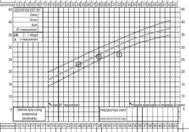
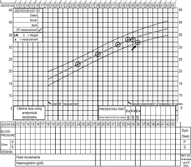
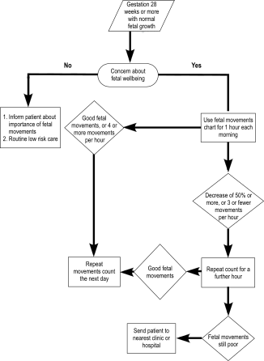
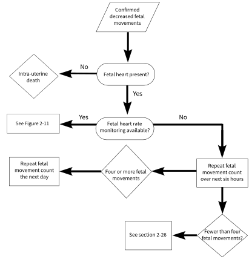
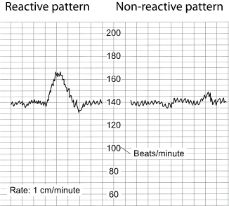
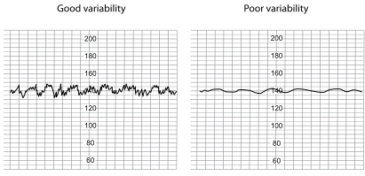
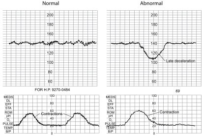
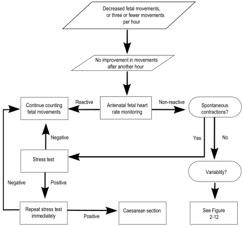
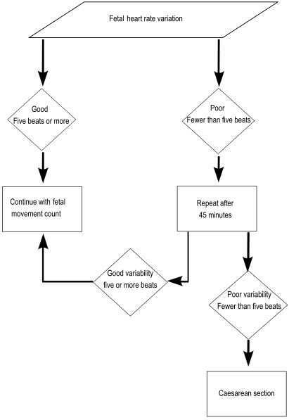

2
{:.chapter-number}

# Assessment of fetal growth and condition during pregnancy

Take the chapter test before and after you read this chapter.



## Contents
{:.non-printing}

*   [Objectives](#objectives)
*   [Introduction](#introduction)
*   [Fetal growth](#fetal-growth)
*   [Fetal movements](#fetal-movements)
*   [Antenatal fetal heart rate monitoring](#antenatal-fetal-heart-rate-monitoring)
*   [Case studies](#case-study-1)
{:.chapter-toc}

## Objectives

When you have completed this unit you should be able to:

*	Assess normal fetal growth.
*	List the causes of intra-uterine growth restriction.
*	Understand the importance of measuring the symphysis-fundus height.
*	Understand the clinical significance of fetal movements.
*	Use a fetal-movement chart.
*	Manage a patient with decreased fetal movements.
*	Understand the value of antenatal fetal heart rate monitoring.

## Introduction

During the antenatal period, both maternal and fetal growth must be continually monitored.

Individualised care will improve the accuracy of antenatal observations.

At every antenatal visit from 28 weeks gestation onwards, the wellbeing of the fetus must be assessed.

### 2-1 How can you assess the condition of the fetus during pregnancy?

The condition of the fetus before delivery is assessed by:

1.	Documenting fetal growth.
2.	Recording fetal movements.

> When managing a pregnant woman, remember that you are caring for two individuals.

## Fetal growth

### 2-2 What is normal fetal growth?

If the assessed fetal weight is within the expected range for the duration of pregnancy, then the fetal growth is regarded as normal.

> To determine fetal growth you must have an assessment of both the duration of pregnancy and the weight of the fetus.

### 2-3 When may fetal growth appear to be abnormal?

Fetal growth will appear to be abnormal when the assessed fetal weight is greater or less than that expected for the duration of pregnancy. Remember that incorrect menstrual dates are the commonest cause of an incorrect assessment of fetal growth.

### 2-4 When is intra-uterine growth restriction suspected?

Intra-uterine growth restriction is suspected when the weight of the fetus is assessed as being less than the normal range for the duration of pregnancy.

### 2-5 What maternal and fetal factors are associated with intra-uterine growth restriction?

Intra-uterine growth restriction may be associated with either maternal, fetal or placental factors:

1.	*Maternal* factors
	*	Low maternal weight, especially a low body-mass index resulting from undernutrition.
	*	Tobacco smoking.
	*	Alcohol intake.
	*	Strenuous physical work.
	*	Poor socio-economic conditions.
	*	Pre-eclampsia and chronic hypertension.

	Poor maternal weight gain is of very little value in diagnosing intra-uterine growth restriction.

2.	*Fetal* factors
	*	Multiple pregnancy.
	*	Chromosomal abnormalities, e.g. trisomy 21.
	*	Severe congenital malformations.
	*	Chronic intra-uterine infection, e.g. congenital syphilis.
3.	*Placental* factors
	*	Poor placental function (placental insufficiency) is usually due to a maternal problem such as pre-eclampsia.
	*	Smoking. Poor placental function is uncommon in a healthy woman who does not smoke.

If severe intra-uterine growth restriction is present, it is essential to look for a maternal or fetal cause. Usually a cause can be found.

Note
:	True primary placental inadequacy is an uncommon cause of intra-uterine growth restriction as placental causes are almost always secondary to an abnormality of the spiral arteries.

### 2-6 How can you estimate fetal weight?

The following methods can be used:

1.	Measure the size of the uterus on abdominal examination.
2.	Palpate the fetal head and body on abdominal examination.
3.	Measure the size of the fetus using antenatal ultrasonography (ultrasound).

### 2-7 How should you measure the size of the uterus?

1.	This is done by determining the symphysis-fundus height (SF height), which is measured in centimetres from the upper edge of the symphysis pubis to the top of the fundus of the uterus.
2.	The SF height in centimetres should be plotted against the gestational age on the SF growth curve.
3.	From 36 weeks onwards, the presenting part may descend into the pelvis and measurement of the SF height will not accurately reflect the size of the fetus. A reduction in the SF height may even be observed.

### 2-8 What is the symphysis-fundus growth curve?

The symphysis-fundus growth curve compares the SF height to the duration of pregnancy. The growth curve should preferably form part of the antenatal card. The solid line of the growth curve represents the 50th centile, and the upper and lower dotted lines, the 90th and 10th centiles, respectively. If intra-uterine growth is normal, the SF height will fall between the 10th and 90th centiles. The ability to detect abnormalities from the growth curve is much increased if the same person sees the patient at every antenatal visit.

Between 18 and 36 weeks of pregnancy, the SF height normally increases by about 1 cm a week.

> 
> 
> Figure 2-1: The symphysis-fundus growth chart
{:.figure}

### 2-9 When will the symphysis-fundus height suggest intra-uterine growth restriction?

If any of the following are found:

1.	Slow increase in uterine size until one measurement falls under the 10th centile.
2.	Three successive measurements ‘plateau’ (i.e. remain the same) without necessarily crossing below the 10th centile.
3.	A measurement which is less than that recorded two visits previously without necessarily crossing below the 10th centile.

Note that a measurement that was originally normal, but on subsequent examinations has fallen to below the 10th centile, indicates intra-uterine growth restriction and not incorrect dates.

> 
> 
> Figure 2-2: One measurement below the 10th centile
{:.figure}

> 
> 
> Figure 2-3: Three successive measurements that remain the same
{:.figure}

> 
> 
> Figure 2-4: A measurement less than that recorded two visits before
{:.figure}

### 2-10 How can you identify severe intra-uterine growth restriction?

With *severe* intra-uterine growth restriction, the difference between the actual duration of pregnancy and that suggested by plotting SF height is 4 weeks or more.

### 2-11 Does descent of the presenting part of the fetus affect your interpretation of the growth curve?

Yes. Descent of the presenting part may occur in the last 4 weeks of pregnancy. Therefore, after 36 weeks the above criteria are no longer valid, if at subsequent antenatal visits progressively less of the fetal head is palpable above the pelvic inlet.

### 2-12 What action would you take if the symphysis-fundus height measurement suggests intra-uterine growth restriction?

1.	The patient should stop smoking and rest more, while attention must be given to her diet. It may be necessary to arrange sick leave and social support for the patient.
2.	A poor diet which is low in energy (kilojoules) may cause intra-uterine growth restriction, especially in a patient with a low body-mass index. Therefore, ensure that patients with suspected intra-uterine growth restriction receive a high-energy diet. If possible, patients must be given food supplements (food parcels).
3.	Exclude pre-eclampsia as a cause.
4.	If the gestational age is 28 weeks or more, careful attention must be paid to counting the fetal movements.
5.	The patient should be followed up weekly at a level 1 hospital.

### 2-13 Which special investigation is of great value in the further management of this patient?

The patient must be referred to a fetal evaluation clinic or a level 2 hospital for a Doppler measurement of blood flow in the umbilical arteries:

1.	Good flow (low resistance) indicates good placental function. As a result the woman can receive further routine management as a low-risk patient. Spontaneous onset of labour can be allowed. Induction of labour at 38 weeks is not needed.
2.	Poor flow (high resistance) indicates poor placental function. Antenatal electronic fetal heart rate monitoring must be done. The further management will depend on the result of the monitoring.

If a Doppler measurement is not available, the patient must be managed as given in 2-14.

### 2-14 What possibilities must be considered if, after taking the above steps, there is still no improvement in the symphysis-fundus growth?

1.	Intra-uterine death must be excluded by the presence of a fetal heartbeat on auscultation.
2.	With moderate intra-uterine growth restriction and good fetal movements, the patient must be followed up weekly and delivery at 38 weeks should be considered.
3.	If the above patient also has poor social circumstances, an admission to hospital will need to be considered. This should ensure that the patient gets adequate rest, a good diet, and stops smoking.
4.	If there are decreased or few fetal move­ments, the patient should be managed as described in sections 2-25 and 2-26.
5.	When there is severe intra-uterine growth restriction, the patient must be referred to a level 2 or 3 hospital for further management.

### 2-15 What is the management of severe intra-uterine growth restriction?

1.	All patients with severe intra-uterine growth restriction must be managed in a level 2 or 3 hospital.
2.	An ultrasound examination should be done, if available, to exclude serious congenital abnormalities.
3.	If the fetus has reached viability (28 weeks or more, or 1000 g or above), antenatal fetal heart rate monitoring should be done regularly. If this suggests fetal distress, the fetus must be delivered by Caesarean section.
4.	In severe intra-uterine growth restriction, the immediate danger is of intra-uterine death, so the delivery of the fetus should be considered at 36 weeks.

## Fetal movements

### 2-16 When are fetal movements first felt?

1.	At about 20 weeks in a primigravida.
2.	At about 16 weeks in a multigravida.

### 2-17 Can fetal movements be used to determine the duration of pregnancy accurately?

No, because the gestational age when fetal movements are first felt differs a lot from patient to patient. Therefore, it is only useful as an approximate guide to the duration of pregnancy.

### 2-18 What is the value of assessing fetal movements?

Fetal movements indicate that the fetus is well. By counting the movements, a patient can monitor the condition of her fetus.

### 2-19 From what stage of pregnancy will you advise a patient to become aware of fetal movements in order to monitor the fetal condition?

From 28 weeks, because the fetus can now be regarded as potentially viable (i.e. there is a good chance that the infant will survive if delivered). All patients should be encouraged to become aware of the importance of an adequate number of fetal movements.

> Asking the patient if the fetus is moving normally on the day of the visit is an important way of monitoring the fetal wellbeing.

### 2-20 What is a fetal-movement chart?

A fetal-movement chart records the frequency of fetal movements and thereby assesses the condition of the fetus. The name ‘kick chart’ is not correct, as all movements must be counted, i.e. rolling and turning movements, as well as kicking.

### 2-21 Which patients should use a fetal-movement chart?

A fetal-movement chart need not be used routinely by all antenatal patients, but only when:

1.	There is concern about the fetal condition.
2.	A patient reports decreased fetal movements.

### 2-22 How should you advise a patient to use the fetal-movement chart?

Fetal movements should be counted and recorded on the chart over a period of an hour per day after breakfast. The patient should preferably rest on her side for this period.

### 2-23 How accurate is a fetal movement count?

A good fetal movement count always indicates a fetus in good condition. A distressed fetus will never have a good fetal movement count. However, a low count or a decrease in fetal movements may also be the result of periods of rest or sleep in a healthy fetus. The rest and sleep periods can last several hours.

Tests with electronic equipment have shown that mothers can detect fetal movements accurately. With sufficient motivation, the fetal-movement chart can be an accurate record of fetal movements. It is, therefore, not necessary to listen to the fetal heart at antenatal clinics if the patient reports an adequate number of fetal movements, or an adequate number of fetal movements has been recorded for the day.

> A uterus which increases in size normally, and an actively moving fetus, indicate that the fetus is well.

### 2-24 What is the least number of movements per hour which indicates a good fetal condition?

1.	The number of movements during an observation period is less important than a decrease in movements when compared to previous observation periods. If the number of movements is reduced by half, it suggests that the fetus may be at an increased risk of fetal distress.
2.	If a fetus normally does not move much, and the count falls to 3 or fewer per hour, the fetus may be in danger.

### 2-25 What would you advise if the fetal movements suggest that the fetal condition is not good?

1.	The mother should lie down on her side for another hour and repeat the count.
2.	If the number of fetal movements improves, there is no cause for concern.
3.	If the number of fetal movements does not improve, she should report this to her clinic or hospital as soon as possible.

Note
:	A patient who lives far away from her nearest hospital or clinic should continue with bed rest, but if the movements are 3 or fewer over a 6-hour period, then arrangements must be made for her to be moved to the nearest hospital.

### 2-26 What should you do if a patient with reduced fetal movements arrives at a clinic or hospital without a cardiotocograph (CTG machine)?

1.	Listen to the fetal heart with a fetal stethoscope or a doptone to exclude intra-uterine death.
2.	The patient should be allowed to rest and count fetal movements over a 6-hour period. With 4 or more movements during the next 6 hours, repeat the fetal movement count the next day, after breakfast. If there are 3 or fewer movements over the next 6 hours, the patient should see the responsible doctor.

The patient should be given a drink containing sugar (e.g. tea) to exclude hypoglycaemia as the cause of the decreased fetal movements.

The management of a patient with confirmed decreased fetal movements in a hospital is demonstrated in Figure 2-6.

### 2-27 What should the doctor do, in a hospital without fetal heart rate monitoring equipment, if there are decreased fetal movements?

First make sure that the fetus is potentially viable (at least 28 weeks or 1000 g). Further management will then depend on whether or not there are signs of intra-uterine growth restriction:

1.	If there *are* clinical signs of intra-uterine growth restriction:
	*	If the cervix is favourable, the membranes must be ruptured. The fetal heart rate must be very carefully monitored with a stethoscope during labour.
	*	If the cervix is unfavourable, a Caesarean section must be done.
	*	If the estimated weight of the fetus is 1500 g or more, the delivery may be managed in a level 1 or 2 hospital. However, if the estimated weight of the fetus is less than 1500 g, then the delivery must take place in a level 2 hospital with a neonatal intensive care unit, or a level 3 hospital.

	> Intra-uterine growth restriction plus decreased fetal movements is an indication for delivery.

2.	If there are *no* clinical signs of intra-uterine growth restriction:
	*	If the cervix is favourable and the pregnancy is of more than 36 weeks duration, the membranes should be ruptured. The fetal heart rate must be carefully monitored with a stethoscope during labour.
	*	If the cervix is unfavourable, and the patient is more than 42 weeks pregnant, a Caesarean section must be done.
	*	If the patient does not fall into either of the above-mentioned categories, she must be observed for a further 6 hours in hospital. If there is no improvement in the number of fetal movements, the patient must be referred to a hospital which has facilities for electronic fetal heart rate monitoring.

*Sections 2-28 to 2-38 need only be studied by nurses and doctors who work in a level 2 or 3 hospital where electronic fetal heart rate monitoring is available. All students must study sections 2-39 and 2-40.*

> 
> 
> Figure 2-5: The management of a patient with decreased fetal movements
{:.figure .large}

> 
> 
> Figure 2-6: The management of a patient with confirmed decreased fetal movements in a hospital
{:.figure .large}

## Antenatal fetal heart rate monitoring

### 2-28 What is antenatal fetal heart rate monitoring?

Antenatal (electronic) fetal heart rate monitoring assesses the condition of the fetus by documenting the pattern of heart rate changes. It is done with a cardiotocograph (the machine) which produces a cardiotocogram (the paper strip showing the uterine contractions and the fetal heart rate pattern).

Antenatal fetal heart rate monitoring is currently regarded as one of the best ways to assess the fetal condition. Fetal heart rate monitoring has the advantage that it can be done reasonably quickly, and that the results are immediately available.

Hospitals which deal with mainly low-risk patients can manage perfectly well without a cardiotocograph. There is also no evidence that antenatal fetal heart monitoring of low-risk patients does anything to improve the outcome of the pregnancy. The interpretation of fetal heart rate patterns needs considerable experience, and should only be done where the necessary expertise is available.

### 2-29 When is antenatal fetal heart rate monitoring indicated?

1.	If a patient with a viable fetus reports a decrease in fetal movements or a poor fetal movement count which does not improve when the count is repeated.
2.	If a high-risk patient has a condition for which the value of fetal movement counts has not yet been proven, e.g. insulin-dependent diabetes, preterm rupture of the membranes or severe pre-eclampsia which is being managed conservatively.

### 2-30 How do you interpret an antenatal fetal heart rate pattern?

1.	The fetal condition is good when:
	*	There is a reactive (normal) fetal heart rate pattern.
	*	There is a normal stress test.
2.	No comment can be made about the fetal condition when there is a non-reactive fetal heart rate pattern. In this case there are no contractions and, therefore, one cannot determine whether there is a normal or abnormal stress test. The variability of the heart rate will indicate whether there is fetal wellbeing or possible fetal distress.
3.	Fetal distress is present when:
	*	There is an abnormal stress test.
	*	There are repeated U-shaped decelerations at regular intervals, even though no contractions are observed.
	*	There is fetal bradycardia, with a fetal heart rate constantly below 100 beats per minute.
	*	There is a non-reactive fetal heart rate pattern with poor variability (i.e. less than 5 beats).

### 2-31 What are reactive and non-reactive heart rate patterns?

1.	The fetal heart rate pattern is said to be reactive when it has at least 2 accelerations per 10 minutes, each with an amplitude (increase in the number of beats) of 15 or more beats per minute and a duration of at least 15 seconds (Figure 2-7).
2.	In a non-reactive fetal heart rate pattern there are no accelerations.

> 
> 
> Figure 2-7: Reactive and non-reactive fetal heart rate patterns
{:.figure}

### 2-32 What is good and poor variability in the fetal heart rate?

1.	With good variability:
	*	The variability in the heart rate will be 5 beats or more, in other words, will involve 1 or more blocks in the cardiogram. Each block indicates 5 beats (Figure 2-8).
	*	Good variability indicates fetal wellbeing.
2.	With poor variability:
	*	The variability in the heart rate will be less than 5 beats, in other words, will remain within 1 block (Figure 2-8).
	*	The fetal heart monitoring must be repeated after 45 minutes.
	*	If the poor variability persists, there is fetal distress.

> 
> 
> Figure 2-8: Non-reactive fetal heart rate pattern with good and poor variability.
{:.figure}
	
### 2-33 Why must you repeat the cardiotocogram after 45 minutes in a patient with a non-reactive fetal heart rate pattern and poor variability?

1.	Because a sleeping fetus may have a non-reactive fetal heart rate pattern with poor variability.
2.	A fetus does not sleep for longer than 45 minutes. In a sleeping fetus the fetal heart rate pattern should, therefore, after 45 minutes have returned to a reactive pattern or a non-reactive pattern with good variability.
3.	A persistent non-reactive fetal heart rate pattern with poor variability is abnormal and indicates fetal distress.

### 2-34 What is a stress test?

If contractions are present during fetal heart rate monitoring in the antenatal period, then the monitoring is called a stress test. The fetal heart rate pattern can now be assessed during the stress of a uterine contraction.

### 2-35 How is a stress test interpreted?

1.	A normal stress test has no fetal heart rate decelerations during or following at least 2 contractions which last at least 30 seconds (Figure 2-9).
2.	An abnormal stress test has late decelerations associated with uterine contractions (Figure 2-9). This indicates that the fetus is distressed.

> 
> 
> Figure 2-9: Normal and abnormal stress tests
{:.figure}

### 2-36 What are the characteristics of a late deceleration?

On the cardiotocogram the trough of the deceleration occurs 30 seconds or later after the peak of the contraction (Figure 2-10).

> 
> 
> Figure 2-10: A late deceleration
{:.figure}

### 2-37 What should you do in the case of an abnormal stress test, fetal bradycardia, repeated decelerations, or a non-reactive fetal heart rate pattern with persistent poor variability?

1.	The patient is managed as an acute emergency as these fetal heart rate patterns indicate fetal distress.
2.	However, false-positive abnormal stress tests can be caused by postural hypotension or spontaneous overstimulation of the uterus. Therefore, a stress test must always be performed with the patient on her side in the 15 degrees lateral position.
3.	Whenever a fetal heart rate pattern indicates fetal distress, the cardiogram must be repeated immediately. If it is again abnormal, action should be taken as shown in Figure 2-12.
4.	A persistent fetal bradycardia is usually a preterminal event and, therefore, an indication for an immediate Caesarean section if the fetus is viable.

The use of antenatal fetal heart rate monitoring is demonstrated in Figure 2-11.

### 2-38 Why should you not immediately do a Caesarean section if the fetal heart rate pattern indicates fetal distress and the fetus is viable?

Studies have shown that a false-positive abnormal stress test can occur in up to 80% of cases (i.e. an abnormal stress test in a healthy fetus). Therefore, whenever a fetal heart pattern indicates fetal distress, the cardiogram must always be repeated immediately.

### 2-39 What is the emergency management of proven fetal distress with a viable fetus?

Immediately proceed with fetal resuscitation, as follows: 

1.	Turn the patient onto her side.
2.	Give 40% oxygen through a face mask.
3.	Start an intravenous infusion of Ringer’s lactate and give 250 µg (0.5 ml) salbutamol slowly intravenously if there are no contraindications. The 0.5 ml salbutamol must first be diluted in 9.5 ml sterile water. Monitor the maternal heart rate for tachycardia.
4.	Deliver the infant by the quickest possible route. If the patient’s cervix is 9 cm or more dilated and the head is on the pelvic floor, proceed with an assisted delivery. Otherwise, perform a Caesarean section.
5.	If the patient cannot be delivered immediately (e.g. she must be transferred to hospital) then a side-infusion of 200 ml saline with 1000 μg salbutamol given at a rate of 30 ml per hour (150 μg per hour) until no further contractions occur, or when the maternal pulse rate reaches 120 beats per minute

It is important that you know how to give fetal resuscitation, as it is a life-saving procedure when fetal distress is present, both during the antepartum period and in labour.

Note
:	Uterine contractions can also be suppressed if 30 mg nifedipine (Adalat) is given my mouth (1 capsule = 10 mg). The 3 capsules must be swallowed and not used sublingually.

### 2-40 What are the aims of fetal resuscitation?

1.	Suppressing uterine contractions and reducing uterine tone, which increases maternal blood flow to the placenta and, thereby, the oxygen supply to the fetus.
2.	Giving the mother extra oxygen which will also help the fetus.

It is, therefore, possible to improve the fetal condition temporarily while preparations are being made for the patient to be delivered, or to be transferred to the hospital.

> 
> 
> Figure 2-11: The use of antenatal fetal heart rate monitoring
{:.figure .large}

> 
> 
> Figure 2-12: The interpretation of variability when the fetal heart rate pattern is nonreactive with no spontaneous uterine contractions
{:.figure .large}

## Case study 1

A patient is seen at the antenatal clinic at 37 weeks gestation. She is clinically well and reports normal fetal movements. The SF height was 35 cm the previous week and is now 34 cm. The previous week the fetal head was ballotable above the brim of the pelvis and it is now 3/5 above the brim. The fetal heart rate is 144 beats per minute. The patient is reassured that she and her fetus are healthy, and she is asked to attend the antenatal clinic again in a week’s time.

### 1. Are you worried about the decrease in the SF height since the last antenatal visit?

No, as the fetal head is descending into the pelvis. The head was 5/5 above the brim of the pelvis and is now 3/5 above the brim.

### 2. What is your assessment of the fetal condition?

The fetus is healthy as the SF height is normal for 37 weeks and the fetus is moving normally.

### 3. What is the value of a normal fetal heart rate during the antenatal period?

The fetal heart rate is not a useful measure of the fetal condition before the onset of labour. If the fetus moves well during the antenatal period, there is no need to listen to the fetal heart.

### 4. What is the value of fetal movements during the antenatal period?

Active fetal movements, noted that day, indicate that the fetus is healthy. The patient can therefore monitor the condition of her fetus by taking note of fetal movements.

## Case study 2

You examine a 28-year-old gravida 4 para 3 patient who is 34 weeks pregnant. She has no particular problems and mentions that her fetus has moved a lot, as usual, that day. The SF height has not increased over the past three antenatal visits but only the last SF height measurement has fallen to the 10th centile. The patient is a farm labourer and she smokes.

### 1. What do the SF height measurements indicate?

They indicate that the fetus may have intra-uterine growth restriction, as the last three measurements have remained the same even though the SF height measurement has not fallen below the 10th centile.

### 2. What are the probable causes of the poor fundal growth?

Hard physical labour and smoking. Both these factors can cause intra-uterine growth restriction.

### 3. What is the possibility of fetal distress or death in the next few days?

Both these possibilities are most unlikely as the patient has reported normal fetal movements.

### 4. What can be done to improve fetal growth?

Arrangements should be made, if possible, for the patient to stop working. She must also stop smoking, get enough rest and have a good diet.

### 5. How should this patient be managed?

She must be given a fetal-movement chart and you must explain clearly to her how to use the chart. She must be placed in the high-risk category and therefore seen at the clinic every week. If the fundal growth does not improve, the patient must be hospitalised and labour should be induced at 38 weeks.

If a Doppler blood flow measurement of the umbilical arteries indicates normal placental function, routine management of a low-risk patient can be given. Induction at 38 weeks is therefore not needed.

## Case study 3

A patient, who is 36 weeks pregnant with suspected intra-uterine growth restriction, is asked to record her fetal movements on a fetal-movement chart. She reports to the clinic that her fetus, which usually moves 20 times per hour, only moved five times during an hour that morning.

### 1. What should the patient have done?

Rather than come to the clinic, she should have counted the number of fetal movements for a further hour.

### 2. What is the correct management of this patient?

She must not go home unless you are sure that her fetus is healthy. She should lie on her side and count the number of fetal movements during 1 hour. If she has not had breakfast, give her a cold drink or a cup of sweetened tea to make sure that she is not hypoglycaemic.

### 3. What should you do if the fetus moves more than 10 times during the hour?

If the number of fetal movements returns to more than half the previous count (i.e. more than 10 times per hour), she can go home and return to the clinic in a week. In addition, she must count the fetal movements daily.

### 4. What should you do if the fetus moves fewer than 10 times during the hour?

If the fetal movement count remains less than half the previous count, the patient should be transferred to a hospital where antenatal electronic fetal heart monitoring can be done. Further management will depend on the result of the monitoring.

### 5. What is the correct management if electronic fetal heart monitoring is not available?

Fetal movements should be counted for a full 6 hours. If the fetus moves fewer than four times, there is a high chance that the fetus is distressed. A doctor must now examine the patient and decide whether the fetus should be delivered and what would be the safest method of delivery.

*Case study 4 need only be attempted by those who have studied the section on antenatal fetal heart rate monitoring.*

## Case study 4

Antenatal fetal heart rate monitoring is done on a patient who is 36 weeks pregnant and who reports a decrease in the number of fetal movements. She lies flat on her back during the test. A non-reactive fetal heart rate pattern is found.

### 1. What is wrong with the method used to monitor the fetal heart rate?

The patient should not have been on her back during the test as this can cause postural hypotension resulting in a falsely abnormal fetal heart rate pattern. The patient should lie on her side with a 15 degree lateral tilt while the fetal heart rate is monitored.

### 2. Does the fetal heart rate pattern indicate fetal distress?

The condition of the fetus cannot be determined if there is a non-reactive antenatal fetal heart rate pattern. The variability must now be examined. If there is good variability (five beats or more), this indicates fetal wellbeing.

### 3. What must you do if there is poor variability (fewer than 5 beats)?

The test should be repeated after 45 minutes.

### 4. Why must you repeat the test after 45 minutes if there is a non-reactive pattern with poor variability?

A sleeping fetus may have a fetal heart rate pattern with poor variability. However, a fetus does not sleep for longer than 45 minutes. The fetal heart rate pattern in that case will therefore have reverted to normal when the test is repeated 45 minutes later.

### 5. What must you do if the test, performed 45 minutes later, continues to show poor variability?

The test now indicates fetal distress. If the fetus is viable, arrangements must be made to deliver it (see Figure 2-12).
