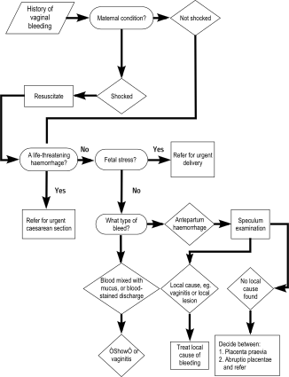

4
{:.chapter-number}

# Antepartum haemorrhage

Take the chapter test before and after you read this chapter.

50002224420533

## Objectives

When you have completed this unit you should be able to:

*	Understand why an antepartum haemorrhage should always be regarded as serious.
*	Provide the initial management of a patient presenting with an antepartum haemorrhage.
*	Diagnose the most likely cause of the bleeding from the history and examination of the patient.
*	Know how to manage a patient with a slight vaginal bleed mixed with mucus.
*	Diagnose the cause of a blood-stained vaginal discharge and provide appropriate treatment.

## Antepartum haemorrhage

### 4-1 What is an antepartum haemorrhage?

An antepartum haemorrhage is any vaginal bleeding which occurs at or after 24 weeks (estimated fetal weight at 24 weeks = 500 g) and before the birth of the infant. A bleed before 28 weeks is regarded as a threatened miscarriage as the fetus is usually considered not to be viable.

### 4-2 Why is an antepartum haemorrhage such a serious condition?

1.	The bleeding can be so severe that it can endanger the life of both the mother and fetus.
2.	Abruptio placentae is a common cause of antepartum haemorrhage and an important cause of perinatal death in many communities.

Therefore, all patients who present with an antepartum haemorrhage must be regarded as serious emergencies until a diagnosis has been made. Further management will depend on the cause of the haemorrhage.

> Any vaginal bleeding during pregnancy may be an important danger sign that must be reported immediately.

### 4-3 What advice about vaginal bleeding should you give to all patients?

Every patient must be advised that any vaginal bleeding is potentially serious and told that this complication must be reported immediately.

### 4-4 What is the management of an antepartum haemorrhage?

The management consists of 4 important steps that should be carried out in the following order:

1.	The maternal condition must be evaluated and stabilised, if necessary.
2.	The condition of the fetus must then be assessed.
3.	The cause of the haemorrhage must be diagnosed.
4.	Finally, the definitive management of an antepartum haemorrhage, depending on the cause, must be given.

It must also be decided whether the patient should be transferred for further treatment.

## The initial, emergency management of antepartum haemorrhage

The management must always be provided in the following order:

1.	Assess the condition of the patient. If the patient is shocked, she must be resuscitated immediately.
2.	Assess the condition of the fetus. If the fetus is viable but distressed, an emergency delivery is needed.
3.	Diagnose the cause of the bleeding, taking the clinical findings into account and, if necessary, the results of special investigations.

### 4-5 What symptoms and signs indicate that the patient is shocked due to blood loss?

1.	Dizziness is the commonest symptom of shock.
2.	On general examination the patient is sweating, her skin and mucous membranes are pale, and she feels cold and clammy to touch.
3.	The blood pressure is low and the pulse rate fast.

### 4-6 How should you manage a shocked patient with an antepartum haemorrhage?

When there are symptoms and signs to indicate that the patient is shocked, you must:

1.	Put up two intravenous infusions (‘drips’) with Balsol or Ringer’s lactate, to run in quickly in order to actively resuscitate the patient.
2.	Insert a Foley’s catheter into the patient’s bladder, to measure the urinary volume and to monitor further urine output.
3.	If blood is available, take blood for cross-matching at the time of putting up the intravenous infusion and order 2 or more units of blood urgently.
4.	Refer the patient to the hospital.

### 4-7 What must you do if a patient presents with a life-threatening haemorrhage?

The maternal condition takes preference over that of the fetus. The patient, therefore, is actively resuscitated while arrangements are made to transfer the patient to the hospital. At the hospital an emergency caesarean section or hysterotomy will be performed.

## Diagnosing the cause of the bleeding

### 4-8 Should you treat all patients with antepartum haemorrhage in the same way, irrespective of the amount and character of the bleed?

No. The management differs depending on whether the vaginal bleeding is diagnosed as a ‘haemorrhage’ on the one hand, or a blood-stained vaginal discharge or a ‘show’ on the other hand. A careful assessment of the amount and type of bleeding is, therefore, very important.

1.	Any vaginal bleeding at or after 24 weeks must be diagnosed as an *antepartum haemorrhage* if any of the following are present:
	*	A sanitary pad is at least partially soaked with blood.
	*	Blood runs down the patient’s legs.
	*	A clot of blood has been passed.

	> A diagnosis of a haemorrhage always suggests a serious complication.

2.	*A blood-stained vaginal discharge* will consist of a discharge mixed with a small amount of blood.
3.	A *‘show’* will consist of a small amount of blood mixed with mucus. The blood-stained vaginal discharge or ‘show’ will be present on the surface of the sanitary pad but will not soak it.

If the maternal and fetal conditions are satisfactory, then a careful speculum examination should be done to exclude a local cause of the bleeding. Do NOT perform a digital vaginal examination, as this may cause massive haemorrhage if the patient has a placenta praevia.

> Do not do a digital vaginal examination until placenta praevia has been excluded.

### 4-9 How does a speculum examination help you determine the cause of the bleeding?

1.	Bleeding through a closed cervical os confirms the diagnosis of a haemorrhage.
2.	If the cervix is a few centimetres dilated with bulging membranes, or the presenting part of the fetus is visible, this suggests that the bleed was a ‘show’.
3.	A blood-stained discharge in the vagina, with no bleeding through the cervical os, suggests a vaginitis.
4.	Bleeding from the surface of the cervix caused by contact with the speculum (i.e. contact bleeding) may indicate a cervicitis or cervical intra-epithelial neoplasia (CIN).
5.	Bleeding from a cervical tumour or an ulcer may indicate an infiltrating carcinoma.

### 4-10 Can you rely on clinical findings to determine the cause of a haemorrhage?

In many cases the history and examination of the abdomen will enable the patient to be put into one of 2 groups:

1.	Abruptio placentae (placental abruption).
2.	Placenta praevia.

There are some patients in whom no reason for the haemorrhage can be found. Such a haemorrhage is classified as an antepartum haemorrhage of unknown cause.

### 4-11 What is the most likely cause of an antepartum haemorrhage with fetal distress?

Abruptio placentae is the commonest cause of antepartum haemorrhage leading to fetal distress or an intra-uterine death. However, sometimes there may be very little or no bleeding even with a severe abruptio placentae.

> An antepartum haemorrhage with fetal distress or fetal death is almost always due to abruptio placentae.

### 4-12 What is the most likely cause of a life-threatening antepartum haemorrhage?

A placenta praevia is the most likely cause of a massive antepartum haemorrhage that threatens the woman’s life.

## Antepartum bleeding caused by abruptio placentae

### 4-13 What is abruptio placentae?

Abruptio placentae (placental abruption) means that part or all of a normally implanted placenta has separated from the uterus before delivery of the fetus. The cause of abruptio placentae remains unknown.

### 4-14 Which patients are at increased risk of abruptio placentae?

Patients with:

1.	A history of an abruptio placentae in a previous pregnancy. (There is a 10% chance of recurrence after an abruptio placentae in a previous pregnancy and a 25% chance after 2 previous pregnancies with an abruptio placentae.)
2.	Pre-eclampsia (gestational proteinuric hypertension), and to a lesser extent any of the other hypertensive disorders of pregnancy.
3.	Intra-uterine growth restriction.
4.	Cigarette smoking.
5.	Poor socio-economic conditions.
6.	A history of abdominal trauma, e.g. a fall or kick on the abdomen.

### 4-15 What symptoms point to a diagnosis of abruptio placentae?

1.	An antepartum haemorrhage which is associated with continuous, severe abdominal pain.
2.	A history that the blood is dark red with clots.
3.	Absence of fetal movements following the bleeding.

### 4-16 What do you expect to find on examination of the patient?

1.	The general examination and observations show that the patient is shocked, often out of proportion to the amount of visible blood loss.
2.	The patient usually has severe abdominal pain.
3.	The abdominal examination shows the following:
	*	The uterus is tonically contracted, hard and tender, so much so that the whole abdomen may be rigid.
	*	Fetal parts cannot be palpated.
	*	The uterus is bigger than the patient’s dates suggest.
	*	The haemoglobin concentration is low, indicating severe blood loss.
4.	The fetal heart beat is almost always absent in a severe abruptio placentae.

These symptoms and signs are typical of a severe abruptio placentae. However, abruptio placentae may present with symptoms and signs which are less obvious, making the diagnosis difficult.

> The diagnosis of severe abruptio placentae can usually be made from the history and physical examination.

## Antepartum bleeding caused by placenta praevia

### 4-17 What is placenta praevia?

Placenta praevia means that the placenta is implanted either wholly or partially in the lower segment of the uterus. The placenta may extend down to, or cover the internal os of the cervix. When the lower segment starts to form or the cervix begins to dilate, the placenta becomes partially separated and this causes maternal bleeding.

### 4-18 Which patients have the highest risk of placenta praevia?

1.	With regard to their previous obstetric history, patients who:
	*	Are grande multiparas, i.e. who are para 5 or higher.
	*	Have had a previous caesarean section.
2.	With regard to their present obstetric history, patients who:
	*	Have a multiple pregnancy.
	*	Have had a threatened abortion, especially in the second trimester.
	*	Have an abnormal presentation.

### 4-19 What in the history of the bleeding suggests the diagnosis of placenta praevia?

1.	The bleeding is painless and bright red in colour.
2.	Fetal movements are still present after the bleed.

### 4-20 What are the typical findings on physical examination in a patient with placenta praevia?

1.	General examination may show signs that the patient is shocked, and the amount of bleeding corresponds to the degree of shock. The patient’s haemoglobin concentration may be normal if done at the time of the haemorrhage or low depending on the amount of blood loss and the time interval between the haemorrage and the haemoglobin measurement. However, the fisrt bleed is usually not severe.

2.	Examination of the abdomen shows that:
	*	The uterus is soft and not tender to palpation.
	*	The uterus is not bigger than it should be for the patient’s dates.
	*	The fetal parts can be easily palpated, and the fetal heart is present.
	*	There may be an abnormal presentation. Breech presentation or oblique or transverse lies are commonly present.
	*	In cephalic presentations, the head is not engaged and is easily balottable above the pelvis.

> The diagnosis of placenta praevia can usually be made from the history and physical examination.

### 4-21 Do you think that engagement of the head can occur if there is a placenta praevia present?

No. If there is 2/5 or less of the fetal head palpable above the pelvic brim on abdominal examination, then placenta praevia can be excluded and a digital vaginal examination can be done safely. The first vaginal examination must always be done carefully.

> Two fifths or less of the fetal head palpable above the pelvic brim excludes the possibility of placenta praevia.

### 4-22 What do you understand by a ‘warning bleed’?

This is the first bleeding that occurs from a placenta praevia, when the lower segment begins to form at about 34 weeks, or even earlier.

### 4-23 Are there any investigations that can confirm the diagnosis of placenta praevia?

An ultrasound examination must be done in order to localise the placenta, if the patient is **not bleeding actively**.

### 4-24 What action should you take if a routine ultrasound examination early in pregnancy shows a placenta praevia?

In most cases, the position of the placenta moves away from the internal os of the cervix as pregnancy continues. A follow-up ultrasound examination must be arranged at a gestational age of 32 weeks.

### 4-25 What is the further management after making the diagnosis of placenta praevia?

Refer the patient to a hospital where she will be admitted and managed conservatively until 36 to 38 weeks depending on the severity of the bleed or until active bleeding starts.

### 4-26 When you refer a patient, what precautions should you take to ensure the safety of the patient in transit?

1.	A shocked patient should have 2 intravenous infusion lines with Balsol or Ringer’s lactate running in fast. A doctor should accompany the patient if possible. If not possible, a registered nurse or trained person from the ambulance service should accompany her.
2.	A patient who is no longer bleeding, should also have an intravenous infusion, and be accompanied by a registered nurse or a trained person from the ambulance service.

### 4-27 When would you suspect an antepartum haemorrhage of unknown cause?

In patients who have all the following factors:

1.	Mild antepartum haemorrhage when there are no signs of shock and the fetal condition is good.
2.	When the history and examination do not suggest a severe abruptio placentae.
3.	When local causes of bleeding have been excluded on a speculum examination.
4.	When placenta praevia has been excluded by an ultrasound examination.

## A blood-stained vaginal discharge

### 4-28 How does a patient describe a blood-stained vaginal discharge?

As a vaginal discharge mixed with a small amount of blood.

### 4-29 How does a patient describe a ‘show’?

As a slight vaginal bleed consisting of blood mixed with mucus.

### 4-30 How should you manage a patient with a history of a blood-stained vaginal discharge or a ‘show’?

1.	After getting a good history and ensuring that the condition of the fetus is satisfactory, a careful speculum examination should be done.
2.	The speculum is only inserted for 5 cm, carefully opened, and then introduced further until the cervix can be seen.
3.	Any bleeding through a closed cervical os indicates an antepartum haemorrhage.
4.	A ‘show’ is the most likely cause, if the cervix is a few centimetres dilated, with bulging membranes, or if the presenting part of the fetus is visible.
5.	A vaginitis is the most likely cause, if a blood-stained discharge is seen in the vagina.

### 4-31 How should you treat a blood-stained discharge due to vaginitis in pregnancy?

1.	Organisms identified on the cervical cytology smear are the most likely cause of the vaginitis.
2.	If no organisms are identified on the cytology smear, or a smear was not done, then Trichomonas vaginalis is most probably present.

To treat a Trichomonal vaginitis, both the patient and her partner should receive a single dose of 2 g metronidazole (Flagyl) orally.

### 4-32 Should metronidazole be used during pregnancy?

Metronidazole should not be used in the first trimester of pregnancy, unless it is absolutely necessary, as it may cause congenital abnormalities in the fetus. The patient and her partner must be warned that metronidazole causes severe nausea and vomiting if it is taken with alcohol. The risk of congenital abnormalities caused by alcohol may also be increased by metronidazole.

### 4-33 How do you manage a patient with contact bleeding?

Contact bleeding occurs if the cervix is touched (e.g. during sexual intercourse or during a vaginal examination).

1.	When there is normal cervical cytology (Papanicolaou smear), the contact bleeding is probably due to a cervicitis. If it is troublesome, the patient should be given a course of oral erythromycin 500&nbsp;mg 6&nbsp;hourly for 7 days.
2.	With abnormal cervical cytology, the patient should be correctly managed. Cervical intra-epithelial neoplasia causes contact bleeding.

### 4-34 What action should you take when the bleeding is from a cervical ulcer or tumour?

The patient most probably has an infiltrating cervical carcinoma and should be correctly managed.

## Case study 1

A patient, who is 35 weeks pregnant, presents with a history of vaginal bleeding.

### 1. Why does this patient need to be assessed urgently?

Because an antepartum haemorrhage should always be regarded as an emergency, until a cause for the bleeding is found. Thereafter, the correct management can be given.

### 2. What is the first step in the management of a patient with an antepartum haemorrhage?

The clinical condition of the patient must be assessed. Special attention must be paid to signs of shock.

### 3. What must be done if the patient has a rapid pulse rate and signs of shock?

Put up two intravenous infusions (‘drips’) with Balsol or Ringer’s lactate, to run in quickly in order to actively resuscitate the patient. Insert a Foley’s catheter into the patient’s bladder, to measure the urinary volume and to monitor further urine output. If blood is available, take blood for cross-matching at the time of putting up the intravenous infusion and order 2 or more units of blood urgently.

### 4. What is the next step in the management of a patient with an antepartum haemorrhage?

The patient needs to be referred to hospital.

## Case study 2

A patient who is 32 weeks pregnant, according to her antenatal card, presents with a history of severe vaginal bleeding and abdominal pain. The blood contains dark clots. Since the haemorrhage, the patient has not felt her fetus move. The patient’s blood pressure is 80/60 mm Hg and the pulse rate 120 beats per minute.

### 1. What is your clinical diagnosis?

The history is typical of an abruptio placentae and most likely she has an intra-uterine death.

### 2. If the clinical examination confirms the diagnosis, what should be the first step in the management of this patient?

The patient’s blood pressure and pulse rate indicate that she is shocked. Therefore, she must first be resuscitated.

### 3. What is the next step in the management of the patient, that requires urgent attention?

The patient must then be referred to hospital.

### 4. What precautions should you take to ensure the safety of the patient in transit?

A shocked patient should have 2 intravenous infusion lines with Balsol or Ringer’s lactate running in fast. A doctor should accompany the patient if possible. If not possible, a registered nurse should accompany her. A patient who is no longer bleeding, should also have an intravenous infusion, and be accompanied by a registered nurse or a trained person from the ambulance service, whenever possible.

## Case study 3

A patient is seen at the antenatal clinic at 35 weeks gestation with a breech presentation. The patient is referred to see the doctor the following week, for an external cephalic version. That evening she has a painless, bright red vaginal bleed.

### 1. What is your diagnosis?

The history and the presence of an abnormal lie suggest that the bleeding is the result of a placenta praevia.

### 2. Why is the history typical of a placenta praevia?

The bleeding is painless and bright red. She also has an abnormal lie.

### 3. What do expect to find in addition to a breech presentation on abdominal examination?

The uterus will be soft, with no tenderness and the size will be appropriate for her gestational age. The presenting part will be high.

### 4. What should be the initial management of the patient?

The condition of the mother should first be assessed and the patient resuscitated, if necessary. The patient must then be referred to hospital.

## Case study 4

A patient books for antenatal care at 30 weeks gestation. When you inform her of the danger signs during pregnancy, she says that she has had a vaginal discharge for the past 2 weeks. At times the discharge has been blood stained.

### 1. Has this patient had a antepartum haemorrhage?

The history suggests a blood-stained vaginal discharge rather than an antepartum haemorrhage.

### 2. What is the most probable cause of the blood-stained vaginal discharge?

A vaginitis. This can usually be confirmed by a speculum examination.

### 3. What is the most likely cause of a vaginitis with a blood-stained discharge?

Trichomonas vaginalis. Therefore, if no organisms were identified on the cervical cytology smear or a smear was not done, Trichomonas vaginalis is presumed to be the cause of the vaginitis.

### 4. How should you treat a patient with Trichomonal vaginitis?

A single dose of 2 g metronidazole (Flagyl) is given orally to both the patient and her partner. Both must be warned against drinking alcohol for a few days after taking metronidazole.

Figure 4-1: Flow diagram: Initial management of a patient with vaginal bleeding
{:.figure-caption}
